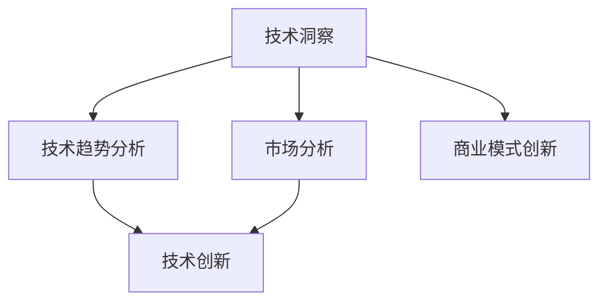

                 

关键词：技术创新、创业方法论、AI、数据科学、商业模式

> 摘要：本文将探讨如何通过技术洞察推动创新创业。我们将首先介绍技术洞察的定义及其在商业决策中的作用，然后深入探讨技术驱动的商业模式创新，并结合案例分析和数学模型，展示技术洞察在具体项目中的应用，最后讨论技术发展的未来趋势与挑战。

## 1. 背景介绍

在快速变化的科技时代，技术创新已经成为驱动企业成长和市场竞争的核心力量。创业企业尤其需要敏锐地捕捉技术趋势，将其转化为商业机会。技术洞察，作为对技术发展及其潜在商业价值的前瞻性理解，是创业者在复杂环境中作出明智决策的重要依据。

本文旨在通过以下几个部分详细阐述如何利用技术洞察进行创新创业：

1. **核心概念与联系**：介绍技术洞察的定义、相关概念及其相互关系。
2. **核心算法原理 & 具体操作步骤**：探讨技术洞察背后的算法原理及其具体应用。
3. **数学模型和公式**：展示如何通过数学模型和公式来量化技术洞察。
4. **项目实践**：通过实际案例展示技术洞察在创业中的应用。
5. **实际应用场景**：讨论技术洞察在不同领域的应用和未来展望。
6. **工具和资源推荐**：介绍用于技术洞察和创业的资源与工具。
7. **总结**：总结研究成果、未来趋势和面临的挑战。

## 2. 核心概念与联系

### 2.1 技术洞察的定义

技术洞察是指通过对技术发展动态的敏锐观察和深入分析，识别出技术进步对现有市场和商业模式可能产生的深远影响。它不仅关注技术本身的进步，更关注这些技术如何转化为商业机会，改变市场格局。

### 2.2 技术趋势与市场分析

技术趋势分析是技术洞察的重要组成部分。通过监测技术专利、研究论文、市场报告等，创业者可以了解哪些技术正在兴起，哪些领域即将出现重大变革。市场分析则帮助创业者评估这些技术趋势对目标市场的潜在影响，从而制定相应的商业战略。

### 2.3 技术创新与商业模式创新

技术创新往往伴随着商业模式创新。在互联网、人工智能、大数据等新兴技术领域，商业模式创新已成为企业突破竞争壁垒的关键。技术洞察可以帮助创业者识别那些能够颠覆传统商业模式的新技术，从而引领市场潮流。

### 2.4 Mermaid 流程图

下面是一个简单的Mermaid流程图，展示技术洞察的核心概念及其相互关系：



## 3. 核心算法原理 & 具体操作步骤

### 3.1 算法原理概述

技术洞察的核心在于数据分析和模式识别。常见的算法包括：

- **机器学习**：通过训练模型来识别数据中的规律。
- **自然语言处理**：分析文本信息，提取关键词和主题。
- **数据挖掘**：从大量数据中提取有价值的信息。

### 3.2 算法步骤详解

#### 3.2.1 数据收集

收集相关的技术文档、专利申请、市场报告等，形成数据集。

#### 3.2.2 数据预处理

清洗数据，去除噪声，标准化数据格式。

#### 3.2.3 特征提取

从数据中提取有用的特征，用于训练模型。

#### 3.2.4 模型训练

使用机器学习算法训练模型，识别技术趋势和市场变化。

#### 3.2.5 模型评估

评估模型的准确性，调整模型参数。

#### 3.2.6 应用实践

将训练好的模型应用于实际问题，如市场预测、产品规划等。

### 3.3 算法优缺点

**优点**：
- **高效性**：自动化处理大量数据。
- **准确性**：通过机器学习可以提高预测的准确性。
- **灵活性**：可以适应不断变化的数据源和技术趋势。

**缺点**：
- **数据依赖性**：数据质量直接影响算法性能。
- **复杂性**：需要专业知识进行模型训练和调优。
- **成本**：高计算资源和存储需求。

### 3.4 算法应用领域

技术洞察算法广泛应用于：

- **市场预测**：预测未来市场趋势。
- **产品规划**：指导产品研发和迭代。
- **风险分析**：评估技术风险和市场风险。
- **投资决策**：识别潜在的投资机会。

## 4. 数学模型和公式 & 详细讲解 & 举例说明

### 4.1 数学模型构建

技术洞察的一个关键数学模型是时间序列分析，它用于预测技术趋势和市场变化。

#### 4.1.1 时间序列模型

时间序列模型的基本公式为：

$$ Y_t = \alpha_0 + \alpha_1 Y_{t-1} + \alpha_2 Y_{t-2} + ... + \alpha_n Y_{t-n} + \epsilon_t $$

其中，$Y_t$ 是第 $t$ 期的数据，$\alpha_0, \alpha_1, ..., \alpha_n$ 是模型参数，$\epsilon_t$ 是误差项。

#### 4.1.2 模型优化

为了提高模型的准确性，可以使用最小二乘法进行参数优化：

$$ \alpha = (X^T X)^{-1} X^T Y $$

其中，$X$ 是特征矩阵，$Y$ 是目标变量。

### 4.2 公式推导过程

#### 4.2.1 模型拟合

拟合时间序列模型的过程可以看作是求解以下优化问题：

$$ \min_{\alpha} \sum_{t=1}^{n} (Y_t - \alpha_0 - \alpha_1 Y_{t-1} - \alpha_2 Y_{t-2} - ... - \alpha_n Y_{t-n})^2 $$

通过求导并令导数为零，可以得到参数的最优解。

#### 4.2.2 模型评估

模型评估通常使用均方误差（MSE）来衡量：

$$ MSE = \frac{1}{n} \sum_{t=1}^{n} (Y_t - \alpha_0 - \alpha_1 Y_{t-1} - \alpha_2 Y_{t-2} - ... - \alpha_n Y_{t-n})^2 $$

### 4.3 案例分析与讲解

#### 4.3.1 案例背景

假设我们要预测某新兴技术A的市场接受度，使用时间序列模型进行分析。

#### 4.3.2 数据收集

收集过去5年的市场数据，包括技术A的用户数量、市场规模等。

#### 4.3.3 数据预处理

对数据进行清洗和标准化处理。

#### 4.3.4 特征提取

提取用户数量和市场规模的滞后项作为特征。

#### 4.3.5 模型训练

使用训练集数据训练时间序列模型。

#### 4.3.6 模型评估

使用验证集数据评估模型准确性，调整模型参数。

#### 4.3.7 预测结果

使用训练好的模型对未来的市场变化进行预测。

## 5. 项目实践：代码实例和详细解释说明

### 5.1 开发环境搭建

在本地计算机上安装Python环境，以及相关的数据分析和机器学习库，如Pandas、Scikit-learn等。

### 5.2 源代码详细实现

以下是一个简单的Python代码示例，用于训练时间序列模型并进行预测：

```python
import pandas as pd
from sklearn.linear_model import LinearRegression
from sklearn.model_selection import train_test_split
from sklearn.metrics import mean_squared_error

# 数据收集与预处理
data = pd.read_csv('data.csv')
data = data.dropna()

# 特征提取
data['Lag1'] = data['UserCount'].shift(1)
data['Lag2'] = data['UserCount'].shift(2)
data = data.dropna()

# 模型训练
X = data[['Lag1', 'Lag2']]
y = data['UserCount']
X_train, X_test, y_train, y_test = train_test_split(X, y, test_size=0.2, random_state=42)

model = LinearRegression()
model.fit(X_train, y_train)

# 模型评估
y_pred = model.predict(X_test)
mse = mean_squared_error(y_test, y_pred)
print(f'MSE: {mse}')

# 预测结果
future_data = pd.DataFrame({'Lag1': [data['UserCount'].iloc[-1]], 'Lag2': [data['UserCount'].iloc[-2]]})
future_pred = model.predict(future_data)
print(f'Predicted UserCount: {future_pred[0]}')
```

### 5.3 代码解读与分析

- **数据收集与预处理**：从CSV文件中读取数据，并进行清洗，去除缺失值。
- **特征提取**：添加滞后项作为特征，用于训练模型。
- **模型训练**：使用线性回归模型进行训练。
- **模型评估**：使用测试集评估模型准确性。
- **预测结果**：使用训练好的模型对未来的用户数量进行预测。

## 6. 实际应用场景

技术洞察在不同领域都有广泛的应用：

- **金融领域**：使用技术洞察进行市场预测和风险管理。
- **医疗领域**：利用技术洞察指导药物研发和新疗法发现。
- **零售领域**：通过技术洞察优化供应链和库存管理。
- **制造领域**：利用技术洞察提高生产效率和质量控制。

未来，随着人工智能、大数据和物联网等技术的发展，技术洞察的应用领域将更加广泛，为创业创新提供更多可能性。

### 6.4 未来应用展望

随着技术的不断发展，技术洞察在以下几个领域具有巨大的应用潜力：

- **个性化服务**：通过技术洞察提供更加精准的用户服务。
- **智能制造**：利用技术洞察实现智能化生产和管理。
- **健康医疗**：通过技术洞察提高疾病诊断和治疗的准确性。
- **能源管理**：利用技术洞察优化能源消耗和节约成本。

## 7. 工具和资源推荐

### 7.1 学习资源推荐

- **在线课程**：《深度学习》、《机器学习》、《大数据分析》等。
- **书籍**：《Python数据分析》、《机器学习实战》、《人工智能：一种现代方法》。
- **论文库**：谷歌学术、IEEE Xplore、ACM Digital Library等。

### 7.2 开发工具推荐

- **编程环境**：Jupyter Notebook、PyCharm、Visual Studio Code。
- **数据分析库**：Pandas、NumPy、SciPy。
- **机器学习库**：Scikit-learn、TensorFlow、PyTorch。

### 7.3 相关论文推荐

- **前沿研究论文**：Nature、Science、IEEE Transactions等。
- **经典论文**：《深度学习》、《统计学习方法》、《模式识别与机器学习》。

## 8. 总结：未来发展趋势与挑战

### 8.1 研究成果总结

本文探讨了技术洞察在创新创业中的重要作用，分析了技术洞察的算法原理和应用领域，并通过实际案例展示了技术洞察在项目实践中的应用。

### 8.2 未来发展趋势

随着人工智能、大数据和物联网等技术的发展，技术洞察将在更多领域得到应用，为创业创新提供更多可能性。

### 8.3 面临的挑战

技术洞察在应用过程中面临数据质量、计算资源、模型复杂性等挑战，需要不断优化算法和提升技术水平。

### 8.4 研究展望

未来研究应重点关注技术洞察的可解释性、自动化程度和跨领域应用，为创业创新提供更加有效的工具和方法。

## 9. 附录：常见问题与解答

### 9.1 什么是技术洞察？

技术洞察是对技术发展动态的敏锐观察和深入分析，旨在识别技术进步对商业和市场的潜在影响。

### 9.2 技术洞察如何应用于创业？

技术洞察可以帮助创业者预测市场趋势，指导产品研发，优化商业模式，提高市场竞争力。

### 9.3 技术洞察算法有哪些？

常见的技术洞察算法包括机器学习、自然语言处理、数据挖掘等。

### 9.4 如何评估技术洞察的准确性？

可以通过模型评估指标（如均方误差）和实际应用效果来评估技术洞察的准确性。

### 9.5 技术洞察的未来发展趋势是什么？

随着人工智能、大数据和物联网等技术的发展，技术洞察将在更多领域得到应用，为创业创新提供更多可能性。

----------------------------------------------------------------

**作者：禅与计算机程序设计艺术 / Zen and the Art of Computer Programming**

