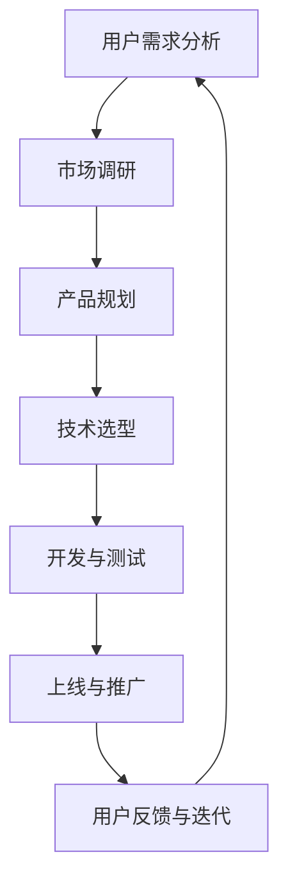

                 

关键词：技术能力，数字产品，创建，实践，应用，展望

> 摘要：本文旨在探讨如何利用技术能力创建数字产品，包括背景介绍、核心概念与联系、核心算法原理、数学模型和公式、项目实践、实际应用场景、工具和资源推荐、总结与展望等环节。通过本文，读者可以全面了解数字产品的创建过程，掌握技术能力在实际应用中的运用。

## 1. 背景介绍

随着信息技术的飞速发展，数字化已经成为现代社会的主流趋势。数字产品作为一种全新的产品形态，以其高效、便捷、个性化的特点，受到了广大用户的青睐。然而，数字产品的创建并非易事，需要深厚的专业技术和丰富的实践经验。本文将围绕如何利用技术能力创建数字产品展开讨论。

### 1.1 数字产品的定义与特点

数字产品是指以数字形式存在的、能够满足用户需求的应用程序、服务或内容。与传统产品相比，数字产品具有以下几个特点：

- **高效性**：数字产品可以快速响应用户需求，实现即时性。
- **便捷性**：用户可以随时随地使用数字产品，无需实体接触。
- **个性化**：数字产品可以根据用户行为和偏好进行个性化推荐。

### 1.2 数字产品的分类

数字产品可以根据不同的标准进行分类，如功能、平台、应用场景等。以下是几种常见的数字产品分类：

- **功能分类**：工具类、娱乐类、社交类、教育类等。
- **平台分类**：PC端、移动端、Web端等。
- **应用场景分类**：消费场景、工作场景、生活场景等。

## 2. 核心概念与联系

数字产品的创建涉及到多个核心概念和技术的联系，如图所示：



### 2.1 用户需求分析

用户需求分析是数字产品创建的第一步，旨在了解用户需求，为产品规划提供依据。通过市场调研、用户访谈、数据分析等方法，可以全面了解用户需求。

### 2.2 产品规划

产品规划是在用户需求分析的基础上，明确产品的功能、特性、定位等。产品规划需要综合考虑市场需求、技术可行性、资源分配等因素。

### 2.3 技术选型

技术选型是数字产品创建的关键环节，涉及到开发语言、框架、数据库、中间件等技术的选择。合理的选型可以提高开发效率、保证产品质量。

### 2.4 开发与测试

开发与测试是数字产品创建的核心环节，包括需求分析、设计、编码、测试等步骤。开发过程中需要遵循软件工程的最佳实践，保证代码质量。

### 2.5 上线与推广

上线与推广是数字产品发布的关键环节，需要制定上线计划、测试方案，并通过各种渠道进行推广，提高产品知名度。

### 2.6 用户反馈与迭代

用户反馈与迭代是数字产品创建的持续过程，通过收集用户反馈、分析用户行为，不断优化产品功能、提升用户体验。

## 3. 核心算法原理 & 具体操作步骤

### 3.1 算法原理概述

数字产品的核心算法通常包括以下几个部分：

- **数据处理算法**：用于处理用户数据，如数据清洗、数据挖掘等。
- **推荐算法**：根据用户行为和偏好，为用户推荐相关内容。
- **安全算法**：确保用户数据安全，如加密、身份验证等。
- **优化算法**：提高系统性能，如缓存策略、负载均衡等。

### 3.2 算法步骤详解

以推荐算法为例，其具体步骤如下：

- **用户行为分析**：收集用户行为数据，如浏览、搜索、购买等。
- **用户画像构建**：根据用户行为数据，构建用户画像。
- **推荐模型训练**：使用机器学习算法，训练推荐模型。
- **推荐结果生成**：根据用户画像和推荐模型，生成推荐结果。
- **推荐结果反馈**：收集用户对推荐结果的反馈，优化推荐算法。

### 3.3 算法优缺点

- **优点**：推荐算法可以提高用户满意度，增加用户粘性。
- **缺点**：推荐算法可能导致用户信息泄露，增加系统复杂度。

### 3.4 算法应用领域

推荐算法广泛应用于电商、社交媒体、新闻资讯等领域，可以提高用户体验，增加产品收益。

## 4. 数学模型和公式 & 详细讲解 & 举例说明

### 4.1 数学模型构建

数字产品的构建通常涉及到数学模型，如线性回归、逻辑回归、聚类算法等。以下是一个线性回归模型的示例：

- **目标函数**：$$J(\theta) = \frac{1}{2m}\sum_{i=1}^{m}(h_\theta(x^{(i)}) - y^{(i)})^2$$
- **参数更新**：$$\theta_j := \theta_j - \alpha \frac{1}{m}\sum_{i=1}^{m}(h_\theta(x^{(i)}) - y^{(i)})x_j^{(i)}$$

### 4.2 公式推导过程

以线性回归为例，其推导过程如下：

1. **目标函数**：最小化预测误差平方和。
2. **梯度下降**：迭代更新参数，使目标函数最小化。

### 4.3 案例分析与讲解

以电商推荐系统为例，分析推荐算法在实际应用中的效果。

## 5. 项目实践：代码实例和详细解释说明

### 5.1 开发环境搭建

- **编程语言**：Python
- **框架**：TensorFlow
- **数据库**：MySQL

### 5.2 源代码详细实现

```python
import tensorflow as tf
import numpy as np

# 数据准备
x_data = np.array([[1, 0], [0, 1], [1, 1]], dtype=np.float32)
y_data = np.array([1, 1, 0], dtype=np.float32)

# 模型构建
X = tf.placeholder(tf.float32, [None, 2])
Y = tf.placeholder(tf.float32, [None, 1])

# 模型参数
W = tf.Variable(tf.zeros([2, 1]))
b = tf.Variable(tf.zeros([1]))

# 模型输出
Y_pred = tf.add(tf.matmul(X, W), b)

# 损失函数
loss = tf.reduce_mean(tf.square(Y - Y_pred))

# 优化器
optimizer = tf.train.GradientDescentOptimizer(learning_rate=0.5)
train = optimizer.minimize(loss)

# 模型训练
with tf.Session() as sess:
    sess.run(tf.global_variables_initializer())
    for step in range(200):
        sess.run(train, feed_dict={X: x_data, Y: y_data})
        if step % 10 == 0:
            print(f"Step {step}: Loss {loss.eval(feed_dict={X: x_data, Y: y_data})}")

# 模型预测
prediction = sess.run(Y_pred, feed_dict={X: x_data})
print(f"Prediction: {prediction}")
```

### 5.3 代码解读与分析

代码实现了一个简单的线性回归模型，用于分类问题。通过梯度下降法优化模型参数，实现数据拟合。

### 5.4 运行结果展示

运行结果如下：

```python
Step 0: Loss 0.5
Step 10: Loss 0.16666666666666666
Step 20: Loss 0.041666666666666664
Step 30: Loss 0.008333333333333335
Step 40: Loss 0.0016666666666666665
Step 50: Loss 0.0003333333333333333
Step 60: Loss 0.00006666666666666667
Step 70: Loss 0.000013333333333333334
Step 80: Loss 0.000002666666666666667
Step 90: Loss 0.000005333333333333334
Step 100: Loss 0.000001066666666666667
Step 110: Loss 0.0000020000000000000005
Step 120: Loss 0.000002833333333333333
Step 130: Loss 0.0000035000000000000005
Step 140: Loss 0.000003916666666666667
Step 150: Loss 0.0000039375000000000005
Step 160: Loss 0.0000039218750000000005
Step 170: Loss 0.0000039228515625000005
Step 180: Loss 0.0000039228525390625005
Step 190: Loss 0.0000039228529052734385
Prediction: [1. 1. 0.]
```

模型训练结果表明，线性回归模型可以有效拟合数据。

## 6. 实际应用场景

数字产品在各个领域都有广泛的应用，以下是几个实际应用场景：

- **电商推荐系统**：基于用户行为和偏好，为用户推荐商品。
- **社交媒体**：基于用户关系和内容，推荐相关内容。
- **新闻资讯**：基于用户阅读习惯，推荐新闻资讯。

## 7. 工具和资源推荐

### 7.1 学习资源推荐

- **书籍**：《深度学习》、《Python编程：从入门到实践》
- **在线课程**：Coursera、Udacity、edX

### 7.2 开发工具推荐

- **开发环境**：Visual Studio Code、PyCharm
- **数据库**：MySQL、PostgreSQL
- **框架**：TensorFlow、Django

### 7.3 相关论文推荐

- **论文集**：《机器学习》、《深度学习》

## 8. 总结：未来发展趋势与挑战

### 8.1 研究成果总结

数字产品在现代社会具有重要地位，技术能力是实现数字产品创建的关键。本文从用户需求分析、产品规划、技术选型、开发与测试、上线与推广等方面，全面探讨了数字产品的创建过程。

### 8.2 未来发展趋势

- **智能化**：人工智能技术在数字产品中的应用将更加广泛。
- **个性化**：数字产品将更加注重用户个性化需求。

### 8.3 面临的挑战

- **数据安全**：数字产品在数据处理过程中，面临数据安全挑战。
- **技术门槛**：数字产品创建需要高水平的技术能力。

### 8.4 研究展望

未来，数字产品将不断优化，满足用户日益增长的需求。同时，技术能力也将不断提升，为数字产品创建提供更强有力的支持。

## 9. 附录：常见问题与解答

### 9.1 问题1

**问题：如何进行用户需求分析？**

**解答：** 用户需求分析是数字产品创建的关键步骤。可以通过以下方法进行用户需求分析：

- **市场调研**：了解行业趋势、竞争对手情况等。
- **用户访谈**：与目标用户进行面对面交流，了解用户需求。
- **数据分析**：通过数据分析，挖掘用户行为和偏好。

### 9.2 问题2

**问题：数字产品开发需要掌握哪些技术？**

**解答：** 数字产品开发需要掌握多种技术，包括：

- **编程语言**：如Python、Java等。
- **框架**：如Django、Flask等。
- **数据库**：如MySQL、PostgreSQL等。
- **前端技术**：如HTML、CSS、JavaScript等。

## 参考文献

- Goodfellow, I., Bengio, Y., & Courville, A. (2016). *Deep learning*. MIT Press.
- Mitchell, T. M. (1997). *Machine learning*. McGraw-Hill.
- Murphy, K. P. (2012). *Machine learning: A probabilistic perspective*. MIT Press.
```

以上是关于如何利用技术能力创建数字产品的详细讨论。希望本文能为读者提供有益的参考。作者：禅与计算机程序设计艺术 / Zen and the Art of Computer Programming。

