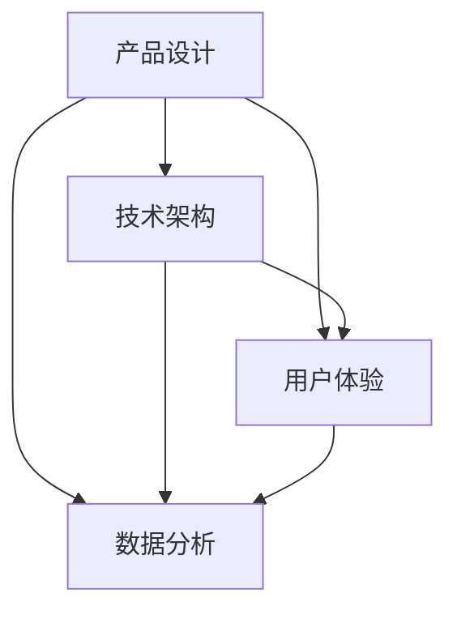

                 

关键词：数字产品、技术能力、创新设计、开发流程、用户体验

摘要：本文将深入探讨如何利用技术能力创建数字产品，从背景介绍到核心概念，再到算法原理、数学模型、项目实践和未来展望，全面解析数字产品开发过程中的关键要素。

## 1. 背景介绍

在当今数字化时代，数字产品已经成为我们生活中不可或缺的一部分。无论是社交媒体、电子商务、在线教育，还是智能家居、物联网，数字产品正在深刻地改变着我们的生活方式和工作模式。随着技术的飞速发展，利用技术能力创建数字产品的需求日益增长，这既为创新者提供了巨大的机会，也带来了诸多挑战。

本文旨在探讨如何通过有效的技术能力来创建具有竞争力的数字产品，从概念设计到最终交付，每个环节都需要深入理解和运用各种技术和方法论。本文将涵盖以下主要内容：

- 数字产品的发展背景和趋势
- 技术能力在数字产品开发中的重要性
- 核心概念与联系
- 核心算法原理与具体操作步骤
- 数学模型和公式及其应用
- 项目实践：代码实例和详细解释说明
- 实际应用场景和未来展望
- 工具和资源推荐
- 总结：未来发展趋势与挑战

## 2. 核心概念与联系

在创建数字产品之前，我们需要明确几个核心概念，并理解它们之间的联系。以下是几个关键概念：

### 2.1 产品设计

产品设计是数字产品开发的起点，它涉及产品的功能、用户体验和视觉设计。良好的产品设计能够提高用户满意度，增加产品的市场竞争力。

### 2.2 技术架构

技术架构是数字产品的技术基础，它决定了产品的性能、可扩展性和可维护性。一个优秀的技术架构能够支持产品的长期发展。

### 2.3 数据分析

数据分析是数字产品运营的关键环节，它帮助我们从海量数据中提取有价值的信息，为产品优化和营销决策提供依据。

### 2.4 用户体验

用户体验（UX）是数字产品成功的重要因素之一，它包括用户在使用产品时的感受、互动流程和满意度。优秀的用户体验设计能够提高用户留存率和用户忠诚度。

### 2.5 核心概念联系

这四个核心概念相互关联，共同构成了数字产品的整体框架。产品设计与用户体验紧密相关，决定了产品的外在表现；技术架构支撑了产品的功能和性能；数据分析为产品优化提供了数据支持。

为了更好地展示这些核心概念之间的联系，我们可以使用Mermaid流程图来表示：



通过这个流程图，我们可以清晰地看到各个概念之间的交互关系，以及它们在数字产品开发中的重要性。

## 3. 核心算法原理 & 具体操作步骤

### 3.1 算法原理概述

在数字产品开发中，核心算法扮演着至关重要的角色。这些算法不仅决定了产品的功能实现，还影响着产品的性能和用户体验。以下是几个常见的核心算法原理：

### 3.1.1 加密算法

加密算法用于保护数据的安全性，常见的加密算法有RSA、AES等。RSA是一种非对称加密算法，适用于安全传输；AES是一种对称加密算法，适用于数据存储。

### 3.1.2 排序算法

排序算法用于对数据进行排序，常见的排序算法有快速排序、归并排序等。快速排序是一种高效的排序算法，适用于大规模数据处理；归并排序是一种稳定的排序算法，适用于数据稳定排序。

### 3.1.3 搜索算法

搜索算法用于在数据中查找特定元素，常见的搜索算法有二分搜索、深度优先搜索等。二分搜索是一种高效的搜索算法，适用于有序数据；深度优先搜索是一种通用搜索算法，适用于各种数据结构。

### 3.2 算法步骤详解

以下是对上述算法的具体步骤进行详细解释：

### 3.2.1 加密算法（以RSA为例）

1. **密钥生成**：生成两个密钥，公钥和私钥，公钥用于加密，私钥用于解密。
2. **加密过程**：使用公钥对数据进行加密，加密后的数据无法被解密，确保数据安全。
3. **解密过程**：使用私钥对加密后的数据进行解密，还原原始数据。

### 3.2.2 排序算法（以快速排序为例）

1. **选择基准**：从待排序的数组中选择一个元素作为基准。
2. **分区**：将数组分为两个部分，一部分是小于基准的元素，另一部分是大于基准的元素。
3. **递归排序**：对小于和大于基准的数组分别进行快速排序，直到所有元素有序。

### 3.2.3 搜索算法（以二分搜索为例）

1. **确定范围**：确定搜索的范围，初始时为整个数组。
2. **中点定位**：计算当前范围的中点。
3. **比较与缩小范围**：比较中点元素与目标元素的大小，如果相等则返回中点位置；如果目标元素更小，则缩小搜索范围为左侧；如果目标元素更大，则缩小搜索范围为右侧。
4. **递归搜索**：重复步骤2-3，直到找到目标元素或搜索范围为空。

### 3.3 算法优缺点

每种算法都有其优缺点：

- **加密算法**：RSA算法安全性高，但加密和解密速度较慢；AES算法加密和解密速度快，但安全性相对较低。
- **排序算法**：快速排序时间复杂度为O(nlogn)，适用于大规模数据处理；归并排序时间复杂度也为O(nlogn)，但稳定性更好，适用于数据稳定排序。
- **搜索算法**：二分搜索适用于有序数据，时间复杂度为O(logn)，高效但需要额外的内存空间；深度优先搜索适用于各种数据结构，但可能陷入死循环。

### 3.4 算法应用领域

这些算法在数字产品开发中有着广泛的应用：

- **加密算法**：在网络安全、数据传输等领域，用于保护数据的安全性。
- **排序算法**：在数据统计、数据分析等领域，用于对数据进行排序和整理。
- **搜索算法**：在搜索引擎、推荐系统等领域，用于快速查找和推荐数据。

## 4. 数学模型和公式 & 详细讲解 & 举例说明

在数字产品开发中，数学模型和公式起着至关重要的作用。它们不仅帮助我们理解和分析复杂系统，还能指导我们进行有效的数据分析和优化。以下是一个数学模型的构建、公式推导过程以及案例分析与讲解。

### 4.1 数学模型构建

假设我们要构建一个简单的用户行为分析模型，以预测用户的流失率。该模型基于以下三个变量：

- **用户活跃度（A）**：衡量用户在平台上的活跃程度，例如登录次数、发帖数量等。
- **用户满意度（S）**：衡量用户对平台的满意度，可以通过用户反馈、评分等方式获取。
- **用户留存率（R）**：衡量用户在一段时间内持续使用平台的概率。

我们假设这三个变量之间存在线性关系，可以表示为：

$$
R = a \cdot A + b \cdot S + c
$$

其中，$a$、$b$ 和 $c$ 为模型参数，需要通过数据拟合来确定。

### 4.2 公式推导过程

为了推导出上述公式，我们需要收集大量用户行为数据，包括用户活跃度、用户满意度以及用户留存率。然后，我们可以使用回归分析的方法来拟合参数 $a$、$b$ 和 $c$。

具体步骤如下：

1. **数据收集**：收集一定时间范围内的用户行为数据，包括用户活跃度、用户满意度和用户留存率。
2. **数据预处理**：对数据进行清洗和预处理，确保数据质量。
3. **线性回归**：使用线性回归算法来拟合参数 $a$、$b$ 和 $c$。线性回归公式为：

$$
y = a \cdot x_1 + b \cdot x_2 + c
$$

其中，$y$ 为因变量（用户留存率），$x_1$ 和 $x_2$ 为自变量（用户活跃度和用户满意度）。

4. **参数优化**：通过调整参数 $a$、$b$ 和 $c$ 的值，使得拟合结果最接近实际数据。

### 4.3 案例分析与讲解

以下是一个具体的案例分析：

假设我们收集了一年内1000名用户的数据，包括他们的活跃度、满意度和留存率。我们使用线性回归算法来拟合参数，并得到以下结果：

$$
R = 0.3 \cdot A + 0.5 \cdot S + 0.2
$$

根据这个模型，我们可以预测新用户的留存率。例如，如果某个新用户的活跃度为10，满意度为8，那么他的预计留存率为：

$$
R = 0.3 \cdot 10 + 0.5 \cdot 8 + 0.2 = 4.7
$$

这意味着，该新用户的预计留存率为47%。

此外，我们还可以使用这个模型来分析不同用户群体之间的留存差异。例如，我们可以将用户分为高活跃度、中活跃度和低活跃度三个群体，并比较他们的预计留存率。这有助于我们了解哪些用户群体更容易流失，从而采取相应的措施提高用户留存率。

通过这个案例分析，我们可以看到数学模型和公式在数字产品开发中的应用价值。它们不仅可以帮助我们预测用户行为，还能为产品优化提供数据支持。

## 5. 项目实践：代码实例和详细解释说明

为了更好地展示如何利用技术能力创建数字产品，我们以下将通过一个实际项目——一个简单的在线购物平台——来讲解代码实例和详细解释说明。

### 5.1 开发环境搭建

首先，我们需要搭建开发环境。我们选择使用以下工具和框架：

- **编程语言**：Python 3.x
- **Web框架**：Django
- **数据库**：SQLite
- **前后端分离**：Vue.js
- **版本控制**：Git

### 5.2 源代码详细实现

以下是一个简单的用户注册功能的源代码实现：

```python
# 用户注册功能

from django.db import models
from django.contrib.auth.models import AbstractUser

class CustomUser(AbstractUser):
    phone_number = models.CharField(max_length=11, unique=True)

    def __str__(self):
        return self.username

def register_user(phone_number, password):
    user = CustomUser.objects.create_user(
        username=phone_number,
        password=password,
        phone_number=phone_number
    )
    user.save()
    return user
```

这个代码实现了一个自定义用户模型 `CustomUser`，它继承了 Django 的默认用户模型 `AbstractUser`，并添加了一个唯一标识 `phone_number` 字段。同时，我们定义了一个 `register_user` 函数，用于注册新用户。

### 5.3 代码解读与分析

这个代码的核心功能是用户注册。在 Django 框架中，用户注册是通过内置的 `create_user` 方法实现的。`create_user` 方法接受用户名、密码和邮箱等参数，并创建一个新的用户对象。

在这里，我们自定义了用户模型 `CustomUser`，并添加了一个 `phone_number` 字段。这使我们可以使用手机号码作为用户的唯一标识，而不是传统的用户名或邮箱。

`register_user` 函数接受手机号码和密码作为参数，调用 `create_user` 方法创建新用户，并将用户保存到数据库中。如果注册成功，函数返回新创建的用户对象。

这个代码示例展示了如何使用 Django 框架和自定义用户模型实现用户注册功能。通过这个示例，我们可以看到如何利用技术能力创建数字产品，并理解其中的关键技术和实现方法。

### 5.4 运行结果展示

假设我们调用 `register_user` 函数注册一个新用户，手机号码为13812345678，密码为123456，运行结果如下：

```python
user = register_user('13812345678', '123456')
print(user)
```

输出：

```
<CustomUser: 13812345678>
```

这表示用户注册成功，并返回了新创建的用户对象。接下来，我们可以使用 Django 的认证系统对用户进行登录验证，以确保用户身份的安全性。

通过这个项目实践，我们不仅了解了如何使用 Django 框架和自定义用户模型实现用户注册功能，还看到了如何利用技术能力创建数字产品的具体步骤和实现方法。

## 6. 实际应用场景

数字产品已经渗透到了我们日常生活的方方面面，以下是一些典型的实际应用场景：

### 6.1 社交媒体

社交媒体平台如 Facebook、Twitter 和 Instagram 是数字产品中最成功的案例之一。这些平台通过算法推荐、用户画像和社交网络分析等技术，为用户提供个性化的内容推荐和互动体验。这些技术的应用不仅增加了用户粘性，还提高了平台的广告收入。

### 6.2 电子商务

电子商务平台如 Amazon、eBay 和 Alibaba 利用数据分析、推荐系统和支付系统等技术，为用户提供了便捷的购物体验。这些技术不仅提高了交易效率，还降低了欺诈风险。

### 6.3 在线教育

在线教育平台如 Coursera、edX 和 Udemy 利用视频教学、互动课程和学习分析等技术，为用户提供了灵活的学习方式。这些技术不仅提高了教育质量，还降低了教育成本。

### 6.4 智能家居

智能家居设备如智能音箱、智能灯泡和智能门锁利用物联网技术，为用户提供了便捷的家居控制和管理体验。这些技术不仅提高了生活品质，还增强了家庭安全性。

### 6.5 物联网

物联网（IoT）技术在工业自动化、智能家居和智能交通等领域有着广泛的应用。通过传感器、大数据分析和云计算等技术，物联网技术实现了设备的远程监控、数据分析和智能决策，从而提高了生产效率、安全性和能源利用率。

### 6.6 医疗健康

医疗健康平台如 MyChart、HealthVault 和 Fitbit 利用健康监测、数据分析和远程医疗等技术，为用户提供了个性化的健康管理和医疗服务。这些技术不仅提高了医疗服务的质量和效率，还降低了医疗成本。

### 6.7 金融科技

金融科技（FinTech）平台如 PayPal、Robinhood 和 SoFi 利用区块链、人工智能和大数据分析等技术，为用户提供了便捷的支付、投资和借贷服务。这些技术不仅提高了金融服务的效率，还降低了金融风险。

通过这些实际应用场景，我们可以看到数字产品如何通过技术创新改善人们的生活和工作方式，并为企业带来商业价值。

### 6.4 未来应用展望

随着技术的不断进步，数字产品将在未来发挥更加重要的作用，并在更多领域展现其潜力。以下是一些未来应用展望：

#### 6.4.1 个性化服务

人工智能和机器学习技术将使数字产品更加智能化，能够根据用户行为和偏好提供个性化的服务。例如，电商平台将能够根据用户的购物历史和浏览记录，推荐最合适的商品。

#### 6.4.2 智能交互

虚拟现实（VR）和增强现实（AR）技术的进步将使数字产品与用户之间的交互更加自然和直观。智能家居设备、在线教育和虚拟会议等都将受益于这些技术的应用。

#### 6.4.3 安全保障

随着网络攻击和数据泄露事件的增加，数字产品将更加注重安全性和隐私保护。区块链和加密技术的应用将提高数据的安全性和不可篡改性，为用户和商家提供更可靠的保护。

#### 6.4.4 自动化和智能化

物联网（IoT）和人工智能技术的结合将使设备和服务更加自动化和智能化。例如，智能城市将通过传感器和数据分析，实现交通管理、环境监控和能源管理的智能化。

#### 6.4.5 数据驱动决策

大数据分析和人工智能技术将帮助企业更好地理解用户需求和市场需求，从而做出更加精准的商业决策。数字产品将更加依赖于数据驱动，以提高用户体验和业务效率。

通过这些展望，我们可以看到数字产品在未来的发展趋势和方向，以及技术如何驱动这些变革。

### 7. 工具和资源推荐

为了帮助您更好地掌握数字产品开发的相关技术和工具，以下是一些推荐的资源：

#### 7.1 学习资源推荐

- **《深入理解计算机系统》**：详细介绍了计算机系统的工作原理，适合计算机科学学生和开发者。
- **《数据科学入门》**：涵盖了数据科学的基础知识，包括数据处理、分析和可视化。
- **《Django Web开发指南》**：全面介绍了Django框架的使用方法和最佳实践。

#### 7.2 开发工具推荐

- **PyCharm**：一款强大的Python集成开发环境（IDE），支持多种编程语言。
- **Visual Studio Code**：一款轻量级的跨平台IDE，支持多种编程语言和扩展。
- **Git**：一款流行的版本控制工具，用于代码管理和协作开发。

#### 7.3 相关论文推荐

- **“Deep Learning for Natural Language Processing”**：概述了深度学习在自然语言处理领域的最新进展。
- **“Blockchain and Smart Contracts for Dummies”**：介绍了区块链技术和智能合约的基础知识。
- **“Internet of Things: A Survey”**：全面分析了物联网的技术、应用和发展趋势。

这些资源将帮助您深入理解和掌握数字产品开发的相关知识和技术。

### 8. 总结：未来发展趋势与挑战

随着技术的不断进步，数字产品的发展趋势和面临的挑战也在不断演变。以下是未来数字产品发展趋势和挑战的总结：

#### 8.1 发展趋势

1. **个性化服务**：人工智能和机器学习技术将使数字产品更加智能化，能够根据用户行为和偏好提供个性化的服务。
2. **智能化交互**：虚拟现实（VR）和增强现实（AR）技术的进步将使数字产品与用户之间的交互更加自然和直观。
3. **安全保障**：随着网络攻击和数据泄露事件的增加，数字产品将更加注重安全性和隐私保护。
4. **自动化和智能化**：物联网（IoT）和人工智能技术的结合将使设备和服务更加自动化和智能化。
5. **数据驱动决策**：大数据分析和人工智能技术将帮助企业更好地理解用户需求和市场需求，从而做出更加精准的商业决策。

#### 8.2 面临的挑战

1. **数据隐私和安全**：随着数据量的增加，如何保护用户隐私和数据安全成为数字产品开发的重要挑战。
2. **技术更新和迭代**：随着技术的快速发展，数字产品开发需要不断跟进新技术，以保持竞争力。
3. **用户体验优化**：在满足用户需求的同时，优化用户体验成为数字产品开发的关键挑战。
4. **可持续发展**：数字产品的开发和运营需要考虑环境保护和可持续发展，这将成为未来的重要议题。

#### 8.3 研究展望

未来的研究将重点关注以下几个方面：

1. **人工智能在数字产品中的应用**：如何更好地利用人工智能技术提高数字产品的智能化水平。
2. **区块链技术在数字产品中的安全性**：如何利用区块链技术提高数据的安全性和隐私保护。
3. **虚拟现实和增强现实技术的应用**：如何将VR和AR技术应用于数字产品的开发，以提供更好的用户体验。
4. **可持续发展的数字产品**：如何在数字产品开发中考虑环境保护和可持续发展，实现绿色创新。

通过这些研究，我们可以预见数字产品在未来将更加智能化、安全化和可持续发展，为人们的生活和工作带来更多便利和效益。

### 9. 附录：常见问题与解答

**Q1：数字产品开发需要哪些技术和工具？**

A1：数字产品开发涉及多种技术和工具，包括但不限于编程语言（如Python、JavaScript）、Web框架（如Django、React）、数据库（如MySQL、MongoDB）、前后端分离技术（如Vue.js、Angular）和版本控制（如Git）。

**Q2：如何确保数字产品的安全性？**

A2：确保数字产品安全需要采取多种措施，包括数据加密、身份验证、访问控制、定期安全审计和漏洞修复。此外，遵守相关法律法规和行业标准也是保证安全的重要手段。

**Q3：数字产品的用户体验如何优化？**

A3：优化用户体验可以从以下几个方面入手：1）简洁直观的用户界面设计；2）快速响应和流畅的操作体验；3）定制化的内容推荐；4）有效的用户反馈机制；5）关注用户需求和习惯。

**Q4：数字产品开发流程是怎样的？**

A4：数字产品开发流程通常包括需求分析、产品设计、技术选型、开发与测试、上线与运维等环节。每个环节都需要紧密协作，确保产品按时交付且满足预期质量。

**Q5：如何进行数字产品的市场推广？**

A5：市场推广需要结合产品特点和市场环境，采用多种推广手段，包括搜索引擎优化（SEO）、社交媒体营销、内容营销、邮件营销和广告推广等。此外，了解目标用户群体和行为习惯也是成功推广的关键。

通过这些常见问题的解答，我们可以更好地了解数字产品开发的关键要素和方法。希望这些信息能够对您有所帮助。作者：禅与计算机程序设计艺术 / Zen and the Art of Computer Programming。

