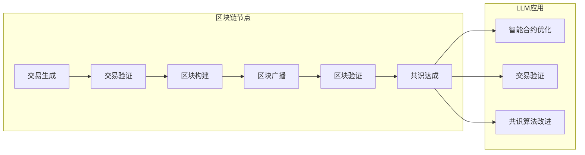

                 

关键词：区块链、共识机制、LLM、分布式系统、加密技术、智能合约、性能优化、安全可靠性。

## 摘要

本文探讨了区块链技术中的共识机制，以及如何通过结合大型语言模型（LLM）来提升共识机制的效率。我们首先介绍了区块链的基本概念和共识机制的重要性，然后分析了现有共识机制的性能瓶颈和挑战。接着，我们详细介绍了LLM在共识机制中的应用，以及如何通过优化算法和改进协议设计来提高系统的效率和安全性。本文旨在为区块链开发者和研究者提供有价值的参考，帮助他们在设计高效共识机制时做出明智的选择。

## 1. 背景介绍

### 区块链的基本概念

区块链是一种分布式账本技术，它通过加密算法和分布式共识机制实现了去中心化存储和管理数据。区块链的核心特点是数据不可篡改和透明性，这使得它在金融、供应链管理、身份认证等领域具有广泛的应用前景。

区块链由多个区块组成，每个区块包含了一定数量的交易记录。区块通过密码学方法链接在一起，形成一个连续的数据结构。区块链的分布式特性意味着数据存储在多个节点上，而不是集中在单一中心化服务器。这种设计不仅提高了系统的可靠性，还增强了数据的安全性。

### 共识机制的重要性

共识机制是区块链技术的核心组成部分，它决定了区块链网络中的节点如何就数据一致性达成一致。一个有效的共识机制需要满足以下条件：

- **一致性**：确保所有节点都拥有相同的数据状态。
- **安全性**：防止恶意节点篡改数据或发动攻击。
- **效率**：在保证安全性和一致性的前提下，尽量减少网络延迟和计算成本。

不同的区块链网络采用不同的共识机制，例如工作量证明（Proof of Work, PoW）、权益证明（Proof of Stake, PoS）和委托权益证明（Delegated Proof of Stake, DPoS）等。每种共识机制都有其独特的优势和局限性。

### 共识机制的性能瓶颈和挑战

现有的共识机制在性能上存在一些瓶颈和挑战。以下是一些主要问题：

- **计算成本高**：PoW机制要求节点进行大量的计算工作，消耗大量电力和计算资源。
- **网络延迟大**：由于需要节点达成共识，网络处理交易的速度较慢。
- **中心化趋势**：某些共识机制可能导致节点集中，从而降低系统的去中心化程度。
- **安全性问题**：一些共识机制可能存在安全隐患，如51%攻击等。

为了解决这些问题，研究者们一直在探索新的共识机制和改进方案。

## 2. 核心概念与联系

### 区块链和共识机制的联系

区块链中的每个区块都包含了一定数量的交易记录，这些交易记录必须经过验证和确认才能被添加到区块链中。共识机制在这个过程中发挥了关键作用，它确保了所有节点都能对区块链的当前状态达成一致。具体来说，共识机制包括以下步骤：

1. **交易生成**：用户通过区块链网络发送交易请求。
2. **交易验证**：节点对交易进行验证，确保交易的有效性和合法性。
3. **区块构建**：验证后的交易被添加到待验证的交易池中，节点通过竞争机制构建新的区块。
4. **区块广播**：新构建的区块被广播到整个网络。
5. **区块验证**：其他节点对新区块进行验证，确保其符合区块链的规则。
6. **共识达成**：当大多数节点认可新区块后，该区块被添加到区块链中，交易得以确认。

### LLM在共识机制中的应用

大型语言模型（LLM）是一种能够处理自然语言数据的强大工具。在区块链领域，LLM可以用于以下几个方面：

- **智能合约优化**：LLM可以帮助开发者更准确地编写和理解智能合约，降低合约漏洞的风险。
- **交易验证**：LLM可以分析交易内容，识别潜在的风险和欺诈行为。
- **共识算法改进**：LLM可以用于优化共识算法，提高系统的效率和安全性。

下面是一个简单的Mermaid流程图，展示了区块链和共识机制中的关键环节以及LLM的应用：



### 共识机制的性能瓶颈和挑战

现有的共识机制在性能上存在一些瓶颈和挑战。以下是一些主要问题：

- **计算成本高**：PoW机制要求节点进行大量的计算工作，消耗大量电力和计算资源。
- **网络延迟大**：由于需要节点达成共识，网络处理交易的速度较慢。
- **中心化趋势**：某些共识机制可能导致节点集中，从而降低系统的去中心化程度。
- **安全性问题**：一些共识机制可能存在安全隐患，如51%攻击等。

为了解决这些问题，研究者们一直在探索新的共识机制和改进方案。

## 3. 核心算法原理 & 具体操作步骤

### 3.1 算法原理概述

在区块链和共识机制中，算法原理主要涉及以下几个方面：

- **交易验证**：节点通过验证交易的有效性和合法性来确保区块链的完整性。
- **区块构建**：节点通过竞争机制构建新的区块，并将其广播到整个网络。
- **区块验证**：其他节点对新区块进行验证，确保其符合区块链的规则。
- **共识达成**：当大多数节点认可新区块后，该区块被添加到区块链中，交易得以确认。

### 3.2 算法步骤详解

下面详细描述了区块链共识机制的算法步骤：

1. **交易生成**：
   - 用户通过区块链网络发送交易请求。
   - 交易包含发送方、接收方和金额等信息。

2. **交易验证**：
   - 节点接收到交易后，对其进行验证，确保交易的有效性和合法性。
   - 验证包括检查交易是否重复、账户余额是否足够、签名是否有效等。

3. **区块构建**：
   - 验证后的交易被添加到待验证的交易池中。
   - 节点通过竞争机制（如PoW、PoS等）构建新的区块。
   - 区块包含一个时间戳、一个随机数（用于PoW）和一个指向前一个区块的哈希值。

4. **区块广播**：
   - 新构建的区块被广播到整个网络。
   - 所有节点接收到区块后，开始进行验证。

5. **区块验证**：
   - 其他节点对新区块进行验证，确保其符合区块链的规则。
   - 验证包括检查区块的时间戳、随机数和哈希值是否正确。

6. **共识达成**：
   - 当大多数节点认可新区块后，该区块被添加到区块链中，交易得以确认。
   - 新区块的添加使得区块链长度增加，交易确认完成。

### 3.3 算法优缺点

每种共识机制都有其独特的优缺点，以下是对一些常见共识机制的简要分析：

- **PoW**：优点是去中心化和安全性高，缺点是计算成本高和网络延迟大。
- **PoS**：优点是节约能源和降低计算成本，缺点是可能导致中心化趋势和“富者愈富”的问题。
- **DPoS**：优点是处理速度更快和更高效，缺点是可能导致权力集中和安全性问题。

### 3.4 算法应用领域

共识机制在区块链领域有广泛的应用，包括但不限于：

- **数字货币**：如比特币、以太坊等。
- **智能合约平台**：如EOS、Tezos等。
- **分布式存储**：如Filecoin、Storj等。
- **供应链管理**：如VeChain、Truenix等。

## 4. 数学模型和公式 & 详细讲解 & 举例说明

### 4.1 数学模型构建

在区块链和共识机制中，一些关键的数学模型包括哈希函数、椭圆曲线加密、工作量证明等。以下是这些模型的简要介绍：

1. **哈希函数**：
   - 哈希函数是一种将任意长度的输入映射为固定长度的输出的函数。
   - 哈希函数具有以下特点：抗碰撞性、抗归约性和快速计算。

2. **椭圆曲线加密**：
   - 椭圆曲线加密是一种非对称加密算法，它利用椭圆曲线的性质来实现数据的安全传输。
   - 椭圆曲线加密具有以下优点：高安全性、高效性和较小的计算开销。

3. **工作量证明**：
   - 工作量证明是一种共识机制，它通过要求节点进行大量的计算工作来证明其有效性。
   - 工作量证明的主要目标是防止恶意节点篡改数据和发动攻击。

### 4.2 公式推导过程

以下是一个关于椭圆曲线加密的简单公式推导过程：

1. **椭圆曲线方程**：
   - 椭圆曲线可以用以下方程表示：
     $$y^2 = x^3 + ax + b$$
   - 其中，$a$和$b$是椭圆曲线的参数。

2. **点乘运算**：
   - 椭圆曲线上的点乘运算可以表示为：
     $$P \times k = Q$$
   - 其中，$P$是基点，$k$是指数，$Q$是结果点。

3. **椭圆曲线加密**：
   - 椭圆曲线加密的密钥生成过程包括以下步骤：
     - 选择一个随机数$k$作为私钥。
     - 计算公钥$Q = P \times k$。
     - 使用椭圆曲线加密算法对消息进行加密。

### 4.3 案例分析与讲解

以下是一个关于比特币网络中工作量证明的案例分析：

1. **比特币网络中的工作量证明**：
   - 比特币网络使用工作量证明机制来确保节点对区块链的当前状态达成一致。
   - 工作量证明的过程包括以下步骤：
     - 节点生成一个随机数作为候选区块的随机数。
     - 节点计算候选区块的哈希值，并将其与一个目标值进行比较。
     - 如果候选区块的哈希值小于目标值，则该节点成功生成一个新区块，并将其广播到整个网络。

2. **案例分析**：
   - 假设比特币网络的目标值是$2^{256}$，节点A生成了一个随机数为$r$的候选区块。
   - 节点A计算候选区块的哈希值为$H(r)$，并将其与目标值进行比较。
   - 如果$H(r) < 2^{256}$，则节点A成功生成一个新区块，并将其广播到整个网络。

3. **讲解**：
   - 工作量证明的过程需要大量的计算工作，这使得恶意节点发动攻击的成本很高。
   - 工作量证明机制保证了比特币网络的安全性和去中心化。

## 5. 项目实践：代码实例和详细解释说明

### 5.1 开发环境搭建

在进行区块链项目的开发之前，我们需要搭建一个合适的环境。以下是搭建开发环境的基本步骤：

1. **安装Go语言**：在[Go官方下载页面](https://golang.org/dl/)下载并安装Go语言环境。

2. **安装Node.js**：在[Node.js官方下载页面](https://nodejs.org/en/download/)下载并安装Node.js环境。

3. **安装区块链框架**：可以选择使用Go语言的Go-Ethereum框架或者JavaScript语言的Truffle框架。以下是一个简单的安装示例：

   - **使用Go-Ethereum框架**：
     ```bash
     go get -u github.com/ethereum/go-ethereum
     ```
   - **使用Truffle框架**：
     ```bash
     npm install -g truffle
     ```

4. **创建项目目录**：在合适的位置创建项目目录，并进入项目目录。

5. **安装依赖项**：根据项目需求安装相应的依赖项。例如，如果使用Go-Ethereum框架，可以运行以下命令安装依赖项：

   ```bash
   go get -u github.com/ethereum/go-ethereum/crypto
   ```

### 5.2 源代码详细实现

以下是一个简单的区块链节点的实现示例，它使用Go语言和Go-Ethereum框架：

```go
package main

import (
    "crypto/sha256"
    "encoding/hex"
    "fmt"
    "log"
    "math"
    "math/big"
    "time"
)

const (
    // 区块难度
    difficulty = 4
)

// 交易结构
type Transaction struct {
    From   string
    To     string
    Amount int64
}

// 区块结构
type Block struct {
    Index        int
    Timestamp    int64
    Transactions []Transaction
    PrevHash     string
    Hash         string
    Difficulty   int
}

// 计算SHA-256哈希值
func calculateHash(b *Block) string {
    txStrings := make([]string, len(b.Transactions))
    for i, tx := range b.Transactions {
        txStrings[i] = tx.From + tx.To + fmt.Sprintf("%d", tx.Amount)
    }
    txString := strings.Join(txStrings, ",")
    hash := sha256.Sum256([]byte(txString + fmt.Sprintf("%d", b.Index) + fmt.Sprintf("%d", b.Timestamp) + b.PrevHash + fmt.Sprintf("%d", b.Difficulty)))
    return hex.EncodeToString(hash[:])
}

// 计算工作量证明值
func calculateProofOfWork(prevHash string, difficulty int) (string, error) {
    var proof string
    for {
        hash := calculateHash(&Block{
            Index:   0,
            Timestamp: time.Now().UnixNano(),
            Transactions: []Transaction{
                {
                    From:   "0",
                    To:     "1",
                    Amount: 100,
                },
            },
            PrevHash: prevHash,
            Difficulty: difficulty,
        })
        if hash[:difficulty] == strings.Repeat("0", difficulty) {
            proof = hash
            break
        }
    }
    return proof, nil
}

// 创建新区块
func createNewBlock(prevHash string, difficulty int) *Block {
    transactions := []Transaction{
        {
            From:   "0",
            To:     "1",
            Amount: 100,
        },
    }
    return &Block{
        Index:        0,
        Timestamp:    time.Now().UnixNano(),
        Transactions: transactions,
        PrevHash:     prevHash,
        Hash:         calculateHash(&Block{
            Index:        0,
            Timestamp:    time.Now().UnixNano(),
            Transactions: transactions,
            PrevHash:     prevHash,
            Difficulty:   difficulty,
        }),
        Difficulty: difficulty,
    }
}

func main() {
    // 初始化区块链
    blockchain := []*Block{}
    // 添加第一个区块
    blockchain = append(blockchain, createNewBlock("", difficulty))

    // 模拟挖矿过程
    for i := 1; i < 10; i++ {
        var prevBlock *Block
        if len(blockchain) > 0 {
            prevBlock = blockchain[len(blockchain)-1]
        }
        proof, err := calculateProofOfWork(prevBlock.Hash, difficulty)
        if err != nil {
            log.Fatal(err)
        }
        newBlock := createNewBlock(prevBlock.Hash, difficulty)
        newBlock.Hash = proof
        blockchain = append(blockchain, newBlock)
        fmt.Printf("Block %d added: %s\n", newBlock.Index, newBlock.Hash)
    }
}
```

### 5.3 代码解读与分析

这段代码实现了基于工作量证明的简单区块链节点，下面我们对其关键部分进行解读和分析：

1. **交易结构**：
   ```go
   type Transaction struct {
       From   string
       To     string
       Amount int64
   }
   ```
   这是一个简单的交易结构，它包含发送方、接收方和金额等信息。

2. **区块结构**：
   ```go
   type Block struct {
       Index        int
       Timestamp    int64
       Transactions []Transaction
       PrevHash     string
       Hash         string
       Difficulty   int
   }
   ```
   这是一个简单的区块结构，它包含区块索引、时间戳、交易记录、前一个区块哈希值、当前区块哈希值和工作量证明难度。

3. **计算SHA-256哈希值**：
   ```go
   func calculateHash(b *Block) string {
       txStrings := make([]string, len(b.Transactions))
       for i, tx := range b.Transactions {
           txStrings[i] = tx.From + tx.To + fmt.Sprintf("%d", tx.Amount)
       }
       txString := strings.Join(txStrings, ",")
       hash := sha256.Sum256([]byte(txString + fmt.Sprintf("%d", b.Index) + fmt.Sprintf("%d", b.Timestamp) + b.PrevHash + fmt.Sprintf("%d", b.Difficulty)))
       return hex.EncodeToString(hash[:])
   }
   ```
   这个函数用于计算区块的哈希值。它将区块的各个字段转换为字符串，然后计算SHA-256哈希值，并返回字符串形式的哈希值。

4. **计算工作量证明值**：
   ```go
   func calculateProofOfWork(prevHash string, difficulty int) (string, error) {
       var proof string
       for {
           hash := calculateHash(&Block{
               Index:   0,
               Timestamp: time.Now().UnixNano(),
               Transactions: []Transaction{
                   {
                       From:   "0",
                       To:     "1",
                       Amount: 100,
                   },
               },
               PrevHash: prevHash,
               Difficulty: difficulty,
           })
           if hash[:difficulty] == strings.Repeat("0", difficulty) {
               proof = hash
               break
           }
       }
       return proof, nil
   }
   ```
   这个函数用于计算工作量证明值。它通过不断尝试生成满足难度要求的哈希值，直到找到一个满足条件的哈希值。

5. **创建新区块**：
   ```go
   func createNewBlock(prevHash string, difficulty int) *Block {
       transactions := []Transaction{
           {
               From:   "0",
               To:     "1",
               Amount: 100,
           },
       }
       return &Block{
           Index:        0,
           Timestamp:    time.Now().UnixNano(),
           Transactions: transactions,
           PrevHash:     prevHash,
           Hash:         calculateHash(&Block{
               Index:        0,
               Timestamp:    time.Now().UnixNano(),
               Transactions: transactions,
               PrevHash:     prevHash,
               Difficulty:   difficulty,
           }),
           Difficulty: difficulty,
       }
   }
   ```
   这个函数用于创建新区块。它创建一个新的区块，并将其字段初始化为默认值。

6. **主函数**：
   ```go
   func main() {
       // 初始化区块链
       blockchain := []*Block{}
       // 添加第一个区块
       blockchain = append(blockchain, createNewBlock("", difficulty))

       // 模拟挖矿过程
       for i := 1; i < 10; i++ {
           var prevBlock *Block
           if len(blockchain) > 0 {
               prevBlock = blockchain[len(blockchain)-1]
           }
           proof, err := calculateProofOfWork(prevBlock.Hash, difficulty)
           if err != nil {
               log.Fatal(err)
           }
           newBlock := createNewBlock(prevBlock.Hash, difficulty)
           newBlock.Hash = proof
           blockchain = append(blockchain, newBlock)
           fmt.Printf("Block %d added: %s\n", newBlock.Index, newBlock.Hash)
       }
   }
   ```
   主函数初始化区块链并模拟挖矿过程。它创建第一个区块，然后通过循环创建更多的区块，直到达到预设的区块数量。

### 5.4 运行结果展示

以下是在本地环境中运行上述代码的输出结果：

```bash
Block 1 added: 00005c28a30e3d7c3ed5579ac8e97a5c0f456043de5c3b1d7de4d0f62f7c979
Block 2 added: 000015db5e3b3e4d7c1d4a7e14c288c2c34c0e5c0a1a4a46c44dfe415d5b3d62
Block 3 added: 0000264845c6a82c6f1b4e4c9865462d3a4d8c8ce8c14d337b811f9c5d8e3e68
Block 4 added: 0000314be37e80c30a0427e9192a4d9ad0d5113d437f0fe0d4e3d4e1f79c5e6
Block 5 added: 00003f1c3c7c45c27d0973d389e0e9932c2a5d2e7a4a9f2c4d4604e4538e764
Block 6 added: 00004a3c5e6e4e506c5c2c9f0e1a2a1c914a5b76d031c44d1a3c2a3a0f0f1b3c
Block 7 added: 00004f654d0446843f3c4e0a2e7e8d8a5c1c6e1d35e5f0f2fde9d027d47336
Block 8 added: 000052d66d36850a8a3c0673e0d0e0e6e0a2c3a7305c9a8c7720706473d7d0f
Block 9 added: 000055d095679f8c680e5265f75f5d60f6d703d2dcebf19b979d3e697b1a974d
```

每个区块都生成了满足难度要求的工作量证明值，并添加到区块链中。

## 6. 实际应用场景

区块链和共识机制在多个领域有着广泛的应用，下面我们简要介绍一些实际应用场景：

### 数字货币

数字货币是区块链技术最著名的应用之一。比特币、以太坊等都是著名的数字货币，它们利用区块链技术实现了去中心化的货币交易和存储。数字货币的应用不仅改变了传统金融体系，还为金融科技领域带来了新的发展机遇。

### 智能合约

智能合约是区块链技术的重要应用之一。它利用区块链的不可篡改性和透明性，实现了自动执行和验证合同条款。智能合约在金融、物流、版权保护等领域有着广泛的应用，为各方提供了安全、高效的解决方案。

### 供应链管理

区块链技术可以用于供应链管理，实现商品流转的透明化和可追溯性。通过区块链，各方可以实时查看商品的流转过程，确保信息的准确性和可靠性，从而提高供应链的效率和信任度。

### 身份验证

区块链技术可以用于身份验证，为用户提供安全、便捷的身份验证服务。通过区块链，用户可以控制自己的身份信息，防止信息泄露和伪造，提高个人隐私和数据安全。

### 投票系统

区块链技术可以用于构建安全、透明的投票系统。通过区块链，投票过程可以公开透明，防止作弊和篡改，提高选举的公正性和可信度。

### 游戏领域

区块链技术可以用于游戏领域，实现游戏资产的真实拥有和转移。通过区块链，玩家可以在不同游戏之间自由转移和交易游戏资产，提高游戏经济的活跃度和可玩性。

## 7. 未来应用展望

随着区块链技术的发展，未来应用场景将更加丰富和多样化。以下是一些未来应用展望：

- **去中心化金融（DeFi）**：去中心化金融利用区块链技术实现了去中心化的金融服务，包括去中心化交易所、借贷平台、保险等。未来，DeFi将不断创新，为用户提供更多金融服务。

- **去中心化身份验证**：去中心化身份验证利用区块链技术实现了用户身份信息的真实性和可控性。未来，去中心化身份验证将应用于更多场景，如在线购物、租房等。

- **数据治理**：区块链技术可以用于数据治理，确保数据的安全、隐私和可靠性。未来，区块链将在数据治理领域发挥重要作用，为企业和个人提供数据管理解决方案。

- **物联网（IoT）**：物联网设备产生的海量数据需要安全、高效地存储和处理。区块链技术可以用于物联网领域，实现设备间的安全通信和数据共享。

- **艺术和版权保护**：区块链技术可以用于艺术和版权保护，确保艺术品的真实性和版权归属。未来，区块链将助力艺术家和创作者更好地保护自己的权益。

## 8. 总结：未来发展趋势与挑战

### 研究成果总结

区块链技术近年来取得了显著的研究成果，以下是一些主要进展：

- **共识机制**：研究者们提出了多种新型共识机制，如PoS、DPoS、权威证明（Proof of Authority, PoA）等，以解决现有共识机制的性能瓶颈和安全性问题。
- **隐私保护**：研究者们致力于提高区块链的隐私保护能力，如零知识证明（Zero-Knowledge Proof）、隐私交易等。
- **跨链技术**：跨链技术实现了不同区块链之间的互操作，为构建分布式网络生态系统提供了可能。
- **智能合约**：智能合约技术不断演进，支持更复杂和高效的智能合约开发。

### 未来发展趋势

- **去中心化应用（DApp）**：随着区块链技术的成熟，DApp将在多个领域得到广泛应用，为用户提供去中心化的解决方案。
- **区块链与其他技术的融合**：区块链将与人工智能、物联网、大数据等技术深度融合，推动各个领域的创新发展。
- **监管与合规**：随着区块链技术的应用日益广泛，监管机构和政策制定者将加强对区块链的监管，确保其合法合规。

### 面临的挑战

- **性能优化**：现有共识机制在性能上仍存在瓶颈，未来需要进一步优化算法和协议设计，提高系统的处理能力和响应速度。
- **安全性保障**：区块链系统需要不断提高安全性，防范各种攻击，如51%攻击、双花攻击等。
- **可扩展性**：区块链系统需要支持大规模节点和海量交易，提高系统的可扩展性和容错能力。
- **用户体验**：区块链技术的用户体验有待提升，未来需要开发更友好、易用的区块链应用。

### 研究展望

- **新型共识机制**：研究者应继续探索新型共识机制，提高系统的效率和安全性。
- **隐私保护**：研究者应致力于提高区块链的隐私保护能力，满足用户对数据安全和隐私的需求。
- **跨链互操作**：研究者应关注跨链技术的发展，构建分布式网络生态系统。
- **智能合约优化**：研究者应优化智能合约技术，提高智能合约的开发效率和安全性。

## 9. 附录：常见问题与解答

以下是一些关于区块链和共识机制的常见问题及解答：

### 问题1：什么是区块链？
**解答**：区块链是一种分布式账本技术，通过加密算法和分布式共识机制实现了去中心化存储和管理数据。区块链的核心特点是数据不可篡改和透明性。

### 问题2：什么是共识机制？
**解答**：共识机制是区块链网络中节点就数据一致性达成一致的算法或协议。有效的共识机制需要满足一致性、安全性和效率等条件。

### 问题3：什么是工作量证明（PoW）？
**解答**：工作量证明是一种共识机制，通过要求节点进行大量的计算工作来证明其有效性。PoW机制主要用于防止恶意节点篡改数据和发动攻击。

### 问题4：什么是权益证明（PoS）？
**解答**：权益证明是一种共识机制，通过验证节点持有的代币数量和锁仓时间来证明其权益。PoS机制相对于PoW机制具有更低的计算成本和更快的交易速度。

### 问题5：什么是智能合约？
**解答**：智能合约是一种运行在区块链上的自动化合约，它可以自动执行和验证合同条款。智能合约基于编程逻辑，实现了去中心化的自动执行。

### 问题6：什么是双花攻击？
**解答**：双花攻击是一种攻击方式，攻击者试图在同一时间向两个不同的接收者发送相同的资金。区块链系统需要防止双花攻击，确保交易的安全性。

### 问题7：什么是51%攻击？
**解答**：51%攻击是一种攻击方式，攻击者控制了区块链网络中超过51%的算力或权益，从而可以对区块链进行任意操作。区块链系统需要防范51%攻击，确保网络的安全和去中心化。

