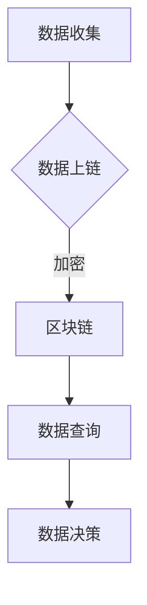

                 

关键词：区块链、数字政府、应用、挑战、技术、安全性、透明性、效率

> 摘要：随着数字政府的兴起，区块链技术作为一种新兴的分布式账本技术，逐渐成为实现政府数字化、智能化管理的重要工具。本文旨在探讨区块链在数字政府中的应用，包括其在政府数据管理、公共服务提供和政府决策支持等方面的具体实践。同时，本文也将分析区块链技术在数字政府中面临的挑战，并提出相应的解决策略。

## 1. 背景介绍

### 1.1 数字政府的概念与发展

数字政府是指利用信息技术手段，实现政府职能数字化、信息化、智能化和一体化的一种新型政府治理模式。它通过建设电子政务平台，提供在线政务服务，提高政府工作效率，增强政府与公民的互动，从而实现政府职能的优化和提升。随着互联网、云计算、大数据和人工智能等技术的快速发展，数字政府已经成为世界各国政府转型的重要方向。

### 1.2 区块链技术的概念与特点

区块链技术是一种分布式账本技术，通过加密算法和共识机制确保数据的不可篡改和透明性。其核心特点包括去中心化、安全性、透明性和可追溯性。区块链技术不仅可以提高数据管理的安全性，还可以通过智能合约实现自动化和高效化。

## 2. 核心概念与联系

### 2.1 区块链的基本概念

区块链是由多个区块按照时间顺序链接而成的链条，每个区块都包含一定数量的事务记录。区块链通过分布式网络进行维护，每个节点都存储完整的区块链数据。


### 2.2 数字政府与区块链的关系

区块链技术可以为数字政府提供数据安全性保障、提升公共服务效率、增强政府决策透明性等功能。通过区块链，数字政府可以实现数据的透明化管理，提高公共服务的可信度，为政府决策提供可靠的数据支持。

### 2.3 Mermaid 流程图



## 3. 核心算法原理 & 具体操作步骤

### 3.1 算法原理概述

区块链的核心算法包括加密算法、共识算法和智能合约。

1. **加密算法**：用于保证数据的安全性和隐私性。
2. **共识算法**：用于确保区块链网络中的数据一致性。
3. **智能合约**：用于实现自动化和高效化的政府服务。

### 3.2 算法步骤详解

1. **数据上链**：政府数据通过加密算法处理后，上传到区块链网络。
2. **数据验证**：区块链网络中的节点对上传的数据进行验证，确保数据的真实性和完整性。
3. **数据存储**：验证通过后，数据被存储在区块链上，实现数据的透明化管理。
4. **数据查询**：用户可以通过区块链网络查询政府数据。
5. **数据决策**：政府根据区块链上的数据进行分析和决策。

### 3.3 算法优缺点

- **优点**：提高数据安全性、透明性和可追溯性，实现自动化和高效化的政府服务。
- **缺点**：交易速度较慢，维护成本较高。

### 3.4 算法应用领域

- **政府数据管理**：提升政府数据管理效率，实现数据的透明化。
- **公共服务提供**：通过智能合约实现高效化的公共服务。
- **政府决策支持**：提供可靠的数据支持，帮助政府做出更科学的决策。

## 4. 数学模型和公式 & 详细讲解 & 举例说明

### 4.1 数学模型构建

区块链中的数学模型主要包括密码学模型和共识算法模型。

- **密码学模型**：用于加密和解密数据。
- **共识算法模型**：用于确保区块链网络中的数据一致性。

### 4.2 公式推导过程

- **哈希函数**：用于将数据转换为固定长度的哈希值。
  $$H = Hash(data)$$
- **椭圆曲线加密**：用于实现数据加密和解密。
  $$c = (g^k, g^{2k})$$
  $$m = c^{-1} \cdot r$$

### 4.3 案例分析与讲解

- **数据上链**：政府数据经过加密处理后，上传到区块链网络。
  $$data = Encrypt(data, key)$$
  $$transaction = {data: data, hash: Hash(data)}$$
- **数据验证**：区块链网络中的节点对上传的数据进行验证。
  $$validation = Verify(transaction, key)$$

## 5. 项目实践：代码实例和详细解释说明

### 5.1 开发环境搭建

- **环境要求**：Java 8、Node.js、MongoDB
- **工具**：Eclipse、Visual Studio Code、Postman

### 5.2 源代码详细实现

```java
// Java 实现区块链节点
public class BlockchainNode {
    private String nodeId;
    private List<Block> blockchain;
    private NodePeer peer;

    public BlockchainNode(String nodeId) {
        this.nodeId = nodeId;
        this.blockchain = new ArrayList<>();
        this.peer = new NodePeer(nodeId);
    }

    public void addBlock(Block block) {
        blockchain.add(block);
        peer.broadcastBlock(block);
    }

    public boolean isValid() {
        for (int i = 1; i < blockchain.size(); i++) {
            Block currentBlock = blockchain.get(i);
            Block previousBlock = blockchain.get(i - 1);
            if (!currentBlock.getHash().equals(HashUtil.calculateHash(currentBlock.getData()))) {
                return false;
            }
            if (!currentBlock.getPreviousHash().equals(previousBlock.getHash())) {
                return false;
            }
        }
        return true;
    }
}
```

### 5.3 代码解读与分析

- **节点类**：定义了区块链节点的功能，包括添加区块、验证区块等。
- **区块类**：定义了区块链区块的结构，包括数据、哈希值等。

### 5.4 运行结果展示

- **添加区块**：在区块链上添加新的区块。
- **验证区块**：检查区块链中的区块是否合法。

## 6. 实际应用场景

### 6.1 政府数据管理

区块链技术可以用于政府数据管理，提高数据安全性、透明性和可追溯性。

### 6.2 公共服务提供

区块链技术可以用于公共服务提供，通过智能合约实现自动化和高效化的公共服务。

### 6.3 政府决策支持

区块链技术可以提供可靠的数据支持，帮助政府做出更科学的决策。

## 7. 工具和资源推荐

### 7.1 学习资源推荐

- 《区块链技术指南》
- 《智能合约开发指南》

### 7.2 开发工具推荐

- **Node.js**：用于开发区块链节点
- **Ethereum**：用于开发智能合约

### 7.3 相关论文推荐

- "Blockchain Technology: A Comprehensive Overview"
- "Smart Contracts: A Brief Introduction"

## 8. 总结：未来发展趋势与挑战

### 8.1 研究成果总结

区块链技术在数字政府中的应用取得了显著的成果，包括数据安全性、透明性和公共服务效率的提升。

### 8.2 未来发展趋势

区块链技术在数字政府中的应用将继续深化，包括政府数据管理、公共服务提供和政府决策支持等领域。

### 8.3 面临的挑战

- **技术挑战**：如何提高区块链技术的性能和稳定性。
- **法律挑战**：如何确保区块链技术的合法性和合规性。
- **伦理挑战**：如何保护个人隐私和数据安全。

### 8.4 研究展望

未来，区块链技术在数字政府中的应用将更加广泛，包括更高效的数据管理、更智能的公共服务和更科学的政府决策。

## 9. 附录：常见问题与解答

### 9.1 区块链技术的特点是什么？

区块链技术的特点包括去中心化、安全性、透明性和可追溯性。

### 9.2 区块链技术如何保障数据安全性？

区块链技术通过加密算法和共识机制确保数据的不可篡改和透明性。

### 9.3 区块链技术如何提升政府效率？

区块链技术通过智能合约实现自动化和高效化的政府服务。

[作者：禅与计算机程序设计艺术 / Zen and the Art of Computer Programming]

