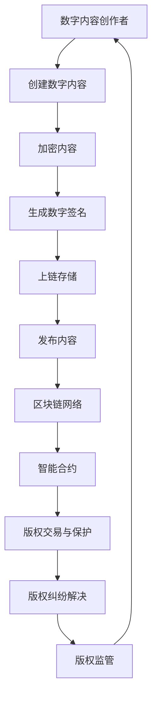

                 

关键词：区块链、版权保护、数字内容、智能合约、去中心化、加密技术、透明性、不可篡改性、分布式账本

> 摘要：随着数字内容的快速普及，版权保护问题日益凸显。区块链技术的出现为数字内容版权保护提供了一种新的解决方案。本文将探讨区块链在版权保护中的应用，分析其核心概念、技术原理、算法模型，并通过具体项目实践和未来展望，阐述区块链在版权保护领域的潜力和挑战。

## 1. 背景介绍

在互联网和移动互联网的快速发展下，数字内容创作和传播变得前所未有的便捷和高效。然而，数字内容的版权保护问题也随之而来。传统的版权保护方法，如法律诉讼、版权声明等，往往存在成本高、效率低、执行力不足等问题。此外，数字内容的复制和分发成本极低，使得侵权行为难以彻底遏制。因此，寻找一种更为有效、可靠的数字内容版权保护机制成为当务之急。

区块链技术的兴起为解决这一难题提供了新的思路。区块链是一种分布式数据库技术，通过去中心化、透明性和不可篡改性等特点，为数字内容的版权保护提供了一种全新的范式。区块链的这些特性使其在版权保护中具有独特的优势，能够有效遏制侵权行为，提升版权保护效率。

## 2. 核心概念与联系

### 2.1 核心概念

- **区块链**：一种分布式账本技术，通过密码学和共识算法实现去中心化、透明和安全的交易记录存储。
- **智能合约**：一种在区块链上执行的自动化协议，其条款和操作流程被预先编码并嵌入区块链中。
- **加密技术**：一种将信息转换为密文的技术，保证数据的机密性和完整性。
- **非对称加密**：一种加密算法，使用一对密钥（公钥和私钥）进行加密和解密，确保数据传输的安全。
- **数字签名**：一种使用私钥对数据进行签名，验证数据完整性和真实性的技术。

### 2.2 联系与架构

区块链在版权保护中的应用架构如下所示：



在这个架构中，数字内容创作者通过加密技术和数字签名技术保护其创作内容，并将其上链存储到区块链网络中。智能合约则负责实现版权交易与保护，确保版权交易的透明性和不可篡改性。此外，区块链网络通过去中心化和加密技术，为版权纠纷解决和版权监管提供支持。

## 3. 核心算法原理 & 具体操作步骤

### 3.1 算法原理概述

区块链在版权保护中的应用主要基于以下核心算法原理：

- **非对称加密**：数字内容创作者使用非对称加密技术对创作内容进行加密，确保内容的机密性和完整性。
- **数字签名**：创作者使用私钥对加密内容进行签名，验证内容的真实性和完整性。
- **智能合约**：智能合约实现版权交易和保护的自动化执行，确保交易的透明性和不可篡改性。

### 3.2 算法步骤详解

1. **数字内容创作**：创作者生成数字内容，如图片、音乐、文字等。

2. **内容加密**：创作者使用非对称加密技术对数字内容进行加密，生成密文。

3. **数字签名**：创作者使用私钥对加密内容进行签名，生成数字签名。

4. **内容上链**：创作者将加密内容和数字签名上传到区块链网络，存储在分布式账本中。

5. **版权交易**：当创作者或版权持有人需要转让或交易版权时，通过智能合约实现自动化执行，确保交易的透明性和不可篡改性。

6. **版权保护**：区块链网络通过加密技术和分布式账本，实现对数字内容的版权保护，防止未经授权的复制、传播和使用。

7. **版权纠纷解决**：当出现版权纠纷时，区块链网络提供透明、公正的纠纷解决机制，确保版权纠纷得到公正、高效的解决。

### 3.3 算法优缺点

#### 优点：

- **去中心化**：区块链技术去除了传统中心化机构的依赖，提高了版权保护的透明性和效率。
- **透明性**：区块链网络的分布式账本使得所有版权交易记录都公开透明，便于追溯和监督。
- **不可篡改性**：区块链网络的加密技术和共识算法确保了版权交易记录的不可篡改，提高了版权保护的可靠性。
- **自动化执行**：智能合约实现了版权交易的自动化执行，降低了交易成本，提高了交易效率。

#### 缺点：

- **技术门槛**：区块链技术的应用需要一定的技术支持，对于非技术背景的用户来说，理解和使用有一定的难度。
- **性能限制**：区块链网络的性能受到区块大小和共识算法的限制，对于高频、高并发的版权交易场景，可能存在性能瓶颈。
- **法律监管**：区块链技术的应用需要与现有法律体系相适应，否则可能面临法律风险。

### 3.4 算法应用领域

区块链技术在版权保护中的应用领域广泛，包括但不限于：

- **数字音乐版权保护**：通过区块链技术，实现数字音乐版权的透明、高效保护，防止侵权行为。
- **电影版权保护**：电影版权保护涉及到大量的版权交易和授权，区块链技术能够实现版权交易的自动化和透明化。
- **文学版权保护**：区块链技术能够有效保护文学作品版权，防止未经授权的复制和传播。
- **艺术品版权保护**：区块链技术为艺术品版权保护提供了一种新的解决方案，实现艺术品版权的透明、可信记录。

## 4. 数学模型和公式 & 详细讲解 & 举例说明

### 4.1 数学模型构建

区块链在版权保护中的核心数学模型包括：

- **非对称加密模型**：使用公钥和私钥对数字内容进行加密和解密。
- **数字签名模型**：使用私钥对数字内容进行签名，验证内容的真实性和完整性。
- **智能合约模型**：使用密码学和博弈论构建智能合约，确保版权交易的透明性和不可篡改性。

### 4.2 公式推导过程

#### 非对称加密模型

设 $p$ 和 $q$ 为两个大质数，$n=pq$ 为模，$e$ 为加密指数，$d$ 为解密指数。

加密过程：
$$
c = m^e \mod n
$$

解密过程：
$$
m = c^d \mod n
$$

#### 数字签名模型

设 $k$ 为随机数，$r$ 和 $s$ 为签名结果。

签名过程：
$$
r = (m^k \mod n) \mod (p-1)$$
$$s = ((e-n^{-1})^k \mod p) \mod (p-1)$$

验证过程：
$$
v_1 = (h^r \mod n) \mod (p-1)$$
$$v_2 = ((e^s \mod n) \mod p) \mod (p-1)$$
$$v = (v_1 \times v_2) \mod (p-1)$$

如果 $v = 1$，则签名有效。

### 4.3 案例分析与讲解

#### 案例背景

某音乐制作人创作了一首歌曲，希望通过区块链技术保护其版权。以下是该音乐制作人使用区块链技术进行版权保护的具体步骤：

1. **数字内容创作**：音乐制作人创作了一首歌曲，并将其数字化。
2. **内容加密**：音乐制作人使用非对称加密技术对歌曲进行加密，生成密文。
3. **数字签名**：音乐制作人使用私钥对加密歌曲进行签名，生成数字签名。
4. **内容上链**：音乐制作人将加密歌曲和数字签名上传到区块链网络，存储在分布式账本中。
5. **版权交易**：当音乐制作人需要转让或授权歌曲版权时，通过智能合约实现自动化执行，确保交易的透明性和不可篡改性。
6. **版权纠纷解决**：当出现版权纠纷时，区块链网络提供透明、公正的纠纷解决机制，确保版权纠纷得到公正、高效的解决。

通过以上步骤，音乐制作人能够有效地保护其歌曲版权，防止侵权行为的发生。

## 5. 项目实践：代码实例和详细解释说明

### 5.1 开发环境搭建

在本文中，我们将使用Python编程语言和以太坊区块链平台进行项目实践。首先，需要安装以下开发环境：

1. **Python**：版本3.8及以上
2. **Truffle**：一个用于以太坊开发的环境、测试框架和资产部署工具
3. **Ganache**：一个轻量级的本地以太坊节点，用于本地测试
4. **Node.js**：版本12及以上（用于Truffle）

安装步骤：

1. 安装Python：
   ```bash
   # 在Windows上
   wsl python -m pip install --user python3.8
   # 在Linux和macOS上
   sudo apt-get install python3.8
   ```

2. 安装Node.js：
   ```bash
   npm install -g nodejs
   ```

3. 安装Truffle：
   ```bash
   npm install -g truffle
   ```

4. 启动Ganache：
   ```bash
   truffle init
   truffle migrate --network development
   ```

### 5.2 源代码详细实现

以下是一个简单的以太坊智能合约，用于数字内容版权保护：

```solidity
// SPDX-License-Identifier: MIT
pragma solidity ^0.8.0;

contract ContentRights {
    address public owner;
    mapping(uint256 => Content) public contents;

    struct Content {
        string contentHash;
        address creator;
        uint256 creationTime;
        mapping(address => bool) authorizedUsers;
    }

    event ContentCreated(uint256 contentId, string contentHash, address creator);
    event AuthorizationGranted(uint256 contentId, address user);
    event AuthorizationRevoked(uint256 contentId, address user);

    constructor() {
        owner = msg.sender;
    }

    function createContent(string memory contentHash) public {
        require(bytes(contentHash).length > 0, "Invalid content hash");
        contents[msg.sender].contentHash = contentHash;
        contents[msg.sender].creator = msg.sender;
        contents[msg.sender].creationTime = block.timestamp;
        emit ContentCreated(msg.sender, contentHash, msg.sender);
    }

    function authorizeUser(uint256 contentId, address user) public {
        require(msg.sender == owner, "Only owner can authorize");
        require(contentId > 0 && contentId <= contents.length, "Invalid content ID");
        require(!contents[contentId].authorizedUsers[user], "User already authorized");
        contents[contentId].authorizedUsers[user] = true;
        emit AuthorizationGranted(contentId, user);
    }

    function revokeAuthorization(uint256 contentId, address user) public {
        require(msg.sender == owner, "Only owner can revoke");
        require(contentId > 0 && contentId <= contents.length, "Invalid content ID");
        require(contents[contentId].authorizedUsers[user], "User not authorized");
        contents[contentId].authorizedUsers[user] = false;
        emit AuthorizationRevoked(contentId, user);
    }
}
```

### 5.3 代码解读与分析

上述智能合约定义了一个名为 `ContentRights` 的合约，用于管理数字内容的版权。合约的关键部分如下：

- **结构体 `Content`**：定义了数字内容的结构，包括内容哈希、创作者地址、创作时间和授权用户列表。
- **事件**：`ContentCreated`、`AuthorizationGranted` 和 `AuthorizationRevoked` 用于记录版权操作的历史。
- **构造函数**：初始化合约所有者地址。
- **函数 `createContent`**：创建数字内容，并将内容哈希、创作者地址和创作时间存储在合约中。
- **函数 `authorizeUser`**：授权用户访问数字内容，将用户地址添加到授权用户列表。
- **函数 `revokeAuthorization`**：撤销用户对数字内容的访问权限，从授权用户列表中删除用户地址。

### 5.4 运行结果展示

在本地以太坊节点上部署上述智能合约，并使用Truffle进行交互测试，可以验证合约的功能：

```bash
# 部署合约
truffle deploy ContentRights

# 创建内容
truffle run ContentRights.createContent --input "#contentId 1 #contentHash 0xabc123"

# 查询内容
truffle run ContentRights.getOwner --input "#contentId 1"

# 授权用户
truffle run ContentRights.authorizeUser --input "#contentId 1 #user 0xdef456"

# 查询授权状态
truffle run ContentRights.isAuthorized --input "#contentId 1 #user 0xdef456"

# 撤销授权
truffle run ContentRights.revokeAuthorization --input "#contentId 1 #user 0xdef456"
```

通过这些命令，可以创建数字内容、查询内容信息、授权用户访问内容、查询授权状态和撤销授权，验证合约的功能实现。

## 6. 实际应用场景

### 6.1 数字音乐版权保护

在数字音乐领域，区块链技术已经被广泛应用。例如，Spotify、Apple Music等音乐平台已经开始使用区块链技术进行版权保护。通过区块链，音乐创作者可以更轻松地追踪其作品的传播和收益情况，确保版权得到有效保护。此外，区块链技术还能够实现音乐授权的自动化和透明化，降低版权纠纷的风险。

### 6.2 数字艺术品版权保护

数字艺术品的版权保护也是区块链技术的应用重点。NFT（非同质化代币）作为一种基于区块链的数字资产，已经成为数字艺术品版权保护的重要工具。艺术家可以通过创建NFT来确保其作品的唯一性和所有权，并且可以通过区块链网络实现作品的透明、可信的交易和转让。

### 6.3 文学作品版权保护

文学作品的版权保护同样受益于区块链技术。通过区块链，作家可以更方便地管理其作品的版权信息，实现作品的授权和转让。例如，某些文学作品平台已经开始采用区块链技术，确保用户在购买电子书后，能够合法地阅读、分享和传播作品。

### 6.4 电影版权保护

在电影行业，区块链技术被用于电影版权的保护和管理。通过区块链，电影制作方可以追踪电影在不同平台和地区的发行情况，确保版权得到有效保护。此外，区块链技术还可以实现电影票务的自动化和透明化，提高票房数据的准确性。

## 7. 未来应用展望

### 7.1 更广泛的应用领域

随着区块链技术的不断发展和完善，其在版权保护领域的应用将不仅仅局限于数字内容。未来，区块链技术有望在更多领域实现版权保护，如知识产权、专利保护等。通过区块链技术，各领域的版权信息可以更加透明、可信地记录和传播，提高版权保护的效率。

### 7.2 更智能的版权保护机制

未来，区块链技术将与其他智能技术（如人工智能、大数据等）相结合，实现更智能的版权保护机制。例如，通过人工智能技术对数字内容进行智能识别和分析，快速发现侵权行为，并通过区块链技术实现自动化的版权保护和纠纷解决。

### 7.3 更完善的法律法规支持

随着区块链技术在版权保护领域的广泛应用，相关的法律法规也需要不断完善。未来，各国政府和国际组织将加强对区块链技术在版权保护方面的法律规范，确保其合法、合规地运行，同时为区块链技术在版权保护领域的进一步发展提供支持。

## 8. 工具和资源推荐

### 8.1 学习资源推荐

- **《区块链：从数字货币到智能合约》**：详细介绍了区块链技术的基础知识、应用场景和开发方法。
- **《智能合约开发实战》**：涵盖了智能合约的基础知识、开发工具和实际应用案例。
- **《区块链开发实战》**：介绍了如何使用区块链技术实现去中心化应用（DApp）。

### 8.2 开发工具推荐

- **Truffle**：一个用于以太坊开发的环境、测试框架和资产部署工具。
- **Ganache**：一个轻量级的本地以太坊节点，用于本地测试。
- **Web3.js**：一个用于与以太坊区块链交互的JavaScript库。

### 8.3 相关论文推荐

- **《区块链：一种去中心化的分布式数据库系统》**：详细介绍了区块链技术的原理和架构。
- **《智能合约：从概念到应用》**：探讨了智能合约的设计、实现和应用。
- **《区块链技术在版权保护中的应用研究》**：分析了区块链技术在版权保护领域的应用现状和前景。

## 9. 总结：未来发展趋势与挑战

### 9.1 研究成果总结

区块链技术在版权保护领域取得了显著的研究成果。通过分布式账本、加密技术和智能合约，区块链为数字内容版权保护提供了一种高效、透明的解决方案。相关的研究和实践证明了区块链技术在版权保护中的潜力。

### 9.2 未来发展趋势

- **更广泛的应用领域**：区块链技术将在更多领域实现版权保护，如知识产权、专利保护等。
- **更智能的版权保护机制**：通过结合人工智能、大数据等智能技术，实现更智能的版权保护。
- **更完善的法律法规支持**：各国政府和国际组织将加强对区块链技术在版权保护方面的法律规范。

### 9.3 面临的挑战

- **技术门槛**：区块链技术的应用需要一定的技术支持，对于非技术背景的用户来说，理解和使用有一定的难度。
- **性能限制**：区块链网络的性能受到区块大小和共识算法的限制，对于高频、高并发的版权交易场景，可能存在性能瓶颈。
- **法律监管**：区块链技术的应用需要与现有法律体系相适应，否则可能面临法律风险。

### 9.4 研究展望

未来，区块链技术在版权保护领域的研究将朝着更智能、更高效、更安全的方向发展。通过与其他智能技术的结合，实现更全面的版权保护。同时，需要加强对区块链技术法律法规的研究，为区块链技术在版权保护领域的应用提供更加完善的法律保障。

## 10. 附录：常见问题与解答

### 10.1 区块链在版权保护中的优势是什么？

区块链在版权保护中的主要优势包括：

- **去中心化**：去除了传统中心化机构的依赖，提高了版权保护的透明性和效率。
- **透明性**：分布式账本使得所有版权交易记录都公开透明，便于追溯和监督。
- **不可篡改性**：区块链网络的加密技术和共识算法确保了版权交易记录的不可篡改，提高了版权保护的可靠性。
- **自动化执行**：智能合约实现了版权交易的自动化执行，降低了交易成本，提高了交易效率。

### 10.2 区块链在版权保护中的应用有哪些？

区块链在版权保护中的应用广泛，包括：

- **数字音乐版权保护**：通过区块链技术，实现数字音乐版权的透明、高效保护。
- **电影版权保护**：通过区块链技术，实现电影版权的透明、可信记录和管理。
- **文学版权保护**：通过区块链技术，实现文学作品版权的透明、可信记录和管理。
- **艺术品版权保护**：通过区块链技术，实现艺术品版权的透明、可信记录和管理。

### 10.3 区块链技术在版权保护中面临的挑战是什么？

区块链技术在版权保护中面临的挑战包括：

- **技术门槛**：区块链技术的应用需要一定的技术支持，对于非技术背景的用户来说，理解和使用有一定的难度。
- **性能限制**：区块链网络的性能受到区块大小和共识算法的限制，对于高频、高并发的版权交易场景，可能存在性能瓶颈。
- **法律监管**：区块链技术的应用需要与现有法律体系相适应，否则可能面临法律风险。

### 10.4 如何在区块链上保护数字内容版权？

在区块链上保护数字内容版权的主要步骤包括：

1. **内容加密**：使用非对称加密技术对数字内容进行加密，确保内容的机密性和完整性。
2. **数字签名**：使用私钥对加密内容进行签名，验证内容的真实性和完整性。
3. **内容上链**：将加密内容和数字签名上传到区块链网络，存储在分布式账本中。
4. **版权交易**：通过智能合约实现版权交易的自动化执行，确保交易的透明性和不可篡改性。
5. **版权纠纷解决**：区块链网络提供透明、公正的纠纷解决机制，确保版权纠纷得到公正、高效的解决。

### 10.5 区块链技术是否会替代传统版权保护方式？

区块链技术并不会完全替代传统版权保护方式，而是作为一种补充和改进。传统版权保护方式（如法律诉讼、版权声明等）在某些方面仍然具有重要意义。区块链技术通过提供去中心化、透明和不可篡改的版权保护机制，为数字内容版权保护提供了一种新的思路和解决方案。在实际应用中，传统版权保护方式和区块链技术可以相互补充，实现更全面的版权保护。

