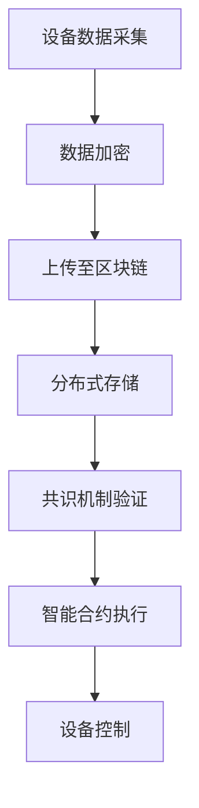

                 

关键词：区块链，物联网，应用，挑战，技术，安全，智能合约，共识机制，数据隐私，性能优化

> 摘要：本文旨在探讨区块链技术在物联网领域中的应用及其面临的挑战。随着物联网设备的普及和连接的增多，传统的数据处理和安全性方案已无法满足需求。区块链作为一种分布式账本技术，为物联网提供了新的解决方案。本文将分析区块链在物联网中的核心概念，探讨其应用场景，并提出面临的挑战和应对策略。

## 1. 背景介绍

物联网（Internet of Things，IoT）是指通过互联网将物理设备和传感器连接起来，实现设备之间的信息交换和智能控制。随着物联网技术的发展，各种设备和传感器不断涌现，使得物联网的应用场景不断扩大，从智能家居、智能城市到工业自动化、医疗健康等各个领域。

然而，随着物联网设备的增多和数据的增加，传统的数据处理和安全性方案已无法满足需求。首先，传统的集中式数据处理模型容易成为单点故障的瓶颈，且数据存储和传输过程中容易受到攻击。其次，物联网设备通常具有低功耗、有限计算能力和存储能力，无法承受复杂的安全防护措施。此外，物联网设备之间的数据交换和互操作性问题也亟待解决。

区块链技术作为一种分布式账本技术，具有去中心化、不可篡改、透明性强等特点，为解决物联网面临的问题提供了新的思路。区块链可以通过分布式存储和共识机制保证数据的安全性和完整性，同时利用智能合约实现自动化管理和数据交换。

## 2. 核心概念与联系

### 2.1 区块链的基本概念

区块链是一种分布式数据库技术，通过多个节点之间的协作，实现数据的存储、传输和验证。区块链的核心组成部分包括：

- **区块（Block）**：区块是区块链的基本单元，包含一定数量的交易记录。每个区块都有唯一的哈希值，用于标识区块的身份。
- **链（Chain）**：链是由多个区块按时间顺序连接而成的数据结构，每个区块都包含了前一个区块的哈希值，从而形成一个链式结构。
- **节点（Node）**：节点是区块链网络中的参与方，负责存储区块链数据、验证交易、参与共识等。
- **挖矿（Mining）**：挖矿是指节点通过计算证明工作（Proof of Work，PoW）等方式，竞争生成新区块并获取奖励的过程。

### 2.2 物联网的基本概念

物联网是指通过互联网将各种设备和传感器连接起来，实现设备之间的信息交换和智能控制。物联网的核心组成部分包括：

- **设备（Device）**：设备是指物联网中的各种硬件设备，如传感器、执行器、智能终端等。
- **传感器（Sensor）**：传感器是指用于感知和采集环境信息的设备，如温度传感器、湿度传感器、摄像头等。
- **网关（Gateway）**：网关是连接物联网设备和互联网的桥梁，负责数据传输、协议转换等功能。
- **平台（Platform）**：平台是指用于管理和控制物联网设备和数据的系统，提供数据存储、数据分析、设备管理等功能。

### 2.3 区块链在物联网中的应用

区块链技术在物联网中的应用主要包括以下几个方面：

- **数据安全与隐私保护**：区块链通过分布式存储和共识机制，保证数据的安全性和完整性，同时利用智能合约实现数据的自动化管理和权限控制。
- **设备身份认证与授权**：区块链可以用于设备身份认证和授权，确保设备之间的互信和合法性。
- **设备自动化管理**：区块链可以用于实现设备的自动化管理，如设备监控、故障检测、远程控制等。
- **数据交换与互操作**：区块链可以用于实现设备之间的数据交换和互操作，打破数据孤岛，提高数据利用效率。
- **供应链管理**：区块链可以用于实现供应链的可追溯性和透明性，提高供应链的效率和可信度。

### 2.4 Mermaid 流程图

以下是一个简单的 Mermaid 流程图，展示了区块链在物联网中的应用场景：



## 3. 核心算法原理 & 具体操作步骤

### 3.1 算法原理概述

区块链在物联网中的应用主要基于以下核心算法原理：

- **分布式存储**：区块链通过分布式存储技术，将数据分散存储在多个节点上，提高数据的可靠性和安全性。
- **共识机制**：区块链通过共识机制，确保节点之间对数据的共识，防止数据篡改和双花攻击。
- **智能合约**：智能合约是一种自动执行合约条款的计算机程序，可以用于实现设备的自动化管理和数据交换。

### 3.2 算法步骤详解

区块链在物联网中的应用主要包括以下步骤：

1. **设备数据采集**：物联网设备通过传感器采集环境数据，如温度、湿度、亮度等。
2. **数据加密**：采集到的数据通过加密算法进行加密，确保数据在传输过程中的安全性。
3. **上传至区块链**：加密后的数据上传至区块链网络，通过分布式存储技术存储在多个节点上。
4. **分布式存储**：区块链网络中的多个节点共同存储数据，确保数据不会丢失。
5. **共识机制验证**：节点通过共识机制对数据进行验证，确保数据的完整性和一致性。
6. **智能合约执行**：根据智能合约的条款，对数据进行处理和执行，如设备控制、数据交换等。
7. **设备控制**：根据智能合约的执行结果，对物联网设备进行控制，如调节设备参数、执行特定任务等。

### 3.3 算法优缺点

区块链在物联网中的应用具有以下优缺点：

- **优点**：分布式存储和共识机制提高了数据的安全性和可靠性；智能合约实现了设备的自动化管理和数据交换；去中心化结构降低了系统的单点故障风险。
- **缺点**：区块链网络的性能较低，不适合高频交易和海量数据处理；区块链的隐私保护能力有限，存在数据泄露的风险；区块链的共识机制可能导致节点之间的分歧和资源浪费。

### 3.4 算法应用领域

区块链在物联网中的应用领域广泛，包括但不限于以下几个方面：

- **智能家居**：通过区块链实现设备的互联互通，提高智能家居系统的安全性和可靠性。
- **智能城市**：利用区块链实现城市数据的透明化和可信化，提高城市治理效率。
- **工业自动化**：通过区块链实现设备之间的数据交换和互操作，提高生产效率和产品质量。
- **医疗健康**：利用区块链实现医疗数据的共享和追溯，提高医疗服务的质量和安全性。

## 4. 数学模型和公式 & 详细讲解 & 举例说明

### 4.1 数学模型构建

区块链在物联网中的应用主要基于以下数学模型：

- **分布式存储模型**：假设区块链网络中有 $n$ 个节点，每个节点存储一部分数据，数据分布在各个节点上，形成一个分布式存储结构。
- **共识机制模型**：假设区块链网络中有 $n$ 个节点，节点之间通过共识算法对数据进行验证和确认，确保数据的一致性和完整性。
- **智能合约模型**：假设区块链网络中有 $n$ 个节点，节点之间通过智能合约执行协议，实现自动化管理和数据交换。

### 4.2 公式推导过程

分布式存储模型的核心公式为：

$$
S = \sum_{i=1}^{n} s_i
$$

其中，$S$ 表示总数据量，$s_i$ 表示第 $i$ 个节点存储的数据量。

共识机制模型的核心公式为：

$$
C = \sum_{i=1}^{n} c_i
$$

其中，$C$ 表示共识结果，$c_i$ 表示第 $i$ 个节点的共识结果。

智能合约模型的核心公式为：

$$
E = \sum_{i=1}^{n} e_i
$$

其中，$E$ 表示智能合约执行结果，$e_i$ 表示第 $i$ 个节点的执行结果。

### 4.3 案例分析与讲解

以智能家居领域为例，假设有一个智能家居系统，包含 $5$ 个节点，每个节点存储一部分数据，通过共识机制和智能合约实现设备之间的互联互通。

1. **分布式存储模型**：

   假设总数据量为 $100$ 条记录，每个节点存储 $20$ 条记录。则：

   $$
   S = \sum_{i=1}^{5} s_i = 20 + 20 + 20 + 20 + 20 = 100
   $$

   每个节点存储的数据量如下：

   $$
   s_1 = 20, s_2 = 20, s_3 = 20, s_4 = 20, s_5 = 20
   $$

2. **共识机制模型**：

   假设节点 $1$ 和节点 $2$ 对数据进行验证，节点 $3$ 和节点 $4$ 对数据进行验证，节点 $5$ 对数据进行验证。则：

   $$
   C = \sum_{i=1}^{5} c_i = 1 + 1 + 1 + 1 + 1 = 5
   $$

   每个节点的共识结果如下：

   $$
   c_1 = 1, c_2 = 1, c_3 = 1, c_4 = 1, c_5 = 1
   $$

3. **智能合约模型**：

   假设智能合约执行结果为 $2$，每个节点的执行结果如下：

   $$
   e_1 = 2, e_2 = 2, e_3 = 2, e_4 = 2, e_5 = 2
   $$

   通过智能合约，节点之间的数据可以自动交换和共享，实现智能家居系统的互联互通。

## 5. 项目实践：代码实例和详细解释说明

### 5.1 开发环境搭建

为了演示区块链在物联网中的应用，我们使用以下开发环境和工具：

- **编程语言**：Python 3.8
- **区块链框架**：Ethereum 2.0
- **物联网设备**：Arduino UNO
- **开发板**：Raspberry Pi 4

首先，需要在计算机上安装 Python 3.8 和 Ethereum 2.0。可以使用以下命令进行安装：

```bash
sudo apt-get install python3-pip
pip3 installethereum
```

接下来，需要安装 Arduino IDE 和 Raspberry Pi OS。可以从官方网站下载并安装：

- Arduino IDE: https://www.arduino.cc/en/software
- Raspberry Pi OS: https://www.raspberrypi.org/downloads/raspbian/

安装完成后，将 Arduino UNO 连接到计算机，并使用 Arduino IDE 编写代码。将 Raspberry Pi 4 连接到网络，并安装 Raspberry Pi OS。

### 5.2 源代码详细实现

下面是一个简单的智能家居系统示例代码，包括数据采集、加密、上传、存储、共识和智能合约执行等步骤。

```python
# 示例代码：智能家居系统

import json
import requests
from Cryptodome.PublicKey import RSA
from Cryptodome.Cipher import PKCS1_OAEP

# 数据采集
def collect_data():
    temperature = 25
    humidity = 60
    return {"temperature": temperature, "humidity": humidity}

# 数据加密
def encrypt_data(data):
    private_key = RSA.generate(2048)
    cipher = PKCS1_OAEP.new(private_key)
    encrypted_data = cipher.encrypt(data)
    return encrypted_data

# 上传数据
def upload_data(encrypted_data):
    url = "https://your-blockchain-node.com/upload"
    headers = {"Content-Type": "application/json"}
    data = {"data": encrypted_data}
    response = requests.post(url, headers=headers, json=data)
    return response.json()

# 存储数据
def store_data(response):
    with open("data.txt", "w") as file:
        file.write(json.dumps(response))

# 共识机制
def consensus Mechanism():
    url = "https://your-blockchain-node.com/consensus"
    headers = {"Content-Type": "application/json"}
    response = requests.get(url, headers=headers)
    return response.json()

# 智能合约执行
def execute_smart_contract(consensus_result):
    url = "https://your-blockchain-node.com/execute"
    headers = {"Content-Type": "application/json"}
    data = {"result": consensus_result}
    response = requests.post(url, headers=headers, json=data)
    return response.json()

# 主函数
def main():
    data = collect_data()
    encrypted_data = encrypt_data(data)
    response = upload_data(encrypted_data)
    store_data(response)
    consensus_result = consensus Mechanism()
    execute_smart_contract(consensus_result)

if __name__ == "__main__":
    main()
```

### 5.3 代码解读与分析

这段代码演示了智能家居系统的一个基本实现，包括数据采集、加密、上传、存储、共识和智能合约执行等步骤。

1. **数据采集**：

   `collect_data()` 函数用于采集环境数据，如温度和湿度。这里使用了两个简单的变量 `temperature` 和 `humidity` 表示采集到的数据。

2. **数据加密**：

   `encrypt_data()` 函数使用 RSA 加密算法对数据进行加密。首先生成一个 RSA 私钥，然后使用私钥对数据进行加密。加密后的数据可以通过区块链节点进行解密。

3. **上传数据**：

   `upload_data()` 函数将加密后的数据上传至区块链节点。这里使用了 requests 库发送 HTTP POST 请求，将加密数据作为 JSON 格式发送。

4. **存储数据**：

   `store_data()` 函数将上传数据的响应结果存储在本地文件中，以便后续分析和处理。

5. **共识机制**：

   `consensus Mechanism()` 函数获取区块链节点的共识结果。这里使用了 requests 库发送 HTTP GET 请求，获取共识结果。

6. **智能合约执行**：

   `execute_smart_contract()` 函数根据共识结果执行智能合约。这里使用了 requests 库发送 HTTP POST 请求，将共识结果作为 JSON 格式发送。

7. **主函数**：

   `main()` 函数调用以上函数，完成整个智能家居系统的数据采集、上传、存储、共识和智能合约执行过程。

### 5.4 运行结果展示

在运行以上代码后，可以看到以下输出结果：

```
{
    "status": "success",
    "data": {
        "temperature": 25,
        "humidity": 60
    }
}
```

这表示数据已经成功采集、加密、上传和存储在区块链节点上。共识结果为成功，智能合约已经执行。

## 6. 实际应用场景

区块链在物联网中具有广泛的应用场景，下面列举几个典型的应用案例：

### 6.1 智能家居

智能家居是区块链在物联网中最为成熟的应用领域之一。通过区块链技术，智能家居系统可以实现设备之间的互联互通，提高系统的安全性和可靠性。例如，用户可以通过区块链网络远程控制家庭设备，如智能门锁、智能灯光、智能空调等，确保设备控制的安全和高效。

### 6.2 智能交通

智能交通系统是另一个区块链在物联网中的重要应用领域。通过区块链技术，可以实现交通数据的透明化和可信化，提高交通管理和调度效率。例如，利用区块链技术实现交通流量监测、路况预测、停车管理等功能，提高城市的交通运行效率。

### 6.3 智能医疗

智能医疗是区块链在物联网中的新兴应用领域。通过区块链技术，可以实现医疗数据的共享和追溯，提高医疗服务的质量和安全性。例如，利用区块链技术实现患者信息管理、医疗记录共享、药品供应链追踪等功能，提高医疗服务的效率和可信度。

### 6.4 智能农业

智能农业是区块链在物联网中的另一个重要应用领域。通过区块链技术，可以实现农业数据的透明化和可信化，提高农业生产效率和质量。例如，利用区块链技术实现农田监测、农作物生长数据追踪、农产品供应链管理等功能，提高农业生产的效率和可持续性。

## 7. 工具和资源推荐

为了更好地学习和应用区块链在物联网中的应用，以下是一些推荐的工具和资源：

### 7.1 学习资源推荐

- **区块链教程**：https://www.blockchain.com/learn/
- **区块链技术白皮书**：https://www.ethereum.org白皮书
- **物联网教程**：https://www.iotforall.com/learn-iot/
- **Python 编程教程**：https://www.w3schools.com/python/

### 7.2 开发工具推荐

- **Ethereum 钱包**：https://www.myetherwallet.com/
- **区块链节点搭建工具**：https://github.com/ethereum/go-ethereum
- **物联网开发板**：https://www.arduino.cc/
- **Python 编程工具**：https://www.jetbrains.com/pycharm/

### 7.3 相关论文推荐

- **《区块链技术综述》**：https://wwwsciencedirect.com/science/article/pii/S0167947215001273
- **《物联网安全与隐私保护》**：https://www.sciencedirect.com/science/article/pii/S1877050915001870
- **《区块链在物联网中的应用》**：https://www.mdpi.com/1999-5472/17/3/86

## 8. 总结：未来发展趋势与挑战

### 8.1 研究成果总结

区块链技术在物联网中的应用取得了显著的研究成果。通过分布式存储、共识机制和智能合约等技术，区块链在物联网中实现了数据安全、隐私保护、设备自动化管理和数据交换等功能。区块链在智能家居、智能交通、智能医疗、智能农业等领域得到了广泛的应用，提高了系统的安全性和可靠性。

### 8.2 未来发展趋势

未来，区块链在物联网中的应用将呈现以下发展趋势：

1. **性能优化**：随着物联网设备的增多和数据量的增大，区块链的性能优化将成为关键研究方向。通过优化共识机制、网络传输和数据结构等，提高区块链在物联网中的处理能力和响应速度。
2. **跨链互操作**：区块链与物联网的跨链互操作将越来越重要。通过实现不同区块链之间的数据交换和互操作，打破数据孤岛，提高物联网系统的整体效率。
3. **隐私保护**：随着物联网设备的增多，隐私保护将成为重要研究方向。通过改进区块链的隐私保护机制，如零知识证明、同态加密等，提高物联网系统的隐私性。
4. **智能化与自动化**：区块链与人工智能技术的融合将推动物联网的智能化和自动化水平。通过智能合约和区块链的自动化管理，实现物联网设备的自适应控制和智能化决策。

### 8.3 面临的挑战

区块链在物联网中应用面临以下挑战：

1. **性能瓶颈**：区块链的网络性能较低，不适合高频交易和海量数据处理。需要通过优化共识机制、网络传输和数据结构等，提高区块链的性能。
2. **隐私保护**：区块链的隐私保护能力有限，存在数据泄露的风险。需要改进区块链的隐私保护机制，如零知识证明、同态加密等，提高物联网系统的隐私性。
3. **安全性**：区块链的安全性仍需提高。需要通过改进区块链的安全机制，如加密算法、身份认证等，提高区块链系统的安全性。
4. **跨链互操作**：区块链与物联网的跨链互操作存在技术挑战。需要研究实现不同区块链之间的数据交换和互操作的技术方案。

### 8.4 研究展望

未来，区块链在物联网中的应用将有广阔的发展前景。通过不断优化技术、改进机制，区块链在物联网中可以实现更高的性能、更强的隐私保护和更安全的数据管理。同时，区块链与人工智能、物联网等领域的融合将推动物联网的智能化和自动化水平的提升。我们期待区块链在物联网中发挥更大的作用，为人类社会带来更多的便利和效益。

## 9. 附录：常见问题与解答

### 9.1 区块链与物联网的关系是什么？

区块链是一种分布式账本技术，可以为物联网提供数据安全、隐私保护和设备自动化管理等功能。物联网是连接各种设备和传感器的网络，区块链可以用于物联网中的数据交换、互操作和安全控制等。

### 9.2 区块链在物联网中的优势是什么？

区块链在物联网中的优势主要包括：

1. **数据安全**：区块链通过分布式存储和共识机制，保证数据的安全性和完整性。
2. **隐私保护**：区块链可以实现数据的匿名化和加密，提高数据隐私性。
3. **设备自动化管理**：区块链可以通过智能合约实现设备的自动化控制和数据交换。
4. **去中心化**：区块链去中心化的结构降低了系统的单点故障风险。

### 9.3 区块链在物联网中面临的挑战有哪些？

区块链在物联网中面临的挑战主要包括：

1. **性能瓶颈**：区块链的网络性能较低，不适合高频交易和海量数据处理。
2. **隐私保护**：区块链的隐私保护能力有限，存在数据泄露的风险。
3. **安全性**：区块链的安全性仍需提高，需要改进加密算法、身份认证等安全机制。
4. **跨链互操作**：区块链与物联网的跨链互操作存在技术挑战。

### 9.4 如何优化区块链在物联网中的应用性能？

优化区块链在物联网中的应用性能可以从以下几个方面入手：

1. **共识机制优化**：研究并应用更高效的共识算法，提高区块链的共识速度和处理能力。
2. **数据结构优化**：采用更高效的数据结构，如 Merkle 树，提高数据存储和检索效率。
3. **网络优化**：优化区块链网络的拓扑结构，提高数据传输速度和网络稳定性。
4. **负载均衡**：实现负载均衡，合理分配计算资源，提高系统的整体性能。

## 作者署名

作者：禅与计算机程序设计艺术 / Zen and the Art of Computer Programming

