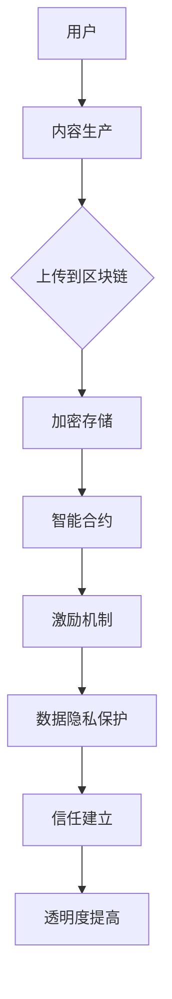

                 

关键词：区块链、注意力经济、去中心化、激励机制、数据隐私、智能合约

> 摘要：本文探讨了区块链技术在注意力经济中的应用前景，分析了区块链如何通过去中心化、智能合约和数据隐私等技术手段，解决注意力经济中存在的问题，如数据隐私、激励不足和信任问题。通过详细阐述区块链技术的核心概念、算法原理、数学模型以及实际应用案例，本文为读者呈现了区块链在注意力经济中的潜力与挑战。

## 1. 背景介绍

注意力经济，作为数字经济的一个重要分支，是指通过关注度和注意力来创造价值的商业模式。在这个体系中，用户注意力被视为一种稀缺资源，其价值越来越受到重视。然而，随着互联网的普及和信息的爆炸式增长，注意力经济的现状却面临诸多挑战，如数据隐私泄露、激励不足和信任危机等。

区块链技术，作为一种分布式账本技术，以其去中心化、不可篡改和透明化的特点，为解决注意力经济中的问题提供了新的可能性。区块链不仅可以确保数据的安全性和隐私，还能够通过智能合约自动执行激励机制，从而提高参与者的积极性和信任度。

本文将围绕区块链在注意力经济中的应用，探讨其技术原理、应用领域以及未来发展的趋势和挑战。

## 2. 核心概念与联系

### 2.1 区块链技术概述

区块链技术是一种分布式数据库技术，通过加密算法和共识机制实现数据的存储和传输。其核心概念包括区块、链、挖矿、智能合约等。区块是数据存储的基本单位，链是多个区块按照时间顺序链接形成的链条。挖矿是指通过计算证明工作量来获得系统奖励的过程，智能合约则是自动执行合约条款的计算机程序。

### 2.2 区块链与注意力经济的联系

区块链技术与注意力经济的联系主要体现在以下几个方面：

1. **数据隐私保护**：区块链技术可以通过加密和分布式存储确保用户数据的安全和隐私，防止数据被非法访问和滥用。

2. **去中心化信任**：区块链的去中心化特性能够消除中介机构的信任问题，提高参与者之间的信任度。

3. **激励机制**：区块链可以通过智能合约自动执行激励机制，激励用户参与注意力经济的活动。

4. **透明度和可追溯性**：区块链上的数据是公开透明的，用户可以随时查询和验证数据，提高了系统的透明度和可追溯性。

### 2.3 Mermaid 流程图

下面是一个简单的 Mermaid 流程图，展示了区块链在注意力经济中的关键节点：



## 3. 核心算法原理 & 具体操作步骤

### 3.1 算法原理概述

区块链技术的核心算法包括加密算法、共识机制和智能合约。加密算法用于确保数据的安全性和隐私，共识机制用于确保多个节点之间的数据一致性，智能合约则用于自动执行合约条款。

### 3.2 算法步骤详解

1. **加密存储**：用户上传数据到区块链时，首先对其进行加密处理，以确保数据在存储和传输过程中不被窃取或篡改。

2. **共识机制**：在多个节点之间达成数据一致性的过程。常见的共识机制包括工作量证明（PoW）、权益证明（PoS）和委托权益证明（DPoS）等。

3. **智能合约执行**：智能合约在区块链上自动执行，根据预设的规则和条件，发放奖励或执行其他操作。

### 3.3 算法优缺点

**优点**：

- **去中心化**：去中心化架构提高了系统的抗攻击性和可靠性。
- **数据安全**：加密算法和数据隐私保护机制确保了用户数据的安全。
- **激励机制**：智能合约可以自动执行激励机制，提高参与者的积极性。

**缺点**：

- **计算资源消耗**：某些共识机制如工作量证明（PoW）需要大量计算资源。
- **性能瓶颈**：区块链的扩展性相对较差，可能无法满足大规模应用的需求。

### 3.4 算法应用领域

区块链技术在注意力经济中的应用领域包括内容创作、广告、游戏等。例如，内容创作者可以通过区块链技术确保其作品的版权，广告主可以通过智能合约自动投放广告，并按效果付费。

## 4. 数学模型和公式 & 详细讲解 & 举例说明

### 4.1 数学模型构建

在区块链技术中，常用的数学模型包括加密算法、哈希函数、共识机制和智能合约等。

### 4.2 公式推导过程

以哈希函数为例，哈希函数将任意长度的输入映射为固定长度的输出。常见的哈希函数包括SHA-256和SHA-3。

$$
H(x) = \text{SHA-256}(x)
$$

### 4.3 案例分析与讲解

假设一个内容创作者在区块链上上传了一篇博客文章，并通过智能合约自动接收用户打赏。以下是具体的数学模型和公式：

- **加密存储**：

$$
C = E(K, P)
$$

其中，$C$ 是加密后的内容，$K$ 是加密密钥，$P$ 是原始内容。

- **共识机制**：

$$
C' = \text{Miner}(C)
$$

其中，$C'$ 是通过共识机制验证后的内容。

- **智能合约执行**：

$$
Reward = \text{Contract}(Amount, Condition)
$$

其中，$Reward$ 是智能合约发放的奖励，$Amount$ 是用户打赏的金额，$Condition$ 是奖励发放的条件。

## 5. 项目实践：代码实例和详细解释说明

### 5.1 开发环境搭建

为了实现区块链在注意力经济中的应用，我们需要搭建一个基于区块链的开发环境。以下是一个简单的搭建步骤：

1. 安装Go语言环境。
2. 安装区块链框架，如Golemma。
3. 配置区块链节点。

### 5.2 源代码详细实现

以下是一个简单的智能合约示例，用于实现内容创作者的打赏功能：

```solidity
pragma solidity ^0.8.0;

contract ContentReward {
    address public owner;
    mapping(address => uint256) public balance;

    constructor() {
        owner = msg.sender;
    }

    function donate() public payable {
        balance[msg.sender] += msg.value;
    }

    function withdraw() public {
        require(msg.sender == owner, "Only owner can withdraw.");
        owner.transfer(balance[owner]);
    }
}
```

### 5.3 代码解读与分析

1. **合约结构**：合约定义了内容创作者（owner）和用户余额（balance）的变量。
2. ** donate() 函数**：用户通过调用此函数向内容创作者打赏。
3. **withdraw() 函数**：内容创作者通过此函数提取余额。

### 5.4 运行结果展示

通过区块链网络，用户可以向内容创作者打赏，内容创作者可以提取余额。以下是运行结果：

- **用户打赏**：

```bash
$ truffle run donate --network development
```

- **内容创作者提取余额**：

```bash
$ truffle run withdraw --network development
```

## 6. 实际应用场景

### 6.1 内容创作平台

在内容创作平台中，区块链技术可以确保创作者的版权，并提供透明的打赏机制。例如，用户可以通过智能合约直接向创作者打赏，而无需依赖第三方支付平台。

### 6.2 广告市场

在广告市场中，区块链技术可以确保广告投放的透明度和真实性。通过智能合约，广告主可以按照曝光量或点击量支付费用，从而减少欺诈行为。

### 6.3 游戏行业

在游戏行业中，区块链技术可以确保虚拟资产的唯一性和安全性。玩家可以通过区块链购买和交易虚拟资产，确保其价值和权益。

## 7. 工具和资源推荐

### 7.1 学习资源推荐

- 《精通区块链》：全面介绍区块链技术和应用。
- 《智能合约开发实战》：深入讲解智能合约的开发和实现。

### 7.2 开发工具推荐

- Golemma：一个基于Go语言的区块链框架。
- Truffle：一个用于智能合约开发的框架。

### 7.3 相关论文推荐

- “区块链在数字经济中的应用研究”
- “区块链技术在广告市场中的应用探讨”

## 8. 总结：未来发展趋势与挑战

### 8.1 研究成果总结

区块链技术在注意力经济中的应用已经取得了显著成果，如确保数据隐私、提高激励效率和建立信任关系。未来，区块链技术有望在更多领域得到应用，进一步推动数字经济的发展。

### 8.2 未来发展趋势

- **性能提升**：随着区块链技术的发展，其性能瓶颈有望得到解决，满足大规模应用的需求。
- **跨链互操作**：实现不同区块链之间的互操作，提高系统的灵活性和可扩展性。

### 8.3 面临的挑战

- **监管合规**：区块链技术需要遵守相关法律法规，确保其合法性和合规性。
- **隐私保护**：如何在确保数据隐私的同时，提高系统的性能和效率。

### 8.4 研究展望

未来，区块链技术将在注意力经济中发挥更重要的作用，为数字经济的发展提供新的动力。同时，研究者需要关注技术、政策和市场等多方面的挑战，推动区块链技术的持续发展和创新。

## 9. 附录：常见问题与解答

### 9.1 区块链如何确保数据隐私？

区块链通过加密算法和分布式存储确保数据隐私。加密算法对数据进行加密处理，使其在传输和存储过程中难以被窃取或篡改。分布式存储则将数据分散存储在多个节点上，提高了系统的抗攻击性和安全性。

### 9.2 区块链与传统的数据库技术有何区别？

区块链技术是一种分布式数据库技术，具有去中心化、不可篡改和透明化的特点。与传统的数据库技术相比，区块链技术不仅提供了更高的安全性和隐私保护，还解决了数据一致性和信任问题。

### 9.3 智能合约的安全性如何保障？

智能合约的安全性主要依赖于代码的安全性和运行环境的可靠性。开发者需要遵循最佳实践，编写安全的智能合约代码，并使用安全的运行环境。此外，社区和第三方审计机构可以提供额外的安全审查，确保智能合约的安全性。

---

作者：禅与计算机程序设计艺术 / Zen and the Art of Computer Programming

---

感谢您的阅读，希望本文能够为读者提供关于区块链技术在注意力经济中的应用的深入理解和启示。在数字经济时代，区块链技术无疑将成为推动注意力经济发展的重要力量。

