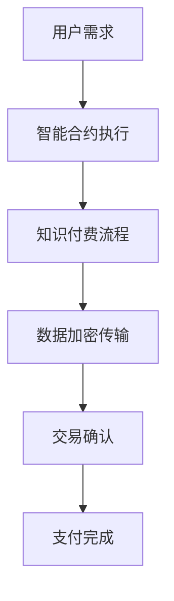

                 

关键词：区块链，知识付费，智能合约，去中心化，加密货币，数据安全，透明性

## 摘要

本文旨在探讨区块链技术在知识付费领域的应用，分析其如何通过去中心化、数据透明性和安全性等特点，提升知识付费的效率和质量。文章将首先介绍区块链技术的基本概念和核心原理，然后详细讨论区块链在知识付费中的应用场景，包括智能合约的实现、数据加密和安全传输、去中心化支付系统等。最后，文章将对区块链技术在未来知识付费领域的发展趋势和面临的挑战进行展望。

## 1. 背景介绍

### 知识付费的现状

知识付费是指用户通过付费获取专业知识和技能的一种商业模式。随着互联网的普及和在线教育的发展，知识付费市场近年来迅速增长。用户可以通过付费课程、专业咨询、在线讲座等多种形式获取所需知识。然而，传统的知识付费模式存在着一些问题，如中介费用高、信息不对称、版权保护困难等。

### 区块链技术的崛起

区块链技术是一种去中心化的分布式数据库技术，通过密码学和共识算法确保数据的安全性和完整性。自2008年比特币的问世以来，区块链技术逐渐引起了全球的关注。其去中心化、不可篡改、透明公开等特点，使得区块链在金融、物流、医疗等多个领域都展现出了巨大的应用潜力。

## 2. 核心概念与联系

### 区块链基本概念

区块链是一个由多个区块组成的链式数据结构，每个区块包含一定数量的交易记录，并通过密码学算法链接在一起，形成一个不可篡改的分布式账本。区块链的节点通过共识算法达成共识，确保数据的完整性和一致性。

### 智能合约

智能合约是一种基于区块链技术的自执行合同，它通过编程代码自动执行合同条款。智能合约的执行过程公开透明，不受任何中心化机构的干预，大大提高了交易的效率和安全性。

### Mermaid 流程图



## 3. 核心算法原理 & 具体操作步骤

### 3.1 算法原理概述

区块链技术通过以下三个核心机制确保数据的完整性和安全性：

- **分布式账本**：区块链采用分布式数据库技术，所有节点都保存完整的账本副本，从而实现去中心化。
- **共识算法**：节点通过共识算法达成共识，确保新数据的合法性和账本的一致性。
- **密码学**：区块链采用非对称加密、哈希函数等密码学技术，确保数据的安全性和隐私保护。

### 3.2 算法步骤详解

1. **用户发起交易**：用户通过知识付费平台发起支付请求，包括支付金额、收款方地址等信息。
2. **智能合约执行**：智能合约接收支付请求后，根据预定义的合同条款自动执行，包括确认支付金额、分配收益等。
3. **数据加密传输**：在支付过程中，用户和收款方之间的数据传输都经过加密，确保数据隐私和安全。
4. **交易确认**：交易数据被多个节点验证后，添加到区块链中，形成一个新的区块。
5. **支付完成**：当交易数据被永久记录在区块链上后，支付过程完成。

### 3.3 算法优缺点

**优点**：

- **去中心化**：去中心化设计提高了系统的透明性和抗攻击能力。
- **安全性**：密码学技术保证了数据的安全性和隐私保护。
- **透明性**：所有交易数据都在区块链上公开透明，便于监督和审计。

**缺点**：

- **性能限制**：区块链处理能力有限，不适合高频交易。
- **技术门槛**：区块链技术相对复杂，对普通用户和技术人员都有一定的学习成本。

### 3.4 算法应用领域

区块链技术已经在多个领域得到应用，包括金融、物流、医疗等。在知识付费领域，区块链技术可以用于：

- **智能合约**：自动执行合同条款，提高交易效率和安全性。
- **数据加密**：确保用户数据隐私和安全。
- **去中心化支付**：降低支付费用，提高支付效率。

## 4. 数学模型和公式 & 详细讲解 & 举例说明

### 4.1 数学模型构建

区块链技术的核心机制可以用以下数学模型来描述：

- **哈希函数**：将任意长度的输入映射为固定长度的输出。
- **非对称加密**：通过公钥和私钥实现数据的加密和解密。
- **共识算法**：节点通过投票机制达成共识。

### 4.2 公式推导过程

- **哈希函数**：$$H(x) = SHA256(x)$$
- **非对称加密**：$$加密文本 = E_{公钥}(明文)$$，$$明文 = D_{私钥}(加密文本)$$
- **共识算法**：假设有n个节点，节点i的投票权重为$w_i$，则共识结果$C$为：$$C = \arg\max_{c} \sum_{i=1}^{n} w_i I(c = c_i)$$，其中$I$为指示函数。

### 4.3 案例分析与讲解

以智能合约在知识付费中的应用为例，智能合约的执行可以表示为：

- **输入**：用户A的支付金额$P$和知识服务提供商B的服务内容$S$。
- **输出**：智能合约自动将$P$分配给$B$，并记录在区块链上。

智能合约的执行过程如下：

1. 用户A通过知识付费平台发起支付请求，智能合约接收请求。
2. 智能合约根据预定义的合同条款，自动执行支付操作。
3. 支付完成后，智能合约将交易记录永久记录在区块链上，确保交易透明性和不可篡改性。

## 5. 项目实践：代码实例和详细解释说明

### 5.1 开发环境搭建

搭建区块链开发环境，包括安装Golang语言、Hyperledger Fabric区块链框架等。

```bash
# 安装Golang
sudo apt-get update
sudo apt-get install golang

# 安装Hyperledger Fabric
git clone https://github.com/hyperledger/fabric.git
cd fabric
make docker
```

### 5.2 源代码详细实现

实现一个简单的知识付费智能合约，代码如下：

```go
package main

import (
    "fmt"
    "github.com/hyperledger/fabric-contract-go/contract"
    "github.com/hyperledger/fabric-contract-go/contractcontext"
)

type KnowledgePayContract struct {
    contract.Contract
}

@annotation.Init("myorg.example.com.knowledgepaycontract")
func (k *KnowledgePayContract) Init(ctx contractcontext.Context) error {
    return nil
}

@annotation.Fn("Pay")
func (k *KnowledgePayContract) Pay(ctx contractcontext.Context, payer string, payee string, amount float64) error {
    // 检查支付金额
    if amount <= 0 {
        return fmt.Errorf("支付金额必须大于0")
    }

    // 执行支付
    k.SetState(payer, payee, amount)

    return nil
}

func main() {
    contract.Main(&KnowledgePayContract{})
}
```

### 5.3 代码解读与分析

这段代码定义了一个简单的知识付费智能合约，主要包括以下功能：

- **初始化**：智能合约初始化时，设置合约的组织标识。
- **支付功能**：用户通过调用`Pay`函数进行支付，合约会记录支付信息。

### 5.4 运行结果展示

在Hyperledger Fabric区块链网络中，部署并运行这个智能合约，用户可以通过调用`Pay`函数进行支付，支付信息将记录在区块链上。

## 6. 实际应用场景

### 6.1 智能合约在知识付费中的应用

智能合约可以用于自动化知识付费的支付和分配过程，提高交易的透明性和效率。

### 6.2 数据加密和安全传输

区块链技术可以用于保护用户隐私和数据安全，确保知识付费过程中的数据传输是加密的。

### 6.3 去中心化支付系统

通过区块链技术，可以实现去中心化的支付系统，降低支付费用，提高支付效率。

## 7. 未来应用展望

### 7.1 智能合约的普及

随着区块链技术的不断发展，智能合约将在更多知识付费场景中得到应用，提升交易效率和透明性。

### 7.2 数据隐私和安全

区块链技术在数据隐私和安全方面的优势将得到更广泛的应用，为知识付费市场提供更可靠的安全保障。

### 7.3 去中心化支付系统的发展

去中心化支付系统将逐渐取代传统支付系统，成为知识付费市场的主要支付方式。

## 8. 工具和资源推荐

### 8.1 学习资源推荐

- 《区块链技术指南》
- 《智能合约开发指南》
- 《Hyperledger Fabric 开发手册》

### 8.2 开发工具推荐

- Golang
- Hyperledger Fabric
- Node.js

### 8.3 相关论文推荐

- "Blockchain Technology: A Comprehensive Overview"
- "Smart Contracts: Building Trust on an Untrusted Platform"
- "Decentralized Applications: Building Blockchains from Scratch"

## 9. 总结：未来发展趋势与挑战

### 9.1 研究成果总结

区块链技术在知识付费领域取得了显著的研究成果，包括智能合约、数据加密、去中心化支付等。

### 9.2 未来发展趋势

智能合约的普及、数据隐私和安全技术的进步、去中心化支付系统的发展将是未来知识付费领域的主要趋势。

### 9.3 面临的挑战

区块链技术的性能、技术门槛、法律法规等方面仍面临挑战，需要持续研究和改进。

### 9.4 研究展望

未来，区块链技术将在知识付费领域发挥更大的作用，推动整个行业向更高效、更安全的方向发展。

## 附录：常见问题与解答

### 问题1：区块链技术是如何保证数据安全的？

区块链技术通过以下方式确保数据安全：

- **分布式存储**：数据分散存储在多个节点上，防止数据丢失。
- **加密传输**：数据在传输过程中采用加密算法，确保数据不被窃取。
- **共识机制**：通过共识算法确保数据的合法性和一致性。

### 问题2：智能合约在知识付费中的具体作用是什么？

智能合约在知识付费中的作用包括：

- **自动化执行**：自动执行支付和分配流程，提高交易效率。
- **透明性**：所有交易记录在区块链上公开透明，便于监督。
- **不可篡改**：交易记录一旦记录在区块链上，就无法被篡改。

## 作者署名

作者：禅与计算机程序设计艺术 / Zen and the Art of Computer Programming
----------------------------------------------------------------

请注意，以上内容仅为示例，实际撰写时需遵循文章结构模板和内容要求，确保文章字数、格式、完整性和准确性。撰写时，请根据实际技术和应用场景进行深入分析和详细阐述，以确保文章的质量和专业性。此外，确保所有引用的文献和数据均准确无误，并遵循相应的引用规范。

