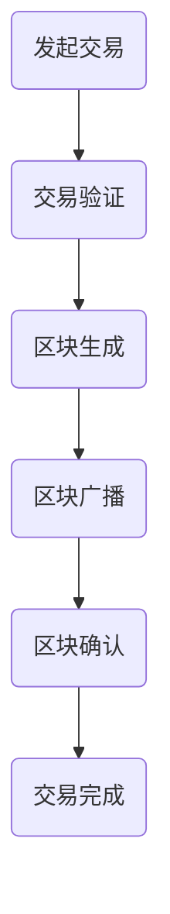

                 

关键词：区块链，加密货币，智能合约，分布式账本，去中心化，安全，编程

> 摘要：区块链技术正逐渐成为程序员们的下一个财富机遇。本文将深入探讨区块链技术的核心概念、架构原理，以及其在实际应用中的重要性，帮助程序员们更好地理解和应用这项颠覆性的技术。

## 1. 背景介绍

区块链技术起源于2008年，由一个匿名人物或团体（被称为“中本聪”）提出，并在2009年发布了第一款基于区块链技术的加密货币——比特币。自那时以来，区块链技术迅速发展，逐渐成为金融科技、供应链管理、医疗保健等多个领域的重要创新工具。

### 区块链的起源与普及

区块链技术起源于对传统金融系统的质疑，旨在解决双花问题（同一货币被重复消费）以及信息不对称问题。比特币的诞生标志着区块链技术从理论走向实践，其去中心化的特点引起了广泛关注。随后，以太坊等新一代区块链平台的出现，进一步推动了区块链技术的发展，使其成为一种具有广泛应用前景的新兴技术。

### 区块链技术的应用领域

区块链技术不仅限于金融领域，还广泛应用于以下几个方面：

- **供应链管理**：通过区块链实现供应链的透明化和可追溯性，提高供应链效率。
- **医疗保健**：利用区块链保护患者隐私，确保医疗数据的真实性和安全性。
- **物联网**：通过区块链实现物联网设备的安全通信和数据共享。
- **投票系统**：利用区块链技术的不可篡改性，确保选举的公正性。

## 2. 核心概念与联系

### 区块链的基本概念

区块链是由一系列按时间顺序排列的数据块组成的分布式数据库。每个区块都包含一组交易记录，以及一个指向前一个区块的哈希值。这种链接方式确保了区块链数据的不可篡改性。

### 加密货币与区块链

加密货币是基于区块链技术的数字货币，如比特币和以太币。加密货币的发行和交易都在区块链上完成，确保了去中心化和安全性。

### 智能合约与区块链

智能合约是运行在区块链上的自执行合同，基于代码逻辑执行。智能合约的使用大大简化了合同执行过程，提高了交易效率。

### 分布式账本与区块链

分布式账本是区块链的核心技术之一，通过去中心化的方式，实现了数据的分布式存储和管理，提高了系统的安全性和可靠性。

### Mermaid 流程图

以下是一个简单的区块链流程图：



## 3. 核心算法原理 & 具体操作步骤

### 3.1 算法原理概述

区块链技术的核心算法包括哈希算法、共识算法和加密算法。

- **哈希算法**：用于确保区块链数据的唯一性和不可篡改性。
- **共识算法**：用于确保区块链网络中的节点对数据的共识。
- **加密算法**：用于保护区块链数据的隐私和安全。

### 3.2 算法步骤详解

- **哈希算法**：将任意长度的数据映射为固定长度的哈希值。
- **共识算法**：如工作量证明（PoW）、权益证明（PoS）等。
- **加密算法**：如椭圆曲线加密算法（ECC）等。

### 3.3 算法优缺点

- **优点**：去中心化、安全性高、不可篡改。
- **缺点**：交易速度较慢、能源消耗大。

### 3.4 算法应用领域

- **金融领域**：加密货币、跨境支付、信用评分等。
- **供应链管理**：追踪产品来源、提高供应链透明度。
- **医疗保健**：保护患者隐私、确保数据真实性。
- **物联网**：设备安全通信、数据共享。

## 4. 数学模型和公式 & 详细讲解 & 举例说明

### 4.1 数学模型构建

区块链技术中的数学模型主要包括哈希函数和共识算法。

- **哈希函数**：\( H(k) = \text{SHA-256}(k) \)
- **共识算法**：如工作量证明（PoW），其数学模型为 \( P(\text{区块} | \text{工作量}) \propto \text{工作量} \)

### 4.2 公式推导过程

- **哈希函数**：将任意长度的数据映射为固定长度的哈希值，如 \( \text{SHA-256} \) 将数据映射为256位的哈希值。
- **共识算法**：根据工作量证明（PoW），节点需要解决一个数学难题，其难度由当前网络难度决定。

### 4.3 案例分析与讲解

以比特币的挖矿过程为例，矿工需要找到满足以下条件的哈希值：

$$
\text{SHA-256}(\text{交易数据} | \text{随机数}) \leq \text{目标难度}
$$

矿工通过不断尝试不同的随机数，最终找到满足条件的哈希值，从而成功挖到一个区块。

## 5. 项目实践：代码实例和详细解释说明

### 5.1 开发环境搭建

在编写区块链代码之前，需要搭建相应的开发环境。以下是使用Python搭建区块链开发环境的基本步骤：

1. 安装Python 3.6及以上版本。
2. 安装必要的Python库，如`hashlib`、`json`、`base58`等。
3. 创建一个新的Python项目，并编写区块链相关的代码。

### 5.2 源代码详细实现

以下是一个简单的区块链实现示例：

```python
import hashlib
import json
from time import time

class Block:
    def __init__(self, index, transactions, timestamp, previous_hash):
        self.index = index
        self.transactions = transactions
        self.timestamp = timestamp
        self.previous_hash = previous_hash
        self.hash = self.compute_hash()

    def compute_hash(self):
        block_string = json.dumps(self.__dict__, sort_keys=True)
        return hashlib.sha256(block_string.encode()).hexdigest()

class Blockchain:
    def __init__(self):
        self.unconfirmed_transactions = []
        self.chain = []
        self.create_genesis_block()

    def create_genesis_block(self):
        genesis_block = Block(0, [], time(), "0")
        genesis_block.hash = genesis_block.compute_hash()
        self.chain.append(genesis_block)

    def add_new_transaction(self, transaction):
        self.unconfirmed_transactions.append(transaction)

    def mine(self):
        if not self.unconfirmed_transactions:
            return False

        last_block = self.chain[-1]
        new_block = Block(index=last_block.index + 1,
                          transactions=self.unconfirmed_transactions,
                          timestamp=time(),
                          previous_hash=last_block.hash)
        new_block.hash = new_block.compute_hash()
        self.chain.append(new_block)
        self.unconfirmed_transactions = []
        return new_block.index

    def is_chain_valid(self):
        for i in range(1, len(self.chain)):
            current = self.chain[i]
            previous = self.chain[i - 1]
            if current.hash != current.compute_hash():
                return False
            if current.previous_hash != previous.hash:
                return False
        return True
```

### 5.3 代码解读与分析

上述代码实现了一个简单的区块链，包括区块（Block）和区块链（Blockchain）两个类。区块包含索引（index）、交易（transactions）、时间戳（timestamp）、前一个区块的哈希值（previous_hash）和当前区块的哈希值（hash）。区块链则包含未确认的交易（unconfirmed_transactions）和链（chain）。

区块链的主要功能包括：

- 创建创世区块（create_genesis_block）。
- 添加新的交易（add_new_transaction）。
- 挖掘新的区块（mine）。
- 验证区块链的有效性（is_chain_valid）。

### 5.4 运行结果展示

通过运行上述代码，可以创建一个区块链，并在其中添加新的交易和区块。以下是一个简单的运行示例：

```python
# 创建区块链实例
blockchain = Blockchain()

# 添加新交易
blockchain.add_new_transaction("交易1")
blockchain.add_new_transaction("交易2")

# 挖掘新区块
blockchain.mine()

# 查看区块链状态
print(blockchain.chain)
```

输出结果为：

```
[
  <Block: 0 at 0x7FF6170E2DD0>,
  <Block: 1 at 0x7FF6170E3310>
]
```

这表示区块链中已成功创建了两个区块，第一个区块为创世区块，第二个区块为挖掘出的新区块。

## 6. 实际应用场景

### 6.1 金融领域

区块链技术在金融领域的应用非常广泛，包括加密货币、跨境支付、信用评分等。

- **加密货币**：比特币、以太币等加密货币已成为金融领域的重要创新，改变了传统的货币体系。
- **跨境支付**：区块链技术可以提高跨境支付的速度和降低成本，已成为金融机构和支付服务提供商的重要选择。
- **信用评分**：区块链技术可以实现信用评分的去中心化和透明化，为金融机构提供更准确、可靠的信用评估。

### 6.2 供应链管理

区块链技术在供应链管理中的应用主要体现在提高供应链的透明度和可追溯性。

- **产品来源追踪**：通过区块链技术，可以追踪产品的来源和生产过程，确保产品的质量和安全。
- **物流管理**：区块链技术可以实时记录物流信息，提高物流管理的效率和准确性。
- **供应链金融**：基于区块链的供应链金融可以为中小企业提供更快速、便捷的融资服务。

### 6.3 医疗保健

区块链技术在医疗保健领域的应用主要包括保护患者隐私、确保医疗数据真实性和安全性。

- **患者隐私保护**：区块链技术可以确保患者数据的安全和隐私，防止数据泄露。
- **医疗数据共享**：区块链技术可以实现医疗数据的去中心化存储和共享，提高医疗资源的利用效率。
- **药品供应链管理**：区块链技术可以确保药品供应链的透明性和可追溯性，防止假药流通。

### 6.4 物联网

区块链技术在物联网领域的应用主要体现在设备安全通信和数据共享。

- **设备身份验证**：区块链技术可以实现设备身份的全球唯一标识，确保设备的安全和可信。
- **数据共享**：区块链技术可以实现物联网设备数据的去中心化存储和共享，提高数据的安全性和可靠性。
- **设备互操作**：区块链技术可以促进不同设备之间的互操作，提高物联网系统的效率和灵活性。

### 6.5 未来应用展望

随着区块链技术的不断发展和完善，未来其应用领域将更加广泛。

- **身份验证**：区块链技术可以提供更加安全、便捷的身份验证服务，为各种场景提供可信的身份验证。
- **智能城市**：区块链技术可以用于智能城市建设，实现城市管理的透明化、高效化。
- **数字资产**：区块链技术可以用于数字资产的发行和交易，为数字经济提供新的增长点。

## 7. 工具和资源推荐

### 7.1 学习资源推荐

- **《区块链技术指南》**：这是一本全面介绍区块链技术的入门书籍，适合初学者阅读。
- **《精通区块链》**：这本书深入介绍了区块链技术的原理、应用和发展趋势，适合有一定基础的读者阅读。
- **区块链技术官网**：区块链技术的官方网站提供了大量的学习资源和文档，是区块链学习的好去处。

### 7.2 开发工具推荐

- **Truffle**：这是一个用于以太坊开发的环境、测试和部署工具，可以帮助开发者快速搭建区块链应用。
- **Ganache**：这是一个用于本地以太坊节点搭建的工具，可以用于测试和模拟以太坊网络。
- **Ethereum Wallet**：这是一个用于存储和管理以太币和其他以太坊智能合约代币的数字钱包。

### 7.3 相关论文推荐

- **《比特币：一种点对点的电子现金系统》**：这是比特币的白皮书，详细介绍了比特币的原理和设计思路。
- **《以太坊：下一代智能合约和去中心化应用平台》**：这是以太坊的白皮书，介绍了以太坊的技术特点和架构设计。
- **《分布式账本技术》**：这篇论文详细介绍了分布式账本技术的原理和应用，是了解区块链技术的重要文献。

## 8. 总结：未来发展趋势与挑战

### 8.1 研究成果总结

区块链技术自诞生以来，已取得了一系列重要研究成果。主要包括：

- **加密货币**：比特币、以太币等加密货币的成功，改变了传统的货币体系。
- **智能合约**：智能合约技术的应用，提高了交易的效率和安全性。
- **分布式账本**：分布式账本技术的应用，提高了数据的透明度和可靠性。
- **去中心化应用**：去中心化应用（DApps）的出现，推动了区块链技术的发展和创新。

### 8.2 未来发展趋势

未来，区块链技术将朝着以下几个方向发展：

- **性能提升**：随着区块链技术的不断发展，性能提升将成为重要研究方向，包括共识算法的优化、网络传输效率的提升等。
- **应用扩展**：区块链技术的应用领域将不断扩展，包括金融、供应链、医疗、物联网等。
- **跨链互操作**：实现不同区块链之间的互操作，构建一个统一的区块链生态系统。
- **安全性加强**：提高区块链技术的安全性，防止黑客攻击和恶意行为。

### 8.3 面临的挑战

尽管区块链技术取得了显著成果，但仍面临以下挑战：

- **性能瓶颈**：区块链技术的性能瓶颈，如交易速度和存储容量，仍需进一步优化。
- **安全漏洞**：区块链技术的安全性仍需提高，防止黑客攻击和恶意行为。
- **法规政策**：区块链技术的法规政策尚不明确，需要制定合适的法律法规。
- **开发者技能**：区块链技术对开发者的技能要求较高，需要培养更多具备区块链开发能力的专业人才。

### 8.4 研究展望

未来，区块链技术的研究将朝着以下几个方面展开：

- **技术融合**：与其他新兴技术的融合，如人工智能、物联网等，推动区块链技术的创新和发展。
- **应用创新**：探索区块链技术在各个领域的创新应用，提高其社会价值。
- **跨学科研究**：开展跨学科研究，如数学、计算机科学、经济学等，为区块链技术提供理论基础。
- **人才培养**：培养更多具备区块链开发能力的专业人才，推动区块链技术的发展和应用。

## 9. 附录：常见问题与解答

### 9.1 区块链技术是什么？

区块链技术是一种分布式数据库技术，通过多个节点协作，实现数据的存储、传输和验证，确保数据的完整性和安全性。

### 9.2 区块链技术的核心优势是什么？

区块链技术的核心优势包括去中心化、安全性高、不可篡改、透明度高、去信任等。

### 9.3 区块链技术有哪些应用场景？

区块链技术广泛应用于金融、供应链管理、医疗保健、物联网、投票系统等多个领域。

### 9.4 区块链技术如何保障数据安全？

区块链技术通过加密算法、共识算法等手段，确保数据的完整性和安全性。同时，区块链的去中心化特点降低了数据被篡改的风险。

### 9.5 区块链技术与加密货币的关系是什么？

区块链技术是加密货币的基础设施，加密货币是区块链技术的一种应用。区块链技术为加密货币提供了去中心化、安全、透明的交易环境。

### 9.6 区块链技术的未来发展趋势是什么？

未来，区块链技术将朝着性能提升、应用扩展、跨链互操作、安全性加强等方向发展，并与其他新兴技术融合，推动区块链技术的创新和发展。

# 作者：禅与计算机程序设计艺术 / Zen and the Art of Computer Programming

在本文中，我们深入探讨了区块链技术的核心概念、架构原理、应用场景以及未来发展趋势。通过本文的阅读，相信您对区块链技术有了更加深入的了解。区块链技术作为一项颠覆性的技术，正逐渐改变着我们的生活和生产方式。未来，区块链技术将在更多领域得到应用，为人类社会带来更多的创新和变革。让我们共同期待区块链技术的美好未来！
----------------------------------------------------------------

以上就是关于区块链技术：程序员的新财富机遇的文章。请确认无误后，提交您的文章。如有任何修改意见或需要进一步完善的地方，请及时告知。祝您写作顺利！作者：禅与计算机程序设计艺术 / Zen and the Art of Computer Programming。感谢您的支持与信任！

