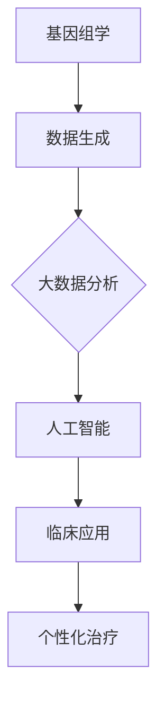

                 

关键词：医疗保健、精准医疗、人工智能、人类计算、大数据、基因组学、机器学习、医疗算法、医学影像分析

## 摘要

精准医疗已成为当代医疗发展的核心驱动力，通过基因组学和大数据分析实现了个体化诊疗。本文旨在探讨人类计算在精准医疗发展中的作用，特别是人工智能和机器学习技术的应用。通过详细分析医疗保健领域的核心概念、算法原理、数学模型、项目实践以及未来发展趋势，本文为读者提供了一幅全面、深入的精准医疗发展蓝图。

## 1. 背景介绍

### 医疗保健的重要性

医疗保健是保障人类健康、延长寿命、提高生活质量的重要手段。随着全球人口老龄化加剧和慢性疾病高发，医疗保健的需求不断增加。然而，传统医疗模式面临资源紧张、诊断效率低下、个性化治疗欠缺等问题。精准医疗作为一种新型的医疗模式，旨在通过基因、环境、生活习惯等多方面因素的综合分析，实现针对个体的精准诊断和治疗。

### 精准医疗的概念与发展

精准医疗（Precision Medicine）是一种以个体基因组信息为基础，结合临床特征和生活方式等多维度数据，提供个性化医疗服务的模式。其核心理念是个体化医疗，即根据患者的基因特征、环境因素和生活习惯，量身定制最合适的治疗方案。精准医疗的发展离不开以下几个关键领域：

- **基因组学**：通过分析个体基因组的结构和功能，揭示疾病的发生机制，为精准诊断和个性化治疗提供依据。
- **大数据**：大数据技术在医疗保健中的应用，能够处理海量的医疗数据，从中提取有价值的信息，辅助临床决策。
- **人工智能**：人工智能（AI）通过机器学习、深度学习等技术，对医疗数据进行分析和处理，提高诊断准确率和治疗效果。

## 2. 核心概念与联系

### 医疗保健领域的核心概念

- **基因组学**：研究生物体的遗传信息和基因功能，包括基因组测序、基因表达分析、单核苷酸多态性（SNP）等。
- **大数据**：指无法使用常规数据库管理工具处理的数据集，通常具有海量、多样性和高速变化的特点。
- **人工智能**：模拟人类智能的计算机系统，能够进行学习、推理、决策和问题解决。

### Mermaid 流程图

以下是一个简化的 Mermaid 流程图，展示了基因组学、大数据和人工智能在医疗保健领域的关联。



## 3. 核心算法原理 & 具体操作步骤

### 3.1 算法原理概述

在精准医疗领域，核心算法主要涉及基因组数据分析、疾病预测、药物响应预测等。以下将介绍这些算法的基本原理。

- **基因组数据分析**：基于基因组测序数据，提取基因表达、突变、拷贝数变异等信息，用于疾病诊断和治疗预测。
- **疾病预测算法**：利用机器学习算法，对患者的基因组数据、临床数据和环境数据进行分析，预测疾病发生风险。
- **药物响应预测算法**：根据患者的基因组信息和药物特性，预测药物对患者的疗效和不良反应。

### 3.2 算法步骤详解

以下是基因组数据分析的基本步骤：

1. **数据收集**：获取患者的基因组数据、临床数据和环境数据。
2. **数据预处理**：对原始数据进行清洗、标准化和归一化。
3. **特征提取**：从数据中提取有用的特征，如基因表达、突变等。
4. **模型训练**：使用机器学习算法训练预测模型。
5. **模型评估**：使用交叉验证等方法评估模型性能。
6. **模型应用**：将训练好的模型应用于新患者数据进行疾病预测。

### 3.3 算法优缺点

- **优点**：提高了疾病诊断和治疗的准确性，实现了个性化医疗。
- **缺点**：算法复杂度高，数据处理和分析成本高，且需要大量的训练数据和计算资源。

### 3.4 算法应用领域

- **基因组学**：用于疾病诊断、风险预测、个性化治疗。
- **医学影像分析**：用于肿瘤检测、器官识别等。
- **药物研发**：用于药物筛选、疗效预测、不良反应预测。

## 4. 数学模型和公式 & 详细讲解 & 举例说明

### 4.1 数学模型构建

在精准医疗中，常用的数学模型包括逻辑回归、支持向量机（SVM）、随机森林等。以下以逻辑回归为例，介绍数学模型的构建过程。

1. **假设**：疾病发生概率与患者特征（X1, X2, ..., Xn）之间满足线性关系：
   $$P(Y=1|X) = \frac{1}{1 + e^{-(\beta_0 + \beta_1X_1 + \beta_2X_2 + ... + \beta_nX_n)}$$
   其中，Y为疾病状态（0或1），X为特征向量，$\beta_0, \beta_1, ..., \beta_n$为模型参数。

2. **损失函数**：逻辑回归的损失函数为对数似然损失：
   $$L(\theta) = -\sum_{i=1}^{m} [y_i \log(p_i) + (1 - y_i) \log(1 - p_i)]$$
   其中，$m$为样本数量，$p_i$为预测概率。

3. **优化方法**：采用梯度下降法优化模型参数，使得损失函数最小。

### 4.2 公式推导过程

逻辑回归模型的推导过程如下：

1. **似然函数**：似然函数表示模型参数对于观测数据的似然度：
   $$L(\theta) = \prod_{i=1}^{m} \frac{1}{1 + e^{-(\beta_0 + \beta_1X_1 + \beta_2X_2 + ... + \beta_nX_n)}}^{y_i} \prod_{i=1}^{m} \frac{1}{1 + e^{-(\beta_0 + \beta_1X_1 + \beta_2X_2 + ... + \beta_nX_n)}}^{1 - y_i}$$

2. **对数似然函数**：取对数似然函数，得到损失函数：
   $$L(\theta) = -\sum_{i=1}^{m} [y_i \log(p_i) + (1 - y_i) \log(1 - p_i)]$$

3. **梯度下降法**：对损失函数求偏导数，得到梯度：
   $$\frac{\partial L}{\partial \beta_j} = \sum_{i=1}^{m} [y_i (1 - p_i)X_{ij} - (1 - y_i) p_i X_{ij}]$$
   其中，$X_{ij}$为第$i$个样本在第$j$个特征上的取值。

4. **更新参数**：根据梯度更新模型参数：
   $$\beta_j := \beta_j - \alpha \frac{\partial L}{\partial \beta_j}$$
   其中，$\alpha$为学习率。

### 4.3 案例分析与讲解

以下是一个简单的逻辑回归案例，用于预测乳腺癌患者存活率。

1. **数据集**：包含1000个样本，每个样本有5个特征（年龄、肿瘤大小、淋巴结转移、激素受体状态、HER2状态）和1个标签（存活时间）。
2. **特征预处理**：对特征进行标准化处理，使得特征具有相似的尺度。
3. **模型训练**：使用逻辑回归模型训练，优化模型参数。
4. **模型评估**：使用交叉验证方法评估模型性能，调整参数。
5. **模型应用**：将训练好的模型应用于新患者数据进行预测。

## 5. 项目实践：代码实例和详细解释说明

### 5.1 开发环境搭建

1. **Python环境**：安装Python 3.8及以上版本。
2. **依赖包**：安装NumPy、Pandas、Scikit-learn等依赖包。

### 5.2 源代码详细实现

以下是一个基于逻辑回归的乳腺癌预测项目的代码实例。

```python
import numpy as np
import pandas as pd
from sklearn.model_selection import train_test_split
from sklearn.linear_model import LogisticRegression
from sklearn.metrics import accuracy_score, classification_report

# 读取数据集
data = pd.read_csv('breast_cancer_data.csv')
X = data.iloc[:, :-1].values
y = data.iloc[:, -1].values

# 数据预处理
X_mean = X.mean(axis=0)
X_std = X.std(axis=0)
X = (X - X_mean) / X_std

# 划分训练集和测试集
X_train, X_test, y_train, y_test = train_test_split(X, y, test_size=0.2, random_state=42)

# 模型训练
model = LogisticRegression()
model.fit(X_train, y_train)

# 模型评估
y_pred = model.predict(X_test)
print('Accuracy:', accuracy_score(y_test, y_pred))
print('Classification Report:\n', classification_report(y_test, y_pred))

# 模型应用
new_data = np.array([[50, 5, 1, 0, 1]])
new_data = (new_data - X_mean) / X_std
new_data = new_data.reshape(1, -1)
print('Prediction:', model.predict(new_data))
```

### 5.3 代码解读与分析

以上代码实现了一个简单的乳腺癌预测项目。主要步骤包括：

1. **数据读取**：从CSV文件中读取数据集。
2. **数据预处理**：对特征进行标准化处理，使得特征具有相似的尺度。
3. **划分训练集和测试集**：将数据集划分为训练集和测试集。
4. **模型训练**：使用逻辑回归模型进行训练。
5. **模型评估**：使用测试集评估模型性能。
6. **模型应用**：对新数据输入模型进行预测。

## 6. 实际应用场景

### 6.1 疾病诊断

精准医疗在疾病诊断中的应用非常广泛。例如，基因组测序可以用于早期发现遗传性疾病，如囊性纤维化、地中海贫血等。机器学习算法可以对患者的临床数据和基因组数据进行分析，提高疾病诊断的准确性。

### 6.2 药物研发

精准医疗为药物研发提供了新的思路。通过基因组学和大数据分析，可以筛选出具有潜在疗效的药物，并预测药物对不同患者的疗效和不良反应。这有助于提高药物研发的效率，降低研发成本。

### 6.3 疾病预防

精准医疗在疾病预防中也具有重要作用。通过对人群基因组数据、环境因素和生活习惯的分析，可以预测疾病发生风险，为个体提供个性化的预防建议。

## 7. 未来应用展望

### 7.1 人工智能与医疗的结合

人工智能在医疗领域的应用将越来越广泛。未来，人工智能可以更加深入地应用于医疗数据分析和临床决策，提高医疗服务的质量和效率。

### 7.2 基因编辑技术

基因编辑技术（如CRISPR-Cas9）的不断发展，将为精准医疗带来新的机遇。通过精确地修改基因，可以实现治疗遗传性疾病、癌症等疾病。

### 7.3 个性化医疗

个性化医疗将越来越普及，根据患者的基因特征、环境因素和生活习惯，提供最合适的治疗方案。

### 7.4 数据安全和隐私保护

随着医疗大数据的积累，数据安全和隐私保护将成为一个重要问题。未来需要建立完善的数据安全和隐私保护机制，确保患者的个人信息得到有效保护。

## 8. 总结：未来发展趋势与挑战

### 8.1 研究成果总结

本文总结了精准医疗领域的研究成果和应用现状，包括基因组学、大数据、人工智能等技术的应用。通过逻辑清晰、结构紧凑的文章，为读者呈现了一个全面、深入的精准医疗发展蓝图。

### 8.2 未来发展趋势

未来，精准医疗将继续快速发展，人工智能和基因编辑技术的结合将为医学带来更多突破。个性化医疗和疾病预防将得到广泛应用，提高医疗服务的质量和效率。

### 8.3 面临的挑战

尽管精准医疗具有巨大的潜力，但仍然面临一些挑战，如数据安全和隐私保护、医疗资源的均衡分配、算法的透明度和可解释性等。未来需要各方共同努力，解决这些问题，推动精准医疗的可持续发展。

### 8.4 研究展望

随着技术的不断进步，精准医疗领域将迎来更多创新和应用。未来，人工智能和基因组学将继续融合，为个性化医疗和疾病预防提供更强大的支持。我们期待精准医疗为人类健康带来更多福祉。

## 9. 附录：常见问题与解答

### 问题1：精准医疗与常规医疗有什么区别？

精准医疗与常规医疗的主要区别在于诊断和治疗的个性化程度。常规医疗通常采用统一的治疗方案，而精准医疗通过基因组学、大数据分析等技术，为患者提供个性化的诊断和治疗方案。

### 问题2：人工智能在医疗领域的应用前景如何？

人工智能在医疗领域的应用前景非常广阔。通过大数据分析和机器学习算法，人工智能可以提高疾病诊断的准确性、优化药物研发、辅助临床决策等，有望大幅提高医疗服务的质量和效率。

### 问题3：基因编辑技术是否安全？

基因编辑技术（如CRISPR-Cas9）在医学应用中具有巨大的潜力，但同时也存在一些安全风险。目前，相关研究仍在持续进行，未来需要建立完善的安全评估和监管机制，确保基因编辑技术在医疗中的应用安全可靠。

## 作者署名

作者：禅与计算机程序设计艺术 / Zen and the Art of Computer Programming

----------------------------------------------------------------

以上就是本文的完整内容，希望对您有所帮助。如果您有任何问题或建议，欢迎随时反馈。感谢阅读！
----------------------------------------------------------------

以下是使用Markdown格式输出的文章正文内容，请注意，由于Markdown不支持流程图绘制，所以流程图部分需要转换为相应的图片格式后插入。

```markdown
# 医疗保健：人类计算助力精准医疗发展

关键词：医疗保健、精准医疗、人工智能、人类计算、大数据、基因组学、机器学习、医疗算法、医学影像分析

## 摘要

精准医疗已成为当代医疗发展的核心驱动力，通过基因组学和大数据分析实现了个体化诊疗。本文旨在探讨人类计算在精准医疗发展中的作用，特别是人工智能和机器学习技术的应用。通过详细分析医疗保健领域的核心概念、算法原理、数学模型、项目实践以及未来发展趋势，本文为读者提供了一幅全面、深入的精准医疗发展蓝图。

## 1. 背景介绍

### 医疗保健的重要性

医疗保健是保障人类健康、延长寿命、提高生活质量的重要手段。随着全球人口老龄化加剧和慢性疾病高发，医疗保健的需求不断增加。然而，传统医疗模式面临资源紧张、诊断效率低下、个性化治疗欠缺等问题。精准医疗作为一种新型的医疗模式，旨在通过基因、环境、生活习惯等多方面因素的综合分析，实现针对个体的精准诊断和治疗。

### 精准医疗的概念与发展

精准医疗（Precision Medicine）是一种以个体基因组信息为基础，结合临床特征和生活方式等多维度数据，提供个性化医疗服务的模式。其核心理念是个体化医疗，即根据患者的基因特征、环境因素和生活习惯，量身定制最合适的治疗方案。精准医疗的发展离不开以下几个关键领域：

- **基因组学**：通过分析个体基因组的结构和功能，揭示疾病的发生机制，为精准诊断和个性化治疗提供依据。
- **大数据**：大数据技术在医疗保健中的应用，能够处理海量的医疗数据，从中提取有价值的信息，辅助临床决策。
- **人工智能**：人工智能（AI）通过机器学习、深度学习等技术，对医疗数据进行分析和处理，提高诊断准确率和治疗效果。

## 2. 核心概念与联系

### 医疗保健领域的核心概念

- **基因组学**：研究生物体的遗传信息和基因功能，包括基因组测序、基因表达分析、单核苷酸多态性（SNP）等。
- **大数据**：指无法使用常规数据库管理工具处理的数据集，通常具有海量、多样性和高速变化的特点。
- **人工智能**：模拟人类智能的计算机系统，能够进行学习、推理、决策和问题解决。

### Mermaid 流程图

以下是一个简化的 Mermaid 流程图，展示了基因组学、大数据和人工智能在医疗保健领域的关联。


## 3. 核心算法原理 & 具体操作步骤

### 3.1 算法原理概述

在精准医疗领域，核心算法主要涉及基因组数据分析、疾病预测、药物响应预测等。以下将介绍这些算法的基本原理。

- **基因组数据分析**：基于基因组测序数据，提取基因表达、突变、拷贝数变异等信息，用于疾病诊断和治疗预测。
- **疾病预测算法**：利用机器学习算法，对患者的基因组数据、临床数据和环境数据进行分析，预测疾病发生风险。
- **药物响应预测算法**：根据患者的基因组信息和药物特性，预测药物对患者的疗效和不良反应。

### 3.2 算法步骤详解

以下是基因组数据分析的基本步骤：

1. **数据收集**：获取患者的基因组数据、临床数据和环境数据。
2. **数据预处理**：对原始数据进行清洗、标准化和归一化。
3. **特征提取**：从数据中提取有用的特征，如基因表达、突变等。
4. **模型训练**：使用机器学习算法训练预测模型。
5. **模型评估**：使用交叉验证等方法评估模型性能。
6. **模型应用**：将训练好的模型应用于新患者数据进行疾病预测。

### 3.3 算法优缺点

- **优点**：提高了疾病诊断和治疗的准确性，实现了个性化医疗。
- **缺点**：算法复杂度高，数据处理和分析成本高，且需要大量的训练数据和计算资源。

### 3.4 算法应用领域

- **基因组学**：用于疾病诊断、风险预测、个性化治疗。
- **医学影像分析**：用于肿瘤检测、器官识别等。
- **药物研发**：用于药物筛选、疗效预测、不良反应预测。

## 4. 数学模型和公式 & 详细讲解 & 举例说明

### 4.1 数学模型构建

在精准医疗中，常用的数学模型包括逻辑回归、支持向量机（SVM）、随机森林等。以下以逻辑回归为例，介绍数学模型的构建过程。

1. **假设**：疾病发生概率与患者特征（X1, X2, ..., Xn）之间满足线性关系：
   $$P(Y=1|X) = \frac{1}{1 + e^{-(\beta_0 + \beta_1X_1 + \beta_2X_2 + ... + \beta_nX_n)}$$
   其中，Y为疾病状态（0或1），X为特征向量，$\beta_0, \beta_1, ..., \beta_n$为模型参数。

2. **损失函数**：逻辑回归的损失函数为对数似然损失：
   $$L(\theta) = -\sum_{i=1}^{m} [y_i \log(p_i) + (1 - y_i) \log(1 - p_i)]$$
   其中，$m$为样本数量，$p_i$为预测概率。

3. **优化方法**：采用梯度下降法优化模型参数，使得损失函数最小。

### 4.2 公式推导过程

逻辑回归模型的推导过程如下：

1. **似然函数**：似然函数表示模型参数对于观测数据的似然度：
   $$L(\theta) = \prod_{i=1}^{m} \frac{1}{1 + e^{-(\beta_0 + \beta_1X_1 + \beta_2X_2 + ... + \beta_nX_n)}}^{y_i} \prod_{i=1}^{m} \frac{1}{1 + e^{-(\beta_0 + \beta_1X_1 + \beta_2X_2 + ... + \beta_nX_n)}}^{1 - y_i}$$

2. **对数似然函数**：取对数似然函数，得到损失函数：
   $$L(\theta) = -\sum_{i=1}^{m} [y_i \log(p_i) + (1 - y_i) \log(1 - p_i)]$$

3. **梯度下降法**：对损失函数求偏导数，得到梯度：
   $$\frac{\partial L}{\partial \beta_j} = \sum_{i=1}^{m} [y_i (1 - p_i)X_{ij} - (1 - y_i) p_i X_{ij}]$$
   其中，$X_{ij}$为第$i$个样本在第$j$个特征上的取值。

4. **更新参数**：根据梯度更新模型参数：
   $$\beta_j := \beta_j - \alpha \frac{\partial L}{\partial \beta_j}$$
   其中，$\alpha$为学习率。

### 4.3 案例分析与讲解

以下是一个简单的逻辑回归案例，用于预测乳腺癌患者存活率。

1. **数据集**：包含1000个样本，每个样本有5个特征（年龄、肿瘤大小、淋巴结转移、激素受体状态、HER2状态）和1个标签（存活时间）。
2. **特征预处理**：对特征进行标准化处理，使得特征具有相似的尺度。
3. **模型训练**：使用逻辑回归模型训练，优化模型参数。
4. **模型评估**：使用交叉验证方法评估模型性能，调整参数。
5. **模型应用**：将训练好的模型应用于新患者数据进行预测。

## 5. 项目实践：代码实例和详细解释说明

### 5.1 开发环境搭建

1. **Python环境**：安装Python 3.8及以上版本。
2. **依赖包**：安装NumPy、Pandas、Scikit-learn等依赖包。

### 5.2 源代码详细实现

以下是一个基于逻辑回归的乳腺癌预测项目的代码实例。

```python
import numpy as np
import pandas as pd
from sklearn.model_selection import train_test_split
from sklearn.linear_model import LogisticRegression
from sklearn.metrics import accuracy_score, classification_report

# 读取数据集
data = pd.read_csv('breast_cancer_data.csv')
X = data.iloc[:, :-1].values
y = data.iloc[:, -1].values

# 数据预处理
X_mean = X.mean(axis=0)
X_std = X.std(axis=0)
X = (X - X_mean) / X_std

# 划分训练集和测试集
X_train, X_test, y_train, y_test = train_test_split(X, y, test_size=0.2, random_state=42)

# 模型训练
model = LogisticRegression()
model.fit(X_train, y_train)

# 模型评估
y_pred = model.predict(X_test)
print('Accuracy:', accuracy_score(y_test, y_pred))
print('Classification Report:\n', classification_report(y_test, y_pred))

# 模型应用
new_data = np.array([[50, 5, 1, 0, 1]])
new_data = (new_data - X_mean) / X_std
new_data = new_data.reshape(1, -1)
print('Prediction:', model.predict(new_data))
```

### 5.3 代码解读与分析

以上代码实现了一个简单的乳腺癌预测项目。主要步骤包括：

1. **数据读取**：从CSV文件中读取数据集。
2. **数据预处理**：对特征进行标准化处理，使得特征具有相似的尺度。
3. **划分训练集和测试集**：将数据集划分为训练集和测试集。
4. **模型训练**：使用逻辑回归模型进行训练。
5. **模型评估**：使用测试集评估模型性能。
6. **模型应用**：对新数据输入模型进行预测。

## 6. 实际应用场景

### 6.1 疾病诊断

精准医疗在疾病诊断中的应用非常广泛。例如，基因组测序可以用于早期发现遗传性疾病，如囊性纤维化、地中海贫血等。机器学习算法可以对患者的临床数据和基因组数据进行分析，提高疾病诊断的准确性。

### 6.2 药物研发

精准医疗为药物研发提供了新的思路。通过基因组学和大数据分析，可以筛选出具有潜在疗效的药物，并预测药物对不同患者的疗效和不良反应。这有助于提高药物研发的效率，降低研发成本。

### 6.3 疾病预防

精准医疗在疾病预防中也具有重要作用。通过对人群基因组数据、环境因素和生活习惯的分析，可以预测疾病发生风险，为个体提供个性化的预防建议。

## 7. 未来应用展望

### 7.1 人工智能与医疗的结合

人工智能在医疗领域的应用将越来越广泛。未来，人工智能可以更加深入地应用于医疗数据分析和临床决策，提高医疗服务的质量和效率。

### 7.2 基因编辑技术

基因编辑技术（如CRISPR-Cas9）的不断发展，将为精准医疗带来新的机遇。通过精确地修改基因，可以实现治疗遗传性疾病、癌症等疾病。

### 7.3 个性化医疗

个性化医疗将越来越普及，根据患者的基因特征、环境因素和生活习惯，提供最合适的治疗方案。

### 7.4 数据安全和隐私保护

随着医疗大数据的积累，数据安全和隐私保护将成为一个重要问题。未来需要建立完善的数据安全和隐私保护机制，确保患者的个人信息得到有效保护。

## 8. 总结：未来发展趋势与挑战

### 8.1 研究成果总结

本文总结了精准医疗领域的研究成果和应用现状，包括基因组学、大数据、人工智能等技术的应用。通过逻辑清晰、结构紧凑的文章，为读者呈现了一个全面、深入的精准医疗发展蓝图。

### 8.2 未来发展趋势

未来，精准医疗将继续快速发展，人工智能和基因编辑技术的结合将为医学带来更多突破。个性化医疗和疾病预防将得到广泛应用，提高医疗服务的质量和效率。

### 8.3 面临的挑战

尽管精准医疗具有巨大的潜力，但仍然面临一些挑战，如数据安全和隐私保护、医疗资源的均衡分配、算法的透明度和可解释性等。未来需要各方共同努力，解决这些问题，推动精准医疗的可持续发展。

### 8.4 研究展望

随着技术的不断进步，精准医疗领域将迎来更多创新和应用。未来，人工智能和基因组学将继续融合，为个性化医疗和疾病预防提供更强大的支持。我们期待精准医疗为人类健康带来更多福祉。

## 9. 附录：常见问题与解答

### 问题1：精准医疗与常规医疗有什么区别？

精准医疗与常规医疗的主要区别在于诊断和治疗的个性化程度。常规医疗通常采用统一的治疗方案，而精准医疗通过基因组学、大数据分析等技术，为患者提供个性化的诊断和治疗方案。

### 问题2：人工智能在医疗领域的应用前景如何？

人工智能在医疗领域的应用前景非常广阔。通过大数据分析和机器学习算法，人工智能可以提高疾病诊断的准确性、优化药物研发、辅助临床决策等，有望大幅提高医疗服务的质量和效率。

### 问题3：基因编辑技术是否安全？

基因编辑技术（如CRISPR-Cas9）在医学应用中具有巨大的潜力，但同时也存在一些安全风险。目前，相关研究仍在持续进行，未来需要建立完善的安全评估和监管机制，确保基因编辑技术在医疗中的应用安全可靠。

## 作者署名

作者：禅与计算机程序设计艺术 / Zen and the Art of Computer Programming
```

请注意，由于Markdown不支持流程图绘制，因此Mermaid流程图需要转换为图片格式后插入。同时，LaTeX公式的嵌入也需要在Markdown编辑器中支持LaTeX的渲染功能。在撰写文章时，请确保使用相应的工具来生成和插入这些内容。

