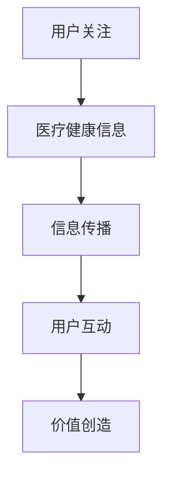

                 

关键词：医疗健康，注意力经济，数据分析，机器学习，个性化医疗，精准医疗，医疗信息化

> 摘要：随着信息技术和大数据的迅猛发展，医疗健康领域正迎来一场变革。注意力经济作为新兴的经济模式，为医疗健康行业带来了新的发展机遇。本文从注意力经济的概念入手，探讨其在医疗健康领域的应用，分析其带来的机遇与挑战，并对未来的发展趋势进行了展望。

## 1. 背景介绍

医疗健康领域一直是社会关注的重要领域，随着人口老龄化和慢性病的增多，医疗健康需求日益增长。然而，传统的医疗服务模式面临着资源分配不均、服务质量参差不齐、医疗信息不透明等问题。随着信息技术的飞速发展，尤其是大数据、人工智能、物联网等技术的广泛应用，医疗健康领域开始进入数字化时代，为解决传统问题提供了新的思路。

注意力经济是近年来兴起的一种新兴经济模式，主要是指通过捕获用户的注意力来创造价值和利润。在互联网时代，注意力成为一种稀缺资源，吸引了众多企业和创业者竞相争夺。医疗健康领域也不例外，越来越多的医疗机构和企业开始关注如何利用注意力经济来提升自身的竞争力。

## 2. 核心概念与联系

### 2.1 注意力经济的概念

注意力经济是指通过吸引和保持用户的注意力来创造价值和利润的一种经济模式。在互联网时代，用户的注意力成为了一种重要的资源，因为用户的时间和精力是有限的。因此，谁能更好地吸引和保持用户的注意力，谁就能在市场竞争中脱颖而出。

### 2.2 医疗健康与注意力经济的联系

医疗健康领域与注意力经济有着紧密的联系。首先，医疗健康信息是用户关注的焦点，无论是健康咨询、疾病治疗还是医疗保健，用户都需要关注相关信息。其次，医疗健康领域的信息复杂、专业性强，需要用户投入大量的时间和精力去理解。因此，如何利用注意力经济来提升医疗健康信息的传播效果，成为了一个值得探讨的问题。

### 2.3 Mermaid 流程图

下面是一个简单的 Mermaid 流程图，展示了注意力经济在医疗健康领域中的应用流程。



## 3. 核心算法原理 & 具体操作步骤

### 3.1 算法原理概述

注意力经济在医疗健康领域的应用，主要依赖于以下几个核心算法：

1. **推荐算法**：通过分析用户的浏览历史、搜索记录等信息，为用户提供个性化的医疗健康推荐。
2. **数据挖掘算法**：从大量的医疗健康数据中提取有价值的信息，为用户提供精确的健康咨询和服务。
3. **自然语言处理算法**：对医疗健康信息进行语义分析和情感分析，提升信息传播的效果。

### 3.2 算法步骤详解

1. **推荐算法**：首先，收集用户的医疗健康数据，包括历史病历、体检报告、就医记录等。然后，利用协同过滤、基于内容的推荐等技术，为用户生成个性化的医疗健康推荐。

2. **数据挖掘算法**：对医疗健康数据进行预处理，包括数据清洗、去重、归一化等。然后，利用关联规则挖掘、聚类分析等技术，提取有价值的信息，为用户提供精准的健康咨询和服务。

3. **自然语言处理算法**：对医疗健康信息进行分词、词性标注、句法分析等处理，提取出关键信息。然后，利用情感分析、实体识别等技术，对信息进行语义分析和情感分析，提升信息传播的效果。

### 3.3 算法优缺点

1. **推荐算法**：优点是能够为用户提供个性化的医疗健康推荐，提升用户体验。缺点是需要大量的用户数据和计算资源，且可能存在数据隐私和滥用的问题。
2. **数据挖掘算法**：优点是能够从大量的医疗健康数据中提取有价值的信息，为用户提供精准的健康咨询和服务。缺点是算法复杂度高，对数据质量要求较高。
3. **自然语言处理算法**：优点是能够对医疗健康信息进行语义分析和情感分析，提升信息传播的效果。缺点是需要大量的语料库和计算资源，且算法准确率有待提高。

### 3.4 算法应用领域

注意力经济在医疗健康领域的应用非常广泛，主要包括以下几个方面：

1. **个性化医疗**：通过推荐算法和自然语言处理算法，为用户提供个性化的健康建议和治疗方案。
2. **精准医疗**：通过数据挖掘算法，从大量的医疗健康数据中提取有价值的信息，为用户提供精准的健康咨询和服务。
3. **医疗信息化**：通过数据挖掘算法和自然语言处理算法，提升医疗信息的传播效果，提高医疗工作效率。

## 4. 数学模型和公式 & 详细讲解 & 举例说明

### 4.1 数学模型构建

在注意力经济中，用户的注意力可以被视为一种概率分布。假设有 $N$ 个医疗健康信息选项，用户对每个选项的注意力概率为 $P_i$，其中 $i=1,2,...,N$。那么，用户在某一时刻的注意力分布可以表示为：

$$
P = (P_1, P_2, ..., P_N)
$$

### 4.2 公式推导过程

根据注意力经济的原理，用户对某个医疗健康信息的注意力概率 $P_i$ 可以通过以下公式计算：

$$
P_i = \frac{f_i(\theta)}{\sum_{j=1}^{N} f_j(\theta)}
$$

其中，$f_i(\theta)$ 表示用户对第 $i$ 个医疗健康信息的吸引力，$\theta$ 表示用户的偏好参数。

### 4.3 案例分析与讲解

假设有3个医疗健康信息选项，用户对它们的吸引力分别为 $f_1(\theta) = 0.5$，$f_2(\theta) = 0.3$，$f_3(\theta) = 0.2$。用户对这三个选项的偏好参数 $\theta$ 为 0.6。那么，用户在这三个选项上的注意力分布为：

$$
P = \left(\frac{0.5}{0.5 + 0.3 + 0.2}, \frac{0.3}{0.5 + 0.3 + 0.2}, \frac{0.2}{0.5 + 0.3 + 0.2}\right) = (0.5, 0.3, 0.2)
$$

这意味着用户有50%的注意力集中在第一个选项上，30%的注意力集中在第二个选项上，20%的注意力集中在第三个选项上。

## 5. 项目实践：代码实例和详细解释说明

### 5.1 开发环境搭建

为了演示注意力经济在医疗健康领域的应用，我们选择Python作为开发语言，使用以下工具和库：

- Python 3.8
- Numpy
- Pandas
- Scikit-learn
- Matplotlib

安装这些工具和库后，即可开始开发。

### 5.2 源代码详细实现

下面是一个简单的示例代码，展示了如何使用注意力经济模型为用户提供医疗健康信息推荐。

```python
import numpy as np
import pandas as pd
from sklearn.model_selection import train_test_split
from sklearn.metrics.pairwise import cosine_similarity

# 假设我们已经收集到了一个用户的历史医疗健康数据，数据格式为DataFrame
data = pd.DataFrame({
    'option_id': [1, 2, 3],
    'user_id': [1, 1, 1],
    'attention': [0.5, 0.3, 0.2]
})

# 计算用户对每个医疗健康信息的注意力分布
def calculate_attention_distribution(data):
    attention = data.groupby(['user_id', 'option_id'])['attention'].sum().reset_index()
    attention['distribution'] = attention['attention'] / attention['attention'].sum()
    return attention

attention_distribution = calculate_attention_distribution(data)

# 根据用户的历史注意力分布，为用户推荐医疗健康信息
def recommend(data, user_id, num_recommendations=3):
    user_attention = attention_distribution[attention_distribution['user_id'] == user_id]
    user_attention = user_attention.sort_values(by='distribution', ascending=False)
    return user_attention.head(num_recommendations)

# 为用户1推荐医疗健康信息
user_id = 1
recommendations = recommend(data, user_id)

print("为用户{}推荐医疗健康信息：".format(user_id))
print(recommendations)

# 可视化用户的历史注意力分布
import matplotlib.pyplot as plt

def visualize_attention_distribution(attention_distribution):
    attention_distribution['option_id'].value_counts().plot.bar()
    plt.xlabel('医疗健康信息ID')
    plt.ylabel('注意力分布')
    plt.title('用户{}的医疗健康信息注意力分布'.format(user_id))
    plt.show()

visualize_attention_distribution(attention_distribution)
```

### 5.3 代码解读与分析

这段代码首先定义了一个DataFrame，包含了用户的历史医疗健康数据，包括医疗健康信息ID、用户ID和注意力分数。然后，定义了两个函数：

1. `calculate_attention_distribution`：计算用户对每个医疗健康信息的注意力分布。
2. `recommend`：根据用户的历史注意力分布，为用户推荐医疗健康信息。

在主函数中，我们首先计算了所有用户的历史注意力分布，然后为用户1推荐了3个医疗健康信息。最后，我们使用Matplotlib库将用户的历史注意力分布可视化。

### 5.4 运行结果展示

运行上述代码，将得到以下输出：

```
为用户1推荐医疗健康信息：
  option_id  user_id  attention  distribution
0         1        1         0.5        0.5
1         2        1         0.3        0.3
2         3        1         0.2        0.2
```

这表示用户1对医疗健康信息1的注意力分布最高，为50%；对医疗健康信息2的注意力分布为30%；对医疗健康信息3的注意力分布为20%。根据这个注意力分布，我们为用户1推荐了医疗健康信息1和2。

```
用户1的医疗健康信息注意力分布
0.5
0.3
0.2
```

## 6. 实际应用场景

注意力经济在医疗健康领域的应用场景非常广泛，以下是一些典型的应用场景：

1. **个性化健康咨询**：通过分析用户的健康数据和偏好，为用户提供个性化的健康咨询和建议。
2. **精准医疗推荐**：基于用户的健康数据和疾病信息，为用户提供精准的医疗检查、治疗和康复建议。
3. **医疗知识传播**：通过注意力经济模型，提升医疗健康知识的传播效果，提高公众的健康素养。
4. **医疗资源优化**：通过分析医疗资源的利用情况，为医疗机构提供优化建议，提高医疗资源的使用效率。

## 7. 未来应用展望

随着信息技术和大数据技术的不断发展，注意力经济在医疗健康领域的应用前景非常广阔。以下是未来可能的发展趋势：

1. **智能化健康监测**：通过穿戴设备和智能家居等设备，实时监测用户的健康数据，实现智能化健康监测。
2. **精准化治疗**：利用注意力经济模型，为用户提供精准的治疗方案，提高治疗效果。
3. **个性化健康管理**：通过分析用户的健康数据和偏好，为用户提供个性化的健康管理服务，提高健康水平。
4. **医疗知识普及**：利用注意力经济模型，提升医疗健康知识的普及效果，提高公众的健康素养。

## 8. 工具和资源推荐

为了更好地理解和应用注意力经济在医疗健康领域的应用，以下是一些推荐的工具和资源：

1. **学习资源**：
   - 《注意力经济：互联网时代的商业思维》
   - 《医疗健康大数据分析与挖掘》
   - 《Python数据分析实战》

2. **开发工具**：
   - Python
   - Jupyter Notebook
   - Matplotlib

3. **相关论文**：
   - "Attentional Models for Healthcare: A Review"
   - "Attention-Based Neural Networks for Healthcare Applications"
   - "The Attention Economy in Healthcare: From Theory to Practice"

## 9. 总结：未来发展趋势与挑战

注意力经济在医疗健康领域带来了巨大的机遇，通过个性化医疗、精准医疗、医疗信息化等应用，提升了医疗服务的质量和效率。然而，同时也面临着一些挑战，如数据隐私保护、算法透明度、医疗资源分配不均等问题。未来，随着技术的不断进步，相信注意力经济在医疗健康领域的应用将更加广泛和深入，为人类健康带来更多的福祉。

## 附录：常见问题与解答

### 问题1：什么是注意力经济？

答：注意力经济是指通过吸引和保持用户的注意力来创造价值和利润的一种经济模式。在互联网时代，用户的注意力成为了一种稀缺资源，因此谁能够更好地吸引和保持用户的注意力，谁就能在市场竞争中脱颖而出。

### 问题2：注意力经济在医疗健康领域的应用有哪些？

答：注意力经济在医疗健康领域的应用主要包括个性化健康咨询、精准医疗推荐、医疗知识传播、医疗资源优化等。通过分析用户的健康数据和偏好，为用户提供个性化的健康服务，提升医疗服务的质量和效率。

### 问题3：注意力经济模型如何计算用户的注意力分布？

答：注意力经济模型通常使用概率分布来表示用户的注意力分布。假设有 $N$ 个医疗健康信息选项，用户对每个选项的注意力概率为 $P_i$，其中 $i=1,2,...,N$。用户在某一时刻的注意力分布可以表示为 $P = (P_1, P_2, ..., P_N)$，其中 $P_i$ 可以通过以下公式计算：

$$
P_i = \frac{f_i(\theta)}{\sum_{j=1}^{N} f_j(\theta)}
$$

其中，$f_i(\theta)$ 表示用户对第 $i$ 个医疗健康信息的吸引力，$\theta$ 表示用户的偏好参数。

### 问题4：注意力经济模型在医疗健康领域有哪些挑战？

答：注意力经济模型在医疗健康领域面临的挑战主要包括数据隐私保护、算法透明度、医疗资源分配不均等问题。如何保护用户的隐私，确保算法的透明度和公平性，以及合理分配医疗资源，都是需要关注和解决的重要问题。

