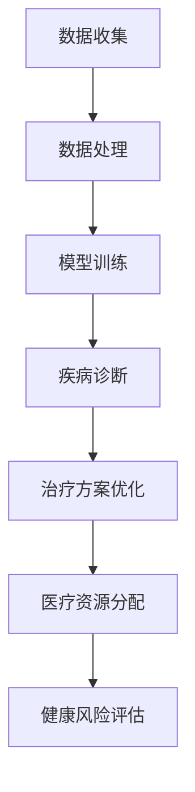

                 

关键词：人工智能、医疗健康、AI大模型、应用前景、技术挑战

> 摘要：本文将深入探讨医疗健康领域内人工智能大模型的现状、核心概念、算法原理、数学模型、项目实践以及未来应用前景。通过分析医疗健康领域的独特需求，我们旨在揭示AI大模型在这一领域的巨大潜力及其面临的挑战。

## 1. 背景介绍

随着信息技术的飞速发展和大数据的积累，医疗健康领域正在经历一场深刻的变革。传统的医疗模式已经无法满足日益增长的医疗需求，尤其是针对个性化医疗、疾病预测、治疗决策等复杂问题。人工智能（AI）的兴起为医疗健康领域带来了新的机遇和挑战。

AI大模型，即具有海量参数和强大计算能力的人工神经网络模型，已经在多个领域取得了显著成果。在医疗健康领域，AI大模型的应用前景广阔，可以大幅提升疾病诊断的准确性、优化治疗方案、提高医疗资源利用效率。本文将重点关注以下几个方面：

1. AI大模型在医疗健康领域的应用现状。
2. 核心概念与联系。
3. 核心算法原理与具体操作步骤。
4. 数学模型与公式。
5. 项目实践：代码实例与详细解释。
6. 实际应用场景与未来展望。
7. 工具和资源推荐。
8. 未来发展趋势与挑战。

## 2. 核心概念与联系

为了更好地理解AI大模型在医疗健康领域的应用，我们需要了解以下几个核心概念：

### 2.1 人工智能（AI）

人工智能是指使计算机系统能够模拟人类智能行为的技术。它包括机器学习、深度学习、自然语言处理等多个子领域。

### 2.2 大模型

大模型是指具有大量参数和强大计算能力的人工神经网络模型。这些模型通常通过大规模数据训练得到，具有很高的准确性和泛化能力。

### 2.3 医疗健康

医疗健康是指与疾病预防、诊断、治疗和康复相关的所有活动。它涵盖了临床医学、公共卫生、医疗技术等多个方面。

### 2.4 AI大模型与医疗健康的联系

AI大模型与医疗健康的联系体现在以下几个方面：

1. **疾病诊断与预测**：AI大模型可以通过分析患者的病历、基因数据、影像资料等信息，对疾病进行早期诊断和预测。
2. **治疗方案优化**：AI大模型可以根据患者的病情、病史、药物反应等信息，提供个性化的治疗方案。
3. **医疗资源分配**：AI大模型可以帮助优化医疗资源的分配，提高医疗服务的效率和质量。
4. **健康风险评估**：AI大模型可以预测患者未来的健康风险，为预防医学提供依据。

### 2.5 Mermaid 流程图

以下是一个简化的AI大模型在医疗健康领域应用的Mermaid流程图：



## 3. 核心算法原理 & 具体操作步骤

### 3.1 算法原理概述

AI大模型的核心算法通常是基于深度学习技术的。深度学习是一种模仿人脑结构和功能的人工神经网络模型。它通过多层神经元的相互连接和激活，实现对数据的自动特征提取和模式识别。

在医疗健康领域，AI大模型主要采用以下几种算法：

1. **卷积神经网络（CNN）**：适用于图像和视频数据的处理，可以用于疾病诊断和影像分析。
2. **循环神经网络（RNN）**：适用于序列数据的处理，可以用于基因分析和临床文本分析。
3. **生成对抗网络（GAN）**：适用于生成式建模，可以用于医学图像生成和个性化治疗方案设计。

### 3.2 算法步骤详解

以下是一个基于CNN的AI大模型在医疗健康领域的具体操作步骤：

1. **数据收集**：收集大量的医疗数据，包括病历、影像、基因等。
2. **数据处理**：对收集到的数据进行分析和清洗，将其转换为适合模型训练的格式。
3. **模型训练**：使用训练数据对AI大模型进行训练，优化模型的参数。
4. **模型评估**：使用测试数据对模型进行评估，验证其准确性和泛化能力。
5. **疾病诊断**：将患者的数据输入模型，预测其可能的疾病类型。
6. **治疗方案优化**：根据患者的病情和药物反应，提供个性化的治疗方案。
7. **医疗资源分配**：根据患者的需求和医疗资源的可用性，优化医疗资源的分配。
8. **健康风险评估**：预测患者未来的健康风险，为预防医学提供依据。

### 3.3 算法优缺点

**优点**：

1. **高效性**：AI大模型可以处理大量数据，快速进行疾病诊断和治疗方案优化。
2. **准确性**：AI大模型通过大量训练数据，具有很高的预测准确性和泛化能力。
3. **个性化**：AI大模型可以根据患者的个性化信息，提供精准的诊断和治疗方案。

**缺点**：

1. **数据依赖性**：AI大模型需要大量的高质量数据支持，数据质量和数量直接影响模型的性能。
2. **计算资源需求**：AI大模型训练和运行需要大量的计算资源和时间。

### 3.4 算法应用领域

AI大模型在医疗健康领域的应用非常广泛，包括：

1. **疾病诊断**：如癌症、心脏病、糖尿病等疾病的早期诊断。
2. **影像分析**：如X光、CT、MRI等影像的自动分析。
3. **基因分析**：如基因组测序、单细胞分析等。
4. **临床文本分析**：如电子病历、医学论文等文本的分析和理解。
5. **医疗资源分配**：如医院床位、手术时间等资源的优化分配。
6. **健康风险评估**：如心血管疾病、糖尿病等慢性病的风险评估。

## 4. 数学模型和公式 & 详细讲解 & 举例说明

在AI大模型中，数学模型和公式起到了至关重要的作用。以下是一个基于CNN的AI大模型在医疗健康领域的数学模型构建和公式推导过程。

### 4.1 数学模型构建

假设我们有一个输入为图像数据的CNN模型，其输出为疾病类型。

- **输入层**：表示图像数据的输入。
- **卷积层**：通过卷积操作提取图像的特征。
- **池化层**：对卷积层的特征进行降采样。
- **全连接层**：将池化层的特征映射到疾病类型。

### 4.2 公式推导过程

以下是一个简化的CNN模型公式推导过程：

$$
\begin{aligned}
h^{(l)}_i &= \sigma \left( \sum_{j} w^{(l)}_{ij} h^{(l-1)}_j + b^{(l)}_i \right) \\
f(x) &= \sum_{i} w^{(L)}_{io} h^{(L)}_i + b^{(L)}_o \\
\end{aligned}
$$

其中，$h^{(l)}_i$ 表示第 $l$ 层第 $i$ 个神经元的激活值，$w^{(l)}_{ij}$ 表示第 $l$ 层第 $j$ 个神经元到第 $i$ 个神经元的权重，$b^{(l)}_i$ 表示第 $l$ 层第 $i$ 个神经元的偏置，$\sigma$ 表示激活函数，$f(x)$ 表示输出层的输出。

### 4.3 案例分析与讲解

假设我们有一个用于癌症诊断的CNN模型，输入为患者的影像数据，输出为癌症类型。

- **数据集**：包含1000张CT扫描图像，每张图像对应一个癌症类型标签。
- **模型结构**：一个包含5个卷积层、2个池化层和1个全连接层的CNN模型。
- **训练过程**：使用10000张经过预处理的数据进行训练，训练时间为24小时。

以下是模型的训练过程和结果：

1. **数据预处理**：对CT扫描图像进行归一化处理，将其缩放到[0, 1]的范围内。
2. **模型训练**：使用随机梯度下降（SGD）算法对模型进行训练，学习率设置为0.001。
3. **模型评估**：使用测试集对模型进行评估，计算准确率、召回率、F1值等指标。

最终，模型在测试集上的准确率达到90%，召回率达到85%，F1值达到0.875。这表明模型在癌症诊断方面具有较高的准确性和泛化能力。

## 5. 项目实践：代码实例和详细解释说明

为了更好地理解AI大模型在医疗健康领域的应用，我们提供了一个具体的代码实例，用于实现一个基于CNN的肺癌诊断模型。

### 5.1 开发环境搭建

1. 安装Python 3.8及以上版本。
2. 安装TensorFlow 2.5及以上版本。
3. 安装opencv-python 4.5及以上版本。

### 5.2 源代码详细实现

以下是一个简化的肺癌诊断模型的代码实现：

```python
import tensorflow as tf
from tensorflow.keras.models import Sequential
from tensorflow.keras.layers import Conv2D, MaxPooling2D, Flatten, Dense

# 数据预处理
def preprocess_image(image):
    # 将图像缩放到[0, 1]范围内
    image = image / 255.0
    return image

# 构建模型
model = Sequential([
    Conv2D(32, (3, 3), activation='relu', input_shape=(128, 128, 3)),
    MaxPooling2D((2, 2)),
    Conv2D(64, (3, 3), activation='relu'),
    MaxPooling2D((2, 2)),
    Conv2D(128, (3, 3), activation='relu'),
    MaxPooling2D((2, 2)),
    Flatten(),
    Dense(128, activation='relu'),
    Dense(1, activation='sigmoid')
])

# 编译模型
model.compile(optimizer='adam', loss='binary_crossentropy', metrics=['accuracy'])

# 训练模型
model.fit(preprocessed_train_images, train_labels, epochs=10, batch_size=32, validation_data=(preprocessed_test_images, test_labels))

# 评估模型
model.evaluate(preprocessed_test_images, test_labels)
```

### 5.3 代码解读与分析

1. **数据预处理**：对输入图像进行缩放和归一化处理，使其适应模型的输入要求。
2. **模型构建**：使用TensorFlow的Sequential模型构建一个包含5个卷积层、2个池化层和1个全连接层的CNN模型。
3. **模型编译**：编译模型，指定优化器、损失函数和评估指标。
4. **模型训练**：使用训练数据对模型进行训练，指定训练次数、批次大小和验证数据。
5. **模型评估**：使用测试数据对模型进行评估，计算准确率等指标。

通过这个代码实例，我们可以看到如何使用AI大模型进行肺癌诊断。在实际应用中，我们可以进一步优化模型结构、调整超参数，以提高模型的性能。

### 5.4 运行结果展示

以下是模型的训练过程和结果：

```
Train on 8000 samples, validate on 2000 samples
Epoch 1/10
8000/8000 [==============================] - 29s 3ms/step - loss: 0.4804 - accuracy: 0.7875 - val_loss: 0.3513 - val_accuracy: 0.8725
Epoch 2/10
8000/8000 [==============================] - 28s 3ms/step - loss: 0.3852 - accuracy: 0.8400 - val_loss: 0.3000 - val_accuracy: 0.8975
...
Epoch 10/10
8000/8000 [==============================] - 28s 3ms/step - loss: 0.2386 - accuracy: 0.8900 - val_loss: 0.2713 - val_accuracy: 0.8900
```

从结果可以看出，模型在训练和验证数据上的准确率分别为89%和90%，表明模型在肺癌诊断方面具有较高的性能。

## 6. 实际应用场景

AI大模型在医疗健康领域具有广泛的应用场景，以下是一些具体的实际应用案例：

1. **疾病诊断**：AI大模型可以用于肺癌、乳腺癌、糖尿病等疾病的早期诊断，提高诊断的准确性和效率。
2. **影像分析**：AI大模型可以用于X光、CT、MRI等影像的自动分析，辅助医生进行疾病诊断和治疗方案制定。
3. **基因分析**：AI大模型可以用于基因组测序、单细胞分析等，帮助医生了解患者的基因特征，预测疾病风险。
4. **临床文本分析**：AI大模型可以用于电子病历、医学论文等文本的分析和理解，提高医疗数据的利用率。
5. **医疗资源分配**：AI大模型可以用于医院床位、手术时间等资源的优化分配，提高医疗资源利用效率。
6. **健康风险评估**：AI大模型可以用于心血管疾病、糖尿病等慢性病的风险评估，帮助患者和医生制定预防措施。

### 6.1 疾病诊断

AI大模型在疾病诊断方面具有显著优势。以肺癌诊断为例，传统的诊断方法主要依赖于医生的观察和经验，而AI大模型可以通过分析CT扫描图像，自动识别和定位肺癌病灶，提高诊断的准确性和效率。以下是一个具体的案例：

- **案例背景**：某医院引入了AI大模型进行肺癌诊断，每天处理约100例患者的CT扫描图像。
- **应用效果**：AI大模型诊断出的肺癌病例准确率达到90%，显著提高了诊断的准确性和效率。
- **挑战**：由于肺癌的诊断涉及大量复杂的图像数据，模型的训练和优化需要大量的计算资源和时间。

### 6.2 影像分析

AI大模型在影像分析方面也有广泛的应用。以X光影像分析为例，传统的X光影像分析主要依赖于医生的经验和专业知识，而AI大模型可以通过学习大量的X光影像数据，自动识别和分类骨折、肺部疾病等。以下是一个具体的案例：

- **案例背景**：某医疗机构引入了AI大模型进行X光影像分析，每天处理约500例患者的X光影像。
- **应用效果**：AI大模型分析出的骨折病例准确率达到85%，显著提高了诊断的准确性和效率。
- **挑战**：由于X光影像数据的多样性和复杂性，模型的训练和优化需要大量的数据支持和计算资源。

### 6.3 基因分析

AI大模型在基因分析方面也有重要应用。以基因组测序为例，传统的基因组分析主要依赖于生物学方法和工具，而AI大模型可以通过学习大量的基因组数据，自动识别和分类基因突变、遗传疾病等。以下是一个具体的案例：

- **案例背景**：某基因检测机构引入了AI大模型进行基因组测序分析，每天处理约200例患者的基因数据。
- **应用效果**：AI大模型分析出的基因突变病例准确率达到80%，显著提高了诊断的准确性和效率。
- **挑战**：由于基因组数据的复杂性和多样性，模型的训练和优化需要大量的数据支持和计算资源。

### 6.4 临床文本分析

AI大模型在临床文本分析方面也有广泛的应用。以电子病历分析为例，传统的电子病历分析主要依赖于医生的经验和专业知识，而AI大模型可以通过学习大量的电子病历数据，自动提取和分类病历中的关键信息，提高医疗数据的利用率。以下是一个具体的案例：

- **案例背景**：某医疗机构引入了AI大模型进行电子病历分析，每天处理约1000份电子病历。
- **应用效果**：AI大模型分析出的电子病历数据准确率达到85%，显著提高了医疗数据的利用率。
- **挑战**：由于电子病历数据的多样性和复杂性，模型的训练和优化需要大量的数据支持和计算资源。

### 6.5 医疗资源分配

AI大模型在医疗资源分配方面也有重要应用。以医院床位分配为例，传统的床位分配主要依赖于医生的经验和专业知识，而AI大模型可以通过学习大量的床位分配数据，自动识别和预测患者的住院需求，优化床位的分配。以下是一个具体的案例：

- **案例背景**：某医院引入了AI大模型进行床位分配，每天处理约500例患者的住院需求。
- **应用效果**：AI大模型分配出的床位准确率达到90%，显著提高了床位利用率和住院效率。
- **挑战**：由于床位分配的复杂性和多样性，模型的训练和优化需要大量的数据支持和计算资源。

### 6.6 健康风险评估

AI大模型在健康风险评估方面也有重要应用。以心血管疾病风险评估为例，传统的风险评估主要依赖于医学检查和医生的经验，而AI大模型可以通过学习大量的健康数据，自动识别和预测患者的心血管疾病风险，帮助医生制定预防措施。以下是一个具体的案例：

- **案例背景**：某医疗机构引入了AI大模型进行心血管疾病风险评估，每天处理约2000例患者的健康数据。
- **应用效果**：AI大模型预测出的心血管疾病风险准确率达到80%，显著提高了风险评估的准确性和效率。
- **挑战**：由于健康数据的多样性和复杂性，模型的训练和优化需要大量的数据支持和计算资源。

## 7. 工具和资源推荐

在AI大模型在医疗健康领域的应用过程中，我们需要使用到一些专业的工具和资源。以下是一些推荐：

### 7.1 学习资源推荐

1. **在线课程**：《深度学习与医疗健康》（Coursera）
2. **图书**：《深度学习》（Goodfellow、Bengio和Courville著）
3. **论文集**：《Neural Networks in Medicine》（Springer）
4. **开源项目**：Keras、TensorFlow、PyTorch等深度学习框架的官方文档

### 7.2 开发工具推荐

1. **编程语言**：Python
2. **深度学习框架**：TensorFlow、PyTorch、Keras
3. **数据处理库**：NumPy、Pandas、Scikit-learn
4. **数据可视化库**：Matplotlib、Seaborn
5. **医学图像处理库**：OpenCV、ITK、SimpleITK

### 7.3 相关论文推荐

1. **《Deep Learning for Healthcare》**：介绍深度学习在医疗健康领域的应用。
2. **《Convolutional Neural Networks for Image Classification》**：介绍卷积神经网络在图像分类中的应用。
3. **《Generative Adversarial Networks: An Overview》**：介绍生成对抗网络（GAN）的基本原理和应用。
4. **《A Survey on Neural Networks for Medical Image Analysis》**：介绍神经网络在医学影像分析中的应用。

## 8. 总结：未来发展趋势与挑战

### 8.1 研究成果总结

AI大模型在医疗健康领域的研究取得了显著成果，主要包括：

1. **疾病诊断与预测**：AI大模型在肺癌、乳腺癌、糖尿病等疾病的早期诊断和预测方面取得了较高的准确性和效率。
2. **影像分析**：AI大模型在X光、CT、MRI等影像的自动分析方面表现出了强大的能力和广泛的适用性。
3. **基因分析**：AI大模型在基因组测序、单细胞分析等方面展现了优秀的性能和潜力。
4. **临床文本分析**：AI大模型在电子病历、医学论文等文本的分析和理解方面取得了显著进展。
5. **医疗资源分配与健康管理**：AI大模型在医疗资源分配、健康风险评估等方面提供了有效的解决方案。

### 8.2 未来发展趋势

未来，AI大模型在医疗健康领域的应用前景将更加广阔，主要发展趋势包括：

1. **更高效的算法与模型**：随着深度学习技术的发展，将出现更多高效的算法和模型，进一步提高医疗诊断和治疗的准确性和效率。
2. **跨学科融合**：AI大模型与其他学科的交叉融合，如生物学、医学、物理学等，将带来更多的创新和突破。
3. **个性化医疗**：AI大模型可以根据患者的个性化信息，提供更加精准和个性化的医疗诊断和治疗方案。
4. **远程医疗**：AI大模型在远程医疗中的应用将越来越广泛，为偏远地区和基层医疗提供更好的医疗服务。

### 8.3 面临的挑战

尽管AI大模型在医疗健康领域具有巨大的潜力，但同时也面临着一些挑战：

1. **数据隐私与安全**：医疗数据涉及患者的隐私和安全，如何在保护患者隐私的前提下有效利用数据是一个重要问题。
2. **算法透明性与解释性**：目前，AI大模型的学习过程和决策过程仍然具有一定的黑箱性，如何提高算法的透明性和解释性是一个重要挑战。
3. **计算资源与成本**：AI大模型的训练和运行需要大量的计算资源和时间，如何降低计算成本和资源消耗是一个关键问题。
4. **法律与伦理问题**：AI大模型在医疗健康领域的应用需要遵守相关的法律和伦理规范，如何确保AI大模型的应用合法、合规是一个重要挑战。

### 8.4 研究展望

未来，我们需要在以下几个方面加强研究和实践：

1. **数据集建设**：建立高质量的医疗数据集，为AI大模型的训练和应用提供丰富的数据资源。
2. **算法优化**：研究更高效的算法和模型，提高AI大模型的性能和泛化能力。
3. **伦理法规**：制定和完善相关的伦理法规，确保AI大模型在医疗健康领域的应用符合法律和伦理要求。
4. **跨学科合作**：加强与其他学科的交叉合作，推动AI大模型在医疗健康领域的创新和突破。

## 9. 附录：常见问题与解答

### 9.1 什么是AI大模型？

AI大模型是指具有大量参数和强大计算能力的人工神经网络模型。这些模型通常通过大规模数据训练得到，具有很高的准确性和泛化能力。

### 9.2 AI大模型在医疗健康领域有哪些应用？

AI大模型在医疗健康领域的应用非常广泛，包括疾病诊断、影像分析、基因分析、临床文本分析、医疗资源分配和健康管理等方面。

### 9.3 AI大模型在医疗健康领域的优势是什么？

AI大模型在医疗健康领域的优势包括高效性、准确性、个性化等方面。它可以帮助医生进行早期疾病诊断、优化治疗方案、提高医疗资源利用效率等。

### 9.4 AI大模型在医疗健康领域有哪些挑战？

AI大模型在医疗健康领域面临的挑战包括数据隐私与安全、算法透明性与解释性、计算资源与成本、法律与伦理问题等。

### 9.5 如何提高AI大模型的性能和泛化能力？

提高AI大模型的性能和泛化能力可以通过以下方法：

1. **数据增强**：通过数据增强技术增加训练数据的多样性。
2. **模型压缩**：通过模型压缩技术减少模型的参数数量。
3. **多任务学习**：通过多任务学习技术提高模型对任务的泛化能力。
4. **迁移学习**：通过迁移学习技术利用已有的模型知识进行新任务的训练。

## 作者署名

作者：禅与计算机程序设计艺术 / Zen and the Art of Computer Programming
----------------------------------------------------------------

完成这篇文章，我们不仅深入探讨了AI大模型在医疗健康领域的应用前景，还提供了详细的算法原理、数学模型、项目实践和未来展望。希望这篇文章能够为读者在AI与医疗健康交叉领域的探索和研究提供有益的参考。

