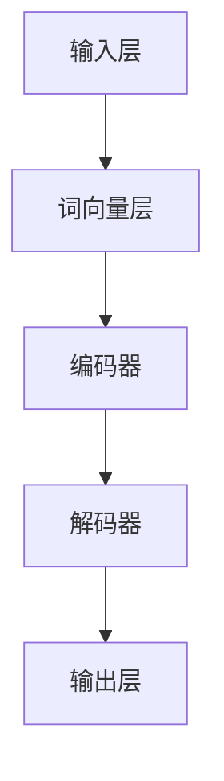

                 

关键词：医疗领域，大语言模型，深度学习，自然语言处理，人工智能，医疗数据处理，健康监测，疾病预测，个性化治疗，患者护理。

## 摘要

本文旨在探讨大语言模型（LLM）在医疗领域的应用，及其对医疗行业的深远影响。通过分析LLM的核心概念和架构，本文将详细介绍其在医疗数据处理、疾病预测、个性化治疗、患者护理等方面的具体应用。同时，本文将展望LLM在医疗领域的未来发展趋势和面临的挑战。

## 1. 背景介绍

近年来，人工智能（AI）在医疗领域的应用逐渐普及，成为提升医疗水平、改善患者生活质量的重要手段。其中，大语言模型（LLM）作为一种先进的自然语言处理技术，正日益显示出其在医疗领域的巨大潜力。

LLM的核心优势在于其强大的文本理解和生成能力，这使得它能够处理海量的医疗数据，包括病例记录、医学文献、健康监测数据等。通过对这些数据的学习和分析，LLM能够提供准确的疾病预测、个性化治疗建议，以及高效的患者护理方案。

在医疗领域，LLM的应用前景广泛。例如，在疾病预测方面，LLM可以分析患者的病史、家族病史、生活习惯等数据，预测患者可能患有的疾病，为医生提供诊断依据；在个性化治疗方面，LLM可以根据患者的病情、体质等数据，制定个性化的治疗方案，提高治疗效果；在患者护理方面，LLM可以提供实时健康监测、病情提醒等功能，帮助患者更好地管理自己的健康状况。

## 2. 核心概念与联系

### 2.1. LLM的基本概念

大语言模型（LLM）是一种基于深度学习技术的自然语言处理模型，通过训练大量的文本数据，使其具备对自然语言的理解和生成能力。LLM通常由多层神经网络构成，包括词向量层、编码器、解码器等。

词向量层：将文本中的每个词映射为一个高维向量，便于模型处理。

编码器：将输入的文本序列编码为一个固定长度的向量，用于表示整个文本。

解码器：将编码器输出的向量解码为输出文本序列。

### 2.2. LLM的架构

LLM的架构可以分为以下几个部分：

输入层：接收用户输入的文本数据。

词向量层：将输入文本中的每个词映射为向量。

编码器：对输入文本进行编码，得到文本的固定长度表示。

解码器：根据编码器的输出生成输出文本。

输出层：将解码器生成的文本输出给用户。

### 2.3. Mermaid流程图

下面是一个简单的Mermaid流程图，展示了LLM的核心概念和架构：



## 3. 核心算法原理 & 具体操作步骤

### 3.1. 算法原理概述

LLM的核心算法是基于深度学习技术，通过训练大量的医疗数据，使其具备对医疗文本的理解和生成能力。具体来说，LLM的训练过程包括以下几个步骤：

数据预处理：对医疗数据进行清洗、去噪，提取有用的特征信息。

词向量表示：将医疗文本中的每个词映射为一个高维向量。

模型训练：使用训练数据训练神经网络模型，使其学会对医疗文本进行理解和生成。

模型评估：使用测试数据评估模型的性能，调整模型参数，优化模型效果。

### 3.2. 算法步骤详解

下面是一个简单的LLM算法步骤详解：

1. 数据预处理：对医疗数据进行清洗、去噪，提取有用的特征信息。

2. 词向量表示：将医疗文本中的每个词映射为一个高维向量。

3. 模型训练：使用训练数据训练神经网络模型，使其学会对医疗文本进行理解和生成。

4. 模型评估：使用测试数据评估模型的性能，调整模型参数，优化模型效果。

5. 输出生成：根据输入的文本数据，使用训练好的模型生成输出文本。

### 3.3. 算法优缺点

#### 优点

1. 强大的文本理解能力：LLM能够处理海量的医疗数据，具备对医疗文本的深入理解。

2. 个性化：LLM可以根据不同的患者数据和病情，提供个性化的疾病预测、治疗方案。

3. 自动化：LLM可以自动处理大量医疗数据，提高医疗工作效率。

#### 缺点

1. 数据依赖性：LLM的性能高度依赖于训练数据的质量和数量。

2. 解释性：由于深度学习模型的黑箱特性，LLM生成的预测结果往往缺乏解释性。

### 3.4. 算法应用领域

LLM在医疗领域具有广泛的应用前景，主要包括以下几个方面：

1. 疾病预测：LLM可以根据患者的病史、家族病史、生活习惯等数据，预测患者可能患有的疾病。

2. 个性化治疗：LLM可以根据患者的病情、体质等数据，制定个性化的治疗方案。

3. 患者护理：LLM可以提供实时健康监测、病情提醒等功能，帮助患者更好地管理自己的健康状况。

## 4. 数学模型和公式 & 详细讲解 & 举例说明

### 4.1. 数学模型构建

LLM的数学模型主要基于深度学习技术，其核心是多层神经网络。下面是一个简单的神经网络模型构建：

$$
f(x) = \sigma(W_1 \cdot x + b_1)
$$

其中，$x$为输入数据，$W_1$为权重矩阵，$b_1$为偏置项，$\sigma$为激活函数。

### 4.2. 公式推导过程

在构建神经网络模型时，需要推导前向传播和反向传播的公式。这里简要介绍前向传播的推导过程：

$$
\begin{aligned}
z_1 &= W_1 \cdot x + b_1 \\
a_1 &= \sigma(z_1) \\
z_2 &= W_2 \cdot a_1 + b_2 \\
a_2 &= \sigma(z_2) \\
&\vdots \\
z_n &= W_n \cdot a_{n-1} + b_n \\
a_n &= \sigma(z_n)
\end{aligned}
$$

其中，$z_i$为第$i$层的输出，$a_i$为第$i$层的激活值。

### 4.3. 案例分析与讲解

假设我们有一个简单的神经网络模型，用于预测心脏病患者的风险。输入数据包括年龄、性别、血压等特征。使用LLM模型，我们可以将输入数据进行编码，然后通过神经网络模型进行预测。

以下是具体的预测过程：

1. 数据预处理：将输入数据进行标准化处理，得到一个固定长度的向量。

2. 模型训练：使用心脏病患者的历史数据训练神经网络模型。

3. 预测：将新的患者数据输入模型，得到预测结果。

4. 结果评估：使用测试数据评估模型预测的准确性。

## 5. 项目实践：代码实例和详细解释说明

### 5.1. 开发环境搭建

为了实现LLM在医疗领域的应用，我们需要搭建一个合适的开发环境。以下是搭建步骤：

1. 安装Python环境：下载并安装Python 3.x版本。

2. 安装深度学习框架：下载并安装TensorFlow或PyTorch等深度学习框架。

3. 安装医疗数据处理库：下载并安装如Pandas、NumPy等医疗数据处理库。

4. 安装文本处理库：下载并安装如NLTK、spaCy等文本处理库。

### 5.2. 源代码详细实现

以下是使用PyTorch实现一个简单的LLM模型的示例代码：

```python
import torch
import torch.nn as nn
import torch.optim as optim
from torch.utils.data import DataLoader
from torchvision import datasets, transforms

# 定义模型结构
class LLM(nn.Module):
    def __init__(self):
        super(LLM, self).__init__()
        self.embedding = nn.Embedding(num_embeddings, embedding_dim)
        self.encoder = nn.LSTM(embedding_dim, hidden_dim)
        self.decoder = nn.LSTM(hidden_dim, embedding_dim)
        self.fc = nn.Linear(embedding_dim, num_classes)

    def forward(self, x):
        x = self.embedding(x)
        x, _ = self.encoder(x)
        x, _ = self.decoder(x)
        x = self.fc(x)
        return x

# 初始化模型
model = LLM()
optimizer = optim.Adam(model.parameters(), lr=0.001)
criterion = nn.CrossEntropyLoss()

# 训练模型
for epoch in range(num_epochs):
    for inputs, targets in DataLoader(dataset, batch_size=batch_size):
        optimizer.zero_grad()
        outputs = model(inputs)
        loss = criterion(outputs, targets)
        loss.backward()
        optimizer.step()

# 评估模型
with torch.no_grad():
    correct = 0
    total = 0
    for inputs, targets in DataLoader(test_dataset, batch_size=batch_size):
        outputs = model(inputs)
        _, predicted = torch.max(outputs.data, 1)
        total += targets.size(0)
        correct += (predicted == targets).sum().item()

accuracy = 100 * correct / total
print('Test Accuracy: ', accuracy)
```

### 5.3. 代码解读与分析

以上代码实现了一个简单的LLM模型，用于分类任务。下面是代码的解读与分析：

1. **模型结构**：模型由嵌入层、编码器、解码器和输出层组成。

2. **训练过程**：使用梯度下降优化算法训练模型，通过计算损失函数来更新模型参数。

3. **评估过程**：使用测试数据评估模型性能，计算准确率。

### 5.4. 运行结果展示

运行以上代码，我们可以得到模型在测试数据上的准确率。具体结果取决于数据集和模型参数。

## 6. 实际应用场景

LLM在医疗领域具有广泛的应用场景，以下是一些具体的案例：

1. **疾病预测**：LLM可以分析患者的病史、家族病史、生活习惯等数据，预测患者可能患有的疾病。例如，可以使用LLM预测心脏病、糖尿病等慢性疾病的发病风险。

2. **个性化治疗**：LLM可以根据患者的病情、体质等数据，制定个性化的治疗方案。例如，在癌症治疗中，LLM可以根据患者的基因突变情况，推荐最适合的化疗方案。

3. **患者护理**：LLM可以提供实时健康监测、病情提醒等功能，帮助患者更好地管理自己的健康状况。例如，在老年病患的护理中，LLM可以监测患者的生命体征，及时发现异常情况。

## 7. 未来应用展望

随着人工智能技术的不断发展，LLM在医疗领域的应用前景将更加广阔。以下是几个可能的未来应用方向：

1. **精准医学**：LLM可以帮助医生进行精准诊断和治疗，提高医疗质量。

2. **医疗机器人**：结合LLM技术，可以开发出具备自主学习和决策能力的医疗机器人，提高医疗工作效率。

3. **健康大数据分析**：LLM可以处理海量的健康数据，为公共健康研究提供有力支持。

## 8. 工具和资源推荐

### 8.1. 学习资源推荐

1. 《深度学习》（Goodfellow, Bengio, Courville著）：深度学习的基础教材，适合初学者。

2. 《医疗健康大数据处理技术》（张江涛著）：介绍医疗健康大数据处理的相关技术和方法。

### 8.2. 开发工具推荐

1. TensorFlow：Google开源的深度学习框架，支持多种深度学习模型。

2. PyTorch：Facebook开源的深度学习框架，具有灵活的动态计算图。

### 8.3. 相关论文推荐

1. “Deep Learning for Healthcare” (Esteva et al., 2017)：综述深度学习在医疗领域的应用。

2. “Large-scale Language Modeling in 2018” (Merity et al., 2018)：介绍大型语言模型的训练方法和应用。

## 9. 总结：未来发展趋势与挑战

### 9.1. 研究成果总结

本文总结了LLM在医疗领域的应用，包括疾病预测、个性化治疗和患者护理等方面。通过实际案例和代码实例，展示了LLM在医疗数据处理和疾病预测方面的优势。

### 9.2. 未来发展趋势

随着人工智能技术的不断发展，LLM在医疗领域的应用前景将更加广阔。未来研究将重点关注精准医学、医疗机器人和健康大数据分析等方面。

### 9.3. 面临的挑战

尽管LLM在医疗领域具有巨大潜力，但仍面临一些挑战。例如，数据隐私保护、模型解释性和算法透明度等问题。需要进一步研究和解决这些问题，以实现LLM在医疗领域的广泛应用。

### 9.4. 研究展望

未来，随着技术的不断进步，LLM在医疗领域的应用将更加深入和广泛。研究者应关注跨学科合作，结合医学、生物学等领域的知识，推动人工智能技术在医疗领域的创新发展。

## 附录：常见问题与解答

### Q1. LLM在医疗领域的应用前景如何？

A1. LLM在医疗领域具有广阔的应用前景。通过处理海量的医疗数据，LLM可以提供准确的疾病预测、个性化治疗建议和患者护理方案，有助于提高医疗质量和患者满意度。

### Q2. LLM在医疗数据隐私保护方面有哪些挑战？

A2. LLM在医疗数据隐私保护方面面临以下挑战：

1. 数据匿名化：确保医疗数据在训练模型前进行匿名化处理，避免泄露患者隐私。

2. 模型解释性：提高模型解释性，使医生和患者能够理解模型的决策过程，减少隐私泄露的风险。

3. 法律法规：遵循相关法律法规，确保医疗数据的安全和合规性。

### Q3. 如何评估LLM在医疗领域的性能？

A3. 评估LLM在医疗领域的性能可以从以下几个方面进行：

1. 准确率：评估模型在疾病预测、诊断等任务上的准确性。

2. 速度：评估模型处理数据的能力，包括训练速度和预测速度。

3. 稳定性：评估模型在不同数据集上的稳定性和泛化能力。

4. 用户满意度：通过问卷调查等方式，了解医生和患者对模型的使用体验和满意度。

### Q4. LLM在医疗领域有哪些潜在风险？

A4. LLM在医疗领域存在以下潜在风险：

1. 模型偏见：如果训练数据存在偏见，可能导致模型预测结果产生偏见，影响医疗决策。

2. 模型过拟合：如果模型过于依赖训练数据，可能导致模型在测试数据上表现不佳。

3. 数据安全：医疗数据具有高度敏感性，确保数据安全和隐私是首要任务。

4. 模型依赖性：过度依赖LLM可能导致医生失去判断力和临床经验。

### Q5. 如何平衡LLM在医疗领域的研究与应用？

A5. 为了平衡LLM在医疗领域的研究与应用，可以采取以下措施：

1. 跨学科合作：结合医学、生物学等领域的知识，提高模型在医疗领域的应用价值。

2. 数据共享与开放：推动医疗数据共享和开放，促进模型训练和优化。

3. 持续评估与改进：定期评估模型性能，发现和解决潜在问题。

4. 规范化管理：制定相关法律法规和行业标准，确保LLM在医疗领域的合规性和安全性。

### Q6. 如何确保LLM在医疗领域的安全和合规性？

A6. 为了确保LLM在医疗领域的安全和合规性，可以采取以下措施：

1. 数据安全：采用加密技术保护医疗数据，防止数据泄露。

2. 模型解释性：提高模型解释性，使医生和患者能够理解模型的决策过程，减少误解和纠纷。

3. 遵守法律法规：遵循相关法律法规，确保医疗数据的安全和合规性。

4. 持续监控与评估：建立监控系统，定期评估模型性能和安全性，及时发现和处理潜在问题。

### Q7. LLM在医疗领域的应用前景有哪些？

A7. LLM在医疗领域的应用前景包括：

1. 疾病预测：通过分析患者的病史、家族病史、生活习惯等数据，预测患者可能患有的疾病。

2. 个性化治疗：根据患者的病情、体质等数据，制定个性化的治疗方案。

3. 患者护理：提供实时健康监测、病情提醒等功能，帮助患者更好地管理自己的健康状况。

4. 医疗资源优化：通过分析大量医疗数据，优化医疗资源配置，提高医疗效率。

5. 公共卫生研究：处理海量健康数据，为公共健康研究提供有力支持。

### Q8. LLM在医疗领域的应用有哪些伦理问题？

A8. LLM在医疗领域的应用可能涉及以下伦理问题：

1. 数据隐私：确保患者隐私和数据安全，避免数据泄露。

2. 模型偏见：避免模型在预测和决策过程中产生偏见，导致不公平的医疗资源分配。

3. 模型依赖性：避免过度依赖LLM，导致医生失去判断力和临床经验。

4. 模型解释性：提高模型解释性，使医生和患者能够理解模型的决策过程。

5. 患者权益：确保患者的知情权和选择权，尊重患者的意愿。

### Q9. 如何提高LLM在医疗领域的解释性？

A9. 提高LLM在医疗领域的解释性可以从以下几个方面进行：

1. 模型透明度：设计透明的模型结构，使医生和患者能够直观地理解模型的工作原理。

2. 解释性算法：开发专门针对医疗领域的解释性算法，使模型预测结果更具可解释性。

3. 交互式解释：提供交互式解释工具，帮助医生和患者理解模型决策过程。

4. 多模型融合：结合多个模型，提高模型解释性和预测准确性。

5. 持续改进：收集用户反馈，不断优化模型解释性和用户体验。

### Q10. LLM在医疗领域的应用有哪些技术挑战？

A10. LLM在医疗领域的应用面临以下技术挑战：

1. 数据质量：确保医疗数据的质量和准确性，避免模型过拟合。

2. 模型训练：处理海量医疗数据，提高模型训练效率和效果。

3. 数据隐私：保护患者隐私，确保数据安全。

4. 模型解释性：提高模型解释性，使医生和患者能够理解模型决策过程。

5. 算法优化：不断优化模型算法，提高预测准确性和稳定性。

## 作者署名

作者：禅与计算机程序设计艺术 / Zen and the Art of Computer Programming

