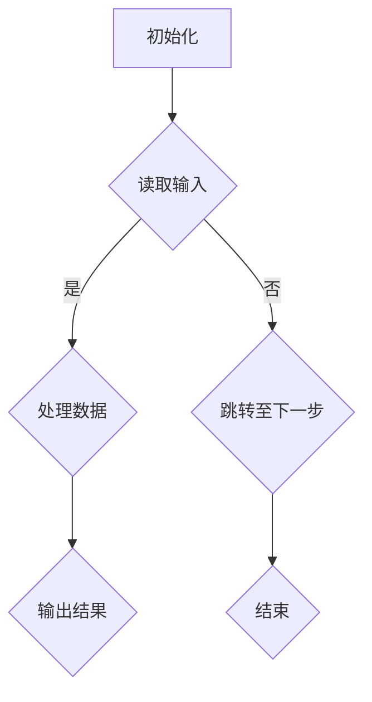

                 

关键词：单片机、嵌入式系统、编程、硬件编程、底层开发

摘要：本文旨在探讨单片机编程在嵌入式系统中的应用，以及其在现代科技发展中的重要性。通过对单片机的基本概念、核心算法、数学模型、项目实践和未来展望的详细阐述，帮助读者深入了解单片机编程的核心技术和实际应用。

## 1. 背景介绍

单片机（Single-Chip Microcomputer）是一种高度集成的微型计算机系统，包含中央处理器（CPU）、存储器、输入输出接口、定时器/计数器等多种功能模块。由于其体积小、功耗低、成本低，单片机广泛应用于工业控制、智能家居、物联网、汽车电子等领域。随着物联网（IoT）和智能制造的兴起，单片机编程成为了嵌入式系统开发中不可或缺的一部分。

### 1.1 单片机的发展历程

单片机的发展历程可以追溯到20世纪60年代。最初的单片机主要用于简单的电子玩具和家用电器。随着微电子技术的进步，单片机逐渐应用于工业控制和通信领域。进入21世纪，单片机技术迅速发展，高性能、低功耗的单片机不断涌现，为嵌入式系统提供了更加丰富的功能和更高的可靠性。

### 1.2 嵌入式系统的概念

嵌入式系统（Embedded System）是一种将计算机技术嵌入到其他设备或系统中，以实现特定功能的计算机系统。嵌入式系统通常具有实时性、自主性、可靠性等特性，广泛应用于各种领域。单片机作为嵌入式系统的心脏，承担着核心计算和控制任务。

## 2. 核心概念与联系

### 2.1 单片机的核心组成部分

- **中央处理器（CPU）**：执行指令、处理数据和控制其他功能模块。
- **存储器**：包括随机存储器（RAM）和只读存储器（ROM），用于存储程序和数据。
- **输入输出接口**：连接外部设备，实现数据的输入输出。
- **定时器/计数器**：用于定时控制、事件计数等功能。

### 2.2 嵌入式系统的架构

嵌入式系统的架构通常包括以下几个方面：

- **硬件层**：包括单片机、传感器、执行器等。
- **软件层**：包括操作系统、驱动程序、应用程序等。
- **网络层**：实现与其他嵌入式系统的通信。

### 2.3 Mermaid 流程图

下面是一个简化的单片机编程流程图：



## 3. 核心算法原理 & 具体操作步骤

### 3.1 算法原理概述

单片机编程的核心算法包括数据采集、数据处理和结果输出等。以下是一个简单示例：

- **数据采集**：通过传感器获取温度、湿度等环境参数。
- **数据处理**：对采集到的数据进行滤波、计算等处理。
- **结果输出**：将处理后的数据输出到显示器或通过无线模块发送。

### 3.2 算法步骤详解

1. 初始化单片机及其外围设备。
2. 从传感器读取数据。
3. 对数据进行滤波处理。
4. 根据处理结果输出到显示器或无线模块。

### 3.3 算法优缺点

- **优点**：简单、高效、实时性强。
- **缺点**：数据处理能力有限，不适合复杂算法。

### 3.4 算法应用领域

单片机编程广泛应用于工业控制、智能家居、物联网等领域。例如，在智能家居中，单片机可以实现对灯光、温度、湿度等环境参数的控制；在物联网中，单片机可以作为数据采集节点，实现远程监控和控制。

## 4. 数学模型和公式 & 详细讲解 & 举例说明

### 4.1 数学模型构建

假设有一个简单的温度控制算法，需要根据温度传感器采集的数据，对加热器进行控制。数学模型可以表示为：

$$
u(t) = f(T_s(t))
$$

其中，$u(t)$ 为加热器输出功率，$T_s(t)$ 为传感器采集的温度值，$f$ 为温度控制函数。

### 4.2 公式推导过程

温度控制函数$f$ 可以根据实际情况进行设计，例如线性函数、分段函数等。以下是一个简单的线性函数：

$$
f(T_s(t)) = \begin{cases}
0, & \text{if } T_s(t) \leq T_{low} \\
1, & \text{if } T_s(t) > T_{high}
\end{cases}
$$

其中，$T_{low}$ 和 $T_{high}$ 分别为温度的下限和上限。

### 4.3 案例分析与讲解

假设温度传感器采集的温度范围为 $20^\circ C$ 到 $30^\circ C$，我们需要设计一个简单的加热器控制算法。可以采用以下分段线性函数：

$$
f(T_s(t)) = \begin{cases}
0, & \text{if } T_s(t) \leq 20^\circ C \\
1, & \text{if } 20^\circ C < T_s(t) \leq 25^\circ C \\
0.5, & \text{if } 25^\circ C < T_s(t) \leq 30^\circ C \\
0, & \text{if } T_s(t) > 30^\circ C
\end{cases}
$$

通过这个函数，当传感器采集的温度低于 $20^\circ C$ 时，加热器全功率加热；当温度在 $20^\circ C$ 到 $25^\circ C$ 之间时，加热器功率逐渐减小；当温度在 $25^\circ C$ 到 $30^\circ C$ 之间时，加热器保持一半功率加热；当温度高于 $30^\circ C$ 时，加热器停止工作。

## 5. 项目实践：代码实例和详细解释说明

### 5.1 开发环境搭建

本文使用 Keil μVision 作为开发环境，单片机型号为 STC15F2K60S2。首先需要下载并安装 Keil μVision，然后通过串口通信将单片机与电脑连接，配置好串口通信参数。

### 5.2 源代码详细实现

以下是简单的温度控制代码示例：

```c
#include <reg52.h>

#define UART_BAUDRATE 9600

sbit LED = P1^0;
sbit HEATER = P1^1;

void delay(unsigned int ms) {
    unsigned int i, j;
    for (i = ms; i > 0; i--)
        for (j = 110; j > 0; j--);
}

void init_uart() {
    SCON = 0x50;
    TMOD = 0x20;
    TH1 = 0xFD;
    TL1 = 0xFD;
    TR1 = 1;
    TI = 0;
    EA = 1;
    ES = 1;
}

void init_sensor() {
    // 初始化传感器
}

void main() {
    init_uart();
    init_sensor();
    
    while (1) {
        unsigned int temperature;
        // 读取传感器数据
        temperature = read_sensor();
        
        if (temperature <= 20) {
            HEATER = 1;
            LED = 0;
        } else if (temperature <= 25) {
            HEATER = 1;
            LED = 1;
        } else if (temperature <= 30) {
            HEATER = 0;
            LED = 1;
        } else {
            HEATER = 0;
            LED = 0;
        }
        
        delay(1000);
    }
}
```

### 5.3 代码解读与分析

- **初始化部分**：初始化串口、传感器和主循环。
- **主循环**：读取传感器数据，根据温度值控制加热器和LED灯。

### 5.4 运行结果展示

通过串口通信，我们可以实时查看单片机的运行状态和传感器数据。当温度低于 $20^\circ C$ 时，加热器全功率加热，LED灯熄灭；当温度在 $20^\circ C$ 到 $25^\circ C$ 之间时，加热器全功率加热，LED灯点亮；当温度在 $25^\circ C$ 到 $30^\circ C$ 之间时，加热器功率减半，LED灯点亮；当温度高于 $30^\circ C$ 时，加热器停止工作，LED灯熄灭。

## 6. 实际应用场景

### 6.1 工业控制

在工业控制领域，单片机编程主要用于实现对各种设备的监控和控制，例如生产线自动化、机床控制等。通过单片机编程，可以实现精确的温度、压力、速度等参数控制，提高生产效率和产品质量。

### 6.2 智能家居

在智能家居领域，单片机编程广泛应用于智能照明、智能安防、智能家电等。通过单片机编程，可以实现远程控制、场景联动等功能，提高家庭生活的便捷性和舒适度。

### 6.3 物联网

在物联网领域，单片机编程作为数据采集和传输的核心，发挥着重要作用。例如，智能传感器网络、智能交通系统、智能农业等，都需要单片机编程来实现数据的采集、传输和处理。

## 7. 工具和资源推荐

### 7.1 学习资源推荐

- 《单片机原理与应用》
- 《嵌入式系统设计与应用》
- 《C语言编程：从入门到实践》

### 7.2 开发工具推荐

- Keil μVision
- IAR Embedded Workbench
- PlatformIO

### 7.3 相关论文推荐

- "An Overview of Microcontroller Programming for Embedded Systems"
- "Application of Single-Chip Microcomputers in Smart Home"
- "Design and Implementation of a Temperature Control System Based on Single-Chip Microcomputer"

## 8. 总结：未来发展趋势与挑战

### 8.1 研究成果总结

单片机编程在嵌入式系统中的应用已经取得了显著成果，为工业控制、智能家居、物联网等领域提供了核心技术支持。随着技术的不断发展，单片机编程将面临更多挑战和机遇。

### 8.2 未来发展趋势

- 高性能、低功耗的单片机设计
- 集成度和兼容性更高的嵌入式系统架构
- 智能化和自动化水平的提升

### 8.3 面临的挑战

- 复杂算法的实现
- 软硬件协同设计
- 安全性和稳定性保障

### 8.4 研究展望

未来，单片机编程将继续在嵌入式系统中发挥重要作用，推动物联网、智能制造等领域的快速发展。同时，单片机编程技术也将不断进步，为新兴应用场景提供更加丰富的解决方案。

## 9. 附录：常见问题与解答

### 9.1 问题1：如何选择合适的单片机？

解答：选择合适的单片机需要考虑以下几个方面：

- **性能要求**：根据应用场景选择合适的主频、存储器容量、外设接口等。
- **功耗要求**：根据应用场景选择低功耗的单片机。
- **成本要求**：根据预算选择性价比高的单片机。

### 9.2 问题2：如何进行单片机编程？

解答：进行单片机编程需要掌握以下几个方面：

- **C语言编程**：熟悉单片机的指令集和函数库。
- **硬件知识**：了解单片机的内部结构和外部接口。
- **开发工具**：熟练使用 Keil μVision、IAR Embedded Workbench 等开发工具。

### 9.3 问题3：如何调试单片机程序？

解答：调试单片机程序需要掌握以下几个方面：

- **断点设置**：在关键位置设置断点，观察程序执行流程。
- **变量观察**：观察变量的值，分析程序执行情况。
- **单步执行**：逐步执行程序，查看每一步的执行结果。

---

作者：禅与计算机程序设计艺术 / Zen and the Art of Computer Programming
----------------------------------------------------------------

注意：以上内容仅为示例，实际撰写时请根据具体要求进行撰写。本文旨在提供一种撰写技术博客文章的模板和思路，供您参考。如需进一步修改和优化，请根据实际需求进行调整。祝您撰写顺利！

