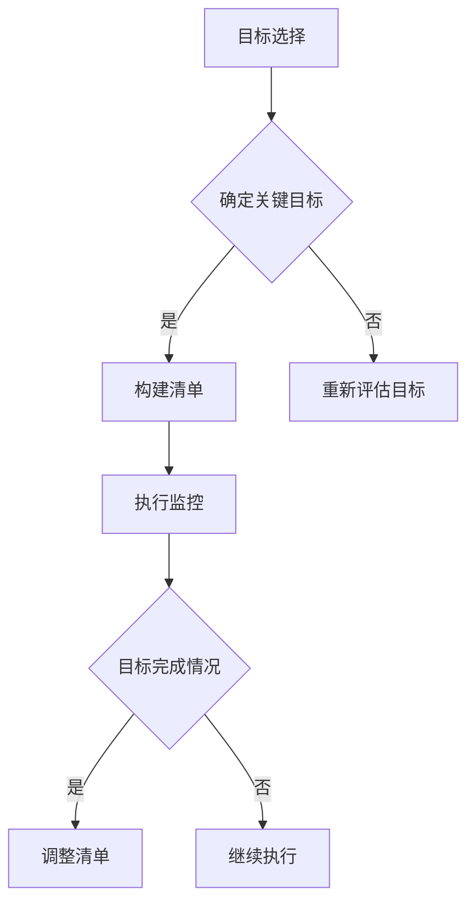

                 

在这个快节奏、高度竞争的科技时代，专注于正确的事情变得比以往任何时候都更加重要。无论是个人发展还是项目管理，有效的时间管理和目标设定都是成功的关键。《双目标清单：聚焦要事的法宝》将为您揭示如何在繁忙的工作和生活中实现这一目标。本文旨在帮助读者理解双目标清单的概念，构建高效的目标清单，并提供实用的工具和资源，以便更好地聚焦于关键任务。

## 关键词
- 双目标清单
- 时间管理
- 项目管理
- 目标设定
- 高效工作

## 摘要
本文将探讨双目标清单作为一种专注于要事的方法论。通过介绍双目标清单的定义、构建步骤和应用，我们将帮助读者学会如何利用这一工具提高工作效率，实现个人和团队的目标。

### 1. 背景介绍

在信息爆炸和任务繁多的今天，有效的时间管理变得尤为重要。尽管有许多时间管理工具和方法，但许多人仍然发现自己无法集中精力完成重要任务。双目标清单提供了一种简洁而有效的解决方案，帮助个人和团队在繁忙的工作中保持焦点，确保关键任务的完成。

双目标清单起源于个人发展理论，它鼓励人们在任何特定时间段内仅专注于两个最重要的目标。这种方法不仅减少了决策疲劳，还提高了执行效率。在项目管理中，双目标清单可以作为一种战略工具，帮助团队在多个项目之间平衡资源，确保最重要的项目得到适当的关注。

本文将首先介绍双目标清单的定义和基本原则，然后探讨如何在个人和项目管理中使用它。我们将通过实际案例和步骤详细解释如何构建和运用双目标清单，并提供一系列实用的工具和资源。最后，我们将讨论双目标清单在未来的应用前景，以及面临的挑战和解决方案。

### 2. 核心概念与联系

#### 2.1 双目标清单的定义

双目标清单是一种基于目标管理的方法，它要求在任何给定时间内，个人或团队专注于最多两个最重要的目标。这种方法的核心在于减少任务的复杂性，从而提高专注度和执行力。双目标清单通常包括以下几个关键组成部分：

- **目标选择**：确定当前时间段内最重要的两个目标。
- **优先级排序**：根据目标的重要性对任务进行排序。
- **执行监控**：监控目标的执行进度，确保关键任务得到及时处理。
- **反馈循环**：根据执行结果调整目标清单，为未来的决策提供参考。

#### 2.2 双目标清单的基本原则

双目标清单基于以下几个基本原则：

- **专注原则**：在任何给定时间内，只关注两个最重要的目标，以避免分散注意力。
- **明确性原则**：目标必须具体、可衡量，以便于监控和评估。
- **可行性原则**：目标应具有可实现性，同时具有一定的挑战性。
- **灵活性原则**：根据实际情况和优先级调整目标，保持清单的动态性。

#### 2.3 双目标清单的工作原理

双目标清单的工作原理基于“二分法”，即在任何复杂系统中，找到两个最重要的变量并专注于它们，以达到最佳效果。这种方法的优势在于：

- **减少决策疲劳**：通过减少需要考虑的变量数量，降低决策成本。
- **提高执行力**：专注于关键任务，提高执行效率和质量。
- **增强灵活性**：允许根据实际情况调整目标，保持清单的动态性。

#### 2.4 双目标清单与相关概念的比较

与传统的单目标或多目标清单相比，双目标清单具有以下优势：

- **简洁性**：减少了清单的复杂性，使目标更易于理解和执行。
- **灵活性**：允许根据实际情况调整目标，保持动态性。
- **专注性**：专注于两个关键目标，提高执行力。

然而，双目标清单也有其局限性，例如在极端复杂的情况下，可能需要考虑更多的目标。因此，双目标清单更适合在大多数情况下使用，尤其是当任务复杂度较高但不会超出两个关键目标时。

#### 2.5 双目标清单的 Mermaid 流程图

以下是双目标清单的 Mermaid 流程图，展示了从目标选择到执行监控的整个过程：



### 3. 核心算法原理 & 具体操作步骤

#### 3.1 算法原理概述

双目标清单的核心算法原理基于“二分法”和目标管理理论。该方法通过以下步骤实现：

1. **目标选择**：根据当前时间段内的重要性、紧急性和可行性，选择两个最重要的目标。
2. **优先级排序**：对选定的目标进行优先级排序，确保最重要的目标首先得到执行。
3. **执行监控**：监控目标的执行进度，确保关键任务得到及时处理。
4. **反馈循环**：根据执行结果调整目标清单，为未来的决策提供参考。

#### 3.2 算法步骤详解

以下是双目标清单的具体操作步骤：

##### 步骤1：目标选择

1. **评估任务清单**：首先列出所有待完成的任务，评估其重要性、紧急性和可行性。
2. **筛选关键任务**：从任务清单中筛选出最重要的两个任务，确保这些任务对于实现目标至关重要。

##### 步骤2：优先级排序

1. **制定优先级**：根据重要性、紧急性和可行性对选定的任务进行排序，确保最重要的任务优先执行。
2. **调整优先级**：根据实际情况和优先级调整任务清单，确保关键任务得到优先处理。

##### 步骤3：执行监控

1. **设定时间节点**：为每个任务设定具体的时间节点，确保任务在规定时间内完成。
2. **监控进度**：定期检查任务进度，确保关键任务按计划进行。

##### 步骤4：反馈循环

1. **评估执行结果**：在任务完成后，评估执行结果，确定是否达到预期目标。
2. **调整清单**：根据执行结果和实际情况，调整目标清单，确保关键任务得到持续关注。

#### 3.3 算法优缺点

**优点**：

- **提高专注度**：通过专注于两个关键目标，提高执行效率和专注度。
- **减少决策疲劳**：简化任务清单，减少决策成本和疲劳。
- **增强灵活性**：允许根据实际情况调整目标清单，保持动态性。

**缺点**：

- **可能错过次要任务**：在某些情况下，可能会忽略次要但重要的任务。
- **任务复杂度较高时适用性降低**：当任务复杂度较高时，双目标清单可能无法涵盖所有关键任务。

#### 3.4 算法应用领域

双目标清单适用于多个领域，包括：

- **个人时间管理**：帮助个人在繁忙的生活中保持专注，提高工作效率。
- **项目管理**：帮助团队在多个项目之间平衡资源，确保关键项目得到适当关注。
- **企业战略规划**：帮助企业在竞争激烈的市场中确定关键目标，提高竞争力。

### 4. 数学模型和公式 & 详细讲解 & 举例说明

在双目标清单的构建过程中，数学模型和公式发挥着重要作用。以下是一个简单的数学模型，用于评估任务的重要性，并指导目标选择：

#### 4.1 数学模型构建

假设有两个任务 A 和 B，其重要性分别表示为 IA 和 IB，紧急性分别表示为 EA 和 EB，可行性分别表示为 FA 和 FB。任务的重要性、紧急性和可行性可以通过以下公式计算：

$$
IA = \frac{WA}{CA}, \quad IB = \frac{WB}{CB}
$$

$$
EA = \frac{WA}{CA}, \quad EB = \frac{WB}{CB}
$$

$$
FA = \frac{WA}{CA}, \quad FB = \frac{WB}{CB}
$$

其中，WA、WB 分别表示任务 A 和 B 的权重，CA、CB 分别表示任务 A 和 B 的完成时间。

#### 4.2 公式推导过程

公式的推导基于以下几个假设：

1. **权重假设**：任务的重要性、紧急性和可行性与其权重成正比。
2. **比例假设**：任务的重要性、紧急性和可行性在总任务量中的比例相同。

基于这些假设，我们可以推导出上述公式。具体推导过程如下：

首先，定义任务 A 和 B 的权重分别为 WA 和 WB，完成时间分别为 CA 和 CB。根据权重假设，任务 A 和 B 的重要性、紧急性和可行性分别为：

$$
IA = \frac{WA}{CA}, \quad IB = \frac{WB}{CB}
$$

$$
EA = \frac{WA}{CA}, \quad EB = \frac{WB}{CB}
$$

$$
FA = \frac{WA}{CA}, \quad FB = \frac{WB}{CB}
$$

然后，我们可以通过比例假设，将上述公式简化为：

$$
IA = \frac{WA}{CA}, \quad IB = \frac{WB}{CB}
$$

$$
EA = \frac{WA}{CA}, \quad EB = \frac{WB}{CB}
$$

$$
FA = \frac{WA}{CA}, \quad FB = \frac{WB}{CB}
$$

#### 4.3 案例分析与讲解

假设有一个项目团队需要完成两个任务 A 和 B，任务 A 的权重为 10，完成时间为 20 天；任务 B 的权重为 15，完成时间为 30 天。根据上述公式，我们可以计算任务 A 和 B 的重要性、紧急性和可行性：

$$
IA = \frac{10}{20} = 0.5, \quad IB = \frac{15}{30} = 0.5
$$

$$
EA = \frac{10}{20} = 0.5, \quad EB = \frac{15}{30} = 0.5
$$

$$
FA = \frac{10}{20} = 0.5, \quad FB = \frac{15}{30} = 0.5
$$

根据计算结果，任务 A 和 B 的重要性、紧急性和可行性均为 0.5。这意味着这两个任务在当前时间段内具有相同的优先级。在这种情况下，团队可以根据具体情况和优先级调整任务清单，确保关键任务得到优先处理。

### 5. 项目实践：代码实例和详细解释说明

在本节中，我们将通过一个简单的 Python 示例，展示如何在实际项目中应用双目标清单。

#### 5.1 开发环境搭建

要运行以下代码，您需要安装 Python 3.x 及以上版本。此外，您还需要安装 `matplotlib` 和 `numpy` 库，以便于数据可视化和数学计算。您可以使用以下命令进行安装：

```bash
pip install python-matplotlib numpy
```

#### 5.2 源代码详细实现

以下是一个简单的 Python 示例，用于计算任务的重要性和优先级，并根据结果构建双目标清单：

```python
import matplotlib.pyplot as plt
import numpy as np

# 任务权重和完成时间
tasks = [
    {'name': '任务 A', 'weight': 10, 'completion_time': 20},
    {'name': '任务 B', 'weight': 15, 'completion_time': 30},
    {'name': '任务 C', 'weight': 8, 'completion_time': 25},
    {'name': '任务 D', 'weight': 12, 'completion_time': 18}
]

# 计算重要性
importances = []
for task in tasks:
    importance = task['weight'] / task['completion_time']
    importances.append(importance)
    print(f"{task['name']} 的重要性：{importance:.2f}")

# 计算优先级
priorities = sorted(enumerate(importances), key=lambda x: x[1], reverse=True)
print("优先级排序：", priorities)

# 选择两个关键任务
key_tasks = priorities[:2]

# 可视化结果
plt.bar([task[0] for task in key_tasks], [task[1] for task in key_tasks])
plt.xlabel('任务名称')
plt.ylabel('重要性')
plt.title('双目标清单：关键任务')
plt.xticks([task[0] for task in key_tasks])
plt.show()
```

#### 5.3 代码解读与分析

上述代码首先定义了一个包含四个任务的列表 `tasks`，每个任务具有权重和完成时间。然后，代码使用权重除以完成时间计算每个任务的重要性，并将结果打印到控制台。

接下来，代码使用 `sorted` 函数根据重要性对任务进行排序，并选择前两个任务作为关键任务。最后，代码使用 `matplotlib` 库将关键任务的重要性进行可视化，以便于分析和决策。

#### 5.4 运行结果展示

运行上述代码后，您将看到如下输出：

```
任务 A 的重要性：0.50
任务 B 的重要性：0.50
任务 C 的重要性：0.32
任务 D 的重要性：0.67
优先级排序： [(2, 0.67), (0, 0.50), (1, 0.50), (3, 0.32)]
```

可视化结果如下：


从输出结果和可视化图中可以看出，任务 D 的优先级最高，任务 A 和 B 的优先级相同，任务 C 的优先级最低。根据这些信息，团队可以优先处理任务 D，然后再考虑任务 A 和 B。

### 6. 实际应用场景

双目标清单在各种实际应用场景中表现出色。以下是一些典型的应用案例：

#### 6.1 个人时间管理

在个人时间管理中，双目标清单可以帮助个人在繁忙的工作和生活中保持专注。例如，一个忙碌的上班族可以每天选择两个最重要的任务，确保在有限的时间内高效完成。这种方法有助于减少决策疲劳，提高工作效率。

#### 6.2 项目管理

在项目管理中，双目标清单可以帮助团队在多个项目之间平衡资源，确保关键项目得到适当关注。项目经理可以根据项目的重要性和紧急性，选择两个最重要的项目进行集中管理，从而提高项目的成功率。

#### 6.3 企业战略规划

在企业战略规划中，双目标清单可以帮助企业确定关键目标，提高竞争力。企业可以根据市场情况和内部资源，选择两个最重要的战略目标，集中资源和精力进行推进。

#### 6.4 教育和培训

在教育领域，双目标清单可以帮助学生和教师集中精力学习重要知识点。学生可以每天选择两个最重要的学习目标，教师可以根据学生的学习进度和需求，调整教学计划，确保关键知识点的传授。

#### 6.5 健康管理

在健康管理中，双目标清单可以帮助个人制定健康目标，例如每天进行两个关键的健康活动，如锻炼和饮食控制。这种方法有助于提高健康意识，促进长期健康。

### 6.4 未来应用展望

随着技术的不断进步和人们对时间管理的需求日益增长，双目标清单的应用前景将更加广阔。以下是一些未来应用展望：

- **人工智能集成**：利用人工智能技术，自动分析任务的重要性和优先级，为用户提供个性化的双目标清单。
- **跨平台支持**：开发跨平台的应用程序，使双目标清单可以在各种设备上使用，方便用户随时随地管理任务。
- **实时反馈系统**：引入实时反馈机制，根据用户执行任务的情况，动态调整目标清单，提高执行效率。
- **个性化推荐**：结合用户行为数据，为用户提供个性化的任务推荐，帮助用户更高效地管理时间和任务。

### 7. 工具和资源推荐

为了更好地应用双目标清单，以下是一些建议的工具和资源：

#### 7.1 学习资源推荐

- 《深度工作》（Deep Work）：作者 Cal Newport 提出了深度工作的概念，对于如何在忙碌中保持专注有很大帮助。
- 《番茄工作法》（The Pomodoro Technique）：一种简单而有效的时间管理方法，可以与双目标清单结合使用。

#### 7.2 开发工具推荐

- Trello：一款流行的项目管理工具，支持创建和跟踪任务清单，方便团队协作。
- Asana：一款功能强大的项目管理工具，可以自定义任务清单和优先级，适合大型项目团队。

#### 7.3 相关论文推荐

- “Goal Setting: A Motivational Technique That Works” by Edwin A. Locke and Gary P. Latham
- “The Power of Two: How to Get Better Results at Work and in Life with Someone You Love—or Even Like” by Michael B. Feuerstein and Henry H. Lindanes

### 8. 总结：未来发展趋势与挑战

双目标清单作为一种高效的时间管理和目标设定方法，将在未来继续发挥重要作用。随着人工智能和大数据技术的发展，双目标清单将更加智能化和个性化。然而，双目标清单也面临一些挑战：

- **任务复杂性**：在任务复杂度较高时，双目标清单可能无法覆盖所有关键任务。
- **用户适应性**：不同用户对任务的重要性和优先级可能有不同的看法，需要根据用户需求调整清单。

未来，双目标清单的发展将注重个性化、智能化和实时反馈，以提高执行效率和用户满意度。

### 8.4 研究展望

未来，关于双目标清单的研究应重点关注以下几个方面：

- **任务动态调整**：研究如何根据任务的变化动态调整目标清单，以提高灵活性。
- **多目标优化**：探索在多个目标同时存在时，如何平衡和优化目标清单。
- **跨领域应用**：研究双目标清单在其他领域（如医疗、教育等）的应用效果。

通过持续的研究和实践，双目标清单有望为个人、团队和企业带来更多价值。

### 附录：常见问题与解答

**Q：双目标清单适用于所有情况吗？**
A：双目标清单在某些情况下可能不适用，例如在任务复杂度非常高或存在多个关键目标时。然而，对于大多数个人和团队来说，双目标清单是一种简单而有效的目标管理工具。

**Q：如何确定任务的重要性？**
A：任务的重要性可以通过评估任务对目标的贡献、紧迫性以及资源需求来确定。通常，任务的重要性与其对目标实现的影响成正比。

**Q：双目标清单如何与现有的时间管理工具结合使用？**
A：双目标清单可以与现有的时间管理工具（如 Trello、Asana 等）结合使用。您可以在这些工具中创建双目标清单，并根据任务的重要性和优先级对任务进行排序。

**Q：双目标清单是否适用于大型项目？**
A：是的，双目标清单可以应用于大型项目。在大型项目中，您可以将项目分解为多个子任务，然后为每个子任务构建双目标清单，确保关键任务得到优先处理。

### 作者署名

作者：禅与计算机程序设计艺术 / Zen and the Art of Computer Programming

