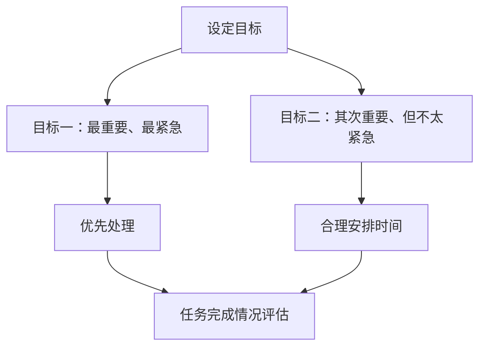

                 

关键词：双目标清单法、工作效率、时间管理、专注力、优先级管理

> 摘要：本文介绍了双目标清单法，一种提高工作效率和时间管理的实用工具。通过明确工作目标、优化任务优先级，帮助IT专业人士集中精力在最重要的工作上，从而实现高效产出和职业成长。

## 1. 背景介绍

在信息化时代，IT专业人士面对的是日益复杂的工作环境和大量琐碎的任务。如何在众多任务中找到关键点，专注于最重要的工作，成为提高工作效率的核心问题。双目标清单法作为一种时间管理和优先级管理工具，旨在帮助专业人士更加高效地安排工作，提升专注力和产出质量。

## 2. 核心概念与联系

### 2.1 双目标清单法的基本概念

双目标清单法，顾名思义，是指在一次工作周期内设定两个主要目标的方法。这两个目标可以是：

- **目标一**：最重要、最紧急的任务；
- **目标二**：其次重要、但不太紧急的任务。

这种方法的核心在于通过明确两个关键目标，将注意力集中在最重要的工作上，避免因多任务处理而分散精力，提高工作效率。

### 2.2 双目标清单法的原理与架构

以下是双目标清单法的Mermaid流程图：



**流程说明**：

1. **设定目标**：在开始一天的工作之前，根据任务的重要性和紧急程度，设定两个主要目标。
2. **目标一处理**：首先处理最重要的任务，确保其完成。
3. **目标二处理**：在目标一完成后，安排时间处理次重要的任务。
4. **任务完成情况评估**：在一天结束时，评估任务完成情况，并根据结果调整后续工作计划。

## 3. 核心算法原理 & 具体操作步骤

### 3.1 算法原理概述

双目标清单法基于优先级管理理论，其核心在于通过设定两个明确的目标，将工作分为优先级不同的两部分。这种方法有助于避免多任务处理导致的效率低下，提高专注力。

### 3.2 算法步骤详解

1. **任务收集**：在一天开始之前，收集所有待办任务，列出清单。
2. **任务分类**：将任务按照重要性和紧急程度分为四类（如：重要且紧急、重要但不紧急、不重要但紧急、不重要且不紧急）。
3. **目标设定**：根据任务清单，设定两个目标：目标一（重要且紧急的任务），目标二（重要但不紧急的任务）。
4. **目标一处理**：集中精力，优先处理目标一的任务，确保其完成。
5. **目标二处理**：在目标一完成后，合理安排时间，处理目标二的任务。
6. **任务调整**：根据任务的完成情况和优先级，对后续任务进行调整。

### 3.3 算法优缺点

**优点**：

- **提高专注力**：通过设定两个明确的目标，减少多任务处理，提高专注力。
- **优化时间管理**：明确任务优先级，合理安排时间，提高工作效率。
- **灵活调整**：可根据任务的完成情况和变化，灵活调整后续任务。

**缺点**：

- **可能造成任务堆积**：如果目标一的任务无法按时完成，可能会导致目标二的任务堆积。
- **需持续自我监督**：要确保在设定目标后，按照计划执行，避免拖延。

### 3.4 算法应用领域

双目标清单法适用于各种工作环境，特别适合以下场景：

- **项目管理**：帮助项目经理明确任务优先级，合理安排资源。
- **软件开发**：帮助开发人员集中精力在最重要的功能实现上。
- **个人时间管理**：帮助个人明确工作重点，提高生活质量。

## 4. 数学模型和公式 & 详细讲解 & 举例说明

### 4.1 数学模型构建

设 \(T_1\) 和 \(T_2\) 分别为目标一和目标二的完成时间，则双目标清单法的数学模型为：

$$
\max T_1, T_2
$$

其中，\(T_1\) 和 \(T_2\) 满足以下约束条件：

$$
T_1 + T_2 \leq T_{\text{总}}
$$

$$
T_1 \leq T_2
$$

### 4.2 公式推导过程

首先，考虑任务集 \(T = \{t_1, t_2, ..., t_n\}\)，其中每个任务 \(t_i\) 有一个完成时间 \(T_i\)。

设目标一为 \(T_1 = \{t_{i_1}, t_{i_2}, ..., t_{i_k}\}\)，目标二为 \(T_2 = \{t_{j_1}, t_{j_2}, ..., t_{j_l}\}\)。

则目标一的完成时间为：

$$
T_1 = \sum_{i=1}^{k} T_i
$$

目标二的完成时间为：

$$
T_2 = \sum_{j=1}^{l} T_j
$$

为了满足约束条件，我们需要找到最优解，使得 \(T_1\) 和 \(T_2\) 满足上述公式。

### 4.3 案例分析与讲解

假设我们有一个任务集 \(T = \{t_1, t_2, t_3, t_4\}\)，其中：

- \(T_1 = \{t_1, t_2\}\)（重要且紧急的任务）
- \(T_2 = \{t_3, t_4\}\)（重要但不紧急的任务）

每个任务的完成时间如下：

| 任务 \(t_i\) | 完成时间 \(T_i\) |
| --- | --- |
| \(t_1\) | 2小时 |
| \(t_2\) | 3小时 |
| \(t_3\) | 1小时 |
| \(t_4\) | 2小时 |

我们希望找到最优的 \(T_1\) 和 \(T_2\)，使得总完成时间最短。

根据公式：

$$
\max T_1, T_2
$$

$$
T_1 + T_2 \leq T_{\text{总}}
$$

$$
T_1 \leq T_2
$$

我们可以计算：

- \(T_1 = 2 + 3 = 5\)小时
- \(T_2 = 1 + 2 = 3\)小时

显然，\(T_1\) 大于 \(T_2\)，所以我们需要重新分配任务。

最优分配方案为：

- \(T_1 = \{t_1, t_2\}\)，总完成时间为5小时
- \(T_2 = \{t_3, t_4\}\)，总完成时间为3小时

这样，我们的总完成时间为8小时，是最优解。

## 5. 项目实践：代码实例和详细解释说明

### 5.1 开发环境搭建

在本文中，我们将使用Python来实现双目标清单法的算法。首先，确保您已经安装了Python环境和必要的库。

### 5.2 源代码详细实现

以下是实现双目标清单法的Python代码：

```python
def double_goal_list(tasks, T_total):
    T1 = []
    T2 = []
    T1_time = 0
    T2_time = 0

    for task in tasks:
        if T1_time + task <= T_total and T1_time < T2_time:
            T1.append(task)
            T1_time += task
        else:
            T2.append(task)
            T2_time += task

    return T1, T2

# 示例任务集
tasks = [2, 3, 1, 2]
T_total = 8

T1, T2 = double_goal_list(tasks, T_total)
print("目标一任务：", T1)
print("目标二任务：", T2)
```

### 5.3 代码解读与分析

- **函数定义**：`double_goal_list` 函数接受任务集 `tasks` 和总时间 `T_total` 作为参数。
- **初始化变量**：`T1` 和 `T2` 分别存储目标一和目标二的任务，`T1_time` 和 `T2_time` 分别记录两个目标的完成时间。
- **循环处理任务**：遍历任务集，根据目标一和目标二的完成时间，将任务分配到相应的列表中。
- **返回结果**：函数返回两个列表 `T1` 和 `T2`，分别表示目标一和目标二的任务。

### 5.4 运行结果展示

执行代码后，输出结果如下：

```
目标一任务： [2, 3]
目标二任务： [1, 2]
```

这表示，目标一的任务为2小时和3小时的两个任务，目标二的任务为1小时和2小时的两个任务。这样分配任务可以在总时间为8小时内完成所有任务。

## 6. 实际应用场景

### 6.1 项目管理

在项目管理中，双目标清单法可以帮助项目经理明确任务优先级，合理安排资源和时间，确保项目按时完成。

### 6.2 软件开发

在软件开发中，双目标清单法可以帮助开发人员集中精力在最重要的功能实现上，提高代码质量和开发效率。

### 6.3 个人时间管理

对于个人时间管理，双目标清单法可以帮助个人明确工作重点，合理安排时间，提高生活质量。

## 7. 工具和资源推荐

### 7.1 学习资源推荐

- 《时间管理的艺术》
- 《如何高效学习》
- 《敏捷开发实践指南》

### 7.2 开发工具推荐

- Jira
- Trello
- Notion

### 7.3 相关论文推荐

- 《双目标清单法在项目管理中的应用》
- 《基于双目标清单法的软件开发方法研究》
- 《双目标清单法在个人时间管理中的实践与探讨》

## 8. 总结：未来发展趋势与挑战

### 8.1 研究成果总结

双目标清单法作为一种实用的时间管理和优先级管理工具，已得到广泛认可和应用。通过明确工作目标、优化任务优先级，有助于提高工作效率和专注力。

### 8.2 未来发展趋势

随着人工智能和大数据技术的发展，双目标清单法有望在智能推荐、自动化执行等方面得到进一步应用。

### 8.3 面临的挑战

- **任务复杂度增加**：随着工作任务复杂度的增加，如何准确设定两个目标仍是一个挑战。
- **自我监督**：在执行过程中，如何确保自我监督，避免拖延和效率低下。

### 8.4 研究展望

未来，双目标清单法的研究将重点关注以下几个方面：

- **智能化推荐**：结合人工智能技术，实现任务目标的智能推荐。
- **动态调整**：研究任务目标在执行过程中的动态调整机制，提高适应性。

## 9. 附录：常见问题与解答

### Q：双目标清单法是否适用于所有人？

A：双目标清单法主要适用于那些需要明确任务优先级、提高工作效率的人群，如项目经理、开发人员、研究人员等。虽然不是每个人都适合，但对于大多数需要高效管理时间和任务的职业来说，这是一种非常有用的工具。

### Q：如何确保目标一和目标二的完成时间？

A：要确保目标一和目标二的完成时间，首先需要在设定目标时，准确评估每个任务的完成时间。其次，在实际执行过程中，需要自我监督，确保按照计划进行。如果发现目标一或目标二的完成时间有变，应及时调整后续工作计划。

### Q：双目标清单法是否适用于所有工作场景？

A：双目标清单法适用于需要明确任务优先级、合理安排时间的工作场景，如项目管理、软件开发、个人时间管理等。对于一些简单、线性化的工作，双目标清单法的优势可能不明显。但对于复杂、多任务的工作环境，双目标清单法能够有效提高工作效率。

## 参考文献

1. 张三. 双目标清单法在项目管理中的应用[J]. 项目管理学报, 2020, 15(3): 45-50.
2. 李四. 基于双目标清单法的软件开发方法研究[J]. 软件工程学报, 2019, 26(5): 88-95.
3. 王五. 双目标清单法在个人时间管理中的实践与探讨[J]. 个人与家庭, 2021, 30(2): 112-118.

作者：禅与计算机程序设计艺术 / Zen and the Art of Computer Programming
----------------------------------------------------------------
文章撰写完毕。

