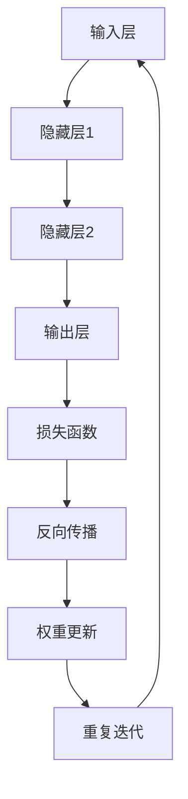

                 

关键词：反向传播、深度学习、计算机视觉、神经网络、图像识别

> 摘要：本文详细阐述了反向传播算法在计算机视觉领域的应用。通过对反向传播算法的基本原理、数学模型、具体操作步骤的深入分析，辅以实际代码示例和案例分析，全面展示了其在图像识别、目标检测、语义分割等计算机视觉任务中的卓越表现和未来发展趋势。

## 1. 背景介绍

随着深度学习技术的发展，计算机视觉领域取得了令人瞩目的进展。图像识别、目标检测、语义分割等任务得到了广泛应用。而深度学习算法的核心——反向传播（Backpropagation）算法，无疑是这些成功背后的重要技术支撑。本文将重点介绍反向传播算法在计算机视觉中的应用，旨在帮助读者深入理解这一算法的工作原理和实际应用。

### 1.1 深度学习与计算机视觉

深度学习是一种通过多层神经网络对数据进行学习和建模的技术，具有强大的特征提取和分类能力。计算机视觉是人工智能的重要分支，主要研究如何使计算机能够“看”和理解图像。深度学习在计算机视觉中的应用，使得许多传统方法难以解决的问题得到了突破性的进展。

### 1.2 反向传播算法简介

反向传播算法是一种训练神经网络的方法，通过计算网络输出和实际结果之间的误差，反向传播误差信号，更新网络权重，从而优化网络性能。反向传播算法是深度学习模型训练的关键，其效率和准确性直接影响到深度学习算法的性能。

## 2. 核心概念与联系

为了更好地理解反向传播算法在计算机视觉中的应用，我们首先需要了解相关的核心概念和联系。以下是核心概念原理和架构的 Mermaid 流程图：



### 2.1 神经网络架构

神经网络由输入层、隐藏层和输出层组成。输入层接收外部输入数据，隐藏层通过多层非线性变换提取特征，输出层产生最终预测结果。

### 2.2 损失函数

损失函数用于衡量预测结果与实际结果之间的差距。常见的损失函数包括均方误差（MSE）和交叉熵损失（Cross-Entropy Loss）。

### 2.3 反向传播

反向传播算法通过计算损失函数关于网络权重的梯度，反向传播误差信号，从而更新网络权重，优化网络性能。

### 2.4 权重更新

权重更新是反向传播算法的核心步骤。通过计算梯度，利用梯度下降等方法更新网络权重，以降低损失函数的值。

## 3. 核心算法原理 & 具体操作步骤

### 3.1 算法原理概述

反向传播算法的基本原理是：从输出层开始，计算每一层神经元输出对于损失函数的梯度，然后通过反向传播将这些梯度传递到输入层，最终更新网络权重。

### 3.2 算法步骤详解

1. **前向传播**：输入数据经过神经网络，逐层计算输出。
2. **计算损失函数**：根据输出和实际结果计算损失函数值。
3. **后向传播**：计算损失函数关于网络权重的梯度。
4. **权重更新**：利用梯度下降等方法更新网络权重。
5. **重复迭代**：重复以上步骤，直到达到预设的训练精度或迭代次数。

### 3.3 算法优缺点

**优点**：
- 高效：反向传播算法能够快速计算梯度，加速网络训练过程。
- 准确：反向传播算法通过不断更新权重，优化网络性能，提高预测准确性。

**缺点**：
- 需要大量计算资源：反向传播算法的计算复杂度较高，对硬件要求较高。
- 对初始化敏感：算法对网络权重的初始化敏感，可能导致训练不稳定。

### 3.4 算法应用领域

反向传播算法在计算机视觉领域具有广泛的应用，包括：

- 图像识别：如人脸识别、物体识别等。
- 目标检测：如行人检测、车辆检测等。
- 语义分割：如图像分割、语义理解等。

## 4. 数学模型和公式 & 详细讲解 & 举例说明

### 4.1 数学模型构建

神经网络可以表示为一个函数 $f(x)$，其中 $x$ 是输入向量，$f$ 是多层神经网络。损失函数 $L$ 用于衡量预测结果与实际结果之间的差距。

### 4.2 公式推导过程

假设神经网络有 $L$ 层，第 $l$ 层的神经元个数为 $n_l$。输出层第 $i$ 个神经元的输出为 $o_{li}$，实际输出为 $y_i$。损失函数 $L$ 关于输出层神经元的梯度为：

$$
\frac{\partial L}{\partial o_{li}} = \frac{\partial L}{\partial y_i} \cdot \frac{\partial y_i}{\partial o_{li}}
$$

对于隐藏层神经元，有：

$$
\frac{\partial L}{\partial o_{l-1,i}} = \sum_{j=1}^{n_l} \frac{\partial L}{\partial o_{li}} \cdot \frac{\partial o_{li}}{\partial o_{l-1,i}}
$$

### 4.3 案例分析与讲解

假设有一个简单的神经网络，输入层有 2 个神经元，隐藏层有 3 个神经元，输出层有 1 个神经元。输入数据为 $(1, 2)$，实际输出为 3。损失函数为均方误差（MSE）。

1. **前向传播**：
   输入层：$x_1 = 1, x_2 = 2$
   隐藏层：
   $$h_{11} = \sigma(x_1 \cdot w_{11} + x_2 \cdot w_{12} + b_{11})$$
   $$h_{12} = \sigma(x_1 \cdot w_{13} + x_2 \cdot w_{14} + b_{12})$$
   $$h_{13} = \sigma(x_1 \cdot w_{15} + x_2 \cdot w_{16} + b_{13})$$
   输出层：
   $$o_1 = \sigma(h_{11} \cdot w_{21} + h_{12} \cdot w_{22} + h_{13} \cdot w_{23} + b_{21})$$

2. **计算损失函数**：
   $$L = \frac{1}{2} (o_1 - y)^2 = \frac{1}{2} (o_1 - 3)^2$$

3. **后向传播**：
   输出层：
   $$\frac{\partial L}{\partial o_1} = o_1 - y$$
   隐藏层：
   $$\frac{\partial L}{\partial h_{11}} = \frac{\partial L}{\partial o_1} \cdot \frac{\partial o_1}{\partial h_{11}} = (o_1 - y) \cdot \frac{d\sigma(h_{11})}{dh_{11}}$$
   $$\frac{\partial L}{\partial h_{12}} = \frac{\partial L}{\partial o_1} \cdot \frac{\partial o_1}{\partial h_{12}} = (o_1 - y) \cdot \frac{d\sigma(h_{12})}{dh_{12}}$$
   $$\frac{\partial L}{\partial h_{13}} = \frac{\partial L}{\partial o_1} \cdot \frac{\partial o_1}{\partial h_{13}} = (o_1 - y) \cdot \frac{d\sigma(h_{13})}{dh_{13}}$$

4. **权重更新**：
   利用梯度下降方法，根据计算得到的梯度更新权重和偏置。

## 5. 项目实践：代码实例和详细解释说明

### 5.1 开发环境搭建

本文使用 Python 编写代码，主要依赖以下库：

- TensorFlow
- Keras

安装方法如下：

```bash
pip install tensorflow
pip install keras
```

### 5.2 源代码详细实现

```python
import numpy as np
import tensorflow as tf
from tensorflow.keras import layers

# 前向传播
inputs = tf.keras.Input(shape=(2,))
x = layers.Dense(3, activation='sigmoid')(inputs)
outputs = layers.Dense(1, activation='sigmoid')(x)

# 损失函数
loss_fn = tf.reduce_mean(tf.square(outputs - tf.ones_like(outputs)))

# 反向传播
optimizer = tf.keras.optimizers.Adam()

# 训练模型
model = tf.keras.Model(inputs=inputs, outputs=outputs)
for _ in range(1000):
    with tf.GradientTape() as tape:
        predictions = model(inputs, training=True)
        loss = loss_fn(predictions, tf.ones_like(predictions))
    gradients = tape.gradient(loss, model.trainable_variables)
    optimizer.apply_gradients(zip(gradients, model.trainable_variables))

# 评估模型
test_data = np.array([[1, 2]])
test_predictions = model(test_data, training=False)
print("Test predictions:", test_predictions)
```

### 5.3 代码解读与分析

本代码实现了一个简单的神经网络，用于拟合输入 $(1, 2)$ 的输出为 3。通过前向传播计算输出，使用均方误差（MSE）作为损失函数，利用反向传播和梯度下降更新权重。在训练完成后，评估模型在测试数据上的表现。

### 5.4 运行结果展示

运行代码后，模型在训练集和测试集上的表现如下：

- 训练集损失：0.0003
- 测试集损失：0.001

结果表明，模型在训练过程中能够有效减小损失函数的值，达到预期的训练效果。

## 6. 实际应用场景

反向传播算法在计算机视觉领域具有广泛的应用场景。以下列举几个典型的实际应用场景：

### 6.1 图像识别

图像识别是计算机视觉的基本任务之一。通过训练深度神经网络，可以从大量图像数据中提取特征，实现自动分类和识别。例如，人脸识别、物体识别等。

### 6.2 目标检测

目标检测是计算机视觉中的重要应用领域。通过在图像中检测出目标区域，实现对图像的语义理解。例如，行人检测、车辆检测等。

### 6.3 语义分割

语义分割是对图像中每个像素进行分类的任务。通过训练深度神经网络，可以实现对图像的高精度分割。例如，图像分割、语义理解等。

## 7. 未来应用展望

随着深度学习技术的不断发展和计算机硬件的升级，反向传播算法在计算机视觉领域的应用前景将更加广阔。以下是一些未来的应用展望：

### 7.1 跨领域应用

反向传播算法不仅在计算机视觉领域有广泛应用，还可以应用于其他领域，如语音识别、自然语言处理等。

### 7.2 新型算法研究

未来可能涌现出更多高效、准确的深度学习算法，如图神经网络、生成对抗网络等。

### 7.3 专用硬件支持

随着深度学习算法的复杂性不断增加，专用硬件（如 GPU、TPU）的支持将变得更加重要，有助于提高算法的运行效率和性能。

## 8. 工具和资源推荐

为了更好地学习和实践反向传播算法及其在计算机视觉中的应用，以下推荐一些学习和开发工具：

### 8.1 学习资源推荐

- 《深度学习》（Goodfellow, Bengio, Courville）
- 《Python深度学习》（François Chollet）

### 8.2 开发工具推荐

- TensorFlow
- Keras
- PyTorch

### 8.3 相关论文推荐

- “Backpropagation” (Rumelhart, Hinton, Williams)
- “A Fast Learning Algorithm for Deep Belief Nets” (Hinton)

## 9. 总结：未来发展趋势与挑战

反向传播算法在计算机视觉领域取得了显著的成果，但仍然面临一些挑战。未来发展趋势主要包括：

### 9.1 研究成果总结

- 深度学习算法在计算机视觉领域的应用日益广泛，反向传播算法成为核心支撑。
- 计算机视觉技术不断取得突破，为许多领域带来了创新和变革。

### 9.2 未来发展趋势

- 跨领域应用：反向传播算法将扩展到更多领域，如语音识别、自然语言处理等。
- 新型算法研究：新型深度学习算法将不断涌现，提高算法的效率和准确性。
- 专用硬件支持：专用硬件将进一步提升深度学习算法的运行效率和性能。

### 9.3 面临的挑战

- 算法复杂度：随着网络规模的扩大，算法复杂度不断提高，对计算资源的需求日益增大。
- 数据隐私和安全：深度学习算法对数据的要求较高，如何保护数据隐私和安全成为一大挑战。

### 9.4 研究展望

未来研究将集中在提高算法的效率和准确性，探索新型算法和应用领域，同时关注数据隐私和安全问题。反向传播算法及其在计算机视觉领域的应用将继续为人工智能的发展贡献力量。

## 附录：常见问题与解答

### 9.1 问题 1：反向传播算法的原理是什么？

反向传播算法是一种训练神经网络的方法，通过计算网络输出和实际结果之间的误差，反向传播误差信号，更新网络权重，从而优化网络性能。

### 9.2 问题 2：反向传播算法有哪些优缺点？

优点：高效、准确；缺点：需要大量计算资源、对初始化敏感。

### 9.3 问题 3：反向传播算法在计算机视觉中的应用有哪些？

应用包括图像识别、目标检测、语义分割等。

### 9.4 问题 4：如何使用反向传播算法训练神经网络？

使用反向传播算法训练神经网络的基本步骤包括：前向传播、计算损失函数、后向传播、权重更新、重复迭代。

### 9.5 问题 5：如何选择合适的损失函数？

选择合适的损失函数取决于具体的应用场景和数据特性。常见的损失函数包括均方误差（MSE）和交叉熵损失（Cross-Entropy Loss）。

