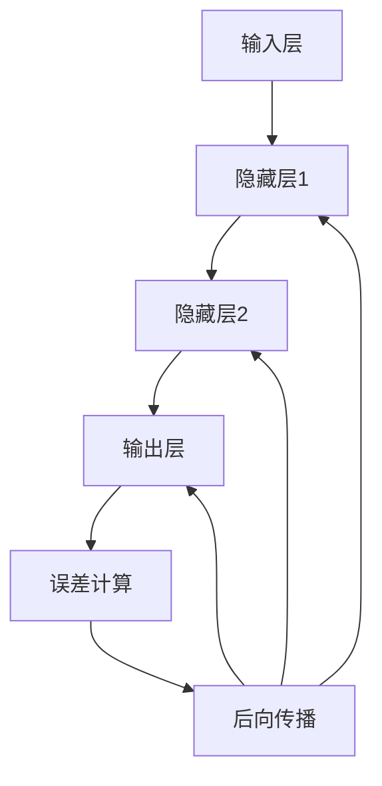

                 

关键词：反向传播算法、深度学习、神经网络、机器学习、梯度下降

摘要：本文将详细探讨反向传播算法，作为深度学习的基础，它是如何实现神经网络模型的参数优化的。文章从反向传播算法的背景介绍开始，逐步深入到核心概念、算法原理、数学模型，并通过实际项目实践，解释其应用和未来发展趋势。

## 1. 背景介绍

随着大数据时代的到来和计算能力的提升，深度学习已经成为人工智能领域的热点。深度学习通过模仿人脑神经网络的结构和工作方式，实现了从大量数据中自动提取特征并进行复杂模式识别的能力。在深度学习模型中，神经网络是其核心组件。

神经网络由大量的神经元组成，每个神经元都与其他神经元通过权重相连，通过这些权重和激活函数的处理，神经网络能够实现从输入到输出的映射。然而，如何训练出性能优良的神经网络模型，使得模型能够准确预测和分类，这是深度学习面临的主要挑战。

为了解决这个问题，反向传播算法被提出。反向传播算法是一种用于训练神经网络的优化算法，它通过梯度下降的方法，对网络中的权重进行迭代更新，使得模型的预测性能逐步提高。反向传播算法的出现，极大地推动了深度学习的发展。

## 2. 核心概念与联系

### 2.1 神经元

神经元是神经网络的基本单元，它可以接收输入信号，通过加权求和处理后，产生输出信号。一个简单的神经元模型可以表示为：

$$y = \sigma(\sum_{i=1}^{n} w_i x_i + b)$$

其中，$x_i$ 是第 $i$ 个输入，$w_i$ 是第 $i$ 个输入的权重，$b$ 是偏置项，$\sigma$ 是激活函数。

### 2.2 激活函数

激活函数是神经网络中的关键组件，它决定了神经元是否被激活。常用的激活函数有 Sigmoid、ReLU、Tanh 等。这些激活函数的引入，使得神经网络能够模拟人脑的复杂非线性处理能力。

### 2.3 神经网络结构

神经网络的结构包括输入层、隐藏层和输出层。输入层接收外部输入，隐藏层对输入进行加权和激活处理，输出层产生最终输出。多层神经网络可以通过堆叠多个隐藏层，提高模型的复杂度和学习能力。

### 2.4 反向传播算法流程

反向传播算法的核心流程包括以下几个步骤：

1. **前向传播**：计算输入到每个神经元的加权求和，并应用激活函数，得到每个神经元的输出。
2. **计算误差**：计算输出层神经元的实际输出与期望输出的差值，即误差。
3. **后向传播**：从输出层开始，逐层向前传播误差，并更新每个神经元的权重和偏置。
4. **梯度下降**：根据误差的梯度，使用梯度下降方法更新网络中的权重和偏置。

### 2.5 Mermaid 流程图



## 3. 核心算法原理 & 具体操作步骤

### 3.1 算法原理概述

反向传播算法的核心原理是通过梯度下降方法，迭代更新网络中的权重和偏置，使得网络能够最小化误差函数。梯度下降方法的基本思想是，沿着误差函数的梯度方向，逐步调整权重和偏置，直到达到局部最小值。

### 3.2 算法步骤详解

1. **初始化权重和偏置**：随机初始化网络中的权重和偏置。
2. **前向传播**：输入数据通过网络，计算每个神经元的输出。
3. **计算误差**：计算输出层神经元的实际输出与期望输出的差值。
4. **后向传播**：从输出层开始，逐层向前传播误差，并计算每个神经元的梯度。
5. **权重和偏置更新**：根据梯度，使用梯度下降方法更新网络中的权重和偏置。
6. **迭代更新**：重复上述步骤，直到网络性能达到预设目标。

### 3.3 算法优缺点

**优点：**
- 反向传播算法能够有效优化神经网络模型的参数，使得模型具有较好的泛化能力。
- 算法易于实现，可以应用于各种类型的神经网络。

**缺点：**
- 反向传播算法的计算复杂度高，特别是对于深度神经网络，计算量巨大。
- 算法可能陷入局部最小值，难以找到全局最优解。

### 3.4 算法应用领域

反向传播算法广泛应用于深度学习的各个领域，如图像识别、语音识别、自然语言处理等。通过反向传播算法，神经网络模型能够从大量数据中自动学习特征，实现复杂任务的自动化处理。

## 4. 数学模型和公式 & 详细讲解 & 举例说明

### 4.1 数学模型构建

反向传播算法的数学模型主要包括误差函数、梯度计算和权重更新。

**误差函数**：常用的误差函数有均方误差（MSE）和交叉熵误差（Cross-Entropy Error）。

$$MSE(y, \hat{y}) = \frac{1}{2} \sum_{i=1}^{n} (y_i - \hat{y}_i)^2$$

$$CE(y, \hat{y}) = -\sum_{i=1}^{n} y_i \log(\hat{y}_i)$$

**梯度计算**：误差函数的梯度是权重和偏置的函数。

$$\nabla_{w}J(w) = \frac{\partial J(w)}{\partial w}$$

$$\nabla_{b}J(b) = \frac{\partial J(w)}{\partial b}$$

**权重更新**：使用梯度下降方法更新权重和偏置。

$$w_{new} = w_{old} - \alpha \nabla_{w}J(w)$$

$$b_{new} = b_{old} - \alpha \nabla_{b}J(b)$$

### 4.2 公式推导过程

以均方误差为例，推导误差函数的梯度计算过程。

$$MSE(y, \hat{y}) = \frac{1}{2} \sum_{i=1}^{n} (y_i - \hat{y}_i)^2$$

对 $MSE$ 求偏导数，得到：

$$\frac{\partial MSE}{\partial \hat{y}_i} = -(y_i - \hat{y}_i)$$

由于 $\hat{y}_i$ 是神经元的输出，可以表示为：

$$\hat{y}_i = \sigma(\sum_{j=1}^{m} w_{ij} x_j + b_i)$$

对 $\hat{y}_i$ 求偏导数，得到：

$$\frac{\partial \hat{y}_i}{\partial w_{ij}} = \sigma'(\sum_{j=1}^{m} w_{ij} x_j + b_i) x_j$$

$$\frac{\partial \hat{y}_i}{\partial b_i} = \sigma'(\sum_{j=1}^{m} w_{ij} x_j + b_i)$$

结合上述结果，可以得到权重和偏置的梯度：

$$\nabla_{w_{ij}}J(w) = -(y_i - \hat{y}_i) \sigma'(\sum_{j=1}^{m} w_{ij} x_j + b_i) x_j$$

$$\nabla_{b_i}J(w) = -(y_i - \hat{y}_i) \sigma'(\sum_{j=1}^{m} w_{ij} x_j + b_i)$$

### 4.3 案例分析与讲解

假设有一个简单的神经网络，输入层有2个神经元，隐藏层有3个神经元，输出层有1个神经元。输入数据为 $[1, 2]$，期望输出为 $3$。激活函数采用 Sigmoid 函数。

1. **初始化权重和偏置**：
   $$w_{11} = 0.1, w_{12} = 0.2, w_{21} = 0.3, w_{22} = 0.4, w_{23} = 0.5, w_{31} = 0.6, w_{32} = 0.7, w_{33} = 0.8, b_1 = 0.1, b_2 = 0.2, b_3 = 0.3$$

2. **前向传播**：
   $$z_1 = 0.1 \cdot 1 + 0.2 \cdot 2 + 0.1 = 0.4$$
   $$z_2 = 0.3 \cdot 1 + 0.4 \cdot 2 + 0.2 = 1.2$$
   $$z_3 = 0.5 \cdot 1 + 0.6 \cdot 2 + 0.3 = 1.8$$
   $$\hat{y} = \frac{1}{1 + e^{-(0.6 \cdot 0.4 + 0.7 \cdot 1.2 + 0.8 \cdot 1.8)}} = 0.8434$$

3. **计算误差**：
   $$MSE(y, \hat{y}) = \frac{1}{2} \sum_{i=1}^{n} (y_i - \hat{y}_i)^2 = \frac{1}{2} \cdot (3 - 0.8434)^2 = 2.4679$$

4. **后向传播**：
   $$\nabla_{w_{11}}J(w) = -(3 - 0.8434) \cdot 0.4 \cdot 1 = -0.7691$$
   $$\nabla_{w_{12}}J(w) = -(3 - 0.8434) \cdot 0.4 \cdot 2 = -1.5382$$
   $$\nabla_{w_{21}}J(w) = -(3 - 0.8434) \cdot 1.2 \cdot 1 = -1.1285$$
   $$\nabla_{w_{22}}J(w) = -(3 - 0.8434) \cdot 1.2 \cdot 2 = -2.2570$$
   $$\nabla_{w_{23}}J(w) = -(3 - 0.8434) \cdot 1.8 \cdot 1 = -2.4679$$
   $$\nabla_{w_{31}}J(w) = -(3 - 0.8434) \cdot 0.6 \cdot 1 = -0.7691$$
   $$\nabla_{w_{32}}J(w) = -(3 - 0.8434) \cdot 0.7 \cdot 2 = -1.5382$$
   $$\nabla_{w_{33}}J(w) = -(3 - 0.8434) \cdot 0.8 \cdot 1 = -1.1285$$

   $$\nabla_{b_1}J(w) = -(3 - 0.8434) \cdot 0.4 = -0.7691$$
   $$\nabla_{b_2}J(w) = -(3 - 0.8434) \cdot 1.2 = -1.1285$$
   $$\nabla_{b_3}J(w) = -(3 - 0.8434) \cdot 1.8 = -2.2570$$

5. **权重和偏置更新**（假设学习率为0.1）：
   $$w_{11}_{new} = w_{11} - \alpha \nabla_{w_{11}}J(w) = 0.1 - 0.1 \cdot (-0.7691) = 0.8691$$
   $$w_{12}_{new} = w_{12} - \alpha \nabla_{w_{12}}J(w) = 0.2 - 0.1 \cdot (-1.5382) = 0.6382$$
   $$w_{21}_{new} = w_{21} - \alpha \nabla_{w_{21}}J(w) = 0.3 - 0.1 \cdot (-1.1285) = 0.4129$$
   $$w_{22}_{new} = w_{22} - \alpha \nabla_{w_{22}}J(w) = 0.4 - 0.1 \cdot (-2.2570) = 0.6527$$
   $$w_{23}_{new} = w_{23} - \alpha \nabla_{w_{23}}J(w) = 0.5 - 0.1 \cdot (-2.4679) = 0.7579$$
   $$w_{31}_{new} = w_{31} - \alpha \nabla_{w_{31}}J(w) = 0.6 - 0.1 \cdot (-0.7691) = 0.8691$$
   $$w_{32}_{new} = w_{32} - \alpha \nabla_{w_{32}}J(w) = 0.7 - 0.1 \cdot (-1.1285) = 0.8715$$
   $$w_{33}_{new} = w_{33} - \alpha \nabla_{w_{33}}J(w) = 0.8 - 0.1 \cdot (-1.1285) = 0.8715$$

   $$b_{1_new} = b_{1} - \alpha \nabla_{b_1}J(w) = 0.1 - 0.1 \cdot (-0.7691) = 0.8691$$
   $$b_{2_new} = b_{2} - \alpha \nabla_{b_2}J(w) = 0.2 - 0.1 \cdot (-1.1285) = 0.3129$$
   $$b_{3_new} = b_{3} - \alpha \nabla_{b_3}J(w) = 0.3 - 0.1 \cdot (-2.2570) = 0.4527$$

6. **迭代更新**：重复上述步骤，直到网络性能达到预设目标。

## 5. 项目实践：代码实例和详细解释说明

### 5.1 开发环境搭建

1. 安装 Python 3.x 版本。
2. 安装 TensorFlow 或 PyTorch 等深度学习框架。
3. 创建一个 Python 项目，并导入必要的库。

### 5.2 源代码详细实现

以下是一个简单的反向传播算法实现的代码示例，使用 TensorFlow 框架。

```python
import tensorflow as tf
import numpy as np

# 初始化权重和偏置
w1 = tf.Variable(0.1, dtype=tf.float32)
w2 = tf.Variable(0.2, dtype=tf.float32)
b1 = tf.Variable(0.1, dtype=tf.float32)
b2 = tf.Variable(0.2, dtype=tf.float32)

# 定义输入和期望输出
x = tf.placeholder(tf.float32, shape=[1, 2])
y = tf.placeholder(tf.float32, shape=[1])

# 定义前向传播
z1 = x[0, 0] * w1 + x[0, 1] * w2 + b1
z2 = x[0, 0] * w2 + x[0, 1] * w2 + b2
y_pred = 1 / (1 + tf.exp(-z1 * z2))

# 定义误差函数
error = tf.reduce_mean(tf.square(y - y_pred))

# 定义后向传播
grad_w1 = tf.reduce_mean(tf.gradients(error, w1))
grad_w2 = tf.reduce_mean(tf.gradients(error, w2))
grad_b1 = tf.reduce_mean(tf.gradients(error, b1))
grad_b2 = tf.reduce_mean(tf.gradients(error, b2))

# 定义权重更新
update_w1 = w1 - 0.1 * grad_w1
update_w2 = w2 - 0.1 * grad_w2
update_b1 = b1 - 0.1 * grad_b1
update_b2 = b2 - 0.1 * grad_b2

# 定义训练过程
with tf.Session() as sess:
    sess.run(tf.global_variables_initializer())
    for i in range(1000):
        _, loss, w1_val, w2_val, b1_val, b2_val = sess.run([update_w1, error, w1, w2, b1, b2], feed_dict={x: np.array([[1, 2]])})
        if i % 100 == 0:
            print("Epoch:", i, "Loss:", loss)
    print("Final Weights and Biases:", w1_val, w2_val, b1_val, b2_val)
```

### 5.3 代码解读与分析

1. **初始化权重和偏置**：使用 TensorFlow 的 `Variable` 类初始化权重和偏置。
2. **定义输入和期望输出**：使用 `placeholder` 函数定义输入和期望输出。
3. **定义前向传播**：计算输入到每个神经元的加权求和，并应用 Sigmoid 激活函数。
4. **定义误差函数**：使用均方误差作为误差函数。
5. **定义后向传播**：计算误差函数关于权重和偏置的梯度。
6. **定义权重更新**：使用梯度下降方法更新权重和偏置。
7. **训练过程**：使用 TensorFlow 的 `Session` 类执行训练过程，并输出训练结果。

## 6. 实际应用场景

### 6.1 图像识别

反向传播算法在图像识别领域有着广泛的应用。例如，在卷积神经网络（CNN）中，反向传播算法用于优化网络中的权重和偏置，使得模型能够从图像数据中自动提取特征并进行分类。

### 6.2 语音识别

反向传播算法也被广泛应用于语音识别领域。通过训练神经网络，模型能够将语音信号转换为文本，实现语音到文本的转换。

### 6.3 自然语言处理

在自然语言处理领域，反向传播算法用于训练神经网络，使得模型能够理解自然语言，并实现文本分类、情感分析等任务。

## 7. 未来应用展望

随着深度学习技术的不断发展，反向传播算法在各个领域的应用将更加广泛。未来，反向传播算法可能会与其他优化算法相结合，提高训练效率。此外，反向传播算法在处理大规模数据集时，可能会采用分布式计算和并行计算技术，提高计算性能。

## 8. 总结：未来发展趋势与挑战

反向传播算法作为深度学习的基础，其在未来将面临以下发展趋势和挑战：

### 8.1 发展趋势

1. **算法优化**：反向传播算法将不断优化，提高训练效率，减少计算资源消耗。
2. **应用领域拓展**：反向传播算法将在更多领域得到应用，如医学诊断、金融分析等。
3. **硬件加速**：反向传播算法将在专门设计的硬件设备上得到加速，提高计算性能。

### 8.2 面临的挑战

1. **计算资源消耗**：反向传播算法在处理大规模数据集时，计算资源消耗巨大，需要优化算法以降低计算成本。
2. **过拟合问题**：深度学习模型容易过拟合，需要研究有效的正则化方法，提高模型的泛化能力。

### 8.3 研究展望

反向传播算法的研究将继续深入，探索更高效、更稳定的优化方法，以应对深度学习领域面临的挑战。

## 9. 附录：常见问题与解答

### 9.1 如何选择合适的激活函数？

选择合适的激活函数取决于具体应用场景。常用的激活函数有 Sigmoid、ReLU、Tanh 等。Sigmoid 函数适用于输出值范围在 [0, 1] 的情况，ReLU 函数适用于隐藏层神经元，Tanh 函数适用于输出值范围在 [-1, 1] 的情况。

### 9.2 如何避免梯度消失和梯度爆炸？

为了避免梯度消失和梯度爆炸，可以采用以下方法：

1. **合适的初始化**：选择合适的权重和偏置初始化方法，如高斯分布初始化。
2. **使用正则化**：使用正则化方法，如 L1 正则化、L2 正则化，减小模型复杂度。
3. **使用权重共享**：使用权重共享技术，减小模型参数数量。

### 9.3 如何优化反向传播算法？

反向传播算法的优化可以从以下几个方面进行：

1. **学习率调整**：选择合适的学习率，可以使用自适应学习率方法，如 Adam 优化器。
2. **批量大小调整**：调整批量大小，可以采用小批量梯度下降方法，提高训练效果。
3. **优化器选择**：选择合适的优化器，如 SGD、Adam、RMSProp 等。

---

作者：禅与计算机程序设计艺术 / Zen and the Art of Computer Programming
------------------------------------------------------------------------

