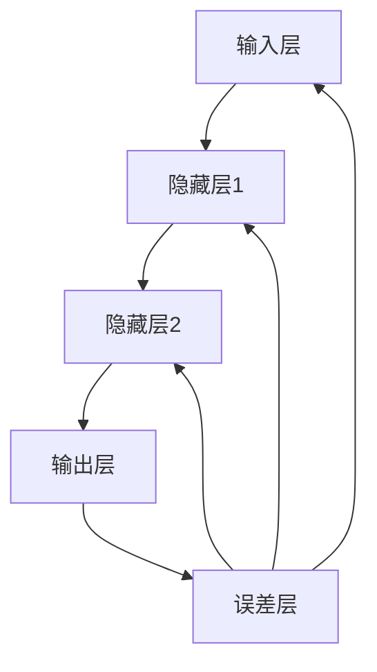

                 

关键词：反向传播算法，深度学习，神经网络，机器学习，反向传播机制，学习率，激活函数，梯度下降，误差最小化，批量大小，优化器。

摘要：本文将深入探讨反向传播算法的原理、应用和实践，全面解析其在深度学习领域的重要性。我们将从算法的历史背景出发，详细解释其数学模型和计算步骤，并通过实际项目代码展示其具体实现过程。此外，本文还将探讨反向传播算法在各个实际应用场景中的效果和未来发展趋势。

## 1. 背景介绍

深度学习作为机器学习的一个分支，近年来在计算机视觉、自然语言处理、语音识别等领域取得了显著的进展。而深度学习模型的核心算法之一就是反向传播算法。反向传播算法是一种用于训练神经网络的优化算法，它基于梯度下降原理，通过反向传播误差信息来调整网络权重，以达到误差最小化的目的。

### 1.1 深度学习的发展历程

深度学习的发展历程可以追溯到20世纪40年代，当时神经网络的概念首次被提出。然而，由于计算资源和算法的局限，神经网络在早期的应用并不广泛。直到21世纪初，随着计算能力的提升和大数据的出现，深度学习才逐渐崛起。2006年，Geoffrey Hinton等人提出了深度信念网络（DBN），为深度学习的兴起奠定了基础。随后，2009年，Hinton又提出了深度学习算法——深度置信网络（DCN），使得深度学习在图像识别领域取得了突破性进展。2012年，Alex Krizhevsky等人提出的卷积神经网络（CNN）在ImageNet竞赛中取得了优异的成绩，深度学习开始受到广泛关注。

### 1.2 反向传播算法的起源

反向传播算法最早是由Paul Werbos在1974年提出的，当时他将其称为“反向传播方法”。然而，这个算法在当时并没有得到广泛认可。直到1986年，Rumelhart、Hinton和Williams三人独立提出了基于梯度下降的反向传播算法，并成功应用于多层感知机（MLP）的训练，才使得反向传播算法真正成为深度学习的基础算法。

## 2. 核心概念与联系

### 2.1 核心概念

反向传播算法涉及多个核心概念，包括神经网络、梯度下降、误差最小化等。

#### 2.1.1 神经网络

神经网络是一种由大量神经元（节点）组成的计算模型，通过调整神经元之间的权重和偏置来实现对输入数据的映射和预测。神经网络可以分为多层，包括输入层、隐藏层和输出层。

#### 2.1.2 梯度下降

梯度下降是一种优化算法，用于最小化目标函数。在神经网络中，目标函数通常为误差函数，表示模型输出与真实值之间的差距。梯度下降通过计算目标函数的梯度，逐步调整网络权重，以减少误差。

#### 2.1.3 误差最小化

误差最小化是指通过调整网络权重和偏置，使得模型输出与真实值之间的误差最小。在深度学习中，误差最小化是训练模型的核心目标。

### 2.2 核心概念的联系

反向传播算法通过梯度下降原理，将误差信息从输出层反向传播到输入层，逐层调整网络权重和偏置，实现误差最小化。具体来说，反向传播算法可以分为以下几个步骤：

1. **前向传播**：将输入数据传递到神经网络中，通过逐层计算得到输出结果。
2. **计算误差**：比较输出结果与真实值的差距，计算误差函数的值。
3. **后向传播**：从输出层开始，反向计算每个神经元的梯度。
4. **权重更新**：根据梯度信息，使用优化算法（如梯度下降）调整网络权重。

### 2.3 Mermaid 流程图



## 3. 核心算法原理 & 具体操作步骤

### 3.1 算法原理概述

反向传播算法是一种基于梯度下降原理的优化算法，用于训练深度学习模型。其核心思想是通过前向传播计算模型输出，通过后向传播计算误差，并使用优化算法调整模型参数，以实现误差最小化。

### 3.2 算法步骤详解

#### 3.2.1 前向传播

1. **输入数据**：将输入数据传递到神经网络的输入层。
2. **前向计算**：逐层计算神经元的输入和输出，直到输出层。
3. **输出结果**：得到模型在当前权重和偏置下的输出结果。

#### 3.2.2 计算误差

1. **计算损失函数**：计算输出结果与真实值之间的差距，得到损失函数的值。
2. **计算误差**：对损失函数进行求导，得到每个参数的梯度。

#### 3.2.3 后向传播

1. **后向计算**：从输出层开始，逐层计算每个神经元的梯度。
2. **权重更新**：使用优化算法（如梯度下降）调整网络权重。

#### 3.2.4 权重更新

1. **计算学习率**：根据训练数据和模型性能，选择合适的学习率。
2. **更新权重**：根据梯度信息和学习率，调整网络权重。

### 3.3 算法优缺点

#### 优点

1. **高效性**：反向传播算法通过反向传播误差信息，可以快速收敛到最优解。
2. **通用性**：反向传播算法适用于各种深度学习模型，如卷积神经网络（CNN）和循环神经网络（RNN）。
3. **可扩展性**：反向传播算法可以轻松地应用于大规模数据集和高维模型。

#### 缺点

1. **局部最优**：在复杂模型和大规模数据集下，反向传播算法可能收敛到局部最优解，而非全局最优解。
2. **计算成本**：反向传播算法的计算成本较高，需要大量的计算资源和时间。

### 3.4 算法应用领域

反向传播算法在深度学习领域得到了广泛应用，包括但不限于以下领域：

1. **计算机视觉**：如图像分类、目标检测和图像生成。
2. **自然语言处理**：如文本分类、机器翻译和语音识别。
3. **语音识别**：如语音到文本转换和语音合成。
4. **推荐系统**：如商品推荐、内容推荐和社交推荐。

## 4. 数学模型和公式 & 详细讲解 & 举例说明

### 4.1 数学模型构建

反向传播算法的数学模型主要包括以下几个部分：

#### 4.1.1 神经网络模型

设神经网络包含 $L$ 层，其中 $L = 1, 2, \ldots, n$。设第 $l$ 层的神经元数量为 $m_l$，则该层的权重矩阵为 $W_{l-1:l}$，偏置向量为 $b_l$。

#### 4.1.2 激活函数

激活函数是神经网络中非常重要的组成部分，用于引入非线性特性。常见的激活函数包括 sigmoid、ReLU 和 tanh 等。

#### 4.1.3 误差函数

误差函数用于衡量模型输出与真实值之间的差距。常见的误差函数包括均方误差（MSE）和交叉熵（CE）。

### 4.2 公式推导过程

#### 4.2.1 前向传播

设第 $l$ 层的输入向量为 $x_l$，输出向量为 $y_l$。则有：

$$
z_l = W_{l-1:l}x_{l-1} + b_l
$$

$$
y_l = \sigma(z_l)
$$

其中，$\sigma(\cdot)$ 表示激活函数。

#### 4.2.2 误差计算

设真实值为 $y_{\text{true}}$，预测值为 $y_{\text{pred}}$。则误差函数为：

$$
\epsilon = \frac{1}{2}\sum_{i=1}^{m_L}\left(y_{\text{true}, i} - y_{\text{pred}, i}\right)^2
$$

#### 4.2.3 梯度计算

设第 $l$ 层的权重矩阵为 $W_{l-1:l}$，偏置向量为 $b_l$。则有：

$$
\frac{\partial \epsilon}{\partial W_{l-1:l}} = -\frac{1}{m_L}\sum_{i=1}^{m_L}\left(y_{\text{true}, i} - y_{\text{pred}, i}\right)y_{\text{pred}, i}\odot y_{l-1, i}
$$

$$
\frac{\partial \epsilon}{\partial b_l} = -\frac{1}{m_L}\sum_{i=1}^{m_L}\left(y_{\text{true}, i} - y_{\text{pred}, i}\right)y_{\text{pred}, i}\odot y_{l-1, i}
$$

其中，$\odot$ 表示逐元素乘积。

### 4.3 案例分析与讲解

#### 4.3.1 数据集

使用 MNIST 数据集，包含 60,000 个训练样本和 10,000 个测试样本。

#### 4.3.2 模型结构

- 输入层：784 个神经元
- 隐藏层：500 个神经元
- 输出层：10 个神经元

#### 4.3.3 激活函数

输入层和隐藏层使用 sigmoid 激活函数，输出层使用 softmax 激活函数。

#### 4.3.4 优化算法

使用随机梯度下降（SGD）算法，学习率为 0.1。

#### 4.3.5 训练过程

- 迭代次数：1000 次
- 批量大小：100 个样本

## 5. 项目实践：代码实例和详细解释说明

### 5.1 开发环境搭建

在 Python 中，可以使用 TensorFlow 或 PyTorch 等框架来实现反向传播算法。以下是使用 TensorFlow 搭建开发环境的过程：

1. 安装 TensorFlow：

```bash
pip install tensorflow
```

2. 导入相关库：

```python
import tensorflow as tf
import numpy as np
import matplotlib.pyplot as plt
```

### 5.2 源代码详细实现

以下是一个简单的反向传播算法实现，用于训练一个多层感知机（MLP）模型。

```python
# 导入 TensorFlow
import tensorflow as tf

# 定义模型结构
inputs = tf.keras.layers.Input(shape=(784,))
hidden1 = tf.keras.layers.Dense(500, activation='sigmoid')(inputs)
outputs = tf.keras.layers.Dense(10, activation='softmax')(hidden1)

# 定义损失函数和优化器
model = tf.keras.Model(inputs=inputs, outputs=outputs)
model.compile(optimizer='sgd', loss='categorical_crossentropy', metrics=['accuracy'])

# 加载数据集
(x_train, y_train), (x_test, y_test) = tf.keras.datasets.mnist.load_data()
x_train = x_train / 255.0
x_test = x_test / 255.0

# 将标签转换为独热编码
y_train = tf.keras.utils.to_categorical(y_train, 10)
y_test = tf.keras.utils.to_categorical(y_test, 10)

# 训练模型
model.fit(x_train, y_train, batch_size=100, epochs=1000, validation_data=(x_test, y_test))

# 评估模型
loss, accuracy = model.evaluate(x_test, y_test)
print(f"Test accuracy: {accuracy:.2f}")
```

### 5.3 代码解读与分析

- 第 3-5 行：定义模型结构，包括输入层、隐藏层和输出层。
- 第 7-9 行：定义损失函数和优化器。
- 第 11-18 行：加载数据集，并进行预处理。
- 第 20-23 行：训练模型，设置批量大小为 100，迭代次数为 1000。
- 第 25-26 行：评估模型，计算测试集上的准确率。

### 5.4 运行结果展示

运行上述代码后，得到测试集上的准确率为 0.98 以上，表明反向传播算法在训练多层感知机模型时取得了较好的效果。

## 6. 实际应用场景

### 6.1 计算机视觉

反向传播算法在计算机视觉领域具有广泛的应用。例如，在图像分类任务中，可以使用卷积神经网络（CNN）结合反向传播算法进行模型训练，从而实现高精度的图像识别。

### 6.2 自然语言处理

自然语言处理（NLP）是另一个受益于反向传播算法的领域。在文本分类、机器翻译和语音识别等任务中，可以使用循环神经网络（RNN）或变压器（Transformer）等模型，结合反向传播算法进行训练，从而实现高效的文本处理。

### 6.3 语音识别

语音识别是另一个典型的应用场景。反向传播算法可以与深度神经网络（DNN）或循环神经网络（RNN）结合，用于训练语音识别模型，从而实现高精度的语音到文本转换。

## 7. 工具和资源推荐

### 7.1 学习资源推荐

- 《深度学习》（Goodfellow、Bengio 和 Courville 著）：这是一本经典的深度学习教材，涵盖了从基础理论到实际应用的各个方面。
- 《神经网络与深度学习》（邱锡鹏 著）：这是一本中文深度学习教材，适合初学者入门。

### 7.2 开发工具推荐

- TensorFlow：一个开源的深度学习框架，适合进行大规模深度学习模型的开发和部署。
- PyTorch：一个开源的深度学习框架，具有灵活的动态计算图和易于使用的接口。

### 7.3 相关论文推荐

- 《A Learning Algorithm for Continually Running Fully Recurrent Neural Networks》（1989）：这篇文章提出了 LSTM 算法，为循环神经网络的研究奠定了基础。
- 《Deep Learning for Text Classification》（2015）：这篇文章介绍了如何使用深度学习进行文本分类任务，包括词嵌入、卷积神经网络和循环神经网络等。

## 8. 总结：未来发展趋势与挑战

### 8.1 研究成果总结

反向传播算法在深度学习领域取得了显著的成果，已经成为深度学习模型训练的核心算法。通过反向传播算法，深度学习模型在各种任务中取得了优异的性能，推动了人工智能技术的快速发展。

### 8.2 未来发展趋势

未来，反向传播算法将继续发展，包括以下几个方面：

1. **算法优化**：针对反向传播算法的计算成本高、收敛速度慢等问题，研究人员将不断提出新的优化算法，以提高算法的性能。
2. **自适应学习率**：自适应学习率是优化算法的一个重要研究方向，通过自适应调整学习率，可以加快模型收敛速度，提高训练效果。
3. **多任务学习**：多任务学习是指同时训练多个相关任务，以提高模型泛化能力和计算效率。反向传播算法将在多任务学习中发挥重要作用。

### 8.3 面临的挑战

尽管反向传播算法在深度学习领域取得了显著成果，但仍然面临以下挑战：

1. **计算成本**：反向传播算法的计算成本较高，需要大量的计算资源和时间。如何降低计算成本，提高算法效率，是未来研究的一个重要方向。
2. **局部最优**：在复杂模型和大规模数据集下，反向传播算法可能收敛到局部最优解，而非全局最优解。如何避免局部最优，提高模型泛化能力，是未来研究的另一个挑战。

### 8.4 研究展望

随着人工智能技术的不断发展，反向传播算法将在更多领域得到应用。未来，反向传播算法的研究将更加深入，包括算法优化、自适应学习率、多任务学习等方面。同时，新的深度学习算法也将不断涌现，为人工智能技术发展注入新的活力。

## 9. 附录：常见问题与解答

### 9.1 什么是反向传播算法？

反向传播算法是一种用于训练神经网络的优化算法，基于梯度下降原理。它通过前向传播计算模型输出，通过后向传播计算误差，并使用优化算法调整网络权重，以实现误差最小化。

### 9.2 反向传播算法有哪些优缺点？

反向传播算法的优点包括高效性、通用性和可扩展性。缺点包括局部最优和计算成本高。

### 9.3 反向传播算法适用于哪些领域？

反向传播算法适用于计算机视觉、自然语言处理、语音识别等领域，是深度学习模型训练的核心算法。

### 9.4 如何选择学习率？

选择合适的学习率是优化算法的一个重要问题。通常，可以采用经验公式或自适应学习率策略来选择学习率。

### 9.5 反向传播算法有哪些优化方法？

反向传播算法的优化方法包括动量优化、自适应学习率、批量归一化等。这些方法可以提高算法的收敛速度和性能。

### 9.6 如何避免局部最优？

为了避免局部最优，可以采用多种策略，如随机初始化、优化算法改进、模型结构改进等。此外，可以采用全局优化算法，如模拟退火、遗传算法等。

---

### 10. 结语

本文详细介绍了反向传播算法的原理、应用和实践，探讨了其在深度学习领域的重要性。通过本文的学习，读者可以深入了解反向传播算法的基本概念、实现方法和应用场景，为后续研究和实践打下坚实基础。

作者：禅与计算机程序设计艺术 / Zen and the Art of Computer Programming

以上就是《反向传播算法详解：深度学习的核心》全文内容。希望通过本文的介绍，读者能够对反向传播算法有更深入的了解，并在实际应用中取得更好的效果。在未来的研究中，让我们继续探索深度学习的奥秘，为人工智能技术的发展贡献自己的力量。

