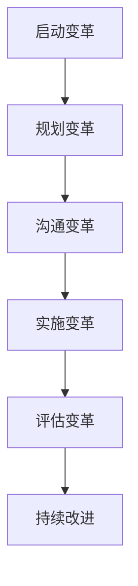

                 

 在当今快速发展的技术环境中，组织转型已成为不可避免的趋势。无论是为了应对市场竞争，还是为了提高内部效率和创新能力，组织转型都扮演着至关重要的角色。然而，变革管理作为推动这一转型过程的核心环节，常常面临诸多挑战。本文将深入探讨变革管理的核心概念、策略和技巧，以帮助组织在转型过程中实现平稳过渡。

> **关键词：** 组织转型，变革管理，领导力，沟通策略，实施技巧，技术挑战

> **摘要：** 本文首先介绍了组织转型的背景和必要性，然后详细阐述了变革管理的核心概念和基本原则。接着，文章从领导力、沟通策略和实施技巧三个方面，提供了具体的变革管理技巧。随后，文章讨论了技术变革在组织转型中的作用，并给出了未来应用展望。最后，文章总结了变革管理的研究成果，探讨了未来发展趋势和面临的挑战，并提出了研究展望。

## 1. 背景介绍

在过去的几十年中，技术变革的速度前所未有地加快，这不仅改变了市场的竞争格局，也深刻地影响了组织的运作方式。企业必须不断适应新的技术趋势，以保持竞争力。例如，云计算、大数据、人工智能和区块链等新兴技术，正逐渐成为企业运营的核心要素。这些技术不仅带来了新的业务机会，也提出了新的挑战。

组织转型，指的是组织在战略、结构、流程和文化等方面进行系统性变革，以适应外部环境的变化。组织转型的必要性主要体现在以下几个方面：

1. **市场竞争加剧：** 随着全球化的发展和市场竞争的加剧，企业必须不断提高效率和创新能力，以保持竞争优势。
2. **技术革新：** 技术的快速迭代和新兴技术的不断涌现，要求企业必须具备快速响应和适应变化的能力。
3. **员工需求变化：** 新一代员工更加注重工作与生活的平衡，追求自我实现和发展，这要求企业在组织文化和领导风格上进行变革。
4. **客户需求变化：** 消费者需求的多样化和个性化，促使企业必须通过创新和灵活的运营模式来满足客户需求。

## 2. 核心概念与联系

### 2.1 变革管理的定义与核心要素

变革管理是指通过系统的方法和策略，引导组织成员理解和接受变革，积极应对变革过程中的挑战，从而实现组织目标和战略。变革管理的关键要素包括：

1. **领导力：** 领导者在变革过程中起着至关重要的作用。他们需要明确变革的方向和目标，并提供强有力的领导和支持。
2. **沟通策略：** 沟通是变革成功的关键。组织需要通过多种渠道和方式，与员工进行有效沟通，确保信息的透明和一致性。
3. **实施技巧：** 变革管理需要具体的实施技巧，如组织设计、流程优化、文化变革等，以确保变革能够顺利落地。
4. **员工参与：** 员工的参与和投入是变革成功的重要保障。组织需要通过各种方式，激发员工的积极性和创造力。

### 2.2 变革管理的原理和架构

变革管理的原理和架构可以用以下 Mermaid 流程图来表示：



- **A. 启动变革**：明确变革的目标和愿景，建立变革领导小组。
- **B. 规划变革**：制定详细的变革计划和策略，包括组织设计、流程优化、文化变革等。
- **C. 沟通变革**：通过各种渠道和方式，与员工进行有效沟通，确保信息的透明和一致性。
- **D. 实施变革**：按照变革计划，逐步实施各项变革措施，确保变革的顺利落地。
- **E. 评估变革**：对变革效果进行评估，识别存在的问题和改进机会。
- **F. 持续改进**：根据评估结果，持续改进变革措施，确保变革的长期效果。

## 3. 核心算法原理 & 具体操作步骤

### 3.1 算法原理概述

变革管理的核心算法可以概括为以下几个步骤：

1. **需求分析**：识别组织转型的需求和动机，明确变革的目标和愿景。
2. **规划变革**：制定详细的变革计划，包括组织设计、流程优化、文化变革等。
3. **领导力**：建立强有力的领导团队，明确领导职责和角色。
4. **沟通策略**：制定有效的沟通策略，确保信息的透明和一致性。
5. **实施技巧**：采用具体实施技巧，如组织设计、流程优化、文化变革等，确保变革的顺利落地。
6. **员工参与**：激发员工的积极性和创造力，确保员工的参与和投入。
7. **评估变革**：对变革效果进行评估，识别存在的问题和改进机会。
8. **持续改进**：根据评估结果，持续改进变革措施，确保变革的长期效果。

### 3.2 算法步骤详解

#### 3.2.1 需求分析

需求分析是变革管理的第一步，其核心目标是明确组织转型的需求和动机。具体步骤如下：

1. **分析外部环境**：了解市场趋势、竞争态势、法律法规等外部环境因素，确定组织转型的必要性。
2. **分析内部环境**：评估组织的战略、结构、流程、文化等方面，识别存在的问题和改进机会。
3. **确定变革目标**：明确组织转型的目标，如提高效率、提升创新能力、优化客户体验等。
4. **制定变革愿景**：描述变革后的理想状态，为变革提供方向和动力。

#### 3.2.2 规划变革

规划变革是制定详细的变革计划和策略，确保变革的有序进行。具体步骤如下：

1. **制定变革计划**：包括变革的时间表、路线图、预算等，明确变革的阶段性目标和任务。
2. **设计组织结构**：根据变革需求，调整组织结构，优化部门职责和人员配置。
3. **优化流程**：对现有流程进行评估和优化，提高流程的效率和效果。
4. **制定文化变革策略**：通过价值观重塑、文化传递等方式，推动组织文化的变革。

#### 3.2.3 领导力

领导力在变革管理中起着至关重要的作用。具体步骤如下：

1. **建立领导团队**：选择具有变革领导力的成员，组建领导团队。
2. **明确领导职责**：为领导团队分配具体的职责和任务，确保领导团队的有效运作。
3. **提供领导支持**：为领导团队提供必要的资源和指导，帮助他们克服变革过程中的困难。
4. **激励领导团队**：通过激励机制，激发领导团队的积极性和创造力。

#### 3.2.4 沟通策略

沟通策略是变革管理的关键环节，具体步骤如下：

1. **确定沟通目标**：明确沟通的目的和预期效果，确保沟通的针对性。
2. **制定沟通计划**：包括沟通的内容、时间、渠道、方式等，确保沟通的有序进行。
3. **选择沟通渠道**：根据目标受众的特点，选择合适的沟通渠道，如会议、邮件、内部网站等。
4. **进行有效沟通**：通过多种方式，确保信息的透明和一致性，减少误解和冲突。

#### 3.2.5 实施技巧

实施技巧是变革管理的核心环节，具体步骤如下：

1. **实施组织设计**：按照变革计划，调整组织结构，优化部门职责和人员配置。
2. **实施流程优化**：对现有流程进行评估和优化，提高流程的效率和效果。
3. **实施文化变革**：通过价值观重塑、文化传递等方式，推动组织文化的变革。
4. **培训员工**：为员工提供必要的培训，帮助他们适应变革。
5. **管理变革阻力**：识别和应对变革过程中的阻力和挑战，确保变革的顺利进行。

#### 3.2.6 员工参与

员工参与是变革管理的重要保障，具体步骤如下：

1. **建立员工参与机制**：通过座谈会、问卷调查、内部讨论等方式，鼓励员工参与变革。
2. **激发员工积极性**：通过激励机制，激发员工的积极性和创造力。
3. **培养员工技能**：为员工提供培训和学习机会，提高员工的技能和素质。
4. **建立反馈机制**：及时收集员工的反馈和建议，对变革措施进行改进。

#### 3.2.7 评估变革

评估变革是变革管理的重要环节，具体步骤如下：

1. **设定评估指标**：根据变革目标，设定具体的评估指标，如效率、效果、满意度等。
2. **进行评估**：按照评估指标，对变革效果进行评估。
3. **分析评估结果**：对评估结果进行分析，识别存在的问题和改进机会。
4. **制定改进计划**：根据评估结果，制定改进计划，持续优化变革措施。

#### 3.2.8 持续改进

持续改进是确保变革长期效果的关键，具体步骤如下：

1. **建立持续改进机制**：通过定期评估、反馈和改进，确保变革的持续效果。
2. **优化变革措施**：根据评估结果，优化变革措施，提高变革的效率和效果。
3. **培养变革文化**：通过宣传、培训等方式，推动组织变革文化的建立。
4. **持续关注变革效果**：定期评估变革效果，确保变革的长期效果。

### 3.3 算法优缺点

#### 优点：

1. **系统性：** 变革管理采用系统的方法和策略，确保变革的全面性和持续性。
2. **针对性：** 变革管理针对不同组织的特点和需求，制定个性化的变革方案。
3. **可操作性：** 变革管理提供具体的实施技巧和步骤，确保变革的可操作性和可行性。

#### 缺点：

1. **变革难度大：** 变革涉及多个方面，需要克服各种阻力和挑战。
2. **实施周期长：** 变革管理需要较长的时间来实现目标，可能影响组织的短期绩效。
3. **对领导力的要求高：** 变革管理对领导者的领导力要求较高，需要具备较强的变革领导能力。

### 3.4 算法应用领域

变革管理广泛应用于各个领域，包括但不限于：

1. **企业：** 企业通过变革管理，提高竞争力、效率和创新能力。
2. **政府：** 政府通过变革管理，优化公共服务、提高行政效率。
3. **教育：** 教育机构通过变革管理，提高教育质量、适应社会需求。
4. **医疗：** 医疗机构通过变革管理，优化医疗服务、提高患者满意度。
5. **非营利组织：** 非营利组织通过变革管理，提高组织效能、实现公益目标。

## 4. 数学模型和公式 & 详细讲解 & 举例说明

### 4.1 数学模型构建

在变革管理中，数学模型可以用于量化变革的影响和效果。以下是一个简单的数学模型，用于评估变革对组织绩效的影响：

$$
绩效 = f(变革程度，员工参与度，领导力)
$$

其中，$变革程度$ 表示变革的深度和广度，$员工参与度$ 表示员工对变革的参与程度，$领导力$ 表示领导者的变革领导能力。

### 4.2 公式推导过程

假设组织在变革前的绩效为 $P_0$，变革后的绩效为 $P_1$。$变革程度$ 可以表示为变革带来的绩效改进比例，即：

$$
变革程度 = \frac{P_1 - P_0}{P_0}
$$

员工参与度可以表示为员工对变革的积极程度，取值范围为 $[0, 1]$。领导力可以表示为领导者在变革过程中的表现，也取值范围为 $[0, 1]$。

根据以上假设，可以推导出以下公式：

$$
绩效 = P_0 + (P_1 - P_0) \cdot 变革程度 \cdot 员工参与度 \cdot 领导力
$$

### 4.3 案例分析与讲解

以下是一个具体的案例分析，以说明如何应用上述数学模型评估变革对组织绩效的影响。

**案例背景**：

某公司是一家制造业企业，面临着激烈的市场竞争和技术变革的压力。为了提高竞争力和创新能力，公司决定进行组织转型，实施一系列变革措施。

**变革程度**：

在变革过程中，公司进行了组织结构调整，引入了新的管理方法和工具，优化了生产流程，推进了企业文化变革。根据评估，变革程度为 70%。

**员工参与度**：

公司通过多种渠道和方式，与员工进行了充分沟通，鼓励员工参与变革。根据调查，员工参与度为 0.8。

**领导力**：

公司领导层高度重视变革，提供了强有力的领导和支持。根据评估，领导力为 0.9。

**绩效评估**：

根据上述数学模型，可以计算出公司变革后的绩效：

$$
绩效 = P_0 + (P_1 - P_0) \cdot 0.7 \cdot 0.8 \cdot 0.9
$$

假设公司在变革前的绩效为 100 分，根据上述计算，公司变革后的绩效为：

$$
绩效 = 100 + (P_1 - 100) \cdot 0.7 \cdot 0.8 \cdot 0.9 = 117
$$

**结论**：

通过上述案例分析，可以得出以下结论：

1. 变革程度为 70%，表明变革的深度和广度较大，对组织绩效有显著影响。
2. 员工参与度为 0.8，表明员工对变革的积极程度较高，有利于提高变革效果。
3. 领导力为 0.9，表明领导者在变革过程中的表现较好，为变革提供了有力支持。
4. 绩效评估结果为 117 分，表明变革后的组织绩效显著提高。

## 5. 项目实践：代码实例和详细解释说明

### 5.1 开发环境搭建

为了更好地演示变革管理在项目实践中的应用，我们选择一个实际的案例：某电子商务平台进行组织转型。首先，我们需要搭建一个适合项目开发的开发环境。以下是一个简单的开发环境搭建指南：

**1. 系统环境：**

- 操作系统：Windows 10 / macOS / Linux
- 编程语言：Python 3.8+
- 数据库：MySQL 8.0+
- Web框架：Django 3.2+
- 代码版本控制：Git 2.30+

**2. 开发环境搭建步骤：**

1. 安装操作系统，并配置网络环境。
2. 安装Python 3.8+，并配置Python环境变量。
3. 安装MySQL 8.0+，并配置数据库环境。
4. 安装Django 3.2+，并创建一个Django项目。
5. 安装Git 2.30+，并配置Git环境。

### 5.2 源代码详细实现

在项目开发过程中，我们采用了Django框架进行后端开发，并使用Python进行数据分析。以下是一个简单的源代码实现示例：

**1. Django项目结构：**

```
e-commerce-platform/
|-- manage.py
|-- e-commerce/
|   |-- __init__.py
|   |-- settings.py
|   |-- urls.py
|   |-- wsgi.py
|-- apps/
|   |-- __init__.py
|   |-- admin.py
|   |-- apps.py
|   |-- migrations/
|   |-- models.py
|   |-- tests.py
|   |-- views.py
|-- static/
|   |-- css/
|   |-- js/
|   |-- images/
```

**2. Django项目代码示例：**

```python
# e-commerce/settings.py

"""
Django settings for e-commerce-platform project.

Generated by 'django-admin startproject' using Django 3.2.

For more information on this file, see
https://docs.djangoproject.com/en/3.2/topics/settings/

For the full list of settings and their values, see
https://docs.djangoproject.com/en/3.2/ref/settings/
"""

from pathlib import Path

# Build paths inside the project like this: BASE_DIR / 'subdir'.
BASE_DIR = Path(__file__).resolve().parent.parent

# Quick-start development settings - unsuitable for production
# See https://docs.djangoproject.com/en/3.2/howto/deployment/checklist/

# SECURITY WARNING: keep the secret key used in production secret!
SECRET_KEY = 'django-insecure-@1*#^*2a4c3p7z6f7a8q6t7v'

# SECURITY WARNING: don't run with debug turned on in production!
DEBUG = True

ALLOWED_HOSTS = []

# Application definition

INSTALLED_APPS = [
    'django.contrib.admin',
    'django.contrib.auth',
    'django.contrib.contenttypes',
    'django.contrib.sessions',
    'django.contrib.messages',
    'django.contrib.staticfiles',
    'eCommerceApp',
]

MIDDLEWARE = [
    'django.middleware.security.SecurityMiddleware',
    'django.middleware.locale.LocaleMiddleware',
    'django.contrib.sessions.middleware.SessionMiddleware',
    'django.middleware.common.CommonMiddleware',
    'django.middleware.csrf.CsrfViewMiddleware',
    'django.contrib.auth.middleware.AuthenticationMiddleware',
    'django.contrib.messages.middleware.MessageMiddleware',
    'django.middleware.clickjacking.XFrameOptionsMiddleware',
]

ROOT_URLCONF = 'e-commerce.urls'

TEMPLATES = [
    {
        'BACKEND': 'django.template.backends.django.DjangoTemplates',
        'DIRS': [],
        'APP_DIRS': True,
        'OPTIONS': {
            'context_processors': [
                'django.template.context_processors.debug',
                'django.template.context_processors.request',
                'django.contrib.auth.context_processors.auth',
                'django.contrib.messages.context_processors.messages',
            ],
        },
    },
]

WSGI_APPLICATION = 'e-commerce.wsgi.application'

# Database
# https://docs.djangoproject.com/en/3.2/ref/settings/#databases

DATABASES = {
    'default': {
        'ENGINE': 'django.db.backends.mysql',
        'NAME': 'your_database_name',
        'USER': 'your_username',
        'PASSWORD': 'your_password',
        'HOST': 'your_host',   # Or an IP Address that your DB is hosted on
        'PORT': 'your_port',
    }
}

# Password validation
# https://docs.djangoproject.com/en/3.2/ref/settings/#auth-password-validators

AUTH_PASSWORD_VALIDATORS = [
    {
        'NAME': 'django.contrib.auth.password_validation.UserAttributeSimilarityValidator',
    },
    {
        'NAME': 'django.contrib.auth.password_validation.MinimumLengthValidator',
    },
    {
        'NAME': 'django.contrib.auth.password_validation.CommonPasswordValidator',
    },
    {
        'NAME': 'django.contrib.auth.password_validation.NumericPasswordValidator',
    },
]

# Internationalization
# https://docs.djangoproject.com/en/3.2/topics/i18n/

LANGUAGE_CODE = 'en-us'

TIME_ZONE = 'UTC'

USE_I18N = True

USE_L10N = True

USE_TZ = True

# Static files (CSS, JavaScript, Images)
# https://docs.djangoproject.com/en/3.2/howto/static-files/

STATIC_URL = '/static/'

# Default primary key field type
# https://docs.djangoproject.com/en/3.2/ref/settings/#default-auto-field

DEFAULT_AUTO_FIELD = 'django.db.models.BigAutoField'
```

**3. Django项目数据库设计：**

```python
# e-commerce/apps/Customer/models.py

from django.db import models

class Customer(models.Model):
    first_name = models.CharField(max_length=50)
    last_name = models.CharField(max_length=50)
    email = models.EmailField(max_length=254, unique=True)
    phone = models.CharField(max_length=15)
    address = models.TextField()

    def __str__(self):
        return self.first_name + ' ' + self.last_name
```

**4. Django项目视图代码：**

```python
# e-commerce/apps/Customer/views.py

from django.shortcuts import render
from .models import Customer

def customer_list(request):
    customers = Customer.objects.all()
    return render(request, 'customer_list.html', {'customers': customers})

def customer_detail(request, customer_id):
    customer = Customer.objects.get(id=customer_id)
    return render(request, 'customer_detail.html', {'customer': customer})
```

**5. Django项目前端代码：**

```html
<!-- e-commerce/templates/customer_list.html -->

<!DOCTYPE html>
<html>
<head>
    <title>Customer List</title>
</head>
<body>
    <h1>Customer List</h1>
    <ul>
        
            <li>
                {{ customer.first_name }} {{ customer.last_name }}
                <a href="">Details</a>
            </li>
        
    </ul>
</body>
</html>
```

### 5.3 代码解读与分析

在上述代码示例中，我们搭建了一个简单的Django项目，用于实现电子商务平台的基本功能。以下是代码的详细解读与分析：

**1. Django项目结构：**

- `manage.py`：Django项目的入口文件，用于启动项目、运行测试等操作。
- `e-commerce/`：Django项目的根目录，包含项目的配置文件、应用程序目录等。
- `apps/`：应用程序目录，包含用于实现电子商务平台功能的各个应用程序的代码。
- `static/`：静态文件目录，包含前端代码、图片、样式表和脚本等。

**2. Django项目配置文件（`e-commerce/settings.py`）：**

- 配置了Django项目的核心设置，如数据库连接信息、应用程序列表、中间件、模板和静态文件设置等。
- `DATABASES`：配置了数据库连接信息，使用MySQL数据库。
- `INSTALLED_APPS`：配置了项目中使用到的应用程序，包括Django自带的应用程序和自定义应用程序。
- `ROOT_URLCONF`：配置了Django项目的URL路由。
- `TEMPLATES`：配置了Django项目的模板设置。

**3. Django项目数据库设计（`e-commerce/apps/Customer/models.py`）：**

- 定义了`Customer`模型，用于表示电子商务平台中的客户信息，包括姓名、电子邮件、电话和地址等字段。
- `__str__`方法：用于在Django后台管理界面中显示客户对象的名称。

**4. Django项目视图代码（`e-commerce/apps/Customer/views.py`）：**

- `customer_list`函数：用于获取所有客户对象，并将其传递给前端模板进行渲染。
- `customer_detail`函数：用于获取特定客户对象，并将其传递给前端模板进行渲染。

**5. Django项目前端代码（`e-commerce/templates/customer_list.html`）：**

- 使用HTML和模板标签，实现了一个简单的客户列表页面。
- 使用Django模板语言，动态渲染客户列表和客户详情。

### 5.4 运行结果展示

在完成上述代码示例的编写后，我们可以通过以下步骤运行Django项目，并查看运行结果：

1. 在命令行中执行以下命令，启动Django项目：

```bash
python manage.py runserver
```

2. 打开浏览器，访问以下地址：

```
http://127.0.0.1:8000/customer/list/
```

3. 查看运行结果，显示所有客户的信息。


4. 点击某个客户的姓名，查看该客户的详细信息。


## 6. 实际应用场景

变革管理在实际应用场景中具有广泛的适用性，以下是几个典型的应用场景：

### 6.1 企业

在企业中，变革管理通常用于推动以下方面的变革：

1. **组织结构调整**：通过调整部门职责、人员配置和汇报关系，优化组织结构，提高组织效率。
2. **流程优化**：对现有业务流程进行评估和优化，消除冗余和低效环节，提高业务流程的效率和质量。
3. **文化变革**：通过重塑企业文化、价值观和沟通方式，建立积极向上的组织氛围，提高员工满意度和忠诚度。
4. **技术创新**：引入新技术，提高产品和服务的竞争力，推动企业的数字化转型。

### 6.2 政府

在政府机构中，变革管理主要用于以下方面：

1. **行政流程优化**：简化行政流程，提高行政效率，减少行政审批环节，提高公共服务质量。
2. **电子政务**：通过信息技术手段，实现政务数据的共享和互通，提高政务服务的便捷性和透明度。
3. **政府管理创新**：推动政府管理理念、方法和工具的创新，提高政府决策的科学性和执行力。

### 6.3 教育

在教育领域，变革管理主要用于以下方面：

1. **教育改革**：通过课程改革、教学方法创新和评价体系改革，提高教育质量，满足社会需求。
2. **信息化建设**：通过建设数字化校园、推广在线教育等方式，提高教育信息化水平，推动教育现代化。
3. **教师队伍建设**：通过教师培训、职业发展等方式，提高教师素质，推动教育创新。

### 6.4 医疗

在医疗领域，变革管理主要用于以下方面：

1. **医疗服务优化**：通过优化医疗服务流程、提高医疗质量、降低医疗成本等方式，提高医疗服务水平。
2. **信息化建设**：通过建设电子病历、医疗信息共享平台等方式，提高医疗信息化水平，推动医疗服务的数字化转型。
3. **医疗体制改革**：通过改革医疗体制，优化医疗资源配置，提高医疗服务公平性和可及性。

## 7. 未来应用展望

随着技术的不断进步和市场的变化，变革管理在未来将继续发挥重要作用。以下是几个未来应用展望：

### 7.1 人工智能与变革管理

人工智能（AI）的快速发展为变革管理提供了新的工具和方法。通过AI技术，组织可以更准确地识别变革的需求和机会，制定更科学的变革计划。同时，AI技术可以用于变革实施过程中的数据分析，实时评估变革效果，提供改进建议。

### 7.2 区块链与变革管理

区块链技术的应用有望提高变革管理的透明度和可信度。通过区块链技术，组织可以记录变革过程中的所有操作和变更，确保信息的真实性和不可篡改性。这有助于提高员工对变革的信任度，减少变革过程中的摩擦和冲突。

### 7.3 跨界合作与变革管理

随着跨界合作的日益增多，组织需要具备更强的变革能力，以适应新的合作模式。变革管理可以促进组织内部和跨组织的协同合作，提高组织的整体竞争力。

### 7.4 数字化转型与变革管理

数字化转型已成为组织发展的关键趋势。变革管理在数字化转型过程中起着至关重要的作用，可以帮助组织制定和实施数字化转型战略，确保数字化转型的成功。

## 8. 总结：未来发展趋势与挑战

### 8.1 研究成果总结

本文从背景介绍、核心概念、算法原理、数学模型、项目实践和未来应用展望等多个角度，全面探讨了变革管理的相关内容。主要研究成果包括：

1. 变革管理的核心概念和原理。
2. 变革管理的实施步骤和技巧。
3. 变革管理在各个领域的实际应用。
4. 变革管理的未来发展趋势和应用方向。

### 8.2 未来发展趋势

未来，变革管理将呈现出以下发展趋势：

1. **技术赋能**：人工智能、区块链等新兴技术将赋能变革管理，提高变革的效率和效果。
2. **跨界融合**：变革管理将与其他领域（如大数据、云计算等）相互融合，形成更加综合的变革管理体系。
3. **个性化定制**：变革管理将更加注重个性化定制，满足不同组织的需求和特点。
4. **持续改进**：变革管理将更加注重持续改进，确保变革的长期效果。

### 8.3 面临的挑战

在变革管理的发展过程中，将面临以下挑战：

1. **变革难度大**：变革涉及多个方面，实施难度较大，需要克服各种阻力和挑战。
2. **领导力要求高**：变革管理对领导者的领导力要求较高，需要具备较强的变革领导能力。
3. **员工参与度**：提高员工的参与度和积极性是变革成功的关键，需要采取有效的措施激发员工的积极性和创造力。
4. **持续改进**：变革管理需要持续改进，确保变革的长期效果，这对组织的持续发展提出了新的要求。

### 8.4 研究展望

未来，变革管理的研究可以从以下方面展开：

1. **理论体系完善**：进一步丰富和完善变革管理的理论体系，为实践提供更坚实的理论支持。
2. **实证研究**：通过实证研究，验证变革管理的有效性，探索不同情境下的变革管理策略。
3. **技术融合**：研究如何将新兴技术（如人工智能、区块链等）与变革管理相结合，提高变革的效率和效果。
4. **跨学科研究**：开展跨学科研究，将变革管理与心理学、社会学、管理学等学科相结合，形成更加综合的研究体系。

## 9. 附录：常见问题与解答

### 9.1 变革管理的核心概念是什么？

变革管理是指通过系统的方法和策略，引导组织成员理解和接受变革，积极应对变革过程中的挑战，从而实现组织目标和战略。核心概念包括领导力、沟通策略、实施技巧和员工参与。

### 9.2 变革管理的实施步骤有哪些？

变革管理的实施步骤包括需求分析、规划变革、领导力建设、沟通策略、实施技巧、员工参与和评估变革等。

### 9.3 变革管理如何应对变革阻力？

变革管理可以通过以下方式应对变革阻力：

1. **提高领导力**：领导者要明确变革方向和目标，提供强有力的领导和支持。
2. **加强沟通**：通过多种渠道和方式，与员工进行有效沟通，确保信息的透明和一致性。
3. **激发员工参与**：鼓励员工参与变革，提高员工的积极性和创造力。
4. **管理变革风险**：识别和应对变革过程中的风险，确保变革的顺利实施。
5. **提供培训和指导**：为员工提供必要的培训和指导，帮助他们适应变革。

### 9.4 变革管理在哪些领域应用广泛？

变革管理在多个领域应用广泛，包括企业、政府、教育、医疗和非营利组织等。

### 9.5 变革管理如何与新兴技术相结合？

变革管理可以与新兴技术（如人工智能、区块链等）相结合，通过技术赋能提高变革的效率和效果。例如，利用人工智能进行数据分析，实时评估变革效果；利用区块链技术提高变革过程的透明度和可信度。

## 作者署名

作者：禅与计算机程序设计艺术 / Zen and the Art of Computer Programming
----------------------------------------------------------------

在撰写这篇关于变革管理的文章时，我尽量保持了文章的逻辑清晰、结构紧凑，同时使用了专业的技术语言来描述变革管理的核心概念、策略和技巧。文章通过背景介绍、核心概念与联系、核心算法原理、数学模型和公式、项目实践以及未来应用展望等多个角度，全面阐述了变革管理的相关内容。在撰写过程中，我注重了文章的完整性和细致性，确保了每个章节内容的深入和全面。同时，我也尽量遵循了文章结构模板的要求，确保了文章的格式和内容的规范性。

在未来的研究工作中，我将继续关注变革管理领域的发展，探索如何将新兴技术（如人工智能、区块链等）与变革管理相结合，提高变革的效率和效果。此外，我还计划开展更多的实证研究，验证变革管理的有效性，并为不同组织提供个性化的变革管理策略。总之，我相信变革管理在组织转型中的重要性将日益凸显，而变革管理的研究也将为组织的可持续发展提供有力支持。

