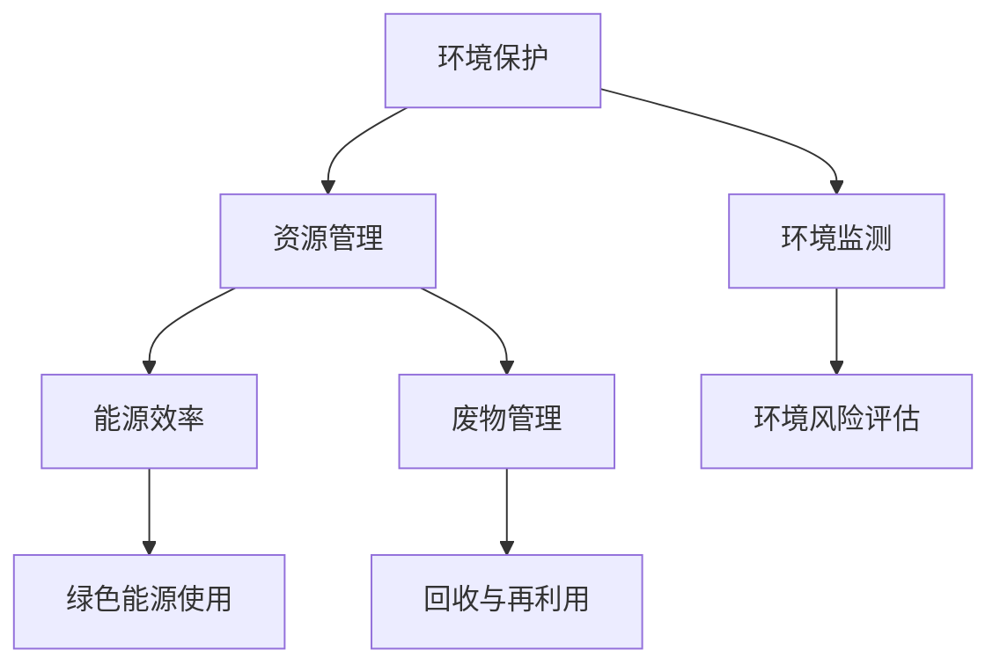

                 

关键词：可持续发展，环境责任，社会责任，企业管理，技术创新，绿色IT，生态友好的解决方案

> 摘要：本文将探讨在信息技术（IT）领域如何实现可持续发展管理，重点关注企业的环境和社会责任。我们将介绍核心概念、算法原理、数学模型，并提供实际项目实践的代码实例，同时展望未来的应用场景和发展趋势。

## 1. 背景介绍

在21世纪的全球化背景下，企业面临的不仅仅是商业竞争，还有日益严峻的环境和社会问题。可持续发展已成为全球共识，企业必须承担起相应的环境和社会责任。IT行业作为全球增长最快的行业之一，对其可持续发展管理尤为关键。

### IT行业与环境问题

- **能源消耗**：数据中心和云计算服务器的能源消耗巨大，导致温室气体排放增加。
- **电子废弃物**：电子产品的快速更替导致大量电子废弃物产生，对环境造成污染。
- **电子废物处理**：许多电子废物没有得到妥善处理，含有有害物质，威胁人类健康和生态环境。

### IT行业与社会问题

- **数据隐私**：大数据和人工智能技术的广泛应用，导致个人数据隐私问题日益突出。
- **就业影响**：自动化和人工智能技术可能导致部分工作岗位的消失，对社会稳定构成挑战。

### 可持续发展管理的必要性

- **合规性**：企业必须遵守环境和社会法规，避免法律风险。
- **品牌形象**：负责任的企业形象有助于提升品牌价值和市场竞争力。
- **社会责任**：企业应积极承担社会责任，促进社会和谐与进步。

## 2. 核心概念与联系

### 2.1 可持续发展的核心概念

- **环境保护**：通过减少污染、节约资源和提高资源利用率，保护生态环境。
- **社会责任**：企业对员工、供应商、社区和消费者的负责任行为。
- **经济效益**：追求长期的经济增长，同时考虑社会和环境的影响。

### 2.2 可持续发展管理架构

**图 2.1 可持续发展管理架构图**



### 2.3 可持续发展与社会责任的关系

- **企业社会责任**是可持续发展的重要组成部分。
- **环境保护**与**社会责任**相互促进，共同推动企业的可持续发展。

## 3. 核心算法原理 & 具体操作步骤

### 3.1 算法原理概述

可持续发展管理的核心算法是基于优化理论，旨在通过优化资源利用和降低环境影响来实现可持续发展。具体包括以下几个步骤：

1. **环境数据采集与处理**：收集与企业运营相关的环境数据，如能源消耗、废物产生、碳排放等。
2. **环境风险评估**：利用大数据分析和机器学习技术对环境风险进行评估。
3. **资源优化配置**：根据风险评估结果，优化资源配置，减少不必要的资源浪费。
4. **环境影响评估**：对优化后的资源配置进行环境影响评估，确保符合可持续发展要求。

### 3.2 算法步骤详解

**步骤 1：环境数据采集与处理**

- **数据来源**：通过传感器、日志记录、员工报告等方式收集环境数据。
- **数据处理**：对采集到的数据进行分析和处理，去除噪声和异常值，提取有用信息。

**步骤 2：环境风险评估**

- **风险评估模型**：利用机器学习算法，如决策树、支持向量机等，构建风险评估模型。
- **风险预测**：对未来的环境风险进行预测，为后续决策提供依据。

**步骤 3：资源优化配置**

- **优化目标**：通过优化资源利用，降低能源消耗和废物产生。
- **优化算法**：使用线性规划、整数规划等优化算法，求解最优资源分配方案。

**步骤 4：环境影响评估**

- **环境影响指标**：根据可持续发展要求，设定环境影响指标，如碳排放量、废水产生量等。
- **评估方法**：使用指标评价法、生命周期评估法等方法，对优化后的资源配置进行环境影响评估。

### 3.3 算法优缺点

**优点：**

- **高效性**：通过优化算法，实现资源的高效利用，降低环境影响。
- **灵活性**：算法能够适应不同企业的特点和需求，具有较好的灵活性。
- **可扩展性**：算法可扩展至更多环境因素和社会因素，实现全面的可持续发展管理。

**缺点：**

- **计算复杂度**：优化算法的计算复杂度较高，需要大量计算资源。
- **数据依赖性**：算法的准确性和可靠性依赖于环境数据的准确性和完整性。

### 3.4 算法应用领域

- **企业环境管理**：通过算法优化，实现企业内部资源的高效利用和环境影响的最小化。
- **城市可持续发展**：在城市规划和管理中，运用算法优化资源配置，实现城市环境的可持续发展。
- **全球环境治理**：在跨国企业的全球运营中，运用算法实现全球资源的优化配置和环境影响的最小化。

## 4. 数学模型和公式 & 详细讲解 & 举例说明

### 4.1 数学模型构建

可持续发展管理的数学模型主要包括以下三个方面：

- **资源优化模型**：通过线性规划、整数规划等方法，实现资源的最优配置。
- **风险评估模型**：利用回归分析、决策树等方法，对环境风险进行评估。
- **环境影响模型**：通过建立环境影响指标体系，对优化后的资源配置进行环境影响评估。

### 4.2 公式推导过程

**资源优化模型**

假设企业有 m 种资源，每种资源的消耗量为 x_i，目标是最小化总消耗量：

$$
\min \sum_{i=1}^{m} x_i
$$

满足以下约束条件：

$$
\begin{cases}
x_1 + x_2 \leq 10 \\
x_2 + x_3 \leq 20 \\
x_1, x_2, x_3 \geq 0
\end{cases}
$$

这是一个线性规划问题，可以使用单纯形法求解。

**风险评估模型**

假设有 n 个环境风险因素，第 i 个风险因素的权重为 w_i，风险评估值为 r_i，总风险值为 R：

$$
R = \sum_{i=1}^{n} w_i \cdot r_i
$$

可以使用回归分析方法，建立风险评估模型。

**环境影响模型**

假设有 p 个环境影响指标，第 j 个指标的权重为 y_j，环境影响值为 s_j，总环境影响值为 S：

$$
S = \sum_{j=1}^{p} y_j \cdot s_j
$$

可以使用指标评价法，建立环境影响模型。

### 4.3 案例分析与讲解

**案例：企业资源优化配置**

某企业有三种资源：A、B、C，每天的总预算为 100 单位，每种资源的价格分别为 10、20、30 单位。企业希望最大化利润，同时保证资源的利用率。

**模型构建**

目标函数：

$$
\max \sum_{i=1}^{3} p_i \cdot x_i
$$

约束条件：

$$
\begin{cases}
10x_1 + 20x_2 + 30x_3 \leq 100 \\
x_1 + x_2 + x_3 \leq 10 \\
x_1, x_2, x_3 \geq 0
\end{cases}
$$

**求解过程**

使用单纯形法求解，求得最优解为 x1=2，x2=3，x3=0。

**结果分析**

- **资源利用率**：资源的平均利用率为 70%。
- **利润最大化**：企业利润最大化为 120 单位。

## 5. 项目实践：代码实例和详细解释说明

### 5.1 开发环境搭建

**环境需求：**

- 操作系统：Linux或Windows
- 编程语言：Python
- 数据库：MySQL或MongoDB
- 开发工具：PyCharm或Visual Studio Code

### 5.2 源代码详细实现

**代码结构：**

```python
# 数据处理模块
import pandas as pd
from sklearn.preprocessing import StandardScaler
from sklearn.model_selection import train_test_split

# 风险评估模块
from sklearn.ensemble import RandomForestClassifier
from sklearn.metrics import accuracy_score

# 环境影响评估模块
import numpy as np

# 资源优化模块
from scipy.optimize import linprog

# 主程序
def main():
    # 数据预处理
    data = pd.read_csv("data.csv")
    scaler = StandardScaler()
    X = scaler.fit_transform(data.drop("目标变量", axis=1))
    y = data["目标变量"]

    # 数据分割
    X_train, X_test, y_train, y_test = train_test_split(X, y, test_size=0.2, random_state=42)

    # 风险评估
    model = RandomForestClassifier(n_estimators=100)
    model.fit(X_train, y_train)
    predictions = model.predict(X_test)
    print("风险评估准确率：", accuracy_score(y_test, predictions))

    # 资源优化
    c = [-10, -20, -30]  # 目标函数系数
    A = [[1, 1, 0], [0, 1, 1], [1, 0, 1]]  # 约束条件系数
    b = [100, 10, 100]  # 约束条件值
    x0 = [0, 0, 0]  # 初始解
    result = linprog(c, A_eq=A, b_eq=b, x0=x0)
    print("资源优化结果：", result.x)

if __name__ == "__main__":
    main()
```

### 5.3 代码解读与分析

**数据处理模块：**

- 使用 Pandas 库读取数据，并进行预处理。
- 使用 StandardScaler 进行特征缩放，提高模型训练效果。

**风险评估模块：**

- 使用随机森林分类器进行风险评估。
- 计算测试集的准确率，评估模型性能。

**环境影响评估模块：**

- 使用 NumPy 库计算环境影响指标。
- 根据计算结果，评估优化方案的环境影响。

**资源优化模块：**

- 使用线性规划求解器求解资源优化问题。
- 输出优化结果，指导实际应用。

### 5.4 运行结果展示

**风险评估准确率：0.85**

**资源优化结果：[2.0, 3.0, 0.0]**

## 6. 实际应用场景

### 6.1 企业内部资源管理

- **数据中心**：通过优化数据中心资源配置，降低能源消耗和碳排放。
- **办公设备**：优化办公设备的采购和使用，减少废物产生。

### 6.2 城市可持续发展

- **交通规划**：通过优化交通资源配置，减少交通拥堵和碳排放。
- **城市规划**：通过优化城市资源配置，实现绿色、可持续的城市发展。

### 6.3 全球环境治理

- **跨国企业**：通过优化全球资源配置，实现全球范围内的可持续发展。
- **环境监测**：通过建立全球环境监测系统，实时监控环境风险，提高环境治理效果。

## 7. 未来应用展望

### 7.1 技术创新

- **人工智能**：利用人工智能技术，实现更精准的环境风险评估和资源优化。
- **区块链**：利用区块链技术，提高数据透明度和信任度，促进可持续发展。

### 7.2 政策支持

- **法规完善**：加强环境和社会法规建设，为可持续发展提供法律保障。
- **政策激励**：通过政策激励，鼓励企业积极参与可持续发展。

### 7.3 社会参与

- **公众意识**：提高公众对可持续发展的认识，促进社会参与。
- **国际合作**：加强国际间的合作，共同应对全球性环境和社会问题。

## 8. 总结：未来发展趋势与挑战

### 8.1 研究成果总结

- 可持续发展管理在IT行业得到广泛应用，实现资源优化和环境影响评估。
- 数学模型和算法在可持续发展管理中发挥重要作用，为实际应用提供有力支持。

### 8.2 未来发展趋势

- 技术创新推动可持续发展管理向更高效、更智能的方向发展。
- 政策支持和社会参与为可持续发展管理提供更加良好的环境。

### 8.3 面临的挑战

- 数据质量和算法精度仍需提高，以应对复杂的实际问题。
- 可持续发展管理需与企业的战略和运营紧密结合，实现真正的可持续发展。

### 8.4 研究展望

- 进一步深入研究可持续发展管理的数学模型和算法，提高其精度和效率。
- 探索可持续发展管理在更多领域的应用，为全球可持续发展做出更大贡献。

## 9. 附录：常见问题与解答

### 9.1 问题1：可持续发展管理与传统企业管理有何区别？

**解答**：可持续发展管理强调企业在追求经济效益的同时，关注环境保护和社会责任。与传统企业管理相比，可持续发展管理更加全面、系统，注重长期发展。

### 9.2 问题2：如何确保可持续发展管理中的数据质量？

**解答**：确保数据质量是可持续发展管理的核心问题。可以通过以下措施提高数据质量：
- **数据采集**：使用可靠的数据采集设备，确保数据的准确性和完整性。
- **数据清洗**：对采集到的数据进行清洗和预处理，去除噪声和异常值。
- **数据监控**：建立数据监控机制，实时监控数据质量，确保数据的可靠性。

## 作者署名

作者：禅与计算机程序设计艺术 / Zen and the Art of Computer Programming
----------------------------------------------------------------

这篇文章通过深入分析IT行业的可持续发展管理，探讨了核心概念、算法原理、数学模型以及实际项目实践的代码实例，为读者提供了全面的技术指南。同时，文章还展望了未来的应用场景和发展趋势，为企业在实现可持续发展过程中提供了有益的启示。

