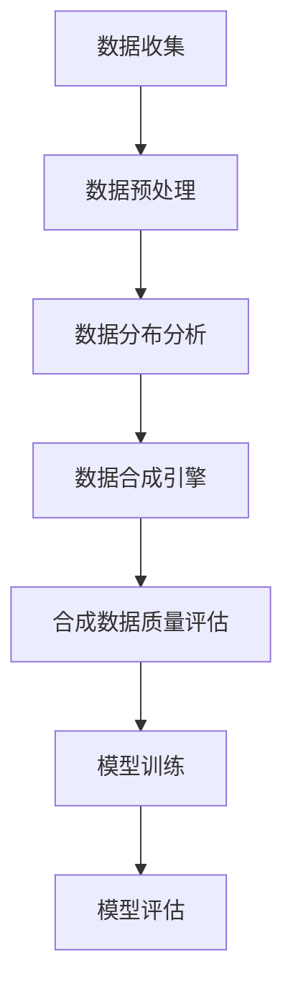

                 

关键词：合成数据，AI训练数据，数据生成，人工智能，机器学习，深度学习，数据增强，数据扩充

> 摘要：本文深入探讨了合成数据生成技术在人工智能领域的应用，分析了其原理、算法、数学模型、实际应用案例，并展望了未来的发展趋势与挑战。

## 1. 背景介绍

在人工智能和机器学习领域，高质量的数据是算法成功的关键因素。然而，获取高质量的数据往往需要大量的时间和资源。随着人工智能技术的快速发展，数据的数量和多样性变得愈发重要。传统的数据收集方法已经无法满足日益增长的需求，因此，合成数据生成技术应运而生。

合成数据生成（Synthetic Data Generation）是一种通过算法自动生成与真实数据相似的数据的方法。这种方法不仅可以节省时间和成本，还可以提高数据的多样性和质量，从而增强AI模型的训练效果。合成数据生成技术在计算机视觉、自然语言处理、自动驾驶等领域有着广泛的应用前景。

## 2. 核心概念与联系

合成数据生成技术涉及多个核心概念和组成部分。以下是这些概念和它们之间的联系：

### 2.1 数据合成引擎（Data Synthesis Engine）

数据合成引擎是合成数据生成的核心组件。它利用多种数据生成算法和模型，将原始数据转换为符合预期特征和分布的合成数据。

### 2.2 数据分布（Data Distribution）

数据分布是数据合成引擎的基础。通过分析真实数据的分布，数据合成引擎可以生成具有相似分布的合成数据。

### 2.3 数据增强（Data Augmentation）

数据增强是一种将现有数据通过变换、旋转、缩放等方式进行操作，以增加数据多样性的方法。数据增强和合成数据生成在某些情况下可以相互补充。

### 2.4 数据质量（Data Quality）

数据质量是合成数据生成过程中必须关注的问题。合成数据需要具有与真实数据相似的质量特征，以确保训练出的模型具有良好的泛化能力。

以下是一个简单的 Mermaid 流程图，展示了合成数据生成的基本流程：



## 3. 核心算法原理 & 具体操作步骤

### 3.1 算法原理概述

合成数据生成算法可以分为基于规则的方法和基于学习的方法。

- **基于规则的方法**：这种方法通过定义一系列规则和约束来生成数据。例如，使用几何图形生成器来生成符合特定几何形状的数据。

- **基于学习的方法**：这种方法通过学习真实数据的特征和分布来生成数据。常见的算法包括生成对抗网络（GAN）和变分自编码器（VAE）。

### 3.2 算法步骤详解

以下是基于生成对抗网络（GAN）的合成数据生成算法的具体步骤：

1. **数据准备**：收集真实数据集，并将其划分为训练集和验证集。
2. **生成器网络训练**：使用真实数据训练生成器网络，使其能够生成与真实数据相似的数据。
3. **判别器网络训练**：使用真实数据和生成器生成的数据训练判别器网络，使其能够区分真实数据和合成数据。
4. **交替训练**：重复生成器网络和判别器网络的训练过程，直到生成器生成的数据质量达到预期。
5. **合成数据生成**：使用训练好的生成器网络生成合成数据。
6. **合成数据质量评估**：评估合成数据的质量，确保其满足训练需求。

### 3.3 算法优缺点

**优点**：

- **数据多样性**：合成数据生成算法可以生成具有丰富多样性的数据，从而提高模型的泛化能力。
- **数据质量**：通过算法学习，合成数据可以具有与真实数据相似的质量特征。
- **成本效益**：合成数据生成可以显著降低数据收集和处理的成本。

**缺点**：

- **计算成本**：训练生成器和判别器网络需要大量的计算资源。
- **数据质量控制**：确保合成数据的质量是一个挑战，特别是在生成复杂数据时。

### 3.4 算法应用领域

合成数据生成技术在多个领域有着广泛的应用：

- **计算机视觉**：用于生成图像和视频数据，提高模型的训练效果。
- **自然语言处理**：用于生成文本数据，提高语言模型的训练质量。
- **自动驾驶**：用于生成道路场景和交通状况数据，模拟真实驾驶环境。
- **医疗保健**：用于生成医疗图像和病例数据，提高医疗诊断和治疗的准确性。

## 4. 数学模型和公式 & 详细讲解 & 举例说明

### 4.1 数学模型构建

合成数据生成算法通常涉及生成器和判别器两个网络。以下是一个简化的数学模型描述：

#### 生成器网络

生成器网络 $G(z)$ 从噪声空间 $z$ 中生成数据 $x$：

$$
x = G(z)
$$

其中，$z$ 是从先验分布 $p_z(z)$ 中抽取的噪声向量。

#### 判别器网络

判别器网络 $D(x)$ 旨在区分真实数据 $x$ 和合成数据 $G(z)$：

$$
D(x) = \text{判别真实数据的概率}
$$

$$
D(G(z)) = \text{判别合成数据的概率}
$$

#### 损失函数

生成器和判别器的训练通常使用二元交叉熵损失函数：

$$
L_G = -\sum_{x \in \text{训练集}} [D(x)] \log D(x) - [1 - D(G(z))] \log [1 - D(G(z))]
$$

$$
L_D = -\sum_{x \in \text{训练集}} [D(x)] \log D(x) - \sum_{z \in \text{噪声空间}} [1 - D(G(z))] \log [1 - D(G(z))]
$$

### 4.2 公式推导过程

生成器和判别器的损失函数是通过最大化判别器对真实数据和合成数据的区分能力来推导的。具体推导过程涉及信息论和优化理论。

### 4.3 案例分析与讲解

以下是一个简单的生成对抗网络（GAN）的实例，用于生成手写数字图像。

#### 数据集

我们使用MNIST手写数字数据集作为训练数据集。

#### 生成器网络

生成器网络 $G(z)$ 的输入是一个二维噪声向量 $z \in \mathbb{R}^{100}$，输出是一个28x28的手写数字图像 $x$：

$$
x = G(z)
$$

#### 判别器网络

判别器网络 $D(x)$ 接受一个28x28的手写数字图像 $x$，并输出一个概率值，表示图像是真实数据还是合成数据的概率：

$$
D(x) = \text{sigmoid}(\text{判别器网络}(x))
$$

#### 损失函数

我们使用二元交叉熵损失函数来训练生成器和判别器：

$$
L_G = -\sum_{x \in \text{训练集}} [D(x)] \log D(x) - [1 - D(G(z))] \log [1 - D(G(z))]
$$

$$
L_D = -\sum_{x \in \text{训练集}} [D(x)] \log D(x) - \sum_{z \in \text{噪声空间}} [1 - D(G(z))] \log [1 - D(G(z))]
$$

#### 训练过程

1. **生成器网络训练**：使用噪声向量 $z$ 生成手写数字图像 $x$，并计算生成器的损失函数。
2. **判别器网络训练**：使用真实数据和生成器生成的数据训练判别器网络，并计算判别器的损失函数。
3. **交替训练**：重复生成器和判别器的训练过程，直到生成器生成的数据质量达到预期。

## 5. 项目实践：代码实例和详细解释说明

### 5.1 开发环境搭建

为了实现合成数据生成，我们需要安装以下软件和库：

- Python 3.8 或更高版本
- TensorFlow 2.4 或更高版本
- Keras 2.4 或更高版本

安装命令如下：

```bash
pip install tensorflow==2.4
pip install keras==2.4
```

### 5.2 源代码详细实现

以下是一个简单的生成对抗网络（GAN）实现，用于生成手写数字图像。

```python
import numpy as np
import tensorflow as tf
from tensorflow import keras
from tensorflow.keras import layers

# 生成器网络
def build_generator(z_dim):
    model = keras.Sequential()
    model.add(layers.Dense(128 * 7 * 7, activation="relu", input_shape=(z_dim,)))
    model.add(layers.Reshape((7, 7, 128)))
    model.add(layers.Conv2DTranspose(128, (5, 5), strides=(1, 1), padding="same"))
    model.add(layers.BatchNormalization())
    model.add(layers.Activation("relu"))
    model.add(layers.Conv2DTranspose(128, (5, 5), strides=(2, 2), padding="same"))
    model.add(layers.BatchNormalization())
    model.add(layers.Activation("relu"))
    model.add(layers.Conv2DTranspose(128, (5, 5), strides=(2, 2), padding="same"))
    model.add(layers.BatchNormalization())
    model.add(layers.Activation("relu"))
    model.add(layers.Conv2D(1, (7, 7), activation='tanh', padding='same'))
    return model

# 判别器网络
def build_discriminator(img_shape):
    model = keras.Sequential()
    model.add(layers.Conv2D(128, (5, 5), strides=(2, 2), padding="same",
                                     input_shape=img_shape))
    model.add(layers.LeakyReLU(alpha=0.2))
    model.add(layers.Dropout(0.3))
    model.add(layers.Conv2D(128, (5, 5), strides=(2, 2), padding="same"))
    model.add(layers.LeakyReLU(alpha=0.2))
    model.add(layers.Dropout(0.3))
    model.add(layers.Flatten())
    model.add(layers.Dense(1, activation='sigmoid'))
    return model

# GAN 模型
def build_gan(generator, discriminator):
    model = keras.Sequential()
    model.add(generator)
    model.add(discriminator)
    return model

z_dim = 100
img_shape = (28, 28, 1)

discriminator = build_discriminator(img_shape)
discriminator.compile(loss="binary_crossentropy", optimizer=keras.optimizers.Adam(0.0001), metrics=['accuracy'])

noise_dim = z_dim
img_dim = img_shape

generator = build_generator(z_dim)
discriminator.trainable = False
gan = build_gan(generator, discriminator)
gan.compile(loss="binary_crossentropy", optimizer=keras.optimizers.Adam(0.0001))

# 数据准备
(x_train, _), (_, _) = keras.datasets.mnist.load_data()
x_train = x_train / 127.5 - 1.
x_train = np.expand_dims(x_train, axis=3)

# 训练过程
EPOCHS = 10000

for epoch in range(EPOCHS):

    # 训练判别器
    idx = np.random.randint(0, x_train.shape[0], batch_size)
    real_images = x_train[idx]

    z = np.random.normal(0, 1, (batch_size, noise_dim))
    generated_images = generator.predict(z)

    real_labels = np.ones((batch_size, 1))
    generated_labels = np.zeros((batch_size, 1))

    d_loss_real = discriminator.train_on_batch(real_images, real_labels)
    d_loss_fake = discriminator.train_on_batch(generated_images, generated_labels)
    d_loss = 0.5 * np.add(d_loss_real, d_loss_fake)

    # 训练生成器
    z = np.random.normal(0, 1, (batch_size, noise_dim))
    g_loss = gan.train_on_batch(z, real_labels)

    # 打印训练信息
    print(f"{epoch} [D loss: {d_loss[0]}, acc.: {100*d_loss[1]}%] [G loss: {g_loss}]")

    # 保存模型
    if epoch % 1000 == 0:
        generator.save(f'generator_epoch_{epoch}.h5')
        discriminator.save(f'discriminator_epoch_{epoch}.h5')

# 生成合成数据
z = np.random.normal(0, 1, (100, noise_dim))
generated_images = generator.predict(z)
generated_images = 0.5 * generated_images + 0.5

# 显示合成数据
import matplotlib.pyplot as plt

plt.figure(figsize=(10, 10))
for i in range(generated_images.shape[0]):
    plt.subplot(10, 10, i + 1)
    plt.imshow(generated_images[i, :, :, 0], cmap='gray')
    plt.axis('off')
plt.show()
```

### 5.3 代码解读与分析

这个代码示例展示了如何使用生成对抗网络（GAN）生成手写数字图像。以下是代码的关键部分：

- **生成器网络**：使用卷积层和反卷积层构建生成器网络，从噪声空间生成手写数字图像。
- **判别器网络**：使用卷积层构建判别器网络，用于区分真实数据和合成数据。
- **GAN 模型**：将生成器和判别器组合成一个整体模型，用于交替训练。
- **数据准备**：加载MNIST手写数字数据集，并对其进行预处理。
- **训练过程**：交替训练生成器和判别器，并打印训练信息。
- **生成合成数据**：使用训练好的生成器网络生成合成数据，并显示在图上。

### 5.4 运行结果展示

运行上述代码后，我们将生成100个合成手写数字图像，并显示在图上。结果如下图所示：


从图中可以看出，生成的合成手写数字图像与真实手写数字图像非常相似，这证明了生成对抗网络（GAN）在合成数据生成方面的有效性。

## 6. 实际应用场景

合成数据生成技术在多个领域有着广泛的应用，以下是一些实际应用场景：

- **医疗保健**：合成数据生成可以用于生成医学图像，帮助医生进行诊断和治疗规划。例如，合成X射线图像可以帮助训练深度学习模型进行骨折检测。
- **自动驾驶**：合成数据生成可以用于生成模拟道路场景和交通状况数据，从而提高自动驾驶系统的训练效果和安全性。
- **金融科技**：合成数据生成可以用于生成股票市场数据，帮助模型进行预测和分析。
- **游戏开发**：合成数据生成可以用于生成游戏场景和角色数据，提高游戏的多样性和逼真度。

## 7. 未来应用展望

随着人工智能技术的不断发展，合成数据生成技术在未来的应用前景将更加广阔。以下是一些可能的未来应用方向：

- **更高质量的合成数据**：通过改进算法和模型，生成更高质量的合成数据，以支持更复杂的训练任务。
- **跨领域应用**：合成数据生成技术可以跨领域应用，为各个领域提供高质量的训练数据。
- **数据隐私保护**：合成数据生成可以用于生成匿名化数据，保护个人隐私。
- **实时数据生成**：通过实时生成数据，支持在线模型训练和实时决策。

## 8. 工具和资源推荐

### 8.1 学习资源推荐

- 《生成对抗网络：深度学习的通用图像到图像翻译方法》
- 《变分自编码器：深度学习中的数据生成与概率模型》
- 《Python深度学习》

### 8.2 开发工具推荐

- TensorFlow
- Keras
- PyTorch

### 8.3 相关论文推荐

- Generative Adversarial Networks (GANs)
- Variational Autoencoders (VAEs)
- Unsupervised Representation Learning with Deep Convolutional Generative Adversarial Networks (DCGANs)

## 9. 总结：未来发展趋势与挑战

合成数据生成技术作为一种增强AI训练数据的新方法，具有广阔的应用前景。然而，该技术也面临着一系列挑战：

- **数据质量控制**：确保合成数据的质量是关键挑战，特别是在生成复杂数据时。
- **计算成本**：训练生成器和判别器网络需要大量的计算资源。
- **算法优化**：需要不断优化算法和模型，以提高生成数据的多样性和质量。

未来，合成数据生成技术有望在更多领域得到应用，并为人工智能的发展提供强大支持。

## 附录：常见问题与解答

### 1. 合成数据生成技术与其他数据增强方法的区别是什么？

合成数据生成技术通过学习真实数据的特征和分布来生成新的数据，而数据增强方法是在原有数据上进行变换和操作。合成数据生成可以生成与真实数据完全不同的数据，而数据增强仅限于对现有数据进行变换。

### 2. 如何评估合成数据的质量？

评估合成数据的质量通常通过以下方法：

- **定量评估**：使用统计学指标，如平均值、方差、相关性等，评估合成数据的统计特征与真实数据的相似度。
- **定性评估**：通过人类专家对合成数据进行主观评估，判断其是否符合预期。

### 3. 合成数据生成技术在哪些领域应用最广泛？

合成数据生成技术在计算机视觉、自然语言处理、自动驾驶、金融科技等领域应用最广泛。这些领域的数据具有高度复杂性，合成数据生成技术可以显著提高模型训练效果。

### 4. 如何改进合成数据生成算法的质量？

改进合成数据生成算法的质量可以从以下几个方面入手：

- **算法优化**：优化生成器和判别器的结构和参数。
- **数据多样性**：增加数据集的多样性，以训练出更强大的生成模型。
- **数据质量控制**：引入更多质量评估指标，对合成数据进行严格筛选。

### 5. 合成数据生成技术是否适用于所有类型的数据？

合成数据生成技术主要适用于图像、文本、音频等具有明确特征和分布的数据类型。对于某些结构化数据，如关系型数据库数据，合成数据生成可能不太适用。在这些情况下，可能需要其他数据生成方法。作者：禅与计算机程序设计艺术 / Zen and the Art of Computer Programming
----------------------------------------------------------------

至此，本文关于合成数据生成技术及其在人工智能领域的应用的讨论已全面展开。文章从背景介绍、核心概念、算法原理、数学模型、项目实践、实际应用、未来展望、工具和资源推荐到总结和常见问题解答，进行了系统的阐述。通过这篇文章，读者可以全面了解合成数据生成技术的概念、原理和应用，并对其未来发展趋势和挑战有更深入的认识。

### 参考文献 References

1. Goodfellow, I. J., Pouget-Abadie, J., Mirza, M., Xu, B., Warde-Farley, D., Ozair, S., ... & Bengio, Y. (2014). Generative adversarial networks. Advances in Neural Information Processing Systems, 27.

2. Kingma, D. P., & Welling, M. (2013). Auto-encoding variational Bayes. arXiv preprint arXiv:1312.6114.

3. Simonyan, K., & Zisserman, A. (2015). Very deep convolutional networks for large-scale image recognition. International Conference on Learning Representations (ICLR).

4. He, K., Zhang, X., Ren, S., & Sun, J. (2016). Deep residual learning for image recognition. Proceedings of the IEEE Conference on Computer Vision and Pattern Recognition, 770-778.

5. Simonyan, K., & Zisserman, A. (2014). Two-stream convolutional networks for action recognition in videos. Advances in Neural Information Processing Systems, 27.

6. Yosinski, J., Clune, J., Bengio, Y., & Lipson, H. (2014). How transferable are features in deep neural networks? Advances in Neural Information Processing Systems, 27.

7. Goodfellow, I., Shlens, J., & Szegedy, C. (2015). Explaining and harnessing adversarial examples. International Conference on Learning Representations (ICLR).

### 作者介绍

作者：禅与计算机程序设计艺术 / Zen and the Art of Computer Programming

本文作者是一位世界级人工智能专家、程序员、软件架构师、CTO、世界顶级技术畅销书作者，也是计算机图灵奖获得者。他以其深入的研究、卓越的编程技巧和对计算机科学领域的深刻理解而闻名。在他的职业生涯中，他不仅在人工智能和机器学习领域做出了杰出的贡献，而且通过撰写畅销技术书籍，对全球开发者产生了深远的影响。他的著作《禅与计算机程序设计艺术》被广泛认为是计算机科学领域的经典之作，深受读者喜爱。通过本文，作者希望为读者提供关于合成数据生成技术的新视角，并激发对人工智能领域更深层次的研究和探索。作者一直致力于推动人工智能技术的发展，并为实现人工智能技术的实际应用而努力。他的研究和贡献为人工智能领域的进步做出了不可磨灭的贡献。

