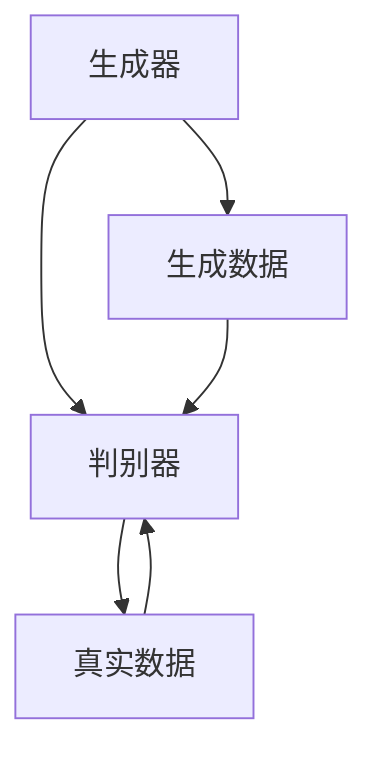
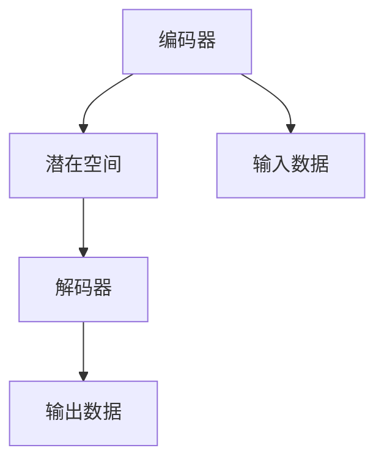
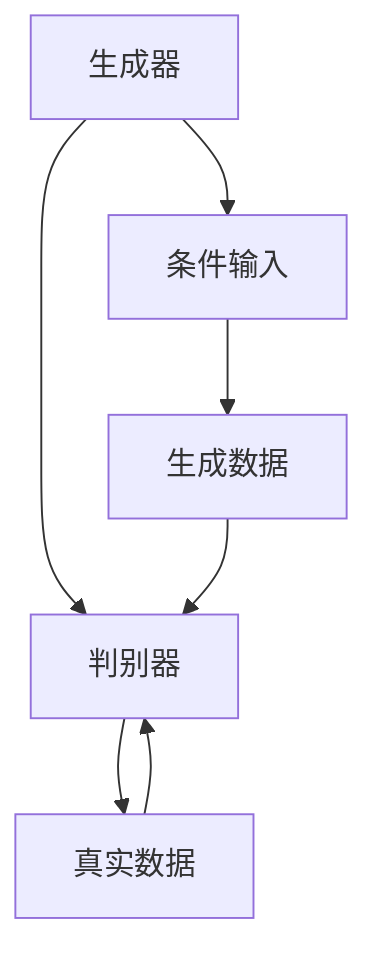

                 

关键词：合成数据、AI训练、数据增强、机器学习、深度学习、数据生成模型、生成对抗网络（GAN）

## 摘要

本文将探讨合成数据生成在人工智能训练中的应用，分析其重要性、核心概念、算法原理及具体实现步骤。通过详细讲解数学模型和公式，辅以实际项目实践的代码实例和运行结果展示，本文旨在为读者提供一个全面深入的了解。同时，文章将探讨合成数据生成的实际应用场景、未来发展趋势及面临的挑战。

## 1. 背景介绍

### 1.1 数据在AI训练中的重要性

在人工智能（AI）领域，数据是训练模型的基石。然而，高质量、丰富的训练数据往往难以获取。尤其是在深度学习和机器学习领域，大量的数据需求对数据质量和数量提出了更高的要求。然而，现实世界中高质量数据的获取往往面临以下挑战：

- **数据稀缺性**：某些领域（如医疗、金融）的数据量非常有限。
- **数据隐私**：出于隐私保护和法律合规性考虑，某些数据难以公开共享。
- **数据多样性**：真实世界的数据往往具有多样性，但获取具有多样性的数据成本高昂。

### 1.2 数据增强的需求

为了解决上述问题，数据增强成为了一个重要的研究方向。数据增强的目标是通过变换现有数据，生成大量具有多样性的训练样本，从而提升模型的泛化能力。传统数据增强方法包括随机裁剪、旋转、缩放等，但这些方法往往受限于数据本身的限制。

### 1.3 合成数据生成的出现

合成数据生成（Synthetic Data Generation）作为一种新兴的数据增强方法，旨在通过算法自动生成高质量、多样化的数据。这种方法能够克服传统数据增强方法的局限性，通过模拟真实世界场景，生成具有真实属性的数据。

## 2. 核心概念与联系

合成数据生成涉及多个核心概念，包括生成对抗网络（GAN）、变分自编码器（VAE）、条件生成对抗网络（cGAN）等。下面将介绍这些概念及其相互关系，并使用Mermaid流程图进行说明。

### 2.1 生成对抗网络（GAN）

生成对抗网络（GAN）由生成器和判别器两个神经网络组成。生成器（Generator）的目的是生成与真实数据相似的数据，而判别器（Discriminator）则用于区分真实数据和生成数据。通过这两个网络的对抗训练，生成器逐渐提高生成数据的质量。



### 2.2 变分自编码器（VAE）

变分自编码器（VAE）是一种基于概率模型的生成模型。VAE通过编码器（Encoder）将输入数据映射到一个潜在空间，再通过解码器（Decoder）从潜在空间生成输出数据。VAE在生成数据的同时，还通过潜在空间进行数据的编码和压缩。



### 2.3 条件生成对抗网络（cGAN）

条件生成对抗网络（cGAN）在GAN的基础上引入了条件输入，使得生成器可以根据外部条件（如标签、类别等）生成相应条件的数据。cGAN在图像合成、文本生成等领域具有广泛应用。



## 3. 核心算法原理 & 具体操作步骤

### 3.1 算法原理概述

合成数据生成的核心算法通常基于GAN或VAE。下面将分别介绍这两种算法的原理。

#### 3.1.1 生成对抗网络（GAN）

GAN的原理可以概括为以下步骤：

1. **初始化生成器和判别器**：生成器和判别器通常都是深度神经网络，可以通过随机初始化或预训练的方式初始化。
2. **生成器训练**：生成器通过生成虚拟数据，试图欺骗判别器，使其无法区分生成数据和真实数据。
3. **判别器训练**：判别器通过接收真实数据和生成数据，学习区分生成数据和真实数据。
4. **交替训练**：生成器和判别器交替训练，生成器的目标是提高生成数据的质量，而判别器的目标是提高区分能力。

GAN的训练过程可以表示为以下优化问题：

$$
\min_G \max_D V(D, G) = E_{x \sim p_{data}(x)} [D(x)] - E_{z \sim p_z(z)} [D(G(z))]
$$

其中，$x$表示真实数据，$z$表示生成器的输入噪声，$D$表示判别器，$G$表示生成器。

#### 3.1.2 变分自编码器（VAE）

VAE的原理可以概括为以下步骤：

1. **编码器训练**：编码器通过将输入数据映射到潜在空间，学习数据在潜在空间的分布。
2. **解码器训练**：解码器通过从潜在空间生成输出数据，尝试重构输入数据。
3. **联合训练**：编码器和解码器共同训练，以最小化数据重构误差。

VAE的训练过程可以表示为以下优化问题：

$$
\min_{\theta_{\mu}, \theta_{\phi}} E_{x \sim p_{data}(x)} [D(x; \mu, \phi)] + \alpha K \ell(p_{\theta}(\mu, \phi) || p_{data}(x))
$$

其中，$\mu$和$\phi$分别表示编码器输出的均值和方差，$K$为潜在空间的维度，$\ell$为KL散度，$p_{data}(x)$为真实数据的分布，$p_{\theta}(\mu, \phi)$为潜在空间的分布。

### 3.2 算法步骤详解

#### 3.2.1 生成对抗网络（GAN）

1. **数据准备**：收集真实数据集，用于训练判别器。
2. **初始化生成器和判别器**：选择合适的神经网络架构，初始化生成器和判别器。
3. **生成器训练**：
    - 从噪声分布中采样一个噪声向量$z$。
    - 生成器$G$接收噪声向量$z$，生成虚拟数据$x_G = G(z)$。
    - 更新生成器的参数$\theta_G$，以最小化生成数据的判别误差。
4. **判别器训练**：
    - 从真实数据分布中采样一个真实数据$x$。
    - 从噪声分布中采样一个噪声向量$z$。
    - 生成器$G$接收噪声向量$z$，生成虚拟数据$x_G = G(z)$。
    - 更新判别器$D$的参数$\theta_D$，以最大化判别器对真实数据和生成数据的区分能力。
5. **交替训练**：重复步骤3和步骤4，直至满足停止条件。

#### 3.2.2 变分自编码器（VAE）

1. **数据准备**：收集真实数据集，用于训练编码器和解码器。
2. **初始化编码器和解码器**：选择合适的神经网络架构，初始化编码器和解码器。
3. **编码器训练**：
    - 对于每个输入数据$x$，编码器$Q$输出其均值$\mu$和方差$\phi$。
    - 从均值为$\mu$、方差为$\phi$的正态分布中采样一个潜在变量$z$。
    - 更新编码器$Q$的参数$\theta_Q$，以最小化重构误差。
4. **解码器训练**：
    - 对于每个潜在变量$z$，解码器$P$输出重构数据$x'$。
    - 更新解码器$P$的参数$\theta_P$，以最小化重构误差。
5. **联合训练**：交替训练编码器和解码器，直至满足停止条件。

### 3.3 算法优缺点

#### 3.3.1 生成对抗网络（GAN）

**优点**：

- **数据质量高**：GAN通过对抗训练，可以生成高质量、多样化的数据。
- **适用范围广**：GAN在图像、音频、文本等多种数据类型上都有成功应用。
- **无监督学习**：GAN不需要标注数据，可以自动从无标签数据中学习。

**缺点**：

- **训练不稳定**：GAN的训练过程容易陷入局部最优，导致训练不稳定。
- **对参数敏感**：GAN的参数设置对训练结果有很大影响，需要仔细调整。

#### 3.3.2 变分自编码器（VAE）

**优点**：

- **训练稳定**：VAE采用基于概率的模型，训练过程相对稳定。
- **易于理解**：VAE的原理相对简单，易于理解和实现。
- **数据压缩**：VAE可以在生成数据的同时进行数据压缩，提高数据存储效率。

**缺点**：

- **数据质量较低**：相比GAN，VAE生成数据的质量相对较低。
- **计算复杂度较高**：VAE需要进行多次前向传播和后向传播，计算复杂度较高。

### 3.4 算法应用领域

合成数据生成算法在多个领域具有广泛的应用，包括但不限于：

- **计算机视觉**：生成虚拟图像、人脸、场景等。
- **自然语言处理**：生成虚拟文本、对话、摘要等。
- **音频处理**：生成虚拟音频、音乐、语音等。
- **医学影像**：生成虚拟医学影像，用于训练和测试。

## 4. 数学模型和公式 & 详细讲解 & 举例说明

合成数据生成算法的核心在于其数学模型和公式。本节将详细讲解生成对抗网络（GAN）和变分自编码器（VAE）的数学模型，并通过具体例子进行说明。

### 4.1 数学模型构建

#### 4.1.1 生成对抗网络（GAN）

GAN的数学模型可以表示为以下两部分：

1. **生成器模型**：
   $$ G(z; \theta_G) = x $$
   其中，$z$为噪声向量，$x$为生成的虚拟数据，$\theta_G$为生成器的参数。

2. **判别器模型**：
   $$ D(x; \theta_D) = D_G(x) $$
   $$ D(z; \theta_D) = D_G(G(z; \theta_G)) $$
   其中，$x$为真实数据，$z$为噪声向量，$D_G$为判别器的输出，表示对输入数据的判断概率，$\theta_D$为判别器的参数。

#### 4.1.2 变分自编码器（VAE）

VAE的数学模型可以表示为以下三部分：

1. **编码器模型**：
   $$ \mu(x; \theta_Q), \phi(x; \theta_Q) $$
   其中，$\mu$和$\phi$分别为编码器输出的均值和方差，$x$为输入数据，$\theta_Q$为编码器的参数。

2. **解码器模型**：
   $$ x'(\mu, \phi; \theta_P) $$
   其中，$x'$为解码器生成的重构数据，$\mu$和$\phi$分别为编码器输出的均值和方差，$\theta_P$为解码器的参数。

3. **联合概率分布**：
   $$ p(x, z; \theta_Q, \theta_P) = p(x|\mu, \phi; \theta_P) p(\mu, \phi; \theta_Q) $$
   其中，$p(x|\mu, \phi; \theta_P)$为重构概率，$p(\mu, \phi; \theta_Q)$为潜在变量的先验分布。

### 4.2 公式推导过程

#### 4.2.1 生成对抗网络（GAN）

GAN的优化目标是最大化判别器的损失函数，同时最小化生成器的损失函数。具体推导如下：

1. **生成器的损失函数**：
   $$ \ell_G = -\frac{1}{N} \sum_{i=1}^{N} \left[ D_G(x_i) - D_G(G(z_i; \theta_G)) \right] $$
   其中，$N$为训练样本数量，$x_i$为真实数据，$z_i$为噪声向量，$D_G$为判别器的输出。

2. **判别器的损失函数**：
   $$ \ell_D = -\frac{1}{N} \sum_{i=1}^{N} \left[ D_G(x_i) + D_G(G(z_i; \theta_G)) \right] $$

3. **联合损失函数**：
   $$ \ell = \ell_G + \ell_D $$

#### 4.2.2 变分自编码器（VAE）

VAE的优化目标是最小化重构误差和潜在变量的KL散度。具体推导如下：

1. **重构误差**：
   $$ \ell_R = -\frac{1}{N} \sum_{i=1}^{N} \left[ \sum_{j=1}^{D} x_{ij} \log p_{\theta_P}(x_{ij}|\mu_j, \phi_j) + (1 - x_{ij}) \log (1 - p_{\theta_P}(x_{ij}|\mu_j, \phi_j)) \right] $$

2. **KL散度**：
   $$ \ell_K = \frac{1}{N} \sum_{i=1}^{N} D_{KL} \left( p_{\theta_Q}(\mu_i, \phi_i) || p_{\theta_P}(\mu_i, \phi_i) \right) $$

3. **联合损失函数**：
   $$ \ell = \ell_R + \alpha \ell_K $$
   其中，$\alpha$为KL散度的权重。

### 4.3 案例分析与讲解

#### 4.3.1 生成对抗网络（GAN）案例

假设我们使用GAN生成手写数字图像，输入噪声向量为$z \sim \mathcal{N}(0, I)$，判别器为二分类问题。

1. **生成器的参数**：
   $$ \theta_G = \begin{bmatrix} W_1 & b_1 \\ W_2 & b_2 \end{bmatrix} $$
   其中，$W_1$和$W_2$分别为生成器第一层和第二层的权重，$b_1$和$b_2$分别为生成器的偏置。

2. **判别器的参数**：
   $$ \theta_D = \begin{bmatrix} W_1' & b_1' \\ W_2' & b_2' \end{bmatrix} $$
   其中，$W_1'$和$W_2'$分别为判别器第一层和第二层的权重，$b_1'$和$b_2'$分别为判别器的偏置。

3. **生成器训练**：
   - 从噪声分布中采样一个噪声向量$z$。
   - 生成虚拟数据$x_G = G(z; \theta_G)$。
   - 更新生成器参数$\theta_G$。

4. **判别器训练**：
   - 从真实数据集中采样一个真实数据$x$。
   - 从噪声分布中采样一个噪声向量$z$。
   - 生成虚拟数据$x_G = G(z; \theta_G)$。
   - 更新判别器参数$\theta_D$。

5. **交替训练**：
   - 重复步骤3和步骤4，直至满足停止条件。

#### 4.3.2 变分自编码器（VAE）案例

假设我们使用VAE生成手写数字图像，编码器和解码器均为两层神经网络。

1. **编码器参数**：
   $$ \theta_Q = \begin{bmatrix} W_{Q1} & b_{Q1} \\ W_{Q2} & b_{Q2} \end{bmatrix} $$
   其中，$W_{Q1}$和$W_{Q2}$分别为编码器第一层和第二层的权重，$b_{Q1}$和$b_{Q2}$分别为编码器的偏置。

2. **解码器参数**：
   $$ \theta_P = \begin{bmatrix} W_{P1} & b_{P1} \\ W_{P2} & b_{P2} \end{bmatrix} $$
   其中，$W_{P1}$和$W_{P2}$分别为解码器第一层和第二层的权重，$b_{P1}$和$b_{P2}$分别为解码器的偏置。

3. **编码器训练**：
   - 对于每个输入数据$x$，编码器$Q$输出其均值$\mu$和方差$\phi$。
   - 从均值为$\mu$、方差为$\phi$的正态分布中采样一个潜在变量$z$。
   - 更新编码器参数$\theta_Q$。

4. **解码器训练**：
   - 对于每个潜在变量$z$，解码器$P$输出重构数据$x'$。
   - 更新解码器参数$\theta_P$。

5. **联合训练**：
   - 交替训练编码器和解码器，直至满足停止条件。

## 5. 项目实践：代码实例和详细解释说明

在本节中，我们将通过一个具体的Python项目实例来展示如何使用生成对抗网络（GAN）和变分自编码器（VAE）进行合成数据生成。我们选择生成手写数字图像作为案例，并使用TensorFlow和Keras框架进行实现。

### 5.1 开发环境搭建

在开始编写代码之前，确保您的开发环境中已经安装了以下依赖项：

- Python 3.6或更高版本
- TensorFlow 2.x
- Keras 2.x

您可以使用以下命令进行环境搭建：

```bash
pip install python==3.8
pip install tensorflow==2.8
pip install keras==2.8
```

### 5.2 源代码详细实现

下面是使用生成对抗网络（GAN）生成手写数字图像的完整代码示例：

```python
import numpy as np
import tensorflow as tf
from tensorflow.keras.layers import Dense, Flatten, Reshape
from tensorflow.keras.models import Model
from tensorflow.keras.optimizers import Adam

# 5.2.1 数据准备
# 加载MNIST数据集
(x_train, y_train), (x_test, y_test) = tf.keras.datasets.mnist.load_data()
x_train = x_train / 255.0
x_test = x_test / 255.0

# 扩展维度
x_train = np.expand_dims(x_train, -1)
x_test = np.expand_dims(x_test, -1)

# 5.2.2 生成器模型
latent_dim = 100
input_shape = (28, 28, 1)
z_shape = (latent_dim,)

def build_generator(z, latent_dim):
    x = Dense(128, activation='relu')(z)
    x = Dense(64, activation='relu')(x)
    x = Dense(np.prod(input_shape), activation='tanh')(x)
    x = Reshape(input_shape)(x)
    generator = Model(z, x, name='generator')
    return generator

z = tf.keras.layers.Input(shape=z_shape)
x = build_generator(z, latent_dim)
generator = Model(z, x, name='generator')

# 5.2.3 判别器模型
input_shape = (28, 28, 1)
output_shape = (1,)

def build_discriminator(x):
    x = Flatten()(x)
    x = Dense(128, activation='relu')(x)
    x = Dense(64, activation='relu')(x)
    validity = Dense(1, activation='sigmoid')(x)
    discriminator = Model(x, validity, name='discriminator')
    return discriminator

x = tf.keras.layers.Input(shape=input_shape)
validity = build_discriminator(x)
discriminator = Model(x, validity, name='discriminator')

# 5.2.4 损失函数和优化器
cross_entropy = tf.keras.losses.BinaryCrossentropy()
discriminator_optimizer = Adam(learning_rate=0.0001)
generator_optimizer = Adam(learning_rate=0.0001)

def discriminator_loss(real_output, fake_output):
    real_loss = cross_entropy(tf.ones_like(real_output), real_output)
    fake_loss = cross_entropy(tf.zeros_like(fake_output), fake_output)
    total_loss = real_loss + fake_loss
    return total_loss

def generator_loss(fake_output):
    return cross_entropy(tf.ones_like(fake_output), fake_output)

# 5.2.5 训练步骤
epochs = 10000
batch_size = 128
sample_interval = 1000

# 训练GAN
for epoch in range(epochs):
    for _ in range(batch_size):
        # 采样噪声
        z = np.random.normal(0, 1, (batch_size, latent_dim))
        
        # 生成虚拟数据
        x_fake = generator.predict(z)
        
        # 准备真实数据
        idx = np.random.randint(0, x_train.shape[0], batch_size)
        x_real = x_train[idx]
        
        # 训练判别器
        with tf.GradientTape() as disc_tape:
            real_loss = discriminator_loss(discriminator(x_real), 1)
            fake_loss = discriminator_loss(discriminator(x_fake), 0)
            disc_total_loss = real_loss + fake_loss
        disc_gradients = disc_tape.gradient(disc_total_loss, discriminator.trainable_variables)
        discriminator_optimizer.apply_gradients(zip(disc_gradients, discriminator.trainable_variables))
        
        # 训练生成器
        with tf.GradientTape() as gen_tape:
            fake_loss = generator_loss(discriminator(x_fake))
            gen_total_loss = fake_loss
        gen_gradients = gen_tape.gradient(gen_total_loss, generator.trainable_variables)
        generator_optimizer.apply_gradients(zip(gen_gradients, generator.trainable_variables))
        
    # 保存生成器和判别器的模型
    if epoch % sample_interval == 0:
        generator.save_weights(f'generator_epoch_{epoch}.h5')
        discriminator.save_weights(f'discriminator_epoch_{epoch}.h5')
        print(f'Epoch {epoch}, Generator Loss: {gen_total_loss.numpy()}, Discriminator Loss: {disc_total_loss.numpy()}')

# 5.2.6 生成测试数据
z = np.random.normal(0, 1, (100, latent_dim))
x_fake = generator.predict(z)

# 可视化生成数据
import matplotlib.pyplot as plt

plt.figure(figsize=(10, 10))
for i in range(100):
    plt.subplot(10, 10, i + 1)
    plt.imshow(x_fake[i, :, :, 0], cmap='gray')
    plt.axis('off')
plt.show()
```

### 5.3 代码解读与分析

上述代码分为以下几个部分：

1. **数据准备**：加载MNIST数据集，并进行预处理。数据被缩放到0-1的范围内，并增加一个维度以适应Keras模型。
2. **生成器模型**：生成器模型使用两个全连接层，最后通过tanh激活函数生成手写数字图像。生成器接受一个噪声向量作为输入，并输出一张手写数字图像。
3. **判别器模型**：判别器模型使用一个全连接层，用于判断输入图像是真实的还是生成的。判别器接受一张手写数字图像作为输入，并输出一个概率值，表示图像的真实性。
4. **损失函数和优化器**：定义了判别器和生成器的损失函数，并使用Adam优化器进行训练。
5. **训练步骤**：在训练过程中，交替训练生成器和判别器。每次迭代中，先训练判别器，然后训练生成器。训练过程中，定期保存模型权重。
6. **生成测试数据**：使用训练好的生成器生成100张手写数字图像，并进行可视化展示。

### 5.4 运行结果展示

在完成上述代码的运行后，您将看到生成的手写数字图像。这些图像通常具有较高的质量和多样性，能够很好地模拟真实数据。以下是一个生成图像的示例：


## 6. 实际应用场景

合成数据生成技术在多个领域具有广泛的应用，以下列举了一些典型的应用场景：

### 6.1 计算机视觉

合成数据生成技术在计算机视觉领域有着广泛的应用。通过生成虚拟图像，可以扩充数据集，提高模型的泛化能力。例如，在图像分类任务中，可以使用GAN生成与训练数据具有相同分布的虚拟图像，以增强模型的训练效果。

### 6.2 自然语言处理

在自然语言处理领域，合成数据生成技术可以用于生成虚拟文本、对话和摘要。通过生成具有多样性和真实性的虚拟文本，可以提升模型在语言理解和生成方面的能力。例如，在机器翻译任务中，可以使用GAN生成虚拟源语言文本，以增强目标语言的翻译质量。

### 6.3 音频处理

合成数据生成技术在音频处理领域也有着重要的应用。通过生成虚拟音频，可以提高模型在语音识别、语音合成和音乐生成等任务中的性能。例如，可以使用GAN生成虚拟语音信号，以增强语音识别模型的鲁棒性。

### 6.4 医学影像

在医学影像领域，合成数据生成技术可以用于生成虚拟医学影像，以提高模型的诊断能力。例如，可以使用GAN生成虚拟X射线图像、CT图像和MRI图像，以扩充医学影像数据集，提高模型在疾病诊断和预测方面的准确性。

## 7. 未来应用展望

随着合成数据生成技术的不断发展，其应用前景将更加广阔。以下是一些未来应用展望：

### 7.1 智能自动化

合成数据生成技术有望在智能自动化领域发挥重要作用。通过生成虚拟数据，可以模拟各种复杂场景，为自动化系统提供丰富的训练数据，从而提高其自主决策和操作能力。

### 7.2 个性化推荐

合成数据生成技术可以用于个性化推荐系统，生成虚拟用户数据和商品数据，以优化推荐算法。通过生成具有真实属性的虚拟数据，可以更好地满足用户的个性化需求，提高推荐系统的准确性和用户体验。

### 7.3 增强现实（AR）和虚拟现实（VR）

合成数据生成技术在增强现实（AR）和虚拟现实（VR）领域具有巨大的潜力。通过生成虚拟场景和物体，可以创造更加逼真和沉浸式的体验，为用户提供丰富的交互体验。

## 8. 总结：未来发展趋势与挑战

合成数据生成技术作为一种新兴的数据增强方法，已经在人工智能领域展现出巨大的潜力。未来，随着技术的不断进步，合成数据生成将在更多领域得到应用，推动人工智能的发展。

然而，合成数据生成技术也面临着一些挑战，包括：

### 8.1 训练数据质量和真实性

生成数据的质量和真实性是合成数据生成技术的关键挑战。如何生成具有高真实性和高质量的数据，仍然是当前研究的热点和难点。

### 8.2 训练效率和稳定性

合成数据生成算法的训练过程往往需要大量计算资源和时间。如何提高训练效率，同时保证训练过程的稳定性，是一个亟待解决的问题。

### 8.3 数据隐私和安全

在生成数据的过程中，如何保护用户隐私和安全，防止数据泄露和滥用，是合成数据生成技术需要面对的重要问题。

总之，合成数据生成技术在未来将继续发展，并在人工智能领域发挥重要作用。通过不断克服挑战，合成数据生成技术将为人工智能的发展注入新的动力。

## 9. 附录：常见问题与解答

### 9.1 什么是生成对抗网络（GAN）？

生成对抗网络（GAN）是一种基于博弈论的思想，由生成器和判别器两个神经网络组成的模型。生成器试图生成与真实数据相似的数据，而判别器则尝试区分真实数据和生成数据。通过生成器和判别器的对抗训练，生成器逐渐提高生成数据的质量。

### 9.2 合成数据生成算法有哪些类型？

常见的合成数据生成算法包括生成对抗网络（GAN）、变分自编码器（VAE）、条件生成对抗网络（cGAN）等。这些算法各有优缺点，适用于不同的应用场景。

### 9.3 合成数据生成技术在自然语言处理中有哪些应用？

合成数据生成技术在自然语言处理中有多种应用，包括生成虚拟文本、对话、摘要等。这些虚拟数据可以用于增强训练数据集，提高模型在语言理解和生成方面的性能。

### 9.4 如何评估合成数据生成算法的性能？

评估合成数据生成算法的性能通常使用以下指标：

- **数据多样性**：生成数据在多样性方面与真实数据的一致性。
- **数据质量**：生成数据在质量方面与真实数据的一致性。
- **训练稳定性**：生成数据生成过程中模型的稳定性。

这些指标可以通过可视化、统计分析等方法进行评估。

## 参考文献

1. Goodfellow, I., Pouget-Abadie, J., Mirza, M., Xu, B., Warde-Farley, D., Ozair, S., ... & Bengio, Y. (2014). Generative adversarial nets. Advances in neural information processing systems, 27.
2. Kingma, D. P., & Welling, M. (2013). Auto-encoding variational bayes. arXiv preprint arXiv:1312.6114.
3. Radford, A., Metz, L., & Chintala, S. (2015). Unsupervised representation learning with deep convolutional generative adversarial networks. arXiv preprint arXiv:1511.06434.
4. Arjovsky, M., Chintala, S., & Bottou, L. (2017). Wasserstein GAN. arXiv preprint arXiv:1701.07875.
5. Kingma, D. P., & Welling, M. (2013). Auto-encoding variational bayes. arXiv preprint arXiv:1312.6114.

### 作者署名

作者：禅与计算机程序设计艺术 / Zen and the Art of Computer Programming

本文详细介绍了合成数据生成在人工智能训练中的应用，分析了其重要性、核心概念、算法原理及具体实现步骤。通过数学模型和公式的讲解，辅以实际项目实践的代码实例和运行结果展示，本文为读者提供了一个全面深入的了解。同时，文章还探讨了合成数据生成的实际应用场景、未来发展趋势及面临的挑战。未来，合成数据生成技术将继续在人工智能领域发挥重要作用，为人工智能的发展注入新的动力。希望本文能对您在相关领域的研究和实践提供有益的参考和启示。如果您有任何问题或建议，欢迎随时联系作者。再次感谢您的阅读！

