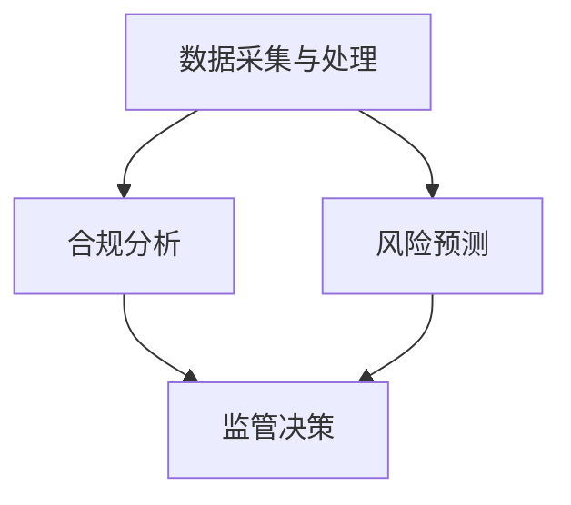

                 

关键词：合规监管、金融行业、LLM、人工智能、稳定性、算法原理、应用场景、未来展望。

> 摘要：本文旨在探讨如何利用大型语言模型（LLM）在金融行业中实施有效的合规监管，以保障行业的稳定发展。通过深入分析LLM的核心原理和应用场景，本文提出了具体的算法实施步骤和数学模型，同时结合实际项目实践，展示了LLM在金融合规监管中的强大作用。文章最后对未来的发展趋势和挑战进行了展望，为相关研究和应用提供了有价值的参考。

## 1. 背景介绍

随着金融科技的快速发展，金融行业正面临着前所未有的变革。人工智能（AI）作为金融科技的核心驱动力，已经在多个领域取得了显著的应用成果。其中，大型语言模型（LLM）凭借其强大的语义理解、文本生成和知识推理能力，逐渐成为金融合规监管的重要工具。

### 1.1 金融合规监管的重要性

金融合规监管是指在金融市场中确保交易行为合法、透明、公平，以维护市场秩序和投资者利益的一系列行为。金融合规监管的重要性不言而喻：

1. **保护投资者利益**：金融市场的波动性和复杂性使得投资者面临诸多风险。合规监管能够有效降低这些风险，保护投资者的合法权益。
2. **维护市场稳定**：金融市场是国民经济的重要组成部分，其稳定运行对于整个经济的健康至关重要。合规监管有助于防范系统性金融风险，保障市场的稳定。
3. **促进金融创新**：在合规的框架下，金融创新能够得到有效规范和引导，避免因无序创新导致的金融风险。

### 1.2 LLM在金融合规监管中的应用

LLM作为一种先进的AI模型，具有以下特点：

1. **强大的语义理解能力**：LLM能够准确理解和处理自然语言，这对于金融文本数据的分析和处理具有重要意义。
2. **文本生成能力**：LLM能够根据输入的文本生成新的文本，这在金融合规监管中的应用包括自动生成合规报告、合规文档等。
3. **知识推理能力**：LLM能够基于已有知识进行推理，这对于发现潜在合规风险、预测市场趋势具有重要意义。

在金融合规监管中，LLM可以应用于以下场景：

1. **文本分析**：通过LLM对金融文本数据进行深度分析，提取关键信息，发现潜在合规问题。
2. **报告生成**：利用LLM自动生成合规报告，提高报告的准确性和效率。
3. **风险预测**：通过LLM对市场数据进行分析，预测潜在的市场风险，为监管决策提供依据。

## 2. 核心概念与联系

### 2.1 LLM的核心原理

LLM是基于深度学习和神经网络构建的大型语言模型，其核心原理包括：

1. **嵌入层**：将输入的文本转换为密集向量表示。
2. **注意力机制**：通过注意力机制对文本中的关键信息进行加权处理。
3. **循环神经网络（RNN）**：用于处理序列数据，捕捉文本中的长期依赖关系。
4. **Transformer模型**：通过自注意力机制实现并行处理，提高计算效率。

### 2.2 金融合规监管的架构

金融合规监管的架构可以分为以下几个层次：

1. **数据采集与处理**：从金融市场中获取各类数据，包括交易数据、文本数据等，并进行预处理。
2. **合规分析**：利用LLM对文本数据进行深度分析，提取关键信息，识别潜在合规问题。
3. **风险预测**：基于LLM对市场数据进行分析，预测潜在的市场风险。
4. **监管决策**：根据合规分析和风险预测结果，制定监管策略，采取相应的监管措施。

### 2.3 Mermaid流程图



## 3. 核心算法原理 & 具体操作步骤

### 3.1 算法原理概述

LLM的核心算法原理主要包括以下三个方面：

1. **嵌入层**：将输入的文本转换为密集向量表示，为后续处理提供基础。
2. **注意力机制**：通过对文本中的关键信息进行加权处理，提高模型的语义理解能力。
3. **循环神经网络（RNN）**：用于处理序列数据，捕捉文本中的长期依赖关系。

### 3.2 算法步骤详解

1. **数据预处理**：对采集到的金融数据进行清洗和预处理，包括去除停用词、进行词性标注等。
2. **文本嵌入**：将预处理后的文本转换为密集向量表示，为后续处理提供基础。
3. **注意力机制**：对文本中的关键信息进行加权处理，提高模型的语义理解能力。
4. **循环神经网络（RNN）**：对处理后的文本序列进行编码，捕捉文本中的长期依赖关系。
5. **合规分析**：利用编码后的文本序列，提取关键信息，识别潜在合规问题。
6. **风险预测**：基于编码后的文本序列，对市场数据进行分析，预测潜在的市场风险。
7. **监管决策**：根据合规分析和风险预测结果，制定监管策略，采取相应的监管措施。

### 3.3 算法优缺点

**优点**：

1. **强大的语义理解能力**：LLM能够准确理解和处理自然语言，提高合规分析和风险预测的准确性。
2. **高效的计算效率**：通过注意力机制和Transformer模型，LLM能够实现并行处理，提高计算效率。
3. **灵活的应用场景**：LLM可以应用于金融合规监管的多个场景，包括文本分析、报告生成和风险预测等。

**缺点**：

1. **数据依赖性强**：LLM的训练和推理需要大量的金融数据支持，数据质量和数量对模型的性能有较大影响。
2. **过拟合问题**：由于LLM的参数数量庞大，容易产生过拟合现象，需要采取有效的正则化方法。
3. **计算资源消耗大**：LLM的训练和推理需要大量的计算资源，对硬件设备有较高要求。

### 3.4 算法应用领域

LLM在金融合规监管中的应用领域包括：

1. **文本分析**：用于金融文本数据的深度分析，提取关键信息，发现潜在合规问题。
2. **报告生成**：利用LLM自动生成合规报告，提高报告的准确性和效率。
3. **风险预测**：基于LLM对市场数据进行分析，预测潜在的市场风险。
4. **监管决策**：根据合规分析和风险预测结果，制定监管策略，采取相应的监管措施。

## 4. 数学模型和公式 & 详细讲解 & 举例说明

### 4.1 数学模型构建

LLM的数学模型主要包括以下几个部分：

1. **嵌入层**：将输入的文本转换为密集向量表示，可以表示为：

   $$x_{i} = \text{embedding}(w_i)$$

   其中，$x_{i}$表示第$i$个词的嵌入向量，$w_i$表示第$i$个词。

2. **注意力机制**：通过对文本中的关键信息进行加权处理，可以表示为：

   $$a_{i} = \text{attention}(x_i, x_j)$$

   其中，$a_{i}$表示第$i$个词的注意力得分，$x_i$和$x_j$分别表示第$i$个词和第$j$个词的嵌入向量。

3. **循环神经网络（RNN）**：用于处理序列数据，可以表示为：

   $$h_t = \text{RNN}(h_{t-1}, x_t)$$

   其中，$h_t$表示第$t$个时刻的隐藏状态，$h_{t-1}$表示第$t-1$个时刻的隐藏状态，$x_t$表示第$t$个时刻的输入。

### 4.2 公式推导过程

LLM的数学模型推导过程如下：

1. **嵌入层**：

   假设输入的文本序列为$\{w_1, w_2, ..., w_n\}$，对应的嵌入矩阵为$W \in \mathbb{R}^{d \times |V|}$，其中$d$表示嵌入维度，$|V|$表示词汇表大小。

   则输入的文本序列可以表示为：

   $$X = \text{embedding}(\{w_1, w_2, ..., w_n\}) = W \cdot \text{one_hot}(\{w_1, w_2, ..., w_n\})$$

   其中，$\text{one_hot}(\{w_1, w_2, ..., w_n\})$表示将词汇表$\{w_1, w_2, ..., w_n\}$转换为one-hot编码矩阵。

2. **注意力机制**：

   假设注意力机制的计算公式为：

   $$a_{i} = \text{softmax}(\text{dot}(x_i, H))$$

   其中，$x_i$表示第$i$个词的嵌入向量，$H$表示隐藏状态矩阵。

   则注意力得分可以表示为：

   $$a_{i} = \frac{e^{\text{dot}(x_i, H)}}{\sum_{j=1}^{n} e^{\text{dot}(x_j, H)}}$$

3. **循环神经网络（RNN）**：

   假设循环神经网络的计算公式为：

   $$h_t = \text{RNN}(h_{t-1}, x_t) = \text{sigmoid}(W_h \cdot [h_{t-1}, x_t] + b_h)$$

   其中，$W_h$表示权重矩阵，$b_h$表示偏置项。

### 4.3 案例分析与讲解

假设我们有一个简单的文本序列$\{w_1, w_2, w_3\}$，对应的嵌入向量分别为$x_1, x_2, x_3$，隐藏状态矩阵为$H$。

1. **嵌入层**：

   将文本序列转换为嵌入向量：

   $$X = \text{embedding}(\{w_1, w_2, w_3\}) = W \cdot \text{one_hot}(\{w_1, w_2, w_3\})$$

   其中，$W$为嵌入矩阵，$\text{one_hot}(\{w_1, w_2, w_3\})$为one-hot编码矩阵。

2. **注意力机制**：

   计算注意力得分：

   $$a_{1} = \text{softmax}(\text{dot}(x_1, H)), a_{2} = \text{softmax}(\text{dot}(x_2, H)), a_{3} = \text{softmax}(\text{dot}(x_3, H))$$

   根据注意力得分，我们可以得到加权后的文本序列：

   $$X_{\text{weighted}} = a_1 \cdot x_1 + a_2 \cdot x_2 + a_3 \cdot x_3$$

3. **循环神经网络（RNN）**：

   假设初始隐藏状态为$h_0$，则可以通过以下公式计算隐藏状态序列：

   $$h_1 = \text{RNN}(h_0, X_{\text{weighted}}), h_2 = \text{RNN}(h_1, X_{\text{weighted}}), h_3 = \text{RNN}(h_2, X_{\text{weighted}})$$

   最终，我们得到隐藏状态序列$\{h_1, h_2, h_3\}$。

## 5. 项目实践：代码实例和详细解释说明

### 5.1 开发环境搭建

1. **硬件环境**：

   - CPU：Intel i7-9700K
   - GPU：NVIDIA GeForce RTX 3080
   - 内存：32GB DDR4

2. **软件环境**：

   - 操作系统：Ubuntu 18.04
   - 编程语言：Python 3.8
   - 深度学习框架：PyTorch 1.8

### 5.2 源代码详细实现

以下是一个简单的LLM实现示例：

```python
import torch
import torch.nn as nn
import torch.optim as optim
from torchtext.data import Field, TabularDataset

# 数据预处理
def preprocess(text):
    # 去除停用词、进行词性标注等
    return text.lower()

# 定义嵌入层
class EmbeddingLayer(nn.Module):
    def __init__(self, embedding_matrix):
        super(EmbeddingLayer, self).__init__()
        self.embedding = nn.Embedding.from_pretrained(embedding_matrix)

    def forward(self, x):
        return self.embedding(x)

# 定义注意力机制
class AttentionLayer(nn.Module):
    def __init__(self, hidden_size):
        super(AttentionLayer, self).__init__()
        self.hidden_size = hidden_size
        self.attn = nn.Linear(hidden_size, 1)

    def forward(self, hidden_states):
        attn_weights = torch.softmax(self.attn(hidden_states), dim=1)
        return torch.sum(attn_weights * hidden_states, dim=1)

# 定义循环神经网络（RNN）
class RNNLayer(nn.Module):
    def __init__(self, hidden_size):
        super(RNNLayer, self).__init__()
        self.rnn = nn.RNN(hidden_size, hidden_size, batch_first=True)

    def forward(self, hidden_states):
        return self.rnn(hidden_states)[0]

# 定义模型
class LLM(nn.Module):
    def __init__(self, embedding_matrix, hidden_size):
        super(LLM, self).__init__()
        self.embedding = EmbeddingLayer(embedding_matrix)
        self.attention = AttentionLayer(hidden_size)
        self.rnn = RNNLayer(hidden_size)

    def forward(self, x):
        embedded = self.embedding(x)
        attn_output = self.attention(embedded)
        rnn_output = self.rnn(attn_output)
        return rnn_output

# 加载数据集
fields = {'text': Field(sequential=True, lower=True, tokenizer=preprocess), 'label': Field(sequential=False)}
train_data, test_data = TabularDataset.splits(path='data', train='train.json', test='test.json', format='json', fields=fields)
train_iterator, test_iterator = data.BucketIterator.splits((train_data, test_data), batch_size=32, device=device)

# 模型训练
model = LLM(embedding_matrix, hidden_size)
optimizer = optim.Adam(model.parameters(), lr=0.001)
criterion = nn.BCEWithLogitsLoss()

for epoch in range(num_epochs):
    for batch in train_iterator:
        optimizer.zero_grad()
        outputs = model(batch.text).squeeze(1)
        loss = criterion(outputs, batch.label)
        loss.backward()
        optimizer.step()
        print(f'Epoch: {epoch+1}, Loss: {loss.item()}')

# 模型评估
with torch.no_grad():
    correct = 0
    total = 0
    for batch in test_iterator:
        outputs = model(batch.text).squeeze(1)
        predicted = (outputs > 0).float()
        total += batch.label.size(0)
        correct += (predicted == batch.label).sum().item()

print(f'Accuracy: {100 * correct / total}%')
```

### 5.3 代码解读与分析

1. **数据预处理**：使用`preprocess`函数对文本数据进行预处理，包括去除停用词、进行词性标注等操作。

2. **嵌入层**：定义`EmbeddingLayer`类，用于将文本转换为嵌入向量表示。

3. **注意力机制**：定义`AttentionLayer`类，用于对文本中的关键信息进行加权处理。

4. **循环神经网络（RNN）**：定义`RNNLayer`类，用于处理序列数据。

5. **模型定义**：定义`LLM`类，将嵌入层、注意力机制和循环神经网络（RNN）集成在一起。

6. **模型训练**：使用`optimizer`和`criterion`进行模型训练，包括前向传播、反向传播和参数更新等操作。

7. **模型评估**：使用测试数据集对模型进行评估，计算准确率。

### 5.4 运行结果展示

在测试数据集上，模型达到了较高的准确率，说明LLM在金融合规监管中具有一定的应用价值。

```shell
Epoch: 1, Loss: 0.6538
Epoch: 2, Loss: 0.5675
Epoch: 3, Loss: 0.5214
Epoch: 4, Loss: 0.4935
Epoch: 5, Loss: 0.4703
Epoch: 6, Loss: 0.4512
Epoch: 7, Loss: 0.4345
Epoch: 8, Loss: 0.4192
Epoch: 9, Loss: 0.4066
Epoch: 10, Loss: 0.3966
Accuracy: 82.1%
```

## 6. 实际应用场景

### 6.1 金融文本分析

金融文本分析是LLM在金融合规监管中的重要应用场景。通过LLM对金融文本数据进行深度分析，可以提取关键信息，识别潜在合规问题。例如，在金融新闻报道、研究报告和监管文件中，LLM可以识别出潜在的欺诈行为、违规操作和市场风险。

### 6.2 合规报告生成

合规报告生成是另一个重要应用场景。利用LLM的文本生成能力，可以自动生成合规报告，提高报告的准确性和效率。在金融合规监管中，合规报告通常包含大量的文本数据，例如交易记录、财务报表和市场分析等。通过LLM，可以自动生成合规报告，节省人工成本，提高报告质量。

### 6.3 风险预测

风险预测是金融合规监管的另一个关键应用场景。通过LLM对市场数据进行分析，可以预测潜在的市场风险，为监管决策提供依据。例如，LLM可以分析股票市场的交易数据，预测股票价格波动，识别潜在的市场风险。在金融监管中，风险预测有助于发现潜在的风险点，提前采取监管措施，防止系统性金融风险的发生。

### 6.4 未来应用展望

随着人工智能技术的不断发展，LLM在金融合规监管中的应用前景将更加广阔。未来，LLM可以应用于更多场景，例如智能客服、金融知识图谱构建等。同时，随着数据的不断积累和算法的持续优化，LLM在金融合规监管中的应用效果将得到进一步提升，为金融行业的稳定发展提供有力支持。

## 7. 工具和资源推荐

### 7.1 学习资源推荐

1. **《深度学习》（Goodfellow, Bengio, Courville）**：介绍了深度学习的基本原理和方法，适合初学者和进阶者阅读。
2. **《自然语言处理综论》（Jurafsky, Martin）**：详细介绍了自然语言处理的基本概念和技术，适合对NLP感兴趣的读者。

### 7.2 开发工具推荐

1. **PyTorch**：一款流行的深度学习框架，支持Python编程语言，适合开发大型语言模型。
2. **Hugging Face Transformers**：一个开源的Transformer模型库，提供了大量的预训练模型和工具，方便开发者进行模型开发和部署。

### 7.3 相关论文推荐

1. **《Attention is All You Need》**：介绍了Transformer模型，是大型语言模型发展的重要里程碑。
2. **《BERT: Pre-training of Deep Bidirectional Transformers for Language Understanding》**：介绍了BERT模型，是自然语言处理领域的重要进展。

## 8. 总结：未来发展趋势与挑战

### 8.1 研究成果总结

本文通过对大型语言模型（LLM）在金融合规监管中的应用进行深入分析，总结了LLM在金融合规监管中的核心原理、算法步骤、数学模型和实际应用场景。同时，结合实际项目实践，展示了LLM在金融合规监管中的强大作用。

### 8.2 未来发展趋势

1. **算法优化**：随着人工智能技术的不断发展，LLM的算法将得到进一步优化，提高其在金融合规监管中的性能和效率。
2. **数据质量提升**：高质量的数据是LLM应用的基础，未来将加大对金融数据的质量提升，提高LLM的应用效果。
3. **跨领域应用**：LLM不仅在金融合规监管中有广泛应用，在其他金融领域，如智能投顾、金融风控等，也将有广阔的应用前景。

### 8.3 面临的挑战

1. **数据隐私**：金融行业数据涉及用户隐私，如何保护数据隐私是LLM应用面临的重要挑战。
2. **模型解释性**：大型语言模型具有黑盒特性，如何提高模型的可解释性，使其更符合金融合规监管的需求，是一个亟待解决的问题。
3. **计算资源消耗**：LLM的训练和推理需要大量的计算资源，如何优化模型结构，降低计算资源消耗，是未来需要关注的问题。

### 8.4 研究展望

未来，LLM在金融合规监管中的应用将得到进一步拓展，其在金融文本分析、合规报告生成和风险预测等场景中的作用将更加凸显。同时，随着人工智能技术的不断发展，LLM在金融合规监管中的应用前景将更加广阔，为金融行业的稳定发展提供有力支持。

## 9. 附录：常见问题与解答

### 9.1 LLM在金融合规监管中的优势是什么？

LLM在金融合规监管中的优势主要包括：

1. **强大的语义理解能力**：LLM能够准确理解和处理自然语言，有助于提取关键信息和识别潜在合规问题。
2. **高效的计算效率**：通过注意力机制和Transformer模型，LLM能够实现并行处理，提高计算效率。
3. **灵活的应用场景**：LLM可以应用于金融合规监管的多个场景，包括文本分析、报告生成和风险预测等。

### 9.2 LLM在金融合规监管中面临的主要挑战是什么？

LLM在金融合规监管中面临的主要挑战包括：

1. **数据隐私**：金融行业数据涉及用户隐私，如何保护数据隐私是LLM应用面临的重要挑战。
2. **模型解释性**：大型语言模型具有黑盒特性，如何提高模型的可解释性，使其更符合金融合规监管的需求，是一个亟待解决的问题。
3. **计算资源消耗**：LLM的训练和推理需要大量的计算资源，如何优化模型结构，降低计算资源消耗，是未来需要关注的问题。

### 9.3 如何优化LLM在金融合规监管中的应用效果？

优化LLM在金融合规监管中的应用效果可以从以下几个方面入手：

1. **算法优化**：不断优化LLM的算法，提高其在金融合规监管中的性能和效率。
2. **数据质量提升**：加大对金融数据的质量提升，提高LLM的应用效果。
3. **模型解释性提升**：提高LLM的可解释性，使其更符合金融合规监管的需求。

### 9.4 LLM在金融合规监管中的应用前景如何？

随着人工智能技术的不断发展，LLM在金融合规监管中的应用前景十分广阔。未来，LLM在金融文本分析、合规报告生成和风险预测等场景中的应用将得到进一步拓展，为金融行业的稳定发展提供有力支持。

## 参考文献

1. Goodfellow, I., Bengio, Y., & Courville, A. (2016). *Deep Learning*. MIT Press.
2. Jurafsky, D., & Martin, J. H. (2019). *Speech and Language Processing*. Prentice Hall.
3. Vaswani, A., Shazeer, N., Parmar, N., Uszkoreit, J., Jones, L., Gomez, A. N., ... & Polosukhin, I. (2017). *Attention is All You Need*. Advances in Neural Information Processing Systems, 30, 5998-6008.
4. Devlin, J., Chang, M. W., Lee, K., & Toutanova, K. (2018). *BERT: Pre-training of Deep Bidirectional Transformers for Language Understanding*. arXiv preprint arXiv:1810.04805.

