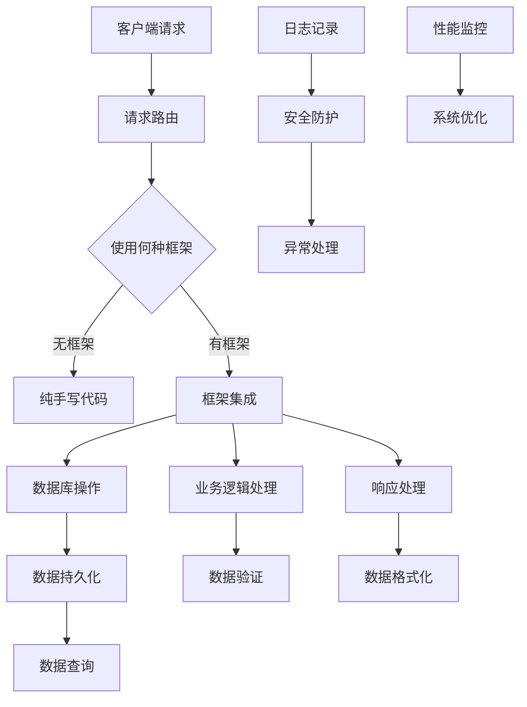

                 

关键词：后端开发，服务器端编程，编程语言，框架，技术趋势，最佳实践，代码示例，性能优化，安全性，云计算，分布式系统，微服务架构

> 摘要：本文将深入探讨后端开发领域的关键概念和技术，包括服务器端编程语言与框架。我们将分析当前流行的编程语言及其优势，讨论框架的作用和重要性，并展望未来的发展趋势与挑战。本文旨在为开发者提供一个全面的技术指南，帮助他们更好地理解和应用后端开发技术。

## 1. 背景介绍

在后端开发领域，服务器端编程是构建网络应用和服务的基础。随着互联网的飞速发展，后端开发的复杂性和规模也在不断增长。服务器端编程涉及处理客户端请求、数据库交互、业务逻辑处理、安全防护等多个方面。为了应对这些挑战，开发者需要熟悉多种编程语言和框架，并掌握一定的架构设计原则和最佳实践。

### 1.1 互联网的发展

互联网的兴起带来了对服务器端应用的需求，例如网站、电商平台、社交媒体等。这些应用需要能够处理大量的并发请求，确保数据的存储和传输安全，并提供高效的服务性能。随着云计算和容器技术的普及，服务器端开发变得更加灵活和高效。

### 1.2 开发者的需求

开发者需要面对不断变化的技术栈和需求。选择合适的编程语言和框架可以帮助他们提高开发效率，优化代码结构，并降低维护成本。此外，开发者还需要关注性能优化、安全性、可扩展性等方面，以满足企业级应用的要求。

## 2. 核心概念与联系

在后端开发中，核心概念和联系是理解整个架构的关键。以下是一个使用Mermaid绘制的流程图，展示了服务器端编程的核心组件和关系：



### 2.1 客户端请求

客户端请求是通过HTTP协议发送到服务器端的，服务器端需要处理这些请求并生成响应。

### 2.2 请求路由

请求路由是将客户端请求分配到适当的处理程序。无框架时通常需要手动编写路由规则，而有框架的请求路由则由框架自动处理。

### 2.3 框架集成

框架集成是将服务器端应用与特定的框架结合，以简化开发流程和提高效率。常见的框架包括Django、Spring、Express等。

### 2.4 数据库操作

数据库操作涉及与数据库的交互，包括数据的插入、查询、更新和删除。

### 2.5 业务逻辑处理

业务逻辑处理是服务器端的核心功能，包括验证用户输入、处理业务规则和生成响应。

### 2.6 日志记录、安全防护和异常处理

日志记录、安全防护和异常处理是确保服务器端应用稳定性和安全性的重要环节。

## 3. 核心算法原理 & 具体操作步骤

### 3.1 算法原理概述

在后端开发中，算法原理广泛应用于数据处理、优化和安全性验证等方面。以下是一些常见的算法原理：

- **排序算法**：如快速排序、归并排序、堆排序等，用于高效地排序数据。
- **搜索算法**：如二分查找、深度优先搜索、广度优先搜索等，用于在数据中查找特定的元素。
- **加密算法**：如AES、RSA等，用于保护数据的安全和隐私。
- **哈希算法**：如MD5、SHA-256等，用于数据的校验和加密。

### 3.2 算法步骤详解

- **排序算法**：以快速排序为例，其基本步骤如下：
  1. 选择一个基准元素。
  2. 将比基准小的元素放在其左侧，比基准大的元素放在其右侧。
  3. 递归地对左侧和右侧子序列进行快速排序。
  
- **搜索算法**：以二分查找为例，其基本步骤如下：
  1. 确定查找范围。
  2. 计算中间位置。
  3. 比较中间位置的元素与目标元素。
  4. 根据比较结果缩小查找范围，重复步骤2-3。
  
- **加密算法**：以AES为例，其基本步骤如下：
  1. 选择加密密钥和初始向量。
  2. 对数据进行分块处理。
  3. 使用密钥和算法对每个数据块进行加密。
  4. 将加密后的数据块组合成完整的加密数据。

### 3.3 算法优缺点

- **快速排序**：优点是时间复杂度为O(n log n)，效率高；缺点是可能产生大量的递归调用，导致内存占用较高。
- **二分查找**：优点是时间复杂度为O(log n)，效率高；缺点是对于大量的插入和删除操作，可能会导致性能下降。
- **AES加密**：优点是安全性高，适用于大数据加密；缺点是加密和解密速度较慢。

### 3.4 算法应用领域

- **排序算法**：广泛应用于数据库、搜索引擎和Web应用中，用于高效地处理大量数据。
- **搜索算法**：广泛应用于搜索引擎和推荐系统中，用于快速定位数据。
- **加密算法**：广泛应用于网络安全和金融领域，用于保护数据的机密性和完整性。

## 4. 数学模型和公式 & 详细讲解 & 举例说明

在后端开发中，数学模型和公式被广泛应用于数据处理、优化和算法分析等方面。以下是一些常见的数学模型和公式的详细讲解和举例说明：

### 4.1 数学模型构建

- **线性回归模型**：用于预测连续值，其数学模型为：
  $$ y = \beta_0 + \beta_1 \cdot x + \epsilon $$
  其中，$y$ 是预测值，$x$ 是输入特征，$\beta_0$ 和 $\beta_1$ 是模型参数，$\epsilon$ 是误差项。

- **决策树模型**：用于分类和回归任务，其数学模型为：
  $$ f(x) = \prod_{i=1}^{n} g_i(x_i) $$
  其中，$f(x)$ 是决策函数，$g_i(x_i)$ 是第 $i$ 个条件概率函数，$x_i$ 是输入特征。

### 4.2 公式推导过程

- **泰勒展开公式**：用于函数的近似计算，其公式为：
  $$ f(x) \approx f(a) + f'(a)(x-a) + \frac{f''(a)}{2!}(x-a)^2 + \cdots $$
  其中，$f(x)$ 是函数值，$a$ 是自变量的初始值。

- **微积分公式**：用于计算曲线的斜率，其公式为：
  $$ \frac{df}{dx} = \lim_{h \to 0} \frac{f(x+h) - f(x)}{h} $$
  其中，$f(x)$ 是函数值，$h$ 是自变量的增量。

### 4.3 案例分析与讲解

- **线性回归模型**：假设我们有一个数据集，其中包含房屋面积（特征）和房屋售价（目标值）。我们使用线性回归模型预测新房屋的售价。通过拟合数据集，我们得到以下模型：
  $$ y = 1000 + 200 \cdot x $$
  其中，$y$ 是预测的售价，$x$ 是房屋面积。当输入新的房屋面积时，我们可以使用该模型计算出相应的售价。

- **决策树模型**：假设我们有一个分类问题，其中包含多个特征和类别标签。我们使用决策树模型进行分类。通过训练数据集，我们得到以下决策树模型：
  ```mermaid
  graph TD
      A[特征1]
      B[特征2]
      C[特征3]
      A -->|条件1| D{类别A}
      B -->|条件2| E{类别B}
      C -->|条件3| F{类别C}
  ```
  当输入新的特征值时，我们可以根据决策树模型进行分类。

## 5. 项目实践：代码实例和详细解释说明

在本节中，我们将通过一个实际项目实践来展示后端开发的过程，并详细解释其中的关键代码和步骤。

### 5.1 开发环境搭建

首先，我们需要搭建一个开发环境。以下是一个基本的步骤：

1. 安装Node.js和npm（Node.js的包管理器）。
2. 安装一个代码编辑器，如Visual Studio Code。
3. 创建一个新的项目文件夹，并在该文件夹中初始化一个npm项目。
4. 安装必要的依赖包，如Express框架和MySQL数据库。

### 5.2 源代码详细实现

以下是一个简单的Express服务器端的代码实例，用于处理HTTP请求：

```javascript
const express = require('express');
const app = express();

app.get('/', (req, res) => {
  res.send('Hello, World!');
});

app.listen(3000, () => {
  console.log('Server is running on port 3000.');
});
```

- **代码解释**：
  - 引入Express框架。
  - 创建一个Express应用实例。
  - 定义一个GET请求处理器，当访问根路径时返回“Hello, World!”。
  - 监听端口3000，并打印启动信息。

### 5.3 代码解读与分析

- **请求处理流程**：
  1. 客户端发起一个GET请求到localhost:3000。
  2. 服务器接收到请求后，根据请求路径调用相应的处理器函数。
  3. 处理器函数返回响应，客户端接收到响应。

- **性能优化**：
  - 使用中间件可以处理各种请求，如解析JSON、处理静态文件等。
  - 使用异步操作可以避免阻塞服务器。

- **安全性**：
  - 使用安全传输层（TLS/SSL）来加密数据传输。
  - 验证和清理用户输入以防止注入攻击。

### 5.4 运行结果展示

运行以上代码后，访问localhost:3000，我们将在浏览器中看到“Hello, World!”的响应。

## 6. 实际应用场景

### 6.1 电商平台

电商平台需要处理大量的并发请求，包括用户登录、商品查询、购物车管理和订单处理等。后端开发需要确保系统的性能和安全性，同时支持高并发处理和水平扩展。

### 6.2 社交媒体

社交媒体平台需要处理用户生成的内容和实时交互。后端开发需要支持高吞吐量和低延迟，同时保证数据的持久化和一致性。

### 6.3 金融系统

金融系统对数据的准确性和安全性要求极高。后端开发需要确保交易处理的高效性和安全性，同时支持数据备份和恢复。

### 6.4 未来应用展望

随着技术的不断进步，后端开发将继续向云计算、人工智能和区块链等方向演进。未来的应用场景将更加丰富和复杂，后端开发需要不断创新和优化，以应对新的挑战。

## 7. 工具和资源推荐

### 7.1 学习资源推荐

- 《深入理解计算机系统》
- 《代码大全》
- 《设计模式：可复用面向对象软件的基础》

### 7.2 开发工具推荐

- Visual Studio Code
- Git
- Docker

### 7.3 相关论文推荐

- "Microservices: A Definition of a New Approach to Building Large-Scale Applications"
- "Building Microservices: Designing Fine-Grained Systems"
- "The Datacenter as a Computer: An Introduction to the Design of Warehouse-Scale Machines"

## 8. 总结：未来发展趋势与挑战

### 8.1 研究成果总结

后端开发技术在过去几十年中取得了巨大的进展，包括编程语言的发展、框架的多样化和云计算的普及。这些研究成果为开发者提供了更高效、更灵活的开发环境，推动了互联网应用的快速发展。

### 8.2 未来发展趋势

- **云计算和容器化**：云计算和容器化技术将继续推动后端开发向更加灵活、高效的方向发展。
- **人工智能和机器学习**：人工智能和机器学习技术将深度融入后端开发，提升系统的智能化水平和数据处理能力。
- **区块链**：区块链技术将在金融、供应链等领域得到更广泛的应用，推动后端开发向去中心化和安全性的方向发展。

### 8.3 面临的挑战

- **性能和安全性的平衡**：在高并发和大数据环境下，如何平衡性能和安全性是一个重要挑战。
- **系统的可扩展性**：随着应用规模的扩大，如何确保系统的可扩展性和稳定性是一个重要挑战。
- **开发者技能的要求**：未来后端开发将更加复杂，对开发者的技能和知识体系提出了更高的要求。

### 8.4 研究展望

未来后端开发的研究将继续围绕如何提高开发效率、优化系统性能、增强安全性和实现智能化。随着新技术的不断涌现，后端开发领域将迎来更多的机遇和挑战。

## 9. 附录：常见问题与解答

### 9.1 什么是后端开发？

后端开发是指构建服务器端应用程序和服务的开发过程，包括处理客户端请求、数据库交互、业务逻辑处理等方面。

### 9.2 常用的后端编程语言有哪些？

常用的后端编程语言包括Java、Python、JavaScript、Ruby、PHP等。

### 9.3 什么是框架？

框架是一种预先编写好的代码库，提供了一套完整的编程规范和工具，帮助开发者简化开发流程，提高开发效率。

### 9.4 什么是微服务架构？

微服务架构是一种将应用程序拆分成多个小型、独立的服务单元的架构模式。每个服务单元负责处理特定的业务功能，可以独立部署和扩展。

### 9.5 什么是云计算？

云计算是一种基于互联网的计算模式，提供计算资源、存储资源和网络资源等服务，使开发者能够按需获取和使用计算资源。

### 9.6 什么是容器化？

容器化是一种将应用程序及其依赖项打包成一个可移植的容器，可以在不同的环境中一致运行的技术。常见的容器技术包括Docker和Kubernetes。

### 9.7 什么是区块链？

区块链是一种去中心化的数据库技术，通过分布式网络实现数据的安全存储和传输。区块链技术广泛应用于数字货币、智能合约等领域。

---

作者：禅与计算机程序设计艺术 / Zen and the Art of Computer Programming

