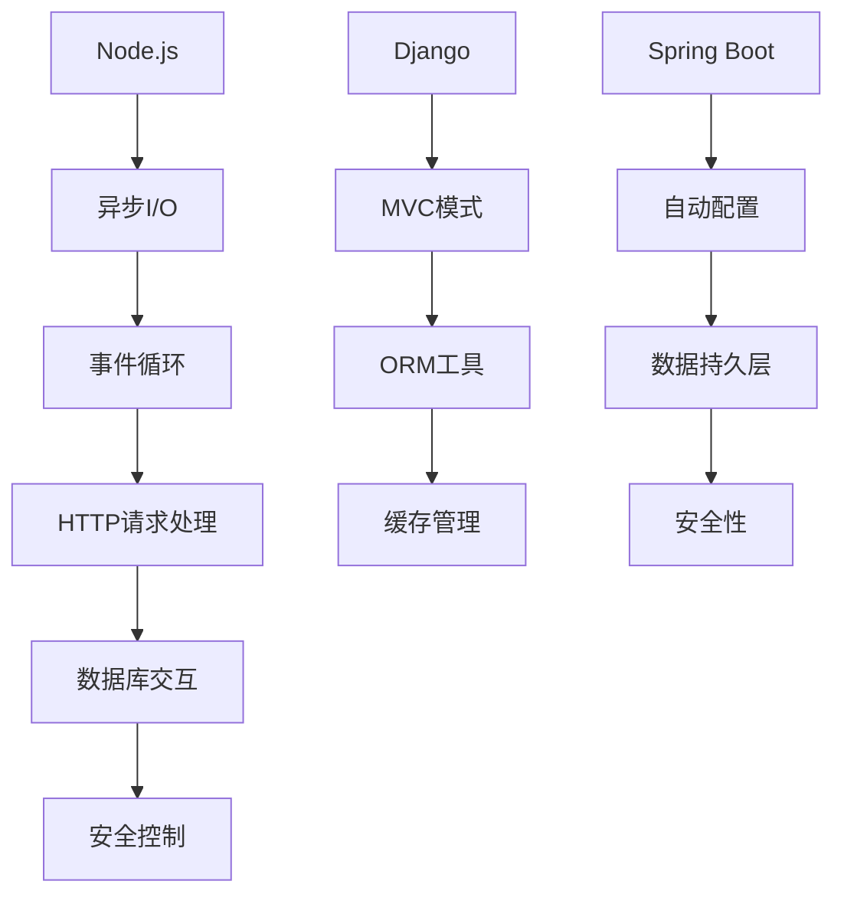

                 

关键词：后端框架，Node.js，Python，Java，框架对比，性能，安全性，开发效率

> 摘要：本文旨在对当前主流的后端框架进行一次深入的对比分析，尤其是针对 Node.js，探讨其在性能、安全性、开发效率等方面的优缺点，以及在不同应用场景下的适用性。同时，文章还将介绍其他几个流行的后端框架，如 Python 的 Django 和 Java 的 Spring Boot，并给出选择这些框架的建议。

## 1. 背景介绍

在后端开发领域，框架的选择一直是开发者们关注的热点。随着互联网的快速发展，业务需求日益复杂，对后端框架的要求也越来越高。Node.js 作为一种高性能的 JavaScript 运行环境，因其异步非阻塞的特点，在实时应用和微服务架构中受到广泛关注。然而，除了 Node.js，市场上还存在许多其他优秀的后端框架，它们各有特点和适用场景。

本文将围绕以下几个方面展开讨论：

- Node.js 的优势和局限性
- 其他主流后端框架的介绍和比较
- 各框架在不同应用场景下的适用性
- 如何根据项目需求选择合适的后端框架

通过对这些方面的深入探讨，希望能够帮助开发者更好地了解各种后端框架，并在实际开发中选择最适合自己项目的解决方案。

## 2. 核心概念与联系

### 2.1. 后端框架的基本概念

后端框架是一种软件框架，用于简化后端开发的过程，提供一套完整的开发工具和API，使得开发者可以更加专注于业务逻辑的实现，而无需从零开始搭建整个系统。后端框架通常包括请求处理、数据库交互、安全控制、缓存管理等功能，是现代Web应用开发的重要工具。

### 2.2. Node.js 的核心特点

Node.js 是一个基于 Chrome V8 引擎的 JavaScript 运行环境，它的核心特点是非阻塞和异步操作。这意味着在 Node.js 中，大部分I/O操作都是非阻塞的，可以同时处理多个请求，从而提高了系统的吞吐量和并发处理能力。

- **非阻塞I/O**：Node.js 的异步I/O模型避免了线程阻塞，能够充分利用系统资源，实现高并发处理。
- **单线程**：Node.js 使用单线程模型，通过事件循环机制处理I/O操作，避免了多线程同步的问题，从而简化了开发。
- **JavaScript**：Node.js 使用 JavaScript 作为编程语言，大大降低了开发门槛，使得前端开发者也能快速上手。

### 2.3. 其他后端框架的介绍

除了 Node.js，市场上还存在许多其他流行的后端框架，如 Python 的 Django 和 Java 的 Spring Boot。这些框架各有特点和适用场景，下面简要介绍它们的核心特点：

- **Django**：Django 是一个高效、可扩展的 Python Web 框架，遵循 MVC 设计模式。它提供了自动化的数据库生成、表单处理和缓存等功能，非常适合快速开发。
- **Spring Boot**：Spring Boot 是一个基于 Spring 的框架，提供了简洁的配置和自动配置功能，使得开发者可以快速启动 Spring 应用程序。它支持多种数据持久层框架，如 Hibernate 和 MyBatis。

### 2.4. 核心概念原理和架构的 Mermaid 流程图

以下是一个简化的后端框架架构流程图，展示了 Node.js、Django 和 Spring Boot 的核心组件和流程：



通过这个流程图，我们可以更直观地理解这些后端框架的基本原理和架构。

## 3. 核心算法原理 & 具体操作步骤

### 3.1. 算法原理概述

在后端开发中，常用的算法包括数据库查询优化、缓存算法、排序算法等。以下将简要介绍这些算法的基本原理。

- **数据库查询优化**：通过对SQL查询语句的优化，提高查询效率和性能。常见的优化策略包括创建索引、使用连接查询、避免子查询等。
- **缓存算法**：用于减少数据库访问次数，提高系统响应速度。常见的缓存算法包括 LRU（Least Recently Used）算法、LFU（Least Frequently Used）算法等。
- **排序算法**：用于对数据进行排序，常见的排序算法包括冒泡排序、快速排序、归并排序等。

### 3.2. 算法步骤详解

- **数据库查询优化**：

  - **创建索引**：在经常查询的字段上创建索引，提高查询速度。
  - **使用连接查询**：在多表查询时，使用连接查询代替子查询，减少查询次数。
  - **避免子查询**：尽量使用 EXISTS 子句代替子查询，提高查询效率。

- **缓存算法**：

  - **LRU算法**：根据数据的使用频率和最近使用时间，淘汰最久未使用的缓存项。
  - **LFU算法**：根据数据的使用频率，淘汰使用频率最低的缓存项。

- **排序算法**：

  - **冒泡排序**：通过反复遍历要排序的数列，比较相邻两项，将小的一项向前移动。
  - **快速排序**：通过递归分治策略，将数列划分为较小的子序列，然后分别对子序列进行排序。
  - **归并排序**：通过递归将数列划分为多个子序列，然后依次合并这些子序列，直到得到完整的排序序列。

### 3.3. 算法优缺点

- **数据库查询优化**：

  - **优点**：能够显著提高查询效率和性能。
  - **缺点**：索引维护会增加数据插入和更新的开销。

- **缓存算法**：

  - **优点**：减少数据库访问次数，提高系统响应速度。
  - **缺点**：缓存策略不当可能导致缓存穿透或缓存雪崩。

- **排序算法**：

  - **优点**：能够有效地对数据进行排序。
  - **缺点**：排序过程可能消耗较多的时间和资源。

### 3.4. 算法应用领域

- **数据库查询优化**：广泛应用于各类数据库应用，如电商系统、金融系统等。
- **缓存算法**：广泛应用于需要快速响应的Web应用，如社交媒体、在线购物等。
- **排序算法**：广泛应用于需要对数据进行排序的领域，如数据分析、搜索引擎等。

## 4. 数学模型和公式 & 详细讲解 & 举例说明

### 4.1. 数学模型构建

在后端框架性能评估中，常用的数学模型包括响应时间模型和吞吐量模型。

- **响应时间模型**：用于评估系统对请求的响应时间。常见的模型有 M/M/1 模型（单服务器、客户到达时间服从泊松过程、服务时间服从指数分布）和 M/M/c 模型（多服务器、其他条件同 M/M/1 模型）。

- **吞吐量模型**：用于评估系统的处理能力。常见的模型有 C/A/c 模型（客户到达率、服务器数量、服务时间）。

### 4.2. 公式推导过程

- **响应时间模型**：M/M/1 模型的平均响应时间可以通过以下公式计算：

  $$ T_r = \frac{\lambda}{\mu - \lambda} $$

  其中，$T_r$ 为平均响应时间，$\lambda$ 为客户到达率，$\mu$ 为服务率。

- **吞吐量模型**：C/A/c 模型的吞吐量可以通过以下公式计算：

  $$ Q = \frac{c}{1 + \frac{A}{c} - \frac{\lambda A}{c\mu}} $$

  其中，$Q$ 为吞吐量，$c$ 为服务器数量，$A$ 为服务时间，$\lambda$ 为客户到达率，$\mu$ 为服务率。

### 4.3. 案例分析与讲解

假设一个 Web 应用系统，客户到达率为 $\lambda = 10$ 次/秒，服务时间为 $A = 1$ 秒，服务器数量为 $c = 5$，服务率为 $\mu = 20$ 次/秒。

- **平均响应时间**：

  $$ T_r = \frac{10}{20 - 10} = 2 \text{秒} $$

- **吞吐量**：

  $$ Q = \frac{5}{1 + \frac{1}{5} - \frac{10 \times 1}{5 \times 20}} = 1.125 \text{次/秒} $$

通过这个案例，我们可以看到系统在给定参数下的响应时间和吞吐量。

### 4.4. 数学模型的应用

- **性能评估**：通过数学模型，可以评估后端框架在不同参数下的性能，如响应时间和吞吐量，从而为框架的选择提供依据。
- **容量规划**：根据系统吞吐量模型，可以预测系统在增加服务器或调整服务时间参数后的性能变化，从而进行有效的容量规划。

## 5. 项目实践：代码实例和详细解释说明

### 5.1. 开发环境搭建

为了演示如何使用 Node.js 开发一个简单的后端服务，我们需要搭建一个基本的开发环境。以下是搭建过程的简要步骤：

1. 安装 Node.js：从 Node.js 官网下载并安装 Node.js，安装完成后，通过命令行运行 `node -v` 检查安装是否成功。
2. 安装 npm：Node.js 自带包管理工具 npm，通过命令行运行 `npm -v` 检查是否安装成功。
3. 创建项目：在命令行中创建一个新项目文件夹，并通过 `npm init` 命令初始化项目。
4. 安装依赖：根据项目需求，通过 `npm install` 命令安装必要的依赖包。

### 5.2. 源代码详细实现

以下是一个简单的 Node.js 代码示例，用于实现一个 RESTful API：

```javascript
const http = require('http');
const url = require('url');

const server = http.createServer((request, response) => {
  const { method, url } = request;
  const path = url.pathname;
  const query = url.search;

  console.log(`Received request for method ${method} and URL ${path}`);

  if (path === '/' && method === 'GET') {
    response.end('<h1>Hello, World!</h1>');
  } else {
    response.end('<h1>404 Not Found</h1>');
  }
});

server.listen(3000, () => {
  console.log('Server is running on port 3000');
});
```

### 5.3. 代码解读与分析

- **引入模块**：首先引入了 `http` 和 `url` 模块，用于创建服务器和处理URL。
- **创建服务器**：通过 `http.createServer` 方法创建一个HTTP服务器实例。
- **请求处理**：在服务器回调函数中，通过 `request` 对象获取请求方法和URL，然后根据URL路径和方法进行不同的处理。
- **响应内容**：根据请求类型，发送相应的HTTP响应内容。

### 5.4. 运行结果展示

在命令行中运行 `node app.js`（假设代码文件名为 `app.js`），然后通过浏览器访问 `http://localhost:3000`，可以看到如下结果：

```html
<h1>Hello, World!</h1>
```

这表明我们的 Node.js 服务器已成功运行，并能够处理简单的HTTP请求。

## 6. 实际应用场景

### 6.1. 实时聊天应用

Node.js 适用于需要高并发、低延迟的实时聊天应用。其异步非阻塞的特点能够充分利用系统资源，实现大量用户同时在线的稳定运行。

### 6.2. 微服务架构

微服务架构强调将应用分解为多个独立的服务，Node.js 的轻量级和快速部署特性使其成为构建微服务的理想选择。

### 6.3. 云服务和 IoT

Node.js 广泛应用于云服务和物联网（IoT）领域，其高效的 I/O 操作能力能够满足大量设备同时连接和通信的需求。

### 6.4. 未来应用展望

随着云计算、大数据和物联网等技术的不断发展，Node.js 在实时数据处理、智能应用和边缘计算等新兴领域具有广阔的应用前景。未来，Node.js 的发展将更加注重性能优化、安全性提升和跨平台支持。

## 7. 工具和资源推荐

### 7.1. 学习资源推荐

- **《Node.js 实战》**：作者刘未鹏，详细介绍了 Node.js 的基本概念和应用实践。
- **《深入理解Node.js》**：作者齐大智，从底层原理到应用实践，全面讲解 Node.js。
- **Node.js 官方文档**：提供详细的 API 文档和教程，是学习 Node.js 的必备资源。

### 7.2. 开发工具推荐

- **Visual Studio Code**：一款强大的代码编辑器，支持 Node.js 开发，提供丰富的插件和扩展。
- **NPM**：Node.js 的包管理工具，用于安装和管理项目依赖。
- **Webpack**：用于模块打包和代码优化的工具，适用于复杂的前端和后端项目。

### 7.3. 相关论文推荐

- **《Node.js: Event-Driven Programming in JavaScript》**：探讨 Node.js 的异步编程模型和事件驱动架构。
- **《Scalable Internet Architectures》**：介绍如何构建可扩展的互联网架构，包括 Node.js 的应用场景。
- **《The Performance of Node.js》**：分析 Node.js 的性能特点和应用优化策略。

## 8. 总结：未来发展趋势与挑战

### 8.1. 研究成果总结

本文对 Node.js 及其他主流后端框架进行了深入对比分析，探讨了它们的性能、安全性和开发效率等方面的优缺点。通过对核心算法原理和项目实践案例的讲解，为开发者提供了实际应用场景下的参考。

### 8.2. 未来发展趋势

- **性能优化**：随着应用需求的增加，性能优化将成为后端框架发展的重点。未来的框架将更加注重高效处理能力和资源利用。
- **安全性提升**：随着网络安全威胁的加剧，后端框架将加强安全性设计，提供更加完善的防护机制。
- **跨平台支持**：为了适应不同的开发环境和应用场景，后端框架将加强跨平台支持，提供更加灵活的部署方案。

### 8.3. 面临的挑战

- **复杂业务处理**：随着业务需求的多样化，后端框架需要提供更强大的数据处理能力和业务支持。
- **开发效率**：如何提高开发效率，降低开发门槛，是后端框架需要持续解决的问题。
- **社区支持**：活跃的社区支持和丰富的生态资源是后端框架成功的关键，未来的框架需要更加注重社区建设。

### 8.4. 研究展望

未来，后端框架的发展将更加注重性能优化、安全性提升和跨平台支持。同时，随着新技术的不断涌现，如云计算、大数据和物联网等，后端框架将在这些新兴领域发挥更大的作用。开发者应关注行业动态，不断提升自身技能，以应对未来的技术挑战。

## 9. 附录：常见问题与解答

### 9.1. Node.js 的性能如何？

Node.js 的性能取决于多种因素，包括硬件性能、网络延迟、系统负载等。在处理高并发、低延迟的场景下，Node.js 具有明显的优势。然而，对于计算密集型的任务，Node.js 可能不如传统的服务器端语言（如 Java、C#）。

### 9.2. 如何选择合适的后端框架？

选择后端框架时，需要考虑以下因素：

- **项目需求**：根据项目的技术需求、业务场景和性能要求选择合适的框架。
- **开发效率**：选择开发效率高的框架，可以缩短项目周期。
- **社区支持**：选择有活跃社区支持的框架，可以获得更好的技术支持和资源。

### 9.3. Node.js 与 Django 如何选择？

Node.js 适用于需要高并发、低延迟的场景，如实时聊天、物联网等。Django 适用于快速开发、高扩展性的Web应用，如内容管理系统、电子商务平台等。根据具体业务需求进行选择。

### 9.4. Node.js 的安全性如何保障？

Node.js 的安全性可以通过以下措施进行保障：

- **使用官方推荐的包**：避免使用未经验证的第三方包。
- **定期更新系统**：保持 Node.js 和相关依赖包的更新，修复已知漏洞。
- **安全配置**：合理配置服务器和应用程序，如限制访问权限、使用HTTPS等。

### 9.5. 如何优化 Node.js 应用性能？

优化 Node.js 应用性能可以从以下几个方面进行：

- **异步非阻塞操作**：充分利用 Node.js 的异步非阻塞特性，减少线程阻塞。
- **负载均衡**：使用负载均衡器，如 Nginx，分发请求，提高系统并发处理能力。
- **代码优化**：优化代码结构和算法，减少计算时间和内存占用。

以上是本文针对 Node.js 之外的后端框架进行的一次深入探讨。希望通过本文，读者能够对后端框架有更全面的认识，并在实际项目中选择最适合的解决方案。作者：禅与计算机程序设计艺术 / Zen and the Art of Computer Programming。

