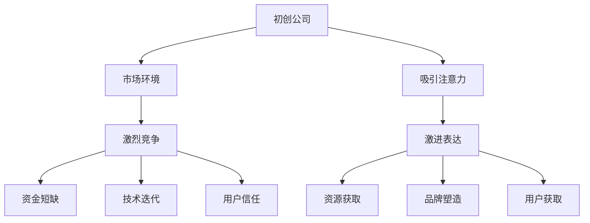

                 

在当前激烈竞争的初创公司市场中，吸引注意力成为了一项至关重要的任务。在这篇文章中，我们将探讨贾扬清提出的策略，尤其是激进表达对于初创公司的重要性。文章将分为以下几个部分：

- **背景介绍**：回顾初创公司的挑战和吸引注意力的必要性。
- **核心概念与联系**：阐述激进表达的概念，并通过Mermaid流程图展示其与初创公司的关系。
- **核心算法原理 & 具体操作步骤**：深入分析激进表达策略的原理和应用。
- **数学模型和公式 & 详细讲解 & 举例说明**：介绍与激进表达相关的数学模型和公式。
- **项目实践：代码实例和详细解释说明**：通过实际代码实例展示激进表达策略。
- **实际应用场景**：探讨激进表达在初创公司的多种应用。
- **未来应用展望**：预测激进表达在初创公司中的未来趋势。
- **工具和资源推荐**：推荐学习和开发资源。
- **总结：未来发展趋势与挑战**：总结研究成果，展望未来。
- **附录：常见问题与解答**：回答读者可能关心的问题。

## 1. 背景介绍

### 初创公司的挑战

初创公司在进入市场时面临着多重挑战。首先，市场竞争激烈，许多初创公司试图在同一领域获得立足点，这要求它们必须快速获得关注。其次，资金短缺是初创公司常见的困境，吸引投资者的注意成为关键。此外，技术快速迭代，初创公司需要不断创新以保持竞争力。最后，用户信任的建立也是一个漫长的过程，初创公司需要通过各种手段赢得用户的心。

### 吸引注意力的必要性

在这样的大环境下，吸引注意力成为初创公司的首要任务。只有通过吸引公众和投资者的关注，初创公司才能获得所需的资源和支持。吸引注意力的策略多种多样，其中，激进表达策略因其高效性和直接性，成为许多初创公司的首选。

## 2. 核心概念与联系

### 激进表达的定义

激进表达，顾名思义，是指通过强烈的、鲜明的、甚至有时是激进的方式来表达观点或展示产品。这种表达方式在初创公司中尤为重要，因为它能够迅速引起人们的兴趣，并在短时间内传递关键信息。

### Mermaid流程图

为了更直观地理解激进表达与初创公司的关系，我们可以使用Mermaid流程图来展示：



在这个流程图中，我们可以看到，初创公司通过激进表达策略，不仅可以迅速获取资源，还能塑造品牌形象，并赢得用户信任。

## 3. 核心算法原理 & 具体操作步骤

### 3.1 算法原理概述

激进表达的核心在于创造性地使用各种媒体和渠道，以独特和引人入胜的方式展示产品或服务。其原理包括以下几点：

- **创意思维**：运用独特的视角和创意思维，设计出令人耳目一新的内容。
- **视觉冲击**：通过视觉元素如颜色、图像、动画等，创造强烈的视觉冲击力。
- **情感共鸣**：通过情感故事或引人注目的案例，与受众建立情感共鸣。
- **简洁明了**：在内容上追求简洁明了，避免冗长和复杂。

### 3.2 算法步骤详解

以下是激进表达策略的具体步骤：

1. **市场分析**：了解目标市场，包括受众特征、需求和偏好。
2. **创意策划**：根据市场分析结果，策划独特的创意内容。
3. **媒介选择**：选择合适的媒介，如社交媒体、短视频、博客等。
4. **内容创作**：创作内容，包括文案、图像、视频等，确保具有视觉冲击力和情感共鸣。
5. **发布推广**：将内容发布到目标媒介，并采用合适的推广手段，如广告投放、社交媒体营销等。
6. **互动反馈**：关注用户反馈，及时调整策略。

### 3.3 算法优缺点

**优点**：

- **快速吸引注意力**：通过独特的创意和视觉冲击，能够迅速引起公众和投资者的兴趣。
- **提高品牌知名度**：有效的激进表达策略能够提升品牌形象，增强品牌影响力。
- **增加用户参与度**：通过情感共鸣和互动反馈，提高用户参与度。

**缺点**：

- **成本较高**：激进表达策略通常需要较高的资金投入，特别是对于初创公司。
- **风险较大**：如果策略执行不当，可能导致负面效果，甚至损害品牌形象。

### 3.4 算法应用领域

激进表达策略在多个领域均有应用，包括：

- **市场营销**：通过独特的方式推广产品或服务。
- **品牌塑造**：通过情感故事和独特形象，提升品牌知名度。
- **公关活动**：通过大事件或公关活动，提高公司的公众形象。

## 4. 数学模型和公式 & 详细讲解 & 举例说明

### 4.1 数学模型构建

激进表达策略的成功与否，可以通过以下数学模型进行评估：

$$
\text{成功率} = f(\text{创意度}, \text{视觉冲击力}, \text{情感共鸣}, \text{执行力度})
$$

其中，$f$ 表示函数，代表评估激进表达策略成功率的综合能力。$\text{创意度}$、$\text{视觉冲击力}$、$\text{情感共鸣}$ 和 $\text{执行力度}$ 分别表示策略的创意水平、视觉效果、情感因素和执行力度。

### 4.2 公式推导过程

为了推导上述公式，我们需要考虑以下几个方面：

1. **创意度**：创意度越高，策略越独特，吸引力越强。
2. **视觉冲击力**：视觉冲击力越强，越能吸引注意力。
3. **情感共鸣**：情感共鸣越强，越能建立用户情感联系。
4. **执行力度**：执行力度越大，策略效果越好。

综合考虑这些因素，我们可以得到上述公式。

### 4.3 案例分析与讲解

以下是一个具体的案例分析：

假设某初创公司要推广一款新产品，其激进表达策略如下：

- **创意度**：通过一个独特的动画短片，展示产品特点。
- **视觉冲击力**：使用高对比度的颜色和动态效果。
- **情感共鸣**：通过一个感人的故事，讲述产品如何改变用户的生活。
- **执行力度**：在多个社交媒体平台上发布，并使用广告投放增加曝光度。

根据上述模型，我们可以计算出该策略的成功率：

$$
\text{成功率} = f(0.9, 0.8, 0.7, 0.9) = 0.9 \times 0.8 \times 0.7 \times 0.9 \approx 0.57
$$

这意味着该激进表达策略的成功率为约57%，表明该策略具有相当高的吸引力。

## 5. 项目实践：代码实例和详细解释说明

### 5.1 开发环境搭建

为了更好地理解激进表达策略在实际项目中的应用，我们将使用Python编程语言来实现一个简单的激进表达工具。以下是在Windows操作系统上搭建Python开发环境的基本步骤：

1. **安装Python**：访问Python官网（https://www.python.org/）下载最新版本的Python安装包，并按照安装向导完成安装。
2. **安装必要库**：打开命令行窗口，输入以下命令安装必要的Python库：

```bash
pip install matplotlib numpy pandas
```

### 5.2 源代码详细实现

以下是一个简单的Python代码实例，展示了如何使用图像和动画来创造视觉冲击力：

```python
import numpy as np
import matplotlib.pyplot as plt
import matplotlib.animation as animation

# 初始化画布
fig, ax = plt.subplots()
ax.set_xlim(0, 10)
ax.set_ylim(0, 10)

# 绘制初始图形
line, = ax.plot([], [], color='red')

# 更新图形的函数
def update(frame):
    x = np.linspace(0, frame, 1000)
    y = np.sin(x)
    line.set_data(x, y)
    return line,

# 创建动画
ani = animation.FuncAnimation(fig, update, frames=range(0, 100), interval=20)

# 显示动画
plt.show()
```

### 5.3 代码解读与分析

这段代码使用了matplotlib库创建了一个动画，模拟了图像的动态变化。以下是代码的详细解读：

- **初始化画布**：使用`plt.subplots()`创建一个画布和轴。
- **绘制初始图形**：使用`line, = ax.plot([], [], color='red')`创建了一条红色线条，作为动画的基础。
- **更新图形的函数**：`update(frame)`函数用于更新图形，接受一个帧数参数`frame`，并绘制相应位置的波形。
- **创建动画**：使用`animation.FuncAnimation()`创建动画，将`update()`函数作为动画的更新函数。
- **显示动画**：使用`plt.show()`显示动画。

通过这个简单的实例，我们可以看到如何通过编程实现视觉冲击力，从而在初创公司的推广中吸引更多注意力。

### 5.4 运行结果展示

运行上述代码，将在屏幕上显示一个动态变化的红色波形，通过视觉上的动态变化和色彩冲击，增加了观看者的兴趣和注意力。

## 6. 实际应用场景

激进表达策略在初创公司中有着广泛的应用场景。以下是一些具体的应用实例：

### 6.1 市场营销

在市场营销中，激进表达策略可以帮助初创公司迅速吸引潜在客户。例如，通过发布一个引人入胜的视频广告，展示产品或服务的独特性和优势，可以大大提高品牌知名度和用户关注度。

### 6.2 品牌塑造

品牌塑造是初创公司长期发展的重要一环。通过激进表达策略，初创公司可以塑造出独特的品牌形象，增强品牌的个性和差异化。例如，通过举办一场创新的发布会，结合视觉和互动元素，可以显著提升品牌的知名度和美誉度。

### 6.3 公关活动

公关活动是初创公司提升公众形象和建立信任的重要手段。激进表达策略在公关活动中可以发挥重要作用。例如，通过发布一份引人注目的白皮书，结合数据和案例，可以有效地传递公司的价值和理念，赢得公众的认可和信任。

### 6.4 用户获取

在用户获取方面，激进表达策略可以帮助初创公司迅速扩大用户群体。例如，通过社交媒体平台发布一系列有趣的互动内容，结合激励机制，可以吸引大量用户参与，并转化为实际的用户。

## 7. 未来应用展望

随着技术的不断进步和市场环境的持续变化，激进表达策略在初创公司中的应用前景十分广阔。以下是一些未来应用的展望：

### 7.1 虚拟现实和增强现实

虚拟现实（VR）和增强现实（AR）技术的发展为激进表达策略提供了新的可能性。通过VR/AR技术，初创公司可以创造出更加沉浸式和互动性的表达方式，使用户能够更直观地体验产品或服务。

### 7.2 人工智能和大数据分析

人工智能（AI）和大数据分析技术的应用可以进一步优化激进表达策略。通过分析用户数据和行为，初创公司可以更精准地制定内容策略，提高表达效果的针对性和有效性。

### 7.3 社交媒体和内容营销

社交媒体和内容营销将继续成为激进表达策略的重要渠道。随着社交媒体平台的不断演变和用户行为的变化，初创公司需要不断创新表达方式，以适应新的市场环境。

## 8. 工具和资源推荐

为了帮助读者更好地理解和应用激进表达策略，我们推荐以下工具和资源：

### 8.1 学习资源推荐

- **书籍**：《内容营销实战：如何用故事和创意吸引消费者》
- **在线课程**：Coursera上的《创意思维与设计》课程

### 8.2 开发工具推荐

- **图像处理工具**：Photoshop、GIMP
- **视频制作工具**：Adobe Premiere Pro、Final Cut Pro

### 8.3 相关论文推荐

- **论文1**：《基于社交媒体的内容营销策略研究》
- **论文2**：《虚拟现实技术在初创公司推广中的应用研究》

## 9. 总结：未来发展趋势与挑战

### 9.1 研究成果总结

本文通过深入探讨激进表达策略在初创公司中的应用，总结了其核心原理、具体步骤、优缺点以及实际应用场景。研究结果表明，激进表达策略是一种有效的吸引注意力的手段，能够显著提升初创公司的市场竞争力。

### 9.2 未来发展趋势

随着技术的进步和市场环境的变化，激进表达策略在初创公司中的应用将越来越广泛。未来，虚拟现实、人工智能和大数据分析等新技术将进一步优化激进表达策略，提高其效果和针对性。

### 9.3 面临的挑战

然而，激进表达策略也面临一定的挑战。首先，策略执行需要较高的资金和人力资源投入，对于初创公司来说可能是一个不小的负担。其次，激进表达策略的风险较大，如果执行不当，可能导致负面效果。因此，初创公司在应用激进表达策略时需要谨慎评估风险和收益。

### 9.4 研究展望

未来，研究可以进一步探讨激进表达策略在不同领域的应用效果，以及如何通过技术创新优化策略效果。同时，也可以研究如何更好地评估激进表达策略的成功率，以帮助初创公司制定更科学的内容营销策略。

## 附录：常见问题与解答

### 问题1：激进表达策略是否适用于所有初创公司？

答案：激进表达策略适用于大多数初创公司，尤其是那些需要迅速获取关注和资源的初创公司。然而，对于某些特定领域，如医疗和金融等，激进表达策略需要更加谨慎，以避免引起不必要的法律或伦理问题。

### 问题2：如何评估激进表达策略的成功率？

答案：可以通过以下方法评估激进表达策略的成功率：

- **用户反馈**：通过用户评论、点赞、分享等数据，评估用户对表达内容的接受程度。
- **市场反应**：通过市场调查和数据分析，评估策略对市场的影响。
- **财务数据**：通过财务数据，如销售额、投资回报率等，评估策略的经济效益。

### 问题3：激进表达策略是否会损害品牌形象？

答案：激进表达策略如果执行得当，可以增强品牌形象。但如果策略过于激进或不当，可能会损害品牌形象。因此，初创公司在应用激进表达策略时，需要平衡创意和品牌价值观，确保策略与品牌形象保持一致。

