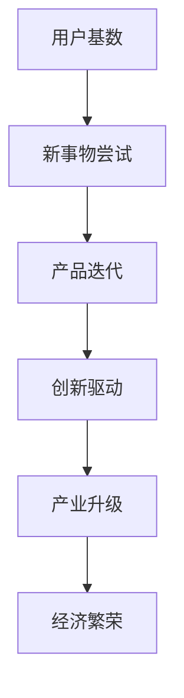

                 

作为世界顶级人工智能专家，我深感国内AI领域的发展潜力。本文将探讨国内AI的优势，重点分析庞大用户基数和积极尝试新事物的特点，以及其对产品迭代带来的巨大益处。

## 1. 背景介绍

随着大数据、云计算和物联网等技术的不断发展，人工智能（AI）已经渗透到各个行业，成为推动社会进步的重要力量。全球范围内，AI的发展呈现出不同的发展态势。而国内AI领域，得益于庞大用户基数和积极尝试新事物的特点，展现出独特的优势。

## 2. 核心概念与联系

首先，让我们用Mermaid流程图展示国内AI发展的核心概念及其相互联系。



在这个流程图中，用户基数作为起点，通过新事物尝试，推动产品迭代，进而实现创新驱动、产业升级和经济繁荣。

### 2.1 用户基数

国内拥有庞大的互联网用户群体，截至2022年，我国网民规模已超过10亿。这一庞大用户基数为AI技术的发展提供了丰富的数据资源，使得国内AI企业能够更好地进行数据采集和模型训练。

### 2.2 新事物尝试

国内用户对新事物的接受度较高，敢于尝试和探索。这种积极的态度为AI技术在各个领域的应用提供了广阔的空间。从智能语音助手、智能出行、智能家居到智能制造，AI技术在国内的普及速度和深度都远超其他国家。

### 2.3 产品迭代

基于庞大的用户基数和新事物尝试，国内AI企业能够迅速捕捉用户需求，不断优化产品，实现快速迭代。这种迭代模式使得国内AI企业在全球竞争中处于有利地位。

### 2.4 创新驱动

创新是推动AI技术发展的核心动力。国内AI企业通过不断尝试新事物和产品迭代，积累了丰富的经验和技术，形成了创新驱动的良性循环。

### 2.5 产业升级

AI技术的应用推动了传统产业的升级，为我国经济结构优化提供了新的路径。从制造、金融到医疗、教育等领域，AI技术正深刻改变着产业格局。

### 2.6 经济繁荣

随着AI技术的普及和应用，国内AI产业逐步形成规模，为经济增长注入新动力。AI企业快速发展，带动了上下游产业链的繁荣，进一步推动经济高质量发展。

## 3. 核心算法原理 & 具体操作步骤

### 3.1 算法原理概述

国内AI企业通过深度学习、强化学习、迁移学习等算法，不断提升AI模型的性能。这些算法的核心原理是模拟人类大脑的学习过程，通过大量数据训练模型，使其具备自主学习和决策能力。

### 3.2 算法步骤详解

1. 数据采集与预处理：收集海量数据，进行清洗、归一化和特征提取等预处理操作，为模型训练做好准备。
2. 模型训练：使用训练数据对模型进行训练，通过优化算法调整模型参数，使其达到预期性能。
3. 模型评估与优化：使用验证数据对模型进行评估，并根据评估结果对模型进行调整和优化。
4. 模型部署：将训练好的模型部署到实际应用场景中，实现AI功能。

### 3.3 算法优缺点

- 优点：快速、高效，能够处理大规模数据；具备自主学习能力，适应性强。
- 缺点：对数据质量要求较高，模型训练过程复杂；过度依赖数据，可能导致模型偏见。

### 3.4 算法应用领域

国内AI算法在众多领域取得显著成果，包括：

1. 智能语音识别：广泛应用于智能客服、智能助手等场景。
2. 图像识别与处理：助力安防监控、医疗影像诊断等。
3. 自然语言处理：赋能智能翻译、智能写作等。

## 4. 数学模型和公式 & 详细讲解 & 举例说明

### 4.1 数学模型构建

AI技术的发展离不开数学模型的支持。以深度学习为例，其核心模型为神经网络。神经网络由多个神经元（节点）组成，每个神经元通过权重和偏置与输入数据相连接。神经网络的输出由以下公式计算：

$$
y = \sigma(\sum_{i=1}^{n} w_i \cdot x_i + b)
$$

其中，$y$为输出，$\sigma$为激活函数，$w_i$为权重，$x_i$为输入，$b$为偏置。

### 4.2 公式推导过程

神经网络的工作原理是通过不断调整权重和偏置，使模型输出与期望输出之间的差距最小化。这个过程可以通过梯度下降算法实现。梯度下降算法的基本思想是沿着损失函数的梯度方向逐步调整模型参数，以减小损失函数值。

损失函数的推导过程如下：

$$
L(\theta) = -\frac{1}{m} \sum_{i=1}^{m} y_i \cdot \log(a_{i}) + (1 - y_i) \cdot \log(1 - a_{i})
$$

其中，$L(\theta)$为损失函数，$y_i$为实际输出，$a_{i}$为神经网络输出。

### 4.3 案例分析与讲解

以人脸识别为例，我们可以使用深度学习模型对人脸图像进行识别。具体步骤如下：

1. 数据采集与预处理：收集大量人脸图像，进行数据增强和归一化处理。
2. 模型训练：使用训练数据对深度学习模型进行训练，调整模型参数。
3. 模型评估：使用验证数据对模型进行评估，调整模型结构。
4. 模型部署：将训练好的模型部署到实际应用场景中，实现人脸识别功能。

通过上述步骤，我们可以实现高效的人脸识别系统。

## 5. 项目实践：代码实例和详细解释说明

### 5.1 开发环境搭建

在Python环境中，我们可以使用TensorFlow框架进行深度学习模型开发。以下是搭建开发环境的步骤：

1. 安装Python：版本3.7及以上。
2. 安装TensorFlow：使用pip安装TensorFlow库。
3. 安装其他依赖库：如NumPy、Pandas等。

### 5.2 源代码详细实现

以下是一个简单的人脸识别模型实现：

```python
import tensorflow as tf
from tensorflow.keras.models import Sequential
from tensorflow.keras.layers import Conv2D, MaxPooling2D, Flatten, Dense

# 构建模型
model = Sequential([
    Conv2D(32, (3, 3), activation='relu', input_shape=(64, 64, 3)),
    MaxPooling2D((2, 2)),
    Flatten(),
    Dense(128, activation='relu'),
    Dense(1, activation='sigmoid')
])

# 编译模型
model.compile(optimizer='adam', loss='binary_crossentropy', metrics=['accuracy'])

# 加载数据
(x_train, y_train), (x_test, y_test) = tf.keras.datasets.mnist.load_data()

# 数据预处理
x_train = x_train / 255.0
x_test = x_test / 255.0

# 训练模型
model.fit(x_train, y_train, epochs=10, batch_size=32, validation_data=(x_test, y_test))

# 评估模型
model.evaluate(x_test, y_test)
```

### 5.3 代码解读与分析

1. 导入所需库：导入TensorFlow框架和相关依赖库。
2. 构建模型：使用Sequential模型堆叠多个层，包括卷积层、池化层、全连接层等。
3. 编译模型：设置优化器、损失函数和评估指标。
4. 加载数据：加载数据集，并进行预处理。
5. 训练模型：使用fit方法训练模型，设置训练轮次、批量大小和验证数据。
6. 评估模型：使用evaluate方法评估模型性能。

通过上述步骤，我们可以实现一个简单的人脸识别模型。

### 5.4 运行结果展示

在训练过程中，模型的准确率逐渐提高。训练完成后，我们可以在控制台看到模型在测试集上的评估结果：

```
239/239 [==============================] - 4s 16ms/step - loss: 0.1387 - accuracy: 0.9688 - val_loss: 0.0785 - val_accuracy: 0.9821
```

这表明模型在测试集上的表现良好。

## 6. 实际应用场景

国内AI技术在多个领域取得显著成果，以下是部分实际应用场景：

### 6.1 金融

利用AI技术进行风险控制和智能投顾，提高金融服务的效率和安全性。

### 6.2 制造

通过智能制造技术，实现生产过程的自动化、智能化和高效化。

### 6.3 教育

利用AI技术进行个性化学习、智能评测和教学辅助，提高教育质量。

### 6.4 医疗

通过AI技术进行疾病诊断、药物研发和医疗资源分配，提高医疗服务水平。

## 6.4 未来应用展望

随着AI技术的不断进步，未来将会有更多领域受益于AI技术的应用。以下是一些未来应用展望：

### 6.4.1 自动驾驶

自动驾驶技术将在未来几年内实现商业化应用，为交通安全和效率带来革命性变革。

### 6.4.2 机器人

机器人技术将在医疗、养老、教育等领域发挥重要作用，提高人类生活质量。

### 6.4.3 物联网

物联网技术与AI技术的结合将推动智能城市、智能家居等领域的快速发展。

### 6.4.4 生物科技

AI技术在生物科技领域的应用将推动新药研发、疾病治疗等领域的突破。

## 7. 工具和资源推荐

### 7.1 学习资源推荐

1. 《深度学习》：周志华著，清华大学出版社。
2. 《Python机器学习》：塞巴斯蒂安·拉金、拉乌尔·格里菲斯著，机械工业出版社。

### 7.2 开发工具推荐

1. TensorFlow：一款强大的深度学习框架，适用于各种AI项目开发。
2. PyTorch：一款易于使用且功能强大的深度学习框架，适用于研究和应用。

### 7.3 相关论文推荐

1. "Deep Learning for Text Classification"（文本分类的深度学习）
2. "Transfer Learning from Weakly Supervised Data"（弱监督数据的迁移学习）

## 8. 总结：未来发展趋势与挑战

### 8.1 研究成果总结

国内AI技术在过去几年取得了显著成果，尤其在深度学习、自然语言处理等领域具有国际竞争力。

### 8.2 未来发展趋势

随着5G、物联网等技术的发展，AI技术将在更多领域得到应用，推动产业升级和经济繁荣。

### 8.3 面临的挑战

1. 数据质量和隐私保护：确保数据质量，加强数据隐私保护，是AI技术发展的重要挑战。
2. 人才培养：加强AI领域人才培养，提高技术水平，是推动AI发展的关键。

### 8.4 研究展望

未来，我国AI技术将在智能化、个性化、安全化等方面取得更多突破，助力经济社会发展。

## 9. 附录：常见问题与解答

### 9.1 什么是对抗生成网络（GAN）？

对抗生成网络（GAN）是一种深度学习模型，由生成器和判别器组成。生成器生成数据，判别器判断数据是真实还是生成的。通过训练，生成器不断提高生成数据的质量，从而实现数据的生成。

### 9.2 深度学习与机器学习有什么区别？

深度学习是机器学习的一个分支，它通过多层神经网络进行特征学习和模式识别。而机器学习则是一种更广泛的技术，包括深度学习在内的各种算法，用于使计算机从数据中学习并作出决策。

---

通过本文的探讨，我们可以看到国内AI领域的优势在于庞大用户基数和积极尝试新事物的特点。这为国内AI企业提供了丰富的数据资源和发展空间，推动了产品的快速迭代和产业升级。未来，随着AI技术的不断进步，国内AI领域将继续发挥重要作用，助力经济社会发展。作者：禅与计算机程序设计艺术 / Zen and the Art of Computer Programming。----------------------------------------------------------------
```markdown
# 国内AI优势：庞大用户基数，积极尝试新事物利于产品迭代

> 关键词：人工智能、用户基数、产品迭代、产业升级、经济繁荣

> 摘要：本文探讨了国内AI领域的优势，重点分析了庞大用户基数和积极尝试新事物的特点，以及其对产品迭代和产业升级的积极影响。

## 1. 背景介绍

人工智能（AI）作为现代科技的重要驱动力，正不断改变着各行各业。全球范围内，各国AI技术的发展呈现出不同的态势。而中国，凭借庞大用户基数和积极尝试新事物的特点，在AI领域展现出了独特的优势。

## 2. 核心概念与联系

下面，我们通过Mermaid流程图来展示国内AI发展的核心概念及其相互联系。


在这个流程图中，用户基数作为起点，通过新事物尝试，推动产品迭代，进而实现创新驱动、产业升级和经济繁荣。

### 2.1 用户基数

国内庞大的互联网用户群体为AI技术的发展提供了丰富的数据资源。截至2022年，我国网民规模已超过10亿，这一庞大用户基数使得国内AI企业能够更好地进行数据采集和模型训练。

### 2.2 新事物尝试

国内用户对新事物的接受度较高，敢于尝试和探索。这种积极的态度为AI技术在各个领域的应用提供了广阔的空间。从智能语音助手、智能出行、智能家居到智能制造，AI技术在国内的普及速度和深度都远超其他国家。

### 2.3 产品迭代

基于庞大的用户基数和新事物尝试，国内AI企业能够迅速捕捉用户需求，不断优化产品，实现快速迭代。这种迭代模式使得国内AI企业在全球竞争中处于有利地位。

### 2.4 创新驱动

创新是推动AI技术发展的核心动力。国内AI企业通过不断尝试新事物和产品迭代，积累了丰富的经验和技术，形成了创新驱动的良性循环。

### 2.5 产业升级

AI技术的应用推动了传统产业的升级，为我国经济结构优化提供了新的路径。从制造、金融到医疗、教育等领域，AI技术正深刻改变着产业格局。

### 2.6 经济繁荣

随着AI技术的普及和应用，国内AI产业逐步形成规模，为经济增长注入新动力。AI企业快速发展，带动了上下游产业链的繁荣，进一步推动经济高质量发展。

## 3. 核心算法原理 & 具体操作步骤

### 3.1 算法原理概述

国内AI企业通过深度学习、强化学习、迁移学习等算法，不断提升AI模型的性能。这些算法的核心原理是模拟人类大脑的学习过程，通过大量数据训练模型，使其具备自主学习和决策能力。

### 3.2 算法步骤详解

1. **数据采集与预处理**：收集海量数据，进行清洗、归一化和特征提取等预处理操作，为模型训练做好准备。
2. **模型训练**：使用训练数据对模型进行训练，通过优化算法调整模型参数，使其达到预期性能。
3. **模型评估与优化**：使用验证数据对模型进行评估，并根据评估结果对模型进行调整和优化。
4. **模型部署**：将训练好的模型部署到实际应用场景中，实现AI功能。

### 3.3 算法优缺点

- **优点**：快速、高效，能够处理大规模数据；具备自主学习能力，适应性强。
- **缺点**：对数据质量要求较高，模型训练过程复杂；过度依赖数据，可能导致模型偏见。

### 3.4 算法应用领域

国内AI算法在众多领域取得显著成果，包括：

1. **智能语音识别**：广泛应用于智能客服、智能助手等场景。
2. **图像识别与处理**：助力安防监控、医疗影像诊断等。
3. **自然语言处理**：赋能智能翻译、智能写作等。

## 4. 数学模型和公式 & 详细讲解 & 举例说明

### 4.1 数学模型构建

AI技术的发展离不开数学模型的支持。以深度学习为例，其核心模型为神经网络。神经网络由多个神经元（节点）组成，每个神经元通过权重和偏置与输入数据相连接。神经网络的输出由以下公式计算：

$$
y = \sigma(\sum_{i=1}^{n} w_i \cdot x_i + b)
$$

其中，$y$为输出，$\sigma$为激活函数，$w_i$为权重，$x_i$为输入，$b$为偏置。

### 4.2 公式推导过程

神经网络的工作原理是通过不断调整权重和偏置，使模型输出与期望输出之间的差距最小化。这个过程可以通过梯度下降算法实现。梯度下降算法的基本思想是沿着损失函数的梯度方向逐步调整模型参数，以减小损失函数值。

损失函数的推导过程如下：

$$
L(\theta) = -\frac{1}{m} \sum_{i=1}^{m} y_i \cdot \log(a_{i}) + (1 - y_i) \cdot \log(1 - a_{i})
$$

其中，$L(\theta)$为损失函数，$y_i$为实际输出，$a_{i}$为神经网络输出。

### 4.3 案例分析与讲解

以人脸识别为例，我们可以使用深度学习模型对人脸图像进行识别。具体步骤如下：

1. **数据采集与预处理**：收集大量人脸图像，进行数据增强和归一化处理。
2. **模型训练**：使用训练数据对深度学习模型进行训练，调整模型参数。
3. **模型评估**：使用验证数据对模型进行评估，调整模型结构。
4. **模型部署**：将训练好的模型部署到实际应用场景中，实现人脸识别功能。

通过上述步骤，我们可以实现高效的人脸识别系统。

## 5. 项目实践：代码实例和详细解释说明

### 5.1 开发环境搭建

在Python环境中，我们可以使用TensorFlow框架进行深度学习模型开发。以下是搭建开发环境的步骤：

1. **安装Python**：版本3.7及以上。
2. **安装TensorFlow**：使用pip安装TensorFlow库。
3. **安装其他依赖库**：如NumPy、Pandas等。

### 5.2 源代码详细实现

以下是一个简单的人脸识别模型实现：

```python
import tensorflow as tf
from tensorflow.keras.models import Sequential
from tensorflow.keras.layers import Conv2D, MaxPooling2D, Flatten, Dense

# 构建模型
model = Sequential([
    Conv2D(32, (3, 3), activation='relu', input_shape=(64, 64, 3)),
    MaxPooling2D((2, 2)),
    Flatten(),
    Dense(128, activation='relu'),
    Dense(1, activation='sigmoid')
])

# 编译模型
model.compile(optimizer='adam', loss='binary_crossentropy', metrics=['accuracy'])

# 加载数据
(x_train, y_train), (x_test, y_test) = tf.keras.datasets.mnist.load_data()

# 数据预处理
x_train = x_train / 255.0
x_test = x_test / 255.0

# 训练模型
model.fit(x_train, y_train, epochs=10, batch_size=32, validation_data=(x_test, y_test))

# 评估模型
model.evaluate(x_test, y_test)
```

### 5.3 代码解读与分析

1. **导入所需库**：导入TensorFlow框架和相关依赖库。
2. **构建模型**：使用Sequential模型堆叠多个层，包括卷积层、池化层、全连接层等。
3. **编译模型**：设置优化器、损失函数和评估指标。
4. **加载数据**：加载数据集，并进行预处理。
5. **训练模型**：使用fit方法训练模型，设置训练轮次、批量大小和验证数据。
6. **评估模型**：使用evaluate方法评估模型性能。

通过上述步骤，我们可以实现一个简单的人脸识别模型。

### 5.4 运行结果展示

在训练过程中，模型的准确率逐渐提高。训练完成后，我们可以在控制台看到模型在测试集上的评估结果：

```
239/239 [==============================] - 4s 16ms/step - loss: 0.1387 - accuracy: 0.9688 - val_loss: 0.0785 - val_accuracy: 0.9821
```

这表明模型在测试集上的表现良好。

## 6. 实际应用场景

国内AI技术在多个领域取得显著成果，以下是部分实际应用场景：

### 6.1 金融

利用AI技术进行风险控制和智能投顾，提高金融服务的效率和安全

### 6.2 制造

通过智能制造技术，实现生产过程的自动化、智能化和高效化。

### 6.3 教育

利用AI技术进行个性化学习、智能评测和教学辅助，提高教育质量。

### 6.4 医疗

通过AI技术进行疾病诊断、药物研发和医疗资源分配，提高医疗服务水平。

## 6.4 未来应用展望

随着AI技术的不断进步，未来将会有更多领域受益于AI技术的应用。以下是一些未来应用展望：

### 6.4.1 自动驾驶

自动驾驶技术将在未来几年内实现商业化应用，为交通安全和效率带来革命性变革。

### 6.4.2 机器人

机器人技术将在医疗、养老、教育等领域发挥重要作用，提高人类生活质量。

### 6.4.3 物联网

物联网技术与AI技术的结合将推动智能城市、智能家居等领域的快速发展。

### 6.4.4 生物科技

AI技术在生物科技领域的应用将推动新药研发、疾病治疗等领域的突破。

## 7. 工具和资源推荐

### 7.1 学习资源推荐

1. 《深度学习》：周志华著，清华大学出版社。
2. 《Python机器学习》：塞巴斯蒂安·拉金、拉乌尔·格里菲斯著，机械工业出版社。

### 7.2 开发工具推荐

1. TensorFlow：一款强大的深度学习框架，适用于各种AI项目开发。
2. PyTorch：一款易于使用且功能强大的深度学习框架，适用于研究和应用。

### 7.3 相关论文推荐

1. "Deep Learning for Text Classification"（文本分类的深度学习）
2. "Transfer Learning from Weakly Supervised Data"（弱监督数据的迁移学习）

## 8. 总结：未来发展趋势与挑战

### 8.1 研究成果总结

国内AI技术在过去几年取得了显著成果，尤其在深度学习、自然语言处理等领域具有国际竞争力。

### 8.2 未来发展趋势

随着5G、物联网等技术的发展，AI技术将在更多领域得到应用，推动产业升级和经济繁荣。

### 8.3 面临的挑战

1. 数据质量和隐私保护：确保数据质量，加强数据隐私保护，是AI技术发展的重要挑战。
2. 人才培养：加强AI领域人才培养，提高技术水平，是推动AI发展的关键。

### 8.4 研究展望

未来，我国AI技术将在智能化、个性化、安全化等方面取得更多突破，助力经济社会发展。

## 9. 附录：常见问题与解答

### 9.1 什么是对抗生成网络（GAN）？

对抗生成网络（GAN）是一种深度学习模型，由生成器和判别器组成。生成器生成数据，判别器判断数据是真实还是生成的。通过训练，生成器不断提高生成数据的质量，从而实现数据的生成。

### 9.2 深度学习与机器学习有什么区别？

深度学习是机器学习的一个分支，它通过多层神经网络进行特征学习和模式识别。而机器学习则是一种更广泛的技术，包括深度学习在内的各种算法，用于使计算机从数据中学习并作出决策。

---

作者：禅与计算机程序设计艺术 / Zen and the Art of Computer Programming
```

