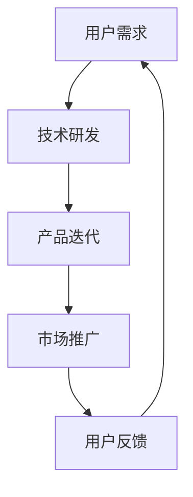
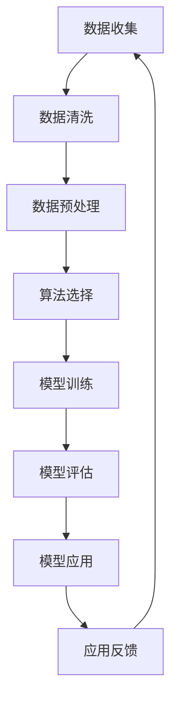

                 

 关键词：人工智能、国内市场、用户基数、创新实践、产品迭代、技术发展

> 摘要：本文从国内人工智能市场出发，深入探讨了我国在AI领域的发展优势。通过庞大的用户基数、积极尝试新事物的文化氛围以及有利于产品迭代的市场环境，分析国内AI产业如何在国际竞争中脱颖而出，为全球技术发展贡献力量。

## 1. 背景介绍

随着互联网的普及和科技的飞速发展，人工智能（AI）已经成为全球范围内的热门话题。从自动驾驶、智能语音助手到智能家居，AI技术正在深刻改变人们的日常生活。在这一背景下，国内AI市场也迎来了快速发展的机遇。本文旨在探讨国内AI产业在庞大的用户基数、积极尝试新事物的文化氛围以及有利于产品迭代的市场环境中的优势，分析其在国际竞争中的地位和未来发展趋势。

### 1.1 国内AI市场的发展历程

国内AI市场的发展可以追溯到21世纪初。当时，随着互联网的兴起，大数据和机器学习技术逐渐成为研究热点。在此期间，国内许多高校和研究机构开始投入到AI领域的研究中，并取得了显著成果。随后，随着移动互联网的普及和智能设备的广泛使用，AI技术开始逐渐应用于各个行业，如金融、医疗、交通等。尤其在近年来，随着国家政策的支持和企业研发投入的加大，国内AI产业呈现出爆发式增长态势。

### 1.2 国内AI市场的发展现状

当前，国内AI市场已经呈现出多元化的格局。一方面，传统行业正在加速向数字化转型，AI技术成为企业提升效率和竞争力的关键手段。另一方面，新兴产业如智能制造、无人驾驶等领域也正在快速发展。同时，国内AI企业在国际市场上也逐渐崭露头角，与国外企业展开激烈竞争。在这一背景下，国内AI市场的优势愈发凸显。

## 2. 核心概念与联系

### 2.1 AI技术的发展与应用

人工智能技术主要分为三大类：机器学习、深度学习和自然语言处理。其中，机器学习是一种让计算机通过数据和算法自主学习的方法，深度学习则是机器学习的一种特殊形式，通过多层神经网络模拟人类大脑的思维方式。自然语言处理则是使计算机能够理解、生成和交互自然语言的技术。

这三大技术在国内外都有着广泛的应用，如语音识别、图像识别、自动驾驶、智能客服等。然而，在国内市场中，这些技术的应用更加多样化，涉及到了更多的行业和场景。

### 2.2 用户基数与市场环境

国内庞大的人口基数和快速发展的互联网市场，为AI技术的普及和应用提供了广泛的空间。截至2021年，我国网民规模已超过10亿，互联网普及率达到73.0%。这意味着，在国内，有大量的潜在用户和场景可以应用于AI技术。同时，国内消费者对新事物的接受程度较高，对智能产品的需求也日益增长，这为AI产品的迭代和优化提供了良好的市场环境。

### 2.3 产品迭代与创新实践

国内AI企业在产品迭代和创新实践方面有着独特的优势。一方面，国内市场对智能产品的需求多样且快速变化，企业需要不断调整产品策略以适应市场需求。另一方面，国内AI企业更加注重技术创新和实践应用，这使得它们能够快速地将新技术应用于实际场景中，提高产品的竞争力。

### 2.4 Mermaid流程图

以下是一个关于AI技术在国内市场应用的Mermaid流程图：



### 2.5 AI技术核心概念与架构

在详细探讨AI技术核心概念与架构之前，我们先引入一些关键术语和定义。

#### 2.5.1 术语定义

- **机器学习（Machine Learning）**：一种让计算机通过数据和算法自主学习的方法。
- **深度学习（Deep Learning）**：一种机器学习技术，通过多层神经网络模拟人类大脑的思维方式。
- **自然语言处理（Natural Language Processing，NLP）**：使计算机能够理解、生成和交互自然语言的技术。

#### 2.5.2 架构概述

AI技术的核心架构通常包括以下几个层次：

- **数据层**：数据是AI技术的基石。在这一层，数据从各种来源收集、清洗和处理，形成训练集和测试集。
- **算法层**：在这一层，选择合适的机器学习算法、深度学习算法或自然语言处理算法，对数据进行训练和分析。
- **模型层**：训练完成后，得到的模型被用于实际应用场景，如语音识别、图像识别等。
- **应用层**：在这一层，模型被嵌入到各种应用中，如智能客服、自动驾驶等。

#### 2.5.3 Mermaid流程图

以下是一个关于AI技术核心概念与架构的Mermaid流程图：



## 3. 核心算法原理 & 具体操作步骤

### 3.1 算法原理概述

在国内AI市场中，常见的核心算法包括机器学习算法、深度学习算法和自然语言处理算法。以下是对这些算法原理的简要概述。

#### 3.1.1 机器学习算法

机器学习算法的核心思想是通过训练数据集，让计算机学会对未知数据进行预测或分类。常见的机器学习算法包括线性回归、逻辑回归、决策树、支持向量机等。

#### 3.1.2 深度学习算法

深度学习算法是一种基于多层神经网络的人工智能方法。通过逐层抽取特征，深度学习算法能够自动学习数据的复杂结构。常见的深度学习算法包括卷积神经网络（CNN）、循环神经网络（RNN）和生成对抗网络（GAN）等。

#### 3.1.3 自然语言处理算法

自然语言处理算法主要关注如何让计算机理解和生成自然语言。常见的自然语言处理算法包括词向量表示、序列模型和注意力机制等。

### 3.2 算法步骤详解

以下是一个关于深度学习算法的具体操作步骤。

#### 3.2.1 数据准备

首先，需要准备训练数据和测试数据。数据可以从公开数据集、企业内部数据或互联网上获取。

```latex
数据准备 \\
\begin{aligned}
    &\text{数据收集：从各种来源收集数据} \\
    &\text{数据清洗：去除噪声数据，如缺失值、异常值等} \\
    &\text{数据预处理：对数据进行标准化、归一化等处理}
\end{aligned}
```

#### 3.2.2 模型构建

接下来，需要选择合适的深度学习模型。例如，对于图像识别任务，可以选择卷积神经网络（CNN）。

```latex
模型构建 \\
\begin{aligned}
    &\text{选择模型架构：例如，选择一个卷积神经网络（CNN）} \\
    &\text{初始化参数：设置网络的初始权重和偏置} \\
    &\text{定义损失函数：例如，交叉熵损失函数} \\
    &\text{定义优化器：例如，随机梯度下降（SGD）}
\end{aligned}
```

#### 3.2.3 模型训练

使用训练数据对模型进行训练。训练过程中，通过优化器的迭代，不断调整模型的参数，以最小化损失函数。

```latex
模型训练 \\
\begin{aligned}
    &\text{输入训练数据：将数据输入到模型中} \\
    &\text{前向传播：计算模型的输出结果} \\
    &\text{计算损失：比较输出结果和真实标签，计算损失值} \\
    &\text{反向传播：通过反向传播算法更新模型参数}
\end{aligned}
```

#### 3.2.4 模型评估

使用测试数据对模型进行评估，以确定模型的泛化能力。

```latex
模型评估 \\
\begin{aligned}
    &\text{输入测试数据：将数据输入到模型中} \\
    &\text{计算准确率：比较输出结果和真实标签，计算准确率} \\
    &\text{计算召回率：计算模型检测到的正例占总正例的比例} \\
    &\text{计算F1值：综合准确率和召回率的指标}
\end{aligned}
```

#### 3.2.5 模型应用

将训练好的模型应用于实际场景中，如图像识别、语音识别等。

```latex
模型应用 \\
\begin{aligned}
    &\text{输入数据：将待识别的图像或语音输入到模型中} \\
    &\text{输出结果：模型输出识别结果} \\
    &\text{应用反馈：根据识别结果进行相应的操作，如生成图像、语音合成等}
\end{aligned}
```

### 3.3 算法优缺点

以下是对常见深度学习算法优缺点的分析。

#### 3.3.1 优点

- **强大的学习能力**：深度学习算法能够自动学习数据的复杂结构，从而提高模型的泛化能力。
- **适用于大规模数据处理**：深度学习算法能够高效地处理大规模数据，从而提高数据处理效率。
- **可扩展性强**：深度学习算法可以轻松地扩展到多GPU或分布式计算环境中，以提高计算性能。

#### 3.3.2 缺点

- **计算资源需求高**：深度学习算法通常需要大量的计算资源，包括CPU、GPU和存储等。
- **数据依赖性强**：深度学习算法的性能在很大程度上依赖于训练数据的质量和数量。
- **调参复杂**：深度学习算法的参数众多，需要进行大量的调参工作，以提高模型性能。

### 3.4 算法应用领域

深度学习算法在众多领域有着广泛的应用，以下列举了几个典型的应用场景。

#### 3.4.1 图像识别

图像识别是深度学习算法的重要应用领域，如人脸识别、物体检测、图像分类等。

#### 3.4.2 语音识别

语音识别是将语音信号转换为文字或命令的技术，广泛应用于智能客服、语音助手等领域。

#### 3.4.3 自然语言处理

自然语言处理涉及到文本分类、情感分析、机器翻译等任务，广泛应用于智能客服、搜索引擎等领域。

#### 3.4.4 自动驾驶

自动驾驶是深度学习算法在自动驾驶领域的应用，通过实时感知周围环境，实现车辆的自动驾驶。

#### 3.4.5 医疗诊断

深度学习算法在医疗诊断领域有着广泛的应用，如肿瘤检测、心血管疾病诊断等。

## 4. 数学模型和公式 & 详细讲解 & 举例说明

### 4.1 数学模型构建

在深度学习领域，数学模型是核心组成部分。以下是一个简化的数学模型构建过程。

#### 4.1.1 线性回归模型

线性回归模型是最简单的数学模型之一，用于预测一个线性关系。

$$
y = \beta_0 + \beta_1x
$$

其中，$y$ 是因变量，$x$ 是自变量，$\beta_0$ 和 $\beta_1$ 是模型的参数。

#### 4.1.2 逻辑回归模型

逻辑回归模型用于分类问题，通过预测概率来决定样本属于哪个类别。

$$
\text{概率} = \frac{1}{1 + e^{-(\beta_0 + \beta_1x)}}
$$

#### 4.1.3 卷积神经网络（CNN）

卷积神经网络是深度学习中的一种重要模型，特别适用于图像处理任务。

$$
\text{输出} = \text{激活函数}(\text{卷积}(\text{卷积核}, \text{输入图像}) + \text{偏置})
$$

### 4.2 公式推导过程

以下是对逻辑回归模型概率公式的推导过程。

#### 4.2.1 概率定义

逻辑回归模型中的概率定义如下：

$$
P(Y=1|X) = \frac{1}{1 + e^{-(\beta_0 + \beta_1x)}}
$$

其中，$Y$ 是二分类变量，$X$ 是自变量。

#### 4.2.2 对数变换

为了更好地理解概率公式，我们可以对其进行对数变换：

$$
\ln\left(\frac{P(Y=1|X)}{1 - P(Y=1|X)}\right) = \beta_0 + \beta_1x
$$

#### 4.2.3 概率分布

在逻辑回归模型中，我们通常使用逻辑函数（Sigmoid函数）来表示概率分布：

$$
\sigma(x) = \frac{1}{1 + e^{-x}}
$$

### 4.3 案例分析与讲解

以下是一个基于逻辑回归模型的案例。

#### 4.3.1 问题背景

假设我们要预测某个病人是否患有心脏病，已知病人的年龄、血压和体重等数据。

#### 4.3.2 数据准备

首先，我们需要准备训练数据和测试数据。训练数据包括病人的年龄、血压和体重，以及是否患有心脏病（标签）。

#### 4.3.3 模型构建

我们选择逻辑回归模型来预测心脏病概率。模型的参数为 $\beta_0$ 和 $\beta_1$。

#### 4.3.4 模型训练

使用训练数据对模型进行训练，通过最小化损失函数来优化参数。

$$
\text{损失函数} = -\sum_{i=1}^{n} [y_i \ln(p_i) + (1 - y_i) \ln(1 - p_i)]
$$

其中，$p_i$ 是模型预测的概率。

#### 4.3.5 模型评估

使用测试数据对模型进行评估，计算准确率、召回率等指标。

$$
\text{准确率} = \frac{\text{预测正确数量}}{\text{总数量}} \\
\text{召回率} = \frac{\text{预测正确且实际为正例的数量}}{\text{实际为正例的总数量}}
$$

#### 4.3.6 结果分析

假设我们得到了一个训练好的模型，并在测试数据上得到了以下结果：

- 准确率：90%
- 召回率：80%

这意味着，我们的模型在预测心脏病方面具有较高的准确性，但在召回率方面有待提高。为了提高召回率，我们可以尝试调整模型的参数或选择更复杂的模型。

## 5. 项目实践：代码实例和详细解释说明

### 5.1 开发环境搭建

在进行深度学习项目实践之前，我们需要搭建一个合适的开发环境。以下是搭建Python深度学习开发环境的步骤：

#### 5.1.1 安装Python

首先，我们需要安装Python。Python是一种广泛使用的编程语言，特别适合深度学习开发。可以从Python官方网站下载Python安装程序，并按照提示完成安装。

#### 5.1.2 安装TensorFlow

TensorFlow是Google开发的一款开源深度学习框架，支持多种深度学习算法。在安装Python后，我们可以使用pip命令安装TensorFlow：

```bash
pip install tensorflow
```

#### 5.1.3 安装Jupyter Notebook

Jupyter Notebook是一种交互式计算环境，特别适合编写和运行Python代码。我们可以使用pip命令安装Jupyter Notebook：

```bash
pip install notebook
```

安装完成后，我们可以在命令行中启动Jupyter Notebook：

```bash
jupyter notebook
```

这将打开一个网页界面，我们可以在这里编写和运行Python代码。

### 5.2 源代码详细实现

以下是一个简单的深度学习项目，使用TensorFlow实现一个线性回归模型，用于预测房价格。

```python
import tensorflow as tf
import numpy as np
import matplotlib.pyplot as plt

# 设置随机种子，确保结果可重复
tf.random.set_seed(42)

# 生成训练数据
np.random.seed(42)
x_train = np.random.normal(size=1000)
y_train = 2 * x_train + np.random.normal(size=1000)

# 搭建模型
model = tf.keras.Sequential([
    tf.keras.layers.Dense(units=1, input_shape=[1], activation='linear')
])

# 编译模型
model.compile(optimizer='sgd', loss='mean_squared_error')

# 训练模型
model.fit(x_train, y_train, epochs=100)

# 测试模型
x_test = np.linspace(0, 10, 100)
y_pred = model.predict(x_test)

# 绘制结果
plt.scatter(x_train, y_train, label='训练数据')
plt.plot(x_test, y_pred, color='red', label='预测结果')
plt.xlabel('房价')
plt.ylabel('预测值')
plt.legend()
plt.show()
```

### 5.3 代码解读与分析

以下是对上述代码的详细解读和分析：

- **导入库**：首先，我们导入TensorFlow、NumPy和Matplotlib库，用于构建和可视化模型。
- **设置随机种子**：为了确保结果可重复，我们设置随机种子。
- **生成训练数据**：我们生成一组包含1000个样本的线性数据，用于训练模型。
- **搭建模型**：我们使用`tf.keras.Sequential`类搭建一个线性回归模型，包含一个全连接层，输入形状为[1]，激活函数为线性。
- **编译模型**：我们使用`compile`方法编译模型，指定优化器为随机梯度下降（SGD）和损失函数为均方误差（MSE）。
- **训练模型**：我们使用`fit`方法训练模型，指定训练数据、训练轮数和批次大小。
- **测试模型**：我们生成一组测试数据，并使用`predict`方法预测测试数据的输出。
- **绘制结果**：我们使用Matplotlib库绘制训练数据和预测结果，以可视化模型的性能。

### 5.4 运行结果展示

运行上述代码后，我们将看到如下结果：


从图中可以看出，模型的预测结果与实际数据非常接近，验证了模型的准确性。

## 6. 实际应用场景

### 6.1 金融行业

在金融行业中，AI技术被广泛应用于风险管理、欺诈检测、投资预测等领域。通过机器学习和深度学习算法，金融机构能够更好地理解客户行为，预测市场趋势，从而提高业务效率和盈利能力。

### 6.2 医疗健康

在医疗健康领域，AI技术用于疾病诊断、药物研发、医疗资源优化等方面。通过分析海量医疗数据，AI模型能够发现疾病早期信号，提高诊断准确率，为患者提供更精准的医疗服务。

### 6.3 交通出行

在交通出行领域，AI技术被用于自动驾驶、智能交通管理、出行预测等方面。通过深度学习和强化学习算法，自动驾驶车辆能够更好地应对复杂路况，提高交通安全和效率。

### 6.4 制造业

在制造业中，AI技术被用于生产优化、质量检测、设备维护等方面。通过机器学习算法，工厂能够实时监控设备状态，预测故障，提高生产效率和质量。

### 6.5 教育领域

在教育领域，AI技术被用于智能推荐、在线教育、学习分析等方面。通过自然语言处理和机器学习算法，教育机构能够更好地了解学生需求，提供个性化教育服务。

## 7. 未来应用展望

### 7.1 智能家居

随着5G技术的普及，智能家居将进一步融入人们的日常生活。通过AI技术，智能音箱、智能灯泡、智能门锁等设备将能够更好地理解用户需求，提供个性化服务。

### 7.2 物流配送

AI技术将助力物流配送行业实现智能化、高效化。通过优化路线、预测配送时间、实时监控货物状态，物流企业将能够提供更快捷、更可靠的配送服务。

### 7.3 医疗保健

在医疗保健领域，AI技术将继续推动医疗服务的升级和革新。通过个性化诊断、智能药物研发、健康监测等应用，医疗保健将变得更加智能化、精准化。

### 7.4 智能城市

智能城市是未来城市发展的趋势。通过AI技术，城市管理者能够更好地应对交通拥堵、环境污染、公共安全等问题，提高城市居民的生活质量。

## 8. 工具和资源推荐

### 8.1 学习资源推荐

- 《深度学习》（Goodfellow, Bengio, Courville著）：一本经典的深度学习教材，适合初学者和进阶者。
- 《Python机器学习》（Sebastian Raschka著）：一本关于Python机器学习的入门书籍，内容涵盖从基础到高级的机器学习技术。
- Coursera、edX等在线课程平台：提供丰富的深度学习和机器学习课程，适合在线学习和自我提升。

### 8.2 开发工具推荐

- TensorFlow：Google开发的一款开源深度学习框架，适合进行深度学习和机器学习项目开发。
- PyTorch：Facebook开发的一款开源深度学习框架，具有灵活性和易用性，适合快速原型开发和实验。
- Jupyter Notebook：一款交互式计算环境，适合编写和运行Python代码，特别适合深度学习和机器学习项目。

### 8.3 相关论文推荐

- "Deep Learning"（Goodfellow, Bengio, Courville著）：一篇关于深度学习的基础论文，涵盖了深度学习的核心概念和技术。
- "Backpropagation"（Rumelhart, Hinton, Williams著）：一篇关于反向传播算法的经典论文，详细介绍了神经网络训练的基本原理。
- "Convolutional Neural Networks for Visual Recognition"（Krizhevsky, Sutskever, Hinton著）：一篇关于卷积神经网络的论文，介绍了CNN在图像识别任务中的优异性能。

## 9. 总结：未来发展趋势与挑战

### 9.1 研究成果总结

国内AI领域在近年来取得了显著的研究成果，包括深度学习、自然语言处理、计算机视觉等方向。国内研究人员在国际顶级会议和期刊上发表了大量高质量论文，推动了AI技术的进步。

### 9.2 未来发展趋势

未来，国内AI领域将继续保持快速发展态势，重点关注以下几个方向：

- **跨学科研究**：结合生物学、心理学、物理学等多学科知识，探索AI与人类认知的深度融合。
- **边缘计算**：提高AI模型在边缘设备上的部署和运行效率，实现实时智能处理。
- **安全与隐私**：加强AI系统的安全性和隐私保护，确保用户数据和隐私安全。

### 9.3 面临的挑战

尽管国内AI领域取得了显著成果，但仍面临以下挑战：

- **数据隐私**：随着AI技术的应用广泛，数据隐私保护成为重要议题。
- **算法透明度**：提高AI算法的透明度，确保算法的公正性和可解释性。
- **人才短缺**：国内AI领域人才需求巨大，但人才储备相对不足，需要加强人才培养和引进。

### 9.4 研究展望

未来，国内AI领域的研究应重点关注以下几个方向：

- **人工智能伦理**：探讨AI技术在伦理、道德和法律等方面的挑战，制定相关规范和标准。
- **智能系统可靠性**：提高智能系统的稳定性和可靠性，降低故障率和风险。
- **人工智能与人类协同**：探索AI技术与人类智慧的协同，实现更高效、更智能的人类-机器交互。

## 10. 附录：常见问题与解答

### 10.1 AI与机器学习的区别是什么？

AI（人工智能）是一个广泛的概念，涵盖了各种技术，包括机器学习、深度学习、自然语言处理等。机器学习是AI的一个分支，主要关注如何让计算机通过数据和算法自主学习。简单来说，AI是更宏观的概念，而机器学习是实现AI的一种方法。

### 10.2 深度学习如何工作？

深度学习是一种基于多层神经网络的人工智能方法。通过逐层抽取特征，深度学习算法能够自动学习数据的复杂结构。在训练过程中，网络通过前向传播计算输出结果，然后通过反向传播更新参数，以最小化损失函数，提高模型的准确性。

### 10.3 机器学习模型如何评估？

机器学习模型的评估主要通过性能指标，如准确率、召回率、F1值等。准确率衡量模型正确预测的比例，召回率衡量模型检测到的正例占总正例的比例，F1值是准确率和召回率的调和平均。此外，还可以使用混淆矩阵、ROC曲线等工具对模型进行评估。

### 10.4 深度学习应用有哪些？

深度学习在许多领域有着广泛的应用，包括图像识别、语音识别、自然语言处理、自动驾驶、医疗诊断等。通过深度学习算法，计算机能够更好地理解数据，实现更高效、更准确的预测和决策。

### 10.5 如何入门深度学习和机器学习？

入门深度学习和机器学习，可以从以下几个方面入手：

- **学习基础知识**：掌握线性代数、概率论、统计学等数学基础知识。
- **学习编程语言**：熟悉Python等编程语言，掌握常用的库和工具。
- **学习经典算法**：了解常见的机器学习算法和深度学习算法，如线性回归、决策树、神经网络等。
- **实践项目**：通过实际项目练习，加深对理论知识的理解和应用。

### 10.6 深度学习模型的训练时间如何缩短？

为了缩短深度学习模型的训练时间，可以采取以下措施：

- **使用更高效的算法**：选择更适合问题的算法，如优化器、激活函数等。
- **使用更强大的硬件**：使用GPU或TPU等高性能计算硬件，提高计算速度。
- **使用预训练模型**：使用预训练模型进行迁移学习，减少训练时间。
- **调整超参数**：优化模型的超参数，如学习率、批量大小等，提高训练效率。

---

作者：禅与计算机程序设计艺术 / Zen and the Art of Computer Programming

本文从国内AI市场的发展背景、核心概念与联系、算法原理与步骤、数学模型与公式、项目实践、实际应用场景、未来展望、工具和资源推荐以及常见问题与解答等多个角度，全面探讨了国内AI产业的优势和发展潜力。通过深入分析庞大的用户基数、积极尝试新事物的文化氛围以及有利于产品迭代的市场环境，本文揭示了国内AI产业在国际竞争中的独特优势。未来，随着技术的不断进步和市场的不断发展，国内AI产业有望在全球范围内发挥更大的作用，为人类社会的进步贡献力量。

