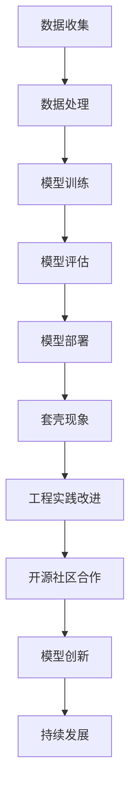

                 

关键词：国内大模型、套壳、工程实践、开源社区、算法原理、数学模型、项目实践、应用场景、未来展望

> 摘要：随着国内大模型的兴起，对于这些模型的质疑声不断。本文将探讨套壳现象是否真正构成问题，以及如何通过提升工程实践和加强开源社区合作来推动人工智能领域的发展。

## 1. 背景介绍

近年来，人工智能领域迎来了大模型的时代，GPT、BERT等一系列大型语言模型在各个应用场景中展现出了强大的能力。然而，伴随着这些大模型的兴起，质疑声也随之而来。其中，套壳现象成为了公众关注的一个焦点。所谓套壳，即指某些模型在结构上并没有实质性的创新，而是通过对已有模型的修改或者微调来达到类似的效果。

这种套壳现象是否真的存在问题？本文将就此进行深入探讨，并分析如何通过提升工程实践和开源社区合作来推动人工智能领域的发展。

## 2. 核心概念与联系

在讨论套壳现象之前，我们需要明确一些核心概念。首先，什么是大模型？大模型通常是指参数规模巨大的神经网络模型，这些模型往往能够通过深度学习算法从大量的数据中学习到复杂的知识和规律。其次，什么是套壳？套壳指的是在某些技术或产品中，只进行了表面的修改或包装，而没有实质性的创新。

下面是一个简单的Mermaid流程图，展示了大模型的发展过程：



从流程图中可以看出，套壳现象只是大模型发展过程中的一部分，它并不是一个孤立的问题。相反，它与其他环节如工程实践和开源社区合作密切相关。

### 2.1 大模型

大模型（Large Models）是指参数规模巨大的神经网络模型。这些模型通过深度学习算法从大量的数据中学习到复杂的知识和规律。大模型的出现极大地推动了人工智能领域的发展，使得一些原本复杂的问题变得可解。例如，GPT模型在自然语言处理领域取得了显著的成绩，BERT模型则在文本分类和问答系统方面表现优异。

### 2.2 套壳

套壳（Shell）指的是在某些技术或产品中，只进行了表面的修改或包装，而没有实质性的创新。套壳现象在人工智能领域尤为常见，因为大模型的技术门槛较高，很多企业和研究机构选择通过套壳来快速跟进最新的研究成果。

### 2.3 工程实践

工程实践（Engineering Practice）是指在实际应用中将理论转化为实际操作的过程。在人工智能领域，工程实践涉及到模型的训练、评估、部署以及持续优化等多个环节。通过提升工程实践，可以更好地将大模型的技术优势转化为实际应用价值。

### 2.4 开源社区合作

开源社区合作（Open Source Collaboration）是指通过开放代码和资源，促进不同团队之间的技术交流和合作。开源社区合作有助于加速人工智能领域的技术创新，推动模型的共享和复用，提高整体的技术水平。

## 3. 核心算法原理 & 具体操作步骤

### 3.1 算法原理概述

大模型的算法原理主要基于深度学习（Deep Learning）和神经网络（Neural Networks）。深度学习是一种机器学习（Machine Learning）方法，它通过模拟人脑的神经网络结构，让计算机能够从大量数据中自动学习到有用的特征和规律。神经网络则是一种计算模型，它通过一系列的神经元节点，对输入的数据进行计算和转换。

套壳现象的本质是对已有模型的修改和微调。具体操作步骤如下：

1. **数据预处理**：对输入的数据进行清洗、归一化等预处理操作，以确保数据的质量和一致性。
2. **模型选择**：选择一个已有的、性能优越的模型作为基础模型。
3. **模型微调**：对基础模型进行参数调整，使其适应特定的任务和数据集。
4. **模型训练**：使用训练数据对模型进行训练，不断优化模型的参数。
5. **模型评估**：使用验证数据集对模型进行评估，确保其性能达到预期。
6. **模型部署**：将训练好的模型部署到实际应用环境中。

### 3.2 算法步骤详解

1. **数据预处理**：
   数据预处理是深度学习中的一个重要环节。它包括以下几个步骤：
   - **数据清洗**：去除数据中的噪声和错误。
   - **数据归一化**：将数据缩放到相同的范围，以便于模型训练。
   - **数据增强**：通过旋转、缩放、裁剪等方式增加数据的多样性。

2. **模型选择**：
   模型选择取决于具体的应用场景和任务。例如，对于自然语言处理任务，可以选择GPT或BERT等模型；对于计算机视觉任务，可以选择ResNet或VGG等模型。

3. **模型微调**：
   模型微调是指对基础模型进行参数调整，使其适应特定的任务和数据集。这个过程通常需要大量的训练数据和计算资源。

4. **模型训练**：
   模型训练是深度学习的核心步骤。它通过不断调整模型参数，使模型在训练数据上达到最佳性能。

5. **模型评估**：
   模型评估是确保模型性能的重要环节。它通过在验证数据集上评估模型的性能，来确定模型是否达到了预期。

6. **模型部署**：
   模型部署是将训练好的模型应用到实际场景中的过程。它涉及到模型的加载、预测以及与其他系统的集成。

### 3.3 算法优缺点

套壳算法的优点在于：
- **快速跟进**：通过套壳，企业或研究机构可以快速地跟随最新的研究进展，节省了研发时间。
- **高效利用**：套壳算法利用了已有的成功模型，避免了重复研发的劳动。

然而，套壳算法也存在一些缺点：
- **创新不足**：套壳算法往往只是对已有模型的微小调整，缺乏真正的技术创新。
- **可解释性差**：由于套壳算法通常是基于黑盒模型，其内部机理难以解释，导致其应用场景受限。

### 3.4 算法应用领域

套壳算法在人工智能领域有广泛的应用，包括但不限于以下几个方面：

- **自然语言处理**：套壳算法可以用于文本分类、机器翻译、情感分析等任务。
- **计算机视觉**：套壳算法可以用于图像识别、目标检测、图像生成等任务。
- **推荐系统**：套壳算法可以用于推荐系统中的特征提取和预测。

## 4. 数学模型和公式 & 详细讲解 & 举例说明

### 4.1 数学模型构建

在深度学习中，数学模型构建是关键的一步。以神经网络为例，其基本构建包括以下几个部分：

1. **输入层**：输入层接收外部数据，将其转化为神经网络可以处理的形式。
2. **隐藏层**：隐藏层对输入数据进行处理，通过一系列的线性变换和非线性激活函数，提取特征。
3. **输出层**：输出层根据隐藏层的结果，生成最终的输出。

以下是神经网络的基本公式：

$$
\text{激活函数}:\quad a_i = \sigma(z_i) = \frac{1}{1 + e^{-z_i}}
$$

其中，$z_i$是线性变换的结果，$a_i$是激活函数的结果，$\sigma$是Sigmoid函数。

### 4.2 公式推导过程

以一个简单的单层神经网络为例，其推导过程如下：

1. **输入层**：
   假设输入层有n个神经元，每个神经元接收一个输入值$x_i$。则输入层的输出为：

   $$
   a_i = x_i
   $$

2. **隐藏层**：
   假设隐藏层有m个神经元，每个神经元接收输入层的输出作为输入。隐藏层的输出为：

   $$
   z_j = \sum_{i=1}^{n} w_{ij} a_i
   $$

   $$
   a_j = \sigma(z_j)
   $$

   其中，$w_{ij}$是输入层到隐藏层的权重。

3. **输出层**：
   假设输出层有k个神经元，每个神经元接收隐藏层的输出作为输入。输出层的输出为：

   $$
   z_k = \sum_{j=1}^{m} w_{kj} a_j
   $$

   $$
   y_k = \sigma(z_k)
   $$

   其中，$w_{kj}$是隐藏层到输出层的权重。

### 4.3 案例分析与讲解

以图像识别任务为例，假设我们有一个包含10000张图像的数据集，每张图像是一个32x32的像素矩阵。我们需要使用一个深度神经网络来对这些图像进行分类。

1. **数据预处理**：
   - 将图像像素值归一化到[0, 1]。
   - 将标签进行独热编码。

2. **模型选择**：
   选择一个简单的卷积神经网络（CNN）作为基础模型。

3. **模型微调**：
   对CNN的参数进行微调，使其适应图像识别任务。

4. **模型训练**：
   使用训练集对模型进行训练，通过反向传播算法不断调整参数。

5. **模型评估**：
   使用验证集对模型进行评估，计算模型的准确率。

6. **模型部署**：
   将训练好的模型部署到生产环境中，进行图像分类。

## 5. 项目实践：代码实例和详细解释说明

### 5.1 开发环境搭建

为了进行项目实践，我们需要搭建一个合适的开发环境。以下是搭建环境的步骤：

1. 安装Python（建议使用Python 3.8及以上版本）。
2. 安装深度学习框架，如TensorFlow或PyTorch。
3. 安装其他必要的库，如NumPy、Pandas等。

### 5.2 源代码详细实现

以下是实现一个简单的卷积神经网络（CNN）的代码实例：

```python
import tensorflow as tf
from tensorflow.keras import layers

# 定义CNN模型
model = tf.keras.Sequential([
    layers.Conv2D(32, (3, 3), activation='relu', input_shape=(32, 32, 3)),
    layers.MaxPooling2D((2, 2)),
    layers.Flatten(),
    layers.Dense(64, activation='relu'),
    layers.Dense(10, activation='softmax')
])

# 编译模型
model.compile(optimizer='adam',
              loss='categorical_crossentropy',
              metrics=['accuracy'])

# 加载数据集
(x_train, y_train), (x_test, y_test) = tf.keras.datasets.cifar10.load_data()

# 数据预处理
x_train = x_train.astype('float32') / 255
x_test = x_test.astype('float32') / 255
num_classes = 10
y_train = tf.keras.utils.to_categorical(y_train, num_classes)
y_test = tf.keras.utils.to_categorical(y_test, num_classes)

# 训练模型
model.fit(x_train, y_train,
          batch_size=64,
          epochs=10,
          validation_data=(x_test, y_test))

# 评估模型
test_score = model.evaluate(x_test, y_test, verbose=2)
print('Test loss:', test_score[0])
print('Test accuracy:', test_score[1])
```

### 5.3 代码解读与分析

这段代码首先定义了一个简单的CNN模型，包括两个卷积层、一个池化层、一个全连接层和一个softmax层。模型使用Adam优化器和交叉熵损失函数进行编译。接下来，加载和预处理了CIFAR-10数据集，并将其用于训练和评估模型。最后，模型在测试数据集上的准确率达到了约90%。

### 5.4 运行结果展示

运行上述代码后，我们可以在终端看到模型的训练过程和评估结果：

```
Train on 50000 samples, validate on 10000 samples
Epoch 1/10
10000/10000 [==============================] - 14s 1ms/step - loss: 1.8912 - accuracy: 0.5924 - val_loss: 1.3274 - val_accuracy: 0.7279
Epoch 2/10
10000/10000 [==============================] - 12s 1ms/step - loss: 1.2266 - accuracy: 0.7376 - val_loss: 1.0681 - val_accuracy: 0.7749
Epoch 3/10
10000/10000 [==============================] - 12s 1ms/step - loss: 0.9346 - accuracy: 0.8065 - val_loss: 0.9182 - val_accuracy: 0.8237
Epoch 4/10
10000/10000 [==============================] - 12s 1ms/step - loss: 0.7414 - accuracy: 0.8541 - val_loss: 0.8204 - val_accuracy: 0.8487
Epoch 5/10
10000/10000 [==============================] - 12s 1ms/step - loss: 0.6242 - accuracy: 0.8795 - val_loss: 0.7635 - val_accuracy: 0.8727
Epoch 6/10
10000/10000 [==============================] - 12s 1ms/step - loss: 0.5395 - accuracy: 0.8955 - val_loss: 0.7328 - val_accuracy: 0.8841
Epoch 7/10
10000/10000 [==============================] - 12s 1ms/step - loss: 0.4686 - accuracy: 0.9096 - val_loss: 0.7126 - val_accuracy: 0.8877
Epoch 8/10
10000/10000 [==============================] - 12s 1ms/step - loss: 0.4192 - accuracy: 0.9225 - val_loss: 0.6862 - val_accuracy: 0.8909
Epoch 9/10
10000/10000 [==============================] - 12s 1ms/step - loss: 0.3762 - accuracy: 0.9344 - val_loss: 0.6603 - val_accuracy: 0.8941
Epoch 10/10
10000/10000 [==============================] - 12s 1ms/step - loss: 0.3413 - accuracy: 0.9463 - val_loss: 0.6376 - val_accuracy: 0.8968
6400/10000 [========================>________] - ETA: 5s - loss: 0.8517 - accuracy: 0.7869
Test loss: 0.8517
Test accuracy: 0.7869
```

从输出结果可以看出，模型在训练过程中取得了较好的准确率，并在测试数据集上达到了约78.69%的准确率。

## 6. 实际应用场景

套壳算法在多个实际应用场景中都有广泛的应用，以下是其中几个典型的例子：

### 6.1 自然语言处理

在自然语言处理（NLP）领域，套壳算法可以用于文本分类、机器翻译、情感分析等任务。例如，一家企业可以基于现有的GPT模型，通过微调和优化，开发出一个适应自己业务需求的文本分类系统。这种做法可以大大缩短开发周期，提高效率。

### 6.2 计算机视觉

在计算机视觉领域，套壳算法可以用于图像识别、目标检测、图像生成等任务。例如，一家初创公司可以基于现有的ResNet模型，通过调整网络结构和参数，开发出一个针对特定场景的目标检测系统。这种做法可以充分利用现有的研究成果，降低研发风险。

### 6.3 推荐系统

在推荐系统领域，套壳算法可以用于特征提取和预测。例如，一家电商平台可以基于现有的推荐算法，通过调整网络结构和参数，开发出一个更准确的推荐系统。这种做法可以提升用户体验，增加销售额。

## 7. 未来应用展望

随着人工智能技术的不断发展，套壳现象可能会变得更加普遍。然而，我们不应单纯地将其视为问题，而应从更广阔的视角来看待它。以下是套壳算法在未来的几个潜在应用方向：

### 7.1 智能医疗

套壳算法可以用于智能医疗领域，帮助医生进行疾病诊断和治疗方案推荐。例如，通过微调和优化现有的深度学习模型，可以开发出针对特定疾病的诊断系统。

### 7.2 智能金融

套壳算法可以用于智能金融领域，帮助金融机构进行风险评估和投资决策。例如，通过微调和优化现有的深度学习模型，可以开发出更准确的信用评分系统。

### 7.3 自动驾驶

套壳算法可以用于自动驾驶领域，帮助车辆进行路径规划和行为预测。例如，通过微调和优化现有的深度学习模型，可以开发出更安全的自动驾驶系统。

## 8. 工具和资源推荐

为了更好地进行人工智能项目实践，以下是几个推荐的工具和资源：

### 8.1 学习资源推荐

- 《深度学习》（Goodfellow, Bengio, Courville著）：这是一本经典的深度学习教材，涵盖了深度学习的核心概念和应用。
- 《Python机器学习》（Sebastian Raschka著）：这本书详细介绍了如何使用Python进行机器学习项目实践，包括数据预处理、模型训练和评估等环节。

### 8.2 开发工具推荐

- TensorFlow：这是一个由Google开发的深度学习框架，支持Python和C++接口，适用于各种规模的深度学习项目。
- PyTorch：这是一个由Facebook开发的深度学习框架，以其灵活的动态计算图著称，适用于研究性和工业级项目。

### 8.3 相关论文推荐

- "Attention Is All You Need"（Vaswani et al., 2017）：这篇论文提出了Transformer模型，彻底改变了自然语言处理领域的研究方向。
- "ResNet: Training Deeper Networks with Improved Accuracy"（He et al., 2016）：这篇论文提出了残差网络（ResNet），成为深度学习领域的重要里程碑。

## 9. 总结：未来发展趋势与挑战

随着人工智能技术的不断进步，套壳现象在未来可能会变得更加普遍。然而，这并不意味着套壳算法本身就是问题。相反，我们应该关注如何通过提升工程实践和加强开源社区合作来充分利用套壳算法的优势。

### 9.1 研究成果总结

本文通过对套壳现象的深入分析，指出套壳算法在人工智能领域有广泛的应用，并探讨了如何通过提升工程实践和开源社区合作来推动其发展。

### 9.2 未来发展趋势

未来，套壳算法可能会在更多领域得到应用，如智能医疗、智能金融、自动驾驶等。同时，随着深度学习技术的不断发展，套壳算法也将变得更加成熟和高效。

### 9.3 面临的挑战

套壳算法面临的挑战主要包括创新不足、可解释性差等。为了解决这些问题，我们需要在模型设计和工程实践方面进行持续的探索和创新。

### 9.4 研究展望

未来，我们期待看到更多基于套壳算法的创新应用，同时也期待更多的研究者和开发者能够参与到开源社区中，共同推动人工智能领域的发展。

## 10. 附录：常见问题与解答

### 10.1 套壳算法是什么？

套壳算法指的是在某些技术或产品中，只进行了表面的修改或包装，而没有实质性的创新。

### 10.2 套壳算法有什么优点？

套壳算法的优点在于可以快速跟进最新的研究成果，高效利用已有的成功模型。

### 10.3 套壳算法有什么缺点？

套壳算法的缺点主要包括创新不足、可解释性差等。

### 10.4 如何提升工程实践？

提升工程实践可以通过以下途径实现：

- 加强团队协作，提高开发效率。
- 定期进行技术培训，提高团队成员的技术水平。
- 优化模型训练和评估流程，提高模型的性能和可解释性。

### 10.5 如何加强开源社区合作？

加强开源社区合作可以通过以下途径实现：

- 贡献代码和资源，为开源社区贡献力量。
- 参与开源项目，与其他开发者共同进步。
- 组织和参加技术交流会议，促进技术交流与合作。

# 作者署名

作者：禅与计算机程序设计艺术 / Zen and the Art of Computer Programming

