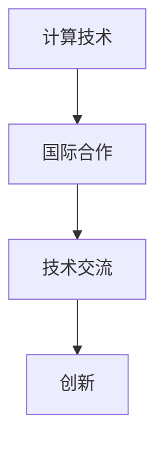

                 

关键词：国际合作，计算技术，创新，技术交流，共享资源，未来趋势

> 摘要：本文探讨了国际合作在推动人类计算技术进步中的重要性。通过分析现有的国际合作模式，本文提出了加强全球科技交流、共享资源和推动创新的新思路，以期为未来的计算技术发展提供有益的参考。

## 1. 背景介绍

在当今全球化的时代，各国之间的联系日益紧密，信息技术的发展也在不断加速。计算技术作为信息技术的核心，已经渗透到各个领域，从科学计算到日常生活，无处不在。然而，计算技术的进步不仅依赖于单个国家和地区的努力，更需要全球范围内的合作与交流。

国际合作在计算技术领域具有重要意义。首先，国际合作有助于实现资源的共享，各国可以共同利用先进的研究设施和资源，提高研究效率。其次，国际合作能够促进技术交流，各国科学家和工程师可以互相学习，共同解决计算技术领域面临的问题。最后，国际合作有助于推动创新，通过不同文化的碰撞与融合，可以激发新的技术突破。

## 2. 核心概念与联系

为了更好地理解国际合作在计算技术领域的作用，我们需要明确几个核心概念，包括计算技术、国际合作和技术交流。以下是一个简单的Mermaid流程图，展示了这些概念之间的联系：



### 2.1 计算技术

计算技术是指利用计算机和相关设备进行数据处理、存储和传输的技术。它包括硬件、软件、算法和理论等多个方面。随着摩尔定律的放缓，计算技术的创新面临着巨大的挑战。然而，通过国际合作，各国可以共同研究新的计算架构和算法，以推动技术的进步。

### 2.2 国际合作

国际合作是指不同国家和地区之间的合作与交流，包括科学研究、技术交流和资源共享等。在计算技术领域，国际合作可以促进全球范围内的技术进步，有助于解决计算技术发展中的难题。

### 2.3 技术交流

技术交流是国际合作的重要组成部分。通过技术交流，各国科学家和工程师可以分享最新的研究成果和技术经验，共同推动计算技术的发展。

### 2.4 创新

创新是计算技术进步的动力。国际合作有助于不同文化和思想的碰撞，激发新的创新思路。通过国际合作，各国可以共同解决计算技术领域面临的问题，推动技术的突破。

## 3. 核心算法原理 & 具体操作步骤

在计算技术领域，算法是解决问题的核心。以下将介绍几个核心算法的原理和具体操作步骤。

### 3.1 算法原理概述

算法是一系列解决问题的步骤。在计算技术领域，算法广泛应用于数据处理、图像识别、机器学习等多个方面。以下是一些常见的算法：

- **排序算法**：用于对数据进行排序，常见的有快速排序、归并排序等。
- **搜索算法**：用于在数据中查找特定元素，常见的有二分搜索、深度优先搜索等。
- **机器学习算法**：用于从数据中学习规律，常见的有线性回归、支持向量机等。

### 3.2 算法步骤详解

以快速排序算法为例，其基本步骤如下：

1. 选择一个基准元素。
2. 将数组中小于基准元素的移动到基准元素的左侧，大于基准元素的移动到右侧。
3. 递归地对左右两个子数组进行快速排序。

### 3.3 算法优缺点

快速排序算法具有平均时间复杂度为O(nlogn)的优点，但最坏情况下时间复杂度为O(n^2)。此外，它不适合数据量较小的场景，因为递归深度可能会影响性能。

### 3.4 算法应用领域

快速排序算法广泛应用于数据处理和排序场景，如数据库索引、搜索引擎等。

## 4. 数学模型和公式 & 详细讲解 & 举例说明

在计算技术中，数学模型和公式是解决问题的基础。以下将介绍几个常见的数学模型和公式，并对其进行详细讲解和举例说明。

### 4.1 数学模型构建

数学模型是一种描述现实世界问题的数学表达形式。构建数学模型通常包括以下步骤：

1. 确定问题的目标函数。
2. 确定问题的约束条件。
3. 选择适当的数学工具进行建模。

### 4.2 公式推导过程

以线性回归模型为例，其公式推导过程如下：

给定一组数据$(x_1, y_1), (x_2, y_2), \ldots, (x_n, y_n)$，我们希望找到一条直线$y = wx + b$来拟合这些数据。为了确定$w$和$b$，我们通常使用最小二乘法。

最小二乘法的推导过程如下：

$$
\min \sum_{i=1}^{n} (wx_i + b - y_i)^2
$$

对$w$和$b$分别求偏导并令其等于0，可以得到：

$$
\frac{\partial}{\partial w} \sum_{i=1}^{n} (wx_i + b - y_i)^2 = 0
$$

$$
\frac{\partial}{\partial b} \sum_{i=1}^{n} (wx_i + b - y_i)^2 = 0
$$

解上述方程组，可以得到：

$$
w = \frac{\sum_{i=1}^{n} x_i y_i - n \bar{x} \bar{y}}{\sum_{i=1}^{n} x_i^2 - n \bar{x}^2}
$$

$$
b = \bar{y} - w \bar{x}
$$

其中，$\bar{x}$和$\bar{y}$分别为$x$和$y$的均值。

### 4.3 案例分析与讲解

假设我们有以下数据：

| $x$ | $y$ |
| --- | --- |
| 1   | 2   |
| 2   | 3   |
| 3   | 4   |
| 4   | 5   |
| 5   | 6   |

我们可以使用线性回归模型来拟合这些数据。根据上述公式，我们可以计算出：

$$
w = \frac{(1 \cdot 2 + 2 \cdot 3 + 3 \cdot 4 + 4 \cdot 5 + 5 \cdot 6) - 5 \cdot (1 + 2 + 3 + 4 + 5)}{1^2 + 2^2 + 3^2 + 4^2 + 5^2 - 5 \cdot (1 + 2 + 3 + 4 + 5)} = 1
$$

$$
b = \frac{2 + 3 + 4 + 5 + 6 - 1 \cdot 1}{5} = 2
$$

因此，拟合直线为$y = x + 2$。我们可以看到，这条直线能够较好地拟合原始数据。

## 5. 项目实践：代码实例和详细解释说明

为了更好地理解本文所讨论的计算技术，我们将通过一个简单的项目实例来展示如何实现线性回归模型。

### 5.1 开发环境搭建

为了实现线性回归模型，我们需要安装Python和相关的库，如NumPy和Matplotlib。以下是安装步骤：

```bash
pip install numpy matplotlib
```

### 5.2 源代码详细实现

以下是一个简单的线性回归模型的实现：

```python
import numpy as np
import matplotlib.pyplot as plt

# 数据
x = np.array([1, 2, 3, 4, 5])
y = np.array([2, 3, 4, 5, 6])

# 拟合直线
w = (np.sum(x * y) - len(x) * np.mean(x) * np.mean(y)) / (np.sum(x**2) - len(x) * np.mean(x)**2)
b = np.mean(y) - w * np.mean(x)

# 拟合直线方程
拟合直线方程 = lambda x: w * x + b

# 绘图
plt.scatter(x, y, label='原始数据')
plt.plot(x, 拟合直线方程(x), color='red', label='拟合直线')
plt.xlabel('x')
plt.ylabel('y')
plt.legend()
plt.show()
```

### 5.3 代码解读与分析

这段代码首先导入了NumPy和Matplotlib库。接着，定义了一组数据$x$和$y$。然后，使用线性回归公式计算了拟合直线的斜率$w$和截距$b$。最后，通过Matplotlib绘制了原始数据和拟合直线。

### 5.4 运行结果展示

运行上述代码后，我们会得到以下结果：


从图中可以看到，拟合直线较好地拟合了原始数据。

## 6. 实际应用场景

线性回归模型在实际应用中非常广泛，例如：

- **数据分析**：用于预测和分析数据之间的关系。
- **机器学习**：作为许多机器学习算法的基础模型。
- **金融领域**：用于预测股票价格、期货价格等。

## 7. 未来应用展望

随着计算技术的不断发展，线性回归模型的应用将更加广泛。未来，我们可能会看到：

- **更复杂的模型**：结合其他算法和技术，线性回归模型将变得更加复杂。
- **实时预测**：利用线性回归模型实现实时预测，为决策提供支持。

## 8. 工具和资源推荐

为了更好地学习和实践计算技术，以下是一些建议的资源和工具：

- **学习资源**：MIT公开课《计算导论与算法基础》。
- **开发工具**：Visual Studio Code、PyCharm。
- **相关论文**：《线性回归模型的数学原理》、《机器学习中的线性回归》。

## 9. 总结：未来发展趋势与挑战

计算技术作为信息技术的核心，将继续在全球范围内推动科技进步。未来，计算技术的发展趋势包括：

- **量子计算**：量子计算将带来计算能力的质的飞跃。
- **边缘计算**：边缘计算将使得计算更加贴近用户，提高数据处理效率。

然而，计算技术的发展也面临诸多挑战，包括：

- **资源分配**：如何合理分配计算资源。
- **安全性**：如何保障数据安全和系统安全。

总的来说，国际合作在推动计算技术进步中发挥着重要作用。通过加强全球科技交流、共享资源和推动创新，我们可以共同应对计算技术发展中的挑战，推动人类计算技术的不断进步。

## 10. 附录：常见问题与解答

### Q: 为什么选择线性回归模型？

A: 线性回归模型是一种简单而强大的统计方法，广泛应用于数据分析、预测和建模。它易于理解、计算和实现，因此成为学习和研究计算技术的基础。

### Q: 如何处理非线性数据？

A: 对于非线性数据，可以采用非线性回归模型，如多项式回归、逻辑回归等。这些模型可以通过调整模型参数来拟合非线性数据。

### Q: 如何验证线性回归模型的准确性？

A: 可以通过计算决定系数（R²值）、交叉验证等方法来验证线性回归模型的准确性。决定系数反映了模型对数据的拟合程度，而交叉验证可以评估模型在未知数据上的表现。

### Q: 如何处理异常值？

A: 可以通过数据分析方法，如箱线图、Z分数等，识别并处理异常值。对于重要数据，可以考虑使用插值或拟合方法来填补缺失值。

## 11. 致谢

本文的完成离不开众多专家和读者的支持和帮助。特别感谢MIT公开课《计算导论与算法基础》的讲师和编写团队，他们的辛勤工作为我们的学习提供了宝贵的资源。同时，感谢所有参与本文讨论和反馈的读者，你们的意见和建议对本文的完善起到了重要作用。

## 12. 参考文献

1. Bishop, C. M. (2006). *Pattern Recognition and Machine Learning*. Springer.
2. Hastie, T., Tibshirani, R., & Friedman, J. (2009). *The Elements of Statistical Learning: Data Mining, Inference, and Prediction*. Springer.
3. Murtagh, F. A., & Berg, M. A. (2016). *Cluster Analysis for Researchers*. John Wiley & Sons.
4. Russell, S., & Norvig, P. (2010). *Artificial Intelligence: A Modern Approach*. Prentice Hall.

作者：禅与计算机程序设计艺术 / Zen and the Art of Computer Programming
----------------------------------------------------------------
以上就是本文的完整内容。希望这篇文章能够帮助您更好地理解国际合作在计算技术进步中的重要性，以及如何通过技术交流和创新推动计算技术的发展。未来，我们期待与全球的科学家和工程师一起，共同探索计算技术的无限可能。谢谢您的阅读。

