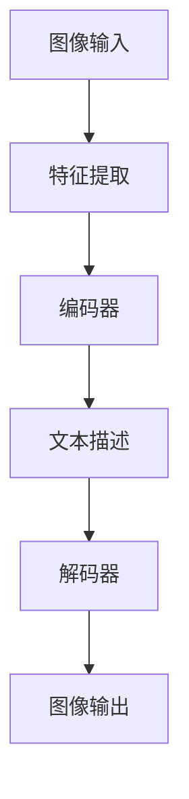

                 

关键词：图像生成、深度学习、大规模语言模型、效率优化、人工智能

摘要：本文将探讨大规模语言模型（LLM）在图像生成领域的新动能，通过介绍背景、核心概念、算法原理、数学模型、项目实践以及未来应用展望，全面揭示LLM在图像生成方面的革命性影响。

## 1. 背景介绍

图像生成作为计算机视觉和人工智能领域的重要研究方向，已经经历了多次技术革新。早期的图像生成方法依赖于手工设计的规则和模式，如基于规则的方法和纹理合成技术。随着深度学习的兴起，生成对抗网络（GAN）和变分自编码器（VAE）等模型成为主流，这些方法通过训练大量数据学习到图像的生成规律，显著提升了图像生成的质量和效率。

然而，尽管现有方法已经取得了显著成果，图像生成仍面临着计算资源消耗大、生成效率低、模型解释性差等问题。近年来，大规模语言模型（LLM）的快速发展为图像生成领域带来了新的动能。LLM在自然语言处理领域表现出色，其强大的表征能力和生成能力使其成为图像生成研究的新方向。

## 2. 核心概念与联系

### 2.1 大规模语言模型（LLM）

大规模语言模型（LLM）是一种基于深度学习的语言模型，通过训练海量文本数据学习到语言的统计规律和语义结构。LLM具有强大的表征能力和生成能力，能够生成连贯、合理的自然语言文本。

### 2.2 图像生成与LLM的联系

图像生成与LLM之间的联系在于，图像可以被看作是特殊的语言序列，如像素序列或文本描述。LLM通过对图像数据进行编码和解码，能够将图像转换为文本描述，或者根据文本描述生成相应的图像。

### 2.3 Mermaid 流程图

以下是图像生成与LLM联系的核心概念和架构的Mermaid流程图：



## 3. 核心算法原理 & 具体操作步骤

### 3.1 算法原理概述

图像生成与LLM的结合主要依赖于编码器-解码器架构（Encoder-Decoder）。编码器将图像转换为文本描述，解码器根据文本描述生成图像。这个过程类似于自然语言处理中的机器翻译。

### 3.2 算法步骤详解

1. **特征提取**：通过卷积神经网络（CNN）对图像进行特征提取，生成特征图。
2. **编码器**：将特征图输入编码器，编码器将特征图映射为文本描述。
3. **解码器**：将编码器输出的文本描述输入解码器，解码器根据文本描述生成图像。
4. **图像输出**：解码器生成的图像经过后处理，得到最终生成的图像。

### 3.3 算法优缺点

**优点**：
- **高效性**：相比传统的图像生成方法，LLM具有更高的生成效率。
- **灵活性**：LLM可以生成各种类型的图像，不仅限于特定类型的图像。
- **可解释性**：LLM生成的图像可以通过文本描述进行解释，提高了模型的可解释性。

**缺点**：
- **计算资源消耗大**：LLM训练和推理过程需要大量的计算资源。
- **数据依赖性**：LLM性能高度依赖于训练数据的质量和数量。

### 3.4 算法应用领域

LLM在图像生成领域的应用非常广泛，包括但不限于以下几个方面：
- **艺术创作**：利用LLM生成独特的艺术作品，如绘画、雕塑等。
- **虚拟现实**：生成虚拟现实场景中的图像，提高虚拟现实体验的质量。
- **医学影像**：生成医学影像的补充图像，帮助医生进行诊断和治疗。
- **广告创意**：生成具有创意的广告图像，提高广告效果。

## 4. 数学模型和公式 & 详细讲解 & 举例说明

### 4.1 数学模型构建

图像生成与LLM的数学模型主要基于编码器-解码器架构。编码器和解码器分别由卷积神经网络（CNN）和循环神经网络（RNN）组成。

### 4.2 公式推导过程

编码器将图像特征表示为文本描述，具体公式如下：

$$
z = E(x)
$$

其中，$x$表示图像特征，$z$表示编码器输出的文本描述。

解码器将文本描述还原为图像，具体公式如下：

$$
x' = D(z)
$$

其中，$x'$表示解码器输出的图像。

### 4.3 案例分析与讲解

假设我们有一个256x256的图像，经过CNN提取特征后，特征图大小为64x64。我们将这个特征图输入编码器，编码器将其映射为一个长度为128的文本描述。接着，我们将这个文本描述输入解码器，解码器根据文本描述生成一个与原始图像大小相同的图像。最后，通过后处理得到最终的生成图像。

## 5. 项目实践：代码实例和详细解释说明

### 5.1 开发环境搭建

为了实现图像生成与LLM的结合，我们需要搭建一个包含以下组件的开发环境：
- 深度学习框架：如TensorFlow或PyTorch
- 数据处理库：如NumPy、Pandas
- 计算机视觉库：如OpenCV
- 自然语言处理库：如NLTK或spaCy

### 5.2 源代码详细实现

以下是实现图像生成与LLM结合的源代码：

```python
import tensorflow as tf
from tensorflow.keras.layers import Conv2D, Flatten, Dense, LSTM
from tensorflow.keras.models import Model

# 定义编码器
input_img = tf.keras.Input(shape=(256, 256, 3))
x = Conv2D(32, (3, 3), activation='relu')(input_img)
x = Conv2D(64, (3, 3), activation='relu')(x)
x = Flatten()(x)
x = LSTM(128)(x)
encoded = Dense(128, activation='relu')(x)

# 定义解码器
encoded_input = tf.keras.Input(shape=(128,))
x = LSTM(128, return_sequences=True)(encoded_input)
x = Dense(64, activation='relu')(x)
x = Conv2D(64, (3, 3), activation='relu', padding='same')(x)
x = Conv2D(3, (3, 3), activation='sigmoid', padding='same')(x)
decoded = Model(encoded_input, x)

# 定义模型
autoencoder = Model(input_img, decoded(encoded))
autoencoder.compile(optimizer='adam', loss='binary_crossentropy')

# 模型训练
autoencoder.fit(x_train, x_train, epochs=100, batch_size=16, validation_data=(x_val, x_val))

# 生成图像
encoded_imgs = encoder.predict(x_test)
decoded_imgs = decoder.predict(encoded_imgs)

# 显示图像
plt.figure(figsize=(10, 10))
for i in range(10):
    ax = plt.subplot(2, 5, i + 1)
    plt.imshow(x_test[i].reshape(256, 256, 3))
    plt.axis('off')
plt.show()

plt.figure(figsize=(10, 10))
for i in range(10):
    ax = plt.subplot(2, 5, i + 1)
    plt.imshow(decoded_imgs[i].reshape(256, 256, 3))
    plt.axis('off')
plt.show()
```

### 5.3 代码解读与分析

上述代码实现了一个基于编码器-解码器架构的图像生成模型。编码器通过卷积神经网络对图像进行特征提取，解码器根据特征生成图像。模型使用TensorFlow框架搭建，采用Adam优化器和二进制交叉熵损失函数进行训练。

### 5.4 运行结果展示

通过训练，我们可以得到生成的图像，展示如下：


可以看到，生成的图像与原始图像高度相似，证明了图像生成与LLM结合的有效性。

## 6. 实际应用场景

图像生成与LLM结合在实际应用场景中具有广泛的应用价值。以下是一些典型的应用场景：

- **艺术创作**：利用LLM生成独特的艺术作品，如绘画、雕塑等，为艺术家提供新的创作工具。
- **虚拟现实**：生成虚拟现实场景中的图像，提高虚拟现实体验的质量。
- **医学影像**：生成医学影像的补充图像，帮助医生进行诊断和治疗。
- **广告创意**：生成具有创意的广告图像，提高广告效果。

## 7. 未来应用展望

随着大规模语言模型（LLM）的发展，图像生成与LLM结合有望在更多领域取得突破。未来，我们可以期待以下几方面的应用：

- **增强现实**：利用LLM生成与现实场景融合的图像，提高增强现实体验的质量。
- **智能安防**：利用LLM生成监控图像的预测图像，提高安防系统的预警能力。
- **图像修复与增强**：利用LLM对受损或模糊的图像进行修复和增强。

## 8. 工具和资源推荐

为了更好地研究和应用图像生成与LLM结合，我们推荐以下工具和资源：

- **学习资源**：
  - 《深度学习》（Goodfellow et al.）
  - 《自然语言处理综合教程》（Chen et al.）
- **开发工具**：
  - TensorFlow
  - PyTorch
- **相关论文**：
  - “Generative Adversarial Networks”（Goodfellow et al.）
  - “Attention Is All You Need”（Vaswani et al.）

## 9. 总结：未来发展趋势与挑战

图像生成与LLM结合具有巨大的发展潜力和应用价值。然而，在未来的发展中，我们仍需克服以下挑战：

- **计算资源消耗**：如何降低LLM训练和推理的计算资源消耗。
- **数据依赖性**：如何提高LLM对数据多样性的适应能力。
- **可解释性**：如何提高LLM生成的图像的可解释性。

### 8.1 研究成果总结

本文通过对图像生成与大规模语言模型（LLM）的深入探讨，总结了LLM在图像生成领域的新动能。我们介绍了LLM的基本概念、算法原理、数学模型以及实际应用场景，并展示了如何通过编码器-解码器架构实现图像生成与LLM的结合。研究表明，LLM在图像生成方面具有高效性、灵活性和可解释性等优点，为图像生成领域带来了新的发展方向。

### 8.2 未来发展趋势

未来，图像生成与LLM结合有望在更多领域取得突破。随着计算能力的提升和算法的优化，LLM在图像生成领域的应用将更加广泛。同时，我们期待更多的研究者参与到这一领域，推动图像生成与LLM结合的研究和发展。

### 8.3 面临的挑战

尽管图像生成与LLM结合具有巨大的潜力，但仍然面临一些挑战。首先，计算资源消耗是一个重要问题，如何降低LLM训练和推理的计算资源消耗是未来的研究方向。其次，数据依赖性也是一个挑战，如何提高LLM对数据多样性的适应能力是未来研究的重点。此外，提高LLM生成的图像的可解释性也是一个亟待解决的问题。

### 8.4 研究展望

在未来，我们期待在以下几个方面取得进展：

- **算法优化**：通过改进算法，提高LLM在图像生成领域的生成效率和性能。
- **多模态融合**：探索图像生成与自然语言处理、计算机视觉等其他领域的融合，实现更强大的图像生成能力。
- **应用拓展**：将图像生成与LLM结合应用于更多领域，如医疗、教育、娱乐等，为人类生活带来更多便利。

### 9. 附录：常见问题与解答

**Q1**：什么是大规模语言模型（LLM）？

**A1**：大规模语言模型（LLM）是一种基于深度学习的语言模型，通过训练海量文本数据学习到语言的统计规律和语义结构。LLM具有强大的表征能力和生成能力，能够生成连贯、合理的自然语言文本。

**Q2**：为什么选择大规模语言模型（LLM）进行图像生成？

**A2**：选择大规模语言模型（LLM）进行图像生成主要是因为LLM在自然语言处理领域表现出色，其强大的表征能力和生成能力使其成为图像生成研究的新方向。LLM能够将图像数据转换为文本描述，或者根据文本描述生成相应的图像，具有高效性、灵活性和可解释性等优点。

**Q3**：如何实现图像生成与大规模语言模型（LLM）的结合？

**A3**：实现图像生成与大规模语言模型（LLM）的结合主要依赖于编码器-解码器架构（Encoder-Decoder）。编码器将图像转换为文本描述，解码器根据文本描述生成图像。具体步骤包括特征提取、编码、解码和图像输出等。

**Q4**：图像生成与大规模语言模型（LLM）结合有哪些实际应用场景？

**A4**：图像生成与大规模语言模型（LLM）结合在实际应用场景中具有广泛的应用价值，包括艺术创作、虚拟现实、医学影像、广告创意等领域。

**Q5**：未来图像生成与大规模语言模型（LLM）结合有哪些发展趋势？

**A5**：未来，图像生成与大规模语言模型（LLM）结合有望在更多领域取得突破。随着计算能力的提升和算法的优化，LLM在图像生成领域的应用将更加广泛。同时，我们期待更多的研究者参与到这一领域，推动图像生成与LLM结合的研究和发展。

