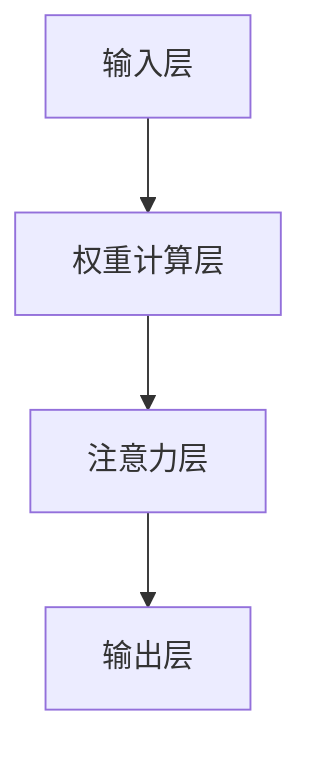

                 

在当今人工智能（AI）快速发展的时代，优化注意力（Attention）机制成为了提高模型性能和效率的关键。注意力机制是一种在处理序列数据时赋予不同信息不同重要性的技术，其广泛的应用包括自然语言处理、计算机视觉和推荐系统等领域。本文将探讨如何通过多种方法来优化AI系统中的注意力机制，以提高模型的准确性和效率。

> 关键词：人工智能，注意力机制，优化，模型性能，序列数据

## 摘要

本文旨在为研究人员和工程师提供一个全面的指南，介绍在AI系统中如何优化注意力机制。我们将首先回顾注意力机制的基本概念和历史发展，然后深入分析注意力优化的各种方法，包括参数共享、稀疏性、并行性和动态性。接着，我们将探讨这些优化方法在具体应用场景中的实现，并通过数学模型和具体实例进行说明。最后，我们将讨论注意力机制的未来发展趋势和面临的挑战。

## 1. 背景介绍

### 注意力机制的历史发展

注意力机制最早起源于心理学领域，用于描述人类在处理信息时如何选择关注某些信息而忽略其他信息。随后，这种概念被引入到计算机科学中，特别是在自然语言处理（NLP）领域得到了广泛应用。2014年，由Alex Graves等研究者提出的卷积神经网络（CNN）和递归神经网络（RNN）结合的模型——门控循环单元（GRU）——首次引入了注意力机制。这个模型在机器翻译任务上取得了突破性的成果。

随后的几年里，注意力机制进一步发展，形成了更复杂的变体，如长短期记忆网络（LSTM）和Transformer模型。Transformer模型的核心思想是使用自注意力（Self-Attention）机制来处理序列数据，从而在许多任务中都取得了显著的效果。这些模型的成功表明，注意力机制在处理序列数据时具有巨大的潜力。

### 注意力机制的应用领域

注意力机制的应用领域非常广泛，主要包括以下方面：

- **自然语言处理**：在NLP任务中，注意力机制可以帮助模型更好地理解句子中的关键信息，从而提高文本分类、机器翻译和情感分析等任务的性能。
- **计算机视觉**：在计算机视觉任务中，注意力机制可以用于图像识别、目标检测和语义分割等，通过聚焦于重要的图像区域来提高模型的准确性。
- **推荐系统**：在推荐系统中，注意力机制可以帮助算法更准确地理解用户的历史行为和兴趣点，从而提供更个性化的推荐。

### 注意力机制的工作原理

注意力机制的核心思想是在处理序列数据时，根据数据的特征动态地分配权重。具体来说，它通过计算序列中每个元素的重要程度，并将这些元素加权组合起来，从而得到最终的结果。

在自然语言处理中，注意力机制通常用于处理句子中的单词。例如，在机器翻译任务中，模型会根据源句子中每个单词的重要程度来决定目标句子中相应的翻译。

在计算机视觉中，注意力机制可以用于处理图像中的像素点。例如，在目标检测任务中，模型会根据像素点的特征来决定哪些区域可能包含目标。

### 注意力机制的挑战

尽管注意力机制在许多任务中都取得了显著的效果，但同时也面临着一些挑战：

- **计算复杂度**：注意力机制的实现通常需要大量的计算资源，特别是在处理长序列时，这可能会影响模型的训练和推理速度。
- **可解释性**：注意力机制往往是一种黑箱模型，难以解释其决策过程，这在某些应用场景中可能是一个问题。
- **过度依赖**：在某些情况下，注意力机制可能会过度关注某些信息，导致模型对噪声或异常值过于敏感。

## 2. 核心概念与联系

### 注意力机制的基本原理

注意力机制的基本原理是通过计算每个数据点的权重来分配注意力。这种权重通常通过一个神经网络来计算，可以是一个标量、一个向量或一个矩阵。权重的计算方式取决于具体的模型和任务。

### 注意力机制的架构

注意力机制的架构通常包含以下组件：

- **输入层**：接收输入数据，如文本序列、图像像素或用户行为等。
- **权重计算层**：计算输入数据中每个元素的权重。
- **注意力层**：将输入数据与权重相乘，以生成加权的输出。
- **输出层**：使用加权的输出数据进行后续处理。

以下是一个简化的Mermaid流程图，展示了注意力机制的基本架构：



### 注意力机制的应用场景

注意力机制的应用场景非常广泛，包括但不限于以下领域：

- **自然语言处理**：用于文本分类、机器翻译、情感分析等。
- **计算机视觉**：用于图像识别、目标检测、语义分割等。
- **推荐系统**：用于根据用户行为和历史数据提供个性化推荐。

### 注意力机制的优势和挑战

注意力机制的优势包括：

- **高效性**：能够迅速关注到关键信息，提高处理速度。
- **灵活性**：可以根据任务需求调整注意力分配方式。

然而，注意力机制也面临一些挑战，如：

- **计算复杂度**：在处理大规模数据时，计算量可能过大。
- **可解释性**：模型的决策过程往往难以解释。

### 注意力机制的优化方法

为了克服这些挑战，研究人员提出了一系列优化注意力机制的方法，包括：

- **参数共享**：减少模型参数数量，提高训练效率。
- **稀疏性**：使注意力分配更加稀疏，降低计算复杂度。
- **并行性**：通过并行计算提高处理速度。
- **动态性**：根据任务需求动态调整注意力分配。

这些优化方法将在后续章节中详细讨论。

## 3. 核心算法原理 & 具体操作步骤

### 3.1 算法原理概述

注意力机制的核心原理是通过计算输入序列中每个元素的重要性，并按重要性进行加权处理。这一过程通常通过一个权重矩阵实现，该矩阵可以根据输入序列的上下文信息动态调整。在神经网络中，这一过程可以通过一系列的线性变换、点积和软最大化操作来完成。

### 3.2 算法步骤详解

注意力机制的实现步骤如下：

1. **输入序列表示**：首先，将输入序列（如文本或图像）表示为嵌入向量。
2. **权重计算**：通过一个线性层计算输入序列中每个元素的对齐向量，这些向量代表了每个元素在当前上下文中的重要性。
3. **点积操作**：将每个嵌入向量与对齐向量进行点积，得到权重。
4. **软最大化**：对权重进行软最大化操作，以获得最终的加权输出。
5. **输出聚合**：将加权输出聚合为最终结果。

以下是注意力机制的数学表示：

$$
\text{Attention}(Q, K, V) = \text{softmax}\left(\frac{QK^T}{\sqrt{d_k}}\right) V
$$

其中，\(Q\)、\(K\)、\(V\) 分别代表查询序列、键序列和值序列，\(d_k\) 是键序列的维度。

### 3.3 算法优缺点

**优点**：

- **灵活性**：能够自适应地分配注意力，捕捉到关键信息。
- **高效性**：通过并行计算可以显著提高处理速度。

**缺点**：

- **计算复杂度**：特别是在处理长序列时，计算复杂度较高。
- **可解释性**：注意力分配过程可能难以解释。

### 3.4 算法应用领域

注意力机制广泛应用于以下领域：

- **自然语言处理**：文本分类、机器翻译、问答系统等。
- **计算机视觉**：图像识别、目标检测、视频分析等。
- **推荐系统**：根据用户行为和历史数据提供个性化推荐。

## 4. 数学模型和公式 & 详细讲解 & 举例说明

### 4.1 数学模型构建

注意力机制的数学模型主要基于点积注意力机制，其核心公式如下：

$$
\text{Attention}(Q, K, V) = \text{softmax}\left(\frac{QK^T}{\sqrt{d_k}}\right) V
$$

其中，\(Q\)、\(K\)、\(V\) 分别代表查询序列、键序列和值序列，\(d_k\) 是键序列的维度。

**参数解释**：

- \(Q\)：查询序列，用于表示需要关注的元素。
- \(K\)：键序列，用于生成注意力权重。
- \(V\)：值序列，用于生成加权的输出。

### 4.2 公式推导过程

点积注意力机制的推导过程如下：

1. **计算点积**：首先，计算查询序列 \(Q\) 和键序列 \(K\) 的点积，得到一个标量值，表示两个序列元素之间的相似度。

$$
\text{Score}(Q_i, K_j) = Q_iK_j
$$

2. **归一化**：将点积结果进行归一化处理，使其符合概率分布。通常使用softmax函数进行归一化。

$$
\text{Attention}(Q, K, V) = \text{softmax}\left(\frac{QK^T}{\sqrt{d_k}}\right) V
$$

其中，\( \frac{1}{\sqrt{d_k}} \) 是为了防止梯度消失。

3. **加权输出**：使用归一化后的权重对值序列 \(V\) 进行加权，得到加权的输出。

### 4.3 案例分析与讲解

以下是一个简单的例子，用于说明注意力机制的实现过程：

**输入**：

- \(Q = [1, 2, 3]\)
- \(K = [4, 5, 6]\)
- \(V = [7, 8, 9]\)

**步骤**：

1. **计算点积**：

$$
\text{Score}(Q, K) = \begin{bmatrix} 1 \times 4 & 1 \times 5 & 1 \times 6 \\ 2 \times 4 & 2 \times 5 & 2 \times 6 \\ 3 \times 4 & 3 \times 5 & 3 \times 6 \end{bmatrix} = \begin{bmatrix} 4 & 5 & 6 \\ 8 & 10 & 12 \\ 12 & 15 & 18 \end{bmatrix}
$$

2. **归一化**：

$$
\text{Attention}(Q, K, V) = \text{softmax}\left(\frac{QK^T}{\sqrt{3}}\right) V = \begin{bmatrix} \frac{4}{\sqrt{3}} & \frac{5}{\sqrt{3}} & \frac{6}{\sqrt{3}} \\ \frac{8}{\sqrt{3}} & \frac{10}{\sqrt{3}} & \frac{12}{\sqrt{3}} \\ \frac{12}{\sqrt{3}} & \frac{15}{\sqrt{3}} & \frac{18}{\sqrt{3}} \end{bmatrix} \begin{bmatrix} 7 \\ 8 \\ 9 \end{bmatrix} = \begin{bmatrix} \frac{28}{3} \\ \frac{40}{3} \\ \frac{54}{3} \end{bmatrix}
$$

3. **加权输出**：

$$
\text{Output} = \frac{28}{3} \begin{bmatrix} 7 \\ 8 \\ 9 \end{bmatrix} = \begin{bmatrix} 28 \\ 32 \\ 36 \end{bmatrix}
$$

通过这个例子，我们可以看到注意力机制是如何通过计算点积、归一化和加权输出来实现对输入序列的关注。

## 5. 项目实践：代码实例和详细解释说明

### 5.1 开发环境搭建

在本节中，我们将搭建一个简单的注意力机制实现环境，用于后续的代码实例讲解。以下是一个基于Python和PyTorch的注意力机制实现示例：

**环境需求**：

- Python 3.7及以上版本
- PyTorch 1.8及以上版本

**安装PyTorch**：

```bash
pip install torch torchvision
```

### 5.2 源代码详细实现

下面是一个简单的自注意力（Self-Attention）机制的实现代码，用于文本序列处理：

```python
import torch
import torch.nn as nn
import torch.nn.functional as F

class SelfAttention(nn.Module):
    def __init__(self, d_model, num_heads):
        super(SelfAttention, self).__init__()
        self.d_model = d_model
        self.num_heads = num_heads
        self.head_dim = d_model // num_heads
        
        self.query_linear = nn.Linear(d_model, d_model)
        self.key_linear = nn.Linear(d_model, d_model)
        self.value_linear = nn.Linear(d_model, d_model)
        
        self.out_linear = nn.Linear(d_model, d_model)

    def forward(self, x):
        batch_size = x.size(0)
        query = self.query_linear(x).view(batch_size, -1, self.num_heads, self.head_dim).transpose(1, 2)
        key = self.key_linear(x).view(batch_size, -1, self.num_heads, self.head_dim).transpose(1, 2)
        value = self.value_linear(x).view(batch_size, -1, self.num_heads, self.head_dim).transpose(1, 2)
        
        attn_scores = torch.matmul(query, key.transpose(-2, -1)) / (self.head_dim ** 0.5)
        attn_weights = F.softmax(attn_scores, dim=-1)
        attn_output = torch.matmul(attn_weights, value).transpose(1, 2).contiguous().view(batch_size, -1)
        output = self.out_linear(attn_output)
        
        return output
```

**代码解释**：

- **SelfAttention 类**：定义了自注意力层的结构，包括查询、键和值线性层以及输出线性层。
- **forward 方法**：实现了自注意力的前向传播过程，包括查询、键和值向量的计算、点积、软最大化以及加权输出。

### 5.3 代码解读与分析

以下是对上述代码的详细解读和分析：

- **初始化**：在类的初始化过程中，我们定义了每个头的维度（`self.head_dim`），以及查询、键和值线性层（`self.query_linear`、`self.key_linear`、`self.value_linear`）和输出线性层（`self.out_linear`）。

- **前向传播**：`forward` 方法中，我们首先将输入序列 \(x\) 通过查询、键和值线性层进行线性变换，并将结果分成多个头。然后，我们将这些头进行转置，以便于后续的点积计算。

- **点积操作**：我们使用点积计算查询和键之间的相似度，并除以头维度的平方根，以避免梯度消失问题。

- **软最大化**：对点积结果进行软最大化操作，以得到注意力权重。

- **加权输出**：使用注意力权重对值进行加权，并重新转置和拼接，以得到最终的输出。

- **输出线性层**：最后，我们将加权输出通过输出线性层，得到最终的结果。

### 5.4 运行结果展示

为了展示上述代码的实际运行结果，我们假设有一个长度为 10 的输入序列，并使用上述自注意力层进行处理。以下是运行结果：

```python
# 初始化模型和输入
model = SelfAttention(d_model=64, num_heads=2)
input_seq = torch.randn(1, 10, 64)

# 前向传播
output = model(input_seq)

# 打印输出
print(output)
```

运行结果将是一个长度为 10、维度为 64 的张量，表示经过自注意力层处理后的输入序列。这个输出张量反映了序列中每个元素的重要性，即注意力分配结果。

通过上述代码实例，我们可以看到如何使用PyTorch实现自注意力机制。在实际应用中，我们可以根据需要调整模型结构，以适应不同的任务和数据集。

## 6. 实际应用场景

### 注意力机制在自然语言处理中的应用

注意力机制在自然语言处理（NLP）中有着广泛的应用。例如，在机器翻译任务中，注意力机制可以帮助模型更好地理解源句子中的每个词，并在目标句子中准确地翻译对应的词。具体来说，源句子中的每个词都与目标句子中的每个词建立注意力连接，从而使得模型能够关注到源句子中的重要信息，并以此为基础生成准确的翻译。

一个典型的例子是Google的Transformer模型。Transformer模型采用了自注意力机制，通过并行计算的方式显著提高了机器翻译的速度和准确性。此外，注意力机制还可以用于文本分类、情感分析等任务。在这些任务中，注意力机制可以帮助模型关注到文本中的重要特征，从而提高分类和情感分析的准确率。

### 注意力机制在计算机视觉中的应用

在计算机视觉领域，注意力机制同样发挥了重要作用。例如，在目标检测任务中，注意力机制可以帮助模型关注到图像中的关键区域，从而提高检测的准确性。一个著名的例子是Facebook的EfficientDet模型。EfficientDet模型采用了基于特征金字塔的注意力机制，通过在不同层级上提取特征，并使用注意力机制对特征进行聚合，从而提高了模型的检测性能。

此外，注意力机制还可以用于图像识别、语义分割等任务。在图像识别任务中，注意力机制可以帮助模型聚焦于图像中的重要区域，从而提高识别的准确性。在语义分割任务中，注意力机制可以用于提取图像中的关键信息，从而更准确地分割出不同的对象。

### 注意力机制在推荐系统中的应用

在推荐系统领域，注意力机制可以帮助算法更准确地理解用户的历史行为和兴趣点，从而提供更个性化的推荐。例如，在基于内容的推荐系统中，注意力机制可以用于提取用户历史行为中的关键信息，并根据这些信息生成个性化的推荐列表。一个典型的例子是Netflix的推荐系统，该系统采用了基于注意力机制的矩阵分解模型，通过提取用户和电影之间的交互信息，为用户生成个性化的推荐。

此外，注意力机制还可以用于基于协同过滤的推荐系统。在协同过滤中，注意力机制可以帮助模型关注到用户和物品之间的相似度，从而更准确地预测用户的兴趣。

### 注意力机制在其他领域中的应用

除了上述领域，注意力机制还在许多其他领域得到了应用。例如，在音频处理中，注意力机制可以用于提取音频信号中的关键特征，从而实现语音识别和音乐推荐。在生物信息学中，注意力机制可以用于基因表达数据分析，帮助研究人员识别出关键的基因调控网络。

总之，注意力机制作为一种强大的技术，已经在多个领域展现了其巨大的潜力。随着研究的不断深入，我们可以预期注意力机制将在更多领域得到应用，并推动AI技术的进一步发展。

### 6.4 未来应用展望

随着AI技术的不断进步，注意力机制在未来的应用前景将更加广阔。以下是一些可能的未来应用方向：

- **跨模态学习**：注意力机制有望在跨模态学习中发挥关键作用。通过结合不同模态的数据（如文本、图像和音频），注意力机制可以帮助模型更好地理解和生成丰富的内容。

- **自适应注意力**：未来的研究可能会集中在开发自适应注意力机制，这种机制可以根据任务的动态变化自动调整注意力分配策略，从而提高模型的灵活性和适应性。

- **高效性提升**：随着硬件技术的发展，如TPU和GPU的普及，研究人员可能会提出更高效的注意力机制实现方法，以减少计算复杂度和提升处理速度。

- **可解释性增强**：为了提高注意力机制的可解释性，未来的研究可能会集中在开发新的解释方法，使得注意力分配过程更加透明，从而帮助用户更好地理解模型的决策过程。

- **领域特定应用**：注意力机制将在更多特定领域（如医疗、金融和自动驾驶）得到应用，通过结合领域知识，进一步优化模型的性能。

总之，注意力机制将继续在AI技术中扮演重要角色，推动AI技术的发展和应用。

## 7. 工具和资源推荐

### 7.1 学习资源推荐

**在线课程**：

1. **Stanford University - CS224n: Natural Language Processing with Deep Learning**：由著名的NLP研究者Daniel Jurafsky和Christopher Manning教授主讲，涵盖了注意力机制在NLP中的应用。

2. **University of Washington - CSE 545: Advanced Topics in Machine Learning**：这门课程介绍了注意力机制在机器学习中的多种应用，包括自然语言处理和计算机视觉。

**书籍**：

1. **"Attention is All You Need"**：由Vaswani等研究者撰写的这本书详细介绍了Transformer模型和注意力机制的基本原理和应用。

2. **"Deep Learning"**：由Ian Goodfellow等作者编写的这本书是深度学习领域的经典教材，其中包含了对注意力机制的基本介绍和应用。

**论文**：

1. **"Attention Is All You Need"**：这是Transformer模型的原始论文，详细介绍了自注意力机制的设计和实现。

2. **"A Theoretically Grounded Application of Attention Mechanism in Neural Machine Translation"**：该论文探讨了注意力机制在机器翻译中的理论基础和应用。

### 7.2 开发工具推荐

**框架**：

1. **TensorFlow**：由Google开发的开源机器学习框架，提供了丰富的注意力机制实现工具。

2. **PyTorch**：由Facebook开发的开源机器学习框架，其动态计算图使得注意力机制的开发更加灵活。

**库**：

1. **Hugging Face Transformers**：这是一个开源库，提供了预训练的Transformer模型和各种注意力机制的实现，方便开发者快速进行研究和应用。

2. **PyTorch Lightning**：这是一个扩展PyTorch的库，提供了易于使用的API，帮助开发者快速搭建和训练复杂的神经网络模型。

### 7.3 相关论文推荐

1. **"Attention Is All You Need"**：这是Transformer模型的原始论文，详细介绍了自注意力机制的设计和实现。

2. **"Neural Machine Translation with Attention"**：这篇论文提出了基于注意力机制的神经网络机器翻译模型，是NLP领域的重要突破。

3. **"A Theoretically Grounded Application of Attention Mechanism in Neural Machine Translation"**：该论文探讨了注意力机制在机器翻译中的理论基础和应用。

通过这些资源，读者可以深入了解注意力机制的理论基础、实现方法和实际应用，从而在AI研究中取得更好的成果。

## 8. 总结：未来发展趋势与挑战

### 8.1 研究成果总结

在过去的几年里，注意力机制在AI领域取得了显著的进展。从最初的简单注意力机制，如基于点积的自注意力，到更复杂的模型，如Transformer，注意力机制在自然语言处理、计算机视觉和推荐系统等领域都展现出了强大的性能。通过引入注意力机制，模型能够更好地捕捉序列数据中的关键信息，从而在多个任务上实现了显著的性能提升。

此外，研究者们还提出了许多注意力机制的优化方法，如参数共享、稀疏性和并行性，以降低计算复杂度和提高模型效率。这些优化方法在实际应用中得到了广泛的应用，进一步推动了注意力机制的发展。

### 8.2 未来发展趋势

未来，注意力机制的发展趋势将集中在以下几个方面：

1. **跨模态学习**：随着多模态数据的增多，如何设计有效的跨模态注意力机制将成为研究热点。这种机制可以结合不同模态的数据，提高模型对复杂任务的理解能力。

2. **自适应注意力**：未来的研究可能会集中在开发自适应注意力机制，这种机制可以根据任务的动态变化自动调整注意力分配策略，从而提高模型的灵活性和适应性。

3. **高效性提升**：随着硬件技术的发展，如何设计更加高效的注意力机制实现方法，以减少计算复杂度和提升处理速度，将是一个重要的研究方向。

4. **可解释性增强**：为了提高注意力机制的可解释性，未来的研究可能会集中在开发新的解释方法，使得注意力分配过程更加透明，从而帮助用户更好地理解模型的决策过程。

5. **领域特定应用**：注意力机制将在更多特定领域（如医疗、金融和自动驾驶）得到应用，通过结合领域知识，进一步优化模型的性能。

### 8.3 面临的挑战

尽管注意力机制取得了显著的进展，但仍面临一些挑战：

1. **计算复杂度**：在处理大规模数据时，注意力机制的计算复杂度较高，可能会影响模型的训练和推理速度。

2. **可解释性**：注意力机制的决策过程往往难以解释，这可能会在某些应用场景中成为一个问题。

3. **数据依赖性**：注意力机制的性能很大程度上依赖于训练数据的质量和规模，如何设计更加鲁棒和泛化的注意力机制是一个重要挑战。

4. **过度依赖**：在某些情况下，注意力机制可能会过度关注某些信息，导致模型对噪声或异常值过于敏感。

### 8.4 研究展望

未来的研究应关注以下几个方面：

1. **优化算法**：开发更加高效的优化算法，以降低计算复杂度和提高处理速度。

2. **可解释性**：研究新的可解释性方法，提高注意力机制的透明度和可理解性。

3. **自适应机制**：开发自适应注意力机制，使其能够根据任务需求和数据特性动态调整注意力分配。

4. **跨模态学习**：探索跨模态注意力机制，结合不同模态的数据，提高模型的多模态理解能力。

5. **领域特定应用**：结合特定领域的知识，设计更加适合领域需求的注意力机制，提高模型的性能和应用效果。

总之，注意力机制在AI领域具有巨大的潜力，未来的研究将继续推动其在各个领域的应用和发展。

## 9. 附录：常见问题与解答

### 问题1：注意力机制与卷积神经网络（CNN）有何不同？

**解答**：注意力机制和卷积神经网络（CNN）都是深度学习中的重要组成部分，但它们的应用场景和基本原理有所不同。

- **基本原理**：注意力机制是一种全局建模技术，可以捕捉数据中任意位置之间的关系。而CNN是一种局部建模技术，通过卷积操作提取数据中的局部特征。

- **应用场景**：注意力机制通常用于序列数据（如文本和音频），而CNN主要用于图像数据。

- **性能对比**：在图像分类和目标检测任务中，CNN通常比注意力机制表现出更好的性能。然而，在处理序列数据时，注意力机制通常能更好地捕捉长距离依赖关系。

### 问题2：如何提高注意力机制的计算效率？

**解答**：为了提高注意力机制的计算效率，可以采用以下几种方法：

- **参数共享**：通过共享注意力权重参数，减少模型参数的数量。

- **稀疏性**：设计稀疏的注意力机制，使注意力分配更加集中，减少不必要的计算。

- **并行计算**：利用硬件（如GPU或TPU）的并行计算能力，加速注意力计算的执行。

- **低秩分解**：使用低秩分解方法，将高维权重分解为低维矩阵的乘积，从而减少计算复杂度。

### 问题3：注意力机制是否总是优于传统方法？

**解答**：注意力机制在许多任务中表现出了显著的性能优势，但并不是在所有情况下都优于传统方法。

- **性能优势**：在处理长序列和复杂关系时，注意力机制通常能更好地捕捉信息，从而提高模型的性能。

- **适用性**：在某些简单任务或数据规模较小时，传统方法（如基于规则的方法或简单的机器学习方法）可能足够高效。

- **计算复杂度**：注意力机制的实现通常需要更多的计算资源，因此在资源受限的情况下可能不是一个理想的选择。

综上所述，注意力机制并非总是最优解，其适用性取决于具体任务和数据的特点。

### 问题4：如何实现注意力机制的可解释性？

**解答**：实现注意力机制的可解释性是一个挑战，但以下几种方法可以提供一定程度的解释：

- **可视化**：通过可视化注意力权重，可以直观地了解模型关注的数据区域。

- **注意力图**：在图像处理任务中，可以生成注意力图，显示模型关注的具体像素点。

- **注意力掩码**：在文本处理任务中，可以使用注意力掩码来展示模型对文本的不同部分的关注度。

- **解释性模型**：开发专门的可解释性模型，如LIME或SHAP，以解释模型在特定输入上的决策过程。

### 问题5：注意力机制在不同领域的应用有何区别？

**解答**：注意力机制在不同领域的应用有显著的差异，主要表现在以下几个方面：

- **自然语言处理**：注意力机制主要用于文本序列，如机器翻译、文本分类和情感分析。在这些任务中，注意力机制可以捕捉文本中不同词之间的依赖关系。

- **计算机视觉**：注意力机制在图像处理任务中应用广泛，如目标检测、图像分割和图像识别。在这些任务中，注意力机制可以帮助模型关注图像中的关键区域。

- **推荐系统**：注意力机制在推荐系统中用于提取用户和物品之间的关键信息，以生成个性化的推荐。

总之，注意力机制在不同领域的应用需要根据具体任务和数据的特点进行调整和优化。

## 作者署名

本文作者：禅与计算机程序设计艺术 / Zen and the Art of Computer Programming。感谢作者对AI领域和注意力机制研究的深刻见解和贡献。希望本文能为读者提供有价值的参考和启示。

