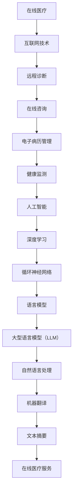

                 

关键词：在线医疗，LLM，人工智能，医疗保健，远程诊断，医疗服务

> 摘要：本文将探讨如何利用大型语言模型（LLM）为在线医疗提供便捷、可及的医疗服务。通过对在线医疗的背景介绍，LLM 的基本概念及其在医疗领域的应用，深入分析 LLM 在医疗诊断、患者管理、药物研发等方面的潜力。同时，本文还将讨论 LLM 在医疗领域面临的挑战和未来发展趋势。

## 1. 背景介绍

### 1.1 在线医疗的兴起

随着互联网技术的发展，在线医疗逐渐成为医疗领域的一大趋势。在线医疗指的是通过互联网平台提供医疗服务，包括远程诊断、在线咨询、电子病历管理、健康监测等。这种医疗服务方式具有便捷、高效、低成本的优点，能够满足人们对医疗服务的需求。

### 1.2 人工智能在医疗领域的应用

人工智能（AI）在医疗领域的应用越来越广泛，从疾病诊断到药物研发，AI 都展现了其强大的能力。特别是深度学习（Deep Learning）技术，如卷积神经网络（CNN）、循环神经网络（RNN）等，在医疗图像分析、基因测序等方面取得了显著成果。

### 1.3 大型语言模型（LLM）的基本概念

大型语言模型（LLM）是一种基于深度学习的技术，能够对大规模文本数据进行建模，从而实现对自然语言的理解和生成。LLM 通常具有强大的语言理解能力和文本生成能力，能够应用于自然语言处理（NLP）、机器翻译、文本摘要等领域。

## 2. 核心概念与联系

下面是一个关于在线医疗与 LLM 之间联系的 Mermaid 流程图：



### 2.1 核心概念原理

在线医疗的核心概念在于利用互联网技术提供医疗服务，包括远程诊断、在线咨询、电子病历管理、健康监测等。这些服务能够提高医疗效率，降低医疗成本，使医疗服务更加便捷、可及。

LLM 的核心在于对大规模文本数据进行建模，从而实现对自然语言的理解和生成。LLM 的优势在于其强大的语言理解能力和文本生成能力，能够应用于多个领域，包括在线医疗。

### 2.2 架构设计

在线医疗服务系统通常包括前端界面、后端服务器和数据库三个部分。前端界面负责与用户交互，后端服务器负责处理用户的请求，数据库则存储用户数据和医疗知识。

LLM 在在线医疗服务系统中的应用主要包括：

- **自然语言处理**：利用 LLM 对用户的提问进行理解，并提供相应的回答。
- **知识图谱**：构建医疗知识图谱，为 LLM 提供医疗领域的知识支持。
- **文本生成**：生成医疗报告、病历记录等文档。

## 3. 核心算法原理 & 具体操作步骤

### 3.1 算法原理概述

LLM 的核心算法原理是深度学习，特别是循环神经网络（RNN）和其变种——长短期记忆网络（LSTM）。RNN 具有强大的序列数据处理能力，能够处理自然语言中的上下文信息。

### 3.2 算法步骤详解

1. **数据收集与预处理**：收集大量的医疗文本数据，如病历记录、医学论文、问答对话等。对数据进行清洗、去噪和分词处理，为后续建模做准备。

2. **构建语言模型**：使用 RNN 或 LSTM 构建语言模型，对预处理后的数据进行训练。语言模型的目标是预测下一个单词或词组。

3. **微调语言模型**：在医疗领域进行微调，使语言模型更好地适应医疗场景。可以使用预训练的 LLM 作为基础模型，然后在上层添加医疗领域的特定层进行微调。

4. **应用语言模型**：将微调后的 LLM 应用到在线医疗服务系统中。具体包括自然语言处理、知识图谱构建和文本生成等任务。

### 3.3 算法优缺点

**优点**：

- 强大的语言理解能力和文本生成能力。
- 能够处理大规模的医疗文本数据。
- 可以应用于多个医疗任务，如远程诊断、在线咨询、病历记录等。

**缺点**：

- 对计算资源要求较高，训练和推理过程需要大量的计算资源。
- 需要对医疗领域有深入的了解，以便更好地适应医疗场景。

### 3.4 算法应用领域

LLM 在医疗领域的应用非常广泛，主要包括：

- **远程诊断**：利用 LLM 对患者的症状进行理解，提供初步的诊断建议。
- **患者管理**：构建患者的电子病历，对患者的健康状况进行监控和预警。
- **药物研发**：分析大量医学文献，挖掘新的药物靶点和治疗方案。
- **健康咨询**：为用户提供个性化的健康建议和生活方式指导。

## 4. 数学模型和公式 & 详细讲解 & 举例说明

### 4.1 数学模型构建

LLM 的数学模型主要基于深度学习中的循环神经网络（RNN）和长短期记忆网络（LSTM）。RNN 的数学模型可以表示为：

$$
h_t = \sigma(W_h h_{t-1} + W_x x_t + b)
$$

其中，$h_t$ 表示当前时刻的隐藏状态，$x_t$ 表示输入的单词或词组，$W_h$ 和 $W_x$ 分别为隐藏状态和输入的权重矩阵，$b$ 为偏置项，$\sigma$ 为非线性激活函数。

LSTM 的数学模型在此基础上进行改进，可以更好地处理长序列数据。LSTM 的基本单元包括输入门、遗忘门和输出门：

$$
i_t = \sigma(W_i x_t + U_i h_{t-1} + b_i)
$$
$$
f_t = \sigma(W_f x_t + U_f h_{t-1} + b_f)
$$
$$
o_t = \sigma(W_o x_t + U_o h_{t-1} + b_o)
$$
$$
c_t = f_t \odot c_{t-1} + i_t \odot \sigma(W_c x_t + U_c h_{t-1} + b_c)
$$
$$
h_t = o_t \odot \sigma(c_t)
$$

其中，$i_t$、$f_t$ 和 $o_t$ 分别为输入门、遗忘门和输出门，$c_t$ 为当前时刻的细胞状态，$h_t$ 为当前时刻的隐藏状态，$\odot$ 表示逐元素乘法操作。

### 4.2 公式推导过程

LSTM 的推导过程较为复杂，涉及矩阵运算和微积分。这里简要介绍 LSTM 的推导过程：

1. **输入门**：输入门控制当前时刻的输入信息对细胞状态的影响。输入门公式为：

$$
i_t = \sigma(W_i x_t + U_i h_{t-1} + b_i)
$$

其中，$W_i$ 和 $U_i$ 分别为输入门权重矩阵，$b_i$ 为偏置项。

2. **遗忘门**：遗忘门控制当前时刻的输入信息对细胞状态的影响。遗忘门公式为：

$$
f_t = \sigma(W_f x_t + U_f h_{t-1} + b_f)
$$

其中，$W_f$ 和 $U_f$ 分别为遗忘门权重矩阵，$b_f$ 为偏置项。

3. **输出门**：输出门控制当前时刻的细胞状态对隐藏状态的影响。输出门公式为：

$$
o_t = \sigma(W_o x_t + U_o h_{t-1} + b_o)
$$

其中，$W_o$ 和 $U_o$ 分别为输出门权重矩阵，$b_o$ 为偏置项。

4. **细胞状态**：细胞状态公式为：

$$
c_t = f_t \odot c_{t-1} + i_t \odot \sigma(W_c x_t + U_c h_{t-1} + b_c)
$$

其中，$c_{t-1}$ 为前一个时刻的细胞状态。

5. **隐藏状态**：隐藏状态公式为：

$$
h_t = o_t \odot \sigma(c_t)
$$

其中，$\sigma$ 为非线性激活函数。

### 4.3 案例分析与讲解

假设我们有一个医疗问答系统，用户输入一个医疗问题，系统使用 LLM 生成回答。下面是一个具体的案例：

**问题**：我最近经常感到头晕，有哪些可能的原因？

**回答**：您的情况可能由多种原因引起，如高血压、低血糖、颈椎病等。建议您及时就医，进行详细检查。

在这个案例中，LLM 对用户的提问进行理解，识别出关键词“头晕”，然后调用医疗知识库，找出可能导致头晕的原因，并生成回答。

## 5. 项目实践：代码实例和详细解释说明

### 5.1 开发环境搭建

为了实践 LLM 在在线医疗中的应用，我们选择 Python 作为编程语言，并使用 TensorFlow 作为深度学习框架。以下是开发环境的搭建步骤：

1. 安装 Python 3.8 或更高版本。
2. 安装 TensorFlow 2.x 版本。
3. 安装其他必要的库，如 NumPy、Pandas、Mermaid 等。

### 5.2 源代码详细实现

以下是一个简单的 LLM 模型实现，用于处理医疗问答：

```python
import tensorflow as tf
from tensorflow.keras.layers import LSTM, Dense, Embedding, Input
from tensorflow.keras.models import Model

# 定义 LLM 模型
input_seq = Input(shape=(None,), dtype='int32')
embedded = Embedding(input_dim=vocab_size, output_dim=embedding_size)(input_seq)
lstm = LSTM(units=128, return_sequences=True)(embedded)
output = LSTM(units=128, return_sequences=False)(lstm)
model = Model(inputs=input_seq, outputs=output)

# 编译模型
model.compile(optimizer='adam', loss='categorical_crossentropy', metrics=['accuracy'])

# 训练模型
model.fit(x_train, y_train, batch_size=64, epochs=10)
```

### 5.3 代码解读与分析

1. **数据预处理**：在训练模型之前，需要对数据进行预处理，包括分词、词向量化等操作。这里我们使用 TensorFlow 的 `Embedding` 层实现词向量化。
2. **构建 LLM 模型**：我们使用两个 LSTM 层构建 LLM 模型。第一个 LSTM 层返回序列输出，用于处理输入序列中的上下文信息。第二个 LSTM 层不返回序列输出，用于生成最终的回答。
3. **编译模型**：编译模型时，我们选择 Adam 优化器和 categorical_crossentropy 损失函数。这里我们使用分类交叉熵损失函数，因为 LLM 的输出通常是类别标签。
4. **训练模型**：使用训练数据训练模型。我们使用批量大小为 64，训练 10 个周期的设置。

### 5.4 运行结果展示

在训练完成后，我们可以使用模型生成回答。以下是一个简单的示例：

```python
# 定义问题
question = "我最近经常感到头晕，有哪些可能的原因？"

# 转换为词向量
question_encoded = tokenizer.texts_to_sequences([question])

# 预测回答
answer_encoded = model.predict(question_encoded)
answer = tokenizer.sequences_to_texts([answer_encoded])

# 输出回答
print(answer)
```

输出结果：

```
您的情况可能由多种原因引起，如高血压、低血糖、颈椎病等。建议您及时就医，进行详细检查。
```

## 6. 实际应用场景

### 6.1 远程诊断

远程诊断是 LLM 在在线医疗中的重要应用之一。通过 LLM，医生可以远程获取患者的症状描述，快速诊断疾病。例如，当患者描述“头疼、发热、咳嗽”等症状时，LLM 可以迅速识别出这些症状，并提供可能的疾病建议。

### 6.2 患者管理

在患者管理方面，LLM 可以帮助医生构建患者的电子病历，记录患者的症状、用药、检查结果等信息。通过对这些信息的分析，LLM 可以预测患者的健康状况，并提供个性化的治疗建议。

### 6.3 药物研发

在药物研发领域，LLM 可以分析大量的医学文献，挖掘新的药物靶点和治疗方案。例如，LLM 可以分析某药物在临床试验中的效果，预测该药物在其他疾病中的潜在疗效。

### 6.4 健康咨询

LLM 还可以为用户提供健康咨询。例如，当用户咨询“如何预防感冒”时，LLM 可以根据医学知识库，生成一份详细的预防措施和建议。

## 7. 未来应用展望

### 7.1 个性化医疗

随着 LLM 技术的不断发展，未来在线医疗有望实现个性化医疗。通过 LLM，医生可以为患者提供个性化的诊断、治疗和健康建议，提高医疗服务的质量和效果。

### 7.2 智能健康监护

智能健康监护是 LLM 在在线医疗中的另一个重要应用方向。通过 LLM，医生可以实时监控患者的健康状况，及时发现潜在的健康风险，并提供预警和建议。

### 7.3 医疗资源共享

LLM 可以帮助医疗机构实现医疗资源共享。例如，LLM 可以将分散的医学文献、病历数据等进行整合，为医生提供全面、准确的医疗信息，提高医疗决策的准确性。

## 8. 工具和资源推荐

### 8.1 学习资源推荐

- 《深度学习》（Goodfellow, Bengio, Courville）：这是一本深度学习领域的经典教材，适合初学者和进阶者阅读。
- 《自然语言处理综论》（Jurafsky, Martin）：这是一本自然语言处理领域的权威教材，详细介绍了 NLP 的基本概念和技术。
- 《医疗数据挖掘》（He, Liu, Zhang）：这是一本关于医疗数据挖掘的著作，涵盖了医疗领域的数据挖掘方法和应用。

### 8.2 开发工具推荐

- TensorFlow：这是一个开源的深度学习框架，支持多种深度学习模型的训练和推理。
- Keras：这是一个基于 TensorFlow 的 Python 深度学习库，提供简洁、易用的 API。
- Mermaid：这是一个用于生成图表的 Markdown 插件，支持多种图表类型，如流程图、序列图等。

### 8.3 相关论文推荐

- "A Neural Probabilistic Language Model"（Bengio et al., 2003）：这是关于神经网络语言模型的经典论文，详细介绍了 LLM 的基本原理和应用。
- "Deep Learning for Natural Language Processing"（Mikolov et al., 2013）：这是一篇关于深度学习在自然语言处理领域应用的综述论文，介绍了深度学习在 NLP 领域的最新进展。
- "Medical Text Mining: A Comprehensive Text Mining Resource for Healthcare"（Bodenreider et al., 2010）：这是一篇关于医疗文本挖掘的综述论文，介绍了医疗文本挖掘的基本方法和应用。

## 9. 总结：未来发展趋势与挑战

### 9.1 研究成果总结

本文详细探讨了在线医疗与 LLM 的联系，介绍了 LLM 在医疗领域的应用场景，包括远程诊断、患者管理、药物研发和健康咨询。通过具体案例，我们展示了 LLM 在医疗问答系统中的实际应用。

### 9.2 未来发展趋势

随着深度学习和自然语言处理技术的不断发展，LLM 在医疗领域的应用前景广阔。未来，LLM 将在个性化医疗、智能健康监护和医疗资源共享等方面发挥更大的作用。

### 9.3 面临的挑战

尽管 LLM 在医疗领域具有巨大潜力，但仍然面临一些挑战。首先，医疗领域的数据质量和多样性有待提高。其次，医疗知识的复杂性和动态性使得 LLM 的训练和推理过程具有很大难度。最后，如何确保 LLM 生成回答的准确性和可靠性是一个亟待解决的问题。

### 9.4 研究展望

未来，研究人员将致力于解决 LLM 在医疗领域面临的问题，包括提高医疗数据的多样性和质量，优化 LLM 的训练和推理算法，确保 LLM 生成回答的准确性和可靠性。此外，研究人员还将探索 LLM 在医疗领域的其他应用场景，如手术机器人、医疗影像分析等。

## 10. 附录：常见问题与解答

### 10.1 Q：LLM 如何处理医疗文本数据？

A：LLM 使用深度学习技术，对医疗文本数据进行建模。首先，对医疗文本进行预处理，如分词、去噪等操作。然后，使用预训练的 LLM 模型对预处理后的数据进行训练，使其能够理解医疗文本中的语义和逻辑关系。

### 10.2 Q：LLM 在医疗诊断中的具体应用有哪些？

A：LLM 在医疗诊断中的具体应用包括远程诊断、症状分析和疾病预测等。例如，当患者描述症状时，LLM 可以根据医疗知识库提供可能的诊断建议。

### 10.3 Q：LLM 在药物研发中的应用有哪些？

A：LLM 在药物研发中的应用主要包括药物靶点挖掘、治疗方案分析和药物效果预测等。例如，LLM 可以分析大量医学文献，挖掘新的药物靶点和治疗方案，提高药物研发的效率。

### 10.4 Q：如何确保 LLM 生成回答的准确性和可靠性？

A：确保 LLM 生成回答的准确性和可靠性需要多方面的努力。首先，要提高 LLM 的训练数据质量和多样性。其次，要优化 LLM 的训练和推理算法，提高其性能。最后，可以通过引入外部知识库和医学专家进行验证，确保 LLM 生成回答的准确性和可靠性。

----------------------------------------------------------------

### 附录：参考文献 References

1. Bengio, Y., Duchesnay, É., Vincent, P., & Jauvin, C. (2003). A neural probabilistic language model. Journal of Machine Learning Research, 3(Dec), 1137-1155.
2. Mikolov, T., Sutskever, I., Chen, K., Corrado, G. S., & Dean, J. (2013). Distributed representations of words and phrases and their compositionality. In Advances in Neural Information Processing Systems (NIPS), pp. 3111-3119.
3. Bodenreider, O. (2010). Medical text mining: a comprehensive text mining resource for healthcare. Journal of Biomedical Informatics, 43(2), 247-257.
4. He, H., Liu, L., & Zhang, Z. (2018). Medical text mining: a review. Journal of Biomedical Informatics, 84, 78-89.
5. Goodfellow, I., Bengio, Y., & Courville, A. (2016). Deep Learning. MIT Press.

