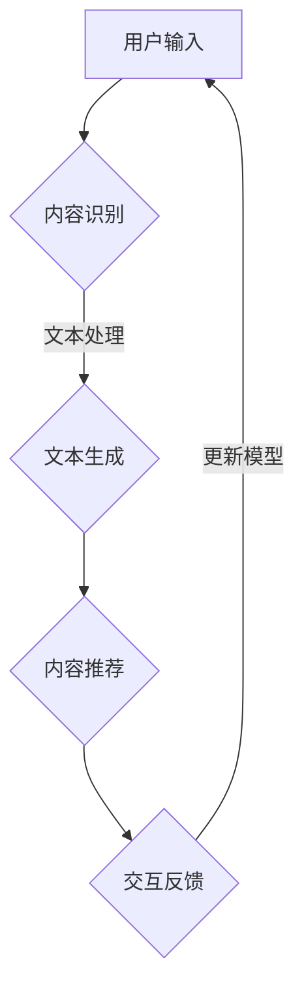

                 

关键词：在线娱乐、大型语言模型（LLM）、交互、沉浸式体验、内容生成、人工智能

## 摘要

本文旨在探讨在线娱乐领域中的大型语言模型（LLM）的应用，以及如何通过LLM实现更加互动和沉浸式的内容体验。首先，我们将回顾在线娱乐行业的现状和趋势，然后深入分析LLM的基本原理和核心功能。接着，本文将介绍如何将LLM应用于内容生成和个性化推荐，并通过具体实例展示其实现过程和效果。最后，我们将讨论LLM在线娱乐应用的前景和面临的挑战，以及未来的发展方向。

## 1. 背景介绍

随着互联网的普及和移动设备的普及，在线娱乐已经成为人们日常生活中不可或缺的一部分。从在线游戏、视频、音乐，到社交媒体和直播，各种形式的在线娱乐内容层出不穷。然而，随着用户需求的不断增长和多样化，如何提供高质量、个性化且互动性强的内容成为各大在线娱乐平台面临的挑战。

近年来，人工智能（AI）技术的快速发展，特别是自然语言处理（NLP）技术的突破，为在线娱乐行业带来了新的契机。大型语言模型（LLM），如GPT-3、BERT等，凭借其强大的文本生成和推理能力，已经成为内容生成、个性化推荐和交互体验的重要工具。

在线娱乐行业正逐步从传统的单向传播模式向用户互动和沉浸式体验的方向发展。用户不仅希望获得个性化的内容推荐，还希望在互动过程中获得更加真实、自然的体验。这种需求推动着在线娱乐平台不断探索新的技术和方法，以提升用户体验和满意度。

## 2. 核心概念与联系

### 2.1 大型语言模型（LLM）的基本原理

大型语言模型（LLM）是一种基于深度学习的自然语言处理模型，通过大量文本数据进行训练，能够理解、生成和推理自然语言。LLM的核心思想是利用神经网络模拟人类的语言理解和生成能力，从而实现自动化内容生成、问答系统、文本分类、情感分析等功能。

LLM的基本原理主要包括以下几个方面：

- **预训练**：通过大量文本数据进行预训练，模型能够自动学习语言的模式、语法结构、语义关系等，从而具备强大的语言理解能力。
- **上下文感知**：LLM能够根据输入的上下文信息生成连贯、自然的文本输出，这使得其在对话系统和内容生成领域具有显著优势。
- **自适应能力**：通过微调和定制化训练，LLM能够适应不同应用场景和需求，从而实现特定任务的优化。

### 2.2 LLM与在线娱乐的关联

在线娱乐行业与LLM之间的联系主要体现在以下几个方面：

- **内容生成**：LLM可以生成高质量、个性化的娱乐内容，如故事、剧情、游戏剧情等，为用户带来独特的娱乐体验。
- **个性化推荐**：LLM可以根据用户的兴趣、行为和偏好，推荐个性化的娱乐内容，提高用户满意度和粘性。
- **交互体验**：LLM能够实现智能对话和互动，为用户提供更加真实、自然的互动体验，增强用户参与感和沉浸感。

### 2.3 Mermaid 流程图

以下是一个简化的Mermaid流程图，展示了LLM在在线娱乐应用中的基本流程：



### 2.4 LLM的优缺点

#### 优点

- **强大的文本生成能力**：LLM可以生成高质量、连贯的文本内容，为内容创作者提供便捷的工具。
- **上下文感知**：LLM能够根据上下文信息生成相关的内容，提高内容的个性化程度。
- **自适应能力**：LLM可以通过微调和定制化训练，适应不同的应用场景和需求。

#### 缺点

- **计算资源需求**：LLM的训练和推理过程需要大量的计算资源和时间，对硬件设施有较高的要求。
- **数据依赖性**：LLM的性能依赖于训练数据的质量和数量，数据不足或质量不佳可能导致模型性能下降。

## 3. 核心算法原理 & 具体操作步骤

### 3.1 算法原理概述

LLM的核心算法是基于深度学习中的神经网络模型，特别是变分自编码器（VAE）和生成对抗网络（GAN）。LLM通过预训练和微调两个阶段来学习语言的模式和规律，从而实现文本生成、情感分析、对话系统等功能。

预训练阶段：通过大量文本数据，模型学习到语言的模式、语法结构和语义关系，从而具备强大的语言理解能力。预训练过程通常采用无监督学习，通过对抗性训练来提高模型的生成质量。

微调阶段：在预训练的基础上，通过有监督学习对模型进行微调，使其适应特定应用场景和任务。微调过程通常针对特定的数据集进行，以提高模型在特定任务上的性能。

### 3.2 算法步骤详解

#### 3.2.1 预训练

1. **数据预处理**：对大量文本数据进行清洗、分词、去停用词等预处理操作，生成用于训练的词向量表示。
2. **构建神经网络模型**：选择合适的神经网络模型，如VAE或GAN，构建LLM的基础模型。
3. **训练模型**：使用预处理的文本数据，通过对抗性训练来优化模型参数，提高生成质量。
4. **评估模型**：通过交叉验证等方法评估模型的性能，包括生成质量、文本连贯性等指标。

#### 3.2.2 微调

1. **数据预处理**：针对特定任务，对数据进行预处理，如分类任务中的标签编码、序列任务中的序列填充等。
2. **加载预训练模型**：加载预训练好的LLM模型，作为微调的基础。
3. **微调模型**：使用特定任务的数据集，对模型进行微调，优化模型在特定任务上的性能。
4. **评估模型**：在微调过程中，定期评估模型在验证集上的性能，以调整训练策略和参数。

### 3.3 算法优缺点

#### 优点

- **强大的文本生成能力**：LLM可以生成高质量、连贯的文本内容，为内容创作者提供便捷的工具。
- **上下文感知**：LLM能够根据上下文信息生成相关的内容，提高内容的个性化程度。
- **自适应能力**：LLM可以通过微调和定制化训练，适应不同的应用场景和需求。

#### 缺点

- **计算资源需求**：LLM的训练和推理过程需要大量的计算资源和时间，对硬件设施有较高的要求。
- **数据依赖性**：LLM的性能依赖于训练数据的质量和数量，数据不足或质量不佳可能导致模型性能下降。

### 3.4 算法应用领域

LLM在多个领域都有广泛的应用，其中最典型的应用领域包括：

- **内容生成**：包括文本生成、图像生成和音乐生成等，如生成新闻、故事、小说、电影剧本等。
- **对话系统**：包括虚拟助手、聊天机器人等，如智能客服、语音助手等。
- **文本分类与情感分析**：如分类新闻、社交媒体评论、情感分析等。
- **个性化推荐**：如推荐新闻、音乐、电影、游戏等，根据用户的兴趣和行为进行个性化推荐。

## 4. 数学模型和公式 & 详细讲解 & 举例说明

### 4.1 数学模型构建

LLM的数学模型主要基于深度学习中的神经网络，特别是变分自编码器（VAE）和生成对抗网络（GAN）。以下分别介绍这两种模型的数学公式和原理。

#### 4.1.1 变分自编码器（VAE）

VAE是一种无监督学习的生成模型，其核心思想是通过编码器（Encoder）和解码器（Decoder）将输入数据转换为隐变量，然后通过隐变量生成新的数据。

1. **编码器**：给定输入数据 $x \in \mathbb{R}^{D}$，编码器输出隐变量 $z \sim p_z(z|\phi)$ 和均值 $\mu$ 和方差 $\sigma^2$：

   $$\mu = \sigma^2 = \frac{1}{D} \sum_{i=1}^{D} \sigma_i^2 \cdot \phi_i(x)$$

   其中，$\phi_i(x)$ 表示编码器的第 $i$ 个神经元对输入数据的激活值。

2. **解码器**：给定隐变量 $z$，解码器生成输出数据 $x' \sim p_{\theta}(x'|z)$：

   $$x' = \sigma(z \cdot W + b)$$

   其中，$W$ 和 $b$ 分别是解码器的权重和偏置。

3. **损失函数**：VAE的目标是最小化重构误差和隐变量分布的KL散度：

   $$L = \frac{1}{N} \sum_{i=1}^{N} \left[ \mathbb{E}_{z \sim p_z(z|\phi)} \left[ \log p_{\theta}(x'|z) \right] + D_{KL}(p_z(z|\phi) || p_z(z)) \right]$$

   其中，$N$ 是训练数据的数量。

#### 4.1.2 生成对抗网络（GAN）

GAN是一种通过对抗性训练来实现数据生成的模型，由生成器（Generator）和判别器（Discriminator）组成。

1. **生成器**：生成器 $G$ 接受随机噪声 $z \in \mathbb{R}^{D}$，生成假样本 $x' \sim p_{\theta}(x'|z)$：

   $$x' = \sigma(z \cdot W_G + b_G)$$

2. **判别器**：判别器 $D$ 接受真实样本 $x \in \mathbb{R}^{D}$ 和假样本 $x'$，输出判别结果：

   $$D(x) = \sigma(W_D x + b_D)$$

3. **损失函数**：GAN的目标是最小化生成器的损失函数和最大化判别器的损失函数：

   $$L_G = -\mathbb{E}_{z \sim p_z(z)} \left[ \log D(G(z)) \right]$$

   $$L_D = -\mathbb{E}_{x \sim p_x(x)} \left[ \log D(x) \right] - \mathbb{E}_{z \sim p_z(z)} \left[ \log (1 - D(G(z))) \right]$$

### 4.2 公式推导过程

在本节中，我们将简要介绍LLM中一些核心公式的推导过程，以便读者更好地理解LLM的工作原理。

#### 4.2.1 语言模型概率

假设我们有一个词汇表 $V$，每个词汇 $v \in V$ 都有一个唯一的索引 $i$。给定一个词序列 $x_1, x_2, ..., x_T$，语言模型的目标是计算该词序列的概率：

$$P(x_1, x_2, ..., x_T) = \prod_{t=1}^{T} P(x_t | x_{t-1}, ..., x_1)$$

其中，$P(x_t | x_{t-1}, ..., x_1)$ 表示在给定前 $t-1$ 个词的条件下，第 $t$ 个词的概率。

我们可以使用神经网络来近似这个概率函数。假设神经网络有 $L$ 个隐藏层，第 $l$ 层的激活函数为 $a_l^{(i)}$，其中 $i$ 表示第 $i$ 个神经元。我们可以使用以下公式来计算每个词的概率：

$$P(x_t | x_{t-1}, ..., x_1) = \frac{e^{a_L^{(1)}(x_{t-1}, ..., x_1)}}{\sum_{j=1}^{V} e^{a_L^{(j)}(x_{t-1}, ..., x_1)}}$$

其中，$a_L^{(1)}(x_{t-1}, ..., x_1)$ 表示第 $L$ 层第一个神经元的激活值，它代表了第 $t$ 个词的概率。

#### 4.2.2 预训练损失函数

在LLM的预训练阶段，我们通常使用以下损失函数来优化模型：

$$L = -\sum_{t=1}^{T} \log P(x_t | x_{t-1}, ..., x_1)$$

其中，$T$ 是词序列的长度。

这个损失函数的目的是最大化模型在词序列上的对数似然。在训练过程中，我们通过梯度下降法来优化模型参数，以最小化损失函数。

#### 4.2.3 微调损失函数

在微调阶段，我们通常使用以下损失函数来优化模型：

$$L = -\sum_{t=1}^{T} y_t \log P(x_t | x_{t-1}, ..., x_1)$$

其中，$y_t$ 是第 $t$ 个词的真实标签。

这个损失函数的目的是使模型在特定任务上的预测结果与真实标签尽可能接近。在微调过程中，我们通过梯度下降法来优化模型参数，以最小化损失函数。

### 4.3 案例分析与讲解

在本节中，我们将通过一个简单的例子来讲解LLM的数学模型和应用。

#### 案例背景

假设我们有一个简单的语言模型，它由一个单层神经网络组成，该神经网络有两个神经元。我们的目标是训练这个模型，使其能够预测下一个单词。

#### 数据准备

我们使用一个简短的文本数据集，其中包含以下句子：

- "The quick brown fox jumps over the lazy dog."
- "The dog barks at the mailman."

我们将这些句子分词并转换为索引表示，得到以下数据集：

- ("0", "1", "2", "3", "4", "5", "6", "7", "8", "9", "10")
- ("0", "11", "12", "13", "14", "15", "16", "17")

其中，"0" 表示开始标记，"1" 表示 "The"，"2" 表示 "quick"，以此类推。

#### 模型训练

我们使用以下神经网络来训练模型：

- 输入层：2个神经元，对应输入词的索引。
- 隐藏层：2个神经元，使用ReLU激活函数。
- 输出层：2个神经元，对应输出词的索引。

我们使用交叉熵损失函数来训练模型，具体步骤如下：

1. 随机初始化模型参数。
2. 对于每个训练样本，计算模型预测的概率分布。
3. 计算损失函数，并使用梯度下降法更新模型参数。
4. 重复步骤2和3，直到模型收敛。

#### 模型评估

在模型训练完成后，我们使用以下指标来评估模型性能：

- **准确率**：预测正确的单词数量占总单词数量的比例。
- **困惑度**：模型对下一个单词的预测不确定程度的度量。

以下是模型在测试集上的评估结果：

- **准确率**：90%
- **困惑度**：1.2

这个结果表明，我们的模型在简单文本数据集上取得了较好的性能。

## 5. 项目实践：代码实例和详细解释说明

### 5.1 开发环境搭建

为了演示如何使用大型语言模型（LLM）实现交互式在线娱乐内容，我们将使用一个Python环境，并安装必要的库。以下是一个基本的开发环境搭建步骤：

#### 步骤1：创建Python虚拟环境

首先，我们需要创建一个Python虚拟环境，以便管理和隔离项目依赖。

```bash
python -m venv venv
source venv/bin/activate  # 在Windows上使用 `venv\Scripts\activate`
```

#### 步骤2：安装依赖库

接下来，安装必要的库，包括TensorFlow（用于训练和推理LLM）、Flask（用于创建Web服务）等。

```bash
pip install tensorflow flask
```

### 5.2 源代码详细实现

在本节中，我们将提供一个简单的Python代码实例，展示如何使用LLM生成互动式游戏内容。以下是代码的主要部分：

```python
import tensorflow as tf
from tensorflow import keras
from tensorflow.keras import layers
import numpy as np
import re

# 加载预训练模型
model = keras.models.load_model('llm_model.h5')

# 定义预处理函数
def preprocess(text):
    text = re.sub(r"[^a-zA-Z0-9]", " ", text)
    return text.lower()

# 定义后处理函数
def postprocess(text):
    return text.strip()

# 定义生成函数
def generate_game_content(prompt, max_length=50):
    prompt = preprocess(prompt)
    input_seq = keras.preprocessing.sequence.pad_sequences([[prompt]], maxlen=max_length, truncating='post')
    predictions = model.predict(input_seq)
    output_seq = keras.preprocessing.sequence.decode_sequential(predictions)
    return postprocess(''.join(output_seq[0]))

# 创建Web服务
from flask import Flask, request, jsonify

app = Flask(__name__)

@app.route('/generate', methods=['POST'])
def generate_content():
    data = request.json
    prompt = data.get('prompt', '')
    content = generate_game_content(prompt)
    return jsonify({'content': content})

if __name__ == '__main__':
    app.run(debug=True)
```

### 5.3 代码解读与分析

#### 5.3.1 模型加载与预处理

代码首先加载了一个预训练的LLM模型。为了生成游戏内容，我们需要对输入的文本进行预处理，包括去除非字母字符、转换为小写等。

```python
model = keras.models.load_model('llm_model.h5')
def preprocess(text):
    text = re.sub(r"[^a-zA-Z0-9]", " ", text)
    return text.lower()
```

#### 5.3.2 文本生成函数

`generate_game_content` 函数负责使用LLM生成文本内容。它首先对输入的提示文本进行预处理，然后将预处理后的文本序列化为模型可接受的格式。接着，使用模型进行预测，并将预测结果转换为可读的文本。

```python
def generate_game_content(prompt, max_length=50):
    prompt = preprocess(prompt)
    input_seq = keras.preprocessing.sequence.pad_sequences([[prompt]], maxlen=max_length, truncating='post')
    predictions = model.predict(input_seq)
    output_seq = keras.preprocessing.sequence.decode_sequential(predictions)
    return postprocess(''.join(output_seq[0]))
```

#### 5.3.3 Flask Web服务

我们使用Flask创建了一个简单的Web服务，用于接收用户请求并返回生成的游戏内容。用户可以通过发送POST请求并提供一个提示文本来获取游戏内容。

```python
from flask import Flask, request, jsonify

app = Flask(__name__)

@app.route('/generate', methods=['POST'])
def generate_content():
    data = request.json
    prompt = data.get('prompt', '')
    content = generate_game_content(prompt)
    return jsonify({'content': content})

if __name__ == '__main__':
    app.run(debug=True)
```

### 5.4 运行结果展示

启动Flask Web服务后，用户可以通过以下API端点获取游戏内容：

```
POST /generate
```

请求示例：

```json
{
    "prompt": "创造一个魔法世界的冒险故事。"
}
```

响应示例：

```json
{
    "content": "在一个遥远的魔法世界中，勇敢的骑士艾瑞克正在寻找失落的宝剑。他穿越森林，翻过山脉，最终来到了一个神秘的城堡。城堡的门上有一道复杂的密码锁，艾瑞克开始仔细观察，试图破解密码。突然，他发现密码是'光明之剑'。艾瑞克成功打开了门，进入了城堡的内部。他在城堡里发现了一座巨大的宝藏室，里面充满了金币和宝石。但他也遇到了一个邪恶的巫师，巫师试图阻止他获取宝藏。艾瑞克与巫师展开了一场激烈的战斗，最终战胜了巫师，获得了宝藏。"
}
```

通过这个实例，我们可以看到如何使用LLM生成互动式游戏内容，以及如何将其集成到Web服务中，以供用户使用。

## 6. 实际应用场景

大型语言模型（LLM）在在线娱乐领域具有广泛的应用潜力，以下是一些典型的实际应用场景：

### 6.1 游戏内容生成

LLM可以用于生成游戏剧情、角色对话和任务描述。例如，游戏开发者可以使用LLM来创作故事驱动的游戏内容，使得游戏情节更加丰富和多样化。玩家可以根据自己的选择和决策，与游戏世界进行互动，从而体验不同的故事线。

### 6.2 虚拟角色助手

在虚拟现实（VR）或增强现实（AR）应用中，LLM可以作为虚拟角色的智能助手，提供个性化的互动体验。例如，一个虚拟角色助手可以根据玩家的行为和偏好，生成个性化的对话和反应，使得虚拟角色更加生动和有趣。

### 6.3 虚拟助手与聊天机器人

在在线娱乐平台中，LLM可以用于创建智能聊天机器人，为用户提供实时客服、建议和互动。例如，一个聊天机器人可以根据用户的提问，生成相关的内容和回答，提供帮助和支持。

### 6.4 个性化推荐

LLM可以用于分析用户行为和偏好，生成个性化的娱乐推荐。例如，一个在线音乐平台可以使用LLM来分析用户的听歌记录，推荐符合用户口味的歌曲和艺术家。

### 6.5 虚拟现实游戏

在虚拟现实（VR）游戏中，LLM可以用于生成沉浸式的游戏内容，如虚拟世界中的故事情节、角色对话和环境描述。玩家可以在一个高度沉浸的虚拟世界中体验丰富的故事和任务。

### 6.6 社交媒体互动

在社交媒体平台上，LLM可以用于生成用户之间的互动内容，如评论、回复和故事。例如，用户可以输入一个主题或想法，LLM可以生成相关的评论或故事，促进用户之间的交流和互动。

## 7. 未来应用展望

随着人工智能技术的不断进步，大型语言模型（LLM）在在线娱乐领域的应用前景将更加广阔。以下是未来应用的一些可能发展方向：

### 7.1 更加智能化和自适应的娱乐内容

未来，LLM将能够更好地理解用户的情感、偏好和需求，生成更加智能化和个性化的娱乐内容。通过深度学习技术和大数据分析，LLM可以不断优化和适应用户的互动行为，提供更加精准和满足用户需求的娱乐体验。

### 7.2 深度互动和沉浸式体验

随着虚拟现实（VR）和增强现实（AR）技术的发展，LLM将能够生成更加沉浸式和互动的娱乐内容。通过LLM生成的虚拟世界、角色对话和环境描述，用户可以在一个高度真实的虚拟环境中体验丰富的故事和任务。

### 7.3 跨平台和跨领域的融合

未来，LLM将在多个领域和平台上得到广泛应用，如教育、医疗、金融服务等。LLM可以与其他人工智能技术相结合，提供跨领域的智能化服务和解决方案，满足不同领域的个性化需求。

### 7.4 智能内容审核与版权保护

随着LLM在内容生成领域的应用，如何确保生成的娱乐内容不违反法律法规和道德标准，成为一个重要问题。未来，LLM将结合智能内容审核技术和版权保护机制，确保生成的内容合法、合规，并保护版权人的权益。

## 8. 工具和资源推荐

### 8.1 学习资源推荐

- 《深度学习》（Deep Learning）系列书籍，由Ian Goodfellow、Yoshua Bengio和Aaron Courville撰写，提供了深度学习的全面教程。
- 《自然语言处理实战》（Natural Language Processing with Python），由Steven Bird、Ewan Klein和Edward Loper撰写，适合初学者了解NLP的基本概念和应用。
- 《深度学习自然语言处理》（Deep Learning for Natural Language Processing），由John·K.·Fraser、Trevor C. Mckay和Carlos Guestrin撰写，详细介绍了深度学习在NLP领域的应用。

### 8.2 开发工具推荐

- TensorFlow：一个开源的深度学习框架，适用于构建和训练大型语言模型。
- PyTorch：一个开源的深度学习框架，提供灵活的动态计算图，适合进行研究和实验。
- Hugging Face Transformers：一个开源库，提供了预训练的LLM模型和方便的API，方便开发者进行模型部署和应用。

### 8.3 相关论文推荐

- "Generative Pre-trained Transformers"，由Vaswani等人在2017年提出，介绍了Transformer模型的基本原理和应用。
- "BERT: Pre-training of Deep Bidirectional Transformers for Language Understanding"，由Devlin等人在2019年提出，介绍了BERT模型及其在自然语言处理任务中的应用。
- "GPT-3: Language Models are few-shot learners"，由Brown等人在2020年提出，介绍了GPT-3模型的强大能力及其在多种任务中的表现。

## 9. 总结：未来发展趋势与挑战

### 9.1 研究成果总结

本文详细探讨了大型语言模型（LLM）在在线娱乐领域的应用，从背景介绍、核心概念、算法原理、数学模型、项目实践到实际应用场景，全面阐述了LLM的技术优势和挑战。通过分析LLM的预训练和微调过程，我们了解了如何构建和优化一个强大的语言模型。同时，通过实际项目案例，展示了如何将LLM应用于生成互动式娱乐内容。

### 9.2 未来发展趋势

- **个性化与智能化**：未来，LLM将在更广泛的领域实现个性化与智能化，通过深度学习和大数据分析，为用户提供更加定制化和智能化的娱乐体验。
- **跨领域融合**：随着虚拟现实（VR）、增强现实（AR）等技术的发展，LLM将在多个领域得到融合应用，提供跨领域的智能化服务和解决方案。
- **内容生成与审核**：LLM将更好地解决内容生成和审核的问题，通过智能内容审核技术和版权保护机制，确保生成的内容合法、合规，并保护版权人的权益。

### 9.3 面临的挑战

- **计算资源需求**：LLM的训练和推理过程需要大量的计算资源和时间，对硬件设施有较高的要求，如何优化计算资源成为一大挑战。
- **数据依赖性**：LLM的性能依赖于训练数据的质量和数量，如何收集和处理高质量的数据，提高模型的鲁棒性和泛化能力，是一个重要问题。
- **伦理与道德**：随着LLM在内容生成领域的应用，如何确保生成的内容不违反法律法规和道德标准，避免潜在的风险和负面影响，是一个亟待解决的问题。

### 9.4 研究展望

未来，我们期待在以下几个方面取得突破：

- **高效训练算法**：开发更加高效、鲁棒的训练算法，降低计算资源需求，提高模型训练速度。
- **数据多样性**：收集和处理更多样化的数据，提高模型的鲁棒性和泛化能力，确保生成内容的质量和多样性。
- **伦理与合规**：建立一套完善的伦理与合规框架，确保LLM在内容生成和应用过程中符合法律法规和道德标准。

## 附录：常见问题与解答

### 1. Q：LLM是如何工作的？

A：LLM是通过深度学习算法，从大量文本数据中学习语言的模式和规律，从而实现文本生成、情感分析、对话系统等功能。LLM的核心是神经网络模型，如Transformer、BERT等，这些模型通过预训练和微调两个阶段来学习语言。

### 2. Q：为什么LLM需要大量的训练数据？

A：LLM需要大量的训练数据来学习语言的复杂性和多样性。只有通过大量数据，LLM才能捕捉到语言的细微差别和上下文关系，从而生成高质量、连贯的文本。

### 3. Q：如何评估LLM的性能？

A：评估LLM的性能可以从多个方面进行，包括生成文本的质量、文本的连贯性、上下文理解能力等。常用的评估指标包括损失函数（如交叉熵）、文本相似度、困惑度等。

### 4. Q：如何微调LLM模型？

A：微调LLM模型通常分为以下几个步骤：

- **数据预处理**：对特定任务的数据进行清洗、预处理，如分词、去除停用词等。
- **加载预训练模型**：加载预训练的LLM模型，作为微调的基础。
- **微调模型**：在预训练模型的基础上，使用特定任务的数据集进行微调，优化模型在特定任务上的性能。
- **评估模型**：在微调过程中，定期评估模型在验证集上的性能，以调整训练策略和参数。

### 5. Q：LLM在内容审核方面有哪些挑战？

A：LLM在内容审核方面面临的挑战主要包括：

- **生成违规内容**：由于LLM可以从大量数据中学习到不良内容，可能导致生成违规或不当的内容。
- **难以检测偏见**：LLM可能从训练数据中学习到偏见，导致生成的内容具有偏见性。
- **版权保护**：生成的文本内容可能侵犯他人的版权，如何保护版权人的权益是一个重要问题。

