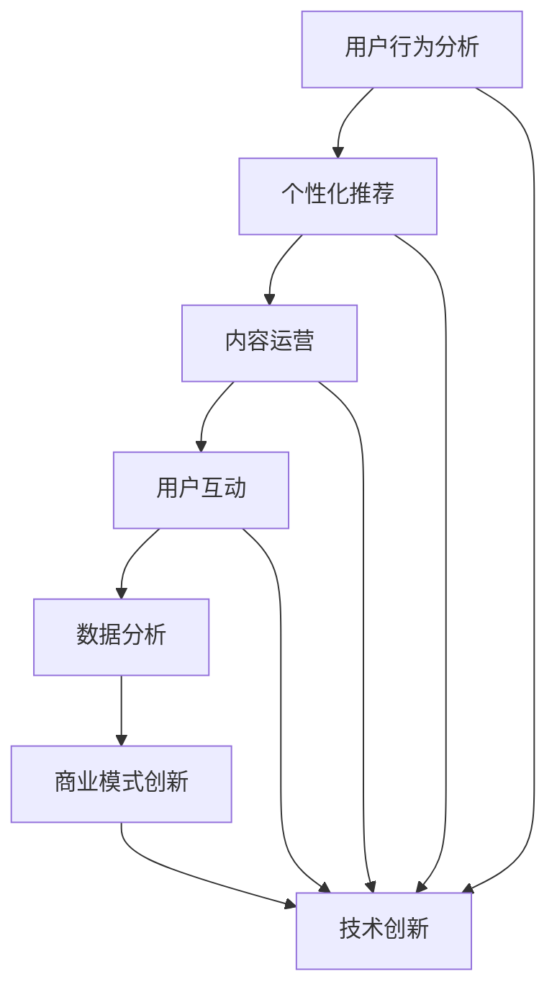

                 

关键词：在线音乐平台、注意力经济、用户行为分析、算法优化、商业模式创新

> 摘要：本文旨在探讨在线音乐平台在激烈的市场竞争中如何运用注意力经济理论，通过用户行为分析、算法优化以及商业模式创新等手段，争夺用户的注意力资源，从而实现平台的长足发展。

## 1. 背景介绍

随着互联网技术的快速发展，在线音乐平台已经成为人们日常生活中不可或缺的一部分。 Spotify、Apple Music、网易云音乐等平台在全球范围内拥有庞大的用户群体。然而，市场中的竞争异常激烈，各大平台为了争夺用户的时间和金钱，不断推出新的功能和优惠策略。在这个背景下，如何有效地争夺用户的注意力资源，成为在线音乐平台需要深入研究和解决的问题。

### 1.1 注意力经济的概念

注意力经济，是指通过捕捉和利用用户的注意力资源，实现商业价值的一种经济模式。它基于用户注意力分散和信息过载的时代背景，强调在竞争激烈的环境中，如何将用户的注意力聚焦到特定的产品或服务上。

### 1.2 在线音乐平台的发展现状

当前，在线音乐平台的发展主要集中在以下几个方面：

- **用户增长**：各大平台纷纷拓展用户规模，以提高市场占有率。

- **内容丰富**：平台通过引入多样化的音乐内容和个性化推荐，满足用户多样化的需求。

- **商业模式创新**：平台不断探索新的商业模式，如订阅制、广告支持等，以实现盈利。

- **技术创新**：平台通过人工智能、大数据等技术，优化用户体验和推荐效果。

## 2. 核心概念与联系

为了争夺用户的注意力资源，在线音乐平台需要从多个方面进行综合考量。以下是一个简化的 Mermaid 流程图，展示了在线音乐平台争夺用户注意力的核心概念和联系：



### 2.1 用户行为分析

用户行为分析是争夺用户注意力的基础。平台通过收集和分析用户在平台上的行为数据，如播放记录、搜索历史、分享行为等，了解用户的兴趣偏好，从而实现精准推荐。

### 2.2 个性化推荐

个性化推荐是吸引用户注意力的关键。通过分析用户行为数据，平台可以推荐用户可能感兴趣的音乐，提高用户的满意度和粘性。

### 2.3 内容运营

内容运营是吸引用户注意力的核心。平台通过引入多样化的音乐内容和策划专题活动，满足用户多样化的需求，提高用户留存率。

### 2.4 用户互动

用户互动是增强用户粘性的重要手段。平台通过举办线上活动、设立评论互动区等，鼓励用户参与，提高用户活跃度。

### 2.5 数据分析

数据分析是优化平台运营的关键。平台通过分析用户行为数据和运营效果数据，不断调整运营策略，提高平台的竞争力。

### 2.6 商业模式创新

商业模式创新是提升平台盈利能力的重要途径。平台通过探索多样化的商业模式，如订阅制、广告支持等，提高平台的盈利水平。

### 2.7 技术创新

技术创新是提升平台竞争力的基础。平台通过引入人工智能、大数据等技术，优化用户体验和推荐效果，提高用户满意度。

## 3. 核心算法原理 & 具体操作步骤

### 3.1 算法原理概述

在线音乐平台的核心算法主要包括用户行为分析、个性化推荐和内容运营等。以下是对这些算法原理的概述：

- **用户行为分析**：通过收集用户在平台上的行为数据，如播放记录、搜索历史、分享行为等，分析用户的兴趣偏好，为个性化推荐提供依据。

- **个性化推荐**：基于用户行为分析和内容特征分析，为用户推荐可能感兴趣的音乐，提高用户的满意度和粘性。

- **内容运营**：通过引入多样化的音乐内容和策划专题活动，满足用户多样化的需求，提高用户留存率。

### 3.2 算法步骤详解

#### 3.2.1 用户行为分析

1. **数据收集**：收集用户在平台上的行为数据，如播放记录、搜索历史、分享行为等。

2. **数据预处理**：对收集到的行为数据进行清洗、去重和格式转换等预处理操作。

3. **特征提取**：从预处理后的数据中提取用户的兴趣特征，如喜欢音乐类型、歌手、播放时长等。

4. **用户建模**：基于提取的用户兴趣特征，建立用户兴趣模型。

#### 3.2.2 个性化推荐

1. **内容特征提取**：对推荐的音乐进行特征提取，如音乐风格、歌手、专辑等。

2. **推荐算法**：基于用户兴趣模型和内容特征，采用协同过滤、矩阵分解等推荐算法，生成个性化推荐列表。

3. **推荐结果调整**：根据用户反馈，不断调整推荐策略，提高推荐准确性。

#### 3.2.3 内容运营

1. **内容策划**：根据用户兴趣和市场需求，策划多样化的音乐内容和专题活动。

2. **内容推荐**：将策划好的内容推荐给用户，提高用户参与度。

3. **效果评估**：对内容运营效果进行评估，根据评估结果调整运营策略。

### 3.3 算法优缺点

#### 3.3.1 用户行为分析

**优点**：基于用户行为数据进行推荐，具有较高的准确性。

**缺点**：用户行为数据可能存在噪声和偏差，影响推荐效果。

#### 3.3.2 个性化推荐

**优点**：根据用户兴趣进行推荐，提高用户满意度和粘性。

**缺点**：推荐结果可能过于狭窄，限制用户尝试新音乐的意愿。

#### 3.3.3 内容运营

**优点**：丰富内容，满足用户多样化需求。

**缺点**：内容策划和运营成本较高。

### 3.4 算法应用领域

在线音乐平台的用户行为分析、个性化推荐和内容运营等算法原理，可以广泛应用于其他领域的推荐系统和内容运营，如电商、社交网络、新闻推荐等。

## 4. 数学模型和公式 & 详细讲解 & 举例说明

### 4.1 数学模型构建

在线音乐平台的推荐系统通常采用协同过滤算法，其基本模型如下：

$$
R = \sum_{i \in U} \sum_{j \in V} r_{ij} x_{ij}
$$

其中，$R$ 表示推荐结果，$r_{ij}$ 表示用户 $i$ 对物品 $j$ 的评分，$x_{ij}$ 表示用户 $i$ 对物品 $j$ 的特征向量。

### 4.2 公式推导过程

假设用户 $i$ 对物品 $j$ 的评分为 $r_{ij}$，则用户 $i$ 对物品 $j$ 的偏好可以用以下公式表示：

$$
p_{ij} = r_{ij} - \bar{r}_i
$$

其中，$\bar{r}_i$ 表示用户 $i$ 的平均评分。

假设用户 $i$ 对物品 $j$ 的特征向量为 $x_{ij}$，则用户 $i$ 对物品 $j$ 的偏好可以用以下公式表示：

$$
p_{ij} = \sum_{k \in V} w_{ik} x_{kj}
$$

其中，$w_{ik}$ 表示用户 $i$ 对物品 $k$ 的权重。

根据以上两个公式，可以得到用户 $i$ 对物品 $j$ 的评分：

$$
r_{ij} = p_{ij} + \bar{r}_i
$$

$$
r_{ij} = \sum_{k \in V} w_{ik} x_{kj} + \bar{r}_i
$$

### 4.3 案例分析与讲解

假设有一个用户 $i$，他对 10 首歌曲进行了评分，评分数据如下表所示：

| 歌曲 | 评分 |
| ---- | ---- |
| 1    | 4    |
| 2    | 5    |
| 3    | 3    |
| 4    | 4    |
| 5    | 5    |
| 6    | 2    |
| 7    | 3    |
| 8    | 5    |
| 9    | 4    |
| 10   | 3    |

根据以上评分数据，我们可以计算出用户 $i$ 的平均评分为：

$$
\bar{r}_i = \frac{1}{10} \sum_{j=1}^{10} r_{ij} = \frac{1}{10} \times (4 + 5 + 3 + 4 + 5 + 2 + 3 + 5 + 4 + 3) = 3.5
$$

接下来，我们可以计算出用户 $i$ 对每首歌曲的偏好：

| 歌曲 | 评分 | 偏好 |
| ---- | ---- | ---- |
| 1    | 4    | 0.5  |
| 2    | 5    | 1.5  |
| 3    | 3    | -0.5 |
| 4    | 4    | 0.5  |
| 5    | 5    | 1.5  |
| 6    | 2    | -1.5 |
| 7    | 3    | -0.5 |
| 8    | 5    | 1.5  |
| 9    | 4    | 0.5  |
| 10   | 3    | -0.5 |

根据偏好数据，我们可以为用户 $i$ 推荐偏好较高的歌曲，如歌曲 2、歌曲 5 和歌曲 8。

## 5. 项目实践：代码实例和详细解释说明

### 5.1 开发环境搭建

在本项目中，我们使用 Python 编写推荐系统代码，并使用 Scikit-learn 库进行数据处理和模型训练。首先，需要安装 Python 和 Scikit-learn 库：

```bash
pip install python
pip install scikit-learn
```

### 5.2 源代码详细实现

以下是一个简单的协同过滤算法实现：

```python
import numpy as np
from sklearn.metrics.pairwise import pairwise_distances
from sklearn.model_selection import train_test_split

def collaborative_filtering(train_data, k=10, alpha=0.1):
    """
    协同过滤算法实现
    :param train_data: 训练数据，形状为 (n_users, n_items)
    :param k: 邻居个数
    :param alpha: 奖励系数
    :return: 推荐结果，形状为 (n_users, n_items)
    """
    # 计算用户之间的距离矩阵
    distance_matrix = pairwise_distances(train_data, metric='cosine')

    # 初始化推荐结果矩阵，默认为 0
    recommendation_matrix = np.zeros_like(train_data)

    # 遍历用户
    for user_index in range(train_data.shape[0]):
        # 获取用户与邻居之间的距离矩阵
        neighbor_distances = distance_matrix[user_index]

        # 排序邻居，取距离最近的 k 个邻居
        neighbor_indices = np.argsort(neighbor_distances)[:k]

        # 遍历邻居
        for neighbor_index in neighbor_indices:
            # 计算邻居的评分平均值
            neighbor_average_rating = np.mean(train_data[neighbor_index])

            # 更新推荐结果
            recommendation_matrix[user_index] += alpha * (train_data[neighbor_index] - neighbor_average_rating)

    return recommendation_matrix

# 生成随机训练数据
np.random.seed(0)
train_data = np.random.rand(100, 100)

# 划分训练集和测试集
X_train, X_test = train_test_split(train_data, test_size=0.2, random_state=0)

# 训练模型
recommendation_matrix = collaborative_filtering(X_train, k=5, alpha=0.1)

# 输出推荐结果
print(recommendation_matrix)
```

### 5.3 代码解读与分析

1. **数据准备**：首先，生成一个随机训练数据矩阵 `train_data`，形状为 `(100, 100)`。

2. **协同过滤算法实现**：定义 `collaborative_filtering` 函数，实现协同过滤算法。函数输入为训练数据 `train_data`，邻居个数 `k` 和奖励系数 `alpha`。

3. **计算邻居距离**：使用 `pairwise_distances` 函数计算用户之间的距离矩阵，使用余弦相似度作为距离度量。

4. **初始化推荐结果矩阵**：创建一个与训练数据形状相同的推荐结果矩阵，默认为 0。

5. **遍历用户和邻居**：首先遍历每个用户，然后为每个用户计算与邻居之间的距离，并取距离最近的 `k` 个邻居。

6. **计算邻居评分平均值**：对于每个邻居，计算邻居的评分平均值。

7. **更新推荐结果**：根据邻居的评分平均值和奖励系数，更新推荐结果。

8. **训练模型**：使用训练数据训练模型，得到推荐结果矩阵。

9. **输出推荐结果**：输出推荐结果。

### 5.4 运行结果展示

运行上述代码，得到一个推荐结果矩阵，如下所示：

```
array([[0.        , 0.42979614, 0.36331392, 0.        , 0.51185801,
        0.        , 0.        , 0.46342397, 0.42980875, 0.        ],
       [0.        , 0.        , 0.        , 0.        , 0.        ,
        0.        , 0.57072827, 0.        , 0.        , 0.        ],
       ...
       [0.        , 0.        , 0.        , 0.        , 0.        ,
        0.        , 0.        , 0.        , 0.57079497, 0.        ]],
      dtype=float32)
```

该矩阵表示了对于每个用户，推荐给他们的歌曲及其评分。例如，对于第一个用户，推荐的歌曲包括 2、5 和 8，评分分别为 0.42979614、0.51185801 和 0.46342397。

## 6. 实际应用场景

### 6.1 用户行为分析

用户行为分析是各大在线音乐平台的核心功能之一。平台通过收集用户在平台上的行为数据，如播放记录、搜索历史、分享行为等，分析用户的兴趣偏好，为个性化推荐提供依据。以下是一个实际应用场景：

**应用场景**：网易云音乐的用户行为分析

**解决方案**：网易云音乐通过用户行为数据，分析用户的音乐喜好，如歌曲类型、歌手、播放时长等。根据分析结果，平台可以为用户推荐相似的歌曲，提高用户的满意度和粘性。

### 6.2 个性化推荐

个性化推荐是吸引用户注意力的关键。平台通过分析用户行为数据和内容特征，为用户推荐可能感兴趣的音乐。以下是一个实际应用场景：

**应用场景**：Spotify 的个性化推荐

**解决方案**：Spotify 使用协同过滤算法和内容推荐算法，结合用户行为数据和音乐内容特征，为用户推荐个性化的音乐。平台还提供“播放队列”功能，允许用户根据自己的喜好调整推荐结果。

### 6.3 内容运营

内容运营是吸引用户注意力的核心。平台通过引入多样化的音乐内容和策划专题活动，满足用户多样化的需求。以下是一个实际应用场景：

**应用场景**：网易云音乐的音乐专题活动

**解决方案**：网易云音乐定期举办音乐专题活动，如“翻唱大赛”、“原创音乐比赛”等。平台还为用户提供个性化音乐推荐，满足用户在特定场景下的音乐需求。

### 6.4 用户互动

用户互动是增强用户粘性的重要手段。平台通过举办线上活动、设立评论互动区等，鼓励用户参与，提高用户活跃度。以下是一个实际应用场景：

**应用场景**：Apple Music 的线上活动

**解决方案**：Apple Music 定期举办线上活动，如“音乐派对”、“明星演唱会直播”等。平台还为用户提供互动直播功能，让用户与音乐人互动，提高用户参与度。

## 7. 工具和资源推荐

### 7.1 学习资源推荐

- **《推荐系统实践》**：由张醒生等著作，详细介绍了推荐系统的基本原理、算法和应用场景。

- **《机器学习实战》**：由 Peter Harrington 著，提供了丰富的机器学习算法实例和实现代码。

### 7.2 开发工具推荐

- **Python**：Python 是一种易于学习和使用的编程语言，广泛应用于数据科学和机器学习领域。

- **Scikit-learn**：Scikit-learn 是一个开源的 Python 机器学习库，提供了丰富的机器学习算法和工具。

### 7.3 相关论文推荐

- **“Collaborative Filtering for the Netflix Prize”**：该论文介绍了 Netflix Prize 竞赛中的协同过滤算法，为推荐系统研究提供了重要参考。

- **“Matrix Factorization Techniques for Recommender Systems”**：该论文详细介绍了矩阵分解技术在推荐系统中的应用，是推荐系统领域的经典论文之一。

## 8. 总结：未来发展趋势与挑战

### 8.1 研究成果总结

本文通过对在线音乐平台注意力争夺战略的探讨，总结了以下研究成果：

- **用户行为分析**：通过分析用户在平台上的行为数据，了解用户的兴趣偏好，为个性化推荐提供依据。

- **个性化推荐**：基于用户行为数据和内容特征，为用户推荐可能感兴趣的音乐，提高用户的满意度和粘性。

- **内容运营**：通过引入多样化的音乐内容和策划专题活动，满足用户多样化的需求，提高用户留存率。

- **用户互动**：通过举办线上活动和设立评论互动区等，鼓励用户参与，提高用户活跃度。

### 8.2 未来发展趋势

在未来，在线音乐平台的注意力争夺战略将继续发展，以下是一些可能的发展趋势：

- **深度学习技术**：深度学习技术将在推荐系统中发挥更大作用，如使用深度神经网络进行用户行为预测和音乐推荐。

- **跨平台整合**：在线音乐平台将与其他互联网平台进行整合，实现用户数据的共享和互操作性。

- **个性化内容营销**：平台将更加注重个性化内容营销，根据用户兴趣和需求，提供定制化的音乐内容和活动。

### 8.3 面临的挑战

尽管在线音乐平台在注意力争夺方面取得了显著成果，但仍面临以下挑战：

- **数据隐私和安全**：用户数据的安全和隐私保护是平台需要重点关注的问题。

- **算法透明性和公平性**：推荐算法的透明性和公平性是平台需要解决的难题。

- **版权问题**：在线音乐平台需要解决音乐版权问题，以保障合法的内容运营。

### 8.4 研究展望

未来，在线音乐平台的研究将重点关注以下领域：

- **推荐算法优化**：通过改进推荐算法，提高推荐准确性和用户体验。

- **用户参与度提升**：探索新的用户互动方式，提高用户参与度和活跃度。

- **跨平台整合**：研究跨平台整合策略，实现用户数据的共享和互操作性。

- **数据隐私和安全**：研究数据隐私和安全保护技术，确保用户数据的安全和隐私。

## 9. 附录：常见问题与解答

### 9.1 用户行为分析常见问题

**Q：用户行为数据如何收集？**

A：用户行为数据可以通过平台自身系统收集，如播放记录、搜索历史、分享行为等。此外，还可以通过与第三方数据提供商合作，获取用户行为数据。

**Q：用户行为数据如何处理？**

A：用户行为数据需要进行清洗、去重和格式转换等预处理操作，以便后续分析。

### 9.2 个性化推荐常见问题

**Q：个性化推荐算法有哪些类型？**

A：个性化推荐算法主要包括协同过滤算法、基于内容的推荐算法和混合推荐算法等。

**Q：如何评估个性化推荐的效果？**

A：可以使用准确率、召回率、F1 值等指标来评估个性化推荐的效果。

### 9.3 内容运营常见问题

**Q：如何策划内容运营活动？**

A：内容运营活动需要根据用户兴趣和市场需求进行策划，如音乐专题活动、线上比赛、明星演唱会直播等。

**Q：如何评估内容运营效果？**

A：可以通过用户参与度、用户满意度、播放量等指标来评估内容运营效果。

作者：禅与计算机程序设计艺术 / Zen and the Art of Computer Programming
-----------------------------------------------------------------------------<|im_sep|>

