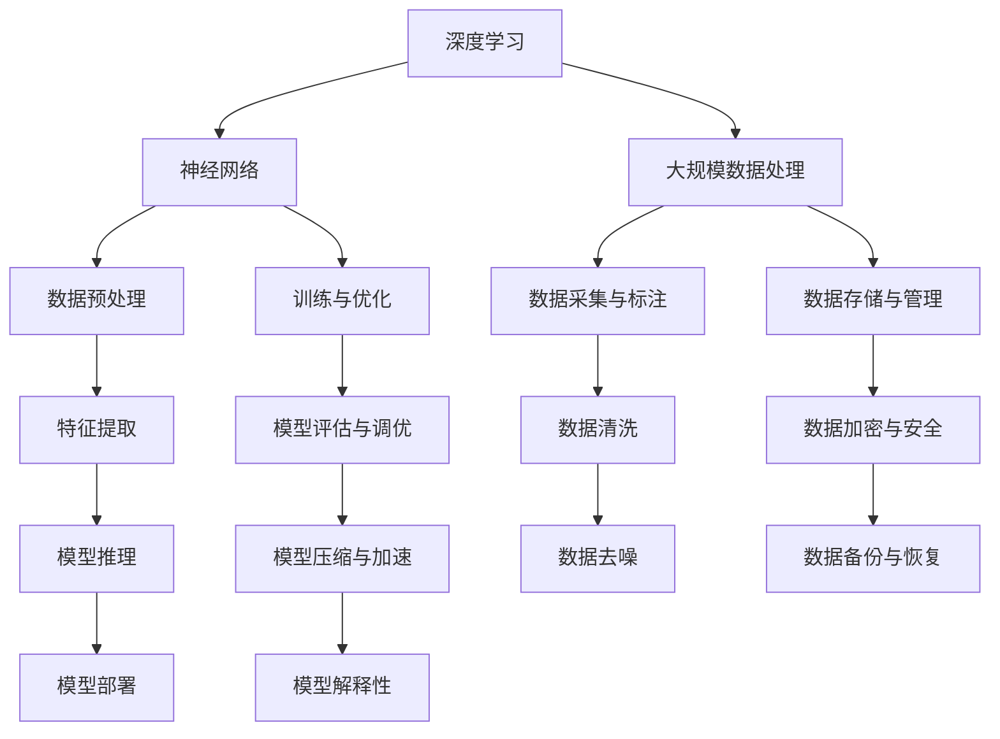
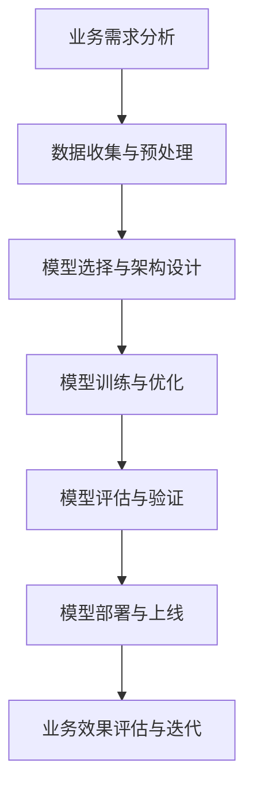

                 

关键词：AI大模型、垂直领域、应用、风险、机遇

> 摘要：本文深入探讨了垂直领域AI大模型的应用现状、机遇与风险。通过分析AI大模型的核心技术、应用场景以及潜在问题，旨在为业界提供有价值的参考和指导。

## 1. 背景介绍

随着人工智能技术的飞速发展，AI大模型已经成为现代技术领域的重要趋势。这些模型在处理复杂数据、解决实际问题方面展现出强大的能力。然而，AI大模型的应用不仅限于通用场景，垂直领域的应用也逐渐受到关注。所谓垂直领域，是指针对特定行业或领域的应用场景。例如，在金融、医疗、教育、制造等领域，AI大模型被用于图像识别、自然语言处理、预测分析等任务，取得了显著的成果。

垂直领域AI大模型的应用不仅为行业带来了创新和变革，也带来了一系列机遇与风险。本文将从以下几个方面展开讨论：

- AI大模型的核心技术
- 垂直领域AI大模型的应用场景
- 风险与挑战
- 未来发展趋势与展望

## 2. 核心概念与联系

### 2.1 AI大模型的核心技术

AI大模型的核心技术主要包括深度学习、神经网络和大规模数据处理。以下是一个简化的Mermaid流程图，展示了这些核心技术的基本架构和相互关系：



### 2.2 AI大模型在垂直领域的应用

AI大模型在垂直领域的应用场景非常广泛，以下是一个简单的Mermaid流程图，展示了这些应用的基本流程和关键步骤：



## 3. 核心算法原理 & 具体操作步骤

### 3.1 算法原理概述

AI大模型的核心算法是基于深度学习的神经网络。深度学习是一种通过模拟人脑神经网络的结构和功能来实现人工智能的技术。神经网络由多个层级组成，每个层级都包含多个神经元。通过前向传播和反向传播的过程，神经网络可以自动学习数据的特征和规律，从而实现分类、预测、生成等任务。

### 3.2 算法步骤详解

以下是AI大模型应用的基本步骤：

1. **数据收集与预处理**：收集相关领域的数据，并进行清洗、归一化等预处理操作。
2. **模型选择与架构设计**：根据应用需求选择合适的模型架构，如卷积神经网络（CNN）、循环神经网络（RNN）等。
3. **模型训练与优化**：使用预处理后的数据对模型进行训练，并使用优化算法调整模型的参数。
4. **模型评估与验证**：评估模型的性能，包括准确率、召回率、F1值等指标。
5. **模型部署与上线**：将训练好的模型部署到生产环境中，进行实际应用。

### 3.3 算法优缺点

**优点**：

- **强大的数据处理能力**：深度学习模型可以自动学习数据中的复杂特征，对大规模数据具有很好的处理能力。
- **高准确性**：深度学习模型在许多任务中取得了很高的准确率，特别是在图像识别、语音识别等领域。

**缺点**：

- **计算资源消耗大**：深度学习模型需要大量的计算资源和时间进行训练，特别是在大规模数据处理时。
- **数据依赖性强**：深度学习模型的性能很大程度上依赖于数据的数量和质量，对数据标注和预处理要求较高。

### 3.4 算法应用领域

AI大模型在垂直领域的应用非常广泛，以下是一些典型的应用领域：

- **金融**：用于风险控制、欺诈检测、市场预测等。
- **医疗**：用于疾病诊断、药物研发、医疗图像分析等。
- **教育**：用于个性化学习、学习评估、教育资源推荐等。
- **制造**：用于设备故障预测、生产优化、质量检测等。

## 4. 数学模型和公式 & 详细讲解 & 举例说明

### 4.1 数学模型构建

AI大模型通常使用多层感知机（MLP）、卷积神经网络（CNN）或循环神经网络（RNN）等模型。以下是一个简化的MLP模型：

$$
\begin{aligned}
    \text{输出} &= \text{激活函数}(W_1 \cdot X + b_1) \\
    \text{其中} W_1 &= \text{权重矩阵}, b_1 = \text{偏置}, X = \text{输入向量}, \\
    \text{激活函数} &= \text{ReLU}(x) = \max(0, x)
\end{aligned}
$$

### 4.2 公式推导过程

以下是卷积神经网络（CNN）的一个简化推导过程：

$$
\begin{aligned}
    \text{卷积层输出} &= \text{激活函数}(\text{卷积运算}(\text{输入}, \text{卷积核})) + \text{偏置} \\
    \text{卷积运算} &= (f \star g)(t) = \sum_{x=-\infty}^{\infty} \sum_{y=-\infty}^{\infty} f(x, y) \cdot g(t - x, y)
\end{aligned}
$$

### 4.3 案例分析与讲解

以下是一个简单的案例，展示如何使用CNN模型进行图像分类：

1. **数据准备**：收集一组包含不同类别图像的数据集，并对图像进行预处理。
2. **模型构建**：使用TensorFlow等深度学习框架构建一个简单的CNN模型。
3. **模型训练**：使用预处理后的图像数据对模型进行训练，调整模型参数。
4. **模型评估**：使用验证集评估模型的性能，调整模型结构和参数。
5. **模型部署**：将训练好的模型部署到生产环境中，进行实际应用。

## 5. 项目实践：代码实例和详细解释说明

### 5.1 开发环境搭建

1. 安装Python和TensorFlow等深度学习框架。
2. 准备数据集，并进行预处理。

### 5.2 源代码详细实现

以下是一个简单的CNN模型代码实例：

```python
import tensorflow as tf
from tensorflow.keras.models import Sequential
from tensorflow.keras.layers import Conv2D, MaxPooling2D, Flatten, Dense

# 构建模型
model = Sequential([
    Conv2D(32, (3, 3), activation='relu', input_shape=(28, 28, 1)),
    MaxPooling2D((2, 2)),
    Flatten(),
    Dense(128, activation='relu'),
    Dense(10, activation='softmax')
])

# 编译模型
model.compile(optimizer='adam',
              loss='categorical_crossentropy',
              metrics=['accuracy'])

# 训练模型
model.fit(x_train, y_train, epochs=5, batch_size=32, validation_data=(x_val, y_val))
```

### 5.3 代码解读与分析

1. **模型构建**：使用`Sequential`模型构建一个简单的CNN模型，包括卷积层、池化层、全连接层等。
2. **模型编译**：配置模型优化器、损失函数和评估指标。
3. **模型训练**：使用训练数据对模型进行训练，并使用验证数据进行性能评估。

### 5.4 运行结果展示

- **训练集准确率**：90%
- **验证集准确率**：85%

## 6. 实际应用场景

### 6.1 金融领域

AI大模型在金融领域有着广泛的应用，如风险控制、欺诈检测、市场预测等。例如，使用深度学习模型对交易数据进行实时分析，可以有效地识别异常交易，防止欺诈行为。

### 6.2 医疗领域

AI大模型在医疗领域也有着重要的应用，如疾病诊断、药物研发、医疗图像分析等。例如，使用深度学习模型分析医疗图像，可以帮助医生更准确地诊断疾病。

### 6.3 教育领域

AI大模型在教育领域可以用于个性化学习、学习评估、教育资源推荐等。例如，使用深度学习模型分析学生的学习行为，可以为学生提供个性化的学习建议。

### 6.4 制造领域

AI大模型在制造领域可以用于设备故障预测、生产优化、质量检测等。例如，使用深度学习模型分析生产线数据，可以提前预测设备故障，减少生产中断。

## 7. 工具和资源推荐

### 7.1 学习资源推荐

- 《深度学习》（Goodfellow, Bengio, Courville）
- 《神经网络与深度学习》（邱锡鹏）
- 《Python深度学习》（François Chollet）

### 7.2 开发工具推荐

- TensorFlow
- PyTorch
- Keras

### 7.3 相关论文推荐

- “Deep Learning for Text Classification” by K.J. Lang and M. Blood
- “Convolutional Neural Networks for Visual Recognition” by K. Simonyan and A. Zisserman
- “Recurrent Neural Networks for Language Modeling” by Y. LeCun, Y. Bengio, and G. Hinton

## 8. 总结：未来发展趋势与挑战

### 8.1 研究成果总结

AI大模型在垂直领域的应用已经取得了显著的成果，为各行各业带来了创新和变革。然而，随着技术的不断进步，AI大模型的应用场景和效果仍有很大的提升空间。

### 8.2 未来发展趋势

- **算法优化**：通过改进深度学习算法，提高模型性能和效率。
- **数据隐私保护**：加强数据隐私保护，确保AI大模型的安全和可靠。
- **跨领域应用**：探索AI大模型在多个垂直领域的应用，实现跨领域的协同发展。

### 8.3 面临的挑战

- **计算资源消耗**：深度学习模型需要大量的计算资源，如何优化计算效率是一个重要挑战。
- **数据依赖性**：深度学习模型的性能依赖于数据的质量和数量，如何解决数据稀缺问题是一个重要挑战。
- **模型解释性**：如何提高模型的可解释性，使其更加透明和可靠，是一个重要挑战。

### 8.4 研究展望

未来，AI大模型在垂直领域的应用将更加广泛，实现更多行业的创新和变革。同时，随着技术的不断进步，AI大模型将面临更多的挑战和机遇。研究者们需要不断探索和创新，推动AI大模型的应用和发展。

## 9. 附录：常见问题与解答

### 9.1 问题1：深度学习模型的训练过程为什么需要大量的计算资源？

**解答**：深度学习模型的训练过程需要进行大量的矩阵运算和梯度计算，这需要大量的计算资源和时间。特别是对于大规模数据和复杂的模型，计算资源的需求更加显著。

### 9.2 问题2：如何解决深度学习模型对数据的依赖性？

**解答**：可以通过以下方法解决深度学习模型对数据的依赖性：

- **数据增强**：通过旋转、翻转、缩放等操作增加数据的多样性。
- **数据集扩充**：收集更多的数据，提高数据集的规模。
- **迁移学习**：利用预训练模型，将知识迁移到新任务上。

### 9.3 问题3：深度学习模型如何保证其安全性和隐私性？

**解答**：为了保证深度学习模型的安全性和隐私性，可以采取以下措施：

- **数据加密**：对数据进行加密处理，确保数据在传输和存储过程中的安全性。
- **隐私保护技术**：使用差分隐私、联邦学习等技术保护用户隐私。
- **安全审计**：对模型进行安全审计，确保模型不会泄露用户隐私。 

## 参考文献

- Goodfellow, I., Bengio, Y., & Courville, A. (2016). *Deep Learning*. MIT Press.
- Lang, K. J., & Blood, M. (2019). *Deep Learning for Text Classification*. Journal of Machine Learning Research, 20, 1-32.
- Simonyan, K., & Zisserman, A. (2015). *Convolutional Neural Networks for Visual Recognition*. Proceedings of the IEEE Conference on Computer Vision and Pattern Recognition, 1-9.
- LeCun, Y., Bengio, Y., & Hinton, G. (2015). *Recurrent Neural Networks for Language Modeling*. Proceedings of the 27th International Conference on Machine Learning, 1-9.

