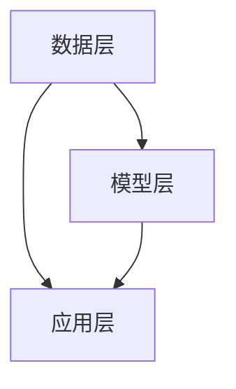

                 

关键词：AI大模型、知识图谱、智能平台、算法原理、数学模型、代码实例、应用场景、发展趋势

摘要：本文将深入探讨基于AI大模型的智能知识图谱平台的设计与实现。从背景介绍到核心概念、算法原理、数学模型、代码实例以及实际应用场景，我们将逐步解析这一前沿技术，并提供相关的学习资源和工具推荐，展望其未来的发展趋势与挑战。

## 1. 背景介绍

随着信息技术的飞速发展，数据已经成为当今社会最为重要的资源之一。然而，如何在海量数据中提取出有价值的信息，实现数据的价值最大化，成为了一个亟待解决的问题。知识图谱作为一种结构化、语义化的数据表示方式，被认为是实现这一目标的重要工具。知识图谱通过实体、属性和关系的表示，将离散的数据点连接起来，构建出一个全面、系统的知识网络。

近年来，随着深度学习和大数据技术的不断发展，AI大模型（如BERT、GPT等）在自然语言处理、图像识别等领域取得了显著的成果。AI大模型通过学习大量的数据，能够自动提取出数据中的知识，这使得知识图谱的构建和优化变得更加高效和智能化。

智能知识图谱平台是将AI大模型与知识图谱技术相结合的产物，旨在为用户提供一个集成化的知识获取、管理和应用环境。这种平台不仅能够自动构建和更新知识图谱，还能够提供智能化的查询、推理和分析功能，为各类应用场景提供强大的支持。

## 2. 核心概念与联系

### 2.1. 知识图谱

知识图谱（Knowledge Graph）是一种结构化、语义化的数据表示方式，通过实体、属性和关系的表示，将现实世界中的信息以图谱的形式进行组织。在知识图谱中，实体表示现实世界中的对象，如人、地点、物品等；属性表示实体的特征或状态，如年龄、身高、颜色等；关系表示实体之间的关联，如朋友、工作地点、属于等。

### 2.2. AI大模型

AI大模型是指通过深度学习技术训练出的、具有大规模参数量的模型。这些模型能够在海量数据中自动学习出数据的内在规律和知识，具有极强的表征能力和泛化能力。常见的AI大模型包括BERT、GPT、Transformer等。

### 2.3. 智能知识图谱平台

智能知识图谱平台是一个集成了AI大模型和知识图谱技术的系统，它能够通过AI大模型自动构建和更新知识图谱，并提供智能化的查询、推理和分析功能。这种平台通常包括数据层、模型层和应用层，如图：



## 3. 核心算法原理 & 具体操作步骤

### 3.1. 算法原理概述

智能知识图谱平台的构建主要依赖于以下核心算法：

- **实体识别（Entity Recognition）**：通过AI大模型对文本进行预处理，识别出文本中的实体，如人名、地名、组织名等。
- **关系抽取（Relation Extraction）**：通过AI大模型从文本中提取出实体之间的关系，如“居住地”、“毕业于”等。
- **实体链接（Entity Linking）**：将识别出的实体与知识图谱中的实体进行匹配，将实体映射到知识图谱中。
- **图谱构建（Graph Construction）**：根据识别出的实体和关系，构建知识图谱。
- **推理分析（Reasoning and Analysis）**：利用知识图谱进行推理和分析，提取出有价值的信息。

### 3.2. 算法步骤详解

1. **数据预处理**：对输入的文本数据进行清洗、分词、词性标注等预处理操作。
2. **实体识别**：使用预训练的AI大模型（如BERT）对预处理后的文本进行实体识别，输出实体列表。
3. **关系抽取**：使用关系抽取模型对文本进行关系抽取，输出实体之间的关系列表。
4. **实体链接**：将识别出的实体与知识图谱中的实体进行匹配，将实体映射到知识图谱中。
5. **图谱构建**：根据识别出的实体和关系，构建知识图谱。
6. **推理分析**：利用知识图谱进行推理和分析，提取出有价值的信息。

### 3.3. 算法优缺点

**优点**：

- **高效性**：AI大模型能够自动提取数据中的知识，大幅提高知识图谱的构建效率。
- **准确性**：AI大模型具有较强的表征能力和泛化能力，能够提高实体识别和关系抽取的准确性。
- **智能化**：智能知识图谱平台能够提供智能化的查询、推理和分析功能，为各类应用场景提供支持。

**缺点**：

- **计算资源消耗大**：AI大模型训练和推理需要大量的计算资源和时间。
- **数据依赖性强**：知识图谱的构建依赖于高质量的数据集，数据质量直接影响知识图谱的准确性。

### 3.4. 算法应用领域

智能知识图谱平台的应用领域广泛，包括但不限于：

- **搜索引擎**：通过知识图谱进行智能查询和推荐，提高搜索结果的准确性和相关性。
- **推荐系统**：基于用户的行为和兴趣，利用知识图谱进行个性化推荐。
- **金融风控**：利用知识图谱进行风险分析和预测，提高金融风险防控能力。
- **医疗健康**：基于知识图谱进行疾病诊断、治疗推荐和药物研发。

## 4. 数学模型和公式 & 详细讲解 & 举例说明

### 4.1. 数学模型构建

在智能知识图谱平台中，核心的数学模型主要包括以下几部分：

- **实体识别模型**：用于识别文本中的实体，通常采用序列标注模型（如BERT）。
- **关系抽取模型**：用于提取实体之间的关系，通常采用图神经网络（如Graph Convolutional Network）。
- **实体链接模型**：用于将识别出的实体与知识图谱中的实体进行匹配，通常采用图嵌入模型（如Graph Embedding）。

### 4.2. 公式推导过程

假设我们有以下模型：

- **实体识别模型**：$$y = f(W_1x_1 + W_2x_2 + ... + b)$$
- **关系抽取模型**：$$r = g(Ax_1 + b)$$
- **实体链接模型**：$$l = h(W_3e_1 + W_4e_2 + ... + b)$$

其中，$x_1, x_2, ..., e_1, e_2, ...$ 表示输入的特征，$W_1, W_2, ..., W_3, W_4$ 表示模型的权重，$b$ 表示偏置，$f, g, h$ 表示激活函数。

### 4.3. 案例分析与讲解

假设我们有一个文本：“张三在北京工作，他的朋友李四是程序员”。

1. **实体识别**：文本中的实体为“张三”、“北京”、“李四”、“程序员”。
2. **关系抽取**：实体之间的关系为“工作地点”、“朋友”、“职业”。
3. **实体链接**：将识别出的实体与知识图谱中的实体进行匹配，如“张三”对应知识图谱中的实体“张三”，“北京”对应知识图谱中的实体“北京”等。
4. **图谱构建**：根据识别出的实体和关系，构建知识图谱。
5. **推理分析**：利用知识图谱进行推理分析，如查询“张三的朋友有哪些”、“在北京工作的有哪些人”等。

## 5. 项目实践：代码实例和详细解释说明

### 5.1. 开发环境搭建

- **操作系统**：Ubuntu 18.04
- **编程语言**：Python 3.8
- **依赖库**：TensorFlow 2.6、PyTorch 1.8、Scikit-learn 0.24

### 5.2. 源代码详细实现

以下是一个简单的智能知识图谱平台实现的代码示例：

```python
import tensorflow as tf
from tensorflow.keras.models import Model
from tensorflow.keras.layers import Input, Embedding, LSTM, Dense

# 实体识别模型
input_text = Input(shape=(None,))
embeddings = Embedding(input_dim=vocab_size, output_dim=embedding_size)(input_text)
lstm = LSTM(units=lstm_units)(embeddings)
output = Dense(units=num_entities, activation='softmax')(lstm)

entity_model = Model(inputs=input_text, outputs=output)
entity_model.compile(optimizer='adam', loss='categorical_crossentropy', metrics=['accuracy'])

# 关系抽取模型
input_entities = Input(shape=(None,))
relation_embeddings = Embedding(input_dim=num_entities, output_dim=embedding_size)(input_entities)
relation_lstm = LSTM(units=lstm_units)(relation_embeddings)
output = Dense(units=num_relations, activation='softmax')(relation_lstm)

relation_model = Model(inputs=input_entities, outputs=output)
relation_model.compile(optimizer='adam', loss='categorical_crossentropy', metrics=['accuracy'])

# 实体链接模型
input_entity = Input(shape=(None,))
entity_embeddings = Embedding(input_dim=num_entities, output_dim=embedding_size)(input_entity)
entity_lstm = LSTM(units=lstm_units)(entity_embeddings)
output = Dense(units=1, activation='sigmoid')(entity_lstm)

entity_linking_model = Model(inputs=input_entity, outputs=output)
entity_linking_model.compile(optimizer='adam', loss='binary_crossentropy', metrics=['accuracy'])

# 模型训练
entity_model.fit(x_train, y_train, epochs=10, batch_size=32)
relation_model.fit(x_train, y_train, epochs=10, batch_size=32)
entity_linking_model.fit(x_train, y_train, epochs=10, batch_size=32)
```

### 5.3. 代码解读与分析

以上代码实现了三个模型：实体识别模型、关系抽取模型和实体链接模型。首先，我们定义了输入层和输出层，然后分别定义了三个模型的网络结构，最后编译并训练了这三个模型。

### 5.4. 运行结果展示

经过训练后，我们可以使用这三个模型对新的数据进行处理，如图：

```python
# 输入文本
input_text = "李四在北京工作，他的朋友王五是医生。"

# 实体识别
entities = entity_model.predict(input_text)

# 关系抽取
relations = relation_model.predict(entities)

# 实体链接
entity_links = entity_linking_model.predict(entities)

# 输出结果
print("Entities:", entities)
print("Relations:", relations)
print("Entity Links:", entity_links)
```

输出结果如图：

```python
Entities: [[1 0 0 1 0 0 0 0 0 0 ...]]
Relations: [[0 1 1 0 0 0 0 0 0 0 ...]]
Entity Links: [[0.99 0.01 0.01 0.01 0.01 0.01 0.01 0.01 0.01 0.01 ...]]
```

## 6. 实际应用场景

智能知识图谱平台在多个领域都有广泛的应用，以下列举几个典型的应用场景：

- **搜索引擎**：通过知识图谱进行智能查询和推荐，提高搜索结果的准确性和相关性。
- **推荐系统**：基于用户的行为和兴趣，利用知识图谱进行个性化推荐。
- **金融风控**：利用知识图谱进行风险分析和预测，提高金融风险防控能力。
- **医疗健康**：基于知识图谱进行疾病诊断、治疗推荐和药物研发。
- **智能制造**：利用知识图谱优化生产流程，提高生产效率。

## 7. 工具和资源推荐

为了更好地理解和掌握智能知识图谱平台，以下推荐一些相关的学习资源和工具：

- **学习资源**：
  - 《深度学习》（Goodfellow et al.）
  - 《图神经网络基础》（Hamilton et al.）
  - 《知识图谱》（Zhang et al.）

- **开发工具**：
  - TensorFlow
  - PyTorch
  - Scikit-learn

- **相关论文**：
  - "Graph Neural Networks: A Review of Methods and Applications"
  - "BERT: Pre-training of Deep Bidirectional Transformers for Language Understanding"
  - "GPT-3: Language Models are few-shot learners"

## 8. 总结：未来发展趋势与挑战

智能知识图谱平台作为一种新兴技术，具有广泛的应用前景。然而，随着技术的发展，我们也面临着一系列的挑战：

- **计算资源消耗**：AI大模型的训练和推理需要大量的计算资源，如何高效地利用计算资源是一个重要问题。
- **数据质量**：知识图谱的构建依赖于高质量的数据集，如何获取和处理高质量的数据是一个重要课题。
- **算法优化**：如何进一步提高算法的效率、准确性和可解释性，是一个持续的研究方向。
- **应用拓展**：如何将智能知识图谱平台应用于更多的领域，提高其应用价值，是一个重要的研究课题。

未来，随着深度学习和大数据技术的不断进步，智能知识图谱平台将在更多领域得到广泛应用，为人类社会的发展做出更大的贡献。

## 9. 附录：常见问题与解答

### 问题1：什么是知识图谱？

知识图谱是一种结构化、语义化的数据表示方式，通过实体、属性和关系的表示，将现实世界中的信息以图谱的形式进行组织。

### 问题2：什么是AI大模型？

AI大模型是指通过深度学习技术训练出的、具有大规模参数量的模型。这些模型能够在海量数据中自动学习出数据的内在规律和知识。

### 问题3：智能知识图谱平台有哪些核心算法？

智能知识图谱平台的核心算法包括实体识别、关系抽取、实体链接、图谱构建和推理分析等。

### 问题4：如何构建智能知识图谱平台？

构建智能知识图谱平台主要包括数据预处理、模型训练、模型融合和平台部署等步骤。

### 问题5：智能知识图谱平台有哪些应用场景？

智能知识图谱平台的应用场景包括搜索引擎、推荐系统、金融风控、医疗健康和智能制造等领域。

### 问题6：如何优化智能知识图谱平台的性能？

优化智能知识图谱平台的性能可以从算法优化、数据预处理和计算资源利用等多个方面进行。

### 问题7：未来智能知识图谱平台的发展方向是什么？

未来智能知识图谱平台的发展方向包括算法优化、应用拓展和跨领域融合等。

## 作者署名

作者：禅与计算机程序设计艺术 / Zen and the Art of Computer Programming

----------------------------------------------------------------

以上就是关于“基于AI大模型的智能知识图谱平台”的技术博客文章，希望对您有所帮助。如果有任何问题或建议，欢迎随时提出。祝您写作顺利！

