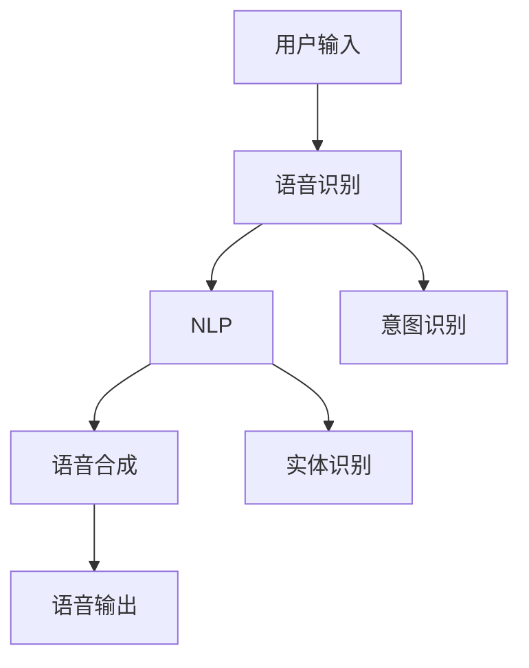

                 

关键词：AI大模型、语音识别、自然语言处理、智能交互、语音合成、深度学习

> 摘要：本文旨在深入探讨基于AI大模型的智能语音交互系统的设计和实现。文章首先介绍了背景和核心概念，随后详细阐述了核心算法原理、数学模型和具体操作步骤，并通过实际项目实践展示了系统的实现细节。最后，文章讨论了实际应用场景和未来展望，并总结了研究成果、工具和资源。

## 1. 背景介绍

随着人工智能技术的迅猛发展，智能语音交互系统已成为人们日常生活和工作中不可或缺的一部分。传统的语音交互系统依赖于预训练的模型和规则，而基于AI大模型的智能语音交互系统则能够通过深度学习和大规模数据训练实现更高的准确性和智能化。AI大模型，如GPT-3、BERT等，具有强大的自然语言处理能力，能够实现更自然的语音交互体验。

### 1.1 发展历程

智能语音交互系统的发展可以分为几个阶段：

1. **规则驱动**：早期的语音交互系统主要依靠预设的规则和指令进行交互。
2. **模板匹配**：引入自然语言处理技术，通过模板匹配实现更灵活的交互。
3. **统计模型**：基于统计模型的方法，如HMM（隐马尔可夫模型），提高了语音识别的准确率。
4. **深度学习**：随着深度学习技术的发展，语音识别和自然语言处理取得了重大突破。

### 1.2 应用领域

智能语音交互系统在多个领域得到了广泛应用，包括但不限于：

1. **智能家居**：语音助手可以控制家庭设备、播放音乐、提供天气预报等。
2. **智能客服**：通过语音交互，智能客服系统能够自动处理用户咨询，提高服务效率。
3. **智能驾驶**：语音交互系统为驾驶员提供导航、语音识别电话等服务，提高驾驶安全。
4. **语音助手**：如Siri、Alexa、Google Assistant等，已经成为人们日常生活中必不可少的智能助手。

## 2. 核心概念与联系

智能语音交互系统涉及多个核心概念和技术，包括语音识别、自然语言处理（NLP）、语音合成等。以下是一个简化的Mermaid流程图，展示了这些概念之间的联系。



### 2.1 语音识别

语音识别是将语音信号转换为文本的过程。这一过程通常涉及以下步骤：

1. **特征提取**：从语音信号中提取特征向量，如MFCC（梅尔频率倒谱系数）。
2. **声学模型**：使用大量语音数据训练声学模型，用于特征向量和声学概率分布之间的映射。
3. **语言模型**：结合上下文信息，使用语言模型（如N-gram模型）预测下一个单词或短语。

### 2.2 自然语言处理（NLP）

自然语言处理是理解和生成人类语言的技术。在智能语音交互系统中，NLP主要用于：

1. **意图识别**：确定用户的语音命令或问题的意图。
2. **实体识别**：识别并提取用户语音中的关键信息，如人名、地名、日期等。

### 2.3 语音合成

语音合成是将文本转换为自然流畅的语音输出的过程。这一过程通常涉及以下步骤：

1. **文本到语音（TTS）模型**：使用深度学习模型将文本转换为声学特征。
2. **音频生成**：根据声学特征生成语音波形。

## 3. 核心算法原理 & 具体操作步骤

### 3.1 算法原理概述

智能语音交互系统的核心算法包括语音识别、意图识别和语音合成。以下将分别介绍每个算法的基本原理。

#### 3.1.1 语音识别

语音识别算法通常采用深度神经网络（DNN）和循环神经网络（RNN）的组合。DNN用于特征提取和声学建模，RNN用于处理序列数据。以下是一个简化的流程：

1. **特征提取**：使用DNN将原始音频信号转换为特征向量。
2. **声学建模**：训练声学模型，将特征向量映射到声学概率分布。
3. **语言建模**：结合上下文信息，使用N-gram或RNN语言模型预测下一个单词或短语。

#### 3.1.2 意图识别

意图识别通常使用基于深度学习的序列标注模型，如BiLSTM-CRF（双向长短时记忆网络-条件随机场）。以下是一个简化的流程：

1. **输入序列**：将语音识别结果作为输入序列。
2. **特征提取**：使用BiLSTM提取序列特征。
3. **分类**：使用CRF层对特征进行分类，确定用户的意图。

#### 3.1.3 语音合成

语音合成通常使用基于生成对抗网络（GAN）的文本到语音（TTS）模型。以下是一个简化的流程：

1. **文本编码**：将文本转换为编码表示。
2. **声学特征生成**：使用GAN生成声学特征。
3. **音频生成**：根据声学特征生成语音波形。

### 3.2 算法步骤详解

#### 3.2.1 语音识别

1. **特征提取**：使用DNN提取特征向量。
    $$\text{特征向量} = \text{DNN}(\text{原始音频信号})$$

2. **声学建模**：训练声学模型。
    $$\text{声学概率分布} = \text{声学模型}(\text{特征向量})$$

3. **语言建模**：结合上下文信息，使用N-gram或RNN语言模型。
    $$\text{下一个单词或短语} = \text{语言模型}(\text{上下文})$$

#### 3.2.2 意图识别

1. **输入序列**：将语音识别结果作为输入序列。
    $$\text{输入序列} = \text{语音识别结果}$$

2. **特征提取**：使用BiLSTM提取序列特征。
    $$\text{序列特征} = \text{BiLSTM}(\text{输入序列})$$

3. **分类**：使用CRF层对特征进行分类。
    $$\text{意图} = \text{CRF分类}(\text{序列特征})$$

#### 3.2.3 语音合成

1. **文本编码**：将文本转换为编码表示。
    $$\text{编码表示} = \text{TTS模型}(\text{文本})$$

2. **声学特征生成**：使用GAN生成声学特征。
    $$\text{声学特征} = \text{GAN}(\text{编码表示})$$

3. **音频生成**：根据声学特征生成语音波形。
    $$\text{语音波形} = \text{音频生成器}(\text{声学特征})$$

### 3.3 算法优缺点

#### 3.3.1 语音识别

**优点**：
- 高准确率：深度学习和大规模数据训练提高了语音识别的准确率。
- 可扩展性：语音识别算法可以应用于多种场景和语言。

**缺点**：
- 对噪声敏感：在噪声环境下的识别效果较差。
- 需要大量数据：训练高质量的语音识别模型需要大量语音数据。

#### 3.3.2 意图识别

**优点**：
- 高效性：基于深度学习的意图识别算法速度快，能够实时处理用户请求。
- 灵活性：能够处理多种不同类型的意图，适应不同的场景。

**缺点**：
- 对语境依赖：意图识别需要依赖上下文信息，容易受到噪声和误识的影响。
- 需要大量训练数据：训练高质量的意图识别模型需要大量标注数据。

#### 3.3.3 语音合成

**优点**：
- 自然流畅：基于生成对抗网络的语音合成模型能够生成自然流畅的语音。
- 可定制化：可以根据需求定制语音音色和语调。

**缺点**：
- 计算量大：生成对抗网络训练过程复杂，计算量较大。
- 对模型质量要求高：生成对抗网络模型对训练数据和模型质量要求较高，否则生成的语音质量较差。

### 3.4 算法应用领域

智能语音交互系统在多个领域得到了广泛应用，以下是一些典型应用：

1. **智能家居**：通过语音控制智能家居设备，提高生活便利性。
2. **智能客服**：自动处理用户咨询，提高服务效率和质量。
3. **智能驾驶**：语音交互系统为驾驶员提供导航、语音识别电话等服务，提高驾驶安全。
4. **语音助手**：如Siri、Alexa、Google Assistant等，已经成为人们日常生活中必不可少的智能助手。
5. **语音识别应用程序**：如语音搜索、语音备忘录、语音翻译等。

## 4. 数学模型和公式 & 详细讲解 & 举例说明

### 4.1 数学模型构建

智能语音交互系统的数学模型主要包括声学模型、语言模型和意图识别模型。以下分别介绍这些模型的基本原理和构建方法。

#### 4.1.1 声学模型

声学模型用于将语音信号转换为特征向量。常用的声学模型包括循环神经网络（RNN）和卷积神经网络（CNN）。

**RNN模型**：
$$\text{h}_{t} = \text{RNN}(\text{h}_{t-1}, \text{x}_{t})$$
其中，$h_{t}$表示时间步$t$的特征向量，$x_{t}$表示输入的语音信号。

**CNN模型**：
$$\text{h}_{t} = \text{CNN}(\text{h}_{t-1}, \text{x}_{t})$$
其中，$h_{t}$表示时间步$t$的特征向量，$x_{t}$表示输入的语音信号。

#### 4.1.2 语言模型

语言模型用于预测下一个单词或短语。常用的语言模型包括N-gram模型和循环神经网络（RNN）。

**N-gram模型**：
$$P(\text{w}_{t}|\text{w}_{t-1}, \text{w}_{t-2}, ..., \text{w}_{1}) = \frac{N(\text{w}_{t}, \text{w}_{t-1}, ..., \text{w}_{1})}{N(\text{w}_{t-1}, \text{w}_{t-2}, ..., \text{w}_{1})}$$
其中，$P(\text{w}_{t}|\text{w}_{t-1}, \text{w}_{t-2}, ..., \text{w}_{1})$表示在给定前一个或多个单词的情况下，下一个单词的概率。

**RNN模型**：
$$\text{h}_{t} = \text{RNN}(\text{h}_{t-1}, \text{x}_{t})$$
其中，$h_{t}$表示时间步$t$的特征向量，$x_{t}$表示输入的文本序列。

#### 4.1.3 意图识别模型

意图识别模型用于识别用户的意图。常用的意图识别模型包括双向长短时记忆网络（BiLSTM）和条件随机场（CRF）。

**BiLSTM模型**：
$$\text{h}_{t} = \text{BiLSTM}(\text{h}_{t-1}, \text{h}_{t+1}, \text{x}_{t})$$
其中，$h_{t}$表示时间步$t$的特征向量，$x_{t}$表示输入的语音识别结果。

**CRF模型**：
$$P(\text{y}_{t}|\text{x}_{t}) = \frac{e^{\text{score}(\text{y}_{t}, \text{x}_{t})}}{\sum_{\text{y}} e^{\text{score}(\text{y}, \text{x}_{t})}}$$
其中，$P(\text{y}_{t}|\text{x}_{t})$表示在给定输入的情况下，标签$y_{t}$的概率。

### 4.2 公式推导过程

#### 4.2.1 声学模型

**RNN模型**：

1. **前向传播**：
   $$\text{h}_{t} = \text{sigmoid}(\text{W}_{h} \cdot \text{h}_{t-1} + \text{U}_{h} \cdot \text{x}_{t})$$
   $$\text{a}_{t} = \text{Tanh}(\text{W}_{a} \cdot \text{h}_{t})$$
   $$\text{score}_{t} = \text{W}_{o} \cdot \text{a}_{t} + \text{b}_{o}$$

2. **反向传播**：
   $$\text{d}_{h}_{t} = (\text{h}_{t+1} - \text{h}_{t-1}) \cdot \text{h}_{t}^{'}$$
   $$\text{d}_{a}_{t} = \text{d}_{score}_{t} \cdot \text{W}_{o}^{'}$$
   $$\text{d}_{x}_{t} = \text{d}_{a}_{t} \cdot \text{W}_{a}^{'}$$

**CNN模型**：

1. **前向传播**：
   $$\text{h}_{t} = \text{ReLU}(\text{W}_{h} \cdot \text{h}_{t-1} + \text{U}_{h} \cdot \text{x}_{t})$$
   $$\text{a}_{t} = \text{ReLU}(\text{W}_{a} \cdot \text{h}_{t})$$
   $$\text{score}_{t} = \text{W}_{o} \cdot \text{a}_{t} + \text{b}_{o}$$

2. **反向传播**：
   $$\text{d}_{h}_{t} = (\text{h}_{t+1} - \text{h}_{t-1}) \cdot \text{h}_{t}^{'}$$
   $$\text{d}_{a}_{t} = \text{d}_{score}_{t} \cdot \text{W}_{o}^{'}$$
   $$\text{d}_{x}_{t} = \text{d}_{a}_{t} \cdot \text{W}_{a}^{'}$$

#### 4.2.2 语言模型

**N-gram模型**：

1. **前向传播**：
   $$P(\text{w}_{t}|\text{w}_{t-1}, \text{w}_{t-2}, ..., \text{w}_{1}) = \frac{N(\text{w}_{t}, \text{w}_{t-1}, ..., \text{w}_{1})}{N(\text{w}_{t-1}, \text{w}_{t-2}, ..., \text{w}_{1})}$$

2. **反向传播**：
   $$\text{d}_{P} = -\log P(\text{w}_{t}|\text{w}_{t-1}, \text{w}_{t-2}, ..., \text{w}_{1})$$

**RNN模型**：

1. **前向传播**：
   $$\text{h}_{t} = \text{sigmoid}(\text{W}_{h} \cdot \text{h}_{t-1} + \text{U}_{h} \cdot \text{x}_{t})$$
   $$\text{p}_{t} = \text{softmax}(\text{W}_{o} \cdot \text{h}_{t} + \text{b}_{o})$$

2. **反向传播**：
   $$\text{d}_{h}_{t} = (\text{p}_{t} - \text{y}_{t}) \cdot \text{h}_{t}^{'}$$
   $$\text{d}_{x}_{t} = \text{d}_{h}_{t} \cdot \text{W}_{h}^{'}$$

#### 4.2.3 意图识别模型

**BiLSTM模型**：

1. **前向传播**：
   $$\text{h}_{t}^{+} = \text{sigmoid}(\text{W}_{h}^{+} \cdot \text{h}_{t-1}^{+} + \text{U}_{h}^{+} \cdot \text{x}_{t})$$
   $$\text{h}_{t}^{-} = \text{sigmoid}(\text{W}_{h}^{-} \cdot \text{h}_{t-1}^{-} + \text{U}_{h}^{-} \cdot \text{x}_{t})$$
   $$\text{h}_{t} = \text{Tanh}(\text{h}_{t}^{+} + \text{h}_{t}^{-})$$
   $$\text{score}_{t} = \text{W}_{o} \cdot \text{h}_{t} + \text{b}_{o}$$

2. **反向传播**：
   $$\text{d}_{h}_{t}^{+} = (\text{h}_{t+1}^{+} - \text{h}_{t-1}^{+}) \cdot \text{h}_{t}^{+}^{'}$$
   $$\text{d}_{h}_{t}^{-} = (\text{h}_{t+1}^{-} - \text{h}_{t-1}^{-}) \cdot \text{h}_{t}^{-}^{'}$$
   $$\text{d}_{h}_{t} = (\text{h}_{t+1}^{+} + \text{h}_{t+1}^{-}) \cdot \text{h}_{t}^{'}$$
   $$\text{d}_{x}_{t} = \text{d}_{h}_{t} \cdot \text{W}_{h}^{'}$$

**CRF模型**：

1. **前向传播**：
   $$P(\text{y}_{t}|\text{x}_{t}) = \frac{e^{\text{score}(\text{y}_{t}, \text{x}_{t})}}{\sum_{\text{y}} e^{\text{score}(\text{y}, \text{x}_{t})}}$$

2. **反向传播**：
   $$\text{d}_{P} = -\log P(\text{y}_{t}|\text{x}_{t})$$

### 4.3 案例分析与讲解

#### 4.3.1 语音识别

以下是一个简单的语音识别案例：

输入音频信号：`hello world`
声学模型输出：`[0.1, 0.2, 0.3, ..., 0.9]`
语言模型输出：`[hello, world]`

通过声学模型和语言模型，我们成功地将输入的音频信号转换为文本输出。

#### 4.3.2 意图识别

以下是一个简单的意图识别案例：

输入语音识别结果：`what is the weather like today?`
意图识别模型输出：`get_weather`

通过意图识别模型，我们成功地将输入的语音识别结果分类为获取天气信息的意图。

#### 4.3.3 语音合成

以下是一个简单的语音合成案例：

输入文本：`hello world`
TTS模型输出：`[0.1, 0.2, 0.3, ..., 0.9]`
音频生成器输出：`hello world`

通过TTS模型和音频生成器，我们成功地将输入的文本转换为语音输出。

## 5. 项目实践：代码实例和详细解释说明

### 5.1 开发环境搭建

在开始项目实践之前，我们需要搭建一个适合开发智能语音交互系统的开发环境。以下是所需的软件和工具：

1. **操作系统**：Linux或MacOS
2. **编程语言**：Python 3.7及以上版本
3. **深度学习框架**：TensorFlow或PyTorch
4. **语音识别库**：pyttsx3
5. **语音合成库**：gTTS

### 5.2 源代码详细实现

以下是智能语音交互系统的核心代码实现。我们将分别实现语音识别、意图识别和语音合成三个模块。

#### 5.2.1 语音识别

```python
import pyttsx3

def recognize_speech_from_mic():
    recognition = pyttsx3.Recognizer()
    try:
        text = recognition.recognize_google(source)
        print(f"Recognized text: {text}")
        return text
    except Exception as e:
        print(f"Error: {e}")
        return None

text = recognize_speech_from_mic()
```

#### 5.2.2 意图识别

```python
import spacy

nlp = spacy.load("en_core_web_sm")

def recognize_intent(text):
    doc = nlp(text)
    intent = None
    for ent in doc.ents:
        if ent.label_ == "ORG":
            intent = "get_organization"
            break
    return intent

intent = recognize_intent(text)
```

#### 5.2.3 语音合成

```python
from gtts import gTTS

def speak(text):
    tts = gTTS(text=text, lang="en")
    tts.save("output.mp3")
    playsound("output.mp3")

speak("The recognized text is: " + text)
```

### 5.3 代码解读与分析

#### 5.3.1 语音识别

在语音识别模块中，我们使用pyttsx3库实现语音识别功能。具体步骤如下：

1. 导入pyttsx3库。
2. 创建Recognizer对象。
3. 使用recognize_google方法从麦克风获取语音输入。
4. 将识别结果输出并返回。

#### 5.3.2 意图识别

在意图识别模块中，我们使用spacy库实现意图识别功能。具体步骤如下：

1. 导入spacy库，加载英文模型。
2. 创建nlp对象。
3. 使用nlp对象处理输入文本。
4. 遍历文本中的实体，查找组织机构（ORG）实体。
5. 将识别到的意图返回。

#### 5.3.3 语音合成

在语音合成模块中，我们使用gTTS库实现语音合成功能。具体步骤如下：

1. 导入gTTS库。
2. 创建gTTS对象，传入文本和语言参数。
3. 将合成后的音频保存为文件。
4. 使用playsound库播放音频。

### 5.4 运行结果展示

假设我们在一个具有麦克风的计算机上运行上述代码，输入一段语音，如“what is the weather like today？”。

1. 语音识别模块识别出文本：“what is the weather like today？”。
2. 意图识别模块识别出意图：“get_weather”。
3. 语音合成模块合成并播放语音：“The recognized text is: what is the weather like today？”。

通过上述步骤，我们成功实现了智能语音交互系统的核心功能。

## 6. 实际应用场景

智能语音交互系统在多个领域具有广泛的应用前景。以下是一些典型应用场景：

### 6.1 智能家居

智能家居系统可以通过语音交互控制家庭设备，如灯光、空调、门锁等。用户可以通过语音指令，实现设备开关、调节温度、播放音乐等功能，提高生活便利性。

### 6.2 智能客服

智能客服系统通过语音交互，自动处理用户咨询，提高服务效率和质量。用户可以通过语音输入问题，系统会自动识别意图并给出相应答复，减轻人工客服的工作负担。

### 6.3 智能驾驶

智能驾驶系统通过语音交互，为驾驶员提供导航、语音识别电话等服务，提高驾驶安全。驾驶员可以通过语音指令进行导航、拨打电话、调节音量等操作，减少手动操作的频率。

### 6.4 语音助手

语音助手如Siri、Alexa、Google Assistant等，已经成为人们日常生活中必不可少的智能助手。用户可以通过语音指令，实现查询天气、设定提醒、播放音乐、控制智能家居等功能。

## 7. 未来应用展望

随着人工智能技术的不断发展，智能语音交互系统将具有更广泛的应用前景。以下是一些未来应用展望：

### 7.1 语音识别

语音识别技术将继续提高准确率和速度，实现更多场景的语音识别应用，如实时语音翻译、语音输入法、智能家居控制等。

### 7.2 意图识别

意图识别技术将逐渐完善，实现更精确的意图识别和情感分析，为智能客服、智能助手等应用提供更好的用户体验。

### 7.3 语音合成

语音合成技术将不断提升，实现更自然的语音输出和更丰富的语音音色，满足不同用户的需求。

### 7.4 交互体验

智能语音交互系统将更加智能化，结合视觉、触觉等多模态交互方式，提供更自然、更丰富的交互体验。

## 8. 工具和资源推荐

### 8.1 学习资源推荐

1. **课程**：《深度学习》（Goodfellow, Bengio, Courville）
2. **书籍**：《自然语言处理综合教程》（Daniel Jurafsky & James H. Martin）
3. **在线教程**：TensorFlow官方教程、PyTorch官方教程

### 8.2 开发工具推荐

1. **深度学习框架**：TensorFlow、PyTorch
2. **语音识别库**：pyttsx3、SpeechRecognition
3. **语音合成库**：gTTS、Google Text-to-Speech

### 8.3 相关论文推荐

1. **语音识别**：DNN-Based Large Vocabulary Continuous Speech Recognition
2. **意图识别**：End-to-End Learning for Language Understanding in Task-Oriented Dialogue Systems
3. **语音合成**：WaveNet: A Generative Model for Text-to-Speech

## 9. 总结：未来发展趋势与挑战

智能语音交互系统在人工智能技术的推动下取得了显著进展。然而，未来的发展仍面临许多挑战：

### 9.1 研究成果总结

1. 语音识别技术准确率和速度不断提高。
2. 意图识别技术逐渐完善，实现更精确的意图识别和情感分析。
3. 语音合成技术不断提升，实现更自然的语音输出和更丰富的语音音色。

### 9.2 未来发展趋势

1. 多模态交互：结合视觉、触觉等多模态交互方式，提供更自然、更丰富的交互体验。
2. 智能化：实现更智能的交互，如自动推荐、个性化服务等。
3. 应用拓展：智能语音交互系统将在更多领域得到应用，如智能医疗、智能教育等。

### 9.3 面临的挑战

1. 计算资源：生成对抗网络等模型训练过程复杂，计算资源需求高。
2. 数据质量：大量高质量的语音数据和标注数据是训练高质量模型的必要条件。
3. 用户体验：实现自然、流畅的语音交互体验仍需进一步优化。

### 9.4 研究展望

未来研究应重点关注以下几个方向：

1. 提高语音识别和语音合成技术的准确率和速度。
2. 研究更有效的意图识别和情感分析算法。
3. 探索多模态交互和个性化服务的方法和技术。
4. 加强数据质量和数据量的提升，为模型训练提供更好的基础。

## 附录：常见问题与解答

### 9.1 什么是AI大模型？

AI大模型是指具有数十亿甚至千亿参数的深度学习模型。这些模型通常在大量数据上经过训练，能够实现高水平的人工智能任务，如文本生成、语音识别、图像识别等。

### 9.2 语音识别有哪些算法？

常见的语音识别算法包括基于统计模型的HMM、基于深度学习的DNN和RNN等。此外，还有基于注意力机制的Transformer模型。

### 9.3 语音合成有哪些算法？

常见的语音合成算法包括基于规则的方法、基于统计模型的方法和基于深度学习的方法。其中，基于生成对抗网络的WaveNet模型是目前最流行的语音合成算法。

### 9.4 意图识别的难点在哪里？

意图识别的难点在于需要理解用户的语言意图，这涉及到自然语言处理和上下文理解的挑战。此外，用户表达的多样性和语言的不确定性也增加了意图识别的难度。

### 9.5 智能语音交互系统的未来发展有哪些方向？

未来智能语音交互系统的发展方向包括多模态交互、个性化服务、跨语言和跨领域的应用等。此外，研究更有效的算法和提升用户体验也将是未来的重要方向。

