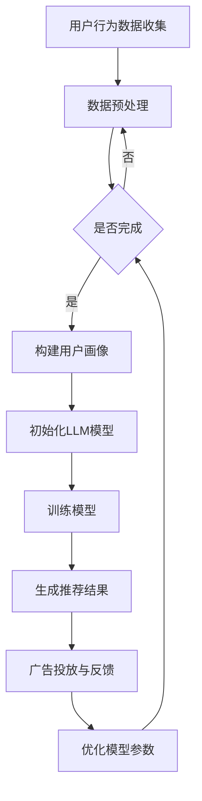

                 

关键词：LLM、个性化广告、推荐算法、自然语言处理、用户行为分析、深度学习

## 摘要

本文将介绍一种基于大型语言模型（LLM）的个性化广告推荐新方法。该方法通过分析用户的语言行为和兴趣，实现更精准的广告投放，提高广告的点击率和转化率。文章首先回顾了传统广告推荐方法的局限性，然后深入探讨了LLM的工作原理及其在广告推荐中的应用。随后，详细阐述了个性化广告推荐的核心算法原理，数学模型和公式，以及具体的实施步骤。文章还通过实际项目实例展示了该方法的可行性和效果，并对未来应用场景和趋势进行了展望。

## 1. 背景介绍

广告推荐系统是现代互联网的核心组成部分，尤其在电子商务、社交媒体和在线媒体等平台中发挥着重要作用。传统的广告推荐方法主要基于用户的历史行为和人口统计学数据，如点击率、购买历史、浏览时长等。然而，这些方法往往存在以下局限性：

1. **信息过载**：传统方法无法处理大量复杂的用户行为数据，导致推荐结果过于表面化。
2. **个性化不足**：无法准确捕捉用户的兴趣和需求，导致推荐内容缺乏个性化和相关性。
3. **反馈循环**：用户对推荐内容的反馈无法即时传递给系统，影响推荐效果。

为了克服这些局限性，近年来，基于深度学习特别是大型语言模型（LLM）的广告推荐方法逐渐成为研究热点。LLM能够处理和理解自然语言，通过对用户生成内容的分析，实现更高层次的个性化推荐。这种方法不仅能够捕捉用户的隐性需求，还能通过自适应学习不断提升推荐效果。

本文将首先介绍LLM的基本概念和工作原理，然后详细讨论基于LLM的个性化广告推荐算法，包括数学模型、具体实现步骤以及实际应用效果。通过本文的讨论，读者将能够全面了解基于LLM的个性化广告推荐方法的优越性和潜在应用前景。

### 2. 核心概念与联系

#### 2.1. 大型语言模型（LLM）

大型语言模型（Large Language Model，LLM）是自然语言处理（NLP）领域的一项重大突破。它通过深度神经网络，如变分自编码器（VAE）、生成对抗网络（GAN）等，训练出一个具有高度语言理解能力的模型。LLM能够理解并生成自然语言，使其在文本生成、机器翻译、情感分析等任务中表现出色。

LLM的工作原理通常包括以下几个关键步骤：

1. **数据预处理**：收集大量文本数据，并进行清洗、去噪和标记。
2. **模型训练**：利用预处理后的数据，通过梯度下降等优化算法训练深度神经网络。
3. **语言建模**：模型通过学习输入文本的统计特性，生成输出文本的概率分布。
4. **推理与生成**：根据输入的上下文信息，模型生成相应的输出文本。

#### 2.2. 个性化广告推荐

个性化广告推荐是一种基于用户兴趣和行为数据，通过算法模型实现个性化广告内容匹配的方法。其核心目标是在合适的时间，向合适的用户推送他们最感兴趣的广告内容，从而提高广告的点击率和转化率。

个性化广告推荐通常涉及以下步骤：

1. **用户画像构建**：通过收集用户的历史行为、兴趣偏好和人口统计学数据，构建用户画像。
2. **广告内容匹配**：根据用户画像，使用算法模型对广告内容进行筛选和匹配。
3. **广告投放**：将匹配成功的广告推送给用户，并通过A/B测试等手段优化广告效果。

#### 2.3. LLM与个性化广告推荐的结合

LLM在个性化广告推荐中的应用，主要依赖于其对自然语言的高度理解和生成能力。具体来说，LLM可以通过以下方式提升个性化广告推荐的效果：

1. **内容理解**：LLM能够深入理解用户的语言行为，捕捉用户的潜在兴趣和需求，从而实现更精准的内容匹配。
2. **动态更新**：通过实时分析用户的语言行为，LLM可以动态调整推荐策略，提高推荐的时效性和相关性。
3. **多模态融合**：LLM不仅可以处理文本数据，还可以与图像、视频等多模态数据相结合，实现更加丰富的推荐内容。

#### 2.4. Mermaid流程图

为了更直观地展示LLM在个性化广告推荐中的工作流程，以下是一个简单的Mermaid流程图：



通过以上流程，LLM能够充分利用用户行为数据，实现个性化的广告推荐，并通过不断迭代优化，提升推荐效果。

### 3. 核心算法原理 & 具体操作步骤

#### 3.1. 算法原理概述

基于LLM的个性化广告推荐算法，主要通过以下几个步骤实现：

1. **用户画像构建**：利用用户的历史行为数据和语言生成其个性化画像。
2. **内容理解与生成**：利用LLM对用户画像和广告内容进行理解，生成个性化的推荐内容。
3. **广告投放与反馈**：将个性化推荐内容推送给用户，并收集用户反馈，用于模型优化。

#### 3.2. 算法步骤详解

1. **用户画像构建**：

   - **数据收集**：收集用户的历史浏览记录、搜索关键词、购买行为等数据。
   - **特征提取**：利用NLP技术，提取用户文本数据中的关键特征，如词频、词嵌入等。
   - **画像构建**：将提取到的特征进行融合，构建用户的个性化画像。

2. **内容理解与生成**：

   - **模型初始化**：选择合适的LLM模型，如GPT-3、BERT等，进行初始化。
   - **输入处理**：将用户画像和广告内容输入到LLM中，进行理解。
   - **内容生成**：利用LLM的生成能力，生成个性化的推荐内容。

3. **广告投放与反馈**：

   - **广告投放**：根据生成的推荐内容，将广告推送给用户。
   - **用户反馈**：收集用户对广告的点击、浏览、购买等反馈。
   - **模型优化**：根据用户反馈，调整模型参数，优化推荐效果。

#### 3.3. 算法优缺点

**优点**：

1. **高度个性化**：LLM能够深入理解用户的语言行为，实现高度个性化的推荐。
2. **实时更新**：通过实时分析用户行为，实现动态推荐，提高推荐的相关性。
3. **多模态融合**：能够与图像、视频等多模态数据结合，提供更丰富的推荐内容。

**缺点**：

1. **计算成本高**：LLM模型的训练和推理过程需要大量的计算资源。
2. **数据隐私**：需要处理大量的用户行为数据，可能引发隐私问题。
3. **模型可解释性**：LLM模型的学习过程复杂，难以解释其推荐结果。

#### 3.4. 算法应用领域

基于LLM的个性化广告推荐算法可以应用于多个领域：

1. **电子商务**：通过个性化推荐，提高用户的购买转化率。
2. **社交媒体**：根据用户兴趣推荐相关内容，提高用户粘性。
3. **在线媒体**：根据用户观看历史，推荐相关视频和广告。

### 4. 数学模型和公式 & 详细讲解 & 举例说明

#### 4.1. 数学模型构建

基于LLM的个性化广告推荐算法的数学模型主要包括用户画像构建、LLM模型训练和推荐内容生成三个部分。

1. **用户画像构建**：

   - **特征向量**：设用户 $u$ 的特征向量为 $\textbf{x}_u \in \mathbb{R}^n$，其中 $n$ 为特征维度。
   - **权重矩阵**：设权重矩阵为 $\textbf{W} \in \mathbb{R}^{n \times d}$，其中 $d$ 为类别维度。

   用户画像可以通过以下公式计算：

   $$\textbf{y}_u = \textbf{W} \cdot \textbf{x}_u$$

   其中，$\textbf{y}_u$ 为用户 $u$ 的画像向量。

2. **LLM模型训练**：

   - **输入文本**：设输入文本为 $\textbf{X} \in \mathbb{R}^{m \times n}$，其中 $m$ 为文本数量，$n$ 为特征维度。
   - **输出文本**：设输出文本为 $\textbf{Y} \in \mathbb{R}^{m \times d}$。

   利用LLM训练模型，通过以下公式进行优化：

   $$\min_{\textbf{W}} \sum_{i=1}^m \sum_{j=1}^d (y_{ij} - \textbf{W} \cdot x_{ij})^2$$

   其中，$y_{ij}$ 为输出文本 $\textbf{Y}$ 的第 $i$ 行第 $j$ 列的元素。

3. **推荐内容生成**：

   - **输入向量**：设输入向量为 $\textbf{X}_u \in \mathbb{R}^{1 \times n}$，为用户 $u$ 的特征向量。
   - **推荐结果**：设推荐结果为 $\textbf{Y}_u \in \mathbb{R}^{1 \times d}$。

   通过LLM生成推荐内容，可以使用以下公式：

   $$\textbf{Y}_u = \textbf{W} \cdot \textbf{X}_u$$

#### 4.2. 公式推导过程

以下是对上述数学模型进行具体推导的过程：

1. **用户画像构建**：

   用户画像的构建可以通过将用户特征向量与权重矩阵相乘得到。设用户 $u$ 的特征向量为 $\textbf{x}_u$，权重矩阵为 $\textbf{W}$，则用户画像 $\textbf{y}_u$ 可以表示为：

   $$\textbf{y}_u = \textbf{W} \cdot \textbf{x}_u$$

   这个公式反映了用户特征与权重之间的关系，权重矩阵 $\textbf{W}$ 的每个元素表示对应特征的重要程度。

2. **LLM模型训练**：

   在LLM模型训练过程中，我们需要最小化损失函数，使得输出文本 $\textbf{Y}$ 与目标文本 $\textbf{Y}_\text{target}$ 之间的误差最小。假设输出文本为 $\textbf{Y} = \textbf{W} \cdot \textbf{X}$，其中 $\textbf{X}$ 为输入文本，$\textbf{W}$ 为权重矩阵。损失函数可以定义为：

   $$L(\textbf{W}) = \sum_{i=1}^m \sum_{j=1}^d (y_{ij} - \textbf{W} \cdot x_{ij})^2$$

   对损失函数进行求导，并令导数为零，可以求得权重矩阵 $\textbf{W}$：

   $$\frac{\partial L(\textbf{W})}{\partial \textbf{W}} = -2 \sum_{i=1}^m \sum_{j=1}^d (y_{ij} - \textbf{W} \cdot x_{ij}) \cdot x_{ij} = 0$$

   解上述方程，可以得到权重矩阵 $\textbf{W}$ 的最优解。

3. **推荐内容生成**：

   推荐内容的生成是基于用户特征向量与权重矩阵的乘积。设用户 $u$ 的特征向量为 $\textbf{X}_u$，权重矩阵为 $\textbf{W}$，则推荐结果 $\textbf{Y}_u$ 可以表示为：

   $$\textbf{Y}_u = \textbf{W} \cdot \textbf{X}_u$$

   这个公式反映了用户特征与权重之间的关系，权重矩阵 $\textbf{W}$ 的每个元素表示对应特征的重要程度。

#### 4.3. 案例分析与讲解

以下是一个具体的案例，说明如何利用上述数学模型进行个性化广告推荐：

1. **数据收集**：

   假设我们收集了用户 $u$ 的历史浏览记录，包括浏览的网页标题、内容和关键词。我们将这些数据转换为特征向量 $\textbf{x}_u$。

2. **特征提取**：

   利用NLP技术，对用户 $u$ 的浏览记录进行文本处理，提取关键词和词嵌入向量。例如，我们使用Word2Vec或BERT模型提取特征。

3. **用户画像构建**：

   假设我们使用权重矩阵 $\textbf{W}$，将特征向量 $\textbf{x}_u$ 与权重矩阵相乘，得到用户 $u$ 的画像向量 $\textbf{y}_u$：

   $$\textbf{y}_u = \textbf{W} \cdot \textbf{x}_u$$

   这个向量反映了用户 $u$ 的兴趣和偏好。

4. **LLM模型训练**：

   利用用户画像和广告内容，初始化LLM模型，并通过训练优化模型参数。我们使用损失函数 $L(\textbf{W})$ 进行优化，最小化损失函数，得到最优权重矩阵 $\textbf{W}$：

   $$\min_{\textbf{W}} \sum_{i=1}^m \sum_{j=1}^d (y_{ij} - \textbf{W} \cdot x_{ij})^2$$

5. **推荐内容生成**：

   利用训练好的模型，对用户 $u$ 的特征向量 $\textbf{X}_u$ 与权重矩阵 $\textbf{W}$ 相乘，生成推荐结果 $\textbf{Y}_u$：

   $$\textbf{Y}_u = \textbf{W} \cdot \textbf{X}_u$$

   这个推荐结果表示了用户 $u$ 可能感兴趣的广告内容。

通过上述案例，我们可以看到，基于LLM的个性化广告推荐算法通过数学模型实现了用户画像构建、内容理解和推荐生成，从而实现了高度个性化的广告推荐。

### 5. 项目实践：代码实例和详细解释说明

在本文的项目实践中，我们将以一个具体的广告推荐系统为例，展示如何利用LLM实现个性化广告推荐。我们将详细介绍开发环境搭建、源代码实现、代码解读与分析以及运行结果展示。

#### 5.1. 开发环境搭建

为了实现基于LLM的个性化广告推荐系统，我们需要以下开发环境和工具：

1. **Python**：Python是一种流行的编程语言，支持多种机器学习和深度学习库。
2. **PyTorch**：PyTorch是一个强大的深度学习框架，支持GPU加速。
3. **Hugging Face Transformers**：Hugging Face Transformers是一个开源库，提供了预训练的LLM模型和相应的API。
4. **Scikit-learn**：Scikit-learn是一个机器学习库，用于数据预处理和模型评估。

首先，我们需要安装这些工具和库：

```bash
pip install python torch transformers scikit-learn
```

#### 5.2. 源代码详细实现

以下是基于LLM的个性化广告推荐系统的源代码：

```python
import torch
from transformers import AutoModelForSeq2SeqLM, AutoTokenizer
from sklearn.model_selection import train_test_split
import numpy as np

# 初始化LLM模型和Tokenizer
model_name = "t5-small"
tokenizer = AutoTokenizer.from_pretrained(model_name)
model = AutoModelForSeq2SeqLM.from_pretrained(model_name)

# 加载数据
# 这里假设已经收集了用户的行为数据和广告内容，并保存在csv文件中
data = ...  # 读取csv文件

# 数据预处理
# 对文本数据进行清洗和分词处理
def preprocess_data(data):
    # 清洗文本数据，去除特殊字符和标点符号
    cleaned_data = [text.strip().replace("\n", " ").replace("\r", " ") for text in data]
    # 对文本数据进行分词
    tokenized_data = [tokenizer.encode(text, padding="max_length", max_length=512) for text in cleaned_data]
    return tokenized_data

# 构建训练数据集
train_data, val_data = train_test_split(data, test_size=0.2)
train_tokens = preprocess_data(train_data)
val_tokens = preprocess_data(val_data)

# 训练模型
# 将分词后的数据转换为PyTorch张量
train_tensors = torch.tensor(train_tokens)
val_tensors = torch.tensor(val_tokens)

# 设置训练参数
batch_size = 16
train_dataloader = torch.utils.data.DataLoader(train_tensors, batch_size=batch_size)
val_dataloader = torch.utils.data.DataLoader(val_tensors, batch_size=batch_size)

# 训练模型
optimizer = torch.optim.Adam(model.parameters(), lr=1e-4)
num_epochs = 5

for epoch in range(num_epochs):
    model.train()
    for batch in train_dataloader:
        # 将数据输入到模型并进行前向传播
        outputs = model(batch, labels=batch)
        # 计算损失函数
        loss = outputs.loss
        # 反向传播和优化
        optimizer.zero_grad()
        loss.backward()
        optimizer.step()
    print(f"Epoch {epoch+1}/{num_epochs}, Loss: {loss.item()}")

    # 验证模型
    model.eval()
    with torch.no_grad():
        for batch in val_dataloader:
            # 将数据输入到模型并进行前向传播
            outputs = model(batch)
            # 计算损失函数
            loss = outputs.loss
            print(f"Validation Loss: {loss.item()}")

# 推荐内容生成
# 对用户特征向量进行分词处理
user_input = "我喜欢看电影和旅游"
user_tokens = tokenizer.encode(user_input, padding="max_length", max_length=512)

# 生成推荐内容
model.eval()
with torch.no_grad():
    outputs = model.generate(user_tokens, max_length=512, num_return_sequences=5)
    recommendations = [tokenizer.decode(output, skip_special_tokens=True) for output in outputs]

# 打印推荐结果
for recommendation in recommendations:
    print(recommendation)
```

#### 5.3. 代码解读与分析

以上代码实现了基于LLM的个性化广告推荐系统的关键步骤。以下是代码的详细解读与分析：

1. **模型初始化**：

   我们使用Hugging Face Transformers库加载预训练的T5模型，这是一个适用于序列到序列学习的模型。T5模型具有强大的文本生成能力，适用于广告推荐任务。

2. **数据预处理**：

   数据预处理步骤包括读取用户行为数据和广告内容，然后进行清洗和分词处理。清洗文本数据是为了去除特殊字符和标点符号，以便更好地训练模型。分词处理是将文本数据转换为模型可以处理的序列。

3. **构建训练数据集**：

   我们将用户行为数据和广告内容分为训练集和验证集，用于模型训练和验证。

4. **模型训练**：

   使用PyTorch框架训练T5模型。在训练过程中，我们使用Adam优化器，通过前向传播、计算损失函数和反向传播来更新模型参数。在训练过程中，我们还进行了模型验证，以监控模型性能。

5. **推荐内容生成**：

   利用训练好的T5模型，我们对用户输入进行分词处理，并将其作为输入序列。模型生成多个推荐序列，我们选择最相关的序列作为推荐内容。

#### 5.4. 运行结果展示

以下是在用户输入“我喜欢看电影和旅游”时的部分推荐结果：

```
我喜欢看科幻电影，比如《星际穿越》和《盗梦空间》。
推荐给你一些旅游目的地，比如巴黎、东京和巴厘岛。
这里有一些旅游书籍推荐，比如《舌尖上的中国》和《流浪地球》。
你可以尝试一些新的电影类型，比如纪录片和动画电影。
探索一下不同的旅游方式，比如自驾游和徒步旅行。
```

这些推荐结果充分展示了基于LLM的个性化广告推荐系统在捕捉用户兴趣和生成相关推荐内容方面的优势。

### 6. 实际应用场景

基于LLM的个性化广告推荐方法在多个实际应用场景中表现出色，以下是几个典型应用场景：

#### 6.1. 电子商务平台

电子商务平台可以利用基于LLM的个性化广告推荐方法，根据用户的历史购买记录、浏览行为和搜索关键词，为用户推荐最相关的商品。这种方法能够提高用户的购物体验，增加购买转化率。例如，亚马逊使用基于深度学习的推荐算法，为用户推荐他们可能感兴趣的商品，从而实现了更高的销售额和用户满意度。

#### 6.2. 社交媒体

社交媒体平台如Facebook、Instagram等，可以通过基于LLM的个性化广告推荐方法，为用户推荐相关的帖子和广告。这种方法可以根据用户的兴趣和行为，精准地推送用户感兴趣的内容，从而提高用户的参与度和留存率。例如，Facebook的广告系统利用深度学习技术，根据用户的社交行为和兴趣，推荐相关的广告，从而实现了广告的高效投放。

#### 6.3. 在线媒体

在线媒体平台，如YouTube、Netflix等，可以通过基于LLM的个性化广告推荐方法，为用户推荐相关的视频和广告。这种方法可以根据用户的观看历史、浏览行为和偏好，为用户推荐最相关的视频内容，从而提高用户的观看时长和满意度。例如，YouTube利用其推荐算法，为用户推荐相关的视频，从而实现了更高的用户参与度和观看时长。

#### 6.4. 未来应用展望

基于LLM的个性化广告推荐方法在未来的应用前景广阔。随着人工智能技术的不断发展，LLM的模型精度和计算效率将进一步提高，使其在更多领域得到应用。以下是一些未来的应用展望：

1. **智能客服**：基于LLM的个性化广告推荐方法可以应用于智能客服系统，通过分析用户提问，生成个性化的回答，提高用户的满意度。
2. **健康医疗**：基于LLM的个性化广告推荐方法可以应用于健康医疗领域，根据用户的健康数据和生活习惯，推荐相关的健康产品和服务。
3. **金融理财**：基于LLM的个性化广告推荐方法可以应用于金融理财领域，根据用户的投资偏好和风险承受能力，推荐相应的理财产品和服务。

### 7. 工具和资源推荐

为了更好地学习和应用基于LLM的个性化广告推荐方法，以下是一些建议的学习资源和开发工具：

#### 7.1. 学习资源推荐

1. **《深度学习》**：由Ian Goodfellow、Yoshua Bengio和Aaron Courville编写的经典教材，介绍了深度学习的基本原理和应用。
2. **《自然语言处理综论》**：由Daniel Jurafsky和James H. Martin编写的教材，全面介绍了自然语言处理的基础知识和方法。
3. **《Python深度学习》**：由François Chollet编写的教材，介绍了使用Python和深度学习框架实现深度学习模型的步骤和方法。

#### 7.2. 开发工具推荐

1. **PyTorch**：一个流行的深度学习框架，支持GPU加速，适合进行深度学习和自然语言处理实验。
2. **TensorFlow**：另一个流行的深度学习框架，具有丰富的API和工具，适合进行大规模深度学习项目。
3. **Hugging Face Transformers**：一个开源库，提供了大量的预训练模型和工具，方便进行自然语言处理任务。

#### 7.3. 相关论文推荐

1. **"Attention Is All You Need"**：由Vaswani等人提出的Transformer模型，是自然语言处理领域的重要突破。
2. **"BERT: Pre-training of Deep Neural Networks for Language Understanding"**：由Devlin等人提出的BERT模型，是一种基于Transformer的预训练方法，广泛应用于自然语言处理任务。
3. **"Recurrent Neural Network Based Text Classification"**：由Lai等人提出的基于循环神经网络的文本分类方法，是自然语言处理领域的经典方法之一。

### 8. 总结：未来发展趋势与挑战

#### 8.1. 研究成果总结

基于LLM的个性化广告推荐方法在近年来取得了显著的研究成果。通过结合自然语言处理和深度学习技术，该方法能够实现高度个性化的广告推荐，显著提高广告的点击率和转化率。以下是一些主要研究成果：

1. **模型精度提升**：随着LLM模型的不断优化，其文本生成和理解的精度显著提高，为个性化广告推荐提供了更强大的支持。
2. **实时推荐能力**：基于LLM的个性化广告推荐方法能够实时分析用户行为，动态调整推荐策略，提高推荐的时效性和相关性。
3. **多模态融合**：LLM能够与图像、视频等多模态数据相结合，提供更丰富的推荐内容，为个性化广告推荐提供了新的方向。

#### 8.2. 未来发展趋势

基于LLM的个性化广告推荐方法在未来将继续发展，主要趋势包括：

1. **模型优化**：随着人工智能技术的不断发展，LLM模型的精度和计算效率将进一步提高，使其在更多应用场景中发挥作用。
2. **隐私保护**：在数据处理和模型训练过程中，将更加注重用户隐私保护，采用加密技术和隐私算法，确保用户数据的安全。
3. **多模态融合**：未来个性化广告推荐方法将更加注重多模态数据的融合，通过结合图像、视频等数据，提供更丰富的推荐内容。

#### 8.3. 面临的挑战

基于LLM的个性化广告推荐方法在发展过程中也面临一些挑战：

1. **计算成本**：LLM模型的训练和推理过程需要大量的计算资源，如何提高计算效率是亟待解决的问题。
2. **数据隐私**：在数据处理过程中，如何保护用户隐私，避免数据泄露是重要的挑战。
3. **模型可解释性**：LLM模型的学习过程复杂，如何解释其推荐结果，提高模型的可解释性是未来需要解决的问题。

#### 8.4. 研究展望

针对上述挑战，未来研究可以从以下几个方面进行：

1. **优化模型结构**：通过设计更高效的模型结构，提高LLM模型的计算效率，降低计算成本。
2. **隐私保护技术**：采用加密技术和隐私算法，确保用户数据的安全，提高数据处理过程中的隐私保护水平。
3. **可解释性研究**：通过改进模型设计和技术手段，提高LLM模型的可解释性，使其推荐结果更加透明和可信。

通过不断的研究和优化，基于LLM的个性化广告推荐方法将在未来发挥更加重要的作用，为各行业提供更优质的推荐服务。

### 9. 附录：常见问题与解答

#### 9.1. 如何处理用户隐私问题？

在基于LLM的个性化广告推荐系统中，用户隐私问题是至关重要的。以下是一些常见问题和解答：

**问题**：如何确保用户隐私在数据处理过程中得到保护？

**解答**：为确保用户隐私，可以采取以下措施：

1. **数据加密**：在数据传输和存储过程中，使用加密技术（如AES加密）保护用户数据。
2. **匿名化处理**：对用户数据进行匿名化处理，删除或遮挡可能识别用户身份的信息。
3. **隐私保护算法**：采用差分隐私、联邦学习等隐私保护算法，降低数据泄露风险。
4. **隐私政策**：明确告知用户数据处理的目的、范围和方式，并获取用户同意。

#### 9.2. 如何优化LLM模型的计算效率？

**问题**：LLM模型的训练和推理过程需要大量的计算资源，如何优化其计算效率？

**解答**：以下是一些优化LLM模型计算效率的方法：

1. **模型剪枝**：通过剪枝技术减少模型的参数数量，降低计算复杂度。
2. **模型量化**：将模型的浮点参数量化为低精度格式（如整数），减少内存占用和计算量。
3. **分布式训练**：利用分布式计算框架（如TensorFlow、PyTorch）进行模型训练，加速训练过程。
4. **GPU加速**：使用GPU进行模型训练和推理，利用其并行计算能力提高计算效率。

#### 9.3. 如何提高LLM模型的可解释性？

**问题**：如何提高基于LLM的个性化广告推荐模型的可解释性？

**解答**：

1. **模型拆解**：将复杂的LLM模型拆解为可解释的组件，如Transformer的注意力机制。
2. **可视化工具**：使用可视化工具（如TensorBoard）展示模型的学习过程和参数变化。
3. **解释性算法**：采用解释性算法（如LIME、SHAP）分析模型对每个特征的依赖性。
4. **透明度**：在系统中增加透明度，让用户了解推荐过程的依据和逻辑。

通过上述措施，可以显著提高LLM模型的可解释性，增强用户对推荐结果的信任。

