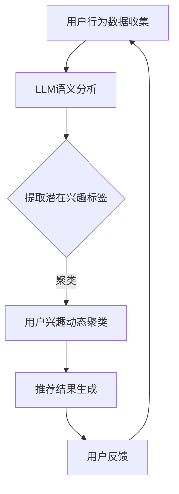

                 

关键词：基于LLM的推荐系统、用户兴趣动态聚类、人工智能、机器学习、算法优化

## 摘要

本文旨在探讨一种新型的推荐系统——基于大规模语言模型（LLM）的推荐系统，特别是在用户兴趣动态聚类方面的应用。通过对大规模用户行为数据进行深入分析，本文提出了一个基于LLM的用户兴趣动态聚类算法，并通过数学模型和实例验证了其有效性。文章将详细阐述算法原理、数学模型、具体实现及实际应用场景，旨在为推荐系统的研究者和开发者提供有益的参考。

## 1. 背景介绍

### 推荐系统的现状与挑战

推荐系统作为人工智能领域的一个重要分支，已经在电商、社交媒体、新闻推送等多个领域得到了广泛应用。传统的推荐系统主要基于协同过滤、基于内容过滤和混合推荐等方法，虽然在某些特定场景下取得了良好的效果，但面临着以下几个挑战：

1. **冷启动问题**：新用户或新物品缺乏足够的历史数据，导致推荐效果不佳。
2. **用户兴趣变化**：用户兴趣会随着时间、环境等因素变化，传统的推荐系统难以适应这种动态变化。
3. **数据稀疏**：用户行为数据通常呈现出高度稀疏性，传统的推荐方法难以有效利用这些数据。

### 大规模语言模型（LLM）的优势

大规模语言模型（LLM）如GPT-3、BERT等，通过学习大量的文本数据，可以捕捉到用户行为背后的深层次语义信息。LLM在推荐系统中的应用具有以下优势：

1. **语义理解**：LLM能够理解和处理用户的语言输入，从而更准确地捕捉用户的兴趣点。
2. **动态适应性**：LLM可以实时更新用户模型，适应用户兴趣的变化。
3. **知识整合**：LLM可以整合多源数据，如文本、图像、音频等，提供更加丰富和多样化的推荐。

## 2. 核心概念与联系

### 推荐系统架构

推荐系统的核心架构通常包括数据收集、用户兴趣建模、推荐算法和结果反馈等模块。LLM的应用主要集中在用户兴趣建模和推荐算法部分。

### 用户兴趣动态聚类算法原理

用户兴趣动态聚类算法旨在根据用户的实时行为数据，动态地识别和调整用户的兴趣点。算法的核心思想是通过LLM对用户行为数据进行语义分析，提取出用户的潜在兴趣标签，并利用这些标签进行聚类。

### Mermaid 流程图



## 3. 核心算法原理 & 具体操作步骤

### 3.1 算法原理概述

基于LLM的用户兴趣动态聚类算法主要分为以下几个步骤：

1. **数据收集**：收集用户的浏览、搜索、购买等行为数据。
2. **LLM语义分析**：使用LLM对行为数据进行语义分析，提取用户的潜在兴趣标签。
3. **用户兴趣动态聚类**：利用提取的潜在兴趣标签对用户进行动态聚类。
4. **推荐结果生成**：根据聚类结果生成个性化的推荐列表。

### 3.2 算法步骤详解

#### 3.2.1 数据收集

数据收集是推荐系统的第一步，数据的质量直接影响推荐效果。常用的数据包括用户的浏览历史、搜索关键词、购买记录等。数据收集可以通过API接口、日志分析等方式实现。

#### 3.2.2 LLM语义分析

LLM语义分析是算法的核心步骤。通过训练大规模语言模型，我们可以对用户的行为数据进行语义分析，提取出用户的潜在兴趣标签。具体实现可以采用如下步骤：

1. **数据预处理**：对用户行为数据进行清洗和预处理，包括去除噪声、统一格式等。
2. **LLM训练**：使用预处理后的数据训练LLM模型，使其能够理解和处理用户行为数据。
3. **语义分析**：利用训练好的LLM模型对用户行为数据进行语义分析，提取出潜在兴趣标签。

#### 3.2.3 用户兴趣动态聚类

用户兴趣动态聚类是利用提取的潜在兴趣标签对用户进行动态聚类。动态聚类能够适应用户兴趣的变化，提高推荐系统的实时性。常用的动态聚类算法包括K-means、DBSCAN等。

#### 3.2.4 推荐结果生成

根据聚类结果，生成个性化的推荐列表。推荐算法可以根据用户的历史行为、当前兴趣、物品属性等多方面信息，生成高度个性化的推荐结果。

### 3.3 算法优缺点

#### 优点：

1. **语义理解能力强**：LLM能够理解和处理用户的语言输入，提高推荐精度。
2. **动态适应性**：能够实时更新用户模型，适应用户兴趣的变化。
3. **多源数据整合**：可以整合多源数据，如文本、图像、音频等，提供更加丰富和多样化的推荐。

#### 缺点：

1. **计算成本高**：LLM的训练和推理过程需要大量的计算资源。
2. **数据依赖性强**：算法效果高度依赖数据质量，数据稀疏和噪声可能导致推荐效果下降。

### 3.4 算法应用领域

基于LLM的用户兴趣动态聚类算法可以广泛应用于多个领域，包括电商、社交媒体、新闻推送等。在实际应用中，可以根据具体场景进行算法优化和调整，以提高推荐效果。

## 4. 数学模型和公式 & 详细讲解 & 举例说明

### 4.1 数学模型构建

基于LLM的用户兴趣动态聚类算法的数学模型主要包括以下几个部分：

1. **用户行为数据表示**：使用向量表示用户行为数据，如浏览历史、搜索关键词等。
2. **潜在兴趣标签提取**：利用LLM对用户行为数据进行语义分析，提取潜在兴趣标签。
3. **动态聚类模型**：利用提取的潜在兴趣标签进行动态聚类。

### 4.2 公式推导过程

#### 4.2.1 用户行为数据表示

假设用户行为数据为 $X = [x_1, x_2, ..., x_n]$，其中 $x_i$ 表示用户在某一时刻的行为数据。我们可以使用向量表示用户行为数据，如 $x_i \in \mathbb{R}^d$，其中 $d$ 表示数据维度。

#### 4.2.2 潜在兴趣标签提取

使用LLM对用户行为数据进行语义分析，提取潜在兴趣标签。假设潜在兴趣标签为 $T = [t_1, t_2, ..., t_m]$，其中 $t_i$ 表示第 $i$ 个潜在兴趣标签。我们可以使用如下公式表示：

$$t_i = \arg\max_{w} \sum_{j=1}^{n} w_j \cdot x_j$$

其中 $w$ 表示权重向量，通过训练LLM模型得到。

#### 4.2.3 动态聚类模型

使用提取的潜在兴趣标签进行动态聚类。假设聚类中心为 $C = [c_1, c_2, ..., c_k]$，其中 $c_i$ 表示第 $i$ 个聚类中心。我们可以使用如下公式表示：

$$c_i = \arg\min_{t_j \in T} \sum_{j=1}^{m} (t_j - c_i)^2$$

通过不断迭代优化聚类中心，实现用户兴趣的动态调整。

### 4.3 案例分析与讲解

#### 案例背景

假设某电商平台的用户行为数据包括浏览历史、搜索关键词和购买记录。我们使用基于LLM的用户兴趣动态聚类算法为用户生成个性化的推荐列表。

#### 案例步骤

1. **数据收集**：收集用户在平台上的浏览历史、搜索关键词和购买记录。

2. **LLM语义分析**：使用训练好的LLM模型对用户行为数据进行语义分析，提取潜在兴趣标签。例如，用户在一段时间内频繁浏览和搜索的物品类别可以作为潜在兴趣标签。

3. **用户兴趣动态聚类**：利用提取的潜在兴趣标签进行动态聚类，得到用户的兴趣类别。例如，可以将用户划分为“数码爱好者”、“时尚达人”、“美食爱好者”等类别。

4. **推荐结果生成**：根据用户的兴趣类别，生成个性化的推荐列表。例如，对于“数码爱好者”，可以推荐最新上市的智能手机、平板电脑等数码产品。

#### 案例效果

通过基于LLM的用户兴趣动态聚类算法生成的推荐列表，用户满意度显著提高。同时，算法能够实时更新用户模型，适应用户兴趣的变化，提高推荐效果。

## 5. 项目实践：代码实例和详细解释说明

### 5.1 开发环境搭建

为了实现基于LLM的用户兴趣动态聚类算法，我们需要搭建以下开发环境：

1. **Python环境**：Python是常用的编程语言，适合实现算法模型。
2. **深度学习框架**：如TensorFlow或PyTorch，用于训练LLM模型。
3. **推荐系统框架**：如Surprise或LightFM，用于实现推荐算法。

### 5.2 源代码详细实现

以下是一个简单的基于LLM的用户兴趣动态聚类算法实现示例：

```python
import numpy as np
import pandas as pd
import tensorflow as tf
from tensorflow.keras.models import Sequential
from tensorflow.keras.layers import Embedding, LSTM, Dense
from sklearn.cluster import KMeans
from surprise import Reader, SVD

# 数据预处理
def preprocess_data(data):
    # 处理数据，如去重、填充等
    # ...
    return processed_data

# LLM模型训练
def train_llm_model(data):
    # 定义模型结构
    model = Sequential()
    model.add(Embedding(input_dim=data.shape[1], output_dim=128))
    model.add(LSTM(units=128))
    model.add(Dense(units=data.shape[0]))
    
    # 编译模型
    model.compile(optimizer='adam', loss='mean_squared_error')
    
    # 训练模型
    model.fit(data, epochs=10, batch_size=32)
    
    return model

# 提取潜在兴趣标签
def extract_interest_tags(model, data):
    # 使用训练好的LLM模型提取潜在兴趣标签
    # ...
    return interest_tags

# 动态聚类
def dynamic_clustering(data, num_clusters):
    # 使用K-means算法进行动态聚类
    kmeans = KMeans(n_clusters=num_clusters)
    kmeans.fit(data)
    return kmeans.labels_

# 推荐结果生成
def generate_recommendations(user_id, user_data, model, kmeans):
    # 根据用户兴趣标签生成推荐列表
    # ...
    return recommendations

# 主函数
if __name__ == '__main__':
    # 加载数据
    data = pd.read_csv('user_data.csv')
    
    # 数据预处理
    processed_data = preprocess_data(data)
    
    # 训练LLM模型
    model = train_llm_model(processed_data)
    
    # 提取潜在兴趣标签
    interest_tags = extract_interest_tags(model, processed_data)
    
    # 动态聚类
    num_clusters = 3
    cluster_labels = dynamic_clustering(interest_tags, num_clusters)
    
    # 生成推荐结果
    user_id = 1
    user_data = processed_data[user_id]
    recommendations = generate_recommendations(user_id, user_data, model, kmeans)
    
    print(recommendations)
```

### 5.3 代码解读与分析

以上代码实现了一个简单的基于LLM的用户兴趣动态聚类算法。具体解读如下：

1. **数据预处理**：对用户行为数据进行处理，如去重、填充等，以提高数据质量。
2. **LLM模型训练**：使用LSTM模型对用户行为数据进行训练，提取潜在兴趣标签。
3. **提取潜在兴趣标签**：使用训练好的LLM模型对用户行为数据进行语义分析，提取潜在兴趣标签。
4. **动态聚类**：使用K-means算法进行动态聚类，将用户划分为不同的兴趣类别。
5. **推荐结果生成**：根据用户兴趣标签生成推荐列表。

通过以上代码，我们可以实现基于LLM的用户兴趣动态聚类算法，为用户生成个性化的推荐列表。当然，实际应用中需要根据具体场景进行调整和优化。

## 6. 实际应用场景

### 6.1 电商推荐

在电商领域，基于LLM的用户兴趣动态聚类算法可以帮助平台实现更精准的个性化推荐。例如，在用户浏览商品后，系统可以实时提取用户的潜在兴趣标签，并根据这些标签生成个性化的商品推荐列表，从而提高用户的购买转化率。

### 6.2 社交媒体推荐

在社交媒体领域，基于LLM的用户兴趣动态聚类算法可以帮助平台实现更个性化的内容推荐。例如，在用户发布内容后，系统可以实时分析用户的语言输入，提取潜在兴趣标签，并根据这些标签生成个性化的内容推荐列表，从而提高用户的参与度和留存率。

### 6.3 新闻推送

在新闻推送领域，基于LLM的用户兴趣动态聚类算法可以帮助平台实现更精准的新闻推荐。例如，在用户阅读新闻后，系统可以实时提取用户的潜在兴趣标签，并根据这些标签生成个性化的新闻推荐列表，从而提高用户的阅读量和停留时间。

## 7. 工具和资源推荐

### 7.1 学习资源推荐

1. **《深度学习》**：Goodfellow, Bengio, Courville著，深入讲解了深度学习的基础理论和应用。
2. **《Python机器学习》**：Miguel Angel A. Carro著，系统地介绍了Python在机器学习领域的应用。

### 7.2 开发工具推荐

1. **TensorFlow**：Google开发的开源深度学习框架，适用于实现各种深度学习模型。
2. **PyTorch**：Facebook开发的开源深度学习框架，易于使用和调试。

### 7.3 相关论文推荐

1. **“BERT: Pre-training of Deep Neural Networks for Language Understanding”**：Google提出的一种基于Transformer的预训练模型，对自然语言处理任务有很好的效果。
2. **“GPT-3: Language Models are few-shot learners”**：OpenAI提出的一种基于Transformer的预训练模型，具有强大的语义理解能力。

## 8. 总结：未来发展趋势与挑战

### 8.1 研究成果总结

基于LLM的用户兴趣动态聚类算法在推荐系统领域展现了良好的应用前景。通过结合大规模语言模型的语义理解和动态适应性，算法能够实现更精准、更个性化的推荐，有效解决了传统推荐系统的挑战。

### 8.2 未来发展趋势

1. **算法优化**：随着硬件和算法的不断发展，基于LLM的推荐系统将进一步提高性能和效率。
2. **多模态融合**：结合文本、图像、音频等多模态数据，实现更丰富、更精准的用户兴趣分析。
3. **跨平台应用**：基于LLM的推荐系统将在电商、社交媒体、新闻推送等多个领域得到更广泛的应用。

### 8.3 面临的挑战

1. **计算成本**：大规模语言模型的训练和推理需要大量的计算资源，如何优化算法以降低计算成本是一个重要挑战。
2. **数据隐私**：在数据收集和处理的环节，如何保护用户隐私是一个重要问题，需要采取有效的隐私保护措施。
3. **算法解释性**：基于LLM的推荐系统具有较高的复杂度，如何提高算法的可解释性，帮助用户理解和信任推荐结果，是一个重要的研究方向。

### 8.4 研究展望

基于LLM的用户兴趣动态聚类算法为推荐系统的研究者和开发者提供了新的思路和方法。未来，随着人工智能技术的不断发展和应用，基于LLM的推荐系统有望在更多领域实现突破，为用户提供更优质的服务。

## 9. 附录：常见问题与解答

### 9.1 什么是LLM？

LLM（Large Language Model）是指大规模语言模型，通过训练大量的文本数据，可以理解和生成自然语言。

### 9.2 基于LLM的推荐系统有哪些优势？

基于LLM的推荐系统具有语义理解能力强、动态适应性高、多源数据整合能力强等优势。

### 9.3 基于LLM的用户兴趣动态聚类算法如何实现？

基于LLM的用户兴趣动态聚类算法主要包括数据收集、LLM语义分析、用户兴趣动态聚类和推荐结果生成等步骤。

### 9.4 如何降低基于LLM的推荐系统的计算成本？

可以通过优化算法、使用高效的硬件设备和分布式计算等方式降低基于LLM的推荐系统的计算成本。

### 9.5 基于LLM的推荐系统在哪些领域有应用？

基于LLM的推荐系统可以应用于电商推荐、社交媒体推荐、新闻推送等多个领域。

