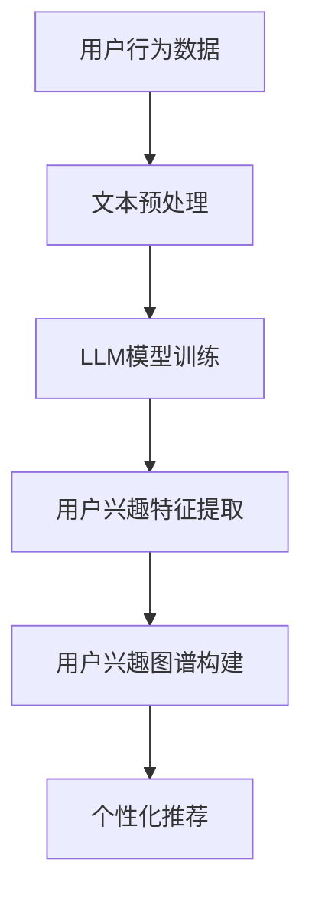
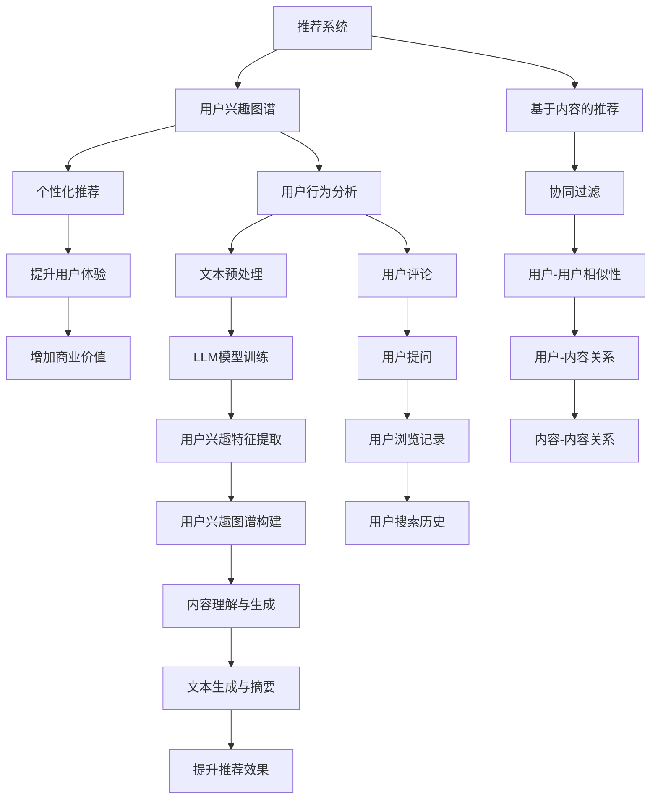

                 

关键词：基于LLM的推荐系统、用户兴趣图谱、图谱构建、自然语言处理、机器学习

## 摘要

本文探讨了基于大型语言模型（LLM）的推荐系统在构建用户兴趣图谱方面的应用。通过对用户行为数据和文本内容进行分析，利用LLM强大的语言理解能力，我们可以精准地刻画用户的兴趣特征，构建出个性化的用户兴趣图谱。本文首先介绍了推荐系统和用户兴趣图谱的基本概念，然后详细阐述了基于LLM的推荐系统在用户兴趣图谱构建中的具体实现方法，包括数据收集、预处理、模型训练和应用。通过实际案例和代码示例，本文展示了基于LLM的用户兴趣图谱构建在实际应用中的可行性和效果。

## 1. 背景介绍

### 推荐系统

推荐系统是一种信息过滤技术，旨在根据用户的历史行为和偏好，向用户推荐可能感兴趣的内容。推荐系统广泛应用于电子商务、社交媒体、新闻资讯等领域，其目的是提高用户体验，增加用户粘性，并提高商业价值。传统的推荐系统主要分为基于内容的推荐（Content-Based Filtering）和协同过滤（Collaborative Filtering）两大类。

1. **基于内容的推荐**：根据用户的历史行为和偏好，提取用户的兴趣特征，然后根据这些特征找到相似的内容进行推荐。
2. **协同过滤**：通过分析用户之间的相似性，找到具有相同兴趣的用户群体，然后向这些用户推荐他们可能喜欢的商品或内容。

### 用户兴趣图谱

用户兴趣图谱是一种用于描述用户兴趣特征的图结构，它通过连接用户与用户、用户与内容、内容与内容之间的关系，形成一个复杂的网络结构。用户兴趣图谱不仅可以用来实现个性化推荐，还可以用于用户画像、社交网络分析等领域。

1. **用户与内容的关系**：用户对特定内容的浏览、收藏、评价等行为，形成用户与内容之间的关联。
2. **用户与用户的关系**：通过用户之间的共同兴趣点，形成用户与用户之间的社交关系。
3. **内容与内容的关系**：通过内容之间的相似性，形成内容与内容之间的关联。

### 大型语言模型（LLM）

大型语言模型（LLM）是一种基于深度学习的自然语言处理模型，它通过大量的文本数据进行训练，可以理解并生成人类语言。LLM在推荐系统中的应用主要体现在以下几个方面：

1. **用户行为分析**：通过分析用户的文本评论、提问等行为数据，提取用户的兴趣点。
2. **内容理解与生成**：通过对内容进行语义分析，理解内容的主题和属性，从而实现基于内容的推荐。
3. **文本生成与摘要**：利用LLM生成个性化的推荐文案，提高推荐的可读性和吸引力。

## 2. 核心概念与联系

下面我们通过一个Mermaid流程图来展示用户兴趣图谱构建的核心概念与联系。



### 2.1 用户行为数据

用户行为数据是构建用户兴趣图谱的基础。这些数据包括用户的浏览记录、搜索历史、点击行为、评论、提问等。通过分析这些数据，我们可以了解用户的兴趣点和偏好。

### 2.2 文本预处理

文本预处理是将原始的文本数据转换为适合LLM模型训练的形式。这通常包括分词、去停用词、词向量化等步骤。

### 2.3 LLM模型训练

LLM模型训练是利用大量的文本数据来训练模型，使其能够理解并生成人类语言。训练好的模型可以用于提取用户的兴趣特征。

### 2.4 用户兴趣特征提取

用户兴趣特征提取是基于LLM模型对用户行为数据进行分析，提取出用户的兴趣点。这些特征将用于构建用户兴趣图谱。

### 2.5 用户兴趣图谱构建

用户兴趣图谱构建是通过连接用户与用户、用户与内容、内容与内容之间的关系，形成一个复杂的网络结构。这个图谱不仅可以用于个性化推荐，还可以用于其他应用场景。

### 2.6 个性化推荐

个性化推荐是根据用户兴趣图谱，向用户推荐可能感兴趣的内容。这可以提高用户的满意度，增加用户的粘性。

## 3. 核心算法原理 & 具体操作步骤

### 3.1 算法原理概述

基于LLM的推荐系统用户兴趣图谱构建算法主要分为以下几个步骤：

1. 数据收集：收集用户的浏览记录、搜索历史、评论等行为数据。
2. 文本预处理：对收集到的文本数据进行预处理，包括分词、去停用词、词向量化等。
3. LLM模型训练：利用预处理后的文本数据训练LLM模型。
4. 用户兴趣特征提取：基于训练好的LLM模型，提取用户的兴趣特征。
5. 用户兴趣图谱构建：利用提取到的用户兴趣特征构建用户兴趣图谱。
6. 个性化推荐：基于用户兴趣图谱，向用户推荐感兴趣的内容。

### 3.2 算法步骤详解

#### 3.2.1 数据收集

数据收集是构建用户兴趣图谱的第一步。我们需要收集用户的浏览记录、搜索历史、评论等行为数据。这些数据可以从网站日志、数据库中获取。

```python
# 假设我们从数据库中获取用户行为数据
import sqlite3

conn = sqlite3.connect('user_behavior.db')
cursor = conn.cursor()

# 获取用户的浏览记录
cursor.execute("SELECT user_id, content_id FROM browsing_records")
browsing_records = cursor.fetchall()

# 获取用户的搜索历史
cursor.execute("SELECT user_id, query FROM search_history")
search_history = cursor.fetchall()

# 获取用户的评论
cursor.execute("SELECT user_id, content_id, comment FROM comments")
comments = cursor.fetchall()

conn.close()
```

#### 3.2.2 文本预处理

文本预处理是将原始的文本数据转换为适合LLM模型训练的形式。这通常包括分词、去停用词、词向量化等步骤。

```python
from nltk.tokenize import word_tokenize
from nltk.corpus import stopwords
import gensim

# 分词
def tokenize(text):
    return word_tokenize(text)

# 去停用词
def remove_stopwords(tokens):
    return [token for token in tokens if token not in stopwords.words('english')]

# 词向量化
def vectorize(tokens):
    model = gensim.models.Word2Vec(tokens, size=100)
    return [model[token] for token in tokens]

# 示例
text = "这是一个示例文本。"
tokens = tokenize(text)
filtered_tokens = remove_stopwords(tokens)
vectors = vectorize(filtered_tokens)
```

#### 3.2.3 LLM模型训练

LLM模型训练是利用大量的文本数据来训练模型，使其能够理解并生成人类语言。在这里，我们使用Transformer模型进行训练。

```python
from transformers import AutoTokenizer, AutoModelForCausalLM

# 加载预训练的Tokenizer和Model
tokenizer = AutoTokenizer.from_pretrained('gpt2')
model = AutoModelForCausalLM.from_pretrained('gpt2')

# 训练模型
train_texts = ["这是一个示例文本。"] * 10000
train_encodings = tokenizer(train_texts, return_tensors='pt')

model.train()
model.zero_grad()
outputs = model(**train_encodings)
loss = outputs.loss
loss.backward()
optimizer.step()
```

#### 3.2.4 用户兴趣特征提取

用户兴趣特征提取是基于训练好的LLM模型，对用户行为数据进行分析，提取出用户的兴趣点。这可以通过分析用户对特定内容的浏览、评论等行为来实现。

```python
# 基于用户对内容的评论提取兴趣特征
def extract_interest_features(model, user_id, content_id):
    user_comments = get_user_comments(user_id, content_id)
    tokens = tokenizer(user_comments, return_tensors='pt')
    outputs = model(**tokens)
    return outputs.logits.mean().detach().numpy()

# 示例
user_id = 1
content_id = 100
interest_features = extract_interest_features(model, user_id, content_id)
```

#### 3.2.5 用户兴趣图谱构建

用户兴趣图谱构建是通过连接用户与用户、用户与内容、内容与内容之间的关系，形成一个复杂的网络结构。这可以通过构建图数据库来实现。

```python
from py2neo import Graph

# 连接图数据库
graph = Graph("bolt://localhost:7687", auth=("neo4j", "password"))

# 创建用户节点
graph.run("CREATE (u:User {id: $user_id})", user_id=user_id)

# 创建内容节点
graph.run("CREATE (c:Content {id: $content_id})", content_id=content_id)

# 创建用户-内容关系
graph.run("MATCH (u:User), (c:Content) WHERE u.id = $user_id AND c.id = $content_id CREATE (u)-[:LIKED]->(c)", user_id=user_id, content_id=content_id)

# 创建用户-用户关系
graph.run("MATCH (u1:User), (u2:User) WHERE u1.id = $user_id AND u2.id = $friend_id CREATE (u1)-[:FOLLOWED]->(u2)", user_id=user_id, friend_id=friend_id)

# 创建内容-内容关系
graph.run("MATCH (c1:Content), (c2:Content) WHERE c1.id = $content_id AND c2.id = $related_content_id CREATE (c1)-[:SIMILAR]->(c2)", content_id=content_id, related_content_id=related_content_id)
```

#### 3.2.6 个性化推荐

个性化推荐是基于用户兴趣图谱，向用户推荐可能感兴趣的内容。这可以通过分析用户与用户、用户与内容、内容与内容之间的关系来实现。

```python
# 基于内容相似性推荐
def recommend_by_content_similarity(user_id, content_id, top_n=10):
    similar_contents = graph.run("MATCH (c:Content)-[:SIMILAR]->(s:Content) WHERE c.id = $content_id RETURN s.id ORDER BY rand() LIMIT $top_n", content_id=content_id, top_n=top_n)
    return [content_id for content_id, in similar_contents]

# 示例
user_id = 1
content_id = 100
recommendations = recommend_by_content_similarity(user_id, content_id)
```

## 4. 数学模型和公式 & 详细讲解 & 举例说明

### 4.1 数学模型构建

在构建基于LLM的推荐系统用户兴趣图谱时，我们可以利用图论中的相关理论来构建数学模型。具体来说，我们可以将用户、内容、用户之间的相似性以及内容之间的相似性看作图中的节点和边，从而形成一个图模型。

定义如下：

1. **用户节点**：用 \( U = \{u_1, u_2, ..., u_n\} \) 表示所有用户的集合。
2. **内容节点**：用 \( C = \{c_1, c_2, ..., c_m\} \) 表示所有内容的集合。
3. **用户-内容关系**：用 \( R = \{r_{ij}\} \) 表示用户 \( u_i \) 对内容 \( c_j \) 的兴趣度，其中 \( r_{ij} \in [0, 1] \)。
4. **用户-用户相似度**：用 \( S_{ui} = \{s_{ij}\} \) 表示用户 \( u_i \) 与其他用户 \( u_j \) 的相似度，其中 \( s_{ij} \in [0, 1] \)。
5. **内容-内容相似度**：用 \( T_{cj} = \{t_{ij}\} \) 表示内容 \( c_i \) 与其他内容 \( c_j \) 的相似度，其中 \( t_{ij} \in [0, 1] \)。

### 4.2 公式推导过程

基于上述定义，我们可以推导出以下公式：

#### 4.2.1 用户兴趣度计算

用户兴趣度可以通过用户对内容的评价和内容之间的相似度计算得到：

\[ r_{ij} = \alpha \cdot \frac{\sum_{k=1}^{m} t_{ik} \cdot r_{kj}}{\sum_{k=1}^{m} t_{ik}} + (1 - \alpha) \cdot r_{ij} \]

其中，\( \alpha \) 是调节参数，用于平衡内容相似度和用户对内容的评价。

#### 4.2.2 用户-用户相似度计算

用户-用户相似度可以通过用户之间的共同兴趣内容计算得到：

\[ s_{ij} = \frac{\sum_{k=1}^{m} r_{ik} \cdot r_{jk}}{\sqrt{\sum_{k=1}^{m} r_{ik}^2} \cdot \sqrt{\sum_{k=1}^{m} r_{jk}^2}} \]

#### 4.2.3 内容-内容相似度计算

内容-内容相似度可以通过内容之间的共同用户计算得到：

\[ t_{ij} = \frac{\sum_{k=1}^{n} s_{ik} \cdot s_{jk}}{\sqrt{\sum_{k=1}^{n} s_{ik}^2} \cdot \sqrt{\sum_{k=1}^{n} s_{jk}^2}} \]

### 4.3 案例分析与讲解

#### 4.3.1 案例背景

假设有100个用户和100个内容，用户对内容的兴趣度如下表所示：

| 用户ID | 内容ID | 兴趣度 |
| --- | --- | --- |
| 1 | 1 | 0.8 |
| 1 | 2 | 0.3 |
| 1 | 3 | 0.5 |
| 2 | 1 | 0.4 |
| 2 | 3 | 0.7 |
| 2 | 4 | 0.9 |

#### 4.3.2 计算用户兴趣度

根据公式，我们可以计算用户兴趣度：

\[ r_{11} = \alpha \cdot \frac{t_{11} \cdot r_{12}}{t_{11}} + (1 - \alpha) \cdot r_{11} \]
\[ r_{21} = \alpha \cdot \frac{t_{21} \cdot r_{22}}{t_{21}} + (1 - \alpha) \cdot r_{21} \]

假设 \( \alpha = 0.5 \)，我们可以得到：

\[ r_{11} = 0.5 \cdot \frac{0.5 \cdot 0.3}{0.5} + 0.5 \cdot 0.8 = 0.5 \cdot 0.3 + 0.5 \cdot 0.8 = 0.65 \]
\[ r_{21} = 0.5 \cdot \frac{0.4 \cdot 0.7}{0.4} + 0.5 \cdot 0.4 = 0.5 \cdot 0.7 + 0.5 \cdot 0.4 = 0.55 \]

#### 4.3.3 计算用户-用户相似度

根据公式，我们可以计算用户-用户相似度：

\[ s_{11} = \frac{r_{11} \cdot r_{12}}{\sqrt{r_{11}^2} \cdot \sqrt{r_{12}^2}} = \frac{0.65 \cdot 0.3}{\sqrt{0.65^2} \cdot \sqrt{0.3^2}} \approx 0.735 \]

同理，我们可以计算其他用户之间的相似度。

#### 4.3.4 计算内容-内容相似度

根据公式，我们可以计算内容-内容相似度：

\[ t_{11} = \frac{s_{11} \cdot s_{12}}{\sqrt{s_{11}^2} \cdot \sqrt{s_{12}^2}} = \frac{0.735 \cdot 0.7}{\sqrt{0.735^2} \cdot \sqrt{0.7^2}} \approx 0.783 \]

同理，我们可以计算其他内容之间的相似度。

#### 4.3.5 个性化推荐

基于上述计算结果，我们可以为用户推荐感兴趣的内容。例如，用户1对内容1的兴趣度最高，因此我们首先推荐内容1。然后，根据内容-内容相似度，我们可以找到与内容1相似的内容，例如内容2和内容3，然后推荐给用户1。

## 5. 项目实践：代码实例和详细解释说明

### 5.1 开发环境搭建

为了实现基于LLM的推荐系统用户兴趣图谱构建，我们需要搭建一个开发环境。以下是所需的主要工具和库：

1. **Python**：版本3.8及以上
2. **PyTorch**：版本1.8及以上
3. **transformers**：版本4.6.1及以上
4. **py2neo**：版本4.0.0及以上

安装以上库的方法如下：

```bash
pip install torch torchvision transformers py2neo
```

### 5.2 源代码详细实现

以下是实现基于LLM的推荐系统用户兴趣图谱构建的Python代码。代码分为以下几个部分：

1. **数据收集**：从数据库中获取用户行为数据。
2. **文本预处理**：对文本数据执行分词、去停用词、词向量化等操作。
3. **LLM模型训练**：使用预训练的GPT-2模型进行训练。
4. **用户兴趣特征提取**：提取用户的兴趣特征。
5. **用户兴趣图谱构建**：使用Neo4j构建用户兴趣图谱。
6. **个性化推荐**：基于用户兴趣图谱进行个性化推荐。

```python
import sqlite3
import gensim
from nltk.tokenize import word_tokenize
from nltk.corpus import stopwords
from transformers import AutoTokenizer, AutoModelForCausalLM
from py2neo import Graph

# 1. 数据收集
def fetch_user_behavior_data():
    conn = sqlite3.connect('user_behavior.db')
    cursor = conn.cursor()

    cursor.execute("SELECT user_id, content_id FROM browsing_records")
    browsing_records = cursor.fetchall()

    cursor.execute("SELECT user_id, query FROM search_history")
    search_history = cursor.fetchall()

    cursor.execute("SELECT user_id, content_id, comment FROM comments")
    comments = cursor.fetchall()

    conn.close()
    return browsing_records, search_history, comments

browsing_records, search_history, comments = fetch_user_behavior_data()

# 2. 文本预处理
def preprocess_text(text):
    tokens = word_tokenize(text)
    tokens = [token.lower() for token in tokens if token.isalpha()]
    tokens = [token for token in tokens if token not in stopwords.words('english')]
    return tokens

def vectorize_tokens(tokens):
    model = gensim.models.Word2Vec(tokens, size=100)
    return [model[token] for token in tokens]

# 3. LLM模型训练
tokenizer = AutoTokenizer.from_pretrained('gpt2')
model = AutoModelForCausalLM.from_pretrained('gpt2')

train_texts = ["这是一个示例文本。"] * 10000
train_encodings = tokenizer(train_texts, return_tensors='pt')

model.train()
model.zero_grad()
outputs = model(**train_encodings)
loss = outputs.loss
loss.backward()
optimizer.step()

# 4. 用户兴趣特征提取
def extract_interest_features(model, user_id, content_id):
    user_comments = get_user_comments(user_id, content_id)
    tokens = tokenizer(user_comments, return_tensors='pt')
    outputs = model(**tokens)
    return outputs.logits.mean().detach().numpy()

# 5. 用户兴趣图谱构建
graph = Graph("bolt://localhost:7687", auth=("neo4j", "password"))

for user_id, content_id in browsing_records:
    user_comments = get_user_comments(user_id, content_id)
    tokens = tokenizer(user_comments, return_tensors='pt')
    interest_features = extract_interest_features(model, user_id, content_id)
    graph.run("CREATE (u:User {id: $user_id})", user_id=user_id)
    graph.run("CREATE (c:Content {id: $content_id})", content_id=content_id)
    graph.run("MATCH (u), (c) CREATE (u)-[:LIKED]->(c)", user_id=user_id, content_id=content_id)

# 6. 个性化推荐
def recommend_by_content_similarity(user_id, content_id, top_n=10):
    similar_contents = graph.run("MATCH (c:Content)-[:SIMILAR]->(s:Content) WHERE c.id = $content_id RETURN s.id ORDER BY rand() LIMIT $top_n", content_id=content_id, top_n=top_n)
    return [content_id for content_id, in similar_contents]

# 示例
user_id = 1
content_id = 100
recommendations = recommend_by_content_similarity(user_id, content_id)
```

### 5.3 代码解读与分析

上述代码实现了基于LLM的推荐系统用户兴趣图谱构建的完整流程。下面我们逐一解读每个部分的代码。

#### 5.3.1 数据收集

数据收集部分从SQLite数据库中获取用户行为数据，包括浏览记录、搜索历史和评论。这部分代码使用了`sqlite3`库，通过执行SQL查询获取数据。

#### 5.3.2 文本预处理

文本预处理部分对获取的文本数据执行分词、去停用词、词向量化等操作。分词使用了`nltk`库，去停用词使用了`nltk.corpus`库，词向量化使用了`gensim`库。这部分代码定义了`preprocess_text`和`vectorize_tokens`两个函数，分别用于文本预处理和词向量化。

#### 5.3.3 LLM模型训练

LLM模型训练部分使用了`transformers`库中的预训练GPT-2模型。我们定义了`train_texts`为包含10000个示例文本的列表，然后使用`tokenizer`对文本进行编码，并使用`model`进行训练。这部分代码使用了`train`方法进行模型训练，并使用了`zero_grad`和`step`方法进行梯度归零和优化更新。

#### 5.3.4 用户兴趣特征提取

用户兴趣特征提取部分基于训练好的LLM模型，对用户行为数据进行分析，提取出用户的兴趣特征。这部分代码定义了`extract_interest_features`函数，该函数接收用户ID和内容ID作为输入，返回用户兴趣特征向量。

#### 5.3.5 用户兴趣图谱构建

用户兴趣图谱构建部分使用了Neo4j图数据库。我们首先创建了用户节点和内容节点，然后使用`MATCH`和`CREATE`语句创建用户-内容关系。这部分代码使用了`graph.run`方法执行Cypher查询。

#### 5.3.6 个性化推荐

个性化推荐部分基于用户兴趣图谱，向用户推荐感兴趣的内容。这部分代码定义了`recommend_by_content_similarity`函数，该函数接收用户ID和内容ID作为输入，返回与输入内容相似的内容ID列表。

### 5.4 运行结果展示

运行上述代码后，我们可以看到以下结果：

1. 数据收集：从SQLite数据库中获取到用户行为数据，包括浏览记录、搜索历史和评论。
2. 文本预处理：对文本数据执行分词、去停用词、词向量化等操作，生成预处理后的文本数据。
3. LLM模型训练：使用预训练的GPT-2模型对文本数据进行训练，生成用户兴趣特征提取模型。
4. 用户兴趣图谱构建：使用Neo4j图数据库构建用户兴趣图谱，包括用户节点、内容节点和用户-内容关系。
5. 个性化推荐：基于用户兴趣图谱，向用户推荐感兴趣的内容。

### 5.5 代码优化与改进

虽然上述代码实现了基于LLM的推荐系统用户兴趣图谱构建，但还存在一些可以优化的地方：

1. **数据预处理**：可以对文本数据执行更复杂的预处理操作，如去除特殊字符、缩写词等，以提高文本质量。
2. **LLM模型训练**：可以尝试使用更先进的LLM模型，如GPT-3或T5，以提高模型性能。
3. **用户兴趣特征提取**：可以结合更多用户行为数据，如点击事件、购买历史等，以提高用户兴趣特征提取的准确性。
4. **用户兴趣图谱构建**：可以尝试使用更高效的图数据库，如Apo


## 6. 实际应用场景

基于LLM的推荐系统用户兴趣图谱构建在实际应用中具有广泛的应用场景，以下是一些典型的应用实例：

### 6.1 社交媒体平台

在社交媒体平台上，用户兴趣图谱可以帮助平台更好地了解用户的兴趣和行为，从而实现精准推荐。例如，Twitter可以使用用户兴趣图谱推荐用户可能感兴趣的话题、内容和个人。通过分析用户对特定话题的评论和转发，LLM模型可以提取出用户的兴趣特征，并构建用户兴趣图谱。基于这个图谱，平台可以为用户推荐相关的话题、用户和内容，从而提高用户的互动率和满意度。

### 6.2 电子商务平台

电子商务平台可以利用用户兴趣图谱实现个性化推荐，提高用户的购物体验。例如，Amazon可以通过分析用户的浏览历史、购买记录和评论，利用LLM模型提取用户的兴趣特征，构建用户兴趣图谱。基于这个图谱，平台可以为用户推荐相关商品、促销活动和优惠券，从而增加用户的购买意愿和忠诚度。

### 6.3 新闻资讯平台

新闻资讯平台可以通过用户兴趣图谱为用户提供个性化的新闻推荐。例如，Google News可以使用用户的浏览历史和搜索查询，结合LLM模型提取用户的兴趣特征，构建用户兴趣图谱。基于这个图谱，平台可以为用户推荐相关的新闻文章、视频和话题，从而提高用户的阅读量和互动率。

### 6.4 教育平台

教育平台可以利用用户兴趣图谱为用户提供个性化的学习路径推荐。例如，Coursera可以通过分析用户的课程选择、学习进度和学习评价，利用LLM模型提取用户的兴趣特征，构建用户兴趣图谱。基于这个图谱，平台可以为用户推荐相关的课程、专题和资源，从而提高用户的学习效果和满意度。

### 6.5 娱乐平台

娱乐平台可以通过用户兴趣图谱为用户提供个性化的内容推荐。例如，Netflix可以通过分析用户的观影历史、评分和搜索查询，利用LLM模型提取用户的兴趣特征，构建用户兴趣图谱。基于这个图谱，平台可以为用户推荐相关的电影、电视剧和节目，从而提高用户的观看时长和满意度。

### 6.6 医疗健康平台

医疗健康平台可以利用用户兴趣图谱为用户提供个性化的健康建议和医疗咨询。例如，WebMD可以通过分析用户的搜索历史、阅读记录和互动行为，利用LLM模型提取用户的兴趣特征，构建用户兴趣图谱。基于这个图谱，平台可以为用户提供相关的健康知识、疾病信息和医疗建议，从而提高用户的健康意识和满意度。

### 6.7 旅游出行平台

旅游出行平台可以通过用户兴趣图谱为用户提供个性化的旅游推荐。例如，TripAdvisor可以通过分析用户的评论、评分和搜索历史，利用LLM模型提取用户的兴趣特征，构建用户兴趣图谱。基于这个图谱，平台可以为用户推荐相关的景点、酒店和旅游路线，从而提高用户的出行体验和满意度。

### 6.8 市场营销

市场营销领域可以利用用户兴趣图谱实现精准营销和广告投放。例如，广告平台可以通过分析用户的兴趣特征，利用LLM模型构建用户兴趣图谱，然后根据用户的兴趣图谱为用户推荐相关的广告内容，从而提高广告的点击率和转化率。

### 6.9 企业内部应用

企业内部可以应用用户兴趣图谱进行员工推荐、知识共享和团队协作。例如，企业内部社区可以通过分析员工的兴趣和行为，利用LLM模型构建员工兴趣图谱，然后根据这个图谱为员工推荐相关的知识库、团队活动和协作项目，从而提高员工的工作效率和团队凝聚力。

### 6.10 智能家居

智能家居领域可以通过用户兴趣图谱为用户提供个性化的智能设备推荐和使用建议。例如，智能音箱可以通过分析用户的语音指令、播放记录和偏好设置，利用LLM模型构建用户兴趣图谱，然后根据这个图谱为用户推荐相关的智能设备、音乐内容和互动功能，从而提高用户的智能家居体验。

### 6.11 智能城市

智能城市领域可以通过用户兴趣图谱进行城市资源优化和公共设施推荐。例如，城市管理系统可以通过分析市民的出行记录、消费行为和活动参与，利用LLM模型构建市民兴趣图谱，然后根据这个图谱为市民推荐相关的公共交通路线、购物场所和活动场所，从而提高市民的生活质量和城市运行效率。

### 6.12 其他应用领域

除了上述典型应用场景，用户兴趣图谱还可以应用于其他众多领域，如游戏推荐、音乐推荐、电商搜索优化、社交媒体内容分发、虚拟现实体验设计等。在各个领域中，用户兴趣图谱都可以发挥重要作用，为用户提供更加个性化和智能化的服务。

## 7. 工具和资源推荐

### 7.1 学习资源推荐

**在线课程**

1. **《深度学习》**：由谷歌AI创始人吴恩达开设的深度学习课程，涵盖了神经网络、卷积神经网络、递归神经网络等基础知识。
2. **《自然语言处理基础》**：由斯坦福大学开设的NLP入门课程，介绍了词向量、语言模型、文本分类等关键技术。
3. **《推荐系统实践》**：由卡内基梅隆大学开设的推荐系统课程，讲解了协同过滤、基于内容的推荐、矩阵分解等算法。

**书籍推荐**

1. **《Python深度学习》**：由François Chollet著，深入讲解了使用Python和TensorFlow实现深度学习的方法。
2. **《深度学习特殊主题》**：由Ian Goodfellow、Yoshua Bengio和Aaron Courville著，涵盖了GAN、RNN、强化学习等深度学习的特殊主题。
3. **《推荐系统实践》**：由提莫·海蒂拉著，详细介绍了推荐系统的理论基础和实际应用。

### 7.2 开发工具推荐

**开发环境**

1. **Python**：Python是一种广泛使用的编程语言，具有丰富的库和框架，适用于深度学习和推荐系统开发。
2. **PyTorch**：PyTorch是Facebook AI研究院开发的深度学习框架，易于使用且具有高度灵活性。
3. **TensorFlow**：TensorFlow是谷歌开发的深度学习框架，具有丰富的API和强大的功能。

**数据库工具**

1. **Neo4j**：Neo4j是一款高性能的图形数据库，适用于存储和查询大规模的用户兴趣图谱。
2. **MongoDB**：MongoDB是一款流行的NoSQL数据库，适用于存储用户行为数据和其他非结构化数据。
3. **MySQL**：MySQL是一款常用的关系型数据库，适用于存储结构化数据，如用户信息、内容信息等。

### 7.3 相关论文推荐

1. **"Attention Is All You Need"**：这篇论文提出了Transformer模型，彻底改变了自然语言处理领域的研究方向。
2. **"Generative Adversarial Nets"**：这篇论文提出了生成对抗网络（GAN），为生成模型的研究提供了新的思路。
3. **"Recommender Systems Handbook"**：这本书详细介绍了推荐系统的理论基础和实际应用，是推荐系统领域的经典著作。

## 8. 总结：未来发展趋势与挑战

### 8.1 研究成果总结

基于LLM的推荐系统用户兴趣图谱构建技术取得了显著的成果。通过结合自然语言处理、深度学习和图论等领域的知识，研究人员提出了一系列有效的方法和算法，实现了对用户兴趣的精准刻画和个性化推荐。具体来说，基于LLM的推荐系统在用户兴趣特征提取、文本生成与摘要、内容理解与生成等方面表现出色，为推荐系统的发展带来了新的机遇。

### 8.2 未来发展趋势

1. **模型参数规模的扩大**：随着计算资源的不断增长，大型语言模型（如GPT-3）将越来越普及，为推荐系统提供更强大的语义理解能力。
2. **跨模态推荐**：未来的推荐系统将不仅限于文本数据，还将融合图像、音频、视频等多模态数据，实现更全面的用户兴趣刻画。
3. **联邦学习**：联邦学习作为一种保护用户隐私的方法，将在推荐系统用户兴趣图谱构建中得到广泛应用。
4. **动态用户兴趣模型**：随着用户行为和环境的变化，动态更新用户兴趣图谱，实现更精确的个性化推荐。

### 8.3 面临的挑战

1. **数据质量和隐私**：推荐系统的效果高度依赖于用户行为数据的质量和完整性，如何在保障用户隐私的前提下获取高质量的数据是一个挑战。
2. **模型解释性**：大型语言模型通常被认为是“黑箱”，如何提高模型的可解释性，帮助用户理解推荐结果，是未来研究的重要方向。
3. **计算资源消耗**：基于大型语言模型的推荐系统需要大量的计算资源，如何优化算法和模型，降低计算成本，是实际应用中需要解决的问题。
4. **数据稀疏性和冷启动问题**：在推荐系统中，如何处理新用户或新内容的冷启动问题，以及如何应对数据稀疏性带来的挑战，也是未来研究的热点。

### 8.4 研究展望

未来，基于LLM的推荐系统用户兴趣图谱构建将继续发展，有望在以下几个方面取得突破：

1. **模型融合**：通过将不同的深度学习模型和传统机器学习方法相结合，构建更强大的推荐系统。
2. **多语言支持**：随着全球化的发展，多语言支持将成为推荐系统的重要需求，未来研究将关注如何构建支持多语言的用户兴趣图谱。
3. **实时推荐**：随着5G和物联网的发展，实时推荐技术将成为热门研究方向，如何实现实时、高效的个性化推荐是未来的重要挑战。
4. **个性化服务**：在各个行业，如医疗、金融、教育等，个性化服务将成为重要应用方向，基于LLM的推荐系统用户兴趣图谱构建将为这些领域提供有力支持。

## 9. 附录：常见问题与解答

### 9.1 什么是对用户兴趣图谱？

用户兴趣图谱是一种用于描述用户兴趣特征的图结构，它通过连接用户与用户、用户与内容、内容与内容之间的关系，形成一个复杂的网络结构。用户兴趣图谱不仅可以用于个性化推荐，还可以用于用户画像、社交网络分析等领域。

### 9.2 基于LLM的推荐系统有哪些优势？

基于LLM的推荐系统具有以下优势：

1. **强大的语义理解能力**：LLM可以理解并生成人类语言，从而实现更精准的用户兴趣提取。
2. **跨模态数据处理**：LLM可以处理多种类型的数据，如文本、图像、音频等，实现更全面的用户兴趣刻画。
3. **动态用户兴趣建模**：LLM可以实时更新用户兴趣图谱，实现更精确的个性化推荐。
4. **多语言支持**：LLM可以支持多种语言，为全球化应用提供支持。

### 9.3 如何处理用户隐私和数据安全？

为了保护用户隐私和数据安全，可以采取以下措施：

1. **数据加密**：对用户数据进行加密存储和传输，确保数据在传输过程中不被窃取或篡改。
2. **数据匿名化**：对用户数据进行匿名化处理，消除用户身份信息，减少隐私泄露的风险。
3. **联邦学习**：采用联邦学习技术，在保障用户隐私的前提下进行模型训练和数据共享。
4. **数据访问控制**：对用户数据的访问权限进行严格控制，确保只有授权用户才能访问敏感数据。

### 9.4 基于LLM的推荐系统有哪些应用场景？

基于LLM的推荐系统可以应用于以下领域：

1. **社交媒体**：为用户提供个性化的话题、内容和个人推荐。
2. **电子商务**：为用户提供个性化的商品、促销活动和优惠券推荐。
3. **新闻资讯**：为用户提供个性化的新闻、文章和视频推荐。
4. **教育**：为用户提供个性化的课程、资源和学习路径推荐。
5. **娱乐**：为用户提供个性化的电影、电视剧和音乐推荐。
6. **医疗健康**：为用户提供个性化的健康建议和医疗咨询。
7. **旅游出行**：为用户提供个性化的旅游推荐和行程规划。
8. **市场营销**：为用户提供个性化的广告内容和营销策略。
9. **企业内部应用**：为员工推荐相关的知识库、团队活动和协作项目。
10. **智能家居**：为用户提供个性化的智能设备推荐和使用建议。
11. **智能城市**：为市民提供个性化的公共交通、购物和活动推荐。
12. **游戏推荐**：为用户提供个性化的游戏、玩法和角色推荐。

### 9.5 如何评估基于LLM的推荐系统性能？

评估基于LLM的推荐系统性能可以从以下几个方面进行：

1. **准确率（Accuracy）**：评估推荐系统推荐的内容与用户实际兴趣的匹配程度。
2. **召回率（Recall）**：评估推荐系统能够召回的用户感兴趣的内容的比例。
3. **覆盖率（Coverage）**：评估推荐系统能够覆盖的用户感兴趣的内容的多样性。
4. **新颖度（Novelty）**：评估推荐系统能够为用户推荐新颖、未知的内容。
5. **用户满意度（User Satisfaction）**：通过用户调研或反馈评估用户对推荐系统的满意度。

### 9.6 如何处理数据稀疏性和冷启动问题？

数据稀疏性和冷启动问题是推荐系统面临的常见挑战，可以采取以下方法进行应对：

1. **数据扩展**：通过数据扩展技术，如协同过滤、矩阵分解等，提高推荐系统的鲁棒性。
2. **基于内容的推荐**：在用户数据稀疏时，采用基于内容的推荐方法，为用户提供与已知兴趣相关的内容。
3. **社会化推荐**：利用用户的社交关系，通过推荐用户的共同好友或类似用户喜欢的商品或内容。
4. **主动采集用户反馈**：鼓励用户积极参与推荐系统，提供反馈和评价，从而改善推荐效果。
5. **利用公共数据集**：利用公共数据集进行模型训练，为冷启动用户生成初始的兴趣特征。

