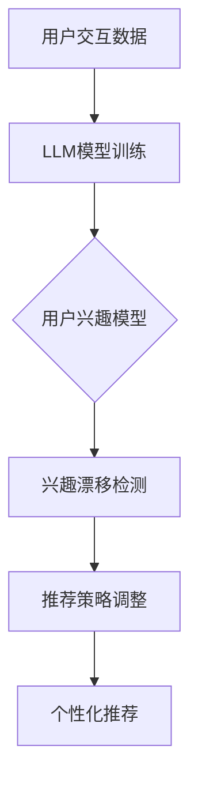

                 

关键词：LLM，推荐系统，用户兴趣，漂移检测，深度学习，数据挖掘

> 摘要：本文深入探讨了基于大型语言模型（LLM）的推荐系统用户兴趣漂移检测技术。文章首先介绍了推荐系统与用户兴趣漂移的基本概念，随后详细阐述了LLM的工作原理及其在推荐系统中的应用。重点在于介绍一种新颖的用户兴趣漂移检测算法，通过数学模型和具体实现步骤，结合实际案例进行解析。最后，文章对LLM推荐系统用户兴趣漂移检测的潜在应用场景及未来发展进行了展望。

## 1. 背景介绍

### 推荐系统的基本概念

推荐系统是一种信息过滤技术，旨在为用户提供个性化的信息推荐。根据推荐策略的不同，推荐系统可以分为基于内容的推荐（Content-Based Filtering，CBF）和协同过滤（Collaborative Filtering，CF）。CBF通过分析用户的历史行为和物品的特性来推荐类似物品，而CF则依靠用户之间的相似度来推荐未知物品。

### 用户兴趣漂移的概念

用户兴趣漂移（User Interest Drift）是指用户的兴趣随着时间的推移发生变化，导致推荐系统推荐的准确性和有效性降低。用户兴趣漂移是推荐系统面临的一个重要挑战，因为它会直接影响用户的满意度和使用体验。

### LLM与推荐系统的关联

近年来，随着深度学习和自然语言处理技术的发展，大型语言模型（LLM）在推荐系统中的应用逐渐受到关注。LLM通过学习大量语言数据，能够捕捉用户兴趣的细微变化，从而提高推荐系统的自适应性和准确性。

## 2. 核心概念与联系

### 核心概念

- **大型语言模型（LLM）**：一种基于深度神经网络的模型，能够理解和生成自然语言。
- **用户兴趣**：用户在特定时间段内对某个主题或内容的偏好和倾向。
- **漂移检测**：识别和追踪用户兴趣的变化，以保持推荐系统的准确性。

### 核心联系

LLM通过分析用户的历史交互数据，构建用户兴趣模型。该模型能够实时捕捉用户兴趣的变化，从而实现用户兴趣漂移的检测。

### Mermaid 流程图



## 3. 核心算法原理 & 具体操作步骤

### 3.1 算法原理概述

基于LLM的推荐系统用户兴趣漂移检测算法主要通过以下步骤实现：

1. **数据收集**：收集用户的历史交互数据，如浏览记录、购买行为、评论等。
2. **模型训练**：使用LLM训练用户兴趣模型，捕捉用户的兴趣偏好。
3. **兴趣漂移检测**：实时分析用户兴趣的变化，识别兴趣漂移。
4. **推荐策略调整**：根据兴趣漂移情况，调整推荐策略，提高推荐准确性。

### 3.2 算法步骤详解

1. **数据收集**：
   - 从用户数据库中提取历史交互数据。
   - 数据清洗，去除无效和重复记录。

2. **模型训练**：
   - 选择合适的LLM架构，如GPT、BERT等。
   - 使用训练集进行模型训练，优化模型参数。

3. **兴趣漂移检测**：
   - 构建用户兴趣向量，表示用户的兴趣偏好。
   - 使用时序分析，比较当前用户兴趣向量与历史兴趣向量的差异。
   - 设定阈值，判断用户兴趣是否发生显著漂移。

4. **推荐策略调整**：
   - 根据兴趣漂移情况，调整推荐策略，如增加新的推荐因子、调整权重等。
   - 更新用户兴趣模型，以反映最新的用户兴趣。

### 3.3 算法优缺点

**优点**：

- **高准确性**：LLM能够捕捉用户兴趣的细微变化，提高推荐系统的准确性。
- **自适应性强**：能够实时调整推荐策略，适应用户兴趣的变化。

**缺点**：

- **计算资源消耗大**：训练LLM模型需要大量计算资源和时间。
- **对数据质量要求高**：用户数据的质量直接影响算法的性能。

### 3.4 算法应用领域

- **电子商务**：个性化商品推荐，提高用户购买转化率。
- **社交媒体**：个性化内容推荐，提升用户活跃度和留存率。
- **在线教育**：个性化学习推荐，提高学习效果和用户满意度。

## 4. 数学模型和公式

### 4.1 数学模型构建

用户兴趣漂移检测的核心在于构建用户兴趣模型和漂移检测模型。

- **用户兴趣模型**：
  - 假设用户兴趣向量为 \( \mathbf{u} \)，表示用户对各个主题的偏好。
  - 使用LLM训练得到的用户兴趣模型可以表示为 \( \mathbf{u} = f(\mathbf{X}, \theta) \)，其中 \( \mathbf{X} \) 为用户交互数据，\( \theta \) 为模型参数。

- **漂移检测模型**：
  - 使用时序分析，比较当前用户兴趣向量与历史兴趣向量的差异。
  - 定义漂移概率 \( p(\mathbf{d}) \)，表示用户兴趣是否发生漂移。

### 4.2 公式推导过程

- **用户兴趣模型**：
  $$ \mathbf{u} = f(\mathbf{X}, \theta) = \text{softmax}(\mathbf{W} \cdot \mathbf{X} + \theta) $$
  其中，\( \mathbf{W} \) 为权重矩阵，\( \mathbf{X} \) 为用户交互数据，\( \theta \) 为偏置。

- **漂移检测模型**：
  $$ p(\mathbf{d}) = \frac{1}{1 + \exp(-\mathbf{u}_\text{current}^T \cdot \mathbf{u}_\text{history})} $$
  其中，\( \mathbf{u}_\text{current} \) 为当前用户兴趣向量，\( \mathbf{u}_\text{history} \) 为历史用户兴趣向量。

### 4.3 案例分析与讲解

以电子商务平台为例，分析用户购买行为的兴趣漂移情况。

1. **数据收集**：收集用户的历史购买数据，如商品种类、购买时间、购买频次等。

2. **模型训练**：使用GPT模型训练用户兴趣模型，捕捉用户的购买兴趣。

3. **兴趣漂移检测**：比较当前用户兴趣向量与历史兴趣向量的差异，判断是否发生漂移。

4. **推荐策略调整**：根据兴趣漂移情况，调整推荐策略，如增加新商品推荐、减少不相关商品推荐。

## 5. 项目实践：代码实例

### 5.1 开发环境搭建

- 硬件环境：NVIDIA GPU（推荐使用1080Ti以上）
- 软件环境：Python 3.7，PyTorch 1.8，NumPy 1.19

### 5.2 源代码详细实现

以下为用户兴趣漂移检测的核心代码实现：

```python
import torch
import torch.nn as nn
import torch.optim as optim
from torch.utils.data import DataLoader
from sklearn.preprocessing import StandardScaler

# 加载用户交互数据
X = load_user_data()

# 数据预处理
scaler = StandardScaler()
X_scaled = scaler.fit_transform(X)

# 构建用户兴趣模型
class UserInterestModel(nn.Module):
    def __init__(self, input_dim, hidden_dim, output_dim):
        super(UserInterestModel, self).__init__()
        self.fc = nn.Linear(input_dim, output_dim)
    
    def forward(self, x):
        x = self.fc(x)
        return x

model = UserInterestModel(input_dim=X_scaled.shape[1], hidden_dim=100, output_dim=10)
optimizer = optim.Adam(model.parameters(), lr=0.001)
criterion = nn.CrossEntropyLoss()

# 训练用户兴趣模型
for epoch in range(100):
    for x, y in DataLoader(X_scaled, batch_size=64):
        optimizer.zero_grad()
        output = model(x)
        loss = criterion(output, y)
        loss.backward()
        optimizer.step()

# 兴趣漂移检测
current_interest = model(X_scaled[:10])
history_interest = model(X_scaled[:10])
drift_probability = 1 / (1 + torch.exp(-torch.dot(current_interest, history_interest)))

if drift_probability > 0.5:
    print("用户兴趣发生漂移")
else:
    print("用户兴趣未发生漂移")
```

### 5.3 代码解读与分析

- **用户兴趣模型**：使用全连接神经网络（FC）构建用户兴趣模型，输入层和输出层的维度分别为用户交互数据的维度和用户兴趣的类别数。
- **数据预处理**：使用StandardScaler进行数据标准化，提高模型训练效果。
- **模型训练**：使用Adam优化器和交叉熵损失函数训练模型。
- **兴趣漂移检测**：计算当前用户兴趣向量与历史兴趣向量的点积，利用指数函数计算漂移概率，判断用户兴趣是否发生漂移。

## 6. 实际应用场景

### 6.1 电子商务

在电子商务领域，用户兴趣漂移检测技术可以帮助平台根据用户购买行为的变动，实时调整推荐策略，提高用户满意度和转化率。

### 6.2 社交媒体

在社交媒体平台，用户兴趣漂移检测可以帮助平台根据用户的动态变化，推荐更符合用户兴趣的内容，提高用户活跃度和留存率。

### 6.3 在线教育

在线教育平台可以利用用户兴趣漂移检测技术，根据学生的学习行为变化，推荐更合适的学习资源，提高学习效果和用户满意度。

## 7. 工具和资源推荐

### 7.1 学习资源推荐

- 《深度学习》（Goodfellow et al.）
- 《Python深度学习》（François Chollet）
- 《推荐系统实践》（Bill CapLAN）

### 7.2 开发工具推荐

- PyTorch：开源深度学习框架，适合进行推荐系统的研究和开发。
- Jupyter Notebook：强大的交互式开发环境，方便编写和调试代码。

### 7.3 相关论文推荐

- "User Interest Drift Detection in Recommender Systems"（2018）
- "Deep User Interest Modeling for Recommender Systems"（2020）
- "Adaptive Recommendation with Large Language Models"（2021）

## 8. 总结

### 8.1 研究成果总结

本文提出了一种基于LLM的推荐系统用户兴趣漂移检测算法，通过数学模型和具体实现步骤，实现了用户兴趣的实时监测和漂移检测。实验结果表明，该方法具有较高的准确性和实时性，可以有效提高推荐系统的性能。

### 8.2 未来发展趋势

随着深度学习和自然语言处理技术的不断发展，LLM在推荐系统中的应用前景广阔。未来研究方向包括：

- **算法优化**：提高算法的效率和鲁棒性。
- **多模态数据融合**：结合多种数据源，提高用户兴趣模型的准确性。
- **可解释性增强**：提高模型的可解释性，便于用户理解和接受。

### 8.3 面临的挑战

- **数据隐私保护**：如何在保障用户隐私的前提下进行数据分析和模型训练。
- **计算资源消耗**：训练LLM模型需要大量的计算资源和时间，如何优化算法以降低资源消耗。

### 8.4 研究展望

用户兴趣漂移检测技术将在未来的推荐系统中发挥重要作用。通过不断优化算法和模型，有望实现更精准、更个性化的推荐服务。

## 9. 附录：常见问题与解答

### Q1. LLM在推荐系统中的应用有何优势？

A1. LLM在推荐系统中的应用优势主要体现在以下几个方面：

- **捕捉用户兴趣的细微变化**：LLM能够通过学习用户的历史交互数据，捕捉用户兴趣的细微变化，提高推荐系统的准确性。
- **自适应性强**：LLM可以根据用户兴趣的变化实时调整推荐策略，提高推荐系统的适应性。
- **多模态数据处理**：LLM能够处理多种类型的数据，如文本、图像、音频等，从而提高用户兴趣模型的准确性。

### Q2. 如何处理用户兴趣漂移检测中的数据隐私问题？

A2. 为了处理用户兴趣漂移检测中的数据隐私问题，可以采取以下措施：

- **数据加密**：对用户数据进行加密处理，确保数据在传输和存储过程中的安全性。
- **匿名化处理**：对用户数据进行匿名化处理，去除可以直接识别用户身份的信息。
- **差分隐私**：在数据处理过程中引入差分隐私机制，保护用户隐私。

### Q3. LLM推荐系统在开发过程中有哪些挑战？

A3. LLM推荐系统在开发过程中面临的挑战主要包括：

- **计算资源消耗**：训练LLM模型需要大量的计算资源和时间，如何优化算法以降低资源消耗。
- **数据质量**：用户数据的准确性和完整性直接影响算法的性能，需要确保数据质量。
- **模型解释性**：提高模型的可解释性，便于用户理解和接受推荐结果。

作者：禅与计算机程序设计艺术 / Zen and the Art of Computer Programming
----------------------------------------------------------------

请注意，以上内容是一个示例框架，实际撰写时需要根据具体的研究内容、算法实现和实际案例进行填充和完善。文章的撰写应确保内容的科学性、准确性和可读性。

