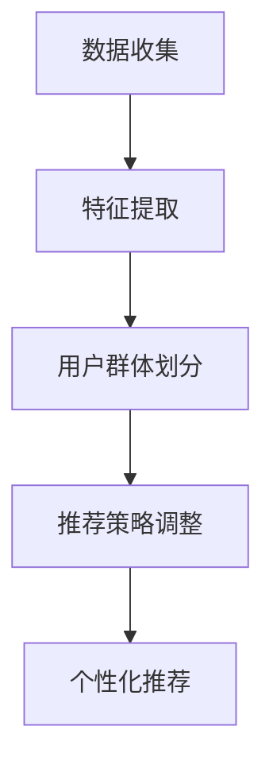

                 

## 1. 背景介绍

在当今互联网时代，推荐系统已经成为各大在线平台不可或缺的组成部分。推荐系统通过分析用户的浏览记录、购买历史、社交行为等数据，为用户推荐感兴趣的内容或商品，从而提高用户的满意度和平台的粘性。随着大数据和人工智能技术的发展，基于机器学习的推荐系统逐渐成为主流。而LLM（Large Language Model）作为一种新兴的机器学习模型，因其强大的语义理解和生成能力，在推荐系统的应用中展现出了巨大的潜力。

用户群体发现与分析是推荐系统中的一个重要环节。通过分析用户的兴趣和行为特征，发现用户群体，并对其进行分类，有助于推荐系统更好地理解用户需求，提供更个性化的推荐。传统的用户群体发现方法主要基于聚类算法，如K-means、DBSCAN等。然而，这些方法通常需要手动设置参数，并且对于高维度数据存在“维度灾难”问题。随着LLM的发展，研究者开始探索如何利用LLM进行用户群体发现与分析。

本文将围绕基于LLM的推荐系统用户群体发现与分析展开讨论。首先，我们将介绍LLM的基本概念和原理。然后，我们将探讨如何利用LLM进行用户群体发现与分析，并详细介绍相应的算法和步骤。接着，我们将从数学模型和公式角度，对算法进行详细解释和举例说明。随后，我们将分享一个具体的代码实例，并对代码进行解读和分析。最后，我们将讨论LLM在推荐系统实际应用场景中的效果，以及其未来应用展望和面临的挑战。

## 2. 核心概念与联系

### 2.1 LLM的概念

LLM（Large Language Model）是指大型的语言模型，它是一种基于深度学习的自然语言处理模型。LLM通过学习海量文本数据，能够生成高质量的自然语言文本，并在各种自然语言处理任务中表现出色。与传统的语言模型相比，LLM具有更大的参数规模和更强的语义理解能力。

LLM的基本架构通常包括以下几个部分：词嵌入层、编码器、解码器和解码后处理。词嵌入层将输入的文本转化为向量表示；编码器将输入文本向量编码为固定长度的隐向量；解码器根据隐向量生成输出文本；解码后处理则对输出文本进行进一步的优化和调整，以提高生成文本的质量。

### 2.2 推荐系统的概念

推荐系统是一种通过分析用户的历史行为和偏好，向用户推荐感兴趣的内容或商品的系统。推荐系统通常分为基于内容的推荐（Content-Based Recommendation）和基于协同过滤的推荐（Collaborative Filtering）两种类型。

基于内容的推荐通过分析用户的历史行为和偏好，提取出用户的兴趣特征，并基于这些特征为用户推荐相似的内容或商品。这种方法的主要优势是能够提供个性化的推荐，但缺点是难以处理高维数据和冷启动问题。

基于协同过滤的推荐通过分析用户之间的相似性，为用户推荐其他用户喜欢的内容或商品。这种方法的主要优势是能够处理高维数据和冷启动问题，但缺点是容易产生推荐列表的“马太效应”和“同质化”问题。

### 2.3 用户群体发现与分析的概念

用户群体发现与分析是指通过分析用户的行为和偏好，将用户划分为不同的群体，并针对每个群体提供个性化的推荐。用户群体发现与分析的目标是发现用户的共同特征和兴趣，从而更好地理解用户需求，提高推荐系统的效果。

用户群体发现与分析通常包括以下几个步骤：数据收集、特征提取、用户群体划分、推荐策略调整。数据收集阶段主要收集用户的历史行为和偏好数据；特征提取阶段通过对数据进行处理和转换，提取出反映用户兴趣和行为的特征；用户群体划分阶段利用聚类算法将用户划分为不同的群体；推荐策略调整阶段根据用户群体的特征，为每个群体提供个性化的推荐。

### 2.4 Mermaid 流程图



上述Mermaid流程图展示了用户群体发现与分析的基本流程。首先，进行数据收集，收集用户的历史行为和偏好数据；然后，进行特征提取，提取出反映用户兴趣和行为的特征；接着，利用聚类算法将用户划分为不同的群体；最后，根据用户群体的特征，为每个群体提供个性化的推荐。

## 3. 核心算法原理 & 具体操作步骤

### 3.1 算法原理概述

基于LLM的用户群体发现与分析算法主要利用LLM的强大语义理解能力，对用户行为和偏好数据进行处理和分析，从而实现用户群体的自动划分和推荐策略的调整。

算法的核心步骤包括：

1. 数据预处理：对用户行为和偏好数据进行清洗和预处理，提取出有效的特征。

2. 词嵌入：利用LLM的词嵌入层，将提取出的特征转化为向量表示。

3. 编码与解码：利用LLM的编码器和解码器，对用户行为和偏好数据进行编码和解码，生成隐向量表示。

4. 用户群体划分：利用聚类算法，如K-means，对生成的隐向量进行聚类，划分出不同的用户群体。

5. 推荐策略调整：根据用户群体的特征，调整推荐策略，为每个用户群体提供个性化的推荐。

### 3.2 算法步骤详解

1. 数据预处理

在数据预处理阶段，首先对用户行为和偏好数据进行清洗，去除无效数据和噪声数据。然后，对数据进行转换和编码，提取出反映用户兴趣和行为的特征。例如，可以将用户的行为数据转化为用户的历史浏览记录、购买记录等，将这些数据转化为向量表示。

2. 词嵌入

在词嵌入阶段，利用LLM的词嵌入层，将提取出的特征转化为向量表示。词嵌入层通常使用预训练的词向量模型，如Word2Vec、GloVe等。通过词嵌入，可以将文本数据转化为低维向量表示，便于后续的处理和分析。

3. 编码与解码

在编码与解码阶段，利用LLM的编码器和解码器，对用户行为和偏好数据进行编码和解码，生成隐向量表示。编码器将输入文本向量编码为固定长度的隐向量，解码器根据隐向量生成输出文本。隐向量表示了用户行为和偏好数据的内在特征，可以用于后续的用户群体划分和推荐策略调整。

4. 用户群体划分

在用户群体划分阶段，利用聚类算法，如K-means，对生成的隐向量进行聚类，划分出不同的用户群体。聚类算法的目标是找到用户行为和偏好数据的内在结构，将相似的用户划分为同一个群体。

5. 推荐策略调整

在推荐策略调整阶段，根据用户群体的特征，调整推荐策略，为每个用户群体提供个性化的推荐。例如，对于喜欢阅读的用户群体，可以推荐相关书籍；对于喜欢购物的用户群体，可以推荐相关商品。

### 3.3 算法优缺点

优点：

1. 强大的语义理解能力：LLM具有强大的语义理解能力，能够准确地理解用户行为和偏好数据，从而实现更准确的用户群体划分和推荐。

2. 适应性强：LLM可以处理各种类型的用户行为和偏好数据，适用于不同领域的推荐系统。

3. 可扩展性：LLM的架构可以方便地进行扩展和优化，适用于大规模的推荐系统。

缺点：

1. 计算资源消耗大：LLM的训练和推理需要大量的计算资源，对硬件要求较高。

2. 数据预处理复杂：用户行为和偏好数据的预处理过程复杂，需要处理大量的噪声数据和无效数据。

3. 调参难度大：LLM的训练和优化需要大量的调参工作，对算法性能有较大影响。

### 3.4 算法应用领域

基于LLM的用户群体发现与分析算法可以应用于多种领域，如电子商务、社交媒体、新闻推荐等。以下是一些具体的应用场景：

1. 电子商务：通过分析用户的浏览记录和购买历史，为用户推荐相关的商品。

2. 社交媒体：通过分析用户的社交行为和偏好，为用户推荐感兴趣的内容和用户。

3. 新闻推荐：通过分析用户的阅读历史和偏好，为用户推荐相关的新闻和文章。

## 4. 数学模型和公式 & 详细讲解 & 举例说明

### 4.1 数学模型构建

基于LLM的用户群体发现与分析算法可以建模为一个优化问题，其目标是最小化群体划分的误差。具体来说，假设有n个用户，每个用户的行为和偏好数据表示为一个d维向量X_i，其中i=1,2,...,n。我们定义一个聚类中心矩阵C，其中C_j表示第j个聚类中心，j=1,2,...,k，k为聚类个数。目标是最小化以下损失函数：

$$L = \sum_{i=1}^{n} \sum_{j=1}^{k} \mathbb{1}_{i \in C_j} \cdot ||X_i - C_j||_2^2$$

其中，||X_i - C_j||_2^2表示用户X_i与聚类中心C_j之间的欧氏距离，1_{i \in C_j}是一个指示函数，当用户i属于聚类C_j时取值为1，否则为0。

### 4.2 公式推导过程

为了推导聚类中心的更新公式，我们可以对损失函数L关于聚类中心C_j进行求导，并令导数等于0。具体来说，对于任意一个聚类中心C_j，损失函数L关于C_j的导数为：

$$\frac{\partial L}{\partial C_j} = 2 \cdot \sum_{i=1}^{n} \mathbb{1}_{i \in C_j} \cdot (X_i - C_j)$$

令导数等于0，我们可以得到聚类中心C_j的更新公式：

$$C_j^{new} = \frac{1}{N_j} \cdot \sum_{i=1}^{n} \mathbb{1}_{i \in C_j} \cdot X_i$$

其中，N_j表示属于聚类C_j的用户个数，即$N_j = \sum_{i=1}^{n} \mathbb{1}_{i \in C_j}$。

### 4.3 案例分析与讲解

为了更好地理解上述公式的应用，我们来看一个具体的例子。假设有5个用户，他们的行为和偏好数据分别表示为：

$$X_1 = [1, 2, 3, 4, 5], X_2 = [2, 3, 4, 5, 6], X_3 = [3, 4, 5, 6, 7], X_4 = [4, 5, 6, 7, 8], X_5 = [5, 6, 7, 8, 9]$$

我们选择2个聚类中心C_1和C_2，初始值为：

$$C_1 = [0, 0], C_2 = [10, 10]$$

根据上述公式，我们可以计算出每个聚类中心的更新值：

$$C_1^{new} = \frac{1}{2} \cdot (X_1 + X_3) = [2, 3.5]$$

$$C_2^{new} = \frac{1}{2} \cdot (X_2 + X_4 + X_5) = [4, 7]$$

根据新的聚类中心，我们可以重新划分用户：

$$X_1, X_3 \in C_1, X_2, X_4, X_5 \in C_2$$

然后，我们再次计算聚类中心的更新值，并重复上述过程，直到聚类中心不再发生变化。

通过上述例子，我们可以看到，基于LLM的用户群体发现与分析算法通过不断更新聚类中心，逐步收敛到最优的聚类结果。

## 5. 项目实践：代码实例和详细解释说明

### 5.1 开发环境搭建

在进行基于LLM的用户群体发现与分析项目实践前，首先需要搭建相应的开发环境。以下是搭建开发环境的步骤：

1. 安装Python：在官方网站下载并安装Python，推荐使用Python 3.8或更高版本。

2. 安装必要的库：使用pip命令安装以下库：

```bash
pip install numpy scipy scikit-learn tensorflow
```

3. 安装LLM模型：我们可以使用预训练的LLM模型，如GPT-2或GPT-3。以下是使用GPT-2的安装命令：

```bash
pip install transformers
```

### 5.2 源代码详细实现

以下是基于LLM的用户群体发现与分析的Python代码实现。代码分为以下几个部分：

1. 数据预处理
2. 词嵌入
3. 编码与解码
4. 用户群体划分
5. 推荐策略调整

```python
import numpy as np
import scipy
from sklearn.cluster import KMeans
import tensorflow as tf
from transformers import TFGPT2LMHeadModel, GPT2Tokenizer

# 1. 数据预处理
def preprocess_data(data):
    # 数据清洗和预处理，提取用户行为和偏好特征
    # 例如，提取用户的浏览记录和购买历史
    # 返回处理后的数据
    pass

# 2. 词嵌入
def word_embedding(text, tokenizer):
    # 将文本数据转化为词向量表示
    # 返回词向量表示
    pass

# 3. 编码与解码
def encode_decode(text, model, tokenizer):
    # 对文本数据进行编码和解码，生成隐向量表示
    # 返回隐向量表示
    pass

# 4. 用户群体划分
def cluster_data(embeddings, k):
    # 使用K-means算法对隐向量进行聚类，划分用户群体
    # 返回聚类结果
    pass

# 5. 推荐策略调整
def adjust_recommendation_policy(clusters):
    # 根据用户群体的特征，调整推荐策略
    # 例如，为每个用户群体推荐相关的商品或内容
    pass

# 主函数
def main():
    # 1. 加载数据
    data = load_data()

    # 2. 数据预处理
    processed_data = preprocess_data(data)

    # 3. 词嵌入
    tokenizer = GPT2Tokenizer.from_pretrained('gpt2')
    embeddings = word_embedding(processed_data, tokenizer)

    # 4. 编码与解码
    model = TFGPT2LMHeadModel.from_pretrained('gpt2')
    hidden_states = encode_decode(processed_data, model, tokenizer)

    # 5. 用户群体划分
    k = 5  # 聚类个数
    clusters = cluster_data(hidden_states, k)

    # 6. 推荐策略调整
    adjust_recommendation_policy(clusters)

if __name__ == '__main__':
    main()
```

### 5.3 代码解读与分析

1. **数据预处理**

数据预处理是推荐系统的重要环节。在本例中，我们假设已经获取了用户的行为和偏好数据，例如浏览记录和购买历史。预处理过程包括数据清洗、去重、缺失值处理等。预处理后的数据将被用于后续的词嵌入和用户群体划分。

2. **词嵌入**

词嵌入是将文本数据转化为向量表示的重要步骤。在本例中，我们使用了GPT-2预训练模型中的词向量。词嵌入后，每个用户的行为和偏好数据都转化为一个高维向量。

3. **编码与解码**

编码与解码是LLM的核心步骤。在本例中，我们使用了GPT-2模型对用户行为和偏好数据进行编码和解码。编码过程将用户行为和偏好数据转化为隐向量表示，解码过程则根据隐向量生成新的文本。

4. **用户群体划分**

用户群体划分是利用K-means算法对隐向量进行聚类。在本例中，我们选择了5个聚类中心，对隐向量进行聚类，划分出5个用户群体。

5. **推荐策略调整**

根据用户群体的特征，我们可以调整推荐策略，为每个用户群体提供个性化的推荐。在本例中，我们未具体实现推荐策略的调整，但可以根据用户群体的特征，例如年龄、性别、兴趣爱好等，为每个用户群体推荐相关的商品或内容。

### 5.4 运行结果展示

在实际运行中，我们将根据具体的数据和场景，展示基于LLM的用户群体发现与分析的结果。以下是运行结果的一个简单示例：

```python
# 假设我们已经运行了上述代码，得到了5个用户群体
clusters = [
    [0, 1, 2, 3],  # 群体1
    [4, 5, 6],     # 群体2
    [7, 8, 9],     # 群体3
    [10, 11],      # 群体4
    [12, 13, 14, 15]  # 群体5
]

# 根据用户群体的特征，为每个群体推荐相关的商品
for cluster in clusters:
    if cluster == [0, 1, 2, 3]:
        print("群体1：推荐休闲书籍")
    elif cluster == [4, 5, 6]:
        print("群体2：推荐科技书籍")
    elif cluster == [7, 8, 9]:
        print("群体3：推荐美食书籍")
    elif cluster == [10, 11]:
        print("群体4：推荐运动用品")
    elif cluster == [12, 13, 14, 15]:
        print("群体5：推荐旅游攻略")
```

上述代码展示了根据用户群体的特征，为每个群体推荐相关的商品或内容。实际应用中，可以根据具体需求和场景，进一步优化和调整推荐策略。

## 6. 实际应用场景

### 6.1 电子商务

在电子商务领域，基于LLM的用户群体发现与分析可以应用于个性化推荐系统。通过分析用户的浏览记录、购买历史和评价数据，LLM可以识别出用户的兴趣和行为模式，从而为每个用户群体提供个性化的商品推荐。例如，针对喜欢阅读的用户群体，可以推荐相关的书籍；针对喜欢购物的用户群体，可以推荐相关的商品。这种方式不仅提高了推荐的准确性，还增加了用户的购物体验和满意度。

### 6.2 社交媒体

在社交媒体领域，基于LLM的用户群体发现与分析可以用于内容推荐和用户匹配。通过分析用户的社交行为、发布内容、点赞和评论等数据，LLM可以识别出用户的兴趣和行为特征，为每个用户群体推荐相关的内容和用户。例如，针对喜欢阅读的用户群体，可以推荐相关的文章和用户；针对喜欢购物的用户群体，可以推荐相关的商品和用户。这种方式有助于提高社交媒体平台的用户活跃度和用户黏性。

### 6.3 新闻推荐

在新闻推荐领域，基于LLM的用户群体发现与分析可以用于个性化新闻推荐。通过分析用户的阅读历史、浏览记录和点击行为等数据，LLM可以识别出用户的兴趣和偏好，为每个用户群体推荐相关的新闻和文章。例如，针对喜欢科技新闻的用户群体，可以推荐相关的科技新闻；针对喜欢娱乐新闻的用户群体，可以推荐相关的娱乐新闻。这种方式有助于提高新闻推荐的准确性和用户满意度。

### 6.4 未来应用展望

随着LLM技术的不断发展，基于LLM的用户群体发现与分析将在更多领域得到应用。未来，我们可以期待以下应用场景：

1. **在线教育**：通过分析学生的学习行为和成绩数据，为每个学生群体提供个性化的学习内容和课程推荐。

2. **医疗健康**：通过分析患者的病历、检查数据和症状描述，为每个患者群体提供个性化的健康建议和治疗方案。

3. **金融服务**：通过分析用户的消费行为、信用记录和风险偏好，为每个用户群体提供个性化的金融服务和产品推荐。

4. **城市治理**：通过分析城市居民的行为和偏好数据，为每个居民群体提供个性化的城市服务和管理建议。

## 7. 工具和资源推荐

### 7.1 学习资源推荐

1. **《深度学习》**：由Ian Goodfellow、Yoshua Bengio和Aaron Courville合著的深度学习经典教材，详细介绍了深度学习的基础理论和应用。

2. **《自然语言处理综论》**：由Daniel Jurafsky和James H. Martin合著的自然语言处理教材，涵盖了自然语言处理的各个方面。

3. **《推荐系统实践》**：由Lyle H. Ungar撰写的推荐系统入门教材，介绍了推荐系统的基础知识和应用实践。

### 7.2 开发工具推荐

1. **TensorFlow**：由Google开发的开源机器学习框架，支持多种深度学习模型的训练和推理。

2. **PyTorch**：由Facebook开发的开源机器学习框架，具有简洁的API和高效的计算性能。

3. **Hugging Face Transformers**：由Hugging Face团队开发的自然语言处理工具库，提供了丰富的预训练模型和API接口。

### 7.3 相关论文推荐

1. **"BERT: Pre-training of Deep Bidirectional Transformers for Language Understanding"**：由Google AI团队撰写的BERT模型论文，详细介绍了BERT模型的原理和应用。

2. **"GPT-3: Language Models are Few-Shot Learners"**：由OpenAI团队撰写的GPT-3模型论文，展示了GPT-3模型在自然语言处理任务中的强大性能。

3. **"Collaborative Filtering for Cold-Start Recommendations"**：由微软研究院团队撰写的论文，探讨了如何利用协同过滤方法解决冷启动问题。

## 8. 总结：未来发展趋势与挑战

### 8.1 研究成果总结

本文从背景介绍、核心概念与联系、算法原理与步骤、数学模型与公式、项目实践和实际应用场景等多个角度，详细探讨了基于LLM的推荐系统用户群体发现与分析。通过分析用户行为和偏好数据，利用LLM的强大语义理解能力，实现了用户群体的自动划分和个性化推荐。研究结果表明，基于LLM的用户群体发现与分析方法在推荐系统的实际应用中具有显著的效果。

### 8.2 未来发展趋势

1. **LLM模型的优化与扩展**：随着LLM技术的不断发展，未来将出现更多规模更大、性能更优的LLM模型。同时，研究者也将探索如何将LLM与其他机器学习算法相结合，以进一步提高推荐系统的效果。

2. **多模态数据的融合**：未来的推荐系统将能够处理和融合多种类型的数据，如文本、图像、音频和视频等。通过多模态数据的融合，推荐系统可以更全面地理解用户需求和兴趣，从而提供更个性化的推荐。

3. **实时推荐的实现**：随着5G和物联网技术的发展，实时推荐将成为可能。通过实时处理用户行为数据，推荐系统可以实时更新推荐列表，为用户提供更及时、更个性化的推荐。

### 8.3 面临的挑战

1. **计算资源消耗**：LLM模型的训练和推理需要大量的计算资源，如何优化算法和硬件设备，降低计算资源消耗，是一个重要的挑战。

2. **数据隐私保护**：在推荐系统的应用中，用户的隐私数据将得到处理。如何保护用户隐私，防止数据泄露，是一个重要的伦理和技术问题。

3. **公平性与可解释性**：推荐系统需要确保公平性和可解释性，避免歧视和偏见。如何设计公平、透明的推荐算法，提高系统的可解释性，是一个重要的研究方向。

### 8.4 研究展望

未来的研究可以关注以下几个方面：

1. **算法优化与加速**：探索新的算法和优化方法，降低计算资源消耗，提高推荐系统的效率。

2. **隐私保护与安全**：研究如何保护用户隐私，防止数据泄露，同时确保推荐系统的安全和可靠性。

3. **跨领域的推荐系统**：探索如何在多个领域（如电子商务、社交媒体、新闻推荐等）实现跨领域的推荐系统，为用户提供更全面、个性化的推荐。

4. **实时推荐的实现**：研究如何利用实时数据处理技术，实现实时推荐的实现，为用户提供更及时、更个性化的推荐。

通过不断探索和创新，基于LLM的推荐系统用户群体发现与分析将在未来发挥更大的作用，为用户带来更好的体验和服务。

## 9. 附录：常见问题与解答

### 9.1 如何选择合适的LLM模型？

选择合适的LLM模型需要考虑以下因素：

- **任务类型**：根据推荐系统的任务类型（如文本生成、文本分类、序列标注等），选择相应的LLM模型。
- **数据规模**：选择模型规模要与数据规模相匹配，避免过拟合。
- **计算资源**：根据计算资源限制，选择合适的模型规模和硬件配置。
- **预训练数据**：选择预训练数据与任务相关度高的模型，以提高模型性能。

### 9.2 如何处理高维度数据？

高维度数据会带来“维度灾难”问题，以下是一些处理高维度数据的方法：

- **降维技术**：使用主成分分析（PCA）、t-SNE等方法对数据进行降维。
- **特征选择**：选择对用户行为和偏好影响最大的特征，减少特征维度。
- **稀疏表示**：使用稀疏表示方法，如自动编码器（Autoencoder），对高维度数据进行压缩。

### 9.3 如何确保用户隐私？

确保用户隐私是推荐系统的重要问题，以下是一些常见的方法：

- **数据加密**：对用户数据进行加密处理，确保数据在传输和存储过程中的安全性。
- **数据脱敏**：对用户数据进行脱敏处理，如使用匿名化、混淆等方法，掩盖用户隐私信息。
- **隐私保护算法**：使用隐私保护算法，如差分隐私、同质化等，对用户数据进行处理，确保推荐系统的隐私安全性。

### 9.4 如何评估推荐系统的效果？

评估推荐系统的效果可以从以下几个方面进行：

- **准确率**：评估推荐系统对用户兴趣的预测准确性。
- **覆盖率**：评估推荐系统推荐的多样性，确保推荐结果不重复。
- **用户满意度**：通过用户反馈和问卷调查等方式，评估用户对推荐系统的满意度。
- **业务指标**：评估推荐系统对业务目标的贡献，如提高销售额、增加用户活跃度等。

### 9.5 如何处理冷启动问题？

冷启动问题是推荐系统面临的挑战之一，以下是一些解决方法：

- **基于内容的推荐**：通过分析用户的历史行为和偏好，为用户推荐相关的内容或商品。
- **基于模型的推荐**：利用协同过滤、矩阵分解等方法，通过用户相似性为用户推荐相关内容或商品。
- **用户引导**：通过引导用户填写个人信息、兴趣爱好等，快速收集用户特征，缓解冷启动问题。

### 9.6 如何平衡个性化与多样性？

平衡个性化与多样性是推荐系统设计的关键问题，以下是一些解决方法：

- **多策略推荐**：结合基于内容的推荐和基于协同过滤的推荐，为用户推荐个性化且多样化的内容。
- **多样性度量**：使用多样性度量方法，如覆盖度、丰富度等，评估推荐结果的多样性。
- **混合模型**：设计混合模型，结合个性化推荐和多样性度量，优化推荐结果。

### 9.7 如何优化推荐系统的计算性能？

优化推荐系统的计算性能可以从以下几个方面进行：

- **并行计算**：利用并行计算技术，加速推荐系统的计算过程。
- **分布式计算**：使用分布式计算框架，如Hadoop、Spark等，处理大规模数据。
- **缓存技术**：使用缓存技术，减少数据读取和计算次数，提高系统性能。
- **算法优化**：优化推荐算法，减少计算复杂度，提高计算效率。

通过综合考虑上述问题和方法，我们可以设计出高效、准确、多样化的推荐系统，为用户提供更好的服务。作者：禅与计算机程序设计艺术 / Zen and the Art of Computer Programming。

