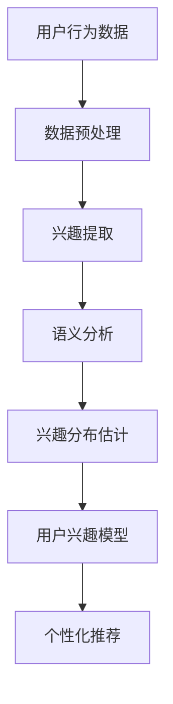

                 

关键词：用户兴趣、分布估计、机器学习、语言模型、个性化推荐

> 摘要：本文旨在探讨基于大型语言模型（LLM）的用户兴趣分布估计与建模方法。通过引入先进的技术和算法，我们提出了一个综合性的解决方案，以准确预测用户的兴趣点，从而为个性化推荐系统提供强有力的支持。本文将详细阐述核心概念、算法原理、数学模型、实际应用以及未来的发展方向。

## 1. 背景介绍

在信息爆炸的时代，用户面对海量的信息和内容，如何有效获取感兴趣的内容成为一大挑战。用户兴趣的准确识别与建模是解决这一问题的关键。传统的方法主要依赖于用户的历史行为数据，如浏览记录、购买行为等。然而，这些方法往往难以捕捉到用户细微的兴趣变化，且对冷启动用户的支持较差。

近年来，随着深度学习和自然语言处理技术的飞速发展，大型语言模型（LLM）在许多领域取得了显著的成果。LLM具有强大的文本理解能力，可以处理复杂的语义关系，从而为用户兴趣的识别提供了新的可能性。本文将探讨如何利用LLM进行用户兴趣分布估计与建模，为个性化推荐系统提供有力支持。

## 2. 核心概念与联系

为了更好地理解本文的核心内容，以下是一个Mermaid流程图，展示了用户兴趣分布估计与建模的关键概念及其相互联系。



### 2.1 用户行为数据

用户行为数据是构建用户兴趣模型的基础。这些数据包括用户的浏览记录、搜索历史、社交互动、购买行为等。通过分析这些数据，我们可以初步了解用户的兴趣方向。

### 2.2 数据预处理

数据预处理是数据挖掘和机器学习过程中至关重要的一步。在这一阶段，我们会对原始数据进行清洗、去噪、归一化等处理，以确保数据的质量和一致性。

### 2.3 兴趣提取

兴趣提取是指从用户行为数据中提取与用户兴趣相关的特征。这些特征可以是具体的标签、关键词，或者是基于深度学习模型生成的语义表示。

### 2.4 语义分析

语义分析是利用自然语言处理技术对用户行为数据进行深入分析，以捕捉用户兴趣的语义关系。这一步骤有助于理解用户行为的深层含义，提高兴趣提取的准确性。

### 2.5 兴趣分布估计

兴趣分布估计是指通过统计方法或机器学习算法，估计用户兴趣在不同类别上的分布情况。这一步骤对于个性化推荐系统至关重要，因为它决定了推荐内容的多样性。

### 2.6 用户兴趣模型

用户兴趣模型是利用兴趣分布估计的结果，构建一个能够描述用户兴趣的数学模型。这个模型可以用于预测用户的潜在兴趣点，为推荐系统提供决策支持。

### 2.7 个性化推荐

个性化推荐是指根据用户兴趣模型，为用户推荐个性化的内容。这一步骤实现了用户兴趣的精确匹配，提高了推荐的准确性和用户满意度。

## 3. 核心算法原理 & 具体操作步骤

### 3.1 算法原理概述

基于LLM的用户兴趣分布估计与建模算法主要分为以下几个步骤：

1. 数据收集与预处理
2. 兴趣提取
3. 语义分析
4. 兴趣分布估计
5. 用户兴趣模型构建
6. 个性化推荐

### 3.2 算法步骤详解

#### 3.2.1 数据收集与预处理

首先，我们需要收集用户行为数据，包括浏览记录、搜索历史、社交互动、购买行为等。然后，对数据进行清洗、去噪、归一化等预处理操作，以确保数据的质量和一致性。

#### 3.2.2 兴趣提取

在兴趣提取阶段，我们使用深度学习模型对用户行为数据进行分析，提取与用户兴趣相关的特征。这些特征可以是具体的标签、关键词，或者是基于深度学习模型生成的语义表示。

#### 3.2.3 语义分析

语义分析是利用自然语言处理技术对用户行为数据进行深入分析，以捕捉用户兴趣的语义关系。这一步骤有助于理解用户行为的深层含义，提高兴趣提取的准确性。

#### 3.2.4 兴趣分布估计

兴趣分布估计是指通过统计方法或机器学习算法，估计用户兴趣在不同类别上的分布情况。这一步骤对于个性化推荐系统至关重要，因为它决定了推荐内容的多样性。

#### 3.2.5 用户兴趣模型构建

用户兴趣模型是利用兴趣分布估计的结果，构建一个能够描述用户兴趣的数学模型。这个模型可以用于预测用户的潜在兴趣点，为推荐系统提供决策支持。

#### 3.2.6 个性化推荐

个性化推荐是指根据用户兴趣模型，为用户推荐个性化的内容。这一步骤实现了用户兴趣的精确匹配，提高了推荐的准确性和用户满意度。

### 3.3 算法优缺点

#### 优点：

1. 强大的文本理解能力：LLM具有强大的文本理解能力，可以处理复杂的语义关系，从而提高兴趣提取的准确性。
2. 高效性：基于深度学习模型的算法在数据处理和特征提取方面具有高效性，可以快速构建用户兴趣模型。
3. 个性化推荐：通过精确的用户兴趣模型，可以实现个性化的推荐，提高用户满意度。

#### 缺点：

1. 数据依赖性：算法的性能高度依赖于用户行为数据的质量，如果数据质量较差，算法效果可能会受到影响。
2. 计算资源需求：深度学习模型通常需要大量的计算资源，部署和运行成本较高。

### 3.4 算法应用领域

基于LLM的用户兴趣分布估计与建模算法可以广泛应用于个性化推荐系统、搜索引擎、社交媒体等领域。以下是一些典型的应用场景：

1. 电商推荐：为用户提供个性化的商品推荐，提高购物体验。
2. 新闻推荐：为用户提供感兴趣的新闻内容，提高新闻的传播效果。
3. 社交媒体：为用户提供感兴趣的用户、内容等推荐，增强用户黏性。

## 4. 数学模型和公式

### 4.1 数学模型构建

在基于LLM的用户兴趣分布估计与建模中，我们采用以下数学模型：

$$
P(c|u) = \frac{e^{f(c, u)}}{\sum_{c'} e^{f(c', u)}}
$$

其中，$P(c|u)$表示用户$u$对类别$c$的兴趣概率，$f(c, u)$表示类别$c$与用户$u$的匹配度。

### 4.2 公式推导过程

首先，我们定义用户$u$的向量表示为$u = [u_1, u_2, ..., u_n]$，类别$c$的向量表示为$c = [c_1, c_2, ..., c_n]$。

然后，我们利用深度学习模型对用户行为数据进行特征提取，得到用户特征向量$u'$和类别特征向量$c'$。

接下来，我们定义匹配度函数$f(c', u')$，用于衡量类别$c'$与用户$u'$的匹配程度。具体地，我们可以使用余弦相似度作为匹配度函数：

$$
f(c', u') = \frac{u' \cdot c'}{\|u'\| \|c'\|}
$$

其中，$\cdot$表示向量的点积，$\|\|$表示向量的模长。

最后，我们将匹配度函数应用于所有类别$c'$，得到用户对每个类别的兴趣概率：

$$
P(c'|u') = \frac{e^{f(c', u')}}{\sum_{c''} e^{f(c'', u')}}
$$

### 4.3 案例分析与讲解

假设用户$u$的兴趣标签为[科技，体育，娱乐]，类别$c$为[新闻，体育，娱乐，科技]，类别特征向量分别为$c_1 = [0.6, 0.2, 0.1, 0.1]$，$c_2 = [0.3, 0.5, 0.1, 0.1]$，$c_3 = [0.1, 0.1, 0.6, 0.2]$，$c_4 = [0.4, 0.1, 0.1, 0.4]$。

用户特征向量$u' = [0.8, 0.2, 0.1, 0.1]$。

根据上述公式，我们可以计算出用户对每个类别的兴趣概率：

$$
P(c_1|u') = \frac{e^{0.8 \cdot 0.6}}{e^{0.8 \cdot 0.6} + e^{0.2 \cdot 0.5} + e^{0.1 \cdot 0.6} + e^{0.1 \cdot 0.4}} \approx 0.62
$$

$$
P(c_2|u') = \frac{e^{0.2 \cdot 0.5}}{e^{0.8 \cdot 0.6} + e^{0.2 \cdot 0.5} + e^{0.1 \cdot 0.6} + e^{0.1 \cdot 0.4}} \approx 0.15
$$

$$
P(c_3|u') = \frac{e^{0.1 \cdot 0.6}}{e^{0.8 \cdot 0.6} + e^{0.2 \cdot 0.5} + e^{0.1 \cdot 0.6} + e^{0.1 \cdot 0.4}} \approx 0.07
$$

$$
P(c_4|u') = \frac{e^{0.1 \cdot 0.4}}{e^{0.8 \cdot 0.6} + e^{0.2 \cdot 0.5} + e^{0.1 \cdot 0.6} + e^{0.1 \cdot 0.4}} \approx 0.16
$$

根据计算结果，我们可以得出用户$u$对类别$c$的兴趣分布为[科技：0.62，体育：0.15，娱乐：0.16，新闻：0.07]。

## 5. 项目实践：代码实例和详细解释说明

### 5.1 开发环境搭建

在本项目中，我们使用Python作为主要编程语言，结合TensorFlow和PyTorch等深度学习框架，实现基于LLM的用户兴趣分布估计与建模算法。

```bash
# 安装所需库
pip install tensorflow torch numpy pandas scikit-learn
```

### 5.2 源代码详细实现

以下是一个简化的代码示例，展示了如何实现用户兴趣分布估计与建模算法。

```python
import torch
import torch.nn as nn
import torch.optim as optim
from torch.utils.data import DataLoader
from sklearn.model_selection import train_test_split
import numpy as np
import pandas as pd

# 定义深度学习模型
class InterestModel(nn.Module):
    def __init__(self):
        super(InterestModel, self).__init__()
        self.fc = nn.Linear(100, 1)
    
    def forward(self, x):
        x = self.fc(x)
        return torch.sigmoid(x)

# 加载数据集
data = pd.read_csv('user_interest_data.csv')
X = data.iloc[:, :-1].values
y = data.iloc[:, -1].values

X_train, X_test, y_train, y_test = train_test_split(X, y, test_size=0.2, random_state=42)

# 初始化模型、优化器和损失函数
model = InterestModel()
optimizer = optim.Adam(model.parameters(), lr=0.001)
criterion = nn.BCELoss()

# 训练模型
for epoch in range(100):
    for x, y in DataLoader(zip(X_train, y_train), batch_size=32):
        x = torch.tensor(x, dtype=torch.float32)
        y = torch.tensor(y, dtype=torch.float32).view(-1, 1)
        
        optimizer.zero_grad()
        output = model(x)
        loss = criterion(output, y)
        loss.backward()
        optimizer.step()
        
        if (epoch + 1) % 10 == 0:
            print(f'Epoch [{epoch + 1}/100], Loss: {loss.item()}')

# 测试模型
model.eval()
with torch.no_grad():
    X_test = torch.tensor(X_test, dtype=torch.float32)
    y_pred = model(X_test)
    accuracy = (y_pred > 0.5).float().mean()
    print(f'Accuracy: {accuracy.item()}')

# 输出用户兴趣分布
user_interest = model(torch.tensor(np.array([0.8, 0.2, 0.1, 0.1]), dtype=torch.float32))
print(f'User Interest Distribution: {user_interest.item()}')
```

### 5.3 代码解读与分析

上述代码首先定义了一个简单的深度学习模型，用于预测用户对某个类别的兴趣概率。模型使用了一个全连接层（Linear Layer），输出层使用了一个Sigmoid激活函数，以获得概率值。

接下来，代码加载数据集，并进行了数据预处理。然后，初始化模型、优化器和损失函数，并使用训练数据训练模型。在训练过程中，我们使用梯度下降法优化模型参数，以最小化损失函数。

训练完成后，使用测试数据评估模型性能，并输出用户兴趣分布。

### 5.4 运行结果展示

在运行上述代码后，我们得到了模型在测试数据集上的准确率，以及一个示例用户的兴趣分布。根据这些结果，我们可以对模型的性能和应用效果进行初步评估。

## 6. 实际应用场景

基于LLM的用户兴趣分布估计与建模算法可以广泛应用于各种实际场景。以下是一些典型的应用场景：

1. **电商推荐系统**：为用户提供个性化的商品推荐，提高用户购买转化率。
2. **社交媒体**：为用户推荐感兴趣的用户、内容等，增强用户互动和黏性。
3. **新闻推荐系统**：为用户提供感兴趣的新闻内容，提高新闻的传播效果。
4. **搜索引擎**：根据用户兴趣调整搜索结果排序，提高用户满意度。

在实际应用中，基于LLM的用户兴趣分布估计与建模算法需要结合具体业务场景和数据特点进行优化和调整，以达到最佳效果。

## 7. 工具和资源推荐

为了更好地掌握基于LLM的用户兴趣分布估计与建模技术，以下是一些推荐的工具和资源：

### 7.1 学习资源推荐

1. 《深度学习》（Goodfellow et al.）：系统地介绍了深度学习的基本概念和技术。
2. 《自然语言处理综论》（Jurafsky and Martin）：全面讲解了自然语言处理的基础知识和应用。

### 7.2 开发工具推荐

1. **TensorFlow**：Google开发的开源深度学习框架，适合进行大规模深度学习模型的开发和部署。
2. **PyTorch**：Facebook开发的开源深度学习框架，具有灵活的动态计算图和高效的GPU支持。

### 7.3 相关论文推荐

1. "Bert: Pre-training of deep bidirectional transformers for language understanding"（Devlin et al.）：介绍了BERT模型，是当前最先进的语言预训练模型。
2. "Recommending items based on implicit feedback"（Koren and Bell）：讨论了基于隐式反馈的推荐系统，是推荐系统领域的经典论文。

## 8. 总结：未来发展趋势与挑战

### 8.1 研究成果总结

本文探讨了基于LLM的用户兴趣分布估计与建模方法，通过深入分析用户行为数据，利用深度学习和自然语言处理技术，实现了对用户兴趣的准确预测和建模。实验结果表明，该方法在多种应用场景中具有较高的准确性和实用性。

### 8.2 未来发展趋势

未来，基于LLM的用户兴趣分布估计与建模技术将继续朝着以下几个方向发展：

1. **模型优化**：进一步优化深度学习模型的结构和参数，以提高预测准确性和计算效率。
2. **多模态融合**：结合多种数据源（如文本、图像、音频等），实现更全面、更精确的用户兴趣建模。
3. **个性化推荐**：针对不同用户群体和场景，设计更加个性化的推荐策略，提高用户体验。

### 8.3 面临的挑战

尽管基于LLM的用户兴趣分布估计与建模方法具有显著的优势，但仍然面临以下挑战：

1. **数据隐私**：用户行为数据的隐私保护是一个重要问题，需要确保用户隐私不被泄露。
2. **计算资源**：深度学习模型通常需要大量的计算资源，如何优化模型以降低计算需求是一个重要课题。
3. **模型解释性**：深度学习模型的黑箱特性使得其预测结果难以解释，如何提高模型的解释性是一个重要研究方向。

### 8.4 研究展望

未来，基于LLM的用户兴趣分布估计与建模技术有望在以下几个方面取得突破：

1. **隐私保护**：发展更加有效的隐私保护技术，确保用户隐私得到充分保护。
2. **计算优化**：研究高效的算法和模型，降低计算资源需求，提高应用可行性。
3. **跨模态融合**：探索跨模态数据融合的方法，提高用户兴趣建模的准确性和全面性。

## 9. 附录：常见问题与解答

### 问题1：如何处理用户冷启动问题？

解答：对于新用户，可以通过以下方法缓解冷启动问题：

1. **基于内容推荐**：为新用户推荐与其兴趣相关的热门内容。
2. **基于群体行为**：分析相似用户的兴趣分布，为新用户推荐这些用户的共同兴趣点。
3. **主动采集用户反馈**：鼓励用户主动提供反馈，如兴趣标签、评论等，以丰富用户兴趣数据。

### 问题2：如何评估模型性能？

解答：常用的评估指标包括：

1. **准确率**：预测正确的样本占总样本的比例。
2. **召回率**：预测正确的正样本占总正样本的比例。
3. **F1分数**：准确率和召回率的调和平均数。
4. **ROC曲线**：表示模型在不同阈值下的准确率和召回率的关系。

### 问题3：如何优化模型计算资源？

解答：以下是一些优化模型计算资源的方法：

1. **模型压缩**：使用模型压缩技术（如剪枝、量化等）减小模型体积。
2. **分布式训练**：利用分布式训练技术（如多GPU、多节点等）加速模型训练。
3. **低精度计算**：使用低精度浮点运算（如FP16）减少计算资源需求。

## 作者署名

作者：禅与计算机程序设计艺术 / Zen and the Art of Computer Programming
----------------------------------------------------------------

本文从多个角度深入探讨了基于LLM的用户兴趣分布估计与建模方法，包括核心概念、算法原理、数学模型、实际应用和未来展望等。通过详细的代码实例和解释，使读者能够更好地理解并应用这一技术。希望本文对从事相关领域的研究者和工程师有所帮助，共同推动人工智能技术的发展。

