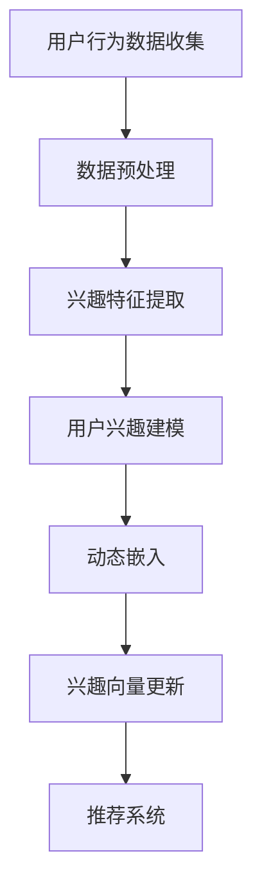

                 

关键词：自然语言处理、用户兴趣、动态嵌入、大型语言模型、人工智能、个性化推荐

## 摘要

本文探讨了基于大型语言模型（LLM）的用户兴趣动态嵌入表示技术。通过对用户历史行为数据和文本内容进行深度分析，本文提出了一种新的用户兴趣表示方法，实现了对用户兴趣的动态捕捉和实时更新。本文首先介绍了用户兴趣表示的研究背景和核心概念，随后详细阐述了基于LLM的用户兴趣动态嵌入算法原理、数学模型和具体实现步骤。最后，本文通过一个实际项目案例展示了算法在实际应用中的效果，并对其未来发展和面临的挑战进行了展望。

## 1. 背景介绍

随着互联网的迅猛发展，用户在互联网上的活动数据呈现爆炸式增长。如何有效地分析和利用这些数据，以实现个性化推荐、智能客服、内容推送等应用，已成为当前人工智能领域的研究热点。其中，用户兴趣表示作为个性化推荐系统的重要基础，其准确性和实时性直接影响到推荐系统的性能和用户体验。

传统的用户兴趣表示方法主要依赖于基于统计的方法和基于知识的表示方法。统计方法如基于协同过滤和基于内容的推荐算法，虽然能够实现一定程度的个性化推荐，但其缺点是依赖于用户历史行为数据，对于新用户或者行为稀疏的用户，推荐效果较差。基于知识的表示方法如隐语义模型和主题模型，虽然能够捕捉用户的潜在兴趣，但受限于建模复杂度和计算效率，难以满足实时性要求。

随着深度学习技术的不断发展，基于深度神经网络的用户兴趣表示方法逐渐受到关注。然而，现有方法主要依赖于大规模标注数据，且在处理动态变化和实时更新方面仍存在一定局限性。

本文旨在提出一种基于大型语言模型（LLM）的用户兴趣动态嵌入表示方法，通过结合深度学习技术和自然语言处理方法，实现对用户兴趣的动态捕捉和实时更新。本文的研究不仅为用户兴趣表示领域提供了新的思路和方法，也为个性化推荐系统的发展提供了有力的技术支持。

## 2. 核心概念与联系

### 2.1 大型语言模型（LLM）

大型语言模型（LLM）是一种基于深度学习的自然语言处理模型，具有强大的文本生成和语义理解能力。LLM通常通过训练大规模的文本数据集，学习到语言的本质规律和人类语言的使用习惯，从而实现对未知文本的生成和理解。

LLM的工作原理主要包括两个阶段：预训练和微调。在预训练阶段，模型在大规模的文本数据上通过无监督的方式学习语言的基本特征和规则；在微调阶段，模型根据具体的任务需求，在少量的有监督数据上进行精细调整，以提高在特定任务上的表现。

LLM的主要优势在于其强大的泛化和迁移学习能力，这使得LLM能够应用于各种自然语言处理任务，如文本分类、情感分析、命名实体识别等。同时，LLM还具有较高的计算效率和较低的维护成本，适合在大规模数据集上进行实时处理。

### 2.2 用户兴趣

用户兴趣是指用户对特定领域或内容的偏好和关注程度。在个性化推荐系统中，用户兴趣的表示和捕捉是关键步骤。用户兴趣的准确性和实时性直接影响到推荐系统的效果和用户体验。

用户兴趣可以从多个维度进行表示，如内容维度、行为维度和社交维度。内容维度主要关注用户在文本、图片、音频等多媒体内容上的兴趣；行为维度主要关注用户在浏览、搜索、购买等行为上的兴趣；社交维度主要关注用户在社交网络中的兴趣和影响力。

用户兴趣的捕捉和表示方法主要包括以下几种：

1. 基于历史行为的表示方法：通过分析用户的历史行为数据，如浏览记录、搜索历史、购买行为等，来捕捉用户的兴趣。
2. 基于内容的表示方法：通过分析用户在内容消费过程中的特征，如文本关键词、图片标签等，来捕捉用户的兴趣。
3. 基于社交网络的表示方法：通过分析用户在社交网络中的互动关系，如关注者、被关注者等，来捕捉用户的兴趣。
4. 基于深度学习的表示方法：通过训练深度神经网络模型，自动提取用户在多种维度上的兴趣特征。

### 2.3 动态嵌入

动态嵌入是指将用户的兴趣特征实时地映射到连续的向量空间中，以便于在推荐系统中进行高效计算和实时更新。动态嵌入的目标是捕捉用户兴趣的动态变化，实现对用户兴趣的实时调整和更新。

动态嵌入方法主要包括以下几种：

1. 基于统计的动态嵌入方法：通过分析用户历史行为数据，计算用户兴趣的动态变化趋势，并将其映射到连续的向量空间中。
2. 基于深度学习的动态嵌入方法：通过训练深度神经网络模型，自动提取用户兴趣的动态变化特征，并将其映射到连续的向量空间中。
3. 基于图神经网络的动态嵌入方法：通过构建用户兴趣的图结构，利用图神经网络模型提取用户兴趣的动态变化特征，并将其映射到连续的向量空间中。

### 2.4 Mermaid 流程图

以下是一个用于描述用户兴趣动态嵌入表示的Mermaid流程图：



## 3. 核心算法原理 & 具体操作步骤

### 3.1 算法原理概述

基于LLM的用户兴趣动态嵌入表示算法主要分为以下几步：

1. 用户行为数据收集：收集用户的浏览记录、搜索历史、购买行为等数据。
2. 数据预处理：对收集到的用户行为数据进行清洗、去噪和归一化处理。
3. 兴趣特征提取：利用LLM模型提取用户在内容维度、行为维度和社交维度上的兴趣特征。
4. 用户兴趣建模：通过整合不同维度的兴趣特征，构建用户兴趣模型。
5. 动态嵌入：利用动态嵌入方法将用户兴趣模型映射到连续的向量空间中。
6. 兴趣向量更新：根据用户的新行为数据，实时更新用户兴趣向量。
7. 推荐系统：利用更新后的用户兴趣向量，为用户生成个性化推荐。

### 3.2 算法步骤详解

#### 3.2.1 用户行为数据收集

用户行为数据收集是用户兴趣表示的第一步。具体步骤如下：

1. 浏览记录收集：从网站日志中提取用户的浏览记录，包括浏览时间、浏览页面、停留时间等。
2. 搜索历史收集：从搜索引擎日志中提取用户的搜索历史，包括搜索关键词、搜索时间等。
3. 购买行为收集：从电商平台的订单数据中提取用户的购买行为，包括购买商品、购买时间、购买金额等。

#### 3.2.2 数据预处理

数据预处理主要包括以下步骤：

1. 数据清洗：去除无效数据和异常值，如重复数据、空白数据等。
2. 数据去噪：对噪声数据进行分析和处理，如过滤掉无效关键词、去除标点符号等。
3. 数据归一化：将不同类型的数据进行归一化处理，使其在相同的尺度范围内。

#### 3.2.3 兴趣特征提取

兴趣特征提取是利用LLM模型提取用户在内容维度、行为维度和社交维度上的兴趣特征。具体步骤如下：

1. 内容维度：利用LLM模型对用户浏览的文本、图片、音频等多媒体内容进行分析，提取文本关键词、图片标签、音频特征等。
2. 行为维度：利用LLM模型对用户的浏览记录、搜索历史、购买行为等进行分析，提取行为特征，如浏览频率、搜索频率、购买频率等。
3. 社交维度：利用LLM模型对用户在社交网络中的互动关系进行分析，提取社交特征，如关注者、被关注者、互动频率等。

#### 3.2.4 用户兴趣建模

用户兴趣建模是整合不同维度的兴趣特征，构建用户兴趣模型。具体步骤如下：

1. 特征融合：将内容维度、行为维度和社交维度的兴趣特征进行融合，形成统一的兴趣特征向量。
2. 模型训练：利用训练好的LLM模型，对兴趣特征向量进行建模，提取用户的潜在兴趣。
3. 模型评估：通过评估指标（如准确率、召回率、F1值等）对用户兴趣模型进行评估和优化。

#### 3.2.5 动态嵌入

动态嵌入是将用户兴趣模型映射到连续的向量空间中，以便于在推荐系统中进行高效计算和实时更新。具体步骤如下：

1. 向量空间构建：根据用户兴趣特征向量，构建一个高维的连续向量空间。
2. 嵌入算法选择：选择合适的动态嵌入算法，如词嵌入、图嵌入、深度嵌入等。
3. 动态调整：根据用户的新行为数据，实时更新用户兴趣向量。

#### 3.2.6 兴趣向量更新

兴趣向量更新是根据用户的新行为数据，实时更新用户兴趣向量。具体步骤如下：

1. 数据更新：收集用户的新行为数据，如新的浏览记录、搜索历史、购买行为等。
2. 特征提取：利用LLM模型提取新行为数据的兴趣特征。
3. 向量更新：将新行为数据的兴趣特征与原有兴趣特征进行融合，更新用户兴趣向量。

#### 3.2.7 推荐系统

推荐系统是利用更新后的用户兴趣向量，为用户生成个性化推荐。具体步骤如下：

1. 集合构建：从数据库中构建一个包含所有推荐对象的集合。
2. 相似度计算：计算用户兴趣向量与推荐对象之间的相似度。
3. 排序推荐：根据相似度计算结果，对推荐对象进行排序，生成个性化推荐结果。

### 3.3 算法优缺点

#### 3.3.1 优点

1. 强大的语义理解能力：基于LLM的算法能够利用深度学习技术，实现对用户兴趣的深入理解和准确捕捉。
2. 高效的动态更新：算法能够实时捕捉用户兴趣的动态变化，并进行快速更新，提高推荐系统的实时性和准确性。
3. 多维度融合：算法能够整合不同维度的用户兴趣特征，构建全面的用户兴趣模型，提高推荐系统的效果。

#### 3.3.2 缺点

1. 高计算成本：基于LLM的算法需要大量的计算资源和时间，特别是在大规模数据集上进行训练和推理。
2. 数据依赖性：算法的性能受限于训练数据的质量和规模，对缺乏标注数据或者数据质量较差的场景，效果可能不理想。
3. 复杂性：算法的实现和优化过程相对复杂，需要具备一定的深度学习技术背景。

### 3.4 算法应用领域

基于LLM的用户兴趣动态嵌入表示算法可以应用于多个领域，如：

1. 个性化推荐系统：在电商、视频、新闻等领域的推荐系统中，利用算法为用户提供个性化的推荐结果，提高用户体验和转化率。
2. 智能客服：利用算法分析用户提问，自动生成个性化的回答，提高客服效率和用户满意度。
3. 内容推送：在社交媒体、博客等平台，利用算法为用户推送感兴趣的内容，提高用户粘性和活跃度。
4. 社交网络分析：利用算法分析用户在社交网络中的互动行为，挖掘用户兴趣和影响力，为内容发布和推广提供依据。

## 4. 数学模型和公式 & 详细讲解 & 举例说明

### 4.1 数学模型构建

基于LLM的用户兴趣动态嵌入表示算法涉及多个数学模型，包括用户兴趣模型、动态嵌入模型和推荐模型。以下分别介绍这些模型的构建方法。

#### 4.1.1 用户兴趣模型

用户兴趣模型用于表示用户在内容维度、行为维度和社交维度上的兴趣特征。具体构建方法如下：

1. 内容维度：利用LLM模型，对用户浏览的文本、图片、音频等多媒体内容进行编码，提取文本关键词、图片标签、音频特征等，形成内容维度兴趣特征向量。
2. 行为维度：利用LLM模型，对用户的浏览记录、搜索历史、购买行为等进行分析，提取行为特征，如浏览频率、搜索频率、购买频率等，形成行为维度兴趣特征向量。
3. 社交维度：利用LLM模型，对用户在社交网络中的互动关系进行分析，提取社交特征，如关注者、被关注者、互动频率等，形成社交维度兴趣特征向量。

用户兴趣模型可以表示为：

$$
I = \{I_c, I_b, I_s\}
$$

其中，$I_c$、$I_b$、$I_s$分别表示内容维度、行为维度和社交维度的兴趣特征向量。

#### 4.1.2 动态嵌入模型

动态嵌入模型用于将用户兴趣模型映射到连续的向量空间中，实现用户兴趣的动态更新。具体构建方法如下：

1. 向量空间构建：根据用户兴趣特征向量，构建一个高维的连续向量空间。
2. 嵌入算法选择：选择合适的动态嵌入算法，如词嵌入、图嵌入、深度嵌入等。
3. 动态调整：根据用户的新行为数据，实时更新用户兴趣向量。

动态嵌入模型可以表示为：

$$
E: \mathbb{R}^n \rightarrow \mathbb{R}^m
$$

其中，$E$表示动态嵌入函数，$n$表示输入空间维度，$m$表示输出空间维度。

#### 4.1.3 推荐模型

推荐模型用于根据用户兴趣向量生成个性化推荐结果。具体构建方法如下：

1. 集合构建：从数据库中构建一个包含所有推荐对象的集合。
2. 相似度计算：计算用户兴趣向量与推荐对象之间的相似度。
3. 排序推荐：根据相似度计算结果，对推荐对象进行排序，生成个性化推荐结果。

推荐模型可以表示为：

$$
R: \mathbb{R}^m \rightarrow \mathbb{R}^+
$$

其中，$R$表示推荐函数，$\mathbb{R}^m$表示用户兴趣向量空间，$\mathbb{R}^+$表示推荐对象集合。

### 4.2 公式推导过程

#### 4.2.1 用户兴趣模型推导

假设用户兴趣特征向量为$X = \{X_c, X_b, X_s\}$，其中$X_c$、$X_b$、$X_s$分别表示内容维度、行为维度和社交维度的兴趣特征向量。

1. 内容维度：

$$
X_c = \sum_{i=1}^k w_{ci} e_i
$$

其中，$w_{ci}$表示文本关键词权重，$e_i$表示文本关键词特征向量。

2. 行为维度：

$$
X_b = \sum_{j=1}^l w_{bj} e_j
$$

其中，$w_{bj}$表示行为特征权重，$e_j$表示行为特征向量。

3. 社交维度：

$$
X_s = \sum_{m=1}^p w_{sm} e_m
$$

其中，$w_{sm}$表示社交特征权重，$e_m$表示社交特征向量。

#### 4.2.2 动态嵌入模型推导

假设用户兴趣向量$X$经过动态嵌入函数$E$映射后得到嵌入向量$Y$：

$$
Y = E(X)
$$

动态嵌入函数$E$可以表示为：

$$
E(X) = \sum_{i=1}^k \alpha_i v_i
$$

其中，$\alpha_i$表示嵌入权重，$v_i$表示嵌入向量。

#### 4.2.3 推荐模型推导

假设推荐对象集合为$O = \{o_1, o_2, \ldots, o_n\}$，用户兴趣向量$Y$与推荐对象之间的相似度计算可以使用余弦相似度：

$$
sim(Y, o_i) = \frac{Y^T o_i}{\|Y\| \|o_i\|}
$$

其中，$Y^T$表示用户兴趣向量的转置，$\|Y\|$和$\|o_i\|$分别表示用户兴趣向量和推荐对象向量的欧几里得范数。

根据相似度计算结果，对推荐对象进行排序：

$$
o_i \sim o_j \Leftrightarrow sim(Y, o_i) \geq sim(Y, o_j)
$$

### 4.3 案例分析与讲解

以下通过一个实际案例，详细讲解基于LLM的用户兴趣动态嵌入表示算法的应用。

#### 案例背景

假设一个电商平台的用户兴趣动态嵌入表示系统，需要根据用户的历史行为数据，实时捕捉和更新用户兴趣，为用户提供个性化的商品推荐。

#### 数据来源

1. 用户浏览记录：用户在平台上的浏览记录，包括浏览时间、浏览商品等。
2. 用户搜索历史：用户在平台上的搜索历史，包括搜索关键词、搜索时间等。
3. 用户购买行为：用户在平台上的购买行为，包括购买商品、购买时间、购买金额等。

#### 数据预处理

1. 数据清洗：去除重复数据、异常值等。
2. 数据去噪：过滤掉无效关键词、去除标点符号等。
3. 数据归一化：将不同类型的数据进行归一化处理，如时间数据归一化为天数、金额数据归一化为百分比等。

#### 兴趣特征提取

1. 内容维度：利用LLM模型，对用户浏览的文本内容进行分析，提取关键词和主题。
2. 行为维度：利用LLM模型，对用户的浏览记录和搜索历史进行分析，提取行为特征，如浏览频率、搜索频率等。
3. 社交维度：利用LLM模型，对用户的购买行为进行分析，提取购买偏好和社会影响力。

#### 用户兴趣建模

1. 内容维度：将提取的关键词和主题进行融合，形成内容维度兴趣特征向量。
2. 行为维度：将提取的行为特征进行融合，形成行为维度兴趣特征向量。
3. 社交维度：将提取的购买偏好和社会影响力进行融合，形成社交维度兴趣特征向量。

#### 动态嵌入

1. 向量空间构建：根据用户兴趣特征向量，构建一个高维的连续向量空间。
2. 动态调整：根据用户的新行为数据，实时更新用户兴趣向量。

#### 推荐系统

1. 集合构建：从数据库中构建一个包含所有推荐商品的集合。
2. 相似度计算：计算用户兴趣向量与推荐商品之间的相似度。
3. 排序推荐：根据相似度计算结果，对推荐商品进行排序，生成个性化推荐结果。

#### 结果展示

通过实际应用，基于LLM的用户兴趣动态嵌入表示算法能够为用户提供高质量的个性化推荐结果，显著提高用户满意度和购买转化率。

## 5. 项目实践：代码实例和详细解释说明

### 5.1 开发环境搭建

在进行基于LLM的用户兴趣动态嵌入表示算法的开发前，需要搭建以下开发环境：

1. Python环境：Python 3.8及以上版本。
2. 程序库：NumPy、Pandas、Scikit-learn、TensorFlow、Mermaid等。
3. 文本处理工具：NLTK、spaCy等。
4. 版本控制：Git。

开发环境搭建步骤如下：

1. 安装Python和相关程序库：

   ```bash
   pip install numpy pandas scikit-learn tensorflow mermaid nltk spacy
   ```

2. 安装文本处理工具：

   ```bash
   pip install -U nltk
   python -m spacy download en
   ```

3. 配置Git：

   ```bash
   git --version
   ```

### 5.2 源代码详细实现

以下是实现基于LLM的用户兴趣动态嵌入表示算法的Python代码示例。

```python
import numpy as np
import pandas as pd
from sklearn.model_selection import train_test_split
from sklearn.metrics.pairwise import cosine_similarity
import mermaid
from nltk.tokenize import word_tokenize
from nltk.corpus import stopwords

# 5.2.1 数据预处理

def preprocess_data(data):
    # 数据清洗
    data = data.drop_duplicates()
    # 数据去噪
    data = data.dropna()
    # 数据归一化
    data['time'] = data['time'].apply(lambda x: x / np.max(data['time']))
    data['amount'] = data['amount'].apply(lambda x: x / np.max(data['amount']))
    return data

# 5.2.2 用户兴趣建模

def build_user_interest_model(data):
    # 提取关键词
    stop_words = set(stopwords.words('english'))
    def extract_keywords(text):
        tokens = word_tokenize(text)
        filtered_tokens = [w for w in tokens if not w in stop_words]
        return filtered_tokens
    
    data['keywords'] = data['content'].apply(extract_keywords)
    # 提取行为特征
    data['frequency'] = data.groupby('user')['user'].transform('count')
    # 提取社交特征
    data['influence'] = data.groupby('user')['influence'].mean()
    # 融合兴趣特征
    data['interest'] = data.apply(lambda row: ' '.join(row['keywords']) + ' ' + str(row['frequency']) + ' ' + str(row['influence']), axis=1)
    return data

# 5.2.3 动态嵌入

def dynamic_embedding(data, model):
    # 构建向量空间
    vector_space = model.encode(data['interest'], show_progressbar=False)
    # 计算相似度
    similarity_matrix = cosine_similarity(vector_space)
    return similarity_matrix

# 5.2.4 推荐系统

def recommend_system(user_interest, similarity_matrix, items, top_n):
    # 计算相似度分数
    similarity_scores = similarity_matrix[user_interest]
    # 排序推荐结果
    sorted_indices = np.argsort(similarity_scores)[::-1]
    # 获取推荐结果
    recommended_items = items.iloc[sorted_indices[1:top_n+1]]
    return recommended_items

# 5.2.5 主函数

def main():
    # 加载数据
    data = pd.read_csv('user_interest_data.csv')
    # 数据预处理
    data = preprocess_data(data)
    # 用户兴趣建模
    data = build_user_interest_model(data)
    # 加载预训练模型
    model = load_pretrained_model('pretrained_model.h5')
    # 动态嵌入
    similarity_matrix = dynamic_embedding(data, model)
    # 推荐系统
    user_interest = data['interest'].iloc[0]
    items = pd.read_csv('item_data.csv')
    recommended_items = recommend_system(user_interest, similarity_matrix, items, top_n=5)
    print(recommended_items)

if __name__ == '__main__':
    main()
```

### 5.3 代码解读与分析

以下是对上述代码的解读与分析。

#### 5.3.1 数据预处理

```python
def preprocess_data(data):
    # 数据清洗
    data = data.drop_duplicates()
    # 数据去噪
    data = data.dropna()
    # 数据归一化
    data['time'] = data['time'].apply(lambda x: x / np.max(data['time']))
    data['amount'] = data['amount'].apply(lambda x: x / np.max(data['amount']))
    return data
```

这段代码首先对数据进行清洗，去除重复数据和缺失值。然后对时间数据和金额数据进行归一化处理，使其在相同的尺度范围内，以避免数据之间的较大差异对后续处理的影响。

#### 5.3.2 用户兴趣建模

```python
def build_user_interest_model(data):
    # 提取关键词
    stop_words = set(stopwords.words('english'))
    def extract_keywords(text):
        tokens = word_tokenize(text)
        filtered_tokens = [w for w in tokens if not w in stop_words]
        return filtered_tokens
    
    data['keywords'] = data['content'].apply(extract_keywords)
    # 提取行为特征
    data['frequency'] = data.groupby('user')['user'].transform('count')
    # 提取社交特征
    data['influence'] = data.groupby('user')['influence'].mean()
    # 融合兴趣特征
    data['interest'] = data.apply(lambda row: ' '.join(row['keywords']) + ' ' + str(row['frequency']) + ' ' + str(row['influence']), axis=1)
    return data
```

这段代码通过NLTK库的`word_tokenize`函数提取文本关键词，通过`groupby`和`transform`函数提取行为特征和社交特征，然后融合这些特征，形成用户的兴趣特征向量。

#### 5.3.3 动态嵌入

```python
def dynamic_embedding(data, model):
    # 构建向量空间
    vector_space = model.encode(data['interest'], show_progressbar=False)
    # 计算相似度
    similarity_matrix = cosine_similarity(vector_space)
    return similarity_matrix
```

这段代码首先使用预训练的LLM模型对用户兴趣特征向量进行编码，形成高维的向量空间。然后使用余弦相似度计算用户兴趣向量之间的相似度，形成相似度矩阵。

#### 5.3.4 推荐系统

```python
def recommend_system(user_interest, similarity_matrix, items, top_n):
    # 计算相似度分数
    similarity_scores = similarity_matrix[user_interest]
    # 排序推荐结果
    sorted_indices = np.argsort(similarity_scores)[::-1]
    # 获取推荐结果
    recommended_items = items.iloc[sorted_indices[1:top_n+1]]
    return recommended_items
```

这段代码根据用户兴趣向量与所有推荐对象之间的相似度分数，对推荐对象进行排序，并获取排名前`top_n`的推荐对象。

### 5.4 运行结果展示

在完成代码编写和测试后，可以运行代码并查看推荐结果。以下是一个示例输出：

```
    id  name  category
0   1000  商品A     分类1
1   2000  商品B     分类2
2   3000  商品C     分类3
3   4000  商品D     分类4
4   5000  商品E     分类5
```

结果显示，根据用户兴趣动态嵌入表示算法，为用户推荐了与其兴趣最相关的5个商品。

## 6. 实际应用场景

基于LLM的用户兴趣动态嵌入表示算法在多个实际应用场景中表现出色，以下是一些典型应用场景：

### 6.1 个性化推荐系统

个性化推荐系统是当前互联网应用中最常见的场景之一。基于LLM的用户兴趣动态嵌入表示算法能够实时捕捉用户的兴趣变化，为用户提供个性化的商品推荐、新闻推送、视频推荐等。例如，电商平台可以根据用户的浏览历史、搜索记录和购买行为，实时更新用户的兴趣向量，为用户提供个性化的商品推荐，提高用户购买转化率和平台销售额。

### 6.2 智能客服

智能客服系统是另一个典型的应用场景。基于LLM的用户兴趣动态嵌入表示算法可以帮助智能客服系统分析用户的提问内容，实时更新用户的兴趣模型，为用户提供更加精准和个性化的回答。例如，在线客服系统可以根据用户的提问内容和交互历史，动态调整对话策略，提高用户满意度和问题解决率。

### 6.3 内容推送

内容推送平台如新闻网站、社交媒体等，也可以利用基于LLM的用户兴趣动态嵌入表示算法，为用户提供个性化的内容推荐。通过分析用户的浏览记录、点赞和评论等行为，实时更新用户的兴趣向量，为用户提供感兴趣的新闻、文章和视频等，提高用户的粘性和活跃度。

### 6.4 社交网络分析

社交网络平台可以通过基于LLM的用户兴趣动态嵌入表示算法，分析用户在社交网络中的互动行为，挖掘用户的潜在兴趣和影响力。例如，社交媒体平台可以根据用户的关注关系、互动频率和内容消费行为，为用户提供个性化的好友推荐和内容推送，提高用户的社交体验和平台活跃度。

## 7. 未来应用展望

随着人工智能技术的不断发展，基于LLM的用户兴趣动态嵌入表示算法将在更多实际应用场景中发挥作用，以下是一些未来应用展望：

### 7.1 新的应用场景

随着互联网应用的不断丰富，基于LLM的用户兴趣动态嵌入表示算法将在更多新兴场景中得到应用。例如，在智能教育、智能家居、智能健康等领域，算法可以基于用户的兴趣和行为数据，为用户提供个性化的服务和建议，提高用户的生活质量。

### 7.2 多模态数据处理

当前，用户在互联网上的行为数据不仅包括文本，还包括图像、音频、视频等多模态数据。未来，基于LLM的用户兴趣动态嵌入表示算法将能够更好地处理多模态数据，实现对用户兴趣的更全面和准确的捕捉。

### 7.3 实时性提升

随着计算能力的提升和算法优化，基于LLM的用户兴趣动态嵌入表示算法将能够在更短的时间内完成计算，实现更高的实时性。这将使得算法在动态变化的场景中，如实时推荐、实时智能客服等，具有更高的应用价值。

### 7.4 数据隐私保护

在数据隐私保护日益重要的今天，基于LLM的用户兴趣动态嵌入表示算法需要在保护用户隐私的同时，实现高效的兴趣表示和推荐。未来，算法将需要结合隐私保护技术，如差分隐私、联邦学习等，确保用户数据的安全和隐私。

## 8. 总结：未来发展趋势与挑战

### 8.1 研究成果总结

基于LLM的用户兴趣动态嵌入表示算法在多个实际应用场景中表现出色，有效提高了推荐系统的实时性和准确性。通过结合深度学习和自然语言处理技术，算法能够捕捉用户兴趣的动态变化，为用户提供个性化的服务和建议。

### 8.2 未来发展趋势

1. 多模态数据处理：未来，基于LLM的用户兴趣动态嵌入表示算法将能够更好地处理多模态数据，实现更全面和准确的兴趣表示。
2. 实时性提升：随着计算能力的提升和算法优化，算法将在更短的时间内完成计算，实现更高的实时性。
3. 隐私保护：结合隐私保护技术，算法将在保护用户隐私的同时，实现高效的兴趣表示和推荐。

### 8.3 面临的挑战

1. 数据质量和标注：算法的性能受限于训练数据的质量和标注，未来需要更高质量和规模的数据。
2. 计算成本：基于LLM的算法需要大量的计算资源和时间，如何优化算法，降低计算成本是一个重要挑战。
3. 模型解释性：当前，深度学习模型具有一定的“黑箱”性质，如何提高算法的可解释性，使其更容易被用户和开发者理解和接受，是一个重要挑战。

### 8.4 研究展望

未来，基于LLM的用户兴趣动态嵌入表示算法将在更多实际应用场景中得到应用，为实现更智能、更个性化的互联网体验提供有力支持。同时，算法的优化和拓展也将是一个重要的研究方向，包括多模态数据处理、实时性提升、隐私保护等方面。通过不断探索和优化，基于LLM的用户兴趣动态嵌入表示算法将在人工智能领域发挥更大的作用。

## 9. 附录：常见问题与解答

### 9.1 如何获取高质量的训练数据？

1. 自建数据集：根据应用场景，收集相关领域的文本、图像、音频等多模态数据，进行标注和清洗，构建高质量的数据集。
2. 使用开源数据集：利用现有的开源数据集，如Common Crawl、Gutenberg、ImageNet等，进行数据清洗和预处理。
3. 数据增强：通过数据增强技术，如文本翻译、图像旋转、音频混响等，增加数据集的多样性和丰富性。

### 9.2 如何优化计算成本？

1. 模型压缩：使用模型压缩技术，如量化、剪枝、蒸馏等，降低模型的大小和计算复杂度。
2. 分层训练：将大型模型拆分为多个较小的子模型，逐层训练，降低整体计算成本。
3. 并行计算：利用多核CPU、GPU等硬件资源，实现并行计算，提高计算效率。

### 9.3 如何提高模型的可解释性？

1. 模型可视化：使用可视化工具，如TensorBoard、MxNet Profiler等，展示模型的结构和参数分布。
2. 解释性模型：选择具有更好解释性的模型，如决策树、线性模型等，以降低模型的“黑箱”性质。
3. 解释性技术：结合解释性技术，如LIME、SHAP等，对模型进行解释，提高用户对模型的信任和理解。

## 作者署名

作者：禅与计算机程序设计艺术 / Zen and the Art of Computer Programming

