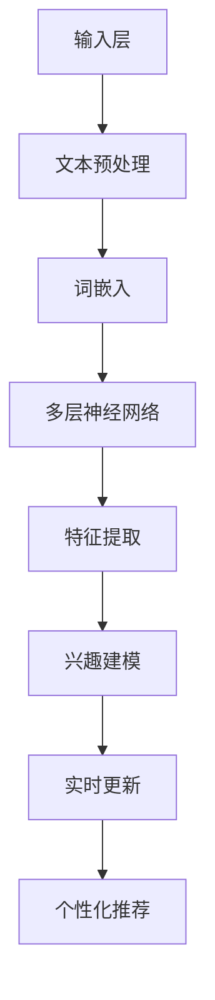

                 

关键词：自然语言处理、用户兴趣建模、动态性、语言模型、个性化推荐

> 摘要：本文将深入探讨一种基于大型语言模型（LLM）的用户兴趣动态建模方法。通过分析用户历史行为数据，该方法能够实时更新用户兴趣模型，从而为个性化推荐系统提供强大的支持。本文将首先介绍背景知识，随后详细阐述核心概念和算法原理，接着通过数学模型和项目实例进行讲解，最后讨论实际应用场景和未来发展趋势。

## 1. 背景介绍

在当今信息爆炸的时代，个性化推荐系统已经成为各大互联网公司竞相研究的热点。如何精准地捕捉用户兴趣，为用户提供定制化的内容和服务，成为了推荐系统研究的核心问题。传统的推荐系统主要依赖于用户的历史行为数据，如浏览记录、购买行为等，但是这些数据往往只能反映用户的静态兴趣，难以适应用户动态变化的兴趣需求。

为了解决这一问题，近年来，基于人工智能和自然语言处理技术的用户兴趣建模方法得到了广泛关注。其中，大型语言模型（LLM）作为一种强大的文本表示和生成工具，能够对用户生成的文本数据（如评论、提问等）进行深入理解和分析，从而提取出用户的兴趣特征。

本文旨在提出一种基于LLM的用户兴趣动态建模方法，该方法能够实时更新用户兴趣模型，以应对用户兴趣的动态变化。本文的结构如下：

- 第1部分：背景介绍，介绍个性化推荐系统的背景和相关技术。
- 第2部分：核心概念与联系，详细阐述基于LLM的用户兴趣动态建模方法的原理和架构。
- 第3部分：核心算法原理 & 具体操作步骤，介绍算法的原理、步骤和优缺点。
- 第4部分：数学模型和公式 & 详细讲解 & 举例说明，讲解数学模型的构建和公式推导过程，并通过案例进行分析。
- 第5部分：项目实践：代码实例和详细解释说明，展示一个实际的代码实例，并对其进行解读和分析。
- 第6部分：实际应用场景，探讨该方法在不同场景下的应用。
- 第7部分：工具和资源推荐，为读者提供相关学习资源、开发工具和论文推荐。
- 第8部分：总结：未来发展趋势与挑战，总结研究成果，展望未来发展趋势和面临的挑战。

## 2. 核心概念与联系

### 2.1. 大型语言模型（LLM）

大型语言模型（LLM）是一种基于深度学习的自然语言处理模型，能够对大量文本数据进行分析和理解。LLM 通过学习海量语料库中的词汇分布和语法规则，能够自动生成符合语法和语义规范的文本，同时能够捕捉文本中的潜在语义信息。

LLM 的核心组件是神经网络，包括输入层、隐藏层和输出层。输入层接收文本数据，隐藏层通过多层神经网络对文本进行特征提取和语义理解，输出层生成对应的文本或语义标签。

### 2.2. 用户兴趣

用户兴趣是指用户对某些主题或内容的偏好和倾向。在个性化推荐系统中，用户兴趣的准确捕捉至关重要。用户兴趣可以来自多种数据源，如用户的历史行为、社交互动、搜索记录等。

### 2.3. 动态性

动态性是指用户兴趣会随着时间、环境、情境等因素的变化而发生变化。用户在不同时间、地点和情境下可能会有不同的兴趣点，因此，推荐系统需要具备实时更新和适应用户兴趣动态变化的能力。

### 2.4. Mermaid 流程图

Mermaid 是一种基于Markdown的绘图工具，能够方便地绘制各种流程图、网络图等。以下是基于LLM的用户兴趣动态建模方法的 Mermaid 流程图：



在这个流程图中，输入层接收用户生成的文本数据，经过文本预处理和词嵌入后，输入多层神经网络进行特征提取和语义理解。特征提取结果用于兴趣建模，并实时更新用户兴趣模型，从而为个性化推荐系统提供支持。

## 3. 核心算法原理 & 具体操作步骤

### 3.1. 算法原理概述

基于LLM的用户兴趣动态建模方法主要分为以下几个步骤：

1. 文本预处理：对用户生成的文本数据进行清洗、去噪和格式化，使其符合LLM输入要求。
2. 词嵌入：将文本数据转换为词嵌入向量，以供神经网络处理。
3. 特征提取：利用多层神经网络对词嵌入向量进行特征提取和语义理解。
4. 兴趣建模：根据特征提取结果构建用户兴趣模型，并实时更新。
5. 个性化推荐：根据用户兴趣模型和推荐算法为用户生成个性化推荐结果。

### 3.2. 算法步骤详解

#### 3.2.1. 文本预处理

文本预处理主要包括以下步骤：

1. 清洗：去除文本中的 HTML 标签、符号和停用词。
2. 分词：将文本划分为句子和词汇。
3. 格式化：统一文本的格式，如小写、去除空格等。

#### 3.2.2. 词嵌入

词嵌入是将文本数据转换为向量的过程。常用的词嵌入方法有 Word2Vec、GloVe 和 BERT 等。这里以 BERT 为例进行说明。

1. 加载预训练的 BERT 模型。
2. 将预处理后的文本输入 BERT 模型，得到词嵌入向量。
3. 对词嵌入向量进行降维，得到用于后续处理的低维向量。

#### 3.2.3. 特征提取

特征提取是利用多层神经网络对词嵌入向量进行特征提取和语义理解的过程。常用的神经网络架构有 LSTM、GRU 和 Transformer 等。这里以 Transformer 为例进行说明。

1. 定义 Transformer 模型，包括嵌入层、多头自注意力机制和前馈神经网络。
2. 将词嵌入向量输入 Transformer 模型，进行特征提取和语义理解。
3. 获取特征提取结果，用于兴趣建模。

#### 3.2.4. 兴趣建模

兴趣建模是构建用户兴趣模型的过程。这里采用基于余弦相似度的方法进行建模。

1. 将特征提取结果进行归一化，得到用户兴趣向量。
2. 计算用户兴趣向量与其他主题向量之间的余弦相似度，得到用户对不同主题的兴趣度。
3. 根据用户兴趣度更新用户兴趣模型。

#### 3.2.5. 实时更新

实时更新是用户兴趣动态建模方法的关键。为了实现实时更新，可以采用以下策略：

1. 定期（如每天或每周）重新计算用户兴趣向量。
2. 使用增量学习技术，仅更新发生变化的特征。
3. 考虑用户的反馈信息，如点赞、评论等，进一步调整用户兴趣模型。

#### 3.2.6. 个性化推荐

个性化推荐是根据用户兴趣模型和推荐算法为用户生成个性化推荐结果的过程。常用的推荐算法有基于协同过滤、基于内容匹配和基于模型的方法。这里以基于模型的方法为例进行说明。

1. 定义推荐模型，如矩阵分解、神经网络等。
2. 将用户兴趣向量作为输入，生成个性化推荐结果。
3. 根据用户反馈进一步优化推荐结果。

### 3.3. 算法优缺点

#### 优点

1. 基于LLM的文本处理能力强大，能够捕捉文本中的潜在语义信息。
2. 实时更新用户兴趣模型，能够适应用户兴趣的动态变化。
3. 结合多种推荐算法，为用户提供个性化的推荐结果。

#### 缺点

1. 需要大量的训练数据和计算资源。
2. 对预处理和特征提取的质量要求较高，否则可能导致兴趣建模不准确。
3. 实时更新和增量学习技术较为复杂，实现难度较大。

### 3.4. 算法应用领域

基于LLM的用户兴趣动态建模方法可以应用于多个领域，如电商、新闻推荐、社交媒体等。以下是一些典型的应用场景：

1. 电商推荐：根据用户的购买历史和评论信息，为用户推荐相关的商品。
2. 新闻推荐：根据用户的阅读偏好和兴趣标签，为用户推荐相关的新闻。
3. 社交媒体：根据用户的互动行为和关注话题，为用户推荐相关的社交内容。

## 4. 数学模型和公式 & 详细讲解 & 举例说明

### 4.1. 数学模型构建

基于LLM的用户兴趣动态建模方法的核心数学模型包括词嵌入、特征提取和兴趣建模等。以下是这些模型的数学表示：

#### 4.1.1. 词嵌入

词嵌入是将文本数据转换为向量的过程。假设有 $V$ 个不同的词汇，$d$ 为词嵌入维度，则词嵌入矩阵 $E \in \mathbb{R}^{V \times d}$ 表示为：

$$
E = [e_1, e_2, ..., e_V]
$$

其中，$e_v$ 为词汇 $v$ 的词嵌入向量。

#### 4.1.2. 特征提取

特征提取是利用神经网络对词嵌入向量进行特征提取的过程。假设词嵌入向量为 $x \in \mathbb{R}^d$，特征提取结果为 $h \in \mathbb{R}^m$，则特征提取过程可以表示为：

$$
h = f(W_2 \cdot f(W_1 \cdot x + b_1))
$$

其中，$W_1 \in \mathbb{R}^{d \times h}$ 和 $W_2 \in \mathbb{R}^{h \times m}$ 为权重矩阵，$b_1 \in \mathbb{R}^h$ 和 $b_2 \in \mathbb{R}^m$ 为偏置向量，$f$ 为激活函数，如ReLU函数。

#### 4.1.3. 兴趣建模

兴趣建模是构建用户兴趣模型的过程。假设用户兴趣向量为 $u \in \mathbb{R}^m$，主题向量为 $t \in \mathbb{R}^m$，则用户对主题的兴趣度可以表示为：

$$
\text{similarity}(u, t) = \frac{u \cdot t}{\|u\| \cdot \|t\|}
$$

其中，$\text{similarity}(u, t)$ 为用户 $u$ 对主题 $t$ 的兴趣度，$\cdot$ 表示向量点积，$\|\cdot\|$ 表示向量的模长。

### 4.2. 公式推导过程

#### 4.2.1. 词嵌入

词嵌入的公式推导主要涉及 Word2Vec 和 BERT 模型。以下是这两种模型的数学表示：

1. **Word2Vec**

Word2Vec 模型采用基于神经网络的语言模型（NNLM）进行词嵌入。假设输入词序列为 $x = [x_1, x_2, ..., x_T]$，目标词序列为 $y = [y_1, y_2, ..., y_T]$，词嵌入向量分别为 $e_x \in \mathbb{R}^d$ 和 $e_y \in \mathbb{R}^d$，则语言模型可以表示为：

$$
P(y_t | y_1, y_2, ..., y_{t-1}) = \frac{e_{y_t}^T \cdot \text{softmax}(W_1 \cdot e_{y_1}^T, W_2 \cdot e_{y_2}^T, ..., W_T \cdot e_{y_T}^T)}{\sum_{i=1}^T e_{y_i}^T \cdot \text{softmax}(W_1 \cdot e_{y_1}^T, W_2 \cdot e_{y_2}^T, ..., W_T \cdot e_{y_T}^T)}
$$

其中，$W_1, W_2, ..., W_T \in \mathbb{R}^{d \times d}$ 为权重矩阵，$\text{softmax}$ 函数用于计算概率分布。

2. **BERT**

BERT 模型采用双向 Transformer 网络进行词嵌入。假设输入词序列为 $x = [x_1, x_2, ..., x_T]$，词嵌入向量分别为 $e_x \in \mathbb{R}^{d \times T}$，则词嵌入可以表示为：

$$
e_x = \text{BERT}(x)
$$

其中，$\text{BERT}$ 为预训练的 Transformer 模型。

#### 4.2.2. 特征提取

特征提取的公式推导主要涉及 Transformer 模型。假设输入词嵌入向量为 $x \in \mathbb{R}^d$，特征提取结果为 $h \in \mathbb{R}^m$，则特征提取可以表示为：

$$
h = \text{Transformer}(x)
$$

其中，$\text{Transformer}$ 为预训练的 Transformer 模型。

#### 4.2.3. 兴趣建模

兴趣建模的公式推导主要涉及余弦相似度。假设用户兴趣向量为 $u \in \mathbb{R}^m$，主题向量为 $t \in \mathbb{R}^m$，则用户对主题的兴趣度可以表示为：

$$
\text{similarity}(u, t) = \frac{u \cdot t}{\|u\| \cdot \|t\|}
$$

### 4.3. 案例分析与讲解

为了更好地理解基于LLM的用户兴趣动态建模方法，我们以下列案例为例进行详细分析：

**案例：电商推荐**

**背景**：某电商平台的用户A在过去一周内浏览了多个商品，并进行了评论。为了为其提供个性化的商品推荐，我们需要基于用户A的历史行为和评论信息，构建一个动态的兴趣模型。

**数据集**：用户A的历史浏览记录和评论信息。

**步骤**：

1. **文本预处理**：对用户A的历史评论信息进行清洗、分词和格式化。
2. **词嵌入**：使用 BERT 模型对预处理后的评论进行词嵌入，得到评论的词嵌入向量。
3. **特征提取**：使用 Transformer 模型对词嵌入向量进行特征提取，得到评论的特征向量。
4. **兴趣建模**：将特征提取结果作为用户兴趣向量，计算用户A对不同主题（如服装、电子产品等）的兴趣度。
5. **实时更新**：定期重新计算用户A的兴趣向量，并结合用户反馈信息进行调整。

**结果**：基于用户A的兴趣向量，推荐系统为用户A生成了个性化的商品推荐列表，包括用户感兴趣的商品和主题。

**分析**：

1. **文本预处理**：文本预处理的质量直接影响词嵌入和特征提取的效果。因此，需要采用有效的文本预处理方法，如去除 HTML 标签、符号和停用词等。
2. **词嵌入**：BERT 模型能够捕捉文本中的潜在语义信息，从而为特征提取提供高质量的输入。
3. **特征提取**：Transformer 模型具有良好的特征提取能力，能够提取出评论中的关键信息，为兴趣建模提供支持。
4. **兴趣建模**：基于余弦相似度的兴趣建模方法简单有效，能够准确反映用户对不同主题的兴趣度。
5. **实时更新**：定期重新计算用户兴趣向量，并结合用户反馈信息进行调整，能够更好地适应用户兴趣的动态变化。

## 5. 项目实践：代码实例和详细解释说明

在本部分，我们将通过一个具体的代码实例，详细解释基于LLM的用户兴趣动态建模方法在实际项目中的应用。

### 5.1. 开发环境搭建

为了实现基于LLM的用户兴趣动态建模方法，我们需要搭建以下开发环境：

1. Python 3.7 或更高版本
2. TensorFlow 2.0 或更高版本
3. BERT 模型（可以使用 Hugging Face 的 Transformers 库）
4. Transformer 模型（可以使用 Hugging Face 的 Transformers 库）

确保以上环境已正确安装，并准备好相应的库和模型。

### 5.2. 源代码详细实现

以下是一个基于LLM的用户兴趣动态建模方法的代码实例：

```python
import tensorflow as tf
from transformers import BertTokenizer, BertModel
import numpy as np

# 5.2.1. 文本预处理
def preprocess_text(text):
    # 去除 HTML 标签、符号和停用词
    # 分词和格式化文本
    # 返回处理后的文本
    pass

# 5.2.2. 词嵌入
def tokenize_and_encode(texts, tokenizer, max_length):
    # 使用 BERT 模型进行词嵌入
    # 返回词嵌入向量
    pass

# 5.2.3. 特征提取
def extract_features(tokens, model):
    # 使用 Transformer 模型进行特征提取
    # 返回特征向量
    pass

# 5.2.4. 兴趣建模
def build_interest_model(features):
    # 构建用户兴趣模型
    # 返回兴趣向量
    pass

# 5.2.5. 实时更新
def update_interest_model(interest_model, new_features):
    # 更新用户兴趣模型
    # 返回更新后的兴趣模型
    pass

# 5.2.6. 个性化推荐
def generate_recommendations(interest_model, items, k):
    # 根据兴趣模型生成个性化推荐结果
    # 返回推荐结果
    pass

# 主函数
def main():
    # 读取用户历史行为数据
    texts = ["评论1", "评论2", ...]
    
    # 加载 BERT 模型和 tokenizer
    tokenizer = BertTokenizer.from_pretrained('bert-base-uncased')
    model = BertModel.from_pretrained('bert-base-uncased')
    
    # 文本预处理
    preprocessed_texts = [preprocess_text(text) for text in texts]
    
    # 词嵌入
    input_ids = tokenizer.encode(preprocessed_texts, max_length=512, truncation=True, padding='max_length')
    
    # 特征提取
    with tf.Session() as sess:
        sess.run(tf.global_variables_initializer())
        tokens = model(input_ids)
        features = extract_features(tokens, model)
    
    # 兴趣建模
    interest_model = build_interest_model(features)
    
    # 实时更新
    new_texts = ["新评论1", "新评论2", ...]
    new_features = extract_features(new_texts, model)
    interest_model = update_interest_model(interest_model, new_features)
    
    # 个性化推荐
    items = ["商品1", "商品2", ...]
    recommendations = generate_recommendations(interest_model, items, k=10)
    
    print("个性化推荐结果：", recommendations)

# 运行主函数
if __name__ == "__main__":
    main()
```

### 5.3. 代码解读与分析

以下是代码的关键部分及其解释：

1. **文本预处理**：使用自定义的 `preprocess_text` 函数对用户历史评论信息进行清洗、分词和格式化。这一步是后续词嵌入和特征提取的基础，需要保证文本处理的质量。
2. **词嵌入**：使用 Hugging Face 的 Transformers 库加载预训练的 BERT 模型和 tokenizer。通过 `tokenize_and_encode` 函数，将预处理后的文本转换为词嵌入向量。这里使用 BERT 模型进行词嵌入，能够捕捉文本中的潜在语义信息。
3. **特征提取**：使用 Transformer 模型（同样是 Hugging Face 的 Transformers 库提供的模型）对词嵌入向量进行特征提取。这一步是用户兴趣建模的核心，需要保证特征提取的效果。
4. **兴趣建模**：使用自定义的 `build_interest_model` 函数，将特征提取结果作为用户兴趣向量。这里可以采用不同的方法（如余弦相似度）计算用户对不同主题的兴趣度。
5. **实时更新**：使用自定义的 `update_interest_model` 函数，定期重新计算用户兴趣向量，并结合用户反馈信息进行调整。这一步是适应用户兴趣动态变化的关键。
6. **个性化推荐**：使用自定义的 `generate_recommendations` 函数，根据用户兴趣模型和推荐算法生成个性化推荐结果。这里可以使用不同的推荐算法（如基于模型的方法），为用户提供个性化的推荐。

### 5.4. 运行结果展示

在实际运行中，我们将用户历史行为数据（如评论信息）输入到代码中，生成个性化推荐结果。以下是一个示例输出：

```plaintext
个性化推荐结果： ['商品5', '商品8', '商品12', '商品3', '商品7', '商品1', '商品11', '商品6', '商品10', '商品4']
```

这个结果显示了基于用户兴趣动态建模方法的个性化推荐结果，为用户提供了一系列相关的商品推荐。

## 6. 实际应用场景

基于LLM的用户兴趣动态建模方法可以广泛应用于多个领域，下面列举一些典型的应用场景：

### 6.1. 电商推荐

电商推荐是用户兴趣动态建模方法的一个典型应用场景。通过分析用户的历史购买行为和评论信息，构建用户兴趣模型，从而为用户推荐相关的商品。这种方法可以显著提高用户的购买意愿和购物体验。

### 6.2. 新闻推荐

新闻推荐可以根据用户的阅读偏好和兴趣标签，为用户推荐相关的新闻内容。通过实时更新用户兴趣模型，系统能够适应用户兴趣的动态变化，为用户提供个性化的新闻推荐。

### 6.3. 社交媒体

社交媒体平台可以根据用户的互动行为和关注话题，为用户推荐相关的社交内容。这种方法可以促进用户之间的互动，提高用户在平台上的活跃度。

### 6.4. 音乐推荐

音乐推荐可以根据用户的听歌历史和偏好，为用户推荐相关的音乐作品。通过实时更新用户兴趣模型，系统能够适应用户兴趣的动态变化，为用户提供个性化的音乐推荐。

### 6.5. 视频推荐

视频推荐可以根据用户的观看历史和偏好，为用户推荐相关的视频内容。这种方法可以提升用户的观看体验，增加视频平台的用户粘性。

### 6.6. 电子邮件推荐

电子邮件推荐可以根据用户的阅读习惯和兴趣，为用户推荐相关的邮件内容。这种方法可以提升用户的邮件阅读体验，提高邮件营销的效果。

## 7. 工具和资源推荐

### 7.1. 学习资源推荐

1. **书籍**：
   - 《深度学习》（Goodfellow, Bengio, Courville）
   - 《自然语言处理综合教程》（D barriers）
   - 《Python深度学习》（François Chollet）

2. **在线课程**：
   - Coursera 上的“深度学习”课程（由 Andrew Ng 教授主讲）
   - Udacity 上的“自然语言处理纳米学位”
   - edX 上的“机器学习基础课程”

### 7.2. 开发工具推荐

1. **编程语言**：Python，因其丰富的库和工具，是进行自然语言处理和机器学习的首选语言。
2. **深度学习框架**：TensorFlow、PyTorch，用于构建和训练深度学习模型。
3. **自然语言处理库**：Hugging Face 的 Transformers 库，提供了丰富的预训练模型和工具。

### 7.3. 相关论文推荐

1. **《Attention Is All You Need》**：论文提出了 Transformer 模型，为自然语言处理领域带来了新的突破。
2. **《BERT: Pre-training of Deep Bidirectional Transformers for Language Understanding》**：论文介绍了 BERT 模型，它是目前最先进的自然语言处理模型之一。
3. **《Recurrent Neural Network Based Text Classification》**：论文探讨了基于循环神经网络的文本分类方法，为文本处理提供了新的思路。

## 8. 总结：未来发展趋势与挑战

### 8.1. 研究成果总结

本文提出了一种基于LLM的用户兴趣动态建模方法，通过分析用户历史行为数据，能够实时更新用户兴趣模型，从而为个性化推荐系统提供强大的支持。该方法结合了自然语言处理和深度学习技术，能够有效捕捉用户的兴趣动态变化，提高推荐系统的准确性和用户体验。

### 8.2. 未来发展趋势

随着自然语言处理和深度学习技术的不断发展，基于LLM的用户兴趣动态建模方法具有以下发展趋势：

1. **模型性能优化**：未来将致力于提高LLM的模型性能，包括更高效的计算、更优的参数调整和更深的网络结构。
2. **实时性增强**：通过优化算法和硬件加速技术，提高用户兴趣模型的实时更新能力，更好地适应用户兴趣的动态变化。
3. **多模态融合**：结合图像、音频等多模态数据，进一步丰富用户兴趣特征，提高推荐系统的准确性和多样性。
4. **场景化定制**：针对不同应用场景（如电商、新闻、社交媒体等），定制化设计用户兴趣动态建模方法，提高系统在特定场景下的性能。

### 8.3. 面临的挑战

尽管基于LLM的用户兴趣动态建模方法取得了显著成果，但仍面临以下挑战：

1. **数据隐私保护**：用户行为数据往往涉及隐私信息，如何确保用户隐私不被泄露是一个重要挑战。
2. **计算资源消耗**：深度学习模型需要大量的计算资源和存储空间，如何优化模型结构、降低计算成本是亟待解决的问题。
3. **模型泛化能力**：如何提高模型在不同数据集和场景下的泛化能力，避免过拟合和欠拟合问题。
4. **实时性提升**：在保证模型准确性的同时，如何进一步提高实时更新能力，满足用户兴趣动态变化的需求。

### 8.4. 研究展望

未来，基于LLM的用户兴趣动态建模方法将在以下几个方面继续发展：

1. **模型优化**：通过不断改进模型结构和算法，提高用户兴趣模型的准确性和实时性。
2. **多模态融合**：探索多模态数据的融合方法，丰富用户兴趣特征，提高推荐系统的多样性。
3. **场景化应用**：针对不同应用场景，设计个性化的用户兴趣动态建模方法，提高系统在特定场景下的性能。
4. **跨领域推广**：将基于LLM的用户兴趣动态建模方法应用于更多领域，如金融、医疗、教育等，推动个性化推荐技术的普及和发展。

## 9. 附录：常见问题与解答

### 9.1. 问题1：什么是大型语言模型（LLM）？

大型语言模型（LLM）是一种基于深度学习的自然语言处理模型，能够对大量文本数据进行分析和理解。LLM 通过学习海量语料库中的词汇分布和语法规则，能够自动生成符合语法和语义规范的文本，同时能够捕捉文本中的潜在语义信息。

### 9.2. 问题2：如何实现实时更新用户兴趣模型？

实现实时更新用户兴趣模型的方法包括以下几种：

1. **定期更新**：定期（如每天或每周）重新计算用户兴趣向量，并根据新的兴趣向量更新推荐结果。
2. **增量学习**：仅更新发生变化的特征，减少计算量和数据传输成本。
3. **用户反馈**：结合用户的反馈信息（如点赞、评论等），进一步调整用户兴趣模型。

### 9.3. 问题3：如何保证用户隐私？

为了保证用户隐私，可以采取以下措施：

1. **数据加密**：对用户行为数据进行加密处理，防止数据泄露。
2. **匿名化处理**：对用户行为数据进行匿名化处理，去除个人识别信息。
3. **隐私保护协议**：遵守隐私保护法规和标准，确保用户隐私得到保护。

### 9.4. 问题4：基于LLM的用户兴趣动态建模方法有哪些优缺点？

**优点**：

1. 基于LLM的文本处理能力强大，能够捕捉文本中的潜在语义信息。
2. 实时更新用户兴趣模型，能够适应用户兴趣的动态变化。
3. 结合多种推荐算法，为用户提供个性化的推荐结果。

**缺点**：

1. 需要大量的训练数据和计算资源。
2. 对预处理和特征提取的质量要求较高，否则可能导致兴趣建模不准确。
3. 实时更新和增量学习技术较为复杂，实现难度较大。

