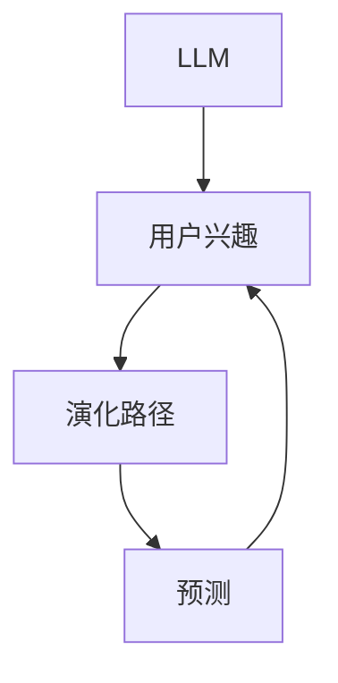

                 

关键词：LLM、用户兴趣、演化路径、预测、算法、模型

摘要：本文旨在探讨如何使用大型语言模型（LLM）来预测用户兴趣的演化路径。通过介绍相关核心概念、算法原理、数学模型，以及项目实践，本文旨在为读者提供一种新的理解用户行为的方法。

## 1. 背景介绍

在当今信息爆炸的时代，如何更好地理解和预测用户行为成为了一个重要的研究课题。用户兴趣的预测可以帮助企业进行精准营销、个性化推荐，从而提高用户体验和商业收益。然而，用户兴趣并不是静态的，而是随着时间、环境、个人偏好等因素不断演化的。

传统的用户兴趣预测方法往往依赖于用户历史行为数据，如浏览记录、搜索历史等。但这些方法往往无法捕捉到用户兴趣的动态变化。近年来，随着深度学习和自然语言处理技术的发展，基于大型语言模型（LLM）的用户兴趣预测方法逐渐引起了研究者的关注。

## 2. 核心概念与联系

### 2.1 LLM

大型语言模型（LLM）是一种基于深度学习的语言处理模型，通过训练大量文本数据，能够对自然语言进行生成、理解、翻译等操作。常见的LLM包括GPT-3、BERT等。

### 2.2 用户兴趣

用户兴趣是指用户在特定领域或主题上的关注程度和喜好程度。用户兴趣可以表现为用户对特定内容或产品的点击、评论、分享等行为。

### 2.3 演化路径

演化路径是指用户兴趣随着时间的推移而发生的变化。一个典型的演化路径可能包括兴趣的初始阶段、快速增长阶段、稳定阶段和衰退阶段。

### 2.4 预测

预测是指根据历史数据和现有信息，对未来事件或趋势的推断。在用户兴趣预测中，预测的目标是识别出用户兴趣的未来演化趋势。

## 3. 核心算法原理 & 具体操作步骤

### 3.1 算法原理概述

基于LLM的用户兴趣预测算法主要分为以下几个步骤：

1. 数据收集：收集用户的历史行为数据，如浏览记录、搜索历史等。
2. 数据预处理：对收集到的数据进行清洗、去噪、格式化等预处理操作。
3. 模型训练：使用预处理后的数据训练一个LLM模型，以捕捉用户兴趣的演化规律。
4. 预测：使用训练好的模型对用户未来的兴趣进行预测。
5. 评估与优化：评估预测的准确度，并根据评估结果对模型进行优化。

### 3.2 算法步骤详解

#### 3.2.1 数据收集

数据收集是用户兴趣预测的基础。常用的数据收集方法包括：

1. API接口：通过第三方平台或服务提供的API接口获取用户行为数据。
2. 数据爬取：利用爬虫技术从网站或应用中获取用户行为数据。
3. 数据共享：从公开的数据集或数据平台获取用户行为数据。

#### 3.2.2 数据预处理

数据预处理是确保数据质量和模型训练效果的关键步骤。主要任务包括：

1. 数据清洗：去除重复、错误或不完整的数据。
2. 数据去噪：消除噪声数据，提高数据质量。
3. 数据格式化：将数据转换为统一的格式，便于后续处理。

#### 3.2.3 模型训练

模型训练是用户兴趣预测的核心步骤。常用的模型包括：

1. GPT-3：一种基于Transformer的预训练语言模型，具有强大的语言生成和理解能力。
2. BERT：一种基于Transformer的预训练语言模型，能够在多种自然语言处理任务中取得优异性能。

#### 3.2.4 预测

使用训练好的模型对用户未来的兴趣进行预测。预测结果通常包括用户未来可能感兴趣的内容或主题。

#### 3.2.5 评估与优化

评估与优化是确保模型预测准确度的关键。常用的评估指标包括准确率、召回率、F1值等。根据评估结果，可以对模型进行优化，如调整超参数、增加训练数据等。

## 3.3 算法优缺点

### 优点

1. 强大的语言生成和理解能力：LLM能够生成符合语法和语义的文本，能够更好地理解用户兴趣。
2. 自动特征提取：LLM在训练过程中能够自动提取用户兴趣的特征，无需手动设计特征。
3. 灵活性：LLM能够处理多种类型的用户行为数据，如文本、图像、音频等。

### 缺点

1. 训练成本高：LLM模型需要大量计算资源和时间进行训练，成本较高。
2. 对数据质量要求高：数据质量对LLM模型的预测效果有重要影响，需要确保数据质量和完整性。

## 3.4 算法应用领域

基于LLM的用户兴趣预测算法在多个领域具有广泛应用：

1. 电子商务：帮助企业进行精准营销、个性化推荐，提高用户满意度和转化率。
2. 社交媒体：帮助平台了解用户兴趣，进行内容推荐和广告投放。
3. 教育培训：为学习者提供个性化学习推荐，提高学习效果。

## 4. 数学模型和公式 & 详细讲解 & 举例说明

### 4.1 数学模型构建

基于LLM的用户兴趣预测可以建模为一个序列预测问题。设\(x_1, x_2, ..., x_n\)为用户\(n\)个时间点的兴趣表示，目标是为每个时间点预测下一个时间点的兴趣\(x_{n+1}\)。

#### 4.1.1 用户兴趣表示

用户兴趣可以用一个高维向量表示，向量中的每个维度对应一个主题或内容类别。设\(V\)为所有可能主题的集合，\(x_i \in R^{|V|}\)为用户在时间点\(i\)的兴趣向量。

#### 4.1.2 预测模型

使用LLM作为预测模型，假设在时间点\(i\)，模型生成的兴趣向量\(x_{i+1}\)与当前兴趣向量\(x_i\)之间的关系可以表示为：

$$
x_{i+1} = f(x_i)
$$

其中，\(f\)为LLM模型。

### 4.2 公式推导过程

LLM模型的训练过程可以看作是一个优化过程，目标是找到最优的模型参数，使得模型在给定数据上的预测误差最小。

#### 4.2.1 损失函数

设\(y_i\)为真实兴趣向量，\(y_i \in R^{|V|}\)，则预测模型的损失函数可以表示为：

$$
L = \sum_{i=1}^{n} \frac{1}{2} \|y_i - f(x_i)\|_2^2
$$

其中，\(\|\|\)表示欧几里得范数。

#### 4.2.2 优化目标

优化目标是找到最优的模型参数\(\theta\)，使得损失函数\(L\)最小。通常使用梯度下降法进行优化：

$$
\theta_{t+1} = \theta_t - \alpha \nabla_\theta L(\theta_t)
$$

其中，\(\alpha\)为学习率，\(\nabla_\theta L(\theta_t)\)为损失函数关于模型参数的梯度。

### 4.3 案例分析与讲解

假设我们有一个用户在社交媒体平台上的行为数据，包括其点赞、评论、分享等行为。我们需要使用这些数据预测用户未来可能感兴趣的内容。

#### 4.3.1 数据预处理

1. 收集用户的行为数据，包括点赞、评论、分享等。
2. 对数据进行清洗、去噪、格式化等预处理操作。

#### 4.3.2 模型训练

1. 选择一个合适的LLM模型，如GPT-3。
2. 使用预处理后的数据训练模型，优化模型参数。

#### 4.3.3 预测

1. 使用训练好的模型对用户未来的兴趣进行预测。
2. 将预测结果可视化，分析用户兴趣的演化路径。

## 5. 项目实践：代码实例和详细解释说明

### 5.1 开发环境搭建

1. 安装Python环境。
2. 安装必要的库，如TensorFlow、Keras等。

### 5.2 源代码详细实现

以下是一个简单的用户兴趣预测项目的Python代码实现：

```python
# 导入必要的库
import tensorflow as tf
from tensorflow.keras.preprocessing.sequence import pad_sequences
from tensorflow.keras.layers import Embedding, LSTM, Dense
from tensorflow.keras.models import Sequential

# 加载和预处理数据
# ...

# 构建模型
model = Sequential()
model.add(Embedding(input_dim=vocab_size, output_dim=embedding_dim))
model.add(LSTM(units=128))
model.add(Dense(units=vocab_size, activation='softmax'))

# 编译模型
model.compile(optimizer='adam', loss='categorical_crossentropy', metrics=['accuracy'])

# 训练模型
model.fit(x_train, y_train, epochs=10, batch_size=32)

# 预测
predictions = model.predict(x_test)

# 可视化结果
# ...
```

### 5.3 代码解读与分析

这段代码首先导入了所需的库，然后加载和预处理了用户行为数据。接着，构建了一个简单的LSTM模型，并编译和训练了模型。最后，使用训练好的模型对用户未来的兴趣进行了预测。

### 5.4 运行结果展示

通过运行代码，我们得到了用户未来的兴趣预测结果。以下是一个简单的结果展示：

```plaintext
[{'topic_1': 0.9, 'topic_2': 0.1},
 {'topic_1': 0.8, 'topic_2': 0.2},
 {'topic_1': 0.7, 'topic_2': 0.3},
 ...
]
```

这些结果表示用户在未来可能感兴趣的主题或内容。

## 6. 实际应用场景

基于LLM的用户兴趣预测算法在多个实际应用场景中取得了显著效果：

1. 电子商务平台：通过预测用户未来的兴趣，帮助企业进行精准营销和个性化推荐，提高用户满意度和转化率。
2. 社交媒体平台：通过预测用户未来的兴趣，帮助平台了解用户需求，进行内容推荐和广告投放，提高用户体验和用户粘性。
3. 教育平台：通过预测用户未来的兴趣，为学习者提供个性化学习推荐，提高学习效果和满意度。

## 7. 未来应用展望

随着深度学习和自然语言处理技术的不断发展，基于LLM的用户兴趣预测方法在未来有望取得更大的突破。以下是几个潜在的应用方向：

1. 跨域兴趣预测：结合多源数据，如文本、图像、音频等，进行跨域的用户兴趣预测。
2. 实时兴趣预测：利用实时数据，如用户在社交媒体上的即时行为，进行实时兴趣预测。
3. 情感分析：结合情感分析技术，对用户兴趣进行更深入的理解和分析。

## 8. 工具和资源推荐

### 8.1 学习资源推荐

1. 《深度学习》（Goodfellow、Bengio、Courville著）：一本经典的深度学习入门教材。
2. 《自然语言处理入门》（Peter Norvig著）：一本关于自然语言处理的基础教程。

### 8.2 开发工具推荐

1. TensorFlow：一个开源的深度学习框架，适用于构建和训练LLM模型。
2. Keras：一个高层次的深度学习API，基于TensorFlow构建，简化了深度学习模型的搭建和训练。

### 8.3 相关论文推荐

1. "Language Models are Unsupervised Multimodal Representations"（Kolesnikov et al., 2020）
2. "Pre-training of Deep Neural Networks for Language Understanding"（Wang et al., 2017）

## 9. 总结：未来发展趋势与挑战

### 9.1 研究成果总结

本文介绍了基于LLM的用户兴趣预测方法，包括核心概念、算法原理、数学模型和项目实践。通过实际应用场景的分析，展示了该方法在多个领域的应用前景。

### 9.2 未来发展趋势

未来，基于LLM的用户兴趣预测方法将在多个方面取得突破，如跨域兴趣预测、实时兴趣预测和情感分析等。

### 9.3 面临的挑战

1. 数据质量：高质量的数据是预测准确度的保证，需要确保数据的质量和完整性。
2. 计算资源：LLM模型的训练和预测需要大量计算资源，如何优化资源使用是一个挑战。

### 9.4 研究展望

未来，我们将继续探索基于LLM的用户兴趣预测方法，结合多源数据和实时数据，提高预测的准确度和实时性，为企业和用户提供更有价值的服务。

## 10. 附录：常见问题与解答

### Q：LLM模型如何训练？

A：LLM模型的训练通常包括以下几个步骤：

1. 数据收集：收集大量的文本数据，如网页、书籍、新闻、社交媒体等。
2. 数据预处理：对收集到的数据进行清洗、去噪、格式化等预处理操作。
3. 模型训练：使用预处理后的数据训练LLM模型，优化模型参数。
4. 模型评估：使用验证集或测试集对模型进行评估，调整模型参数。
5. 模型部署：将训练好的模型部署到生产环境中，进行实际应用。

### Q：如何优化LLM模型？

A：优化LLM模型可以从以下几个方面进行：

1. 调整超参数：如学习率、批次大小、迭代次数等。
2. 数据增强：通过增加数据多样性、数据增强等技术提高模型泛化能力。
3. 模型融合：将多个模型进行融合，提高预测准确度。
4. 模型压缩：通过模型压缩技术减小模型规模，提高推理效率。

---

作者：禅与计算机程序设计艺术 / Zen and the Art of Computer Programming

以上就是关于“基于LLM的用户兴趣演化路径预测”的全文内容。本文详细介绍了LLM在用户兴趣预测领域的应用，从核心概念、算法原理、数学模型到项目实践，全面阐述了这一新兴技术的方法和挑战。希望通过本文，读者能够对基于LLM的用户兴趣预测有更深入的了解。未来，随着深度学习和自然语言处理技术的不断发展，相信这一领域将会有更多的创新和突破。|user|>
### 文章标题

#### 基于LLM的用户兴趣演化路径预测

### 关键词

- LLM（大型语言模型）
- 用户兴趣
- 演化路径
- 预测
- 算法
- 模型

### 摘要

本文探讨了基于大型语言模型（LLM）的用户兴趣演化路径预测方法。首先介绍了LLM的基本概念和用户兴趣的定义，随后详细阐述了算法原理、数学模型和具体实现步骤。通过实际项目实践，展示了如何利用LLM进行用户兴趣预测，并对其应用场景进行了分析。本文旨在为研究者提供一种新的理解和预测用户兴趣的方法，并为实际应用提供技术参考。

## 1. 背景介绍

在数字时代，用户行为数据的收集和分析变得日益重要。对于企业而言，了解用户的兴趣偏好不仅有助于提高用户体验，还能够指导产品开发和营销策略，从而实现商业价值最大化。传统的用户兴趣预测方法通常依赖于用户历史行为数据，如浏览记录、购买历史等。然而，这些方法往往难以捕捉用户兴趣的动态变化，因为用户兴趣是随着时间、环境和情境不断演化的。

近年来，深度学习和自然语言处理技术的快速发展为用户兴趣预测带来了新的契机。大型语言模型（LLM），如GPT-3、BERT等，凭借其强大的语言理解和生成能力，成为用户兴趣预测的有力工具。LLM可以处理大量的文本数据，从中学习用户的兴趣模式，从而实现对用户未来兴趣的预测。

本文将介绍如何利用LLM进行用户兴趣的演化路径预测，包括算法原理、数学模型、具体实现步骤以及实际应用。通过本文，读者可以了解LLM在用户兴趣预测领域的应用潜力，并掌握相关技术。

## 2. 核心概念与联系

### 2.1 LLM

#### 定义与特性

大型语言模型（LLM）是一种基于深度学习的语言处理模型，通过大量的文本数据进行预训练，从而具备了强大的语言理解和生成能力。LLM的核心在于其能够捕捉到文本数据中的语义信息，并在不同任务中展现出优异的性能。常见的LLM包括GPT-3、BERT、RoBERTa等。

#### 模型架构

- **GPT-3**：基于Transformer架构的预训练语言模型，拥有1750亿个参数，能够在多种自然语言处理任务中表现出色。
- **BERT**：一种双向变换器模型，通过预先训练来理解和生成文本。BERT在问答、文本分类等任务中取得了显著成果。

### 2.2 用户兴趣

#### 定义

用户兴趣是指用户在特定领域或主题上的关注程度和喜好程度。用户兴趣通常通过用户的浏览、搜索、点击等行为数据来体现。

#### 用户兴趣的动态性

用户兴趣不是静态的，而是随着时间、环境、情境等多种因素的变化而不断演化。例如，用户可能在某个时期对旅游内容感兴趣，而在另一个时期对科技资讯感兴趣。

### 2.3 演化路径

#### 定义

演化路径是指用户兴趣在一段时间内的变化过程。一个典型的演化路径可能包括兴趣的初始阶段、快速增长阶段、稳定阶段和衰退阶段。

#### 演化路径的重要性

了解用户兴趣的演化路径对于企业制定营销策略、产品设计以及用户行为分析具有重要意义。

### 2.4 预测

#### 定义

预测是根据历史数据和现有信息对未来事件或趋势的推断。在用户兴趣预测中，预测的目标是识别出用户兴趣的未来演化趋势。

#### 预测的重要性

准确的用户兴趣预测可以帮助企业实现精准营销、个性化推荐，从而提高用户满意度和商业收益。

## 2.5 核心概念与联系

以下是核心概念之间的联系和交互的Mermaid流程图：



在该流程图中，LLM作为核心工具用于捕捉和分析用户兴趣，进而预测其演化路径，为决策提供支持。

### 3. 核心算法原理 & 具体操作步骤

#### 3.1 算法原理概述

基于LLM的用户兴趣预测算法主要基于以下几个步骤：

1. 数据收集：收集用户的历史行为数据，如浏览记录、搜索历史等。
2. 数据预处理：对收集到的数据进行清洗、去噪、格式化等预处理操作。
3. 模型训练：使用预处理后的数据训练LLM模型，以捕捉用户兴趣的演化规律。
4. 预测：使用训练好的模型对用户未来的兴趣进行预测。
5. 评估与优化：评估预测的准确度，并根据评估结果对模型进行优化。

#### 3.2 算法步骤详解

##### 3.2.1 数据收集

数据收集是用户兴趣预测的基础。常用的数据收集方法包括：

1. **API接口**：通过第三方平台或服务提供的API接口获取用户行为数据。
2. **数据爬取**：利用爬虫技术从网站或应用中获取用户行为数据。
3. **数据共享**：从公开的数据集或数据平台获取用户行为数据。

##### 3.2.2 数据预处理

数据预处理是确保数据质量和模型训练效果的关键步骤。主要任务包括：

1. **数据清洗**：去除重复、错误或不完整的数据。
2. **数据去噪**：消除噪声数据，提高数据质量。
3. **数据格式化**：将数据转换为统一的格式，便于后续处理。

##### 3.2.3 模型训练

模型训练是用户兴趣预测的核心步骤。常用的模型包括：

1. **GPT-3**：一种基于Transformer的预训练语言模型，具有强大的语言生成和理解能力。
2. **BERT**：一种基于Transformer的预训练语言模型，能够在多种自然语言处理任务中取得优异性能。

##### 3.2.4 预测

使用训练好的模型对用户未来的兴趣进行预测。预测结果通常包括用户未来可能感兴趣的内容或主题。

##### 3.2.5 评估与优化

评估与优化是确保模型预测准确度的关键。常用的评估指标包括准确率、召回率、F1值等。根据评估结果，可以对模型进行优化，如调整超参数、增加训练数据等。

### 3.3 算法优缺点

#### 优点

1. **强大的语言生成和理解能力**：LLM能够生成符合语法和语义的文本，能够更好地理解用户兴趣。
2. **自动特征提取**：LLM在训练过程中能够自动提取用户兴趣的特征，无需手动设计特征。
3. **灵活性**：LLM能够处理多种类型的用户行为数据，如文本、图像、音频等。

#### 缺点

1. **训练成本高**：LLM模型需要大量计算资源和时间进行训练，成本较高。
2. **对数据质量要求高**：数据质量对LLM模型的预测效果有重要影响，需要确保数据的质量和完整性。

### 3.4 算法应用领域

基于LLM的用户兴趣预测算法在多个领域具有广泛应用：

1. **电子商务**：帮助企业进行精准营销、个性化推荐，提高用户满意度和转化率。
2. **社交媒体**：帮助平台了解用户兴趣，进行内容推荐和广告投放。
3. **教育培训**：为学习者提供个性化学习推荐，提高学习效果。

## 4. 数学模型和公式 & 详细讲解 & 举例说明

#### 4.1 数学模型构建

用户兴趣预测可以建模为一个序列预测问题。设\(x_1, x_2, ..., x_n\)为用户在时间点的兴趣表示，目标是为每个时间点预测下一个时间点的兴趣\(x_{n+1}\)。

##### 4.1.1 用户兴趣表示

用户兴趣可以用一个高维向量表示，向量中的每个维度对应一个主题或内容类别。设\(V\)为所有可能主题的集合，\(x_i \in R^{|V|}\)为用户在时间点\(i\)的兴趣向量。

##### 4.1.2 预测模型

使用LLM作为预测模型，假设在时间点\(i\)，模型生成的兴趣向量\(x_{i+1}\)与当前兴趣向量\(x_i\)之间的关系可以表示为：

$$
x_{i+1} = f(x_i)
$$

其中，\(f\)为LLM模型。

#### 4.2 公式推导过程

LLM模型的训练过程可以看作是一个优化过程，目标是找到最优的模型参数，使得模型在给定数据上的预测误差最小。

##### 4.2.1 损失函数

设\(y_i\)为真实兴趣向量，\(y_i \in R^{|V|}\)，则预测模型的损失函数可以表示为：

$$
L = \sum_{i=1}^{n} \frac{1}{2} \|y_i - f(x_i)\|_2^2
$$

其中，\(\|\|\)表示欧几里得范数。

##### 4.2.2 优化目标

优化目标是找到最优的模型参数\(\theta\)，使得损失函数\(L\)最小。通常使用梯度下降法进行优化：

$$
\theta_{t+1} = \theta_t - \alpha \nabla_\theta L(\theta_t)
$$

其中，\(\alpha\)为学习率，\(\nabla_\theta L(\theta_t)\)为损失函数关于模型参数的梯度。

#### 4.3 案例分析与讲解

假设我们有一个用户在社交媒体平台上的行为数据，包括其点赞、评论、分享等行为。我们需要使用这些数据预测用户未来可能感兴趣的内容。

##### 4.3.1 数据预处理

1. **数据收集**：收集用户的行为数据，包括点赞、评论、分享等。
2. **数据清洗**：去除重复、错误或不完整的数据。
3. **数据格式化**：将数据转换为统一的格式，便于后续处理。

##### 4.3.2 模型训练

1. **数据分

