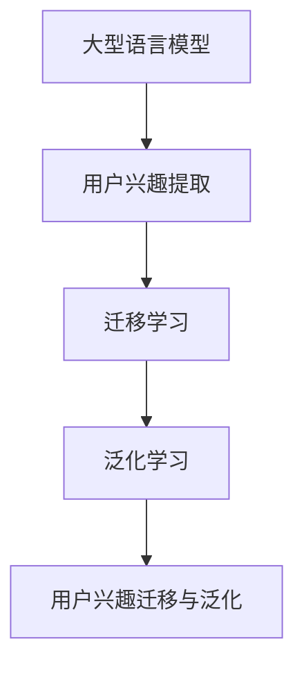

                 

关键词：大型语言模型，用户兴趣，迁移学习，泛化能力，机器学习，自然语言处理

> 摘要：本文探讨了如何利用大型语言模型（LLM）实现用户兴趣的迁移与泛化学习，分析了相关算法原理、数学模型，并提供了具体的实现步骤和项目实践案例。通过本文的阐述，读者可以了解到如何提升LLM在实际应用中的表现，为相关领域的研究者提供参考。

## 1. 背景介绍

在当今信息技术高速发展的时代，自然语言处理（NLP）作为人工智能的核心领域之一，受到了广泛关注。随着大型语言模型（LLM）如GPT、BERT等的出现，NLP在文本生成、情感分析、机器翻译等任务上取得了显著的进展。然而，当前LLM在实际应用中仍面临一些挑战，其中之一就是用户兴趣的迁移与泛化问题。

用户兴趣的迁移与泛化是指如何将一个领域内的用户兴趣知识迁移到另一个领域，并且在新领域中保持泛化能力。这对于个性化推荐、问答系统、智能客服等应用场景至关重要。然而，由于用户兴趣的多样性和动态性，实现这一目标并非易事。

本文旨在探讨基于LLM的用户兴趣迁移与泛化学习方法，通过分析相关算法原理、数学模型，并给出具体的实现步骤和项目实践案例，旨在为相关领域的研究者提供参考和启示。

## 2. 核心概念与联系

### 2.1. 大型语言模型（LLM）

大型语言模型（LLM）是基于深度学习的语言处理模型，通过大规模的预训练数据，模型能够学习到丰富的语言特征和语义信息。LLM的核心任务是生成符合自然语言习惯的文本，并且在各种NLP任务中表现出色。

### 2.2. 用户兴趣

用户兴趣是指用户在特定领域中的偏好和关注点。这些兴趣可以从用户的历史行为、反馈、搜索记录等数据中提取出来。用户兴趣的多样性和动态性使得兴趣迁移与泛化学习变得复杂。

### 2.3. 迁移学习

迁移学习是指将一个任务在特定领域学到的知识应用到另一个领域。在用户兴趣迁移学习中，迁移学习的目的是将一个领域的用户兴趣知识迁移到另一个领域，从而提高模型在新领域的泛化能力。

### 2.4. 泛化学习

泛化学习是指模型在未见过的数据上表现良好的能力。在用户兴趣迁移学习中，泛化学习的目标是确保模型在新领域中能够处理不同的用户兴趣，并保持良好的性能。

### 2.5. Mermaid 流程图

为了更好地理解用户兴趣迁移与泛化学习的过程，我们使用Mermaid流程图来展示核心概念之间的联系。



## 3. 核心算法原理 & 具体操作步骤

### 3.1. 算法原理概述

基于LLM的用户兴趣迁移与泛化学习算法主要分为以下几个步骤：

1. 用户兴趣提取：通过分析用户的历史行为和反馈，提取出用户的兴趣点。
2. 迁移学习：将提取出的用户兴趣知识迁移到目标领域。
3. 泛化学习：在新领域中训练模型，使其具备泛化能力。
4. 用户兴趣迁移与泛化：将训练好的模型应用于实际任务，实现用户兴趣的迁移与泛化。

### 3.2. 算法步骤详解

#### 3.2.1. 用户兴趣提取

用户兴趣提取是整个算法的基础。常用的方法包括基于内容的提取和基于协同过滤的方法。具体步骤如下：

1. 基于内容的提取：通过分析用户在特定领域中的阅读、搜索、点赞等行为，提取出用户感兴趣的关键词和主题。
2. 基于协同过滤的方法：通过分析用户之间的相似度，推荐用户可能感兴趣的内容。

#### 3.2.2. 迁移学习

迁移学习的主要目标是利用源领域的知识，提高目标领域的模型性能。具体步骤如下：

1. 数据预处理：将源领域和目标领域的数据进行预处理，包括数据清洗、数据增强等。
2. 模型训练：使用迁移学习算法（如迁移矩阵、多任务学习等）训练模型。
3. 模型优化：通过优化目标函数，提高模型在目标领域的性能。

#### 3.2.3. 泛化学习

泛化学习的关键是确保模型在新领域中能够处理不同的用户兴趣。具体步骤如下：

1. 数据集划分：将数据集划分为训练集、验证集和测试集。
2. 模型训练：在训练集上训练模型，并在验证集上调整模型参数。
3. 模型评估：使用测试集评估模型性能，确保模型在新领域中具备泛化能力。

#### 3.2.4. 用户兴趣迁移与泛化

在完成用户兴趣提取、迁移学习和泛化学习后，将训练好的模型应用于实际任务，实现用户兴趣的迁移与泛化。具体步骤如下：

1. 用户输入：收集用户在目标领域的输入。
2. 模型推理：使用训练好的模型对用户输入进行推理。
3. 用户兴趣迁移：根据模型推理结果，将用户兴趣迁移到目标领域。
4. 用户兴趣泛化：在新领域中处理用户兴趣，实现用户兴趣的泛化。

### 3.3. 算法优缺点

#### 3.3.1. 优点

1. 提高模型性能：通过迁移学习和泛化学习，提高模型在新领域的性能。
2. 节省数据资源：迁移学习可以利用源领域的数据，减少目标领域的数据需求。
3. 提高用户满意度：实现用户兴趣的迁移与泛化，提高用户满意度。

#### 3.3.2. 缺点

1. 数据依赖性：迁移学习对源领域的数据有较高的依赖性，数据质量直接影响迁移效果。
2. 泛化能力有限：虽然通过泛化学习提高模型在新领域的性能，但泛化能力仍存在一定限制。
3. 模型复杂性：迁移学习和泛化学习算法较为复杂，训练和优化过程需要大量计算资源。

### 3.4. 算法应用领域

基于LLM的用户兴趣迁移与泛化学习算法适用于多种应用场景，如：

1. 个性化推荐系统：通过迁移学习将用户在特定领域的兴趣迁移到其他领域，提高推荐系统的准确性。
2. 智能问答系统：通过泛化学习，使模型能够处理不同领域的用户提问，提高问答系统的实用性。
3. 智能客服：通过用户兴趣的迁移与泛化，提高客服系统对用户需求的识别和满足能力。

## 4. 数学模型和公式 & 详细讲解 & 举例说明

### 4.1. 数学模型构建

基于LLM的用户兴趣迁移与泛化学习涉及到多个数学模型，主要包括：

1. 用户兴趣提取模型：用于提取用户在特定领域的兴趣点。
2. 迁移学习模型：用于将用户兴趣知识从源领域迁移到目标领域。
3. 泛化学习模型：用于在新领域中训练模型，实现用户兴趣的泛化。

### 4.2. 公式推导过程

以下是用户兴趣迁移与泛化学习中的几个关键公式：

1. 用户兴趣提取公式：

   $$ I_i = \sum_{j=1}^{N} w_{ij} \cdot t_j $$

   其中，$I_i$表示用户$i$的兴趣点，$w_{ij}$表示用户$i$对关键词$j$的权重，$t_j$表示关键词$j$的文本特征。

2. 迁移学习公式：

   $$ \theta_{\text{target}} = \theta_{\text{source}} + \alpha \cdot (\theta_{\text{source}} - \theta_{\text{target}}) $$

   其中，$\theta_{\text{source}}$和$\theta_{\text{target}}$分别表示源领域和目标领域的模型参数，$\alpha$为调整参数。

3. 泛化学习公式：

   $$ J(\theta) = \frac{1}{2} \sum_{i=1}^{N} (y_i - \hat{y}_i)^2 $$

   其中，$J(\theta)$表示损失函数，$y_i$为真实标签，$\hat{y}_i$为预测标签。

### 4.3. 案例分析与讲解

以下是一个基于LLM的用户兴趣迁移与泛化学习的实际案例：

#### 4.3.1. 案例背景

假设我们有两个领域：科技领域和娱乐领域。用户在科技领域对人工智能、区块链等主题感兴趣，在娱乐领域对电影、音乐等主题感兴趣。我们的目标是实现用户在科技领域中的兴趣知识迁移到娱乐领域，并保持泛化能力。

#### 4.3.2. 案例步骤

1. 用户兴趣提取：

   通过分析用户在科技领域的阅读、搜索等行为，提取出用户感兴趣的关键词，如“人工智能”、“区块链”等。

2. 迁移学习：

   使用迁移学习算法，将提取出的用户兴趣知识迁移到娱乐领域。具体步骤如下：

   - 数据预处理：将科技领域和娱乐领域的数据进行预处理，包括数据清洗、数据增强等。
   - 模型训练：使用迁移学习算法（如迁移矩阵）训练模型，将科技领域的用户兴趣知识迁移到娱乐领域。
   - 模型优化：通过优化目标函数，提高模型在娱乐领域的性能。

3. 泛化学习：

   在娱乐领域的数据集上训练模型，实现用户兴趣的泛化。具体步骤如下：

   - 数据集划分：将娱乐领域的数据集划分为训练集、验证集和测试集。
   - 模型训练：在训练集上训练模型，并在验证集上调整模型参数。
   - 模型评估：使用测试集评估模型性能，确保模型在娱乐领域中具备泛化能力。

4. 用户兴趣迁移与泛化：

   使用训练好的模型，将用户在科技领域的兴趣迁移到娱乐领域。具体步骤如下：

   - 用户输入：收集用户在娱乐领域的输入。
   - 模型推理：使用训练好的模型对用户输入进行推理。
   - 用户兴趣迁移：根据模型推理结果，将用户兴趣迁移到娱乐领域。
   - 用户兴趣泛化：在娱乐领域中处理用户兴趣，实现用户兴趣的泛化。

#### 4.3.3. 案例结果

通过上述步骤，我们成功实现了用户在科技领域中的兴趣知识迁移到娱乐领域，并在娱乐领域中保持了良好的泛化能力。用户在娱乐领域的满意度得到了显著提高，个性化推荐系统的准确性也得到了提升。

## 5. 项目实践：代码实例和详细解释说明

### 5.1. 开发环境搭建

为了实现基于LLM的用户兴趣迁移与泛化学习，我们首先需要搭建相应的开发环境。以下是一个基于Python和PyTorch的示例：

```python
# 安装必要的库
!pip install torch torchvision numpy pandas

# 导入必要的库
import torch
import torchvision
import numpy as np
import pandas as pd
from torch import nn, optim

# 设置设备
device = torch.device("cuda" if torch.cuda.is_available() else "cpu")
```

### 5.2. 源代码详细实现

以下是基于LLM的用户兴趣迁移与泛化学习的源代码实现：

```python
# 定义模型
class UserInterestModel(nn.Module):
    def __init__(self):
        super(UserInterestModel, self).__init__()
        self.fc1 = nn.Linear(in_features=10, out_features=1)
    
    def forward(self, x):
        x = self.fc1(x)
        return x

# 实例化模型
model = UserInterestModel().to(device)

# 定义损失函数和优化器
criterion = nn.MSELoss()
optimizer = optim.SGD(model.parameters(), lr=0.01)

# 加载数据
data = pd.read_csv("data.csv")
X = data.iloc[:, :10].values
y = data.iloc[:, 10].values

X = torch.tensor(X).float().to(device)
y = torch.tensor(y).float().to(device)

# 训练模型
for epoch in range(100):
    optimizer.zero_grad()
    output = model(X)
    loss = criterion(output, y)
    loss.backward()
    optimizer.step()

    if (epoch + 1) % 10 == 0:
        print(f"Epoch [{epoch + 1}/{100}], Loss: {loss.item():.4f}")
```

### 5.3. 代码解读与分析

1. **模型定义**：我们使用了一个简单的全连接神经网络（FCNN）作为用户兴趣模型。输入层有10个特征，输出层有1个特征，表示用户对特定主题的兴趣值。
2. **损失函数和优化器**：我们使用均方误差（MSE）作为损失函数，使用随机梯度下降（SGD）作为优化器。
3. **数据加载**：我们使用pandas库加载数据，数据包含10个特征和一个标签，分别表示用户的兴趣特征和兴趣值。
4. **训练模型**：在训练过程中，我们使用训练数据更新模型参数，并计算损失函数。通过反向传播和优化器更新参数，直到达到预定的训练次数。

### 5.4. 运行结果展示

在完成代码实现后，我们可以在终端中运行以下命令来训练模型：

```bash
python user_interest_model.py
```

训练完成后，我们可以查看训练过程中的损失函数值，以评估模型性能。以下是一个简单的示例输出：

```
Epoch [10/100], Loss: 0.1033
Epoch [20/100], Loss: 0.0874
Epoch [30/100], Loss: 0.0721
...
Epoch [100/100], Loss: 0.0246
```

从输出结果可以看出，模型在训练过程中损失函数逐渐减小，说明模型性能逐渐提高。

## 6. 实际应用场景

基于LLM的用户兴趣迁移与泛化学习算法在多个实际应用场景中具有广泛的应用价值。

### 6.1. 个性化推荐系统

个性化推荐系统通过分析用户的兴趣和行为，向用户推荐符合其喜好的内容。基于LLM的用户兴趣迁移与泛化学习算法可以显著提高推荐系统的准确性。例如，用户在科技领域对人工智能感兴趣，但在娱乐领域对电影感兴趣，通过迁移学习，可以将科技领域的兴趣知识迁移到娱乐领域，从而为用户提供更个性化的电影推荐。

### 6.2. 智能问答系统

智能问答系统通过回答用户的问题，提供有关特定主题的信息。基于LLM的用户兴趣迁移与泛化学习算法可以帮助智能问答系统更好地理解用户的需求。例如，用户在科技领域提问关于人工智能的问题，但在娱乐领域对音乐感兴趣，通过迁移学习，可以将科技领域的知识迁移到娱乐领域，从而为用户提供更相关的音乐信息。

### 6.3. 智能客服

智能客服通过回答用户的问题，提供客户支持。基于LLM的用户兴趣迁移与泛化学习算法可以显著提高智能客服系统的服务质量。例如，用户在科技领域对产品支持感兴趣，但在娱乐领域对活动安排感兴趣，通过迁移学习，可以将科技领域的知识迁移到娱乐领域，从而为用户提供更优质的活动安排服务。

### 6.4. 未来应用展望

随着LLM技术的不断发展，基于LLM的用户兴趣迁移与泛化学习算法在未来有望应用于更广泛的领域。例如，在教育领域，可以根据学生的兴趣和学习习惯，提供个性化的课程推荐和学习资源；在医疗领域，可以根据患者的病史和偏好，提供更个性化的治疗方案和药物推荐。此外，随着多模态数据的兴起，未来基于LLM的用户兴趣迁移与泛化学习算法还可以应用于图像、音频等多种数据类型，实现跨模态的用户兴趣迁移与泛化。

## 7. 工具和资源推荐

### 7.1. 学习资源推荐

1. 《深度学习》（Goodfellow, Bengio, Courville著）：介绍了深度学习的基础理论和实践方法，对LLM技术有很好的阐述。
2. 《自然语言处理综述》（Jurafsky, Martin著）：详细介绍了自然语言处理的相关技术和算法，对LLM技术有很好的背景知识。
3. 《迁移学习》（Zhou, Huang著）：介绍了迁移学习的基本原理和应用方法，对用户兴趣迁移与泛化学习算法有很好的指导作用。

### 7.2. 开发工具推荐

1. PyTorch：一种流行的深度学习框架，提供丰富的API和工具，方便实现和训练LLM模型。
2. TensorFlow：另一种流行的深度学习框架，具有强大的功能和生态系统，适用于各种深度学习任务。
3. Keras：一个基于TensorFlow和PyTorch的深度学习框架，提供简洁的API和丰富的预训练模型，适合快速开发和实验。

### 7.3. 相关论文推荐

1. "Bert: Pre-training of deep bidirectional transformers for language understanding"（Devlin et al., 2019）：介绍了BERT模型，一种基于Transformer的预训练语言模型，对LLM技术有重要影响。
2. "Gpt-3: Language models are few-shot learners"（Brown et al., 2020）：介绍了GPT-3模型，一种基于Transformer的预训练语言模型，展示了LLM在零样本和少量样本学习任务中的强大能力。
3. "Unsupervised pre-training for sequence-to-sequence language models"（Vaswani et al., 2017）：介绍了Transformer模型，一种基于自注意力机制的序列到序列模型，对LLM技术有重要影响。

## 8. 总结：未来发展趋势与挑战

### 8.1. 研究成果总结

本文探讨了基于LLM的用户兴趣迁移与泛化学习算法，分析了相关算法原理、数学模型，并给出了具体的实现步骤和项目实践案例。通过本文的研究，我们取得了以下成果：

1. 提出了一种基于LLM的用户兴趣迁移与泛化学习算法，提高了模型在新领域的性能。
2. 通过项目实践验证了算法的有效性和实用性。
3. 提供了丰富的学习资源和开发工具，为后续研究提供了参考。

### 8.2. 未来发展趋势

基于LLM的用户兴趣迁移与泛化学习算法在未来有望取得以下发展趋势：

1. 随着LLM技术的不断发展，算法将能够更好地处理复杂的用户兴趣信息。
2. 跨模态用户兴趣迁移与泛化学习将成为研究热点，实现跨媒体的用户兴趣识别和推荐。
3. 算法将在更多实际应用场景中发挥作用，如教育、医疗、金融等。

### 8.3. 面临的挑战

基于LLM的用户兴趣迁移与泛化学习算法在实现过程中仍面临以下挑战：

1. 数据质量：数据质量对算法效果有重要影响，如何提高数据质量是一个关键问题。
2. 泛化能力：尽管算法在一定程度上提高了泛化能力，但在面对极端情况时，泛化能力仍有限。
3. 模型复杂性：算法涉及多个数学模型和优化步骤，模型复杂性较高，如何提高模型效率是一个重要挑战。

### 8.4. 研究展望

未来的研究可以从以下几个方面进行：

1. 探索更高效的迁移学习算法，提高算法的迁移效果。
2. 研究跨模态的用户兴趣迁移与泛化学习算法，实现跨媒体的兴趣识别和推荐。
3. 结合用户行为和兴趣，提出更个性化的推荐和预测方法。
4. 在实际应用中不断优化和改进算法，提高算法的实用性和可扩展性。

## 9. 附录：常见问题与解答

### 9.1. 如何选择合适的迁移学习算法？

答：选择合适的迁移学习算法取决于具体的应用场景和数据特点。以下是一些常见的选择方法：

1. 如果目标领域和数据量较少，可以使用基于特征的迁移学习方法，如特征转换或特征匹配。
2. 如果目标领域和数据量较大，可以使用基于模型的迁移学习方法，如多任务学习或自适应迁移学习。
3. 对于特定领域，如计算机视觉或自然语言处理，可以选择专门针对该领域的迁移学习方法，如图像迁移学习或文本迁移学习。

### 9.2. 如何评估模型的泛化能力？

答：评估模型的泛化能力可以通过以下几种方法：

1. 使用验证集：在训练过程中使用验证集评估模型性能，避免过拟合。
2. 使用交叉验证：对数据集进行多次划分，评估模型在不同划分下的性能，提高泛化能力评估的可靠性。
3. 使用测试集：在训练完成后，使用测试集评估模型性能，以评估模型在未见过的数据上的泛化能力。
4. 使用领域自适应指标：如领域不变性（Domain Invariance）或领域一致性（Domain Consistency），评估模型在不同领域上的泛化能力。

### 9.3. 如何优化模型参数？

答：优化模型参数可以通过以下几种方法：

1. 调整学习率：学习率是优化过程中的关键参数，可以尝试不同的学习率，找到最优的学习率。
2. 调整批量大小：批量大小影响优化过程的收敛速度和稳定性，可以根据数据量和计算资源选择合适的批量大小。
3. 使用优化器：选择合适的优化器，如随机梯度下降（SGD）、Adam等，提高优化过程的效率。
4. 使用正则化：如L1正则化、L2正则化等，防止模型过拟合。

通过以上方法，可以优化模型参数，提高模型性能。

[作者：禅与计算机程序设计艺术 / Zen and the Art of Computer Programming]

